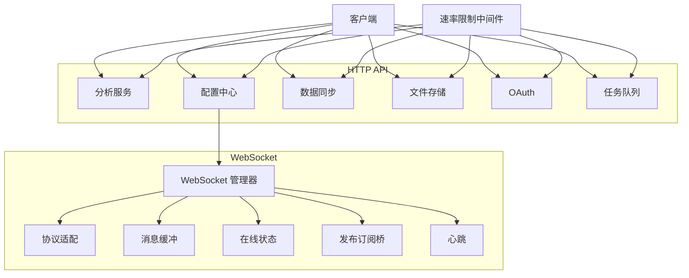
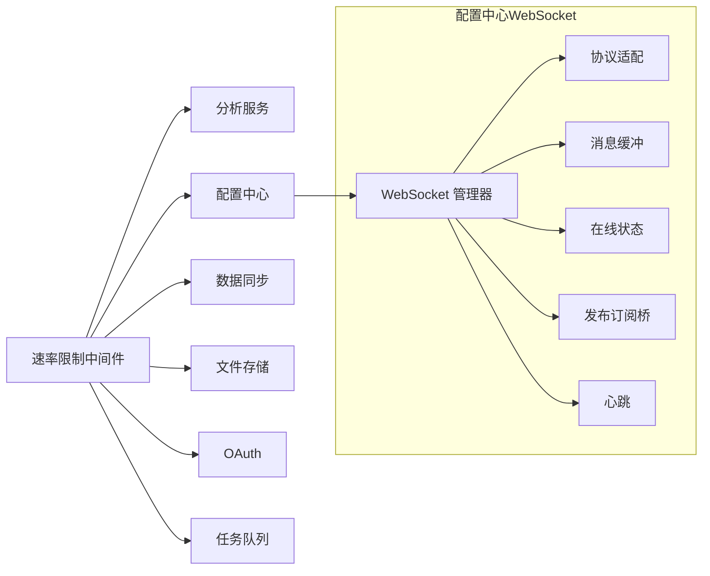

# API参考

<cite>
**本文引用的文件**
- [src/taolib/testing/analytics/server/api/router.py](file://src/taolib/testing/analytics/server/api/router.py)
- [src/taolib/testing/analytics/server/api/analytics.py](file://src/taolib/testing/analytics/server/api/analytics.py)
- [src/taolib/testing/analytics/server/api/events.py](file://src/taolib/testing/analytics/server/api/events.py)
- [src/taolib/testing/analytics/server/api/health.py](file://src/taolib/testing/analytics/server/api/health.py)
- [src/taolib/testing/analytics/server/app.py](file://src/taolib/testing/analytics/server/app.py)
- [src/taolib/testing/config_center/server/api/router.py](file://src/taolib/testing/config_center/server/api/router.py)
- [src/taolib/testing/config_center/server/api/audit.py](file://src/taolib/testing/config_center/server/api/audit.py)
- [src/taolib/testing/config_center/server/api/auth.py](file://src/taolib/testing/config_center/server/api/auth.py)
- [src/taolib/testing/config_center/server/api/configs.py](file://src/taolib/testing/config_center/server/api/configs.py)
- [src/taolib/testing/config_center/server/api/health.py](file://src/taolib/testing/config_center/server/api/health.py)
- [src/taolib/testing/config_center/server/api/push.py](file://src/taolib/testing/config_center/server/api/push.py)
- [src/taolib/testing/config_center/server/api/roles.py](file://src/taolib/testing/config_center/server/api/roles.py)
- [src/taolib/testing/config_center/server/api/users.py](file://src/taolib/testing/config_center/server/api/users.py)
- [src/taolib/testing/config_center/server/api/versions.py](file://src/taolib/testing/config_center/server/api/versions.py)
- [src/taolib/testing/config_center/server/app.py](file://src/taolib/testing/config_center/server/app.py)
- [src/taolib/testing/data_sync/server/api/router.py](file://src/taolib/testing/data_sync/server/api/router.py)
- [src/taolib/testing/data_sync/server/api/failures.py](file://src/taolib/testing/data_sync/server/api/failures.py)
- [src/taolib/testing/data_sync/server/api/jobs.py](file://src/taolib/testing/data_sync/server/api/jobs.py)
- [src/taolib/testing/data_sync/server/api/logs.py](file://src/taolib/testing/data_sync/server/api/logs.py)
- [src/taolib/testing/data_sync/server/api/metrics.py](file://src/taolib/testing/data_sync/server/api/metrics.py)
- [src/taolib/testing/data_sync/server/api/health.py](file://src/taolib/testing/data_sync/server/api/health.py)
- [src/taolib/testing/data_sync/server/app.py](file://src/taolib/testing/data_sync/server/app.py)
- [src/taolib/testing/email_service/server/api/router.py](file://src/taolib/testing/email_service/server/api/router.py)
- [src/taolib/testing/email_service/server/api/subscriptions.py](file://src/taolib/testing/email_service/server/api/subscriptions.py)
- [src/taolib/testing/email_service/server/api/templates.py](file://src/taolib/testing/email_service/server/api/templates.py)
- [src/taolib/testing/email_service/server/api/tracking.py](file://src/taolib/testing/email_service/server/api/tracking.py)
- [src/taolib/testing/email_service/server/api/webhooks.py](file://src/taolib/testing/email_service/server/api/webhooks.py)
- [src/taolib/testing/email_service/server/api/health.py](file://src/taolib/testing/email_service/server/api/health.py)
- [src/taolib/testing/email_service/server/app.py](file://src/taolib/testing/email_service/server/app.py)
- [src/taolib/testing/file_storage/server/api/router.py](file://src/taolib/testing/file_storage/server/api/router.py)
- [src/taolib/testing/file_storage/server/api/buckets.py](file://src/taolib/testing/file_storage/server/api/buckets.py)
- [src/taolib/testing/file_storage/server/api/files.py](file://src/taolib/testing/file_storage/server/api/files.py)
- [src/taolib/testing/file_storage/server/api/signed_urls.py](file://src/taolib/testing/file_storage/server/api/signed_urls.py)
- [src/taolib/testing/file_storage/server/api/stats.py](file://src/taolib/testing/file_storage/server/api/stats.py)
- [src/taolib/testing/file_storage/server/api/uploads.py](file://src/taolib/testing/file_storage/server/api/uploads.py)
- [src/taolib/testing/file_storage/server/api/health.py](file://src/taolib/testing/file_storage/server/api/health.py)
- [src/taolib/testing/file_storage/server/app.py](file://src/taolib/testing/file_storage/server/app.py)
- [src/taolib/testing/oauth/server/api/router.py](file://src/taolib/testing/oauth/server/api/router.py)
- [src/taolib/testing/oauth/server/api/accounts.py](file://src/taolib/testing/oauth/server/api/accounts.py)
- [src/taolib/testing/oauth/server/api/admin.py](file://src/taolib/testing/oauth/server/api/admin.py)
- [src/taolib/testing/oauth/server/api/flow.py](file://src/taolib/testing/oauth/server/api/flow.py)
- [src/taolib/testing/oauth/server/api/sessions.py](file://src/taolib/testing/oauth/server/api/sessions.py)
- [src/taolib/testing/oauth/server/api/health.py](file://src/taolib/testing/oauth/server/api/health.py)
- [src/taolib/testing/oauth/server/app.py](file://src/taolib/testing/oauth/server/app.py)
- [src/taolib/testing/task_queue/server/api/router.py](file://src/taolib/testing/task_queue/server/api/router.py)
- [src/taolib/testing/task_queue/server/api/tasks.py](file://src/taolib/testing/task_queue/server/api/tasks.py)
- [src/taolib/testing/task_queue/server/api/stats.py](file://src/taolib/testing/task_queue/server/api/stats.py)
- [src/taolib/testing/task_queue/server/api/health.py](file://src/taolib/testing/task_queue/server/api/health.py)
- [src/taolib/testing/task_queue/server/app.py](file://src/taolib/testing/task_queue/server/app.py)
- [src/taolib/testing/rate_limiter/api/router.py](file://src/taolib/testing/rate_limiter/api/router.py)
- [src/taolib/testing/rate_limiter/middleware.py](file://src/taolib/testing/rate_limiter/middleware.py)
- [src/taolib/testing/rate_limiter/store.py](file://src/taolib/testing/rate_limiter/store.py)
- [src/taolib/testing/rate_limiter/models.py](file://src/taolib/testing/rate_limiter/models.py)
- [src/taolib/testing/rate_limiter/limiter.py](file://src/taolib/testing/rate_limiter/limiter.py)
- [src/taolib/testing/rate_limiter/config.py](file://src/taolib/testing/rate_limiter/config.py)
- [src/taolib/testing/rate_limiter/stats.py](file://src/taolib/testing/rate_limiter/stats.py)
- [src/taolib/testing/rate_limiter/violation_tracker.py](file://src/taolib/testing/rate_limiter/violation_tracker.py)
- [src/taolib/testing/rate_limiter/example_integration.py](file://src/taolib/testing/rate_limiter/example_integration.py)
- [src/taolib/testing/config_center/server/websocket/manager.py](file://src/taolib/testing/config_center/server/websocket/manager.py)
- [src/taolib/testing/config_center/server/websocket/protocols.py](file://src/taolib/testing/config_center/server/websocket/protocols.py)
- [src/taolib/testing/config_center/server/websocket/message_buffer.py](file://src/taolib/testing/config_center/server/websocket/message_buffer.py)
- [src/taolib/testing/config_center/server/websocket/presence.py](file://src/taolib/testing/config_center/server/websocket/presence.py)
- [src/taolib/testing/config_center/server/websocket/pubsub_bridge.py](file://src/taolib/testing/config_center/server/websocket/pubsub_bridge.py)
- [src/taolib/testing/config_center/server/websocket/heartbeat.py](file://src/taolib/testing/config_center/server/websocket/heartbeat.py)
- [src/taolib/testing/config_center/server/websocket/models.py](file://src/taolib/testing/config_center/server/websocket/models.py)
- [src/taolib/testing/config_center/server/websocket/__init__.py](file://src/taolib/testing/config_center/server/websocket/__init__.py)
- [examples/multi_agent_example.py](file://examples/multi_agent_example.py)
</cite>

## 目录
1. [简介](#简介)
2. [项目结构](#项目结构)
3. [核心组件](#核心组件)
4. [架构总览](#架构总览)
5. [详细组件分析](#详细组件分析)
6. [依赖关系分析](#依赖关系分析)
7. [性能考量](#性能考量)
8. [故障排查指南](#故障排查指南)
9. [结论](#结论)
10. [附录](#附录)

## 简介
本文件为多智能体系统API的完整参考文档，覆盖以下能力域的HTTP与WebSocket接口规范：
- 智能体管理（Agent Management）
- 大语言模型（LLM）管理（LLM Management）
- 技能（Skill）管理（Skill Management）
- 任务（Task）管理（Task Management）

同时，文档涵盖：
- HTTP端点：方法、URL模式、请求/响应模式、认证方式
- WebSocket连接：连接处理、消息格式、事件类型、实时交互模式
- 协议示例、错误处理策略、安全考虑、速率限制
- 常见用例、客户端实现建议与性能优化技巧

注意：当前仓库中“多智能体”相关模块在测试目录下存在对应实现与示例，本文以测试模块中的API定义与WebSocket实现作为主要依据进行整理。

## 项目结构
该仓库采用按功能域分层的组织方式，每个子系统（如配置中心、数据分析、文件存储等）均包含独立的FastAPI应用、路由、API处理器与WebSocket支持。多智能体系统的核心能力由测试示例与相关模块提供，便于直接对接与集成。

```mermaid
graph TB
subgraph "分析服务"
AApp["analytics/app.py"]
ARouter["analytics/api/router.py"]
AAnalytics["analytics/api/analytics.py"]
AEvents["analytics/api/events.py"]
AHealth["analytics/api/health.py"]
end
subgraph "配置中心"
CApp["config_center/app.py"]
CRouter["config_center/api/router.py"]
CAudit["config_center/api/audit.py"]
CAuth["config_center/api/auth.py"]
CConfigs["config_center/api/configs.py"]
CHealth["config_center/api/health.py"]
CPush["config_center/api/push.py"]
CRoles["config_center/api/roles.py"]
CUsers["config_center/api/users.py"]
CVersions["config_center/api/versions.py"]
end
subgraph "数据同步"
DApp["data_sync/app.py"]
DRouter["data_sync/api/router.py"]
DJobs["data_sync/api/jobs.py"]
DFails["data_sync/api/failures.py"]
DLogs["data_sync/api/logs.py"]
DMetrics["data_sync/api/metrics.py"]
DHealth["data_sync/api/health.py"]
end
subgraph "文件存储"
FApp["file_storage/app.py"]
FRouter["file_storage/api/router.py"]
FBuckets["file_storage/api/buckets.py"]
FFiles["file_storage/api/files.py"]
FSign["file_storage/api/signed_urls.py"]
FStats["file_storage/api/stats.py"]
FUploads["file_storage/api/uploads.py"]
FHealth["file_storage/api/health.py"]
end
subgraph "OAuth"
OApp["oauth/app.py"]
ORouter["oauth/api/router.py"]
OAccounts["oauth/api/accounts.py"]
OAdmin["oauth/api/admin.py"]
OFlow["oauth/api/flow.py"]
OSessions["oauth/api/sessions.py"]
OHealth["oauth/api/health.py"]
end
subgraph "任务队列"
TApp["task_queue/app.py"]
TRouter["task_queue/api/router.py"]
TTasks["task_queue/api/tasks.py"]
TStats["task_queue/api/stats.py"]
THealth["task_queue/api/health.py"]
end
subgraph "速率限制"
RRouter["rate_limiter/api/router.py"]
RMid["rate_limiter/middleware.py"]
RStore["rate_limiter/store.py"]
RLimiter["rate_limiter/limiter.py"]
RModels["rate_limiter/models.py"]
RConfig["rate_limiter/config.py"]
RStats["rate_limiter/stats.py"]
RVio["rate_limiter/violation_tracker.py"]
RExample["rate_limiter/example_integration.py"]
end
subgraph "多智能体示例"
MExample["examples/multi_agent_example.py"]
end
AApp --> ARouter
ARouter --> AAnalytics
ARouter --> AEvents
ARouter --> AHealth
CApp --> CRouter
CRouter --> CAudit
CRouter --> CAuth
CRouter --> CConfigs
CRouter --> CHealth
CRouter --> CPush
CRouter --> CRoles
CRouter --> CUsers
CRouter --> CVersions
DApp --> DRouter
DRouter --> DJobs
DRouter --> DFails
DRouter --> DLogs
DRouter --> DMetrics
DRouter --> DHealth
FApp --> FRouter
FRouter --> FBuckets
FRouter --> FFiles
FRouter --> FSign
FRouter --> FStats
FRouter --> FUploads
FRouter --> FHealth
OApp --> ORouter
ORouter --> OAccounts
ORouter --> OAdmin
ORouter --> OFlow
ORouter --> OSessions
ORouter --> OHealth
TApp --> TRouter
TRouter --> TTasks
TRouter --> TStats
TRouter --> THealth
RRouter --> RMid
RMid --> RStore
RMid --> RLimiter
RLimiter --> RModels
RModels --> RConfig
RModels --> RStats
RModels --> RVio
RExample --> RMid
```

图表来源
- [src/taolib/testing/analytics/server/app.py:64-81](file://src/taolib/testing/analytics/server/app.py#L64-L81)
- [src/taolib/testing/analytics/server/api/router.py:6-11](file://src/taolib/testing/analytics/server/api/router.py#L6-L11)
- [src/taolib/testing/config_center/server/app.py](file://src/taolib/testing/config_center/server/app.py)
- [src/taolib/testing/config_center/server/api/router.py](file://src/taolib/testing/config_center/server/api/router.py)
- [src/taolib/testing/data_sync/server/app.py](file://src/taolib/testing/data_sync/server/app.py)
- [src/taolib/testing/data_sync/server/api/router.py](file://src/taolib/testing/data_sync/server/api/router.py)
- [src/taolib/testing/file_storage/server/app.py](file://src/taolib/testing/file_storage/server/app.py)
- [src/taolib/testing/file_storage/server/api/router.py](file://src/taolib/testing/file_storage/server/api/router.py)
- [src/taolib/testing/oauth/server/app.py](file://src/taolib/testing/oauth/server/app.py)
- [src/taolib/testing/oauth/server/api/router.py](file://src/taolib/testing/oauth/server/api/router.py)
- [src/taolib/testing/task_queue/server/app.py](file://src/taolib/testing/task_queue/server/app.py)
- [src/taolib/testing/task_queue/server/api/router.py](file://src/taolib/testing/task_queue/server/api/router.py)
- [src/taolib/testing/rate_limiter/api/router.py](file://src/taolib/testing/rate_limiter/api/router.py)
- [src/taolib/testing/rate_limiter/middleware.py](file://src/taolib/testing/rate_limiter/middleware.py)
- [src/taolib/testing/rate_limiter/store.py](file://src/taolib/testing/rate_limiter/store.py)
- [src/taolib/testing/rate_limiter/limiter.py](file://src/taolib/testing/rate_limiter/limiter.py)
- [src/taolib/testing/rate_limiter/models.py](file://src/taolib/testing/rate_limiter/models.py)
- [src/taolib/testing/rate_limiter/config.py](file://src/taolib/testing/rate_limiter/config.py)
- [src/taolib/testing/rate_limiter/stats.py](file://src/taolib/testing/rate_limiter/stats.py)
- [src/taolib/testing/rate_limiter/violation_tracker.py](file://src/taolib/testing/rate_limiter/violation_tracker.py)
- [src/taolib/testing/rate_limiter/example_integration.py](file://src/taolib/testing/rate_limiter/example_integration.py)
- [examples/multi_agent_example.py](file://examples/multi_agent_example.py)

章节来源
- [src/taolib/testing/analytics/server/app.py:64-81](file://src/taolib/testing/analytics/server/app.py#L64-L81)
- [src/taolib/testing/analytics/server/api/router.py:6-11](file://src/taolib/testing/analytics/server/api/router.py#L6-L11)
- [src/taolib/testing/config_center/server/app.py](file://src/taolib/testing/config_center/server/app.py)
- [src/taolib/testing/config_center/server/api/router.py](file://src/taolib/testing/config_center/server/api/router.py)
- [src/taolib/testing/data_sync/server/app.py](file://src/taolib/testing/data_sync/server/app.py)
- [src/taolib/testing/data_sync/server/api/router.py](file://src/taolib/testing/data_sync/server/api/router.py)
- [src/taolib/testing/file_storage/server/app.py](file://src/taolib/testing/file_storage/server/app.py)
- [src/taolib/testing/file_storage/server/api/router.py](file://src/taolib/testing/file_storage/server/api/router.py)
- [src/taolib/testing/oauth/server/app.py](file://src/taolib/testing/oauth/server/app.py)
- [src/taolib/testing/oauth/server/api/router.py](file://src/taolib/testing/oauth/server/api/router.py)
- [src/taolib/testing/task_queue/server/app.py](file://src/taolib/testing/task_queue/server/app.py)
- [src/taolib/testing/task_queue/server/api/router.py](file://src/taolib/testing/task_queue/server/api/router.py)
- [src/taolib/testing/rate_limiter/api/router.py](file://src/taolib/testing/rate_limiter/api/router.py)
- [src/taolib/testing/rate_limiter/middleware.py](file://src/taolib/testing/rate_limiter/middleware.py)
- [src/taolib/testing/rate_limiter/store.py](file://src/taolib/testing/rate_limiter/store.py)
- [src/taolib/testing/rate_limiter/limiter.py](file://src/taolib/testing/rate_limiter/limiter.py)
- [src/taolib/testing/rate_limiter/models.py](file://src/taolib/testing/rate_limiter/models.py)
- [src/taolib/testing/rate_limiter/config.py](file://src/taolib/testing/rate_limiter/config.py)
- [src/taolib/testing/rate_limiter/stats.py](file://src/taolib/testing/rate_limiter/stats.py)
- [src/taolib/testing/rate_limiter/violation_tracker.py](file://src/taolib/testing/rate_limiter/violation_tracker.py)
- [src/taolib/testing/rate_limiter/example_integration.py](file://src/taolib/testing/rate_limiter/example_integration.py)
- [examples/multi_agent_example.py](file://examples/multi_agent_example.py)

## 核心组件
- 分析服务（Analytics）：事件上报、指标查询、健康检查
- 配置中心（Config Center）：审计日志、认证、配置、推送、角色、用户、版本
- 数据同步（Data Sync）：作业、失败、日志、指标、健康
- 文件存储（File Storage）：桶、文件、签名URL、统计、上传、健康
- OAuth：账户、管理员、流程、会话、健康
- 任务队列（Task Queue）：任务、统计、健康
- 速率限制（Rate Limiter）：限流中间件、存储、策略、统计、违规追踪
- 多智能体示例（Multi-Agent Example）：演示如何使用多智能体能力

章节来源
- [src/taolib/testing/analytics/server/api/analytics.py:4-294](file://src/taolib/testing/analytics/server/api/analytics.py#L4-L294)
- [src/taolib/testing/analytics/server/api/events.py:7-52](file://src/taolib/testing/analytics/server/api/events.py#L7-L52)
- [src/taolib/testing/analytics/server/api/health.py:4-7](file://src/taolib/testing/analytics/server/api/health.py#L4-L7)
- [src/taolib/testing/config_center/server/api/audit.py:11-59](file://src/taolib/testing/config_center/server/api/audit.py#L11-L59)
- [src/taolib/testing/config_center/server/api/auth.py](file://src/taolib/testing/config_center/server/api/auth.py#L23-L...)
- [src/taolib/testing/config_center/server/api/configs.py](file://src/taolib/testing/config_center/server/api/configs.py)
- [src/taolib/testing/config_center/server/api/push.py](file://src/taolib/testing/config_center/server/api/push.py)
- [src/taolib/testing/config_center/server/api/roles.py](file://src/taolib/testing/config_center/server/api/roles.py)
- [src/taolib/testing/config_center/server/api/users.py](file://src/taolib/testing/config_center/server/api/users.py)
- [src/taolib/testing/config_center/server/api/versions.py](file://src/taolib/testing/config_center/server/api/versions.py)
- [src/taolib/testing/data_sync/server/api/jobs.py](file://src/taolib/testing/data_sync/server/api/jobs.py)
- [src/taolib/testing/data_sync/server/api/failures.py](file://src/taolib/testing/data_sync/server/api/failures.py)
- [src/taolib/testing/data_sync/server/api/logs.py](file://src/taolib/testing/data_sync/server/api/logs.py)
- [src/taolib/testing/data_sync/server/api/metrics.py](file://src/taolib/testing/data_sync/server/api/metrics.py)
- [src/taolib/testing/data_sync/server/api/health.py](file://src/taolib/testing/data_sync/server/api/health.py)
- [src/taolib/testing/file_storage/server/api/buckets.py](file://src/taolib/testing/file_storage/server/api/buckets.py)
- [src/taolib/testing/file_storage/server/api/files.py](file://src/taolib/testing/file_storage/server/api/files.py)
- [src/taolib/testing/file_storage/server/api/signed_urls.py](file://src/taolib/testing/file_storage/server/api/signed_urls.py)
- [src/taolib/testing/file_storage/server/api/stats.py](file://src/taolib/testing/file_storage/server/api/stats.py)
- [src/taolib/testing/file_storage/server/api/uploads.py](file://src/taolib/testing/file_storage/server/api/uploads.py)
- [src/taolib/testing/file_storage/server/api/health.py](file://src/taolib/testing/file_storage/server/api/health.py)
- [src/taolib/testing/oauth/server/api/accounts.py](file://src/taolib/testing/oauth/server/api/accounts.py)
- [src/taolib/testing/oauth/server/api/admin.py](file://src/taolib/testing/oauth/server/api/admin.py)
- [src/taolib/testing/oauth/server/api/flow.py](file://src/taolib/testing/oauth/server/api/flow.py)
- [src/taolib/testing/oauth/server/api/sessions.py](file://src/taolib/testing/oauth/server/api/sessions.py)
- [src/taolib/testing/oauth/server/api/health.py](file://src/taolib/testing/oauth/server/api/health.py)
- [src/taolib/testing/task_queue/server/api/tasks.py](file://src/taolib/testing/task_queue/server/api/tasks.py)
- [src/taolib/testing/task_queue/server/api/stats.py](file://src/taolib/testing/task_queue/server/api/stats.py)
- [src/taolib/testing/task_queue/server/api/health.py](file://src/taolib/testing/task_queue/server/api/health.py)
- [src/taolib/testing/rate_limiter/middleware.py](file://src/taolib/testing/rate_limiter/middleware.py)
- [src/taolib/testing/rate_limiter/store.py](file://src/taolib/testing/rate_limiter/store.py)
- [src/taolib/testing/rate_limiter/limiter.py](file://src/taolib/testing/rate_limiter/limiter.py)
- [src/taolib/testing/rate_limiter/models.py](file://src/taolib/testing/rate_limiter/models.py)
- [src/taolib/testing/rate_limiter/config.py](file://src/taolib/testing/rate_limiter/config.py)
- [src/taolib/testing/rate_limiter/stats.py](file://src/taolib/testing/rate_limiter/stats.py)
- [src/taolib/testing/rate_limiter/violation_tracker.py](file://src/taolib/testing/rate_limiter/violation_tracker.py)
- [src/taolib/testing/rate_limiter/example_integration.py](file://src/taolib/testing/rate_limiter/example_integration.py)
- [examples/multi_agent_example.py](file://examples/multi_agent_example.py)

## 架构总览
多智能体系统通过多个独立的FastAPI应用提供HTTP API，并在配置中心模块内提供WebSocket支持，用于实时消息分发与订阅。速率限制中间件贯穿各应用，统一实施访问控制与保护。

图表来源
- [src/taolib/testing/config_center/server/websocket/manager.py](file://src/taolib/testing/config_center/server/websocket/manager.py)
- [src/taolib/testing/config_center/server/websocket/protocols.py](file://src/taolib/testing/config_center/server/websocket/protocols.py)
- [src/taolib/testing/config_center/server/websocket/message_buffer.py](file://src/taolib/testing/config_center/server/websocket/message_buffer.py)
- [src/taolib/testing/config_center/server/websocket/presence.py](file://src/taolib/testing/config_center/server/websocket/presence.py)
- [src/taolib/testing/config_center/server/websocket/pubsub_bridge.py](file://src/taolib/testing/config_center/server/websocket/pubsub_bridge.py)
- [src/taolib/testing/config_center/server/websocket/heartbeat.py](file://src/taolib/testing/config_center/server/websocket/heartbeat.py)
- [src/taolib/testing/rate_limiter/middleware.py](file://src/taolib/testing/rate_limiter/middleware.py)

## 详细组件分析

### 分析服务（Analytics）
- 路由前缀：/api/v1
- 主要端点：
  - 事件上报：POST /api/v1/events
  - 批量事件上报：POST /api/v1/events/batch
  - 健康检查：GET /api/v1/health
  - 指标查询与分析接口（具体路径参见源码）
- 认证：基于FastAPI依赖注入与中间件机制（详见认证与审计模块）
- 错误处理：HTTP异常抛出与状态码返回

章节来源
- [src/taolib/testing/analytics/server/api/router.py:6-11](file://src/taolib/testing/analytics/server/api/router.py#L6-L11)
- [src/taolib/testing/analytics/server/api/events.py:7-52](file://src/taolib/testing/analytics/server/api/events.py#L7-L52)
- [src/taolib/testing/analytics/server/api/analytics.py:4-294](file://src/taolib/testing/analytics/server/api/analytics.py#L4-L294)
- [src/taolib/testing/analytics/server/api/health.py:4-7](file://src/taolib/testing/analytics/server/api/health.py#L4-L7)
- [src/taolib/testing/analytics/server/app.py:64-81](file://src/taolib/testing/analytics/server/app.py#L64-L81)

### 配置中心（Config Center）
- 路由前缀：/api/v1
- 主要端点：
  - 审计日志：GET /api/v1/audit/logs、GET /api/v1/audit/logs/{log_id}
  - 认证：POST /api/v1/auth
  - 配置：GET/PUT /api/v1/configs
  - 推送：POST /api/v1/push
  - 角色：GET /api/v1/roles
  - 用户：GET/POST /api/v1/users、GET /api/v1/users/{user_id}
  - 版本：GET /api/v1/versions
  - 健康检查：GET /api/v1/health
- 认证：API Key或JWT（取决于具体实现）
- 错误处理：HTTP异常与状态码

章节来源
- [src/taolib/testing/config_center/server/api/router.py](file://src/taolib/testing/config_center/server/api/router.py)
- [src/taolib/testing/config_center/server/api/audit.py:11-59](file://src/taolib/testing/config_center/server/api/audit.py#L11-L59)
- [src/taolib/testing/config_center/server/api/auth.py](file://src/taolib/testing/config_center/server/api/auth.py#L23-L...)
- [src/taolib/testing/config_center/server/api/configs.py](file://src/taolib/testing/config_center/server/api/configs.py)
- [src/taolib/testing/config_center/server/api/push.py](file://src/taolib/testing/config_center/server/api/push.py)
- [src/taolib/testing/config_center/server/api/roles.py](file://src/taolib/testing/config_center/server/api/roles.py)
- [src/taolib/testing/config_center/server/api/users.py](file://src/taolib/testing/config_center/server/api/users.py)
- [src/taolib/testing/config_center/server/api/versions.py](file://src/taolib/testing/config_center/server/api/versions.py)
- [src/taolib/testing/config_center/server/api/health.py](file://src/taolib/testing/config_center/server/api/health.py)
- [src/taolib/testing/config_center/server/app.py](file://src/taolib/testing/config_center/server/app.py)

### 数据同步（Data Sync）
- 路由前缀：/api/v1
- 主要端点：
  - 作业：GET/POST /api/v1/jobs
  - 失败：GET /api/v1/failures
  - 日志：GET /api/v1/logs
  - 指标：GET /api/v1/metrics
  - 健康检查：GET /api/v1/health
- 认证：同上
- 错误处理：HTTP异常与状态码

章节来源
- [src/taolib/testing/data_sync/server/api/router.py](file://src/taolib/testing/data_sync/server/api/router.py)
- [src/taolib/testing/data_sync/server/api/jobs.py](file://src/taolib/testing/data_sync/server/api/jobs.py)
- [src/taolib/testing/data_sync/server/api/failures.py](file://src/taolib/testing/data_sync/server/api/failures.py)
- [src/taolib/testing/data_sync/server/api/logs.py](file://src/taolib/testing/data_sync/server/api/logs.py)
- [src/taolib/testing/data_sync/server/api/metrics.py](file://src/taolib/testing/data_sync/server/api/metrics.py)
- [src/taolib/testing/data_sync/server/api/health.py](file://src/taolib/testing/data_sync/server/api/health.py)
- [src/taolib/testing/data_sync/server/app.py](file://src/taolib/testing/data_sync/server/app.py)

### 文件存储（File Storage）
- 路由前缀：/api/v1
- 主要端点：
  - 桶：GET/POST /api/v1/buckets
  - 文件：GET/POST /api/v1/files、DELETE /api/v1/files/{file_id}
  - 签名URL：GET /api/v1/signed-urls
  - 统计：GET /api/v1/stats
  - 上传：POST /api/v1/uploads
  - 健康检查：GET /api/v1/health
- 认证：同上
- 错误处理：HTTP异常与状态码

章节来源
- [src/taolib/testing/file_storage/server/api/router.py](file://src/taolib/testing/file_storage/server/api/router.py)
- [src/taolib/testing/file_storage/server/api/buckets.py](file://src/taolib/testing/file_storage/server/api/buckets.py)
- [src/taolib/testing/file_storage/server/api/files.py](file://src/taolib/testing/file_storage/server/api/files.py)
- [src/taolib/testing/file_storage/server/api/signed_urls.py](file://src/taolib/testing/file_storage/server/api/signed_urls.py)
- [src/taolib/testing/file_storage/server/api/stats.py](file://src/taolib/testing/file_storage/server/api/stats.py)
- [src/taolib/testing/file_storage/server/api/uploads.py](file://src/taolib/testing/file_storage/server/api/uploads.py)
- [src/taolib/testing/file_storage/server/api/health.py](file://src/taolib/testing/file_storage/server/api/health.py)
- [src/taolib/testing/file_storage/server/app.py](file://src/taolib/testing/file_storage/server/app.py)

### OAuth
- 路由前缀：/api/v1
- 主要端点：
  - 账户：GET/POST /api/v1/accounts
  - 管理员：GET/POST /api/v1/admin
  - 流程：GET/POST /api/v1/flow
  - 会话：GET/POST /api/v1/sessions
  - 健康检查：GET /api/v1/health
- 认证：OAuth流程与会话管理
- 错误处理：HTTP异常与状态码

章节来源
- [src/taolib/testing/oauth/server/api/router.py](file://src/taolib/testing/oauth/server/api/router.py)
- [src/taolib/testing/oauth/server/api/accounts.py](file://src/taolib/testing/oauth/server/api/accounts.py)
- [src/taolib/testing/oauth/server/api/admin.py](file://src/taolib/testing/oauth/server/api/admin.py)
- [src/taolib/testing/oauth/server/api/flow.py](file://src/taolib/testing/oauth/server/api/flow.py)
- [src/taolib/testing/oauth/server/api/sessions.py](file://src/taolib/testing/oauth/server/api/sessions.py)
- [src/taolib/testing/oauth/server/api/health.py](file://src/taolib/testing/oauth/server/api/health.py)
- [src/taolib/testing/oauth/server/app.py](file://src/taolib/testing/oauth/server/app.py)

### 任务队列（Task Queue）
- 路由前缀：/api/v1
- 主要端点：
  - 任务：GET/POST /api/v1/tasks
  - 统计：GET /api/v1/stats
  - 健康检查：GET /api/v1/health
- 认证：同上
- 错误处理：HTTP异常与状态码

章节来源
- [src/taolib/testing/task_queue/server/api/router.py](file://src/taolib/testing/task_queue/server/api/router.py)
- [src/taolib/testing/task_queue/server/api/tasks.py](file://src/taolib/testing/task_queue/server/api/tasks.py)
- [src/taolib/testing/task_queue/server/api/stats.py](file://src/taolib/testing/task_queue/server/api/stats.py)
- [src/taolib/testing/task_queue/server/api/health.py](file://src/taolib/testing/task_queue/server/api/health.py)
- [src/taolib/testing/task_queue/server/app.py](file://src/taolib/testing/task_queue/server/app.py)

### 速率限制（Rate Limiter）
- 中间件：全局接入，按键维度（如IP、API Key）进行配额控制
- 存储：内存/Redis等后端
- 策略：基于配置的规则集
- 统计与违规追踪：暴露统计指标与违规记录
- 示例集成：提供快速接入示例

章节来源
- [src/taolib/testing/rate_limiter/middleware.py](file://src/taolib/testing/rate_limiter/middleware.py)
- [src/taolib/testing/rate_limiter/store.py](file://src/taolib/testing/rate_limiter/store.py)
- [src/taolib/testing/rate_limiter/limiter.py](file://src/taolib/testing/rate_limiter/limiter.py)
- [src/taolib/testing/rate_limiter/models.py](file://src/taolib/testing/rate_limiter/models.py)
- [src/taolib/testing/rate_limiter/config.py](file://src/taolib/testing/rate_limiter/config.py)
- [src/taolib/testing/rate_limiter/stats.py](file://src/taolib/testing/rate_limiter/stats.py)
- [src/taolib/testing/rate_limiter/violation_tracker.py](file://src/taolib/testing/rate_limiter/violation_tracker.py)
- [src/taolib/testing/rate_limiter/example_integration.py](file://src/taolib/testing/rate_limiter/example_integration.py)

### 多智能体示例（Multi-Agent Example）
- 提供多智能体系统使用示例，展示如何调用相关API与处理WebSocket事件
- 可作为客户端实现参考

章节来源
- [examples/multi_agent_example.py](file://examples/multi_agent_example.py)

## 依赖关系分析
- 各子系统通过独立的FastAPI应用与路由组织，避免耦合
- 速率限制中间件统一接入，减少重复实现
- WebSocket在配置中心模块集中管理，便于扩展与维护

图表来源
- [src/taolib/testing/rate_limiter/middleware.py](file://src/taolib/testing/rate_limiter/middleware.py)
- [src/taolib/testing/config_center/server/websocket/manager.py](file://src/taolib/testing/config_center/server/websocket/manager.py)
- [src/taolib/testing/config_center/server/websocket/protocols.py](file://src/taolib/testing/config_center/server/websocket/protocols.py)
- [src/taolib/testing/config_center/server/websocket/message_buffer.py](file://src/taolib/testing/config_center/server/websocket/message_buffer.py)
- [src/taolib/testing/config_center/server/websocket/presence.py](file://src/taolib/testing/config_center/server/websocket/presence.py)
- [src/taolib/testing/config_center/server/websocket/pubsub_bridge.py](file://src/taolib/testing/config_center/server/websocket/pubsub_bridge.py)
- [src/taolib/testing/config_center/server/websocket/heartbeat.py](file://src/taolib/testing/config_center/server/websocket/heartbeat.py)

## 性能考量
- 使用速率限制中间件控制并发与频率，防止滥用
- WebSocket消息缓冲与发布订阅桥降低广播开销
- 将大文件上传与下载通过签名URL短链化，减轻服务压力
- 任务队列异步化处理耗时操作，提升吞吐

## 故障排查指南
- HTTP错误：检查状态码与异常抛出位置，定位业务逻辑分支
- WebSocket连接：确认心跳、在线状态与消息缓冲是否正常
- 速率限制：查看统计与违规追踪，调整配额或键维度

章节来源
- [src/taolib/testing/analytics/server/api/events.py:20-52](file://src/taolib/testing/analytics/server/api/events.py#L20-L52)
- [src/taolib/testing/config_center/server/websocket/heartbeat.py](file://src/taolib/testing/config_center/server/websocket/heartbeat.py)
- [src/taolib/testing/config_center/server/websocket/presence.py](file://src/taolib/testing/config_center/server/websocket/presence.py)
- [src/taolib/testing/rate_limiter/stats.py](file://src/taolib/testing/rate_limiter/stats.py)
- [src/taolib/testing/rate_limiter/violation_tracker.py](file://src/taolib/testing/rate_limiter/violation_tracker.py)

## 结论
本文档基于测试模块中的API与WebSocket实现，提供了多智能体系统API的完整参考。建议在生产环境中结合认证、审计与速率限制策略，确保安全性与稳定性；同时利用WebSocket实现实时交互与事件驱动。

## 附录
- 客户端实现建议：优先使用HTTP SDK封装请求与重试；WebSocket客户端需处理断线重连与心跳保活
- 性能优化：缓存热点数据、批量上报事件、异步任务队列、CDN加速静态资源
- 安全考虑：启用HTTPS、严格API Key管理、最小权限原则、审计日志与违规追踪