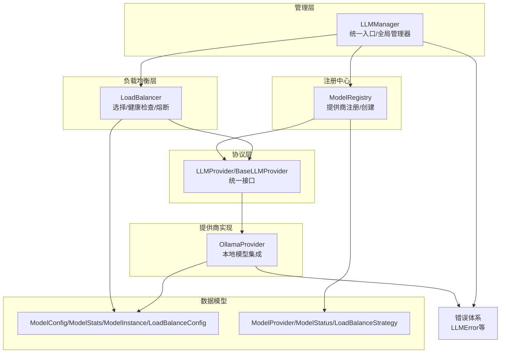
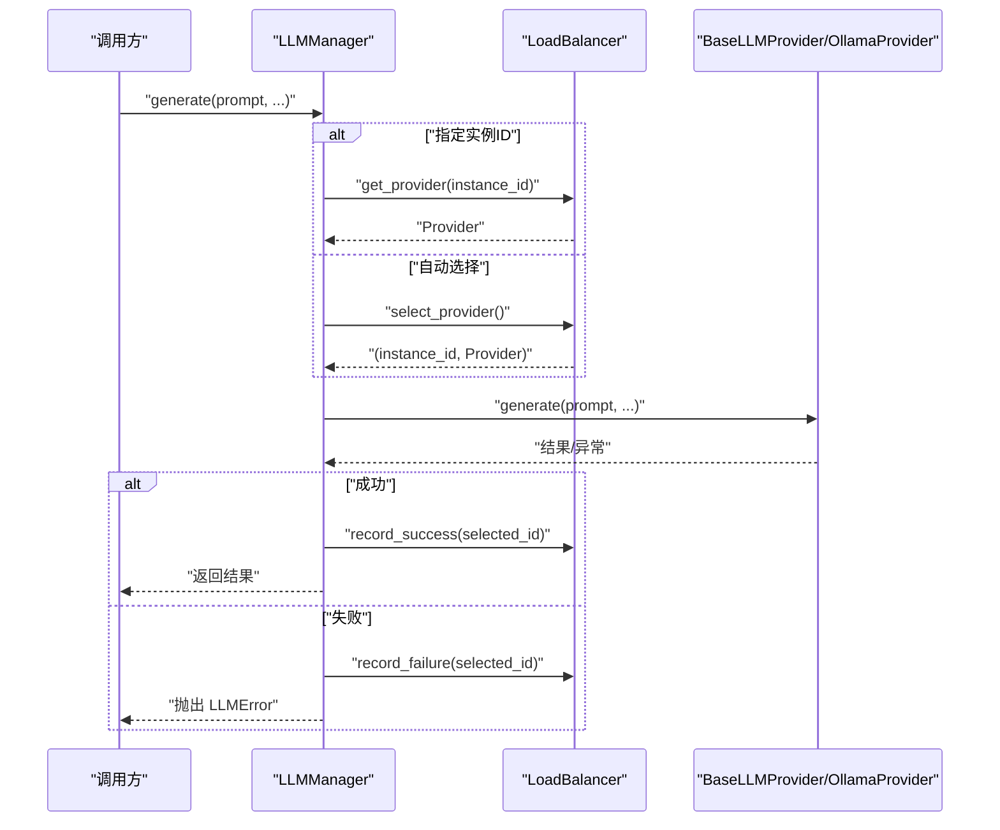
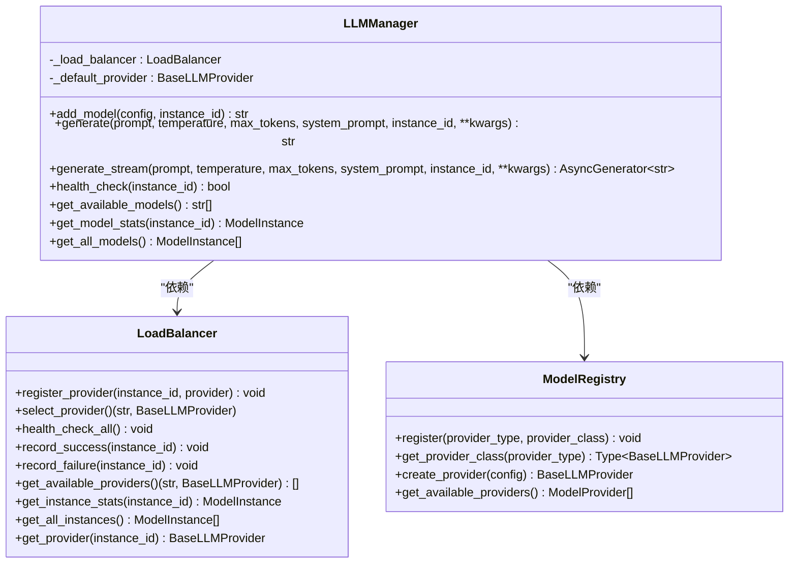
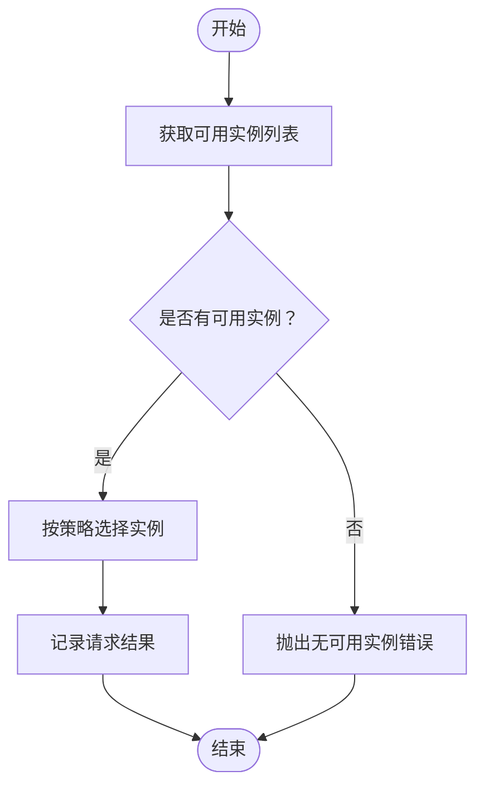
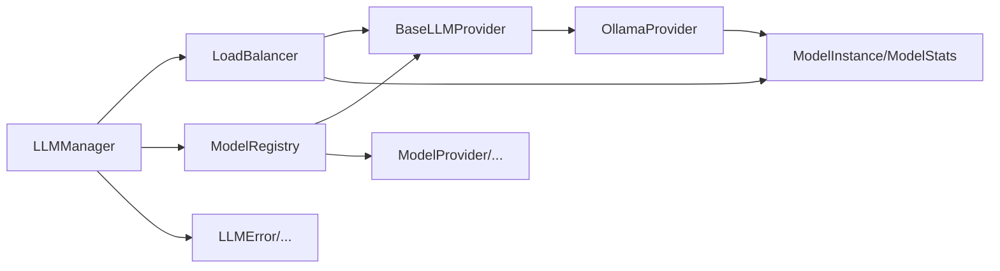

# LLM管理器

<cite>
**本文引用的文件**
- [src/taolib/testing/multi_agent/llm/manager.py](file://src/taolib/testing/multi_agent/llm/manager.py)
- [src/taolib/testing/multi_agent/llm/load_balancer.py](file://src/taolib/testing/multi_agent/llm/load_balancer.py)
- [src/taolib/testing/multi_agent/llm/registry.py](file://src/taolib/testing/multi_agent/llm/registry.py)
- [src/taolib/testing/multi_agent/llm/protocols.py](file://src/taolib/testing/multi_agent/llm/protocols.py)
- [src/taolib/testing/multi_agent/llm/ollama_provider.py](file://src/taolib/testing/multi_agent/llm/ollama_provider.py)
- [src/taolib/testing/multi_agent/models/llm.py](file://src/taolib/testing/multi_agent/models/llm.py)
- [src/taolib/testing/multi_agent/models/enums.py](file://src/taolib/testing/multi_agent/models/enums.py)
- [src/taolib/testing/multi_agent/errors.py](file://src/taolib/testing/multi_agent/errors.py)
- [tests/testing/test_multi_agent/test_llm.py](file://tests/testing/test_multi_agent/test_llm.py)
</cite>

## 目录
1. [简介](#简介)
2. [项目结构](#项目结构)
3. [核心组件](#核心组件)
4. [架构总览](#架构总览)
5. [详细组件分析](#详细组件分析)
6. [依赖关系分析](#依赖关系分析)
7. [性能考量](#性能考量)
8. [故障排查指南](#故障排查指南)
9. [结论](#结论)
10. [附录：API接口文档](#附录api接口文档)

## 简介
本文件为“LLM管理器”的技术文档，聚焦于 LLMManager 类的架构设计与核心功能实现，涵盖以下主题：
- 模型实例管理：添加模型、实例ID生成策略、默认提供者设置
- 配置管理：模型配置、负载均衡配置、统计信息模型
- 状态跟踪：实例状态、健康检查、熔断器与统计更新
- 文本生成与流式生成：参数传递、异常处理、与负载均衡的集成
- 健康检查机制、统计信息收集与全局管理器模式
- 完整API接口文档（方法签名、参数说明、返回值类型）
- 实际使用示例与最佳实践

## 项目结构
围绕 LLM 管理与提供者的模块组织如下：
- 管理层：LLMManager 负责统一入口、实例注册、调用分发与全局管理器
- 负载均衡层：LoadBalancer 负责实例选择、健康检查、熔断与统计
- 注册中心：ModelRegistry 负责提供商类型到实现类的映射与实例创建
- 协议层：LLMProvider/ BaseLLMProvider 定义统一接口与抽象基类
- 提供商实现：以 OllamaProvider 为例展示本地模型集成
- 数据模型：ModelConfig、ModelStats、ModelInstance、LoadBalanceConfig
- 枚举：ModelProvider、ModelStatus、LoadBalanceStrategy
- 错误体系：LLMError、ModelUnavailableError、ModelTimeoutError 等

图表来源
- [src/taolib/testing/multi_agent/llm/manager.py:22-229](file://src/taolib/testing/multi_agent/llm/manager.py#L22-L229)
- [src/taolib/testing/multi_agent/llm/load_balancer.py:21-246](file://src/taolib/testing/multi_agent/llm/load_balancer.py#L21-L246)
- [src/taolib/testing/multi_agent/llm/registry.py:12-73](file://src/taolib/testing/multi_agent/llm/registry.py#L12-L73)
- [src/taolib/testing/multi_agent/llm/protocols.py:12-165](file://src/taolib/testing/multi_agent/llm/protocols.py#L12-L165)
- [src/taolib/testing/multi_agent/llm/ollama_provider.py:22-238](file://src/taolib/testing/multi_agent/llm/ollama_provider.py#L22-L238)
- [src/taolib/testing/multi_agent/models/llm.py:14-68](file://src/taolib/testing/multi_agent/models/llm.py#L14-L68)
- [src/taolib/testing/multi_agent/models/enums.py:72-96](file://src/taolib/testing/multi_agent/models/enums.py#L72-L96)
- [src/taolib/testing/multi_agent/errors.py:13-28](file://src/taolib/testing/multi_agent/errors.py#L13-L28)

章节来源
- [src/taolib/testing/multi_agent/llm/manager.py:1-229](file://src/taolib/testing/multi_agent/llm/manager.py#L1-L229)
- [src/taolib/testing/multi_agent/llm/load_balancer.py:1-246](file://src/taolib/testing/multi_agent/llm/load_balancer.py#L1-L246)
- [src/taolib/testing/multi_agent/llm/registry.py:1-73](file://src/taolib/testing/multi_agent/llm/registry.py#L1-L73)
- [src/taolib/testing/multi_agent/llm/protocols.py:1-165](file://src/taolib/testing/multi_agent/llm/protocols.py#L1-L165)
- [src/taolib/testing/multi_agent/llm/ollama_provider.py:1-238](file://src/taolib/testing/multi_agent/llm/ollama_provider.py#L1-L238)
- [src/taolib/testing/multi_agent/models/llm.py:1-68](file://src/taolib/testing/multi_agent/models/llm.py#L1-L68)
- [src/taolib/testing/multi_agent/models/enums.py:1-96](file://src/taolib/testing/multi_agent/models/enums.py#L1-L96)
- [src/taolib/testing/multi_agent/errors.py:1-107](file://src/taolib/testing/multi_agent/errors.py#L1-L107)

## 核心组件
- LLMManager：统一入口，负责模型添加、文本/流式生成、健康检查、统计查询与全局管理器模式
- LoadBalancer：提供实例选择、健康检查、熔断器与统计记录
- ModelRegistry：提供商类型到实现类的注册与实例创建
- BaseLLMProvider/LLMProvider：统一接口与抽象基类，定义健康检查、同步/流式生成
- OllamaProvider：本地模型提供商实现，基于 HTTP 客户端与 Ollama API
- 数据模型：ModelConfig、ModelStats、ModelInstance、LoadBalanceConfig
- 枚举：ModelProvider、ModelStatus、LoadBalanceStrategy
- 错误体系：LLMError、ModelUnavailableError、ModelTimeoutError 等

章节来源
- [src/taolib/testing/multi_agent/llm/manager.py:22-229](file://src/taolib/testing/multi_agent/llm/manager.py#L22-L229)
- [src/taolib/testing/multi_agent/llm/load_balancer.py:21-246](file://src/taolib/testing/multi_agent/llm/load_balancer.py#L21-L246)
- [src/taolib/testing/multi_agent/llm/registry.py:12-73](file://src/taolib/testing/multi_agent/llm/registry.py#L12-L73)
- [src/taolib/testing/multi_agent/llm/protocols.py:12-165](file://src/taolib/testing/multi_agent/llm/protocols.py#L12-L165)
- [src/taolib/testing/multi_agent/llm/ollama_provider.py:22-238](file://src/taolib/testing/multi_agent/llm/ollama_provider.py#L22-L238)
- [src/taolib/testing/multi_agent/models/llm.py:14-68](file://src/taolib/testing/multi_agent/models/llm.py#L14-L68)
- [src/taolib/testing/multi_agent/models/enums.py:72-96](file://src/taolib/testing/multi_agent/models/enums.py#L72-L96)
- [src/taolib/testing/multi_agent/errors.py:13-28](file://src/taolib/testing/multi_agent/errors.py#L13-L28)

## 架构总览
LLMManager 作为统一入口，内部组合 LoadBalancer 与 ModelRegistry，并通过 BaseLLMProvider 抽象与具体提供商交互。生成流程中，LLMManager 将参数透传给选定的提供商；负载均衡器根据策略选择实例并记录成功/失败；提供商负责健康检查与统计更新。

图表来源
- [src/taolib/testing/multi_agent/llm/manager.py:57-107](file://src/taolib/testing/multi_agent/llm/manager.py#L57-L107)
- [src/taolib/testing/multi_agent/llm/load_balancer.py:155-181](file://src/taolib/testing/multi_agent/llm/load_balancer.py#L155-L181)
- [src/taolib/testing/multi_agent/llm/ollama_provider.py:75-151](file://src/taolib/testing/multi_agent/llm/ollama_provider.py#L75-L151)

## 详细组件分析

### LLMManager 组件分析
职责与关键点：
- 模型添加：add_model 支持自动生成实例ID（格式为“提供商类型-短UUID”），创建提供商并注册到负载均衡器，首次添加时设置默认提供者
- 文本生成：generate 将参数透传至提供商，捕获异常并记录负载均衡统计
- 流式生成：generate_stream 同样透传参数，逐片产出并记录统计
- 健康检查：health_check 支持单实例或全量检查，结合负载均衡器的健康状态
- 统计查询：get_model_stats/get_all_models 返回实例统计与全部实例信息
- 全局管理器：get_llm_manager/set_llm_manager 提供全局单例访问与替换能力

图表来源
- [src/taolib/testing/multi_agent/llm/manager.py:22-229](file://src/taolib/testing/multi_agent/llm/manager.py#L22-L229)
- [src/taolib/testing/multi_agent/llm/load_balancer.py:21-246](file://src/taolib/testing/multi_agent/llm/load_balancer.py#L21-L246)
- [src/taolib/testing/multi_agent/llm/registry.py:12-73](file://src/taolib/testing/multi_agent/llm/registry.py#L12-L73)

章节来源
- [src/taolib/testing/multi_agent/llm/manager.py:22-229](file://src/taolib/testing/multi_agent/llm/manager.py#L22-L229)

### LoadBalancer 组件分析
职责与关键点：
- 注册与实例管理：register_provider 创建 ModelInstance 并初始化熔断器状态
- 可用性筛选：get_available_providers 过滤熔断器开启且未到重置时间的实例
- 选择策略：支持轮询、最少连接、随机、加权随机，默认轮询
- 统计与熔断：record_success/record_failure 更新失败计数与熔断状态；健康检查更新实例状态
- 查询接口：按实例ID获取提供商、统计与全部实例

图表来源
- [src/taolib/testing/multi_agent/llm/load_balancer.py:54-75](file://src/taolib/testing/multi_agent/llm/load_balancer.py#L54-L75)
- [src/taolib/testing/multi_agent/llm/load_balancer.py:155-181](file://src/taolib/testing/multi_agent/llm/load_balancer.py#L155-L181)
- [src/taolib/testing/multi_agent/llm/load_balancer.py:182-205](file://src/taolib/testing/multi_agent/llm/load_balancer.py#L182-L205)

章节来源
- [src/taolib/testing/multi_agent/llm/load_balancer.py:21-246](file://src/taolib/testing/multi_agent/llm/load_balancer.py#L21-L246)

### ModelRegistry 组件分析
职责与关键点：
- 注册：register 将 ModelProvider 映射到具体提供商类
- 获取：get_provider_class 返回对应类，未注册时抛出异常
- 创建：create_provider 基于配置构造提供商实例
- 默认注册：尝试注册 OllamaProvider（若可用）

章节来源
- [src/taolib/testing/multi_agent/llm/registry.py:12-73](file://src/taolib/testing/multi_agent/llm/registry.py#L12-L73)

### BaseLLMProvider/LLMProvider 接口分析
职责与关键点：
- 统一接口：health_check、generate、generate_stream 三个核心方法
- 抽象基类：BaseLLMProvider 持有 config 与 stats，提供统计更新工具方法
- 统计字段：总请求数、成功/失败、总Token、平均延迟、并发、速率限制指标、最后健康检查与错误信息

章节来源
- [src/taolib/testing/multi_agent/llm/protocols.py:12-165](file://src/taolib/testing/multi_agent/llm/protocols.py#L12-L165)

### OllamaProvider 实现分析
职责与关键点：
- 健康检查：访问 /api/tags 判断服务可用性，更新统计
- 同步生成：构造 messages 与 options，POST /api/chat，解析响应文本
- 流式生成：以流方式接收 JSON 行，提取 content 片段逐片输出
- 异常处理：超时、连接失败、HTTP 错误均转换为统一错误类型并更新统计
- 资源管理：close 关闭异步HTTP客户端

章节来源
- [src/taolib/testing/multi_agent/llm/ollama_provider.py:22-238](file://src/taolib/testing/multi_agent/llm/ollama_provider.py#L22-L238)

### 数据模型与枚举
- ModelConfig：提供商、模型名、基础URL、API密钥、超时、重试、速率限制、并发、温度、最大Token、权重、元数据
- ModelStats：请求总量、成功/失败、Token总量、平均延迟、当前并发、本分钟请求数/Token数、最后健康检查与错误信息
- ModelInstance：实例ID、配置、状态、统计、创建/更新时间
- LoadBalanceConfig：策略、降级开关、健康检查间隔、熔断器开关、失败阈值、重置超时
- 枚举：ModelProvider、ModelStatus、LoadBalanceStrategy

章节来源
- [src/taolib/testing/multi_agent/models/llm.py:14-68](file://src/taolib/testing/multi_agent/models/llm.py#L14-L68)
- [src/taolib/testing/multi_agent/models/enums.py:72-96](file://src/taolib/testing/multi_agent/models/enums.py#L72-L96)

## 依赖关系分析
- LLMManager 依赖 LoadBalancer 与 ModelRegistry
- LoadBalancer 依赖 BaseLLMProvider 接口与 ModelInstance/ModelStats
- ModelRegistry 依赖 ModelProvider 枚举与 BaseLLMProvider
- OllamaProvider 实现 BaseLLMProvider 并依赖 ModelConfig/ModelStats
- 错误体系被各组件共享

图表来源
- [src/taolib/testing/multi_agent/llm/manager.py:12-19](file://src/taolib/testing/multi_agent/llm/manager.py#L12-L19)
- [src/taolib/testing/multi_agent/llm/load_balancer.py:11-18](file://src/taolib/testing/multi_agent/llm/load_balancer.py#L11-L18)
- [src/taolib/testing/multi_agent/llm/registry.py:8-9](file://src/taolib/testing/multi_agent/llm/registry.py#L8-L9)
- [src/taolib/testing/multi_agent/llm/ollama_provider.py:18-19](file://src/taolib/testing/multi_agent/llm/ollama_provider.py#L18-L19)
- [src/taolib/testing/multi_agent/models/llm.py:48-57](file://src/taolib/testing/multi_agent/models/llm.py#L48-L57)
- [src/taolib/testing/multi_agent/models/enums.py:72-96](file://src/taolib/testing/multi_agent/models/enums.py#L72-L96)
- [src/taolib/testing/multi_agent/errors.py:13-28](file://src/taolib/testing/multi_agent/errors.py#L13-L28)

章节来源
- [src/taolib/testing/multi_agent/llm/manager.py:12-19](file://src/taolib/testing/multi_agent/llm/manager.py#L12-L19)
- [src/taolib/testing/multi_agent/llm/load_balancer.py:11-18](file://src/taolib/testing/multi_agent/llm/load_balancer.py#L11-L18)
- [src/taolib/testing/multi_agent/llm/registry.py:8-9](file://src/taolib/testing/multi_agent/llm/registry.py#L8-L9)
- [src/taolib/testing/multi_agent/llm/ollama_provider.py:18-19](file://src/taolib/testing/multi_agent/llm/ollama_provider.py#L18-L19)
- [src/taolib/testing/multi_agent/models/llm.py:48-57](file://src/taolib/testing/multi_agent/models/llm.py#L48-L57)
- [src/taolib/testing/multi_agent/models/enums.py:72-96](file://src/taolib/testing/multi_agent/models/enums.py#L72-L96)
- [src/taolib/testing/multi_agent/errors.py:13-28](file://src/taolib/testing/multi_agent/errors.py#L13-L28)

## 性能考量
- 负载均衡策略：轮询、最少连接、随机、加权随机；加权可依据权重分配流量
- 熔断器：失败阈值与重置超时避免雪崩，健康检查周期可调
- 统计指标：平均延迟、并发、Token用量与速率限制有助于容量规划
- 流式生成：边生成边输出，降低首字节延迟，适合长文本场景
- 超时与重试：合理设置超时与重试次数，避免阻塞

## 故障排查指南
常见问题与定位建议：
- 模型不可用：检查健康检查返回与实例状态；确认提供商URL与网络连通性
- 生成失败：查看 LLMError/ModelTimeoutError/ModelUnavailableError 的上下文信息
- 无可用实例：确认负载均衡策略与熔断器状态；必要时调整失败阈值与重置超时
- 统计异常：核对 ModelStats 字段更新逻辑与时间戳

章节来源
- [src/taolib/testing/multi_agent/errors.py:13-28](file://src/taolib/testing/multi_agent/errors.py#L13-L28)
- [src/taolib/testing/multi_agent/llm/load_balancer.py:206-216](file://src/taolib/testing/multi_agent/llm/load_balancer.py#L206-L216)
- [src/taolib/testing/multi_agent/llm/ollama_provider.py:142-151](file://src/taolib/testing/multi_agent/llm/ollama_provider.py#L142-L151)

## 结论
LLMManager 通过清晰的分层设计实现了模型实例的统一管理与高效调度。结合负载均衡、熔断与统计机制，能够在多提供商环境下稳定地完成文本生成与流式生成任务。全局管理器模式简化了部署与使用，便于在应用中快速集成与扩展。

## 附录：API接口文档

### LLMManager
- add_model(config, instance_id=None) -> str
  - 功能：添加模型实例，若未指定 instance_id 则自动生成
  - 参数：
    - config: ModelConfig
    - instance_id: 可选，字符串
  - 返回：实例ID
  - 异常：无显式声明，内部可能抛出注册/创建相关异常
- generate(prompt, temperature=None, max_tokens=None, system_prompt=None, instance_id=None, **kwargs) -> str
  - 功能：同步文本生成
  - 参数：prompt、temperature、max_tokens、system_prompt、instance_id、其他关键字参数
  - 返回：生成文本
  - 异常：ModelUnavailableError、LLMError
- generate_stream(prompt, temperature=None, max_tokens=None, system_prompt=None, instance_id=None, **kwargs) -> AsyncGenerator[str]
  - 功能：流式文本生成
  - 参数：同上
  - 返回：文本片段迭代器
  - 异常：ModelUnavailableError、LLMError
- health_check(instance_id=None) -> bool
  - 功能：健康检查，指定实例或全量检查
  - 返回：是否健康
- get_available_models() -> list[str]
  - 功能：获取可用实例ID列表
  - 返回：实例ID列表
- get_model_stats(instance_id) -> ModelInstance
  - 功能：获取指定实例统计信息
  - 返回：ModelInstance 或 None
- get_all_models() -> list[ModelInstance]
  - 功能：获取全部实例信息
  - 返回：实例列表

章节来源
- [src/taolib/testing/multi_agent/llm/manager.py:35-202](file://src/taolib/testing/multi_agent/llm/manager.py#L35-L202)

### LoadBalancer
- register_provider(instance_id, provider) -> None
- select_provider() -> (str, BaseLLMProvider)
- health_check_all() -> None
- record_success(instance_id) -> None
- record_failure(instance_id) -> None
- get_available_providers() -> list[(str, BaseLLMProvider)]
- get_instance_stats(instance_id) -> ModelInstance
- get_all_instances() -> list[ModelInstance]
- get_provider(instance_id) -> BaseLLMProvider

章节来源
- [src/taolib/testing/multi_agent/llm/load_balancer.py:36-246](file://src/taolib/testing/multi_agent/llm/load_balancer.py#L36-L246)

### ModelRegistry
- register(provider_type, provider_class) -> None
- get_provider_class(provider_type) -> Type[BaseLLMProvider]
- create_provider(config) -> BaseLLMProvider
- get_available_providers() -> list[ModelProvider]

章节来源
- [src/taolib/testing/multi_agent/llm/registry.py:17-64](file://src/taolib/testing/multi_agent/llm/registry.py#L17-L64)

### BaseLLMProvider/LLMProvider
- health_check() -> bool
- generate(prompt, temperature=None, max_tokens=None, system_prompt=None, **kwargs) -> str
- generate_stream(prompt, temperature=None, max_tokens=None, system_prompt=None, **kwargs) -> AsyncGenerator[str]
- config: ModelConfig
- stats: ModelStats

章节来源
- [src/taolib/testing/multi_agent/llm/protocols.py:12-165](file://src/taolib/testing/multi_agent/llm/protocols.py#L12-L165)

### OllamaProvider
- health_check() -> bool
- generate(...) -> str
- generate_stream(...) -> AsyncGenerator[str]
- close() -> None

章节来源
- [src/taolib/testing/multi_agent/llm/ollama_provider.py:46-238](file://src/taolib/testing/multi_agent/llm/ollama_provider.py#L46-L238)

### 数据模型与配置
- ModelConfig：provider、model_name、base_url、api_key、timeout_seconds、max_retries、rate_limit_*、max_concurrent_requests、temperature、max_tokens、weight、metadata
- ModelStats：total_requests、successful_requests、failed_requests、total_tokens_used、average_latency_seconds、current_concurrent_requests、requests_this_minute、tokens_this_minute、last_health_check_at、last_error_at、last_error_message
- ModelInstance：id、config、status、stats、created_at、updated_at
- LoadBalanceConfig：strategy、fallback_enabled、health_check_interval_seconds、circuit_breaker_enabled、circuit_breaker_failure_threshold、circuit_breaker_reset_timeout_seconds
- 枚举：ModelProvider、ModelStatus、LoadBalanceStrategy

章节来源
- [src/taolib/testing/multi_agent/models/llm.py:14-68](file://src/taolib/testing/multi_agent/models/llm.py#L14-L68)
- [src/taolib/testing/multi_agent/models/enums.py:72-96](file://src/taolib/testing/multi_agent/models/enums.py#L72-L96)

### 错误类型
- LLMError
- ModelUnavailableError
- ModelTimeoutError
- ModelRateLimitError

章节来源
- [src/taolib/testing/multi_agent/errors.py:13-34](file://src/taolib/testing/multi_agent/errors.py#L13-L34)

### 使用示例与最佳实践
- 添加模型并生成文本
  - 步骤：创建 ModelConfig -> 调用 LLMManager.add_model -> 调用 generate
  - 注意：若未指定 instance_id，将自动生成；首次添加会设为默认提供者
- 指定实例ID与流式生成
  - 步骤：传入 instance_id 至 generate/generate_stream；逐片消费输出
- 健康检查与统计
  - 步骤：调用 health_check 获取整体健康；调用 get_model_stats 获取实例统计
- 负载均衡策略选择
  - 建议：高并发场景优先最少连接；需要公平性可选轮询；需倾斜权重可选加权随机
- 熔断器与降级
  - 建议：合理设置失败阈值与重置超时；开启降级时确保有备用实例

章节来源
- [src/taolib/testing/multi_agent/llm/manager.py:35-202](file://src/taolib/testing/multi_agent/llm/manager.py#L35-L202)
- [src/taolib/testing/multi_agent/llm/load_balancer.py:24-35](file://src/taolib/testing/multi_agent/llm/load_balancer.py#L24-L35)
- [src/taolib/testing/multi_agent/llm/registry.py:44-55](file://src/taolib/testing/multi_agent/llm/registry.py#L44-L55)