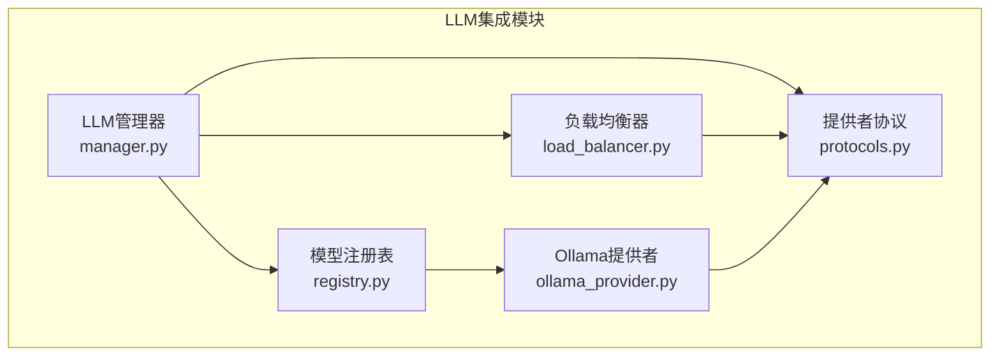
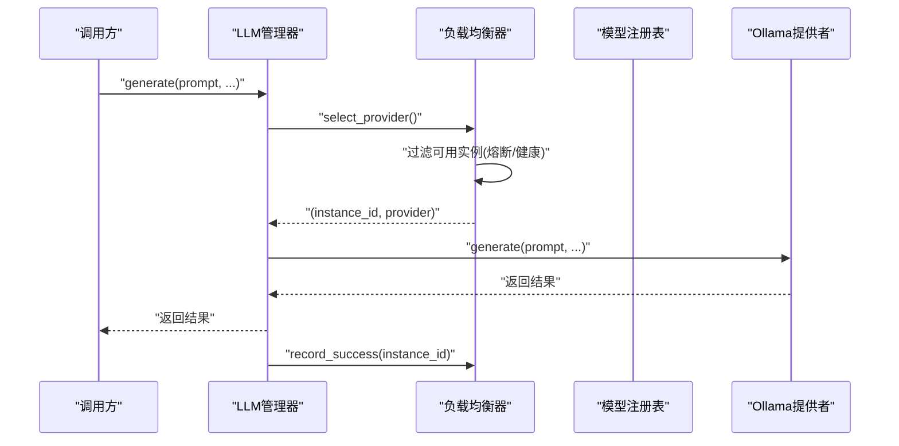
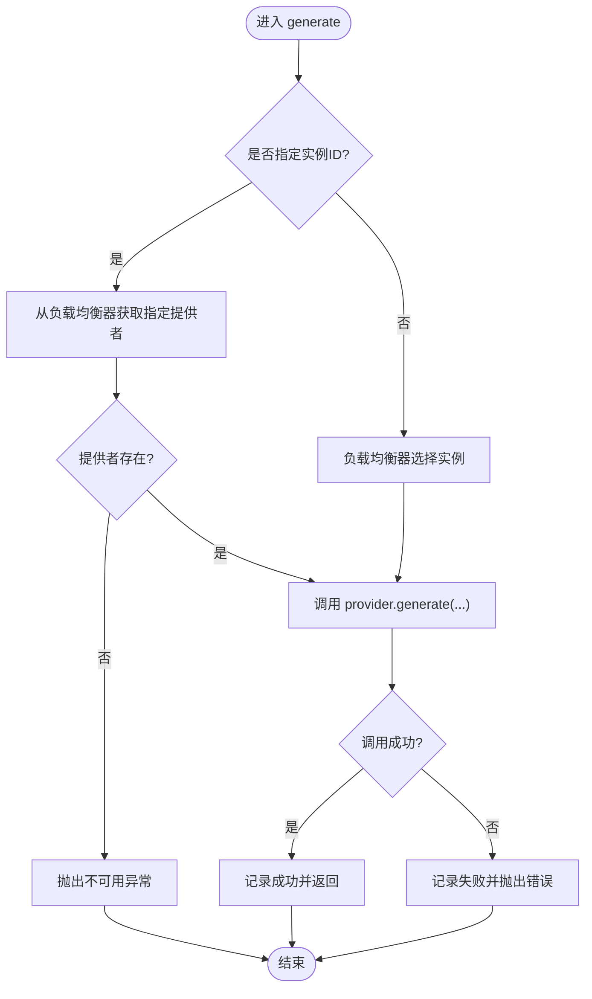
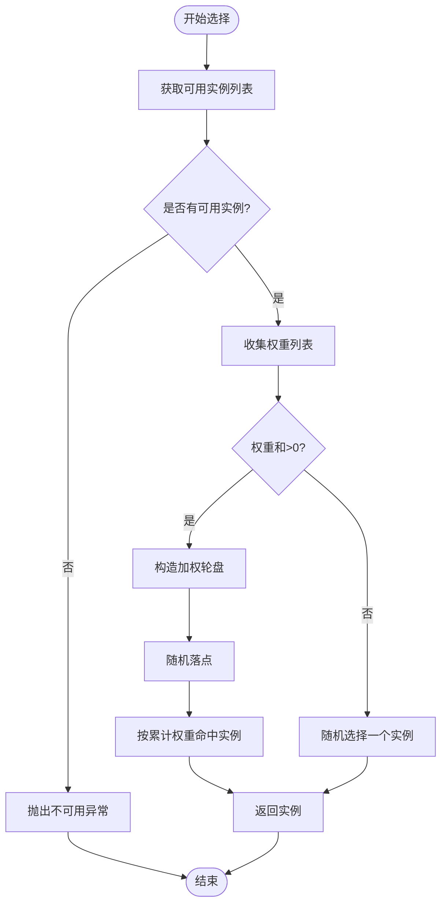
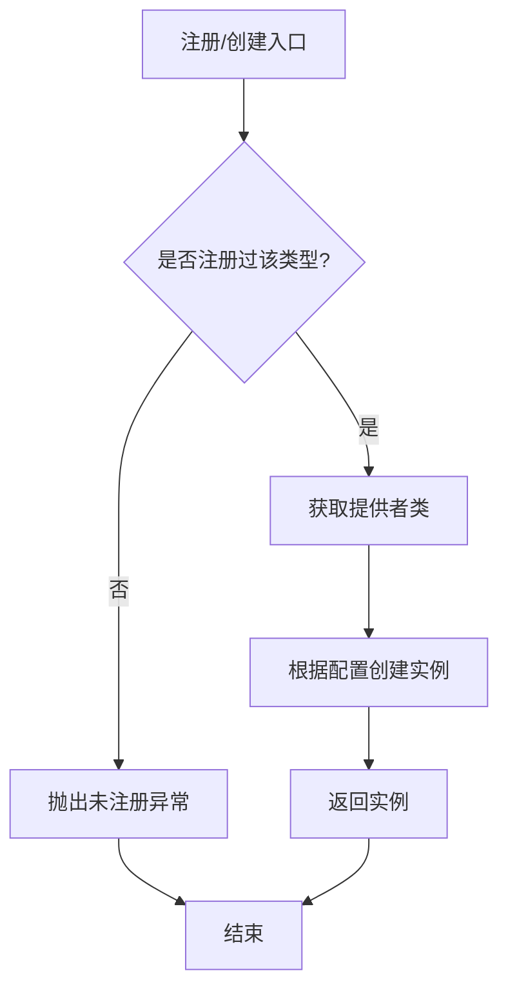
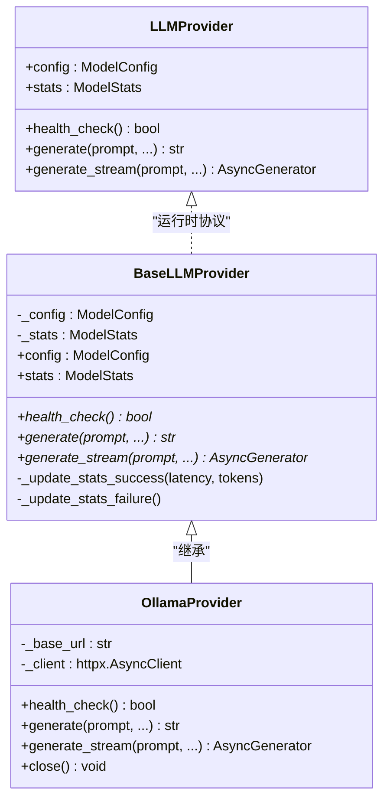
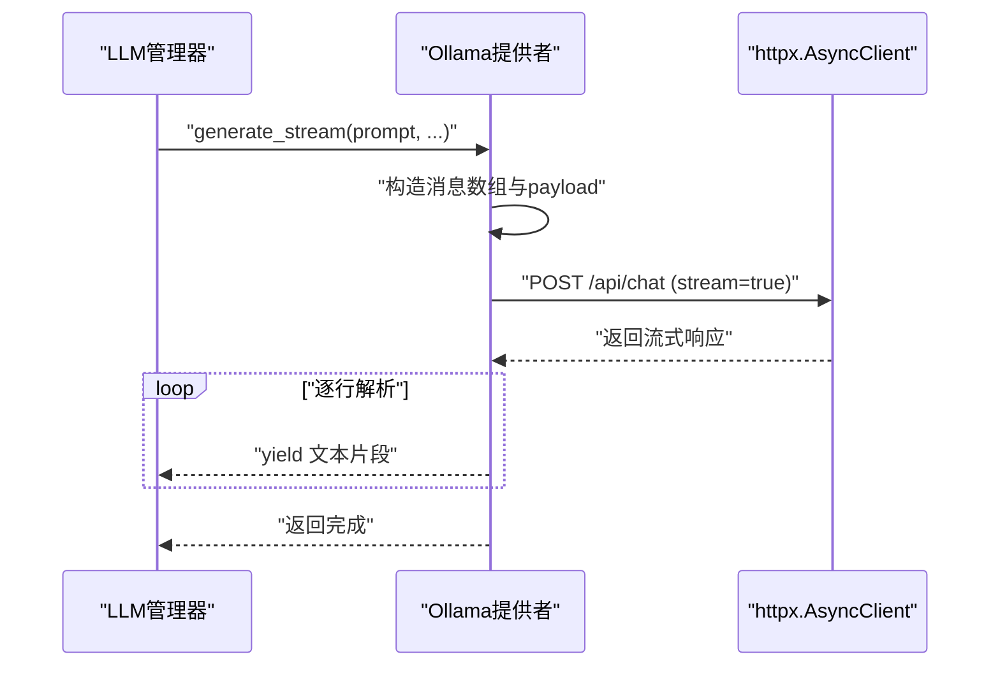
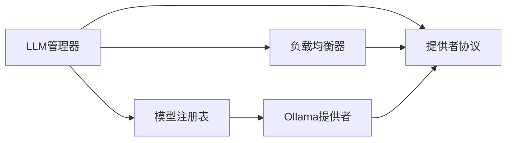

# LLM集成

<cite>
**本文引用的文件**
- [load_balancer.py](file://src/taolib/testing/multi_agent/llm/load_balancer.py)
- [manager.py](file://src/taolib/testing/multi_agent/llm/manager.py)
- [registry.py](file://src/taolib/testing/multi_agent/llm/registry.py)
- [ollama_provider.py](file://src/taolib/testing/multi_agent/llm/ollama_provider.py)
- [protocols.py](file://src/taolib/testing/multi_agent/llm/protocols.py)
- [__init__.py](file://src/taolib/testing/multi_agent/llm/__init__.py)
- [test_load_balancer.py](file://tests/testing/test_multi_agent/test_load_balancer.py)
</cite>

## 目录
1. [简介](#简介)
2. [项目结构](#项目结构)
3. [核心组件](#核心组件)
4. [架构总览](#架构总览)
5. [组件详细分析](#组件详细分析)
6. [依赖关系分析](#依赖关系分析)
7. [性能考量](#性能考量)
8. [故障排查指南](#故障排查指南)
9. [结论](#结论)
10. [附录](#附录)

## 简介
本文件面向LLM（大语言模型）集成系统，聚焦于以下目标：
- LLM管理器的架构设计与实现原理：模型实例管理、配置管理、状态跟踪。
- 负载均衡器策略：轮询、最少连接、随机、加权随机，以及熔断器机制。
- 模型注册表：模型发现、版本管理与依赖解析思路。
- Ollama提供者集成与自定义提供者协议扩展。
- LLM配置、性能监控与错误处理的完整实现。
- 模型调用流程、响应处理与资源管理策略。

## 项目结构
LLM集成位于多智能体测试模块下，采用“按功能域分层”的组织方式：
- llm 子包：负载均衡、管理器、注册表、提供者协议与Ollama提供者。
- models：模型配置、状态、策略等数据模型。
- errors：统一的错误类型与异常体系。
- tests：针对负载均衡与LLM管理器的端到端测试。

图表来源
- [load_balancer.py:1-246](file://src/taolib/testing/multi_agent/llm/load_balancer.py#L1-L246)
- [manager.py:1-229](file://src/taolib/testing/multi_agent/llm/manager.py#L1-L229)
- [registry.py:1-73](file://src/taolib/testing/multi_agent/llm/registry.py#L1-L73)
- [protocols.py:1-165](file://src/taolib/testing/multi_agent/llm/protocols.py#L1-L165)
- [ollama_provider.py:1-238](file://src/taolib/testing/multi_agent/llm/ollama_provider.py#L1-L238)

章节来源
- [__init__.py:1-19](file://src/taolib/testing/multi_agent/llm/__init__.py#L1-L19)

## 核心组件
- LLM管理器：统一入口，负责模型注册、调用路由、健康检查与统计查询。
- 负载均衡器：根据策略选择可用提供者，内置熔断器与健康检查。
- 模型注册表：集中管理提供者类型与工厂方法，支持动态注册与创建。
- 提供者协议：定义统一接口，便于扩展新提供者。
- Ollama提供者：具体实现，封装HTTP客户端、健康检查、同步与流式生成。

章节来源
- [manager.py:22-229](file://src/taolib/testing/multi_agent/llm/manager.py#L22-L229)
- [load_balancer.py:21-246](file://src/taolib/testing/multi_agent/llm/load_balancer.py#L21-L246)
- [registry.py:12-73](file://src/taolib/testing/multi_agent/llm/registry.py#L12-L73)
- [protocols.py:12-165](file://src/taolib/testing/multi_agent/llm/protocols.py#L12-L165)
- [ollama_provider.py:22-238](file://src/taolib/testing/multi_agent/llm/ollama_provider.py#L22-L238)

## 架构总览
系统通过LLM管理器协调各提供者，负载均衡器在可用实例间按策略选择；注册表负责提供者类型与实例的映射；协议层确保不同提供者的一致行为；Ollama提供者作为本地集成示例，展示如何实现协议并进行健康检查与调用。

图表来源
- [manager.py:57-107](file://src/taolib/testing/multi_agent/llm/manager.py#L57-L107)
- [load_balancer.py:155-180](file://src/taolib/testing/multi_agent/llm/load_balancer.py#L155-L180)
- [ollama_provider.py:75-151](file://src/taolib/testing/multi_agent/llm/ollama_provider.py#L75-L151)

## 组件详细分析

### LLM管理器（LLMManager）
职责与特性：
- 注册模型：根据配置创建提供者并登记到负载均衡器。
- 统一调用：支持同步与流式生成，支持指定实例或自动选择。
- 健康检查：可对单个或全部实例执行健康检查。
- 统计查询：暴露实例统计信息与可用实例列表。
- 默认管理器：提供全局单例访问。

关键流程（同步生成）：

图表来源
- [manager.py:57-107](file://src/taolib/testing/multi_agent/llm/manager.py#L57-L107)
- [load_balancer.py:155-180](file://src/taolib/testing/multi_agent/llm/load_balancer.py#L155-L180)

章节来源
- [manager.py:22-229](file://src/taolib/testing/multi_agent/llm/manager.py#L22-L229)

### 负载均衡器（LoadBalancer）
职责与特性：
- 实例注册：维护实例ID到提供者的映射，初始化状态与熔断器。
- 可用性筛选：基于熔断器状态与健康检查结果过滤实例。
- 多种策略：轮询、最少连接、随机、加权随机。
- 熔断器：失败阈值触发熔断，超时后自动重置。
- 健康检查：批量健康检查并更新实例状态。
- 统计查询：提供实例统计与全量实例查询。

策略选择流程（加权随机）：

图表来源
- [load_balancer.py:125-154](file://src/taolib/testing/multi_agent/llm/load_balancer.py#L125-L154)
- [load_balancer.py:54-75](file://src/taolib/testing/multi_agent/llm/load_balancer.py#L54-L75)

章节来源
- [load_balancer.py:21-246](file://src/taolib/testing/multi_agent/llm/load_balancer.py#L21-L246)

### 模型注册表（ModelRegistry）
职责与特性：
- 类型注册：将提供者类型映射到具体提供者类。
- 工厂方法：根据配置创建提供者实例。
- 可用提供者查询：返回已注册的提供者类型集合。
- 自动注册：尝试导入并注册Ollama提供者。

注册与创建流程：

图表来源
- [registry.py:17-55](file://src/taolib/testing/multi_agent/llm/registry.py#L17-L55)

章节来源
- [registry.py:12-73](file://src/taolib/testing/multi_agent/llm/registry.py#L12-L73)

### 提供者协议（LLMProvider 与 BaseLLMProvider）
职责与特性：
- 协议层：定义统一接口（配置、统计、健康检查、同步/流式生成）。
- 抽象基类：提供统计更新的通用实现（成功/失败），便于具体提供者复用。
- 运行时检查：使用运行时协议确保实现符合规范。

类关系图：

图表来源
- [protocols.py:12-165](file://src/taolib/testing/multi_agent/llm/protocols.py#L12-L165)
- [ollama_provider.py:22-238](file://src/taolib/testing/multi_agent/llm/ollama_provider.py#L22-L238)

章节来源
- [protocols.py:12-165](file://src/taolib/testing/multi_agent/llm/protocols.py#L12-L165)

### Ollama提供者（OllamaProvider）
职责与特性：
- 异步HTTP客户端：基于httpx.AsyncClient，支持超时配置。
- 健康检查：访问 /api/tags 判断服务可用性。
- 同步生成：构造消息数组，调用 /api/chat 执行非流式推理。
- 流式生成：使用流式接口逐段返回内容。
- 错误处理：区分超时、连接失败与API错误，更新统计。
- 资源管理：提供 close 方法释放客户端。

调用序列（流式生成）：

图表来源
- [ollama_provider.py:152-231](file://src/taolib/testing/multi_agent/llm/ollama_provider.py#L152-L231)

章节来源
- [ollama_provider.py:22-238](file://src/taolib/testing/multi_agent/llm/ollama_provider.py#L22-L238)

### 模型调用流程与响应处理
- 调用入口：LLM管理器接收请求，决定使用指定实例还是负载均衡选择。
- 负载均衡：过滤不可用实例（熔断/健康），按策略选择。
- 提供者执行：调用具体提供者的生成方法，同步或流式。
- 结果回传：同步生成直接返回字符串；流式生成逐段yield。
- 统计与熔断：成功/失败分别记录，失败触发熔断器。

章节来源
- [manager.py:57-157](file://src/taolib/testing/multi_agent/llm/manager.py#L57-L157)
- [load_balancer.py:182-205](file://src/taolib/testing/multi_agent/llm/load_balancer.py#L182-L205)

## 依赖关系分析
- LLM管理器依赖：负载均衡器、注册表、提供者协议。
- 负载均衡器依赖：提供者协议、模型配置/状态数据模型。
- 注册表依赖：提供者协议、模型配置枚举。
- Ollama提供者依赖：提供者抽象基类、httpx异步客户端、模型配置/统计。
- 协议层为所有提供者提供统一契约，便于扩展。

图表来源
- [manager.py:12-19](file://src/taolib/testing/multi_agent/llm/manager.py#L12-L19)
- [load_balancer.py:11-18](file://src/taolib/testing/multi_agent/llm/load_balancer.py#L11-L18)
- [registry.py:8-9](file://src/taolib/testing/multi_agent/llm/registry.py#L8-L9)
- [ollama_provider.py:18-19](file://src/taolib/testing/multi_agent/llm/ollama_provider.py#L18-L19)
- [protocols.py:6-9](file://src/taolib/testing/multi_agent/llm/protocols.py#L6-L9)

## 性能考量
- 负载均衡策略选择
  - 轮询：简单公平，适合实例性能相近场景。
  - 最少连接：动态适配当前并发压力，提升吞吐。
  - 随机：降低热点风险，但缺乏状态感知。
  - 加权随机：结合实例权重（如硬件能力、优先级）进行流量分配。
- 熔断器
  - 失败阈值与重试窗口控制故障传播，避免雪崩效应。
  - 健康检查周期需平衡准确性与开销。
- 统计指标
  - 平均延迟、成功率、失败率、总请求量、Token用量，用于策略调整与容量规划。
- 资源管理
  - 异步HTTP客户端复用与超时配置，避免连接泄漏与阻塞。
  - 流式生成减少内存峰值，提升交互体验。

## 故障排查指南
常见问题与定位要点：
- 模型不可用
  - 现象：抛出不可用异常或返回空可用列表。
  - 排查：确认健康检查是否通过；查看熔断器状态与重置时间；核对实例ID是否存在。
- 调用超时
  - 现象：超时异常。
  - 排查：检查网络连通性、Ollama服务状态、客户端超时配置。
- API错误
  - 现象：返回非200状态码或错误消息。
  - 排查：查看服务端返回内容、模型名称拼写、消息格式。
- 统计异常
  - 现象：平均延迟异常、失败率升高。
  - 排查：核对策略配置、实例权重、健康检查频率。

章节来源
- [test_load_balancer.py:125-151](file://tests/testing/test_multi_agent/test_load_balancer.py#L125-L151)
- [ollama_provider.py:142-150](file://src/taolib/testing/multi_agent/llm/ollama_provider.py#L142-L150)
- [load_balancer.py:191-205](file://src/taolib/testing/multi_agent/llm/load_balancer.py#L191-L205)

## 结论
该LLM集成系统通过清晰的分层设计实现了：
- 统一的提供者协议与可插拔的提供者实现；
- 多策略负载均衡与熔断器保障稳定性；
- 完整的健康检查与统计监控；
- 易扩展的注册表与全局管理器。

建议在生产环境中结合业务特征选择合适的负载均衡策略与健康检查周期，并持续观测统计指标以优化资源配置。

## 附录
- 测试覆盖要点（参考测试文件）
  - 负载均衡器：实例注册、可用性筛选、轮询/随机/加权策略、熔断器行为。
  - LLM管理器：模型添加、可用模型查询、统计获取、健康检查、调用路由。

章节来源
- [test_load_balancer.py:19-218](file://tests/testing/test_multi_agent/test_load_balancer.py#L19-L218)