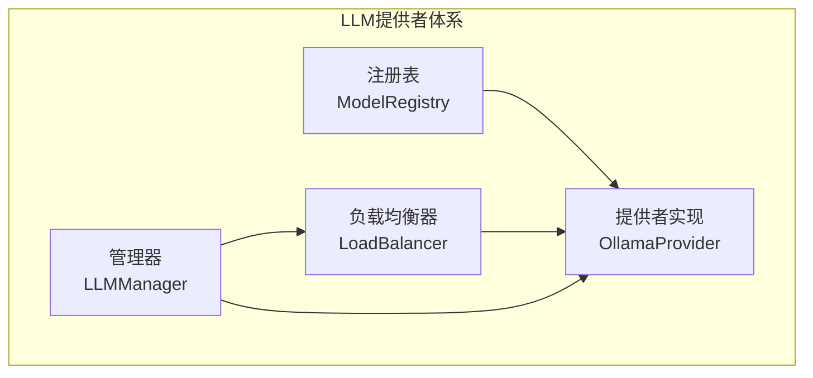
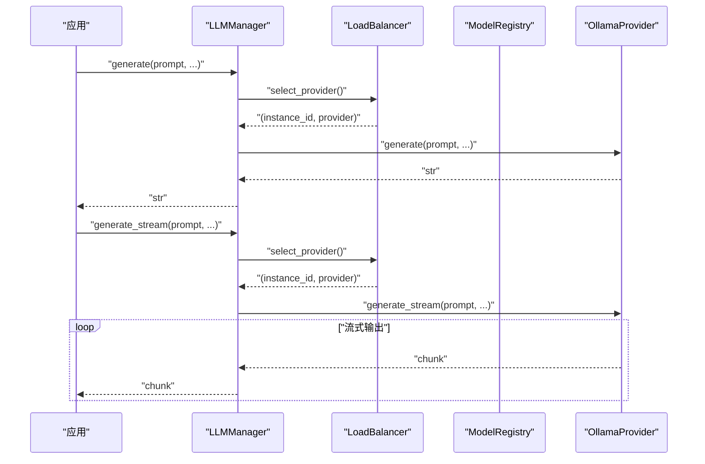
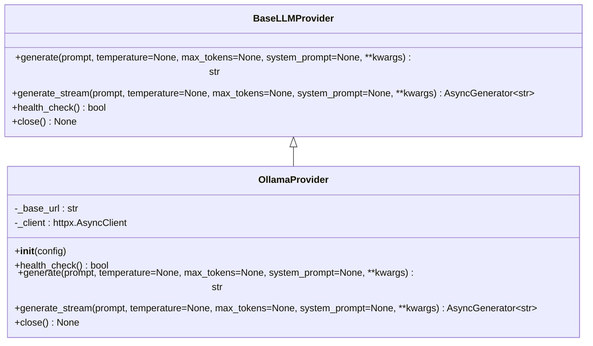
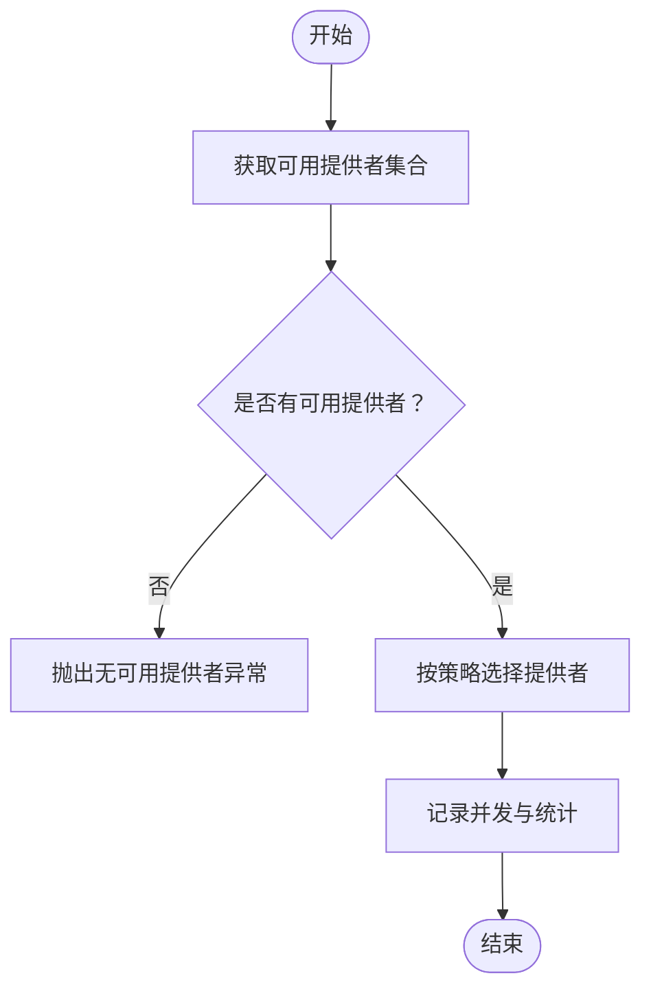
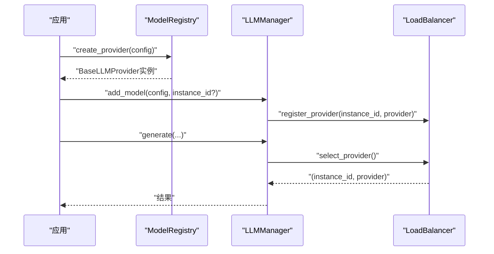
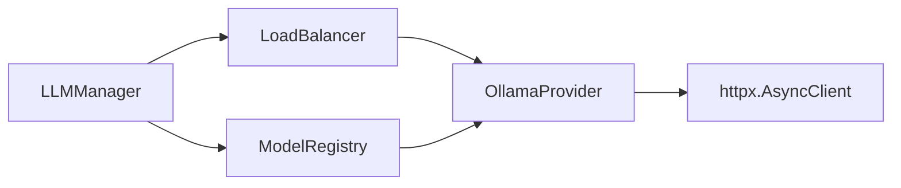

# 提供者实现

<cite>
**本文引用的文件**
- [ollama_provider.py](file://src/taolib/testing/multi_agent/llm/ollama_provider.py)
- [manager.py](file://src/taolib/testing/multi_agent/llm/manager.py)
- [load_balancer.py](file://src/taolib/testing/multi_agent/llm/load_balancer.py)
- [registry.py](file://src/taolib/testing/multi_agent/llm/registry.py)
- [test_llm.py](file://tests/testing/test_multi_agent/test_llm.py)
</cite>

## 目录
1. [简介](#简介)
2. [项目结构](#项目结构)
3. [核心组件](#核心组件)
4. [架构总览](#架构总览)
5. [详细组件分析](#详细组件分析)
6. [依赖分析](#依赖分析)
7. [性能考虑](#性能考虑)
8. [故障排查指南](#故障排查指南)
9. [结论](#结论)
10. [附录](#附录)

## 简介
本文件面向LLM提供者实现，系统性阐述BaseLLMProvider协议设计与实现要求，并以OllamaProvider为例，完整说明协议接口规范、抽象方法、参数转换、响应处理、初始化流程、连接管理与资源释放、异步调用模式、错误处理与重试策略，以及如何基于协议开发自定义提供者。文档同时给出集成示例与调试技巧，帮助读者快速落地。

## 项目结构
本项目在多智能体模块中提供了LLM提供者体系：协议层定义接口，具体提供者实现（如OllamaProvider），注册表负责提供者发现与实例化，负载均衡器负责多提供者调度与熔断控制，管理器提供统一的生成与流式生成入口。

**图示来源**
- [registry.py:12-73](file://src/taolib/testing/multi_agent/llm/registry.py#L12-L73)
- [load_balancer.py:21-246](file://src/taolib/testing/multi_agent/llm/load_balancer.py#L21-L246)
- [manager.py:22-229](file://src/taolib/testing/multi_agent/llm/manager.py#L22-L229)
- [ollama_provider.py:22-238](file://src/taolib/testing/multi_agent/llm/ollama_provider.py#L22-L238)

**章节来源**
- [registry.py:12-73](file://src/taolib/testing/multi_agent/llm/registry.py#L12-L73)
- [load_balancer.py:21-246](file://src/taolib/testing/multi_agent/llm/load_balancer.py#L21-L246)
- [manager.py:22-229](file://src/taolib/testing/multi_agent/llm/manager.py#L22-L229)
- [ollama_provider.py:22-238](file://src/taolib/testing/multi_agent/llm/ollama_provider.py#L22-L238)

## 核心组件
- BaseLLMProvider协议：定义统一的异步生成接口、流式生成接口、健康检查接口与生命周期管理接口，确保不同提供者实现具备一致的对外能力。
- OllamaProvider：BaseLLMProvider的具体实现，对接Ollama本地推理服务，负责HTTP客户端管理、参数映射、响应解析、统计更新与异常转换。
- ModelRegistry：提供者注册与实例化工厂，按配置类型映射到对应提供者类。
- LoadBalancer：多提供者调度与熔断控制，支持轮询、最少连接、随机与加权等策略。
- LLMManager：统一入口，封装生成与流式生成、健康检查、统计查询等操作。

**章节来源**
- [ollama_provider.py:22-238](file://src/taolib/testing/multi_agent/llm/ollama_provider.py#L22-L238)
- [registry.py:12-73](file://src/taolib/testing/multi_agent/llm/registry.py#L12-L73)
- [load_balancer.py:21-246](file://src/taolib/testing/multi_agent/llm/load_balancer.py#L21-L246)
- [manager.py:22-229](file://src/taolib/testing/multi_agent/llm/manager.py#L22-L229)

## 架构总览
下图展示从应用侧到具体提供者的调用链路与组件交互：

**图示来源**
- [manager.py:57-157](file://src/taolib/testing/multi_agent/llm/manager.py#L57-L157)
- [load_balancer.py:155-180](file://src/taolib/testing/multi_agent/llm/load_balancer.py#L155-L180)
- [registry.py:44-55](file://src/taolib/testing/multi_agent/llm/registry.py#L44-L55)
- [ollama_provider.py:75-151](file://src/taolib/testing/multi_agent/llm/ollama_provider.py#L75-L151)

## 详细组件分析

### BaseLLMProvider协议与实现约束
- 协议职责
  - 异步文本生成：generate(prompt, temperature=None, max_tokens=None, system_prompt=None, **kwargs) -> str
  - 流式生成：generate_stream(prompt, temperature=None, max_tokens=None, system_prompt=None, **kwargs) -> AsyncGenerator[str, None]
  - 健康检查：health_check() -> bool
  - 生命周期管理：close() -> None
- 实现约束
  - 所有方法必须为异步，返回值与参数命名需与协议保持一致
  - 对外抛出明确的业务异常类型，便于上层统一处理
  - 统一维护内部统计对象（如请求次数、成功率、延迟、错误信息等）
  - 正确管理HTTP客户端生命周期，避免连接泄漏

[本节为协议设计说明，不直接分析具体文件，故无“章节来源”]

### OllamaProvider实现详解
- 初始化与连接管理
  - 通过构造函数接收ModelConfig，保存基础URL与超时配置
  - 延迟创建httpx.AsyncClient，按超时配置初始化
  - 提供close()以释放底层连接
- 健康检查
  - 访问/api/tags端点，根据状态码更新最后健康时间、错误信息与状态
- 文本生成
  - 参数映射：temperature -> options.temperature；max_tokens -> options.num_predict
  - 消息构建：可选system_prompt与用户prompt拼装为messages数组
  - 非流式调用：POST /api/chat，stream=False，解析返回的message.content
  - 成功/失败统计：成功时记录延迟与token用量；失败时记录错误与时间
- 流式生成
  - 同样进行参数映射与消息构建
  - 流式调用：POST /api/chat，stream=True，逐行解析JSON增量内容
  - 边读边写：逐块yield，最终记录统计
- 错误处理
  - 超时：ModelTimeoutError
  - 连接失败：ModelUnavailableError
  - 其他异常：LLMError
- 资源释放
  - close()中关闭AsyncClient，避免悬挂连接

**图示来源**
- [ollama_provider.py:22-238](file://src/taolib/testing/multi_agent/llm/ollama_provider.py#L22-L238)

**章节来源**
- [ollama_provider.py:25-44](file://src/taolib/testing/multi_agent/llm/ollama_provider.py#L25-L44)
- [ollama_provider.py:46-74](file://src/taolib/testing/multi_agent/llm/ollama_provider.py#L46-L74)
- [ollama_provider.py:75-151](file://src/taolib/testing/multi_agent/llm/ollama_provider.py#L75-L151)
- [ollama_provider.py:152-231](file://src/taolib/testing/multi_agent/llm/ollama_provider.py#L152-L231)
- [ollama_provider.py:233-238](file://src/taolib/testing/multi_agent/llm/ollama_provider.py#L233-L238)

### 负载均衡器与熔断控制
- 注册与实例化
  - register_provider(instance_id, provider)：登记提供者与实例元数据
  - get_available_providers()：过滤熔断器状态后的可用提供者
- 选择策略
  - 轮询、最少连接、随机、加权
  - 加权策略基于ModelConfig.weight
- 熔断控制
  - 失败计数达到阈值后进入open状态，超过重试冷却时间后自动恢复
- 健康检查
  - health_check_all()：批量调用各提供者health_check()并更新实例状态

**图示来源**
- [load_balancer.py:54-75](file://src/taolib/testing/multi_agent/llm/load_balancer.py#L54-L75)
- [load_balancer.py:155-180](file://src/taolib/testing/multi_agent/llm/load_balancer.py#L155-L180)
- [load_balancer.py:191-205](file://src/taolib/testing/multi_agent/llm/load_balancer.py#L191-L205)

**章节来源**
- [load_balancer.py:36-53](file://src/taolib/testing/multi_agent/llm/load_balancer.py#L36-L53)
- [load_balancer.py:54-75](file://src/taolib/testing/multi_agent/llm/load_balancer.py#L54-L75)
- [load_balancer.py:155-180](file://src/taolib/testing/multi_agent/llm/load_balancer.py#L155-L180)
- [load_balancer.py:191-205](file://src/taolib/testing/multi_agent/llm/load_balancer.py#L191-L205)

### 管理器与注册表
- ModelRegistry
  - register(provider_type, provider_class)：注册提供者类型与类映射
  - create_provider(config)：按配置类型创建具体提供者实例
- LLMManager
  - add_model(config, instance_id)：注册模型实例并返回instance_id
  - generate/generate_stream：统一入口，委托给负载均衡器选择的提供者
  - health_check/get_available_models/get_model_stats：提供健康检查与统计查询

**图示来源**
- [registry.py:44-55](file://src/taolib/testing/multi_agent/llm/registry.py#L44-L55)
- [manager.py:35-55](file://src/taolib/testing/multi_agent/llm/manager.py#L35-L55)
- [manager.py:84-106](file://src/taolib/testing/multi_agent/llm/manager.py#L84-L106)

**章节来源**
- [registry.py:12-73](file://src/taolib/testing/multi_agent/llm/registry.py#L12-L73)
- [manager.py:22-229](file://src/taolib/testing/multi_agent/llm/manager.py#L22-L229)

## 依赖分析
- 组件耦合
  - LLMManager依赖LoadBalancer与ModelRegistry，实现高层编排
  - LoadBalancer依赖BaseLLMProvider接口，实现多提供者调度
  - OllamaProvider依赖BaseLLMProvider接口与httpx异步客户端
- 外部依赖
  - httpx.AsyncClient用于HTTP通信
  - 异常类型来自多智能体模块的错误定义
- 循环依赖
  - 当前结构无循环依赖，注册表在模块加载时尝试注册OllamaProvider，避免运行时导入问题

**图示来源**
- [manager.py:12-19](file://src/taolib/testing/multi_agent/llm/manager.py#L12-L19)
- [load_balancer.py:12-18](file://src/taolib/testing/multi_agent/llm/load_balancer.py#L12-L18)
- [registry.py:68-72](file://src/taolib/testing/multi_agent/llm/registry.py#L68-L72)
- [ollama_provider.py:11](file://src/taolib/testing/multi_agent/llm/ollama_provider.py#L11)

**章节来源**
- [manager.py:12-19](file://src/taolib/testing/multi_agent/llm/manager.py#L12-L19)
- [load_balancer.py:12-18](file://src/taolib/testing/multi_agent/llm/load_balancer.py#L12-L18)
- [registry.py:68-72](file://src/taolib/testing/multi_agent/llm/registry.py#L68-L72)
- [ollama_provider.py:11](file://src/taolib/testing/multi_agent/llm/ollama_provider.py#L11)

## 性能考虑
- 连接复用
  - 使用单个httpx.AsyncClient并复用，减少TCP握手开销
- 超时与并发
  - 合理设置超时时间，避免阻塞等待
  - 利用最少连接策略降低热点提供者压力
- 流式输出
  - 优先采用generate_stream以降低首字节延迟
- 统计与熔断
  - 结合成功率与延迟统计动态调整权重或剔除异常实例
- 资源释放
  - 在生命周期末尾调用close()，防止连接池泄漏

[本节为通用性能建议，不直接分析具体文件，故无“章节来源”]

## 故障排查指南
- 常见错误类型
  - ModelTimeoutError：请求超时，检查网络连通性与Ollama服务状态
  - ModelUnavailableError：无法连接Ollama，检查base_url与端口
  - LLMError：其他生成异常，查看日志与响应体
- 健康检查
  - 通过LLMManager.health_check或LoadBalancer.health_check_all定位不可用实例
- 统计信息
  - 使用get_model_stats与get_all_models获取实例状态与统计指标
- 单元测试参考
  - 测试覆盖初始化、统计更新、配置默认值与自定义值等场景

**章节来源**
- [test_llm.py:47-125](file://tests/testing/test_multi_agent/test_llm.py#L47-L125)
- [manager.py:159-175](file://src/taolib/testing/multi_agent/llm/manager.py#L159-L175)
- [load_balancer.py:206-216](file://src/taolib/testing/multi_agent/llm/load_balancer.py#L206-L216)

## 结论
该实现以BaseLLMProvider协议为核心，通过ModelRegistry与LoadBalancer完成提供者注册与调度，OllamaProvider作为具体实现展示了参数映射、响应解析、统计更新与异常转换的最佳实践。结合流式生成、健康检查与熔断控制，整体方案具备良好的扩展性与鲁棒性。开发者可据此快速实现自定义提供者并接入统一管理器。

[本节为总结性内容，不直接分析具体文件，故无“章节来源”]

## 附录

### 自定义提供者开发指南
- 实现步骤
  - 定义类并继承BaseLLMProvider
  - 实现generate/generate_stream/health_check/close
  - 在构造函数中保存ModelConfig并初始化连接
  - 在异常分支中抛出明确的业务异常类型
  - 在成功/失败路径中更新统计信息
- 注册与使用
  - 使用ModelRegistry.register注册新提供者类型与类
  - 通过ModelRegistry.create_provider或LLMManager.add_model创建实例
- 最佳实践
  - 明确参数映射规则，保持与协议一致
  - 优先使用流式生成提升用户体验
  - 合理设置超时与重试策略
  - 定期执行健康检查并纳入熔断逻辑
- 性能优化建议
  - 复用连接、合理并发、及时释放资源
  - 基于统计指标动态调整权重与策略

[本节为开发指导，不直接分析具体文件，故无“章节来源”]

### 集成示例与调试技巧
- 快速集成
  - 创建ModelConfig（指定provider、model_name、base_url、timeout等）
  - 通过ModelRegistry.create_provider或LLMManager.add_model注册
  - 使用LLMManager.generate或generate_stream发起请求
- 调试技巧
  - 开启httpx日志（若需要）观察请求细节
  - 通过health_check与get_model_stats确认实例状态
  - 使用单元测试验证初始化与统计更新逻辑

**章节来源**
- [test_llm.py:34-45](file://tests/testing/test_multi_agent/test_llm.py#L34-L45)
- [manager.py:35-55](file://src/taolib/testing/multi_agent/llm/manager.py#L35-L55)
- [test_llm.py:60-87](file://tests/testing/test_multi_agent/test_llm.py#L60-L87)