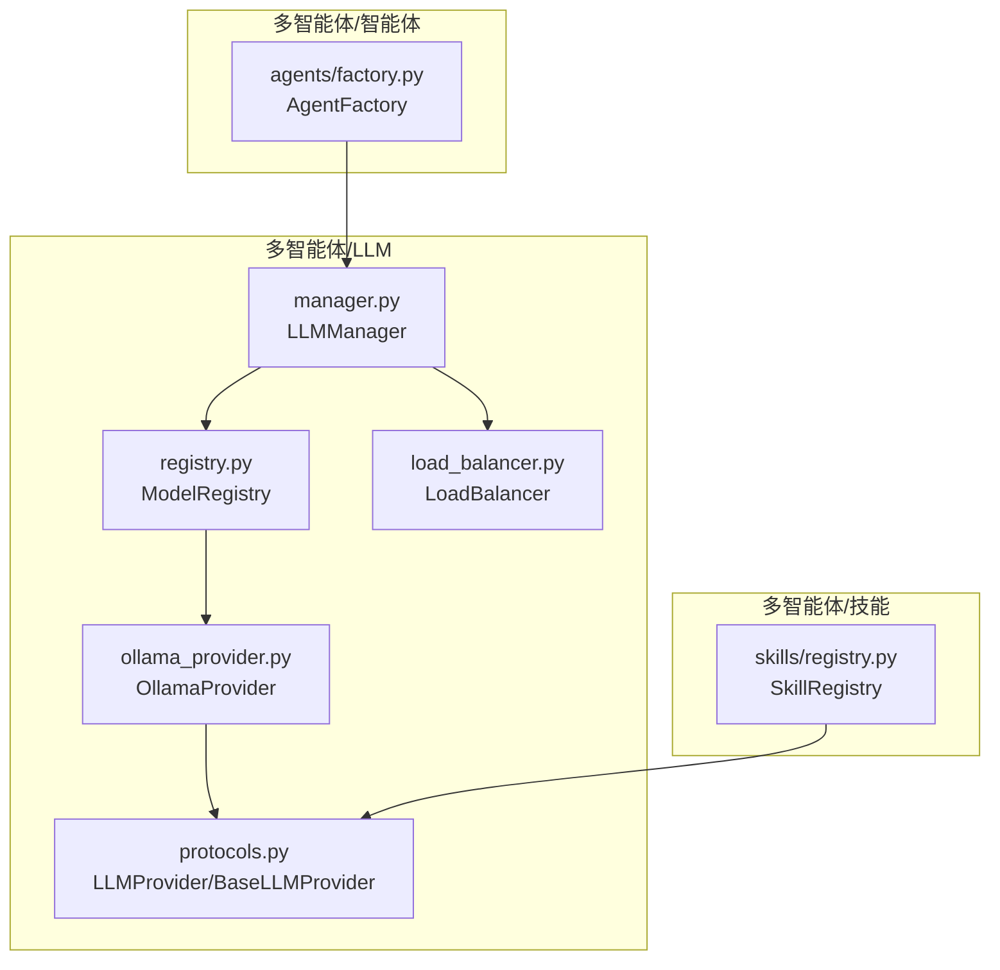
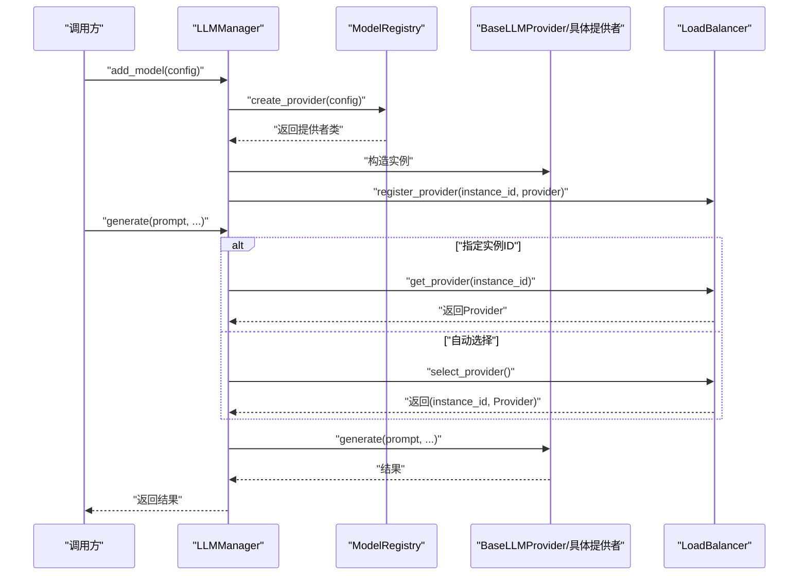
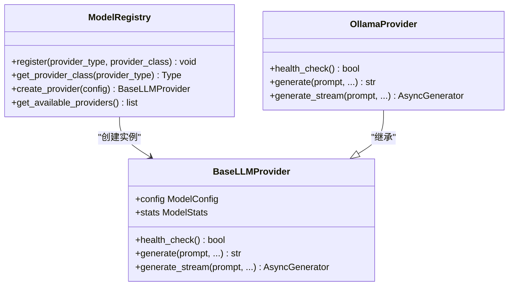
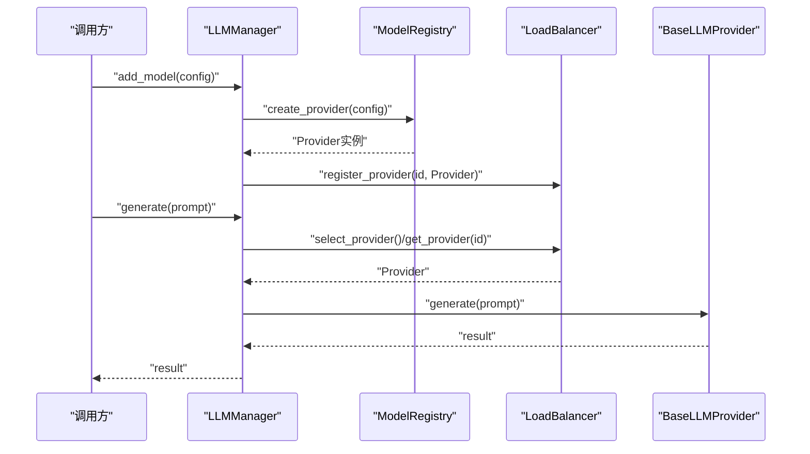
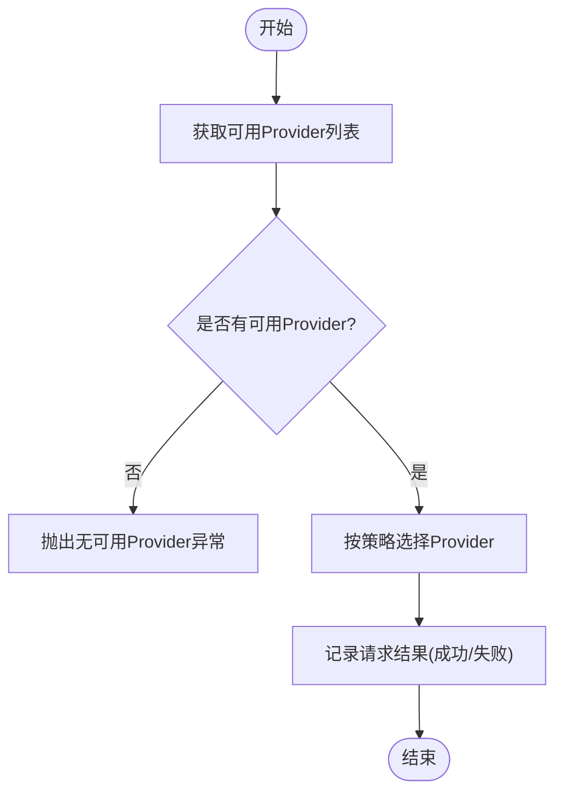
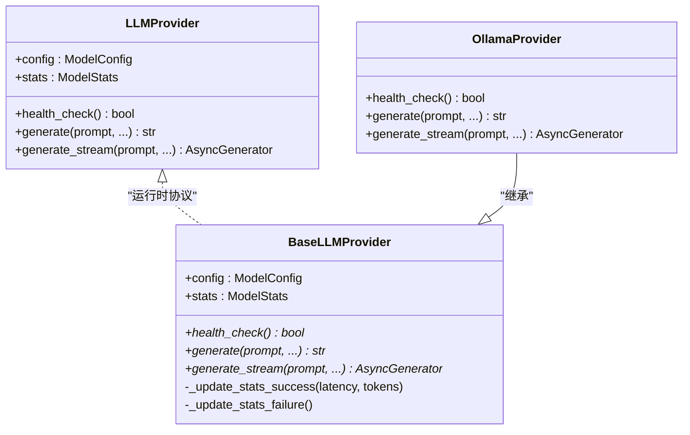
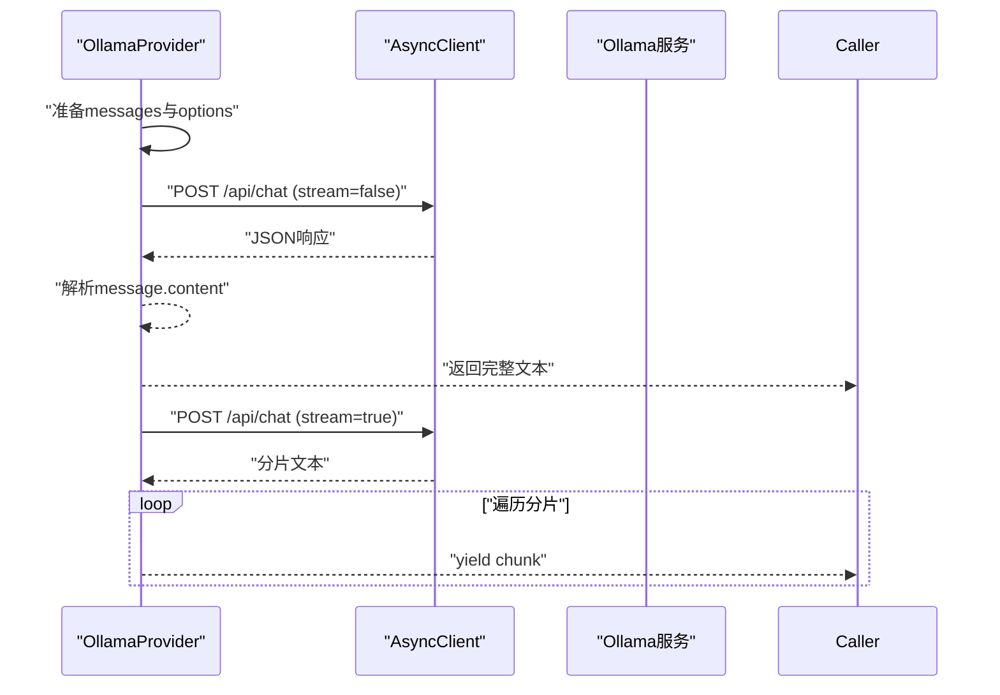
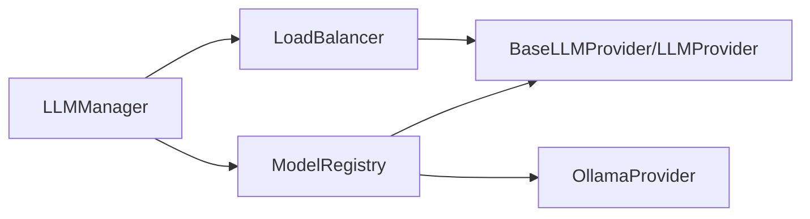

# 模型注册表

<cite>
**本文引用的文件**
- [src/taolib/testing/multi_agent/llm/registry.py](file://src/taolib/testing/multi_agent/llm/registry.py)
- [src/taolib/testing/multi_agent/llm/manager.py](file://src/taolib/testing/multi_agent/llm/manager.py)
- [src/taolib/testing/multi_agent/llm/protocols.py](file://src/taolib/testing/multi_agent/llm/protocols.py)
- [src/taolib/testing/multi_agent/llm/ollama_provider.py](file://src/taolib/testing/multi_agent/llm/ollama_provider.py)
- [src/taolib/testing/multi_agent/llm/load_balancer.py](file://src/taolib/testing/multi_agent/llm/load_balancer.py)
- [src/taolib/testing/multi_agent/skills/registry.py](file://src/taolib/testing/multi_agent/skills/registry.py)
- [src/taolib/testing/multi_agent/agents/factory.py](file://src/taolib/testing/multi_agent/agents/factory.py)
</cite>

## 目录
1. [简介](#简介)
2. [项目结构](#项目结构)
3. [核心组件](#核心组件)
4. [架构总览](#架构总览)
5. [详细组件分析](#详细组件分析)
6. [依赖分析](#依赖分析)
7. [性能考虑](#性能考虑)
8. [故障排查指南](#故障排查指南)
9. [结论](#结论)
10. [附录：使用示例与最佳实践](#附录使用示例与最佳实践)

## 简介
本文件面向“模型注册表”的技术文档，聚焦于多智能体场景下的LLM（大语言模型）提供者注册与管理。内容涵盖：
- ModelRegistry 类的设计与职责边界
- 模型配置解析、提供者创建与依赖管理
- 注册表初始化流程、模型验证规则与配置加载策略
- 提供者工厂模式的实现（动态创建、类型检查、错误处理）
- 模型版本管理、兼容性检查与升级策略
- 注册表配置选项、扩展机制与自定义提供者集成指南
- 完整使用示例与最佳实践建议

## 项目结构
围绕模型注册表的相关代码主要位于多智能体模块中，涉及LLM提供者协议、具体提供者实现、注册表、负载均衡与管理器等。

图表来源
- [src/taolib/testing/multi_agent/llm/registry.py:12-64](file://src/taolib/testing/multi_agent/llm/registry.py#L12-L64)
- [src/taolib/testing/multi_agent/llm/protocols.py:87-139](file://src/taolib/testing/multi_agent/llm/protocols.py#L87-L139)
- [src/taolib/testing/multi_agent/llm/ollama_provider.py:22-238](file://src/taolib/testing/multi_agent/llm/ollama_provider.py#L22-L238)
- [src/taolib/testing/multi_agent/llm/load_balancer.py:21-246](file://src/taolib/testing/multi_agent/llm/load_balancer.py#L21-L246)
- [src/taolib/testing/multi_agent/llm/manager.py:22-229](file://src/taolib/testing/multi_agent/llm/manager.py#L22-L229)
- [src/taolib/testing/multi_agent/skills/registry.py:16-247](file://src/taolib/testing/multi_agent/skills/registry.py#L16-L247)
- [src/taolib/testing/multi_agent/agents/factory.py:27-220](file://src/taolib/testing/multi_agent/agents/factory.py#L27-L220)

章节来源
- [src/taolib/testing/multi_agent/llm/registry.py:12-64](file://src/taolib/testing/multi_agent/llm/registry.py#L12-L64)
- [src/taolib/testing/multi_agent/llm/manager.py:22-229](file://src/taolib/testing/multi_agent/llm/manager.py#L22-L229)
- [src/taolib/testing/multi_agent/llm/protocols.py:87-139](file://src/taolib/testing/multi_agent/llm/protocols.py#L87-L139)
- [src/taolib/testing/multi_agent/llm/ollama_provider.py:22-238](file://src/taolib/testing/multi_agent/llm/ollama_provider.py#L22-L238)
- [src/taolib/testing/multi_agent/llm/load_balancer.py:21-246](file://src/taolib/testing/multi_agent/llm/load_balancer.py#L21-L246)
- [src/taolib/testing/multi_agent/skills/registry.py:16-247](file://src/taolib/testing/multi_agent/skills/registry.py#L16-L247)
- [src/taolib/testing/multi_agent/agents/factory.py:27-220](file://src/taolib/testing/multi_agent/agents/factory.py#L27-L220)

## 核心组件
- ModelRegistry：集中注册与检索LLM提供者类型到实现类的映射，并负责按配置创建提供者实例。
- LLMManager：统一管理多个模型实例，封装负载均衡、健康检查与生成调用。
- LoadBalancer：实现多种负载均衡策略（轮询、最少连接、随机、加权），并内置熔断器逻辑。
- BaseLLMProvider/LLMProvider：定义提供者的统一协议与抽象基类，确保不同提供者实现的一致行为。
- OllamaProvider：具体提供者实现，对接本地Ollama服务，支持同步与流式生成。
- SkillRegistry：技能注册表，支持从文件/目录动态加载技能类，便于扩展与插拔式能力注入。
- AgentFactory：智能体工厂，基于模板或直接配置创建主/子智能体，内部依赖LLMManager。

章节来源
- [src/taolib/testing/multi_agent/llm/registry.py:12-64](file://src/taolib/testing/multi_agent/llm/registry.py#L12-L64)
- [src/taolib/testing/multi_agent/llm/manager.py:22-229](file://src/taolib/testing/multi_agent/llm/manager.py#L22-L229)
- [src/taolib/testing/multi_agent/llm/load_balancer.py:21-246](file://src/taolib/testing/multi_agent/llm/load_balancer.py#L21-L246)
- [src/taolib/testing/multi_agent/llm/protocols.py:87-139](file://src/taolib/testing/multi_agent/llm/protocols.py#L87-L139)
- [src/taolib/testing/multi_agent/llm/ollama_provider.py:22-238](file://src/taolib/testing/multi_agent/llm/ollama_provider.py#L22-L238)
- [src/taolib/testing/multi_agent/skills/registry.py:16-247](file://src/taolib/testing/multi_agent/skills/registry.py#L16-L247)
- [src/taolib/testing/multi_agent/agents/factory.py:27-220](file://src/taolib/testing/multi_agent/agents/factory.py#L27-L220)

## 架构总览
下图展示了从配置到提供者实例创建、再到统一管理与负载均衡的整体流程。

图表来源
- [src/taolib/testing/multi_agent/llm/manager.py:35-107](file://src/taolib/testing/multi_agent/llm/manager.py#L35-L107)
- [src/taolib/testing/multi_agent/llm/registry.py:44-55](file://src/taolib/testing/multi_agent/llm/registry.py#L44-L55)
- [src/taolib/testing/multi_agent/llm/load_balancer.py:36-181](file://src/taolib/testing/multi_agent/llm/load_balancer.py#L36-L181)

## 详细组件分析

### ModelRegistry 组件分析
- 设计要点
  - 使用类级字典维护“提供者类型 -> 提供者类”的映射。
  - 提供注册、获取类、按配置创建实例、列举可用提供者等方法。
  - 在模块导入时尝试注册OllamaProvider，体现可插拔特性。
- 关键流程
  - 注册：register(provider_type, provider_class)
  - 获取类：get_provider_class(provider_type) 并在未注册时抛出异常
  - 创建实例：create_provider(config) 基于配置中的provider字段定位类并实例化
  - 列举：get_available_providers()

图表来源
- [src/taolib/testing/multi_agent/llm/registry.py:12-64](file://src/taolib/testing/multi_agent/llm/registry.py#L12-L64)
- [src/taolib/testing/multi_agent/llm/protocols.py:87-139](file://src/taolib/testing/multi_agent/llm/protocols.py#L87-L139)
- [src/taolib/testing/multi_agent/llm/ollama_provider.py:22-238](file://src/taolib/testing/multi_agent/llm/ollama_provider.py#L22-L238)

章节来源
- [src/taolib/testing/multi_agent/llm/registry.py:12-64](file://src/taolib/testing/multi_agent/llm/registry.py#L12-L64)

### LLMManager 组件分析
- 设计要点
  - 组合ModelRegistry与LoadBalancer，统一对外提供模型管理能力。
  - add_model：生成实例ID、通过ModelRegistry创建提供者并注册到负载均衡器。
  - generate/generate_stream：支持指定实例ID或自动选择；封装异常并记录负载均衡统计。
  - health_check：支持单实例或全量健康检查。
- 关键流程
  - 添加模型：add_model(config) → create_provider(config) → register_provider → 记录默认提供者
  - 文本生成：generate → 选择Provider → 调用Provider.generate → 成功/失败记录
  - 流式生成：generate_stream → 选择Provider → Provider.generate_stream → 边流式边记录

图表来源
- [src/taolib/testing/multi_agent/llm/manager.py:35-107](file://src/taolib/testing/multi_agent/llm/manager.py#L35-L107)
- [src/taolib/testing/multi_agent/llm/registry.py:44-55](file://src/taolib/testing/multi_agent/llm/registry.py#L44-L55)
- [src/taolib/testing/multi_agent/llm/load_balancer.py:155-181](file://src/taolib/testing/multi_agent/llm/load_balancer.py#L155-L181)

章节来源
- [src/taolib/testing/multi_agent/llm/manager.py:22-229](file://src/taolib/testing/multi_agent/llm/manager.py#L22-L229)

### LoadBalancer 组件分析
- 设计要点
  - 维护实例ID到Provider的映射、实例元数据与熔断器状态。
  - 支持轮询、最少连接、随机、加权四种策略，默认轮询。
  - 熔断器：连续失败达到阈值后进入开路状态，超时后自动重试。
- 关键流程
  - 可用性过滤：检查熔断器状态与实例健康
  - 策略选择：按配置策略返回选定的(instance_id, Provider)
  - 统计记录：成功/失败分别更新熔断器与实例统计

图表来源
- [src/taolib/testing/multi_agent/llm/load_balancer.py:54-181](file://src/taolib/testing/multi_agent/llm/load_balancer.py#L54-L181)

章节来源
- [src/taolib/testing/multi_agent/llm/load_balancer.py:21-246](file://src/taolib/testing/multi_agent/llm/load_balancer.py#L21-L246)

### BaseLLMProvider 与 LLMProvider 协议分析
- 设计要点
  - LLMProvider为运行时协议，定义了config/stats属性与health_check/generate/generate_stream接口。
  - BaseLLMProvider为抽象基类，统一维护配置、统计与通用统计更新逻辑。
- 关键流程
  - 统一的health_check/generate/generate_stream接口签名
  - 统一的成功/失败统计更新，便于上层负载均衡与监控

图表来源
- [src/taolib/testing/multi_agent/llm/protocols.py:12-139](file://src/taolib/testing/multi_agent/llm/protocols.py#L12-L139)
- [src/taolib/testing/multi_agent/llm/ollama_provider.py:22-238](file://src/taolib/testing/multi_agent/llm/ollama_provider.py#L22-L238)

章节来源
- [src/taolib/testing/multi_agent/llm/protocols.py:12-139](file://src/taolib/testing/multi_agent/llm/protocols.py#L12-L139)

### OllamaProvider 组件分析
- 设计要点
  - 通过httpx异步客户端访问本地Ollama服务端点。
  - 支持同步与流式生成，自动拼装messages与options。
  - 统一的错误分类：超时、连接失败、API错误等。
- 关键流程
  - health_check：访问/ api/tags，更新最近健康时间与错误信息
  - generate：构造payload，POST /api/chat，解析响应文本
  - generate_stream：以流方式接收片段，逐段yield

图表来源
- [src/taolib/testing/multi_agent/llm/ollama_provider.py:75-231](file://src/taolib/testing/multi_agent/llm/ollama_provider.py#L75-L231)

章节来源
- [src/taolib/testing/multi_agent/llm/ollama_provider.py:22-238](file://src/taolib/testing/multi_agent/llm/ollama_provider.py#L22-L238)

### SkillRegistry 组件分析（扩展与集成参考）
- 设计要点
  - 支持注册技能实例与技能类；支持从文件/目录动态加载技能类。
  - 提供创建技能实例、查询、注销与清理等能力。
- 与模型注册表的关系
  - 可作为“能力层”扩展：将技能类注册到SkillRegistry，再由AgentFactory或业务逻辑组合到智能体中。
  - 与ModelRegistry同属“注册表”体系，但作用域不同（技能 vs 提供者）。

章节来源
- [src/taolib/testing/multi_agent/skills/registry.py:16-247](file://src/taolib/testing/multi_agent/skills/registry.py#L16-L247)

### AgentFactory 组件分析（集成入口参考）
- 设计要点
  - 基于模板或直接配置创建主/子智能体，内部持有LLMManager。
  - 通过模板ID快速构建AgentCreate配置，再委托LLMManager管理模型实例。
- 与模型注册表的关系
  - 间接依赖ModelRegistry（通过LLMManager）；通过LoadBalancer实现多模型实例的统一调度。

章节来源
- [src/taolib/testing/multi_agent/agents/factory.py:27-220](file://src/taolib/testing/multi_agent/agents/factory.py#L27-L220)

## 依赖分析
- ModelRegistry 依赖
  - 模型提供者协议：BaseLLMProvider/LLMProvider
  - 模型配置与枚举：ModelConfig、ModelProvider等
  - 具体提供者：如OllamaProvider
- LLMManager 依赖
  - ModelRegistry：创建Provider实例
  - LoadBalancer：注册与选择Provider
  - 错误类型：ModelUnavailableError、LLMError等
- LoadBalancer 依赖
  - Provider接口：BaseLLMProvider
  - 配置与枚举：LoadBalanceConfig、LoadBalanceStrategy、ModelInstance、ModelStatus等

图表来源
- [src/taolib/testing/multi_agent/llm/registry.py:12-64](file://src/taolib/testing/multi_agent/llm/registry.py#L12-L64)
- [src/taolib/testing/multi_agent/llm/manager.py:22-229](file://src/taolib/testing/multi_agent/llm/manager.py#L22-L229)
- [src/taolib/testing/multi_agent/llm/load_balancer.py:21-246](file://src/taolib/testing/multi_agent/llm/load_balancer.py#L21-L246)
- [src/taolib/testing/multi_agent/llm/protocols.py:87-139](file://src/taolib/testing/multi_agent/llm/protocols.py#L87-L139)
- [src/taolib/testing/multi_agent/llm/ollama_provider.py:22-238](file://src/taolib/testing/multi_agent/llm/ollama_provider.py#L22-L238)

章节来源
- [src/taolib/testing/multi_agent/llm/registry.py:12-64](file://src/taolib/testing/multi_agent/llm/registry.py#L12-L64)
- [src/taolib/testing/multi_agent/llm/manager.py:22-229](file://src/taolib/testing/multi_agent/llm/manager.py#L22-L229)
- [src/taolib/testing/multi_agent/llm/load_balancer.py:21-246](file://src/taolib/testing/multi_agent/llm/load_balancer.py#L21-L246)
- [src/taolib/testing/multi_agent/llm/protocols.py:87-139](file://src/taolib/testing/multi_agent/llm/protocols.py#L87-L139)
- [src/taolib/testing/multi_agent/llm/ollama_provider.py:22-238](file://src/taolib/testing/multi_agent/llm/ollama_provider.py#L22-L238)

## 性能考虑
- 负载均衡策略
  - 轮询：简单公平，适合同质实例。
  - 最少连接：动态适配当前并发压力，提升吞吐。
  - 随机/加权：在多实例权重不一致时更灵活。
- 熔断器
  - 连续失败触发开路，避免雪崩；超时后自动恢复，兼顾稳定性与可用性。
- 统计与可观测性
  - Provider基类统一维护请求次数、成功率、平均延迟、错误时间等，便于上层决策与告警。
- I/O优化
  - 异步HTTP客户端复用，减少连接开销；流式生成降低内存峰值。

## 故障排查指南
- 常见问题与定位
  - 提供者未注册：调用get_provider_class时抛出异常，检查是否正确注册或导入。
  - 模型不可用：generate/generate_stream抛出ModelUnavailableError，检查health_check与网络连通性。
  - 超时/连接失败：ModelTimeoutError/ModelUnavailableError，检查超时配置与服务端状态。
  - 无可用Provider：LoadBalancer在所有实例均熔断或不可用时抛出异常，查看熔断器状态与重试窗口。
- 排查步骤
  - 使用LLMManager.health_check(instance_id=None)进行全量健康检查。
  - 查看Provider.stats与LoadBalancer实例统计，确认失败率与延迟。
  - 对特定实例执行get_model_stats(instance_id)获取详细指标。

章节来源
- [src/taolib/testing/multi_agent/llm/manager.py:159-176](file://src/taolib/testing/multi_agent/llm/manager.py#L159-L176)
- [src/taolib/testing/multi_agent/llm/load_balancer.py:206-216](file://src/taolib/testing/multi_agent/llm/load_balancer.py#L206-L216)
- [src/taolib/testing/multi_agent/llm/protocols.py:140-165](file://src/taolib/testing/multi_agent/llm/protocols.py#L140-L165)

## 结论
本文档系统梳理了模型注册表在多智能体场景下的设计与实现，重点阐述了ModelRegistry的工厂模式、LLMManager的统一管理、LoadBalancer的负载均衡与熔断策略，以及BaseLLMProvider协议的标准化。通过模块化的注册表与可插拔的提供者实现，系统具备良好的扩展性与稳定性。结合SkillRegistry与AgentFactory，可进一步实现“能力+模型”的组合式智能体编排。

## 附录：使用示例与最佳实践

### 使用示例（概览）
- 注册提供者
  - 在应用启动阶段，调用ModelRegistry.register注册所需提供者类型与实现类。
- 创建模型实例
  - 准备ModelConfig，调用LLMManager.add_model(config)获取实例ID。
- 发起推理
  - 调用LLMManager.generate或generate_stream，支持指定实例ID或自动选择。
- 健康检查与运维
  - 使用health_check进行单实例或全量检查；结合stats进行容量与稳定性评估。

章节来源
- [src/taolib/testing/multi_agent/llm/registry.py:17-25](file://src/taolib/testing/multi_agent/llm/registry.py#L17-L25)
- [src/taolib/testing/multi_agent/llm/manager.py:35-55](file://src/taolib/testing/multi_agent/llm/manager.py#L35-L55)
- [src/taolib/testing/multi_agent/llm/manager.py:57-107](file://src/taolib/testing/multi_agent/llm/manager.py#L57-L107)

### 最佳实践
- 提供者实现
  - 严格遵循BaseLLMProvider协议，确保health_check与generate/generate_stream的幂等与可恢复性。
  - 合理设置超时与重试策略，避免阻塞上层调用。
- 注册表与配置
  - 在应用启动时完成ModelRegistry的注册，避免运行期动态导入导致的不确定性。
  - 使用LoadBalanceConfig合理配置策略与熔断参数，结合业务流量特征调整权重。
- 版本与兼容
  - 通过实例ID区分不同配置/版本的Provider，便于灰度与回滚。
  - 对外部API变更保持向后兼容，必要时在Provider内部做适配层。
- 扩展与集成
  - 新增提供者时，仅需实现BaseLLMProvider并注册到ModelRegistry，即可被LLMManager与LoadBalancer无缝接入。
  - 与SkillRegistry配合，将技能类作为“能力”维度扩展，与“模型”维度解耦。