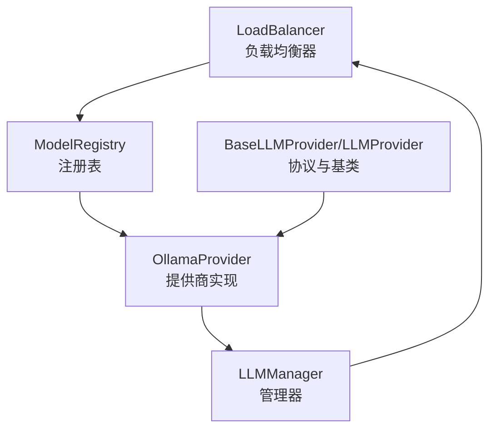
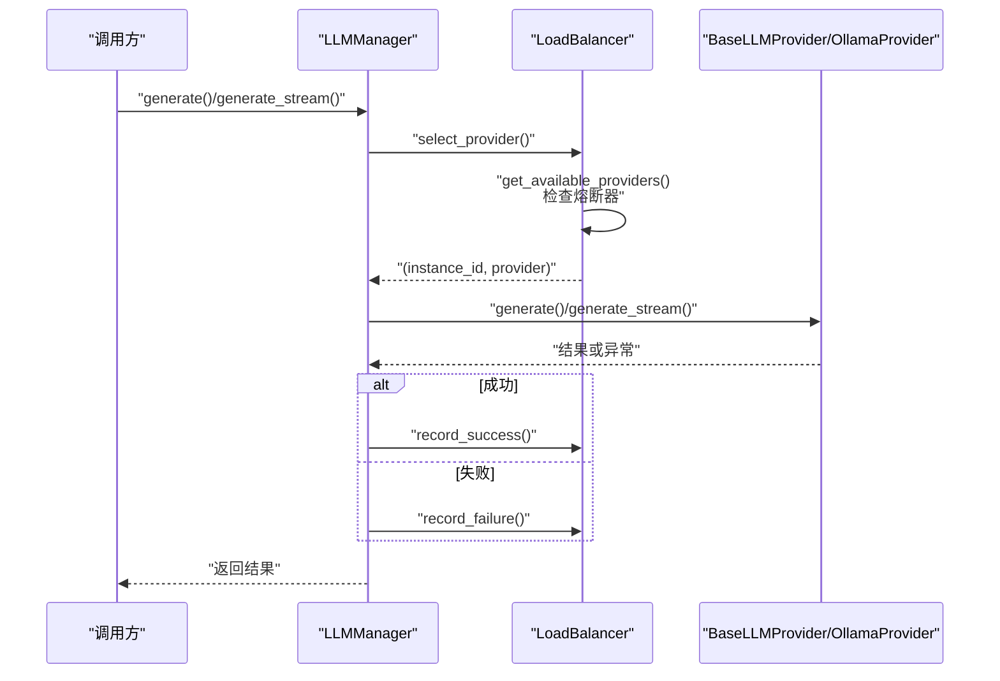
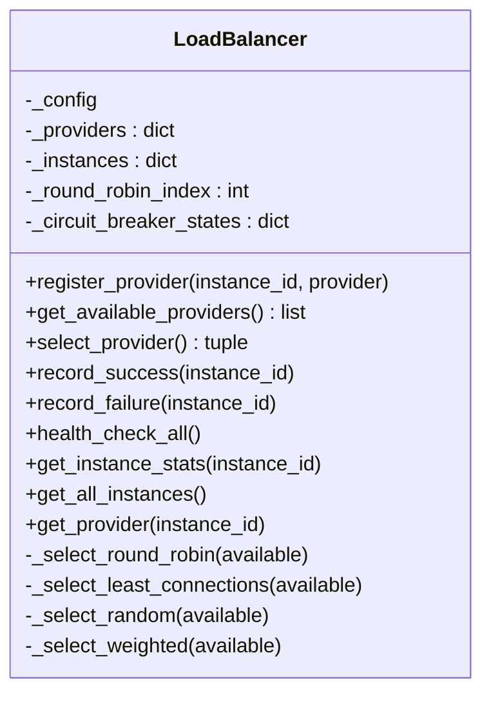
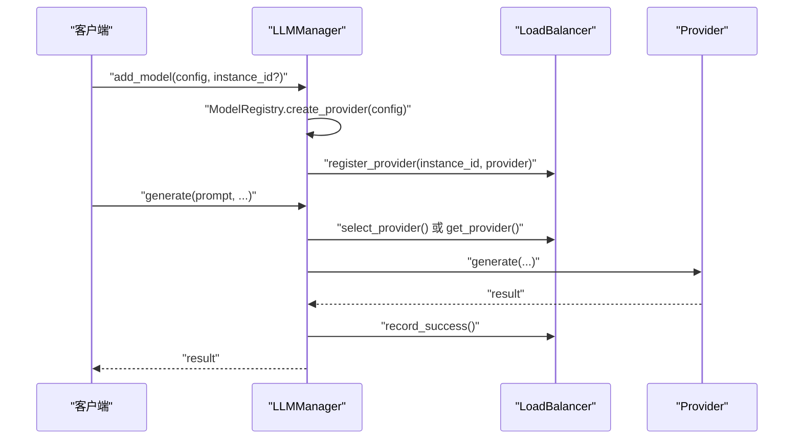
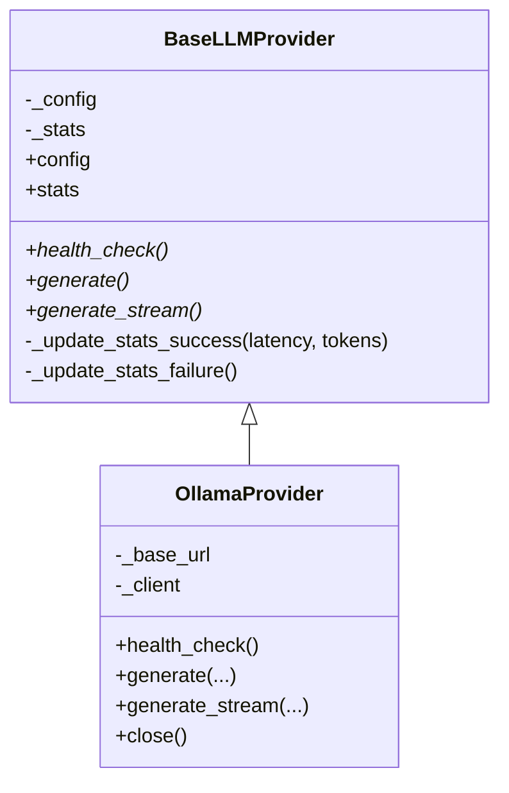
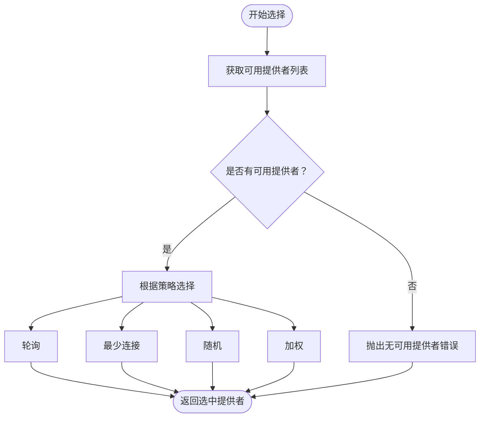
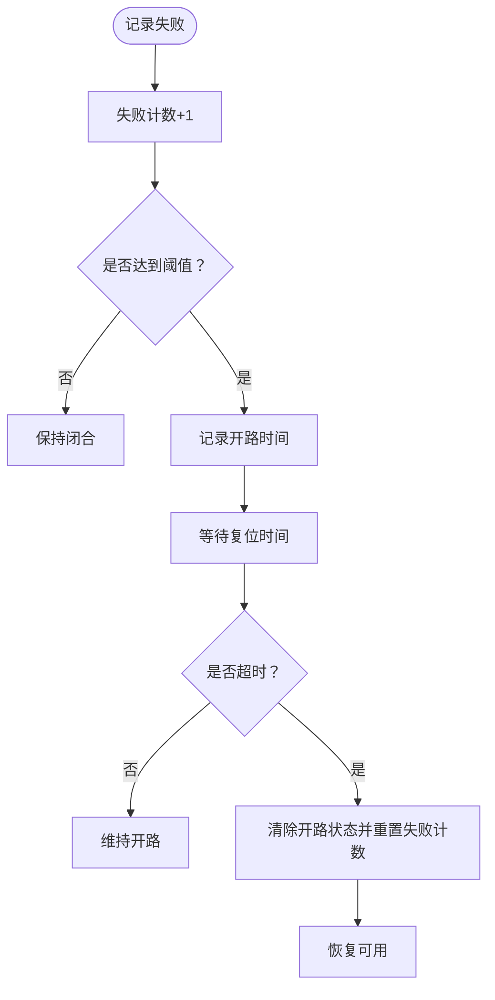
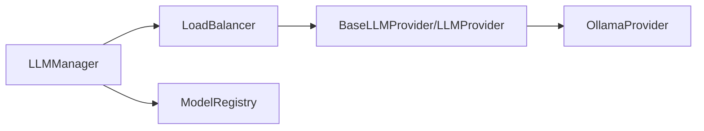

# 负载均衡器

<cite>
**本文引用的文件**
- [load_balancer.py](file://src/taolib/testing/multi_agent/llm/load_balancer.py)
- [manager.py](file://src/taolib/testing/multi_agent/llm/manager.py)
- [registry.py](file://src/taolib/testing/multi_agent/llm/registry.py)
- [protocols.py](file://src/taolib/testing/multi_agent/llm/protocols.py)
- [ollama_provider.py](file://src/taolib/testing/multi_agent/llm/ollama_provider.py)
- [test_load_balancer.py](file://tests/testing/test_multi_agent/test_load_balancer.py)
</cite>

## 目录
1. [简介](#简介)
2. [项目结构](#项目结构)
3. [核心组件](#核心组件)
4. [架构总览](#架构总览)
5. [详细组件分析](#详细组件分析)
6. [依赖关系分析](#依赖关系分析)
7. [性能考量](#性能考量)
8. [故障排除指南](#故障排除指南)
9. [结论](#结论)
10. [附录：使用示例与集成模式](#附录使用示例与集成模式)

## 简介
本技术文档围绕多智能体系统中的LLM负载均衡器展开，系统性阐述LoadBalancer类的设计原理、算法实现与运行机制，覆盖提供者注册、多种选择策略（轮询、最少连接、随机、加权）、熔断器（故障转移）与健康检查流程；同时说明实例状态跟踪、性能统计与动态调整策略，并给出配置项、性能优化建议与故障排除指南。

## 项目结构
本项目在多智能体模块下提供了完整的LLM负载均衡与管理能力：
- 负载均衡器：负责提供者选择、状态管理与熔断控制
- 管理器：对外提供统一的生成接口，封装负载均衡与错误处理
- 注册表：集中管理不同提供商类型的映射与实例创建
- 协议与抽象：定义统一的提供商接口与基类，便于扩展新提供商
- 示例提供商：以Ollama为例展示如何实现具体提供商

图表来源
- [load_balancer.py:21-246](file://src/taolib/testing/multi_agent/llm/load_balancer.py#L21-L246)
- [manager.py:22-229](file://src/taolib/testing/multi_agent/llm/manager.py#L22-L229)
- [registry.py:12-73](file://src/taolib/testing/multi_agent/llm/registry.py#L12-L73)
- [protocols.py:87-165](file://src/taolib/testing/multi_agent/llm/protocols.py#L87-L165)
- [ollama_provider.py:22-238](file://src/taolib/testing/multi_agent/llm/ollama_provider.py#L22-L238)

章节来源
- [load_balancer.py:1-246](file://src/taolib/testing/multi_agent/llm/load_balancer.py#L1-L246)
- [manager.py:1-229](file://src/taolib/testing/multi_agent/llm/manager.py#L1-L229)
- [registry.py:1-73](file://src/taolib/testing/multi_agent/llm/registry.py#L1-L73)
- [protocols.py:1-165](file://src/taolib/testing/multi_agent/llm/protocols.py#L1-L165)
- [ollama_provider.py:1-238](file://src/taolib/testing/multi_agent/llm/ollama_provider.py#L1-L238)

## 核心组件
- LoadBalancer：核心调度器，维护提供者集合、实例状态、轮询索引与熔断状态，按策略选择提供者并记录成功/失败
- LLMManager：面向上层的统一入口，负责添加模型、执行生成与流式生成、健康检查与统计查询
- ModelRegistry：提供商类型到实现类的注册表，支持动态创建提供商实例
- BaseLLMProvider/LLMProvider：定义提供商的统一接口与抽象基类，便于扩展新提供商
- OllamaProvider：具体提供商实现，封装健康检查、同步与流式生成逻辑，并维护统计信息

章节来源
- [load_balancer.py:21-246](file://src/taolib/testing/multi_agent/llm/load_balancer.py#L21-L246)
- [manager.py:22-229](file://src/taolib/testing/multi_agent/llm/manager.py#L22-L229)
- [registry.py:12-73](file://src/taolib/testing/multi_agent/llm/registry.py#L12-L73)
- [protocols.py:87-165](file://src/taolib/testing/multi_agent/llm/protocols.py#L87-L165)
- [ollama_provider.py:22-238](file://src/taolib/testing/multi_agent/llm/ollama_provider.py#L22-L238)

## 架构总览
下图展示了从调用方到负载均衡器、再到具体提供商的完整交互链路，以及健康检查与统计更新的流程。

图表来源
- [manager.py:57-157](file://src/taolib/testing/multi_agent/llm/manager.py#L57-L157)
- [load_balancer.py:155-205](file://src/taolib/testing/multi_agent/llm/load_balancer.py#L155-L205)
- [protocols.py:109-138](file://src/taolib/testing/multi_agent/llm/protocols.py#L109-L138)
- [ollama_provider.py:75-231](file://src/taolib/testing/multi_agent/llm/ollama_provider.py#L75-L231)

## 详细组件分析

### LoadBalancer 类设计与算法
- 初始化与状态
  - 维护提供者字典、实例字典、轮询索引与熔断器状态字典
  - 支持通过配置对象设置选择策略与熔断阈值等参数
- 提供者注册
  - 注册时创建对应实例并初始化状态为可用，同时建立熔断器初始状态
- 可用提供者筛选
  - 在每次选择前先过滤熔断中的实例；若超过复位时间则自动恢复
- 选择策略
  - 轮询：基于内部索引循环选择
  - 最少连接：根据当前并发请求数最小化选择
  - 随机：均匀随机选择
  - 加权：按权重累加概率选择，权重为非正时回退为随机
- 故障记录与熔断
  - 成功清零失败计数；失败次数达到阈值后开启熔断并记录时间
  - 超过复位时间后自动重置熔断状态
- 健康检查
  - 对所有提供商异步执行健康检查，更新实例状态为可用/不可用
- 统计与查询
  - 提供单实例统计查询与全量实例查询接口

图表来源
- [load_balancer.py:21-246](file://src/taolib/testing/multi_agent/llm/load_balancer.py#L21-L246)

章节来源
- [load_balancer.py:24-246](file://src/taolib/testing/multi_agent/llm/load_balancer.py#L24-L246)

### LLMManager 组件
- 添加模型
  - 通过注册表创建具体提供商实例并注册到负载均衡器
  - 若首次添加则作为默认提供商
- 生成与流式生成
  - 支持显式指定实例ID或交由负载均衡器选择
  - 包装异常并记录成功/失败，向上抛出统一错误类型
- 健康检查
  - 支持单实例或全量健康检查
- 统计查询
  - 提供可用实例ID列表、单实例统计与全量实例查询

图表来源
- [manager.py:35-106](file://src/taolib/testing/multi_agent/llm/manager.py#L35-L106)
- [registry.py:44-55](file://src/taolib/testing/multi_agent/llm/registry.py#L44-L55)
- [load_balancer.py:36-52](file://src/taolib/testing/multi_agent/llm/load_balancer.py#L36-L52)

章节来源
- [manager.py:22-229](file://src/taolib/testing/multi_agent/llm/manager.py#L22-L229)

### Provider 抽象与 Ollama 实现
- 抽象与协议
  - 定义统一的健康检查、同步生成与流式生成接口
  - 提供统计字段与更新方法，便于记录成功/失败与延迟
- OllamaProvider
  - 基于异步HTTP客户端访问本地Ollama服务
  - 同步与流式两种生成方式，均包含超时、连接错误与通用异常处理
  - 更新统计信息：成功时累计请求、成功、令牌数与平均延迟；失败时累计请求与失败，并记录最后错误时间与消息

图表来源
- [protocols.py:87-165](file://src/taolib/testing/multi_agent/llm/protocols.py#L87-L165)
- [ollama_provider.py:22-238](file://src/taolib/testing/multi_agent/llm/ollama_provider.py#L22-L238)

章节来源
- [protocols.py:87-165](file://src/taolib/testing/multi_agent/llm/protocols.py#L87-L165)
- [ollama_provider.py:22-238](file://src/taolib/testing/multi_agent/llm/ollama_provider.py#L22-L238)

### 选择策略与算法细节
- 轮询（Round Robin）
  - 基于递增索引与可用列表长度取模，确保顺序轮转
- 最少连接（Least Connections）
  - 依据实例统计中的当前并发请求数进行比较，选择较小者
- 随机（Random）
  - 从可用列表中均匀随机选择
- 加权（Weighted）
  - 权重累加概率选择；当总权重非正时回退为随机

图表来源
- [load_balancer.py:155-180](file://src/taolib/testing/multi_agent/llm/load_balancer.py#L155-L180)
- [load_balancer.py:77-153](file://src/taolib/testing/multi_agent/llm/load_balancer.py#L77-L153)

章节来源
- [load_balancer.py:77-180](file://src/taolib/testing/multi_agent/llm/load_balancer.py#L77-L180)

### 熔断器与故障转移
- 状态字段
  - 失败计数与开路起始时间
- 触发条件
  - 失败次数达到阈值即开启熔断
- 自动复位
  - 超过复位时间后清除开路状态并重置失败计数
- 可用性过滤
  - 选择前会检查熔断状态，未复位的实例会被排除

图表来源
- [load_balancer.py:191-205](file://src/taolib/testing/multi_agent/llm/load_balancer.py#L191-L205)
- [load_balancer.py:66-73](file://src/taolib/testing/multi_agent/llm/load_balancer.py#L66-L73)

章节来源
- [load_balancer.py:191-205](file://src/taolib/testing/multi_agent/llm/load_balancer.py#L191-L205)
- [load_balancer.py:66-73](file://src/taolib/testing/multi_agent/llm/load_balancer.py#L66-L73)

### 健康检查与状态管理
- 健康检查
  - 对每个提供商异步执行健康检查，更新实例状态为可用或不可用
- 实例状态
  - 维护可用/不可用状态，配合熔断器共同决定可选性
- 统计信息
  - 提供商实现负责更新请求总量、成功/失败次数、平均延迟、最后错误时间与消息等

章节来源
- [load_balancer.py:206-216](file://src/taolib/testing/multi_agent/llm/load_balancer.py#L206-L216)
- [ollama_provider.py:46-74](file://src/taolib/testing/multi_agent/llm/ollama_provider.py#L46-L74)
- [protocols.py:140-165](file://src/taolib/testing/multi_agent/llm/protocols.py#L140-L165)

## 依赖关系分析
- 组件耦合
  - LLMManager 依赖 LoadBalancer 与 ModelRegistry，形成“管理—调度—注册”的分层
  - LoadBalancer 依赖提供商协议与实例模型，不直接依赖具体实现
  - OllamaProvider 实现 BaseLLMProvider，遵循统一接口
- 外部依赖
  - OllamaProvider 使用异步HTTP客户端访问本地服务端点
  - 测试用例验证选择策略与熔断行为

图表来源
- [manager.py:12-19](file://src/taolib/testing/multi_agent/llm/manager.py#L12-L19)
- [load_balancer.py:12-18](file://src/taolib/testing/multi_agent/llm/load_balancer.py#L12-L18)
- [protocols.py:87-107](file://src/taolib/testing/multi_agent/llm/protocols.py#L87-L107)
- [ollama_provider.py:18-33](file://src/taolib/testing/multi_agent/llm/ollama_provider.py#L18-L33)

章节来源
- [manager.py:12-19](file://src/taolib/testing/multi_agent/llm/manager.py#L12-L19)
- [load_balancer.py:12-18](file://src/taolib/testing/multi_agent/llm/load_balancer.py#L12-L18)
- [protocols.py:87-107](file://src/taolib/testing/multi_agent/llm/protocols.py#L87-L107)
- [ollama_provider.py:18-33](file://src/taolib/testing/multi_agent/llm/ollama_provider.py#L18-L33)

## 性能考量
- 选择策略复杂度
  - 轮询与随机为O(n)（n为可用提供者数量），最少连接为O(n)，加权为O(n)+权重求和
- 并发与延迟
  - 最少连接策略有助于降低热点实例压力，提升整体吞吐
  - 加权策略适合资源不均场景，需合理设置权重
- 熔断与健康检查
  - 合理设置失败阈值与复位时间，避免误熔断或恢复过慢
  - 健康检查应周期性执行，避免频繁探测造成额外开销
- 统计与可观测性
  - 利用平均延迟与成功/失败率评估实例性能，结合熔断状态进行动态调整

[本节为通用性能讨论，无需列出章节来源]

## 故障排除指南
- 现象：无可用提供者
  - 排查：确认所有实例是否处于可用状态，检查熔断器是否开启且未复位
  - 处理：等待熔断复位或手动修复实例健康状况
- 现象：频繁熔断
  - 排查：检查失败阈值与复位时间设置是否过严
  - 处理：适当提高阈值或缩短复位时间；同时排查实例本身问题
- 现象：加权选择效果不明显
  - 排查：确认权重设置是否合理，总权重是否为正值
  - 处理：调整权重或回退为其他策略
- 现象：健康检查失败
  - 排查：确认网络连通性、服务端口与模型可用性
  - 处理：修复服务端或调整基础URL与超时配置

章节来源
- [test_load_balancer.py:125-151](file://tests/testing/test_multi_agent/test_load_balancer.py#L125-L151)
- [load_balancer.py:66-73](file://src/taolib/testing/multi_agent/llm/load_balancer.py#L66-L73)
- [ollama_provider.py:46-74](file://src/taolib/testing/multi_agent/llm/ollama_provider.py#L46-L74)

## 结论
该负载均衡器通过清晰的分层设计与可插拔的提供商模型，实现了稳定的选择策略、完善的熔断与健康检查机制，并提供了丰富的统计与查询能力。结合最少连接与加权策略，可在多实例环境下实现更优的资源利用与稳定性保障。

[本节为总结性内容，无需列出章节来源]

## 附录：使用示例与集成模式
- 添加模型并注册
  - 使用注册表创建提供商实例并注册到负载均衡器
- 显式指定实例ID
  - 在生成调用中传入实例ID，绕过负载均衡器选择
- 统一生成接口
  - 通过管理器的同步与流式生成接口完成文本生成，内部自动记录成功/失败
- 健康检查与统计
  - 支持单实例与全量健康检查；可查询实例统计与可用实例列表

章节来源
- [manager.py:35-106](file://src/taolib/testing/multi_agent/llm/manager.py#L35-L106)
- [manager.py:159-202](file://src/taolib/testing/multi_agent/llm/manager.py#L159-L202)
- [registry.py:44-55](file://src/taolib/testing/multi_agent/llm/registry.py#L44-L55)
- [test_load_balancer.py:164-228](file://tests/testing/test_multi_agent/test_load_balancer.py#L164-L228)