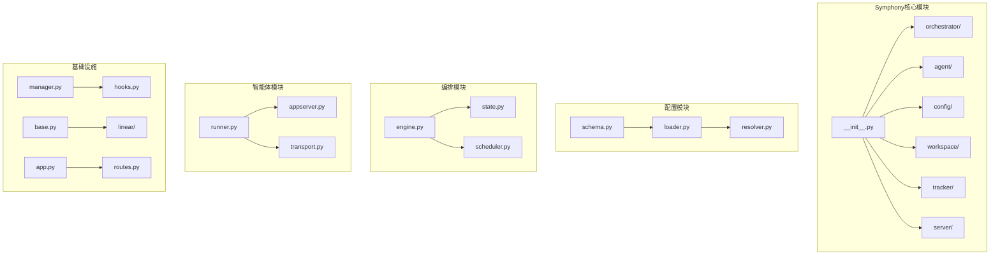
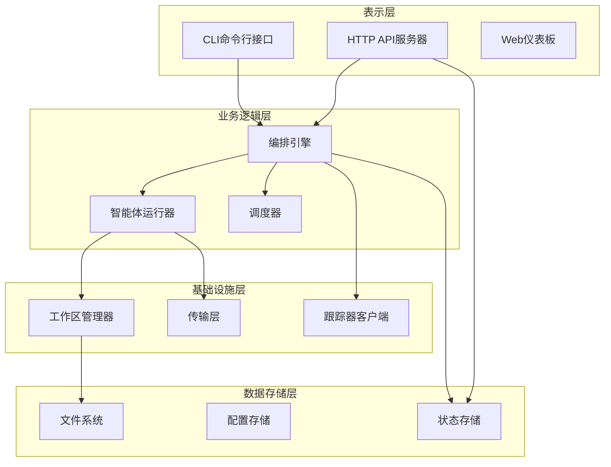
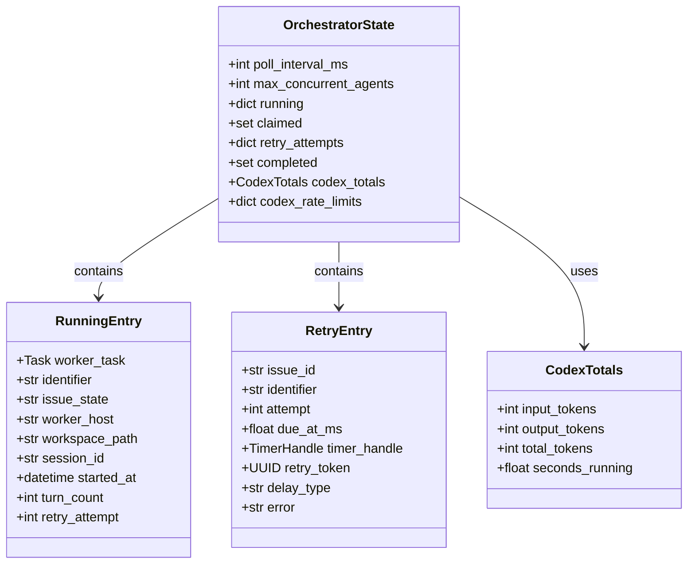
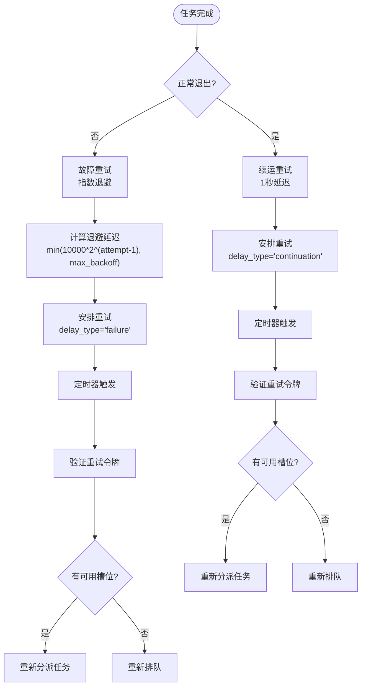
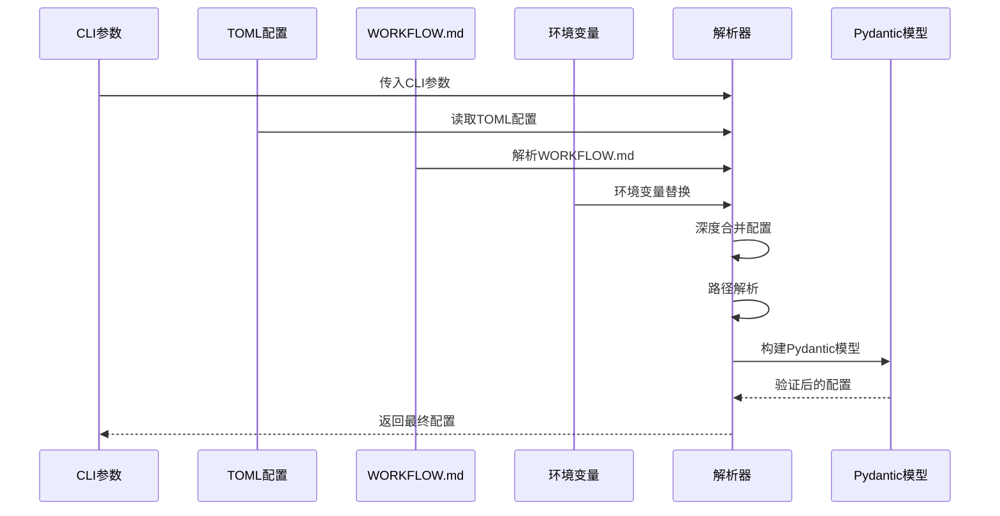
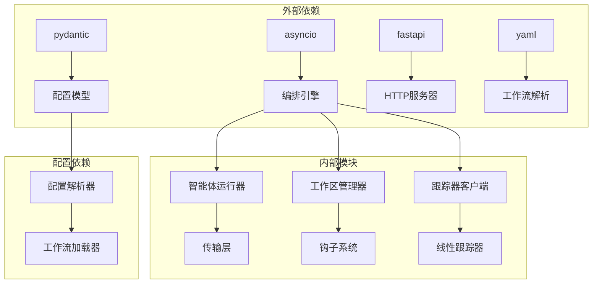

# Symphony编排系统

<cite>
**本文档引用的文件**
- [src/taolib/symphony/__init__.py](file://src/taolib/symphony/__init__.py)
- [src/taolib/symphony/orchestrator/engine.py](file://src/taolib/symphony/orchestrator/engine.py)
- [src/taolib/symphony/orchestrator/state.py](file://src/taolib/symphony/orchestrator/state.py)
- [src/taolib/symphony/agent/runner.py](file://src/taolib/symphony/agent/runner.py)
- [src/taolib/symphony/config/schema.py](file://src/taolib/symphony/config/schema.py)
- [src/taolib/symphony/config/loader.py](file://src/taolib/symphony/config/loader.py)
- [src/taolib/symphony/config/resolver.py](file://src/taolib/symphony/config/resolver.py)
- [src/taolib/symphony/workspace/manager.py](file://src/taolib/symphony/workspace/manager.py)
- [src/taolib/symphony/tracker/base.py](file://src/taolib/symphony/tracker/base.py)
- [src/taolib/symphony/cli.py](file://src/taolib/symphony/cli.py)
- [src/taolib/symphony/server/app.py](file://src/taolib/symphony/server/app.py)
- [examples/multi_agent_example.py](file://examples/multi_agent_example.py)
</cite>

## 目录
1. [简介](#简介)
2. [项目结构](#项目结构)
3. [核心组件](#核心组件)
4. [架构概览](#架构概览)
5. [详细组件分析](#详细组件分析)
6. [依赖关系分析](#依赖关系分析)
7. [性能考虑](#性能考虑)
8. [故障排除指南](#故障排除指南)
9. [结论](#结论)

## 简介

Symphony是一个基于Python的智能体编排系统，专门设计用于自动化处理问题跟踪器中的任务。该系统的核心功能包括：

- **轮询机制**：定期检查问题跟踪器中的活跃任务
- **智能体编排**：为每个任务创建隔离的工作区并运行AI智能体
- **状态管理**：维护复杂的运行时状态和重试机制
- **工作区隔离**：为每个任务提供独立的文件系统环境
- **监控仪表板**：提供实时的状态监控和可视化界面

系统采用异步编程模型，使用asyncio事件循环确保高并发性能，同时通过严格的幂等性检查避免重复处理。

## 项目结构

Symphony编排系统采用模块化的架构设计，主要分为以下几个核心模块：

**图表来源**
- [src/taolib/symphony/__init__.py:1-43](file://src/taolib/symphony/__init__.py#L1-L43)
- [src/taolib/symphony/orchestrator/engine.py:1-989](file://src/taolib/symphony/orchestrator/engine.py#L1-L989)
- [src/taolib/symphony/config/schema.py:1-139](file://src/taolib/symphony/config/schema.py#L1-L139)

**章节来源**
- [src/taolib/symphony/__init__.py:1-43](file://src/taolib/symphony/__init__.py#L1-L43)

## 核心组件

### 编排引擎 (Orchestrator)

编排引擎是Symphony系统的核心，负责整个生命周期的管理：

- **单线程事件循环**：确保所有状态变更的串行化
- **轮询机制**：定期检查活跃任务状态
- **分派逻辑**：根据优先级和资源可用性分派任务
- **重试机制**：实现指数退避和续运重试策略

### 智能体运行器 (AgentRunner)

智能体运行器管理单个任务的完整执行流程：

- **工作区管理**：创建和清理隔离的工作环境
- **钩子执行**：在关键节点执行预定义的脚本
- **会话管理**：启动和停止AI智能体会话
- **轮次控制**：管理任务执行的轮次和超时

### 配置管理系统

系统提供多层次的配置管理：

- **工作流加载**：解析WORKFLOW.md文件
- **配置解析**：合并多种配置源并进行验证
- **环境变量支持**：动态替换配置中的环境变量
- **路径解析**：正确处理相对路径和用户目录

**章节来源**
- [src/taolib/symphony/orchestrator/engine.py:47-800](file://src/taolib/symphony/orchestrator/engine.py#L47-L800)
- [src/taolib/symphony/agent/runner.py:64-200](file://src/taolib/symphony/agent/runner.py#L64-L200)
- [src/taolib/symphony/config/resolver.py:127-200](file://src/taolib/symphony/config/resolver.py#L127-L200)

## 架构概览

Symphony采用分层架构设计，各层职责明确且松耦合：

**图表来源**
- [src/taolib/symphony/cli.py:18-109](file://src/taolib/symphony/cli.py#L18-L109)
- [src/taolib/symphony/server/app.py:32-71](file://src/taolib/symphony/server/app.py#L32-L71)
- [src/taolib/symphony/orchestrator/engine.py:66-86](file://src/taolib/symphony/orchestrator/engine.py#L66-L86)

## 详细组件分析

### 编排引擎状态管理

编排引擎使用复杂的状态管理系统来跟踪所有运行中的任务：

**图表来源**
- [src/taolib/symphony/orchestrator/state.py:147-175](file://src/taolib/symphony/orchestrator/state.py#L147-L175)

### 重试机制设计

系统实现了智能的重试策略，支持两种类型的重试：

**图表来源**
- [src/taolib/symphony/orchestrator/engine.py:489-577](file://src/taolib/symphony/orchestrator/engine.py#L489-L577)
- [src/taolib/symphony/orchestrator/engine.py:578-674](file://src/taolib/symphony/orchestrator/engine.py#L578-L674)

### 配置解析流程

配置系统支持多源合并，具有明确的优先级顺序：

**图表来源**
- [src/taolib/symphony/config/resolver.py:127-183](file://src/taolib/symphony/config/resolver.py#L127-L183)

**章节来源**
- [src/taolib/symphony/orchestrator/state.py:25-175](file://src/taolib/symphony/orchestrator/state.py#L25-L175)
- [src/taolib/symphony/orchestrator/engine.py:489-674](file://src/taolib/symphony/orchestrator/engine.py#L489-L674)
- [src/taolib/symphony/config/resolver.py:127-183](file://src/taolib/symphony/config/resolver.py#L127-L183)

## 依赖关系分析

Symphony系统遵循清晰的依赖层次结构：

**图表来源**
- [src/taolib/symphony/orchestrator/engine.py:16-36](file://src/taolib/symphony/orchestrator/engine.py#L16-L36)
- [src/taolib/symphony/config/schema.py:10-11](file://src/taolib/symphony/config/schema.py#L10-L11)

系统的主要依赖关系特点：

- **松耦合设计**：通过抽象基类实现模块间的解耦
- **配置驱动**：大部分行为通过配置文件控制
- **异步优先**：所有I/O操作都采用异步模式
- **幂等性保证**：通过状态检查避免重复处理

**章节来源**
- [src/taolib/symphony/tracker/base.py:12-50](file://src/taolib/symphony/tracker/base.py#L12-L50)
- [src/taolib/symphony/config/schema.py:16-139](file://src/taolib/symphony/config/schema.py#L16-L139)

## 性能考虑

Symphony编排系统在设计时充分考虑了性能优化：

### 并发控制
- **单线程状态管理**：编排器状态在单个事件循环中串行处理
- **异步I/O**：所有网络和文件操作采用异步模式
- **资源池管理**：通过配置限制最大并发数

### 内存优化
- **增量令牌统计**：只报告新增的令牌使用量
- **状态压缩**：定期清理已完成的任务状态
- **工作区复用**：支持工作区的重复使用

### 网络效率
- **批量状态查询**：一次请求获取多个任务状态
- **连接复用**：智能体客户端复用连接
- **超时控制**：合理的超时设置避免资源泄露

## 故障排除指南

### 常见问题诊断

**编排器启动失败**
1. 检查配置文件语法
2. 验证跟踪器API密钥
3. 确认工作区目录权限
4. 查看启动日志中的验证错误

**任务分派异常**
1. 检查并发限制配置
2. 验证工作区创建权限
3. 确认智能体命令可用性
4. 查看重试队列状态

**智能体运行错误**
1. 检查工作区钩子执行情况
2. 验证智能体命令参数
3. 确认会话初始化成功
4. 查看令牌使用统计

### 监控和调试

系统提供了丰富的监控指标：

- **运行时统计**：令牌使用量、运行时长、轮次统计
- **状态快照**：当前活跃任务、重试队列、工作区状态
- **性能指标**：轮询间隔、处理延迟、错误率

**章节来源**
- [src/taolib/symphony/orchestrator/engine.py:92-179](file://src/taolib/symphony/orchestrator/engine.py#L92-L179)
- [src/taolib/symphony/agent/runner.py:86-200](file://src/taolib/symphony/agent/runner.py#L86-L200)

## 结论

Symphony编排系统是一个设计精良的智能体自动化平台，具有以下突出特点：

**架构优势**
- 清晰的分层设计和模块化结构
- 强大的状态管理和重试机制
- 灵活的配置系统和扩展能力

**技术特色**
- 基于异步编程的高性能实现
- 严格的安全措施和权限控制
- 完善的监控和可观测性支持

**应用场景**
- 自动化问题处理和代码生成
- 智能体工作流编排
- 多租户任务管理
- CI/CD流水线集成

该系统为构建复杂的智能体应用提供了坚实的基础，其模块化设计使得扩展和定制变得简单直接。通过合理配置和监控，可以满足各种生产环境的需求。