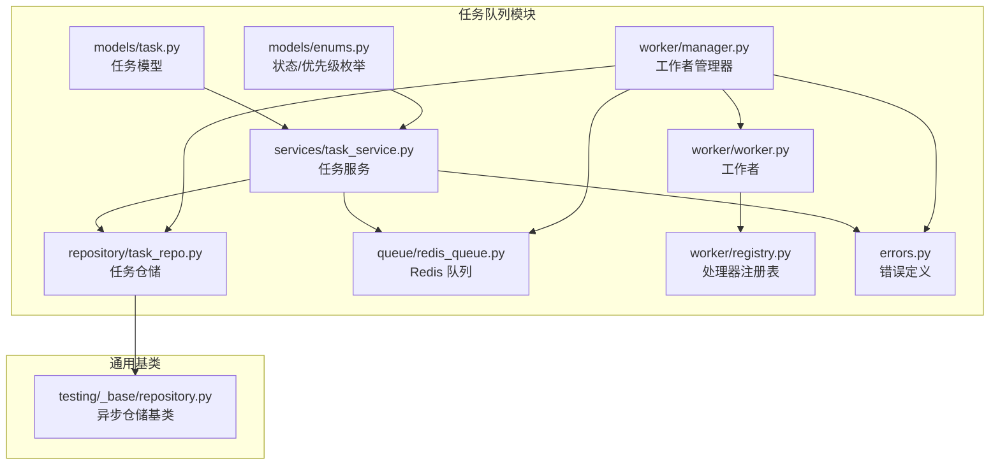
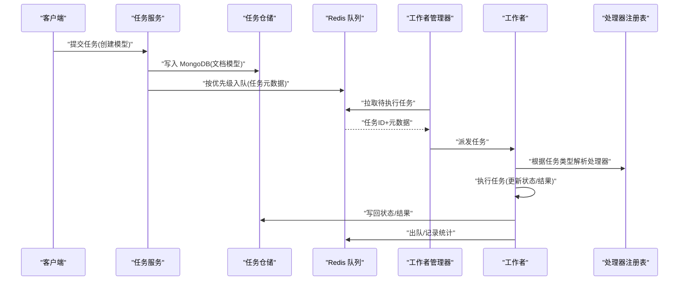
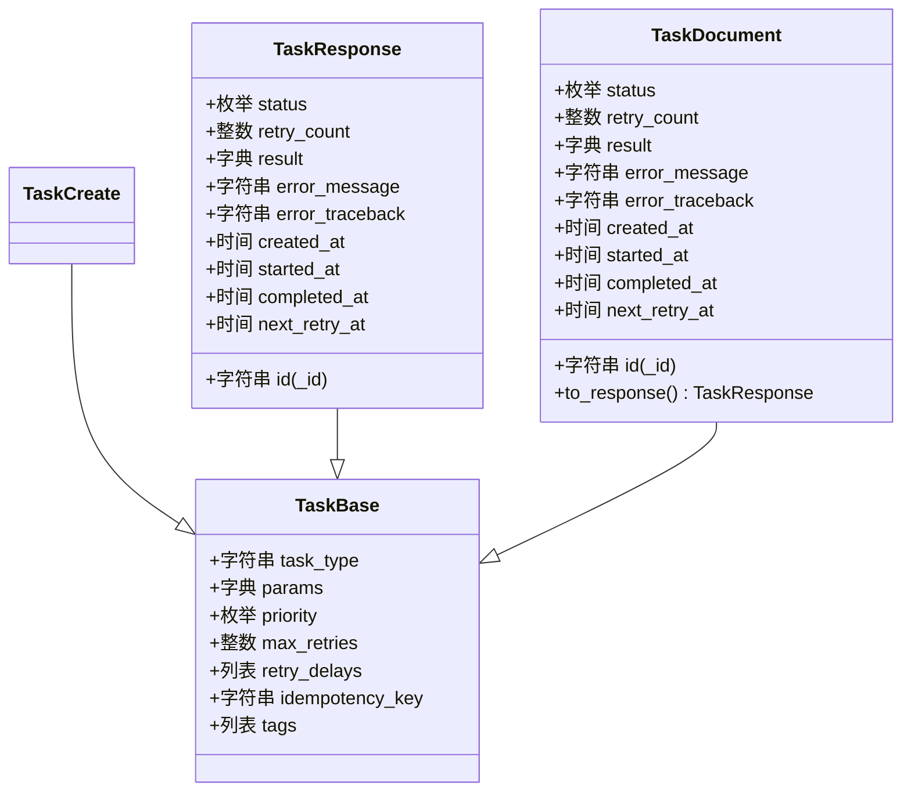
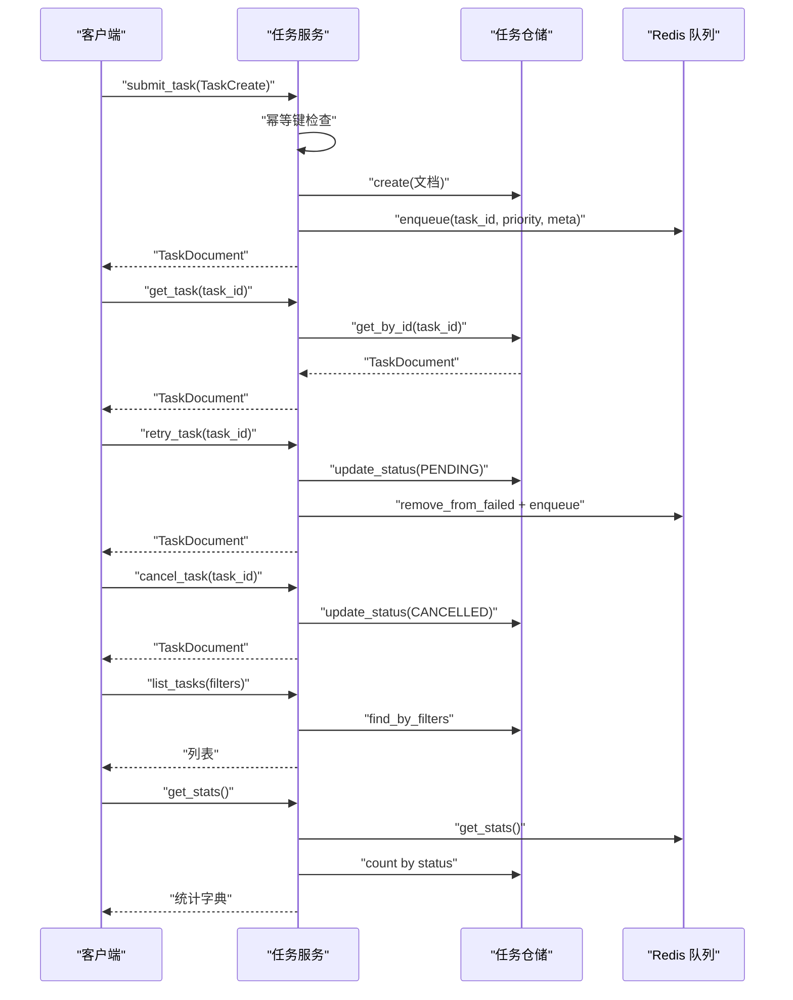
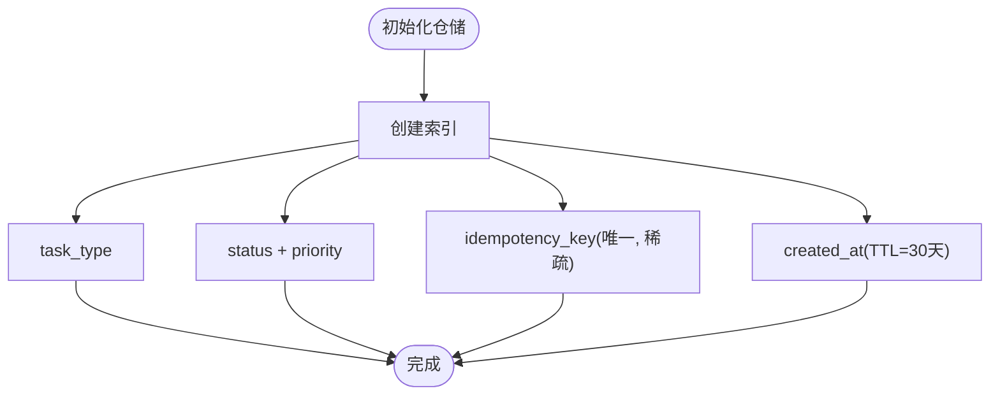
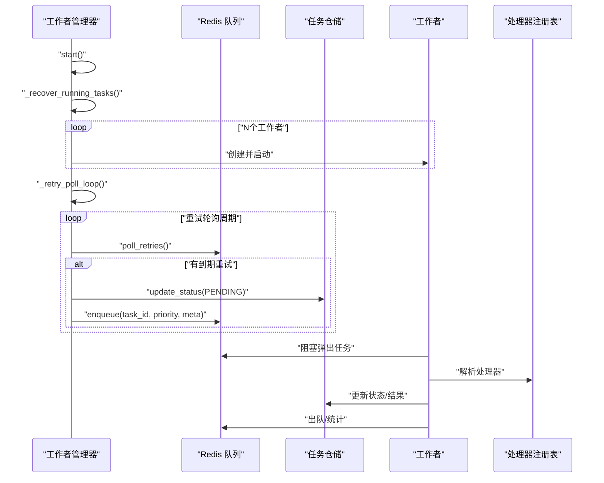
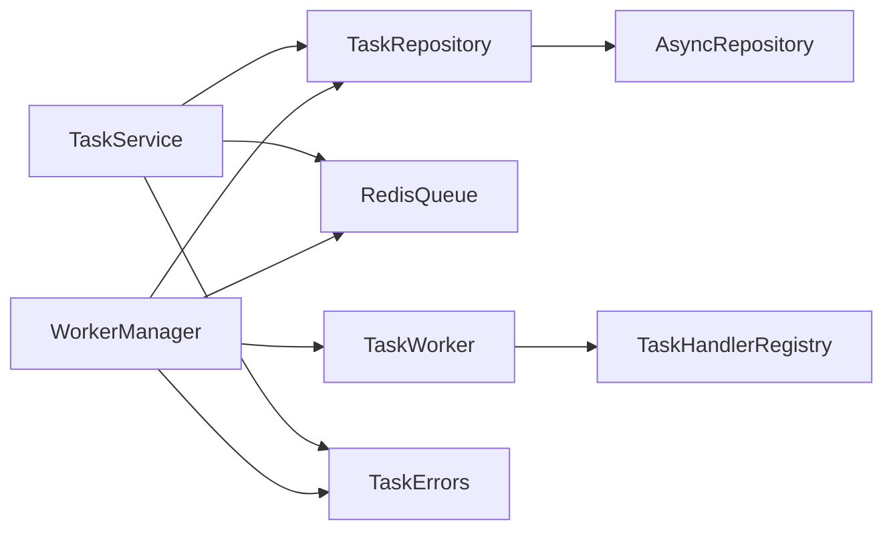

# 任务编排

<cite>
**本文引用的文件**
- [src/taolib/testing/task_queue/models/task.py](file://src/taolib/testing/task_queue/models/task.py)
- [src/taolib/testing/task_queue/models/enums.py](file://src/taolib/testing/task_queue/models/enums.py)
- [src/taolib/testing/task_queue/services/task_service.py](file://src/taolib/testing/task_queue/services/task_service.py)
- [src/taolib/testing/task_queue/repository/task_repo.py](file://src/taolib/testing/task_queue/repository/task_repo.py)
- [src/taolib/testing/task_queue/worker/manager.py](file://src/taolib/testing/task_queue/worker/manager.py)
- [src/taolib/testing/task_queue/queue/redis_queue.py](file://src/taolib/testing/task_queue/queue/redis_queue.py)
- [src/taolib/testing/task_queue/worker/worker.py](file://src/taolib/testing/task_queue/worker/worker.py)
- [src/taolib/testing/task_queue/worker/registry.py](file://src/taolib/testing/task_queue/worker/registry.py)
- [src/taolib/testing/_base/repository.py](file://src/taolib/testing/_base/repository.py)
- [src/taolib/testing/task_queue/errors.py](file://src/taolib/testing/task_queue/errors.py)
</cite>

## 目录
1. [简介](#简介)
2. [项目结构](#项目结构)
3. [核心组件](#核心组件)
4. [架构总览](#架构总览)
5. [详细组件分析](#详细组件分析)
6. [依赖关系分析](#依赖关系分析)
7. [性能考虑](#性能考虑)
8. [故障排查指南](#故障排查指南)
9. [结论](#结论)
10. [附录](#附录)

## 简介
本技术文档面向“任务编排系统”，聚焦于任务模型设计、状态管理与进度跟踪、消息传递协议与路由、任务约束与重试策略、并行执行与资源分配、以及完整的任务编排 API 参考。系统采用分层架构：数据模型层（Pydantic 四层模型）、服务层（业务逻辑）、仓储层（MongoDB 持久化）、工作器层（Redis 队列与并发执行）、以及错误与配置支持。通过幂等键、优先级队列、重试轮询与崩溃恢复机制，确保高可靠与高性能的任务调度。

## 项目结构
任务编排相关模块位于 src/taolib/testing/task_queue 下，围绕“模型-服务-仓储-工作器-队列”组织，配合通用仓储基类与错误定义，形成清晰的职责边界与扩展点。

图表来源
- [src/taolib/testing/task_queue/models/task.py:1-107](file://src/taolib/testing/task_queue/models/task.py#L1-L107)
- [src/taolib/testing/task_queue/models/enums.py:1-28](file://src/taolib/testing/task_queue/models/enums.py#L1-L28)
- [src/taolib/testing/task_queue/services/task_service.py:1-259](file://src/taolib/testing/task_queue/services/task_service.py#L1-L259)
- [src/taolib/testing/task_queue/repository/task_repo.py:1-169](file://src/taolib/testing/task_queue/repository/task_repo.py#L1-L169)
- [src/taolib/testing/task_queue/worker/manager.py:1-225](file://src/taolib/testing/task_queue/worker/manager.py#L1-L225)
- [src/taolib/testing/task_queue/queue/redis_queue.py](file://src/taolib/testing/task_queue/queue/redis_queue.py)
- [src/taolib/testing/task_queue/worker/worker.py](file://src/taolib/testing/task_queue/worker/worker.py)
- [src/taolib/testing/task_queue/worker/registry.py](file://src/taolib/testing/task_queue/worker/registry.py)
- [src/taolib/testing/_base/repository.py](file://src/taolib/testing/_base/repository.py)
- [src/taolib/testing/task_queue/errors.py](file://src/taolib/testing/task_queue/errors.py)

章节来源
- [src/taolib/testing/task_queue/models/task.py:1-107](file://src/taolib/testing/task_queue/models/task.py#L1-L107)
- [src/taolib/testing/task_queue/models/enums.py:1-28](file://src/taolib/testing/task_queue/models/enums.py#L1-L28)
- [src/taolib/testing/task_queue/services/task_service.py:1-259](file://src/taolib/testing/task_queue/services/task_service.py#L1-L259)
- [src/taolib/testing/task_queue/repository/task_repo.py:1-169](file://src/taolib/testing/task_queue/repository/task_repo.py#L1-L169)
- [src/taolib/testing/task_queue/worker/manager.py:1-225](file://src/taolib/testing/task_queue/worker/manager.py#L1-L225)
- [src/taolib/testing/_base/repository.py](file://src/taolib/testing/_base/repository.py)

## 核心组件
- 任务模型四层：Base/Create/Response/Document，覆盖创建、响应与持久化映射，统一字段与校验。
- 状态与优先级枚举：标准化任务生命周期状态与调度优先级。
- 任务服务：提交、查询、重试、取消、统计聚合，协调仓储与队列。
- 任务仓储：基于异步 Motor 的 MongoDB 访问，提供索引、过滤与计数。
- 工作者管理器：多工作者并发、重试轮询、崩溃恢复。
- Redis 队列：按优先级入队、重试轮询、运行中任务清理。
- 错误体系：任务存在性、查询缺失、状态不合法等专用异常。

章节来源
- [src/taolib/testing/task_queue/models/task.py:15-107](file://src/taolib/testing/task_queue/models/task.py#L15-L107)
- [src/taolib/testing/task_queue/models/enums.py:9-26](file://src/taolib/testing/task_queue/models/enums.py#L9-L26)
- [src/taolib/testing/task_queue/services/task_service.py:23-259](file://src/taolib/testing/task_queue/services/task_service.py#L23-L259)
- [src/taolib/testing/task_queue/repository/task_repo.py:15-169](file://src/taolib/testing/task_queue/repository/task_repo.py#L15-L169)
- [src/taolib/testing/task_queue/worker/manager.py:25-225](file://src/taolib/testing/task_queue/worker/manager.py#L25-L225)
- [src/taolib/testing/task_queue/errors.py](file://src/taolib/testing/task_queue/errors.py)

## 架构总览
系统采用“服务-仓储-队列-工作器”的分层解耦，服务层负责业务编排，仓储层负责持久化，队列层负责调度与重试，工作器层负责并发执行与崩溃恢复。

图表来源
- [src/taolib/testing/task_queue/services/task_service.py:43-94](file://src/taolib/testing/task_queue/services/task_service.py#L43-L94)
- [src/taolib/testing/task_queue/repository/task_repo.py:11-24](file://src/taolib/testing/task_queue/repository/task_repo.py#L11-L24)
- [src/taolib/testing/task_queue/queue/redis_queue.py](file://src/taolib/testing/task_queue/queue/redis_queue.py)
- [src/taolib/testing/task_queue/worker/manager.py:73-102](file://src/taolib/testing/task_queue/worker/manager.py#L73-L102)
- [src/taolib/testing/task_queue/worker/worker.py](file://src/taolib/testing/task_queue/worker/worker.py)
- [src/taolib/testing/task_queue/worker/registry.py](file://src/taolib/testing/task_queue/worker/registry.py)

## 详细组件分析

### 任务模型与状态管理
- 模型四层设计
  - Base：任务基础字段（类型、参数、优先级、重试策略、幂等键、标签）
  - Create：创建输入模型（继承基础）
  - Response：API 响应模型（含标识、状态、时间戳、结果与错误）
  - Document：MongoDB 文档模型（含默认值、UTC 时间、状态默认 pending）
- 状态与优先级
  - 状态：PENDING/RUNNING/COMPLETED/FAILED/RETRYING/CANCELLED
  - 优先级：HIGH/NORMAL/LOW
- 进度跟踪
  - created_at/started_at/completed_at/next_retry_at
  - retry_count/max_retries/retry_delays
  - result/error_message/error_traceback

图表来源
- [src/taolib/testing/task_queue/models/task.py:15-107](file://src/taolib/testing/task_queue/models/task.py#L15-L107)

章节来源
- [src/taolib/testing/task_queue/models/task.py:15-107](file://src/taolib/testing/task_queue/models/task.py#L15-L107)
- [src/taolib/testing/task_queue/models/enums.py:9-26](file://src/taolib/testing/task_queue/models/enums.py#L9-L26)

### 任务服务与API参考
- 提交任务 submit_task
  - 功能：幂等键检查、生成任务ID、写入 MongoDB、入队 Redis
  - 输入：TaskCreate
  - 输出：TaskDocument
  - 异常：TaskAlreadyExistsError
- 查询任务 get_task
  - 功能：按ID查询
  - 输入：task_id
  - 输出：TaskDocument
  - 异常：TaskNotFoundError
- 手动重试 retry_task
  - 功能：仅对 FAILED 任务重置状态并重新入队
  - 输入：task_id
  - 输出：TaskDocument
  - 异常：TaskNotFoundError、ValueError
- 取消任务 cancel_task
  - 功能：仅对 PENDING/RETRYING 任务标记 CANCELLED
  - 输入：task_id
  - 输出：TaskDocument
  - 异常：TaskNotFoundError、ValueError
- 列表查询 list_tasks
  - 功能：按状态/类型/优先级过滤，支持分页
  - 输入：status、task_type、priority、skip、limit
  - 输出：TaskDocument 列表
- 统计聚合 get_stats
  - 功能：合并 Redis 队列统计与 MongoDB 状态计数

图表来源
- [src/taolib/testing/task_queue/services/task_service.py:43-256](file://src/taolib/testing/task_queue/services/task_service.py#L43-L256)

章节来源
- [src/taolib/testing/task_queue/services/task_service.py:23-259](file://src/taolib/testing/task_queue/services/task_service.py#L23-L259)
- [src/taolib/testing/task_queue/errors.py](file://src/taolib/testing/task_queue/errors.py)

### 仓储与索引策略
- 继承通用异步仓储基类，提供 CRUD、列表、计数、索引创建等能力
- 关键索引
  - task_type：按类型查询
  - (status, priority)：按状态+优先级排序/过滤
  - idempotency_key：唯一且稀疏，支持幂等键去重
  - created_at：TTL 30 天，自动清理历史任务

图表来源
- [src/taolib/testing/task_queue/repository/task_repo.py:159-166](file://src/taolib/testing/task_queue/repository/task_repo.py#L159-L166)

章节来源
- [src/taolib/testing/task_queue/repository/task_repo.py:15-169](file://src/taolib/testing/task_queue/repository/task_repo.py#L15-L169)
- [src/taolib/testing/_base/repository.py](file://src/taolib/testing/_base/repository.py)

### 工作者管理与并行执行
- 多工作者并发：按配置数量启动 TaskWorker 协程
- 重试轮询：每 RETRY_POLL_INTERVAL 检查到期重试任务，更新状态并重新入队
- 崩溃恢复：扫描 Redis 运行中任务，识别超时或状态不一致的孤儿任务，进行清理或恢复
- 与注册表协作：根据任务类型解析处理器，执行具体业务逻辑

图表来源
- [src/taolib/testing/task_queue/worker/manager.py:73-223](file://src/taolib/testing/task_queue/worker/manager.py#L73-L223)
- [src/taolib/testing/task_queue/queue/redis_queue.py](file://src/taolib/testing/task_queue/queue/redis_queue.py)
- [src/taolib/testing/task_queue/worker/worker.py](file://src/taolib/testing/task_queue/worker/worker.py)
- [src/taolib/testing/task_queue/worker/registry.py](file://src/taolib/testing/task_queue/worker/registry.py)

章节来源
- [src/taolib/testing/task_queue/worker/manager.py:25-225](file://src/taolib/testing/task_queue/worker/manager.py#L25-L225)

### 消息传递协议与路由
- 协议载体：Redis 队列
- 路由机制：
  - 任务入队：按 priority 分槽（高/普通/低），实现优先级调度
  - 任务元数据：包含 task_type、priority、status，用于处理器选择与状态同步
  - 失败处理：失败任务进入失败集合，支持手动重试与轮询重试
- 进度与统计：Redis 提供实时队列统计，MongoDB 提供持久化状态计数

章节来源
- [src/taolib/testing/task_queue/services/task_service.py:80-86](file://src/taolib/testing/task_queue/services/task_service.py#L80-L86)
- [src/taolib/testing/task_queue/worker/manager.py:138-168](file://src/taolib/testing/task_queue/worker/manager.py#L138-L168)
- [src/taolib/testing/task_queue/queue/redis_queue.py](file://src/taolib/testing/task_queue/queue/redis_queue.py)

### 任务约束、子任务分解与并行策略
- 任务约束
  - 幂等键：避免重复提交
  - 最大重试次数与重试延迟序列：控制退避策略
  - 状态机约束：仅特定状态允许重试/取消
- 子任务分解
  - 当前实现聚焦单任务编排；如需子任务，可在任务处理器内部拆分子任务并分别入队
- 并行策略
  - 多工作者并发执行
  - 优先级队列保证高优任务优先
  - 崩溃恢复与重试轮询提升整体吞吐与可靠性

章节来源
- [src/taolib/testing/task_queue/models/task.py:18-29](file://src/taolib/testing/task_queue/models/task.py#L18-L29)
- [src/taolib/testing/task_queue/services/task_service.py:113-159](file://src/taolib/testing/task_queue/services/task_service.py#L113-L159)
- [src/taolib/testing/task_queue/worker/manager.py:73-102](file://src/taolib/testing/task_queue/worker/manager.py#L73-L102)

### 错误处理与异常管理
- 任务存在性：提交时幂等键冲突抛出 TaskAlreadyExistsError
- 任务查询：不存在时抛出 TaskNotFoundError
- 状态变更：非法状态（如非 FAILED 重试、非 PENDING/RETRYING 取消）抛出 ValueError
- 工作器：重试轮询与崩溃恢复使用日志记录异常，避免中断主流程

章节来源
- [src/taolib/testing/task_queue/errors.py](file://src/taolib/testing/task_queue/errors.py)
- [src/taolib/testing/task_queue/services/task_service.py:55-64](file://src/taolib/testing/task_queue/services/task_service.py#L55-L64)
- [src/taolib/testing/task_queue/services/task_service.py:128-133](file://src/taolib/testing/task_queue/services/task_service.py#L128-L133)
- [src/taolib/testing/task_queue/services/task_service.py:176-182](file://src/taolib/testing/task_queue/services/task_service.py#L176-L182)
- [src/taolib/testing/task_queue/worker/manager.py:164-167](file://src/taolib/testing/task_queue/worker/manager.py#L164-L167)

## 依赖关系分析
- 低耦合高内聚：模型、服务、仓储、工作器各司其职
- 外部依赖：Motor（异步 MongoDB）、Redis（队列与统计）
- 循环依赖：未见循环导入；错误定义独立，被服务与管理器使用

图表来源
- [src/taolib/testing/task_queue/services/task_service.py:11-41](file://src/taolib/testing/task_queue/services/task_service.py#L11-L41)
- [src/taolib/testing/task_queue/repository/task_repo.py:10-24](file://src/taolib/testing/task_queue/repository/task_repo.py#L10-L24)
- [src/taolib/testing/task_queue/worker/manager.py:34-56](file://src/taolib/testing/task_queue/worker/manager.py#L34-L56)
- [src/taolib/testing/_base/repository.py](file://src/taolib/testing/_base/repository.py)
- [src/taolib/testing/task_queue/errors.py](file://src/taolib/testing/task_queue/errors.py)

章节来源
- [src/taolib/testing/task_queue/services/task_service.py:11-41](file://src/taolib/testing/task_queue/services/task_service.py#L11-L41)
- [src/taolib/testing/task_queue/repository/task_repo.py:10-24](file://src/taolib/testing/task_queue/repository/task_repo.py#L10-L24)
- [src/taolib/testing/task_queue/worker/manager.py:34-56](file://src/taolib/testing/task_queue/worker/manager.py#L34-L56)
- [src/taolib/testing/_base/repository.py](file://src/taolib/testing/_base/repository.py)

## 性能考虑
- 队列优先级：通过 Redis 分槽降低高优任务等待延迟
- 重试轮询：固定周期检查到期重试，避免忙轮询
- 索引优化：复合索引支持常见过滤与排序
- TTL 清理：自动清理历史任务，控制存储增长
- 并发控制：工作者数量可配，平衡吞吐与资源占用

## 故障排查指南
- 提交失败（幂等键冲突）：检查 idempotency_key 是否重复
- 查询不到任务：确认 task_id 正确与任务是否存在
- 重试失败：仅 FAILED 任务可重试，检查任务状态
- 取消失败：仅 PENDING/RETRYING 可取消，检查当前状态
- 队列堆积：查看 get_stats 中队列长度与重试累计，调整工作者数量或优先级策略
- 崩溃恢复：关注管理器启动时的日志提示，确认孤儿任务是否被正确恢复

章节来源
- [src/taolib/testing/task_queue/services/task_service.py:55-64](file://src/taolib/testing/task_queue/services/task_service.py#L55-L64)
- [src/taolib/testing/task_queue/services/task_service.py:128-133](file://src/taolib/testing/task_queue/services/task_service.py#L128-L133)
- [src/taolib/testing/task_queue/services/task_service.py:176-182](file://src/taolib/testing/task_queue/services/task_service.py#L176-L182)
- [src/taolib/testing/task_queue/worker/manager.py:169-222](file://src/taolib/testing/task_queue/worker/manager.py#L169-L222)

## 结论
该任务编排系统以清晰的模型分层、稳定的队列调度与完善的错误处理为基础，提供了从任务创建到执行、重试与统计的全链路能力。通过幂等键、优先级队列、重试轮询与崩溃恢复，系统在可靠性与性能之间取得良好平衡。建议在实际部署中结合业务场景调整工作者数量、重试策略与索引策略，持续监控队列与任务状态统计，保障稳定运行。

## 附录
- 任务状态枚举：PENDING/RUNNING/COMPLETED/FAILED/RETRYING/CANCELLED
- 任务优先级枚举：HIGH/NORMAL/LOW
- 关键 API
  - 提交任务：submit_task
  - 查询任务：get_task
  - 手动重试：retry_task
  - 取消任务：cancel_task
  - 列表查询：list_tasks
  - 统计聚合：get_stats