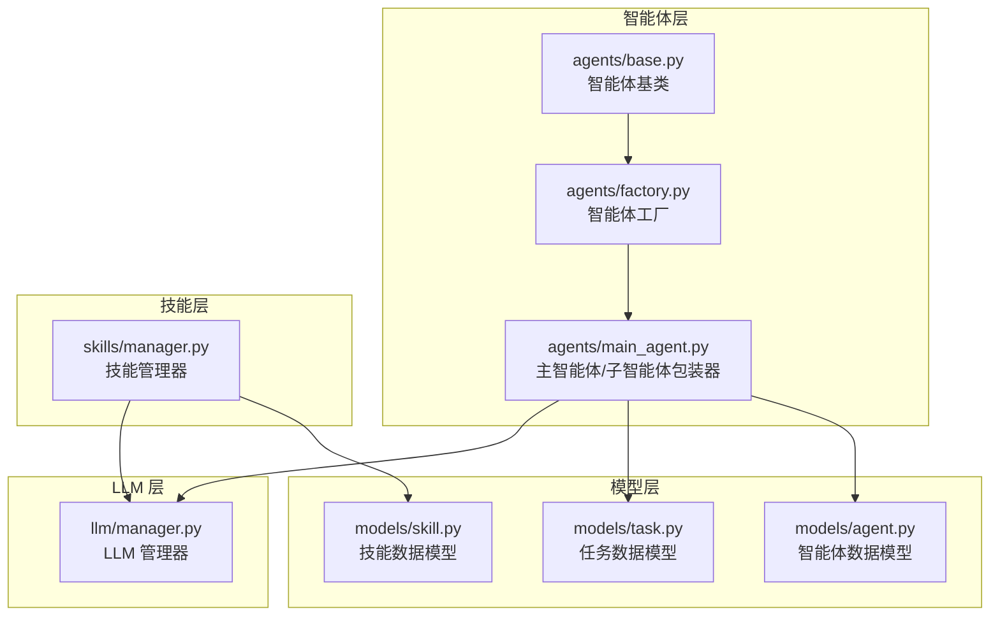
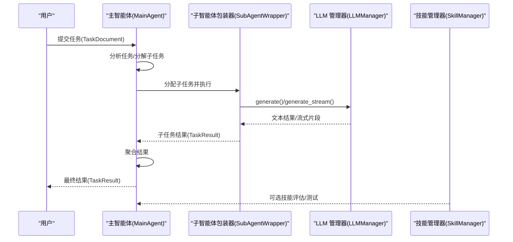
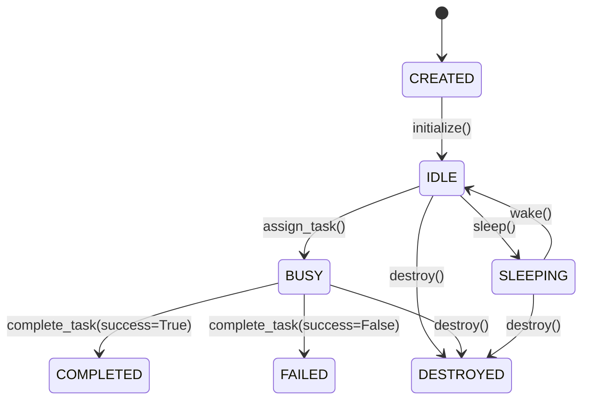
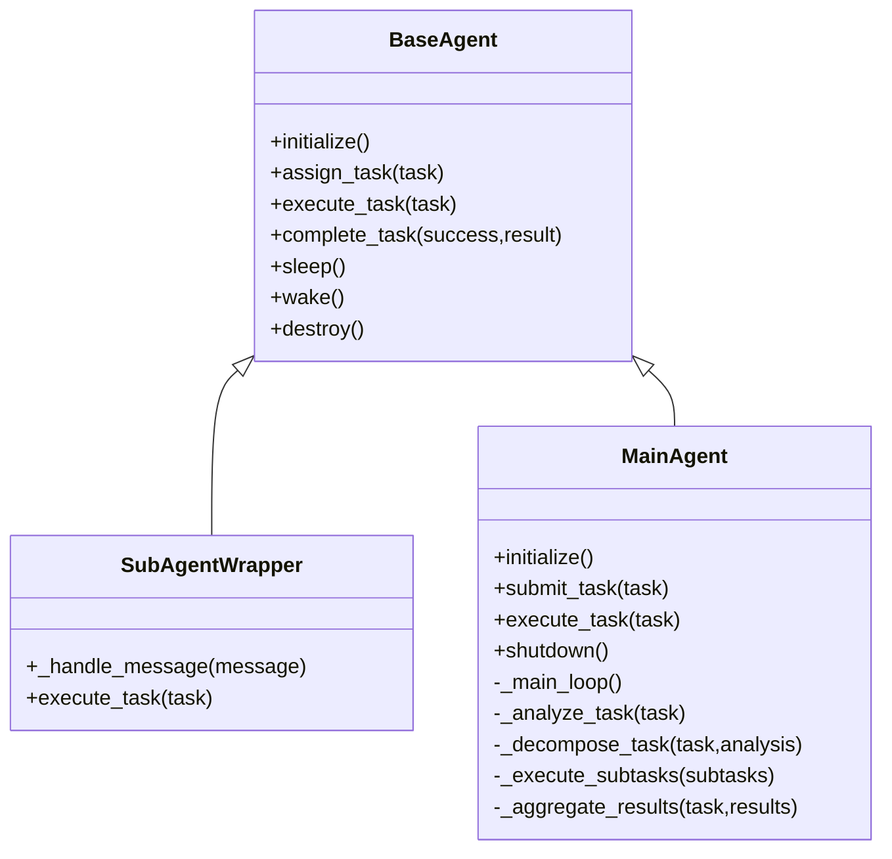
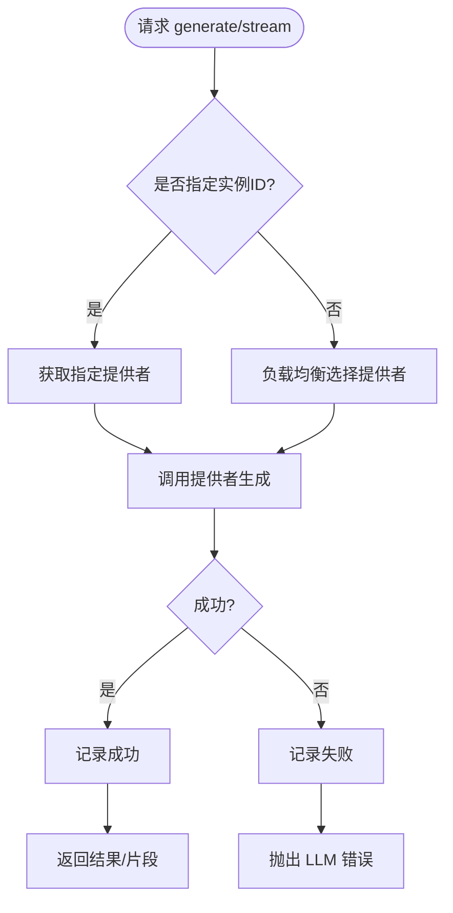
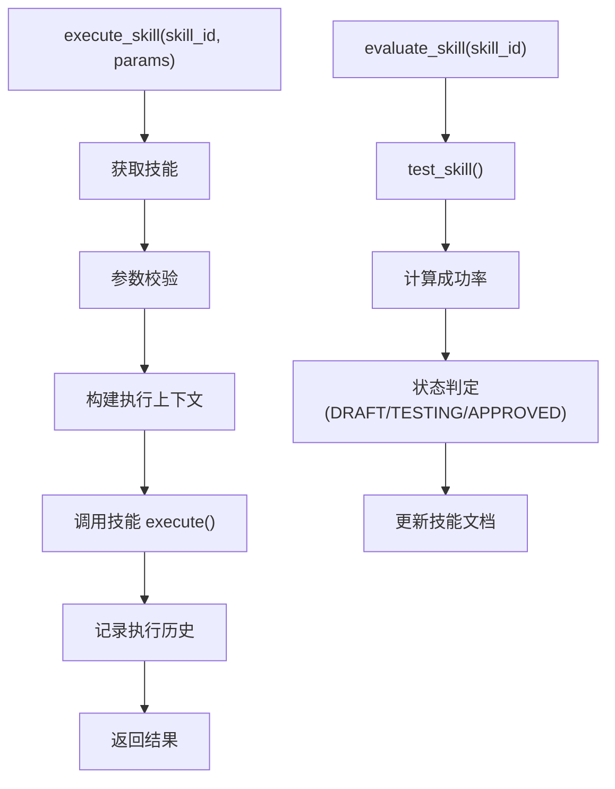
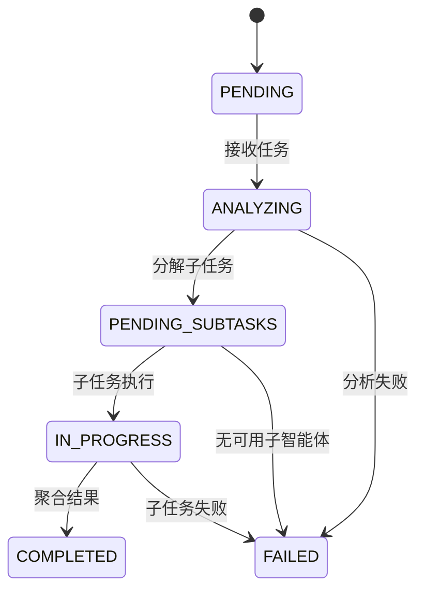
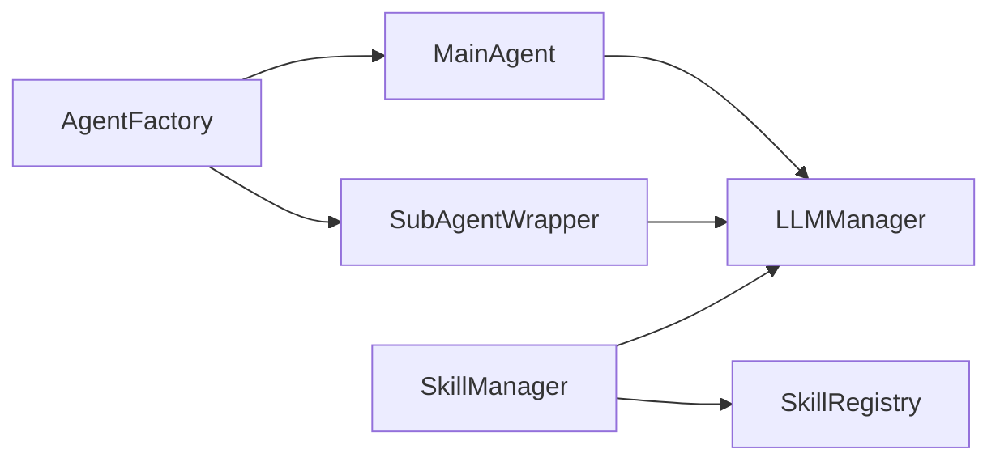

# 多智能体系统

<cite>
**本文引用的文件**
- [src/taolib/testing/multi_agent/agents/factory.py](file://src/taolib/testing/multi_agent/agents/factory.py)
- [src/taolib/testing/multi_agent/agents/base.py](file://src/taolib/testing/multi_agent/agents/base.py)
- [src/taolib/testing/multi_agent/agents/main_agent.py](file://src/taolib/testing/multi_agent/agents/main_agent.py)
- [src/taolib/testing/multi_agent/models/agent.py](file://src/taolib/testing/multi_agent/models/agent.py)
- [src/taolib/testing/multi_agent/models/skill.py](file://src/taolib/testing/multi_agent/models/skill.py)
- [src/taolib/testing/multi_agent/models/task.py](file://src/taolib/testing/multi_agent/models/task.py)
- [src/taolib/testing/multi_agent/llm/manager.py](file://src/taolib/testing/multi_agent/llm/manager.py)
- [src/taolib/testing/multi_agent/skills/manager.py](file://src/taolib/testing/multi_agent/skills/manager.py)
</cite>

## 目录
1. [引言](#引言)
2. [项目结构](#项目结构)
3. [核心组件](#核心组件)
4. [架构总览](#架构总览)
5. [详细组件分析](#详细组件分析)
6. [依赖分析](#依赖分析)
7. [性能考虑](#性能考虑)
8. [故障排查指南](#故障排查指南)
9. [结论](#结论)
10. [附录](#附录)

## 引言
本技术文档面向多智能体系统，聚焦于智能体管理架构、LLM（大语言模型）集成与技能系统的设计与实现。文档将系统性阐述：
- 智能体工厂模式、生命周期管理与状态跟踪机制
- LLM 提供者管理、模型配置与负载均衡策略
- 技能注册表、执行管理与评估机制
- 任务编排、执行流程与状态跟踪
- 智能体间通信协议、协调机制与冲突解决策略
- 完整的 API 参考、使用示例与扩展指南

## 项目结构
多智能体系统位于仓库的 testing 子模块中，采用“按功能域分层”的组织方式：
- agents：智能体相关实现（基类、工厂、主智能体）
- models：数据模型（智能体、技能、任务等）
- llm：LLM 提供者与管理器
- skills：技能注册表与管理器
- 错误类型与通用工具在同级目录下提供

图表来源
- [src/taolib/testing/multi_agent/agents/base.py:21-204](file://src/taolib/testing/multi_agent/agents/base.py#L21-L204)
- [src/taolib/testing/multi_agent/agents/factory.py:27-220](file://src/taolib/testing/multi_agent/agents/factory.py#L27-L220)
- [src/taolib/testing/multi_agent/agents/main_agent.py:104-472](file://src/taolib/testing/multi_agent/agents/main_agent.py#L104-L472)
- [src/taolib/testing/multi_agent/models/agent.py:15-129](file://src/taolib/testing/multi_agent/models/agent.py#L15-L129)
- [src/taolib/testing/multi_agent/models/skill.py:15-142](file://src/taolib/testing/multi_agent/models/skill.py#L15-L142)
- [src/taolib/testing/multi_agent/models/task.py:15-143](file://src/taolib/testing/multi_agent/models/task.py#L15-L143)
- [src/taolib/testing/multi_agent/llm/manager.py:22-229](file://src/taolib/testing/multi_agent/llm/manager.py#L22-L229)
- [src/taolib/testing/multi_agent/skills/manager.py:29-404](file://src/taolib/testing/multi_agent/skills/manager.py#L29-L404)

章节来源
- [src/taolib/testing/multi_agent/agents/factory.py:1-220](file://src/taolib/testing/multi_agent/agents/factory.py#L1-L220)
- [src/taolib/testing/multi_agent/agents/base.py:1-204](file://src/taolib/testing/multi_agent/agents/base.py#L1-L204)
- [src/taolib/testing/multi_agent/agents/main_agent.py:1-472](file://src/taolib/testing/multi_agent/agents/main_agent.py#L1-L472)
- [src/taolib/testing/multi_agent/models/agent.py:1-129](file://src/taolib/testing/multi_agent/models/agent.py#L1-L129)
- [src/taolib/testing/multi_agent/models/skill.py:1-142](file://src/taolib/testing/multi_agent/models/skill.py#L1-L142)
- [src/taolib/testing/multi_agent/models/task.py:1-143](file://src/taolib/testing/multi_agent/models/task.py#L1-L143)
- [src/taolib/testing/multi_agent/llm/manager.py:1-229](file://src/taolib/testing/multi_agent/llm/manager.py#L1-L229)
- [src/taolib/testing/multi_agent/skills/manager.py:1-404](file://src/taolib/testing/multi_agent/skills/manager.py#L1-L404)

## 核心组件
- 智能体基类：定义统一的生命周期、状态管理与消息处理接口，确保所有智能体具备一致的行为契约。
- 智能体工厂：集中创建与模板化实例化智能体，支持全局工厂与自定义工厂注入。
- 主智能体与子智能体包装器：主智能体负责任务分析、分解、调度与结果聚合；子智能体包装器封装具体执行逻辑。
- 数据模型：以 Pydantic 四层模型（Base/Create/Response/Document）规范智能体、技能、任务的数据结构与转换。
- LLM 管理器：统一接入不同提供者，提供生成与流式生成接口，并内置健康检查与负载均衡。
- 技能管理器：注册、执行、测试、评估与发现技能，维护执行历史与状态。

章节来源
- [src/taolib/testing/multi_agent/agents/base.py:21-204](file://src/taolib/testing/multi_agent/agents/base.py#L21-L204)
- [src/taolib/testing/multi_agent/agents/factory.py:27-220](file://src/taolib/testing/multi_agent/agents/factory.py#L27-L220)
- [src/taolib/testing/multi_agent/agents/main_agent.py:104-472](file://src/taolib/testing/multi_agent/agents/main_agent.py#L104-L472)
- [src/taolib/testing/multi_agent/models/agent.py:15-129](file://src/taolib/testing/multi_agent/models/agent.py#L15-L129)
- [src/taolib/testing/multi_agent/models/skill.py:15-142](file://src/taolib/testing/multi_agent/models/skill.py#L15-L142)
- [src/taolib/testing/multi_agent/models/task.py:15-143](file://src/taolib/testing/multi_agent/models/task.py#L15-L143)
- [src/taolib/testing/multi_agent/llm/manager.py:22-229](file://src/taolib/testing/multi_agent/llm/manager.py#L22-L229)
- [src/taolib/testing/multi_agent/skills/manager.py:29-404](file://src/taolib/testing/multi_agent/skills/manager.py#L29-L404)

## 架构总览
系统采用“主-子”两级智能体架构：
- 主智能体负责任务全生命周期管理：接收、分析、分解、调度、执行与聚合。
- 子智能体专注于具体任务执行，通过 LLM 管理器进行推理与生成。
- 技能管理器提供可复用的执行单元，支持参数校验、测试与评估。
- LLM 管理器抽象不同提供者，提供统一接口与负载均衡。

图表来源
- [src/taolib/testing/multi_agent/agents/main_agent.py:211-282](file://src/taolib/testing/multi_agent/agents/main_agent.py#L211-L282)
- [src/taolib/testing/multi_agent/agents/main_agent.py:355-405](file://src/taolib/testing/multi_agent/agents/main_agent.py#L355-L405)
- [src/taolib/testing/multi_agent/llm/manager.py:57-157](file://src/taolib/testing/multi_agent/llm/manager.py#L57-L157)
- [src/taolib/testing/multi_agent/skills/manager.py:110-175](file://src/taolib/testing/multi_agent/skills/manager.py#L110-L175)

## 详细组件分析

### 智能体工厂与生命周期管理
- 工厂职责
  - 注册与获取模板
  - 从模板或直接配置创建智能体
  - 统一初始化与状态归零
- 生命周期
  - initialize：进入 IDLE，更新活跃时间
  - assign_task：切换 BUSY 并记录当前任务
  - execute_task：由子类实现具体执行
  - complete_task：根据成功与否更新计数与状态
  - sleep/wake：睡眠与唤醒，防止在忙时被唤醒
  - destroy：销毁前完成未完成任务并标记 DESTROYED

图表来源
- [src/taolib/testing/multi_agent/agents/base.py:60-198](file://src/taolib/testing/multi_agent/agents/base.py#L60-L198)

章节来源
- [src/taolib/testing/multi_agent/agents/factory.py:74-150](file://src/taolib/testing/multi_agent/agents/factory.py#L74-L150)
- [src/taolib/testing/multi_agent/agents/base.py:60-198](file://src/taolib/testing/multi_agent/agents/base.py#L60-L198)

### 主智能体与子智能体包装器
- 主智能体职责
  - 任务队列与主循环
  - 任务分析、分解、调度与聚合
  - 默认子智能体创建与选择
- 子智能体包装器职责
  - 将任务委托给 LLM 管理器生成结果
  - 统一任务状态与结果封装

图表来源
- [src/taolib/testing/multi_agent/agents/base.py:21-204](file://src/taolib/testing/multi_agent/agents/base.py#L21-L204)
- [src/taolib/testing/multi_agent/agents/main_agent.py:35-103](file://src/taolib/testing/multi_agent/agents/main_agent.py#L35-L103)
- [src/taolib/testing/multi_agent/agents/main_agent.py:104-472](file://src/taolib/testing/multi_agent/agents/main_agent.py#L104-L472)

章节来源
- [src/taolib/testing/multi_agent/agents/main_agent.py:104-472](file://src/taolib/testing/multi_agent/agents/main_agent.py#L104-L472)

### LLM 管理器与负载均衡
- 功能
  - 注册模型实例（自动生成实例 ID）
  - 统一 generate/generate_stream 接口
  - 健康检查与可用实例查询
  - 成功/失败记录与统计
- 负载均衡
  - 选择策略：轮询/权重/成功率等（由底层负载均衡器实现）
  - 支持指定实例 ID 直连

图表来源
- [src/taolib/testing/multi_agent/llm/manager.py:57-157](file://src/taolib/testing/multi_agent/llm/manager.py#L57-L157)

章节来源
- [src/taolib/testing/multi_agent/llm/manager.py:22-229](file://src/taolib/testing/multi_agent/llm/manager.py#L22-L229)

### 技能管理器与技能系统
- 注册与文档
  - 注册技能并维护技能文档
  - 支持从描述创建技能草稿
- 执行与测试
  - 参数校验、上下文构建、执行记录
  - 测试用例驱动的测试与评估
- 评估与发现
  - 基于成功率的状态判定（DRAFT/TESTING/APPROVED）
  - 关键词匹配的技能发现

图表来源
- [src/taolib/testing/multi_agent/skills/manager.py:110-175](file://src/taolib/testing/multi_agent/skills/manager.py#L110-L175)
- [src/taolib/testing/multi_agent/skills/manager.py:235-284](file://src/taolib/testing/multi_agent/skills/manager.py#L235-L284)

章节来源
- [src/taolib/testing/multi_agent/skills/manager.py:29-404](file://src/taolib/testing/multi_agent/skills/manager.py#L29-L404)

### 任务编排与状态跟踪
- 任务模型
  - 基础字段、约束、进度、结果、子任务与元数据
  - 四层模型转换：Document -> Response -> Create/Update
- 编排流程
  - 主智能体接收任务后进入 ANALYZING，随后分解为子任务
  - 子任务调度至空闲子智能体执行
  - 聚合子任务结果并更新主任务状态与进度

图表来源
- [src/taolib/testing/multi_agent/models/task.py:60-143](file://src/taolib/testing/multi_agent/models/task.py#L60-L143)
- [src/taolib/testing/multi_agent/agents/main_agent.py:211-282](file://src/taolib/testing/multi_agent/agents/main_agent.py#L211-L282)

章节来源
- [src/taolib/testing/multi_agent/models/task.py:1-143](file://src/taolib/testing/multi_agent/models/task.py#L1-L143)
- [src/taolib/testing/multi_agent/agents/main_agent.py:283-442](file://src/taolib/testing/multi_agent/agents/main_agent.py#L283-L442)

### 智能体间通信与协调
- 通信协议
  - 基于消息对象（消息类型、载荷、时间戳）进行事件通知
  - 主智能体监听任务完成/错误消息，触发后续动作
- 协调机制
  - 简单轮询式子智能体选择（空闲优先）
  - 未来可扩展为基于能力匹配与资源竞争的调度
- 冲突解决
  - BUSY 状态拒绝新任务分配
  - 睡眠态智能体需显式唤醒

章节来源
- [src/taolib/testing/multi_agent/agents/base.py:66-98](file://src/taolib/testing/multi_agent/agents/base.py#L66-L98)
- [src/taolib/testing/multi_agent/agents/main_agent.py:196-210](file://src/taolib/testing/multi_agent/agents/main_agent.py#L196-L210)
- [src/taolib/testing/multi_agent/agents/main_agent.py:407-421](file://src/taolib/testing/multi_agent/agents/main_agent.py#L407-L421)

## 依赖分析
- 组件耦合
  - 主智能体依赖子智能体包装器与 LLM 管理器
  - 子智能体包装器依赖 LLM 管理器
  - 技能管理器依赖技能注册表与 LLM 管理器
  - 工厂依赖模板与智能体类型映射
- 外部依赖
  - LLM 提供者抽象（通过协议接口）
  - 负载均衡器（策略可插拔）

图表来源
- [src/taolib/testing/multi_agent/agents/factory.py:30-46](file://src/taolib/testing/multi_agent/agents/factory.py#L30-L46)
- [src/taolib/testing/multi_agent/agents/main_agent.py:107-124](file://src/taolib/testing/multi_agent/agents/main_agent.py#L107-L124)
- [src/taolib/testing/multi_agent/skills/manager.py:32-44](file://src/taolib/testing/multi_agent/skills/manager.py#L32-L44)

章节来源
- [src/taolib/testing/multi_agent/agents/factory.py:30-46](file://src/taolib/testing/multi_agent/agents/factory.py#L30-L46)
- [src/taolib/testing/multi_agent/agents/main_agent.py:107-124](file://src/taolib/testing/multi_agent/agents/main_agent.py#L107-L124)
- [src/taolib/testing/multi_agent/skills/manager.py:32-44](file://src/taolib/testing/multi_agent/skills/manager.py#L32-L44)

## 性能考虑
- 异步执行
  - 主循环与子任务执行采用异步协程，避免阻塞
- 轮询间隔
  - 主循环使用短间隔轮询，兼顾实时性与 CPU 开销
- LLM 调用
  - 提供流式生成接口，降低首字节延迟
  - 负载均衡记录成功/失败，动态优化选择
- 执行历史
  - 记录每次技能执行的开始/结束与结果，便于性能分析与回溯

## 故障排查指南
- 常见错误
  - 智能体忙碌：在 BUSY 状态下拒绝新任务
  - 睡眠态唤醒：仅允许从 SLEEPING 切换到 IDLE
  - 模型不可用：LLM 提供者健康检查失败或实例不存在
  - 技能执行失败：参数校验失败或技能内部异常
- 排查建议
  - 检查智能体状态与任务队列
  - 查看 LLM 管理器可用实例与统计
  - 审核技能参数与测试用例
  - 查阅执行历史与日志

章节来源
- [src/taolib/testing/multi_agent/agents/base.py:118-119](file://src/taolib/testing/multi_agent/agents/base.py#L118-L119)
- [src/taolib/testing/multi_agent/agents/base.py:184-185](file://src/taolib/testing/multi_agent/agents/base.py#L184-L185)
- [src/taolib/testing/multi_agent/llm/manager.py:159-175](file://src/taolib/testing/multi_agent/llm/manager.py#L159-L175)
- [src/taolib/testing/multi_agent/skills/manager.py:130-137](file://src/taolib/testing/multi_agent/skills/manager.py#L130-L137)

## 结论
该多智能体系统通过清晰的分层设计与抽象接口，实现了从任务编排到技能执行的完整闭环。工厂模式与基类契约保证了扩展性，LLM 管理器与负载均衡提供了弹性与高可用，技能系统支撑了可复用与可评估的执行单元。未来可在调度策略、消息协议与可观测性方面进一步增强。

## 附录

### API 参考（概要）
- 智能体工厂
  - 创建智能体：传入 AgentCreate 或模板 ID
  - 创建主智能体：便捷入口
- 主智能体
  - 提交任务：submit_task
  - 关闭：shutdown
- 子智能体包装器
  - 执行任务：execute_task（委托 LLM 管理器）
- LLM 管理器
  - 添加模型：add_model
  - 文本生成：generate/generate_stream
  - 健康检查：health_check
  - 查询统计：get_available_models/get_model_stats
- 技能管理器
  - 注册技能：register_skill
  - 执行技能：execute_skill
  - 测试技能：test_skill
  - 评估技能：evaluate_skill
  - 发现技能：discover_skills
  - 创建技能：create_skill_from_description

章节来源
- [src/taolib/testing/multi_agent/agents/factory.py:74-193](file://src/taolib/testing/multi_agent/agents/factory.py#L74-L193)
- [src/taolib/testing/multi_agent/agents/main_agent.py:444-471](file://src/taolib/testing/multi_agent/agents/main_agent.py#L444-L471)
- [src/taolib/testing/multi_agent/llm/manager.py:35-202](file://src/taolib/testing/multi_agent/llm/manager.py#L35-L202)
- [src/taolib/testing/multi_agent/skills/manager.py:48-356](file://src/taolib/testing/multi_agent/skills/manager.py#L48-L356)

### 使用示例（步骤指引）
- 创建主智能体
  - 使用工厂创建主智能体，或直接调用便捷方法
- 注册 LLM 提供者
  - 通过 LLM 管理器添加模型实例，支持指定实例 ID
- 定义并注册技能
  - 创建技能对象与文档，注册到技能管理器
- 提交任务
  - 主智能体接收任务，自动分析、分解、调度与聚合
- 查看结果
  - 从任务文档读取最终结果与执行统计

章节来源
- [src/taolib/testing/multi_agent/agents/factory.py:152-193](file://src/taolib/testing/multi_agent/agents/factory.py#L152-L193)
- [src/taolib/testing/multi_agent/llm/manager.py:35-55](file://src/taolib/testing/multi_agent/llm/manager.py#L35-L55)
- [src/taolib/testing/multi_agent/skills/manager.py:48-73](file://src/taolib/testing/multi_agent/skills/manager.py#L48-L73)
- [src/taolib/testing/multi_agent/agents/main_agent.py:444-471](file://src/taolib/testing/multi_agent/agents/main_agent.py#L444-L471)

### 扩展指南
- 新增智能体类型
  - 继承基类，实现 execute_task 与消息处理
  - 在工厂中注册类型映射
- 新增 LLM 提供者
  - 实现提供者协议，注册到模型注册表
  - 通过 LLM 管理器添加实例
- 新增技能
  - 定义技能参数与执行逻辑，注册到技能管理器
  - 编写测试用例并评估状态
- 优化调度策略
  - 在主智能体中替换子智能体选择算法
  - 引入能力匹配与资源竞争机制

章节来源
- [src/taolib/testing/multi_agent/agents/base.py:91-107](file://src/taolib/testing/multi_agent/agents/base.py#L91-L107)
- [src/taolib/testing/multi_agent/agents/factory.py:38-41](file://src/taolib/testing/multi_agent/agents/factory.py#L38-L41)
- [src/taolib/testing/multi_agent/llm/manager.py:49-55](file://src/taolib/testing/multi_agent/llm/manager.py#L49-L55)
- [src/taolib/testing/multi_agent/skills/manager.py:48-73](file://src/taolib/testing/multi_agent/skills/manager.py#L48-L73)
- [src/taolib/testing/multi_agent/agents/main_agent.py:407-421](file://src/taolib/testing/multi_agent/agents/main_agent.py#L407-L421)