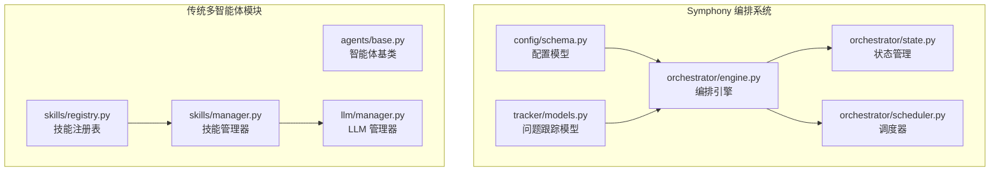
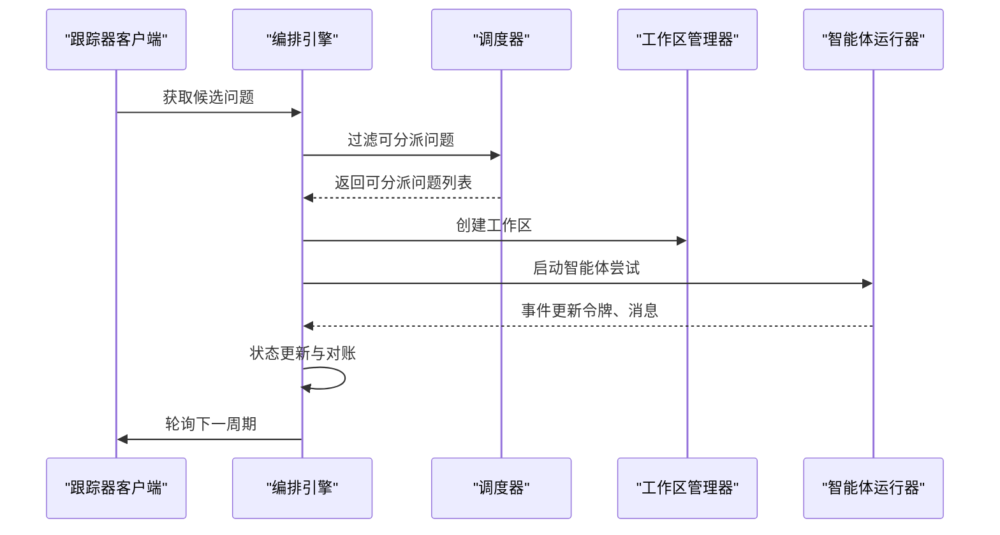
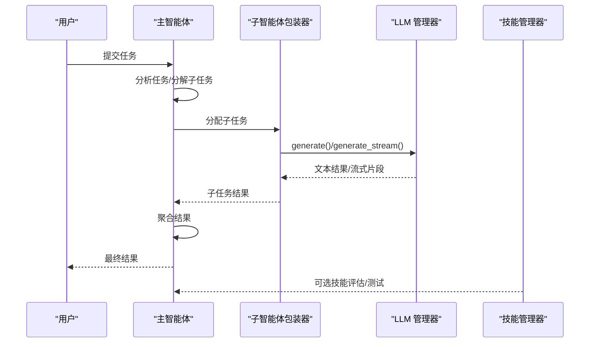
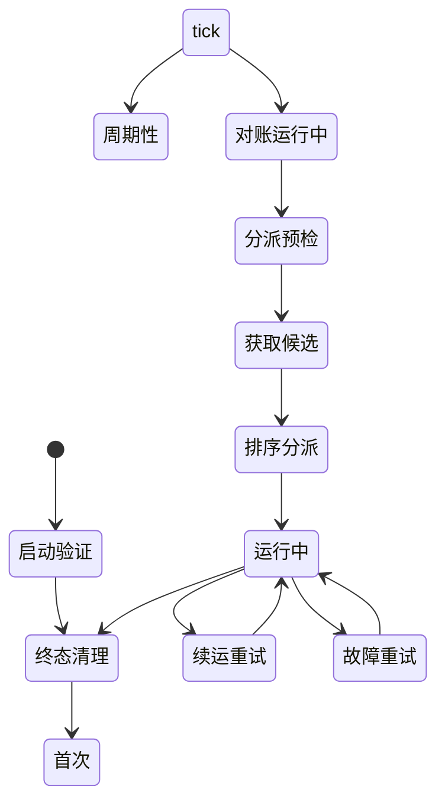
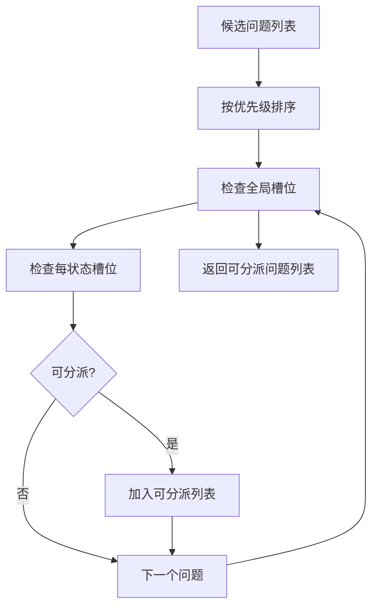
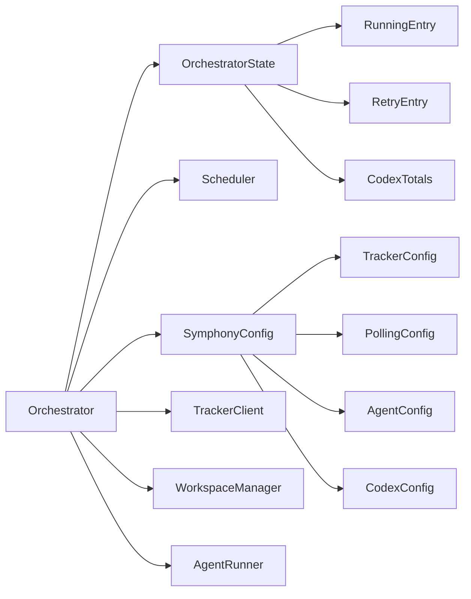

# 多智能体系统

<cite>
**本文引用的文件**
- [src/taolib/symphony/orchestrator/engine.py](file://src/taolib/symphony/orchestrator/engine.py)
- [src/taolib/symphony/orchestrator/state.py](file://src/taolib/symphony/orchestrator/state.py)
- [src/taolib/symphony/orchestrator/scheduler.py](file://src/taolib/symphony/orchestrator/scheduler.py)
- [src/taolib/symphony/config/schema.py](file://src/taolib/symphony/config/schema.py)
- [src/taolib/symphony/tracker/models.py](file://src/taolib/symphony/tracker/models.py)
- [src/taolib/symphony/config/toml_config.py](file://src/taolib/symphony/config/toml_config.py)
- [specs/symphony-elixir-experience.md](file://specs/symphony-elixir-experience.md)
- [tests/test_symphony/test_orchestrator_engine.py](file://tests/test_symphony/test_orchestrator_engine.py)
- [src/taolib/testing/multi_agent/agents/factory.py](file://src/taolib/testing/multi_agent/agents/factory.py)
- [src/taolib/testing/multi_agent/agents/base.py](file://src/taolib/testing/multi_agent/agents/base.py)
- [src/taolib/testing/multi_agent/agents/main_agent.py](file://src/taolib/testing/multi_agent/agents/main_agent.py)
- [src/taolib/testing/multi_agent/models/agent.py](file://src/taolib/testing/multi_agent/models/agent.py)
- [src/taolib/testing/multi_agent/models/skill.py](file://src/taolib/testing/multi_agent/models/skill.py)
- [src/taolib/testing/multi_agent/models/task.py](file://src/taolib/testing/multi_agent/models/task.py)
- [src/taolib/testing/multi_agent/llm/manager.py](file://src/taolib/testing/multi_agent/llm/manager.py)
- [src/taolib/testing/multi_agent/skills/manager.py](file://src/taolib/testing/multi_agent/skills/manager.py)
- [src/taolib/testing/multi_agent/skills/registry.py](file://src/taolib/testing/multi_agent/skills/registry.py)
</cite>

## 更新摘要
**变更内容**
- 新增 Symphony 编排系统架构分析，替代原有的测试模块技能系统
- 更新技能自动化框架为新的工作流管理系统
- 增强工作流编排、任务调度和状态跟踪机制
- 新增配置管理、可观测性和错误处理体系
- 完善多智能体系统的整体架构设计

## 目录
1. [引言](#引言)
2. [项目结构](#项目结构)
3. [核心组件](#核心组件)
4. [架构总览](#架构总览)
5. [详细组件分析](#详细组件分析)
6. [依赖分析](#依赖分析)
7. [性能考虑](#性能考虑)
8. [故障排查指南](#故障排查指南)
9. [结论](#结论)
10. [附录](#附录)

## 引言
本技术文档面向多智能体系统，聚焦于智能体管理架构、LLM（大语言模型）集成与技能系统的设计与实现。随着架构升级，系统现已采用新的 Symphony 编排系统和技能自动化框架，提供更强大的工作流管理能力。

文档将系统性阐述：
- 智能体工厂模式、生命周期管理与状态跟踪机制
- LLM 提供者管理、模型配置与负载均衡策略
- 技能注册表、执行管理与评估机制
- 任务编排、执行流程与状态跟踪
- 智能体间通信协议、协调机制与冲突解决策略
- 完整的 API 参考、使用示例与扩展指南

**更新** 架构升级后，原有的测试模块技能系统已被新的 Symphony 编排系统所替代，提供企业级的工作流编排能力和更强的可观测性。

## 项目结构
多智能体系统现已分为两个主要架构层：

### 新的 Symphony 编排系统
- orchestrator：编排引擎核心实现（状态机、调度引擎、并发控制）
- config：配置管理与验证（Pydantic v2 类型化配置）
- tracker：问题跟踪器集成（Linear 等）
- workspace：工作区管理与安全控制
- observability：可观测性与监控

### 传统多智能体模块
- agents：智能体相关实现（基类、工厂、主智能体）
- models：数据模型（智能体、技能、任务等）
- llm：LLM 提供者与管理器
- skills：技能注册表与管理器



**图表来源**
- [src/taolib/symphony/orchestrator/engine.py:47-989](file://src/taolib/symphony/orchestrator/engine.py#L47-L989)
- [src/taolib/symphony/orchestrator/state.py:147-175](file://src/taolib/symphony/orchestrator/state.py#L147-L175)
- [src/taolib/symphony/orchestrator/scheduler.py:24-176](file://src/taolib/symphony/orchestrator/scheduler.py#L24-L176)
- [src/taolib/symphony/config/schema.py:128-139](file://src/taolib/symphony/config/schema.py#L128-L139)
- [src/taolib/symphony/tracker/models.py:8-36](file://src/taolib/symphony/tracker/models.py#L8-L36)

**章节来源**
- [src/taolib/symphony/orchestrator/engine.py:1-989](file://src/taolib/symphony/orchestrator/engine.py#L1-L989)
- [src/taolib/symphony/orchestrator/state.py:1-175](file://src/taolib/symphony/orchestrator/state.py#L1-L175)
- [src/taolib/symphony/orchestrator/scheduler.py:1-176](file://src/taolib/symphony/orchestrator/scheduler.py#L1-L176)
- [src/taolib/symphony/config/schema.py:1-139](file://src/taolib/symphony/config/schema.py#L1-L139)
- [src/taolib/symphony/tracker/models.py:1-67](file://src/taolib/symphony/tracker/models.py#L1-L67)

## 核心组件
### 新架构核心组件
- **编排引擎（Orchestrator）**：负责轮询、对账、分派与重试的完整生命周期，采用单线程 asyncio 事件循环
- **状态管理（OrchestratorState）**：单一权威内存状态，避免重复分派和状态不一致
- **调度器（Scheduler）**：候选排序和并发控制，支持全局和每状态的槽位管理
- **配置系统（SymphonyConfig）**：基于 Pydantic v2 的类型化配置，涵盖跟踪器、轮询、工作区等
- **问题跟踪（Issue）**：统一的问题领域模型，支持多种跟踪器集成

### 传统组件
- 智能体基类：定义统一的生命周期、状态管理与消息处理接口
- 智能体工厂：集中创建与模板化实例化智能体
- 主智能体与子智能体包装器：主智能体负责任务分析、分解、调度与结果聚合
- 技能管理器：注册、执行、测试、评估与发现技能，维护执行历史与状态

**章节来源**
- [src/taolib/symphony/orchestrator/engine.py:47-989](file://src/taolib/symphony/orchestrator/engine.py#L47-L989)
- [src/taolib/symphony/orchestrator/state.py:147-175](file://src/taolib/symphony/orchestrator/state.py#L147-L175)
- [src/taolib/symphony/orchestrator/scheduler.py:24-176](file://src/taolib/symphony/orchestrator/scheduler.py#L24-L176)
- [src/taolib/symphony/config/schema.py:128-139](file://src/taolib/symphony/config/schema.py#L128-L139)

## 架构总览
系统采用双架构设计，支持从传统多智能体模式向企业级编排系统的平滑过渡：

### 编排系统架构


**图表来源**
- [src/taolib/symphony/orchestrator/engine.py:184-237](file://src/taolib/symphony/orchestrator/engine.py#L184-L237)
- [src/taolib/symphony/orchestrator/scheduler.py:137-175](file://src/taolib/symphony/orchestrator/scheduler.py#L137-L175)

### 传统多智能体架构


**图表来源**
- [src/taolib/testing/multi_agent/agents/main_agent.py:211-282](file://src/taolib/testing/multi_agent/agents/main_agent.py#L211-L282)
- [src/taolib/testing/multi_agent/llm/manager.py:57-157](file://src/taolib/testing/multi_agent/llm/manager.py#L57-L157)

## 详细组件分析

### 编排引擎与状态管理
#### 编排引擎核心功能
- **生命周期管理**：run() 启动验证 → 终态清理 → 首次 tick → 周期性 tick
- **优雅关闭**：shutdown() 停止新分派、等待活跃 worker、清理重试计时器
- **轮询机制**：_tick() 执行对账 → 分派预检 → 获取候选 → 排序分派
- **重试调度**：支持续运重试（固定延迟）和故障重试（指数退避）

#### 状态管理机制
- **单一权威状态**：OrchestratorState 避免并发修改导致的状态不一致
- **运行时跟踪**：RunningEntry 跟踪活跃 worker 的详细信息
- **重试管理**：RetryEntry 支持防过期重试（retry_token）
- **令牌统计**：CodexTotals 聚合令牌消耗与运行时统计



**图表来源**
- [src/taolib/symphony/orchestrator/engine.py:92-128](file://src/taolib/symphony/orchestrator/engine.py#L92-L128)
- [src/taolib/symphony/orchestrator/engine.py:184-237](file://src/taolib/symphony/orchestrator/engine.py#L184-L237)

**章节来源**
- [src/taolib/symphony/orchestrator/engine.py:47-989](file://src/taolib/symphony/orchestrator/engine.py#L47-L989)
- [src/taolib/symphony/orchestrator/state.py:147-175](file://src/taolib/symphony/orchestrator/state.py#L147-L175)

### 调度器与并发控制
#### 排序规则（规范 §8.2）
1. **优先级升序**：1..4 优先；null/未知排最后（映射为 999）
2. **创建时间**：最旧优先（null 映射为 datetime.max）
3. **标识符字典序**：决胜条件

#### 并发控制（规范 §8.3）
- **全局限制**：available_slots = max(max_concurrent_agents - running_count, 0)
- **每状态限制**：max_concurrent_agents_by_state[state]，状态键小写规范化
- **无配置回退**：无每状态配置时回退到全局限制



**图表来源**
- [src/taolib/symphony/orchestrator/scheduler.py:137-175](file://src/taolib/symphony/orchestrator/scheduler.py#L137-L175)

**章节来源**
- [src/taolib/symphony/orchestrator/scheduler.py:24-176](file://src/taolib/symphony/orchestrator/scheduler.py#L24-L176)

### 配置管理系统
#### 配置层次结构
- **跟踪器配置**：kind、endpoint、api_key、project_slug、状态过滤
- **轮询配置**：interval_ms（≥1000）
- **工作区配置**：root 路径设置
- **Agent 配置**：max_concurrent_agents、max_turns、max_retry_backoff_ms、每状态限制
- **Codex 配置**：命令、超时、停顿检测
- **Worker 配置**：SSH 主机列表、每主机并发限制
- **Server 配置**：HTTP 服务器端口和绑定地址

#### 配置验证与热重载
- **Pydantic 验证**：自动类型检查和默认值设置
- **状态归一化**：状态键小写处理，过滤无效条目
- **TOML 支持**：load_toml() 仅读取 [defaults] 段

**章节来源**
- [src/taolib/symphony/config/schema.py:16-139](file://src/taolib/symphony/config/schema.py#L16-L139)
- [src/taolib/symphony/config/toml_config.py:13-53](file://src/taolib/symphony/config/toml_config.py#L13-L53)

### 传统多智能体组件
#### 智能体工厂与生命周期管理
- **工厂职责**：注册与获取模板、从模板或直接配置创建智能体、统一初始化与状态归零
- **生命周期状态**：CREATED → IDLE → BUSY → COMPLETED/FAILED → SLEEPING → DESTROYED
- **睡眠机制**：sleep() 防止在忙时被唤醒，wake() 显式唤醒

#### 技能管理器增强功能
- **执行历史**：记录每次技能执行的开始/结束与结果
- **测试框架**：参数校验、上下文构建、执行记录
- **评估系统**：基于成功率的状态判定（DRAFT/TESTING/APPROVED）
- **发现机制**：关键词匹配的技能发现

**章节来源**
- [src/taolib/testing/multi_agent/agents/factory.py:74-150](file://src/taolib/testing/multi_agent/agents/factory.py#L74-L150)
- [src/taolib/testing/multi_agent/skills/manager.py:29-403](file://src/taolib/testing/multi_agent/skills/manager.py#L29-L403)

## 依赖分析
### 新架构依赖关系


**图表来源**
- [src/taolib/symphony/orchestrator/engine.py:66-79](file://src/taolib/symphony/orchestrator/engine.py#L66-L79)
- [src/taolib/symphony/orchestrator/state.py:147-175](file://src/taolib/symphony/orchestrator/state.py#L147-L175)
- [src/taolib/symphony/config/schema.py:128-139](file://src/taolib/symphony/config/schema.py#L128-L139)

### 传统组件依赖关系
- 主智能体依赖子智能体包装器与 LLM 管理器
- 子智能体包装器依赖 LLM 管理器
- 技能管理器依赖技能注册表与 LLM 管理器
- 工厂依赖模板与智能体类型映射

**章节来源**
- [src/taolib/testing/multi_agent/agents/factory.py:30-46](file://src/taolib/testing/multi_agent/agents/factory.py#L30-L46)
- [src/taolib/testing/multi_agent/skills/manager.py:32-44](file://src/taolib/testing/multi_agent/skills/manager.py#L32-L44)

## 性能考虑
### 编排系统性能特性
- **单线程事件循环**：所有状态变更串行化，避免竞态条件
- **命名任务**：Python 3.14 内省支持，便于调试和监控
- **防过期重试**：retry_token 防止过期回调触发重复分派
- **增量令牌统计**：max(next_reported - prev_reported, 0) 避免重复计数
- **停顿检测**：stall_timeout_ms 超时自动终止 Worker

### 传统系统性能特性
- **异步执行**：主循环与子任务执行采用异步协程，避免阻塞
- **轮询间隔**：主循环使用短间隔轮询，兼顾实时性与 CPU 开销
- **LLM 调用**：提供流式生成接口，降低首字节延迟
- **执行历史**：记录每次技能执行的开始/结束与结果

**章节来源**
- [src/taolib/symphony/orchestrator/engine.py:557-576](file://src/taolib/symphony/orchestrator/engine.py#L557-L576)
- [src/taolib/testing/multi_agent/llm/manager.py:57-157](file://src/taolib/testing/multi_agent/llm/manager.py#L57-L157)

## 故障排查指南
### 编排系统故障排查
- **启动验证失败**：检查配置文件格式和必需字段
- **分派验证失败**：检查跟踪器连接和认证配置
- **重试令牌不匹配**：确认 retry_token 生成和验证逻辑
- **停顿检测触发**：检查 Codex app-server 响应时间和超时设置
- **工作区清理失败**：验证工作区路径权限和安全性

### 传统系统故障排查
- **智能体忙碌**：在 BUSY 状态下拒绝新任务
- **睡眠态唤醒**：仅允许从 SLEEPING 切换到 IDLE
- **模型不可用**：LLM 提供者健康检查失败或实例不存在
- **技能执行失败**：参数校验失败或技能内部异常

**章节来源**
- [src/taolib/symphony/orchestrator/engine.py:106-110](file://src/taolib/symphony/orchestrator/engine.py#L106-L110)
- [src/taolib/testing/multi_agent/agents/base.py:118-119](file://src/taolib/testing/multi_agent/agents/base.py#L118-L119)

## 结论
新的多智能体系统通过引入 Symphony 编排系统，实现了从测试模块向企业级工作流管理的升级。编排引擎采用单线程事件循环和单一权威状态，提供了更强的可靠性与可观测性。传统的多智能体模块保持了原有的灵活性，支持技能系统的企业级增强。

主要改进包括：
- **企业级编排**：支持复杂工作流和多状态并发控制
- **增强可观测性**：详细的令牌统计、事件跟踪和状态仪表板
- **配置管理**：类型化配置和热重载支持
- **错误处理**：完善的重试机制和故障恢复
- **安全性**：工作区安全控制和路径验证

## 附录

### API 参考（新架构）
#### 编排引擎
- **创建编排器**：Orchestrator(config, tracker, workspace_manager, agent_runner)
- **启动服务**：run() - 阻塞直到 shutdown()
- **优雅关闭**：shutdown() - 等待活跃 worker 完成
- **状态查询**：snapshot() - 返回运行时状态快照

#### 配置系统
- **创建配置**：SymphonyConfig() - 完整配置对象
- **加载 TOML**：load_toml(path) - 仅读取 [defaults] 段
- **验证配置**：Pydantic 自动验证和默认值设置

#### 调度器
- **排序问题**：sort_for_dispatch(issues) - 按优先级排序
- **计算槽位**：available_slots(state) - 全局可用槽位
- **筛选可分派**：filter_dispatchable(issues, state, config) - 返回可分派列表

### API 参考（传统架构）
#### 智能体工厂
- **创建智能体**：传入 AgentCreate 或模板 ID
- **创建主智能体**：便捷入口

#### 技能管理器
- **注册技能**：register_skill
- **执行技能**：execute_skill
- **测试技能**：test_skill
- **评估技能**：evaluate_skill
- **发现技能**：discover_skills
- **创建技能**：create_skill_from_description

**章节来源**
- [src/taolib/symphony/orchestrator/engine.py:92-128](file://src/taolib/symphony/orchestrator/engine.py#L92-L128)
- [src/taolib/symphony/config/schema.py:128-139](file://src/taolib/symphony/config/schema.py#L128-L139)
- [src/taolib/symphony/orchestrator/scheduler.py:137-175](file://src/taolib/symphony/orchestrator/scheduler.py#L137-L175)

### 使用示例（新架构）
#### 基本编排器使用
```python
from taolib.symphony import SymphonyConfig, Orchestrator
from taolib.symphony.config.schema import (
    TrackerConfig, 
    AgentConfig, 
    PollingConfig
)

# 创建配置
config = SymphonyConfig(
    tracker=TrackerConfig(
        kind="linear",
        api_key="your-api-key",
        project_slug="your-project"
    ),
    agent=AgentConfig(max_concurrent_agents=5),
    polling=PollingConfig(interval_ms=5000)
)

# 创建编排器
orchestrator = Orchestrator(
    config=config,
    tracker=tracker_client,
    workspace_manager=workspace_manager,
    agent_runner=agent_runner
)

# 启动服务
await orchestrator.run()
```

#### 传统系统使用示例
- **创建主智能体**：使用工厂创建主智能体，或直接调用便捷方法
- **注册 LLM 提供者**：通过 LLM 管理器添加模型实例
- **定义并注册技能**：创建技能对象与文档，注册到技能管理器
- **提交任务**：主智能体接收任务，自动分析、分解、调度与聚合

**章节来源**
- [src/taolib/symphony/config/schema.py:25-41](file://src/taolib/symphony/config/schema.py#L25-L41)
- [src/taolib/testing/multi_agent/agents/factory.py:152-193](file://src/taolib/testing/multi_agent/agents/factory.py#L152-L193)

### 扩展指南
#### 新架构扩展
- **新增跟踪器**：实现 TrackerClient 接口，支持新的问题跟踪系统
- **自定义调度策略**：扩展 Scheduler 类，实现新的排序和并发控制算法
- **工作区扩展**：实现 WorkspaceManager 接口，支持新的工作区存储后端
- **智能体运行器**：实现 AgentRunner 接口，支持新的智能体执行环境

#### 传统系统扩展
- **新增智能体类型**：继承基类，实现 execute_task 与消息处理
- **新增 LLM 提供者**：实现提供者协议，注册到模型注册表
- **新增技能**：定义技能参数与执行逻辑，注册到技能管理器
- **优化调度策略**：在主智能体中替换子智能体选择算法

**章节来源**
- [src/taolib/symphony/orchestrator/engine.py:47-989](file://src/taolib/symphony/orchestrator/engine.py#L47-L989)
- [src/taolib/testing/multi_agent/agents/base.py:91-107](file://src/taolib/testing/multi_agent/agents/base.py#L91-L107)

### 架构对比分析
#### 与 Elixir 实现的对照
根据《Symphony Elixir 实现经验萃取报告》，新架构在以下方面进行了优化：
- **并发模型**：从 OTP GenServer + Task.Supervisor 转换为 asyncio 单线程事件循环
- **状态管理**：从消息传递串行化转换为 Python asyncio 单线程
- **配置验证**：从手动 Struct + 模式匹配转换为 Pydantic v2 类型化配置
- **工作区安全**：增强了路径安全纵深，增加符号链接解析

**章节来源**
- [specs/symphony-elixir-experience.md:25-37](file://specs/symphony-elixir-experience.md#L25-L37)
- [specs/symphony-elixir-experience.md:45-60](file://specs/symphony-elixir-experience.md#L45-L60)