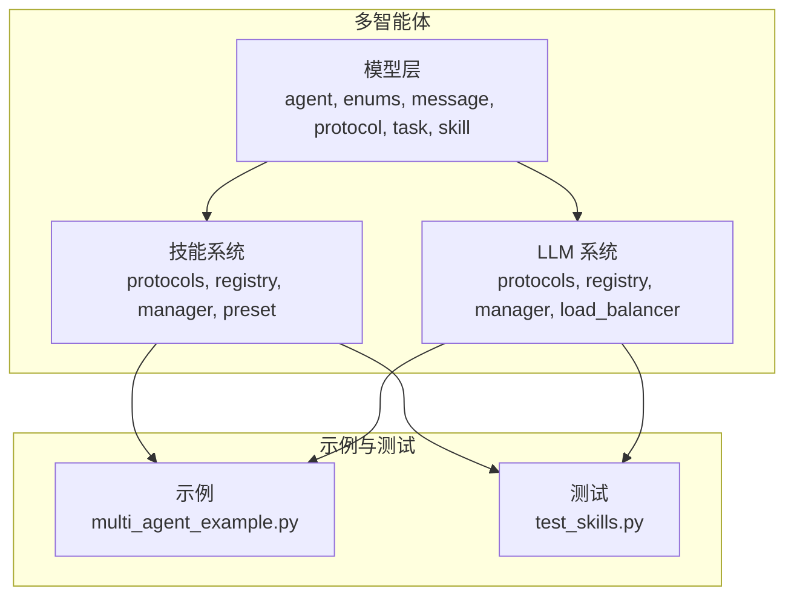
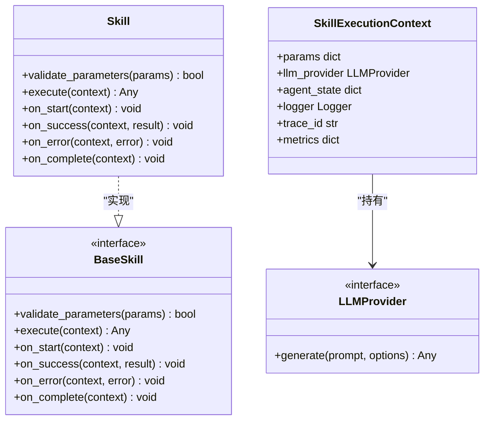
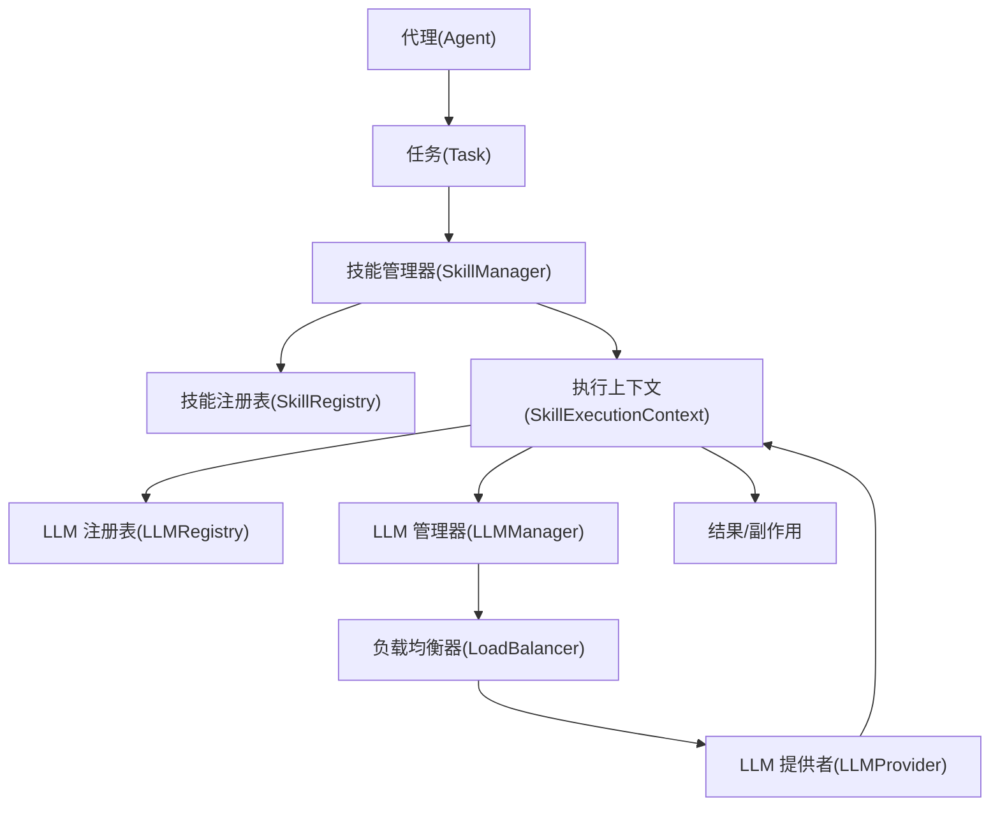
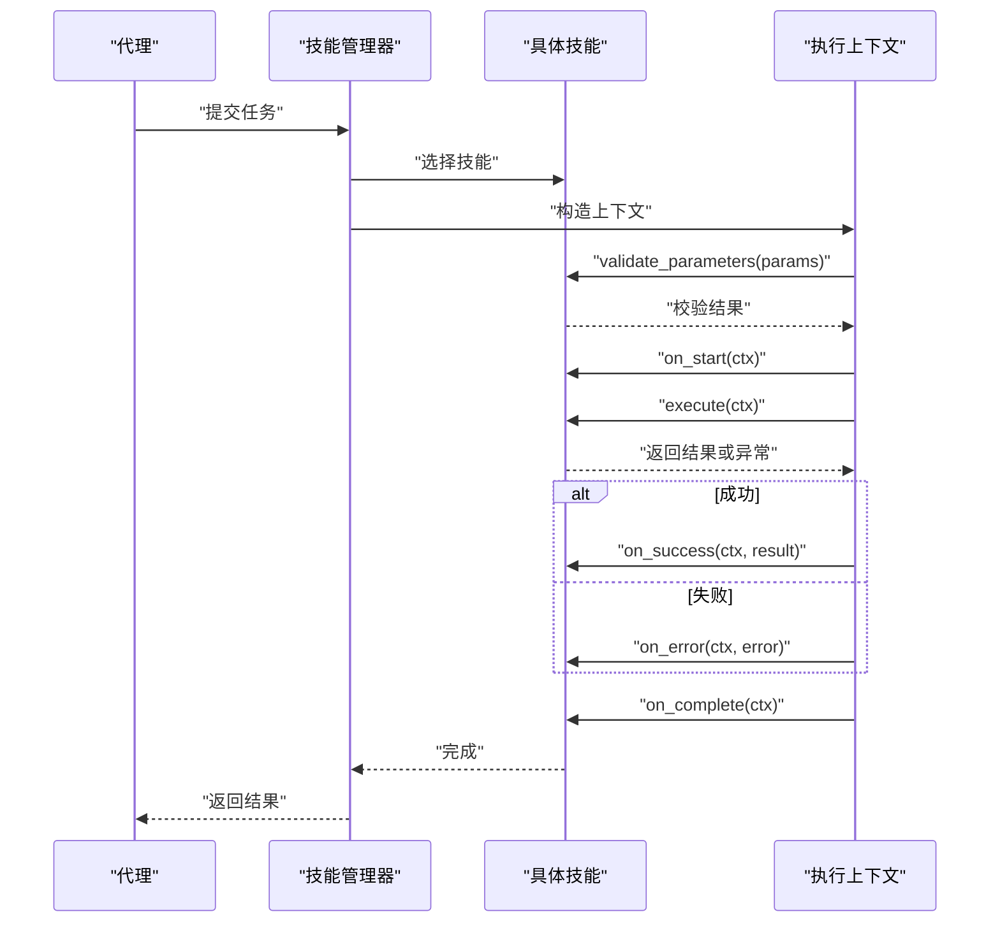
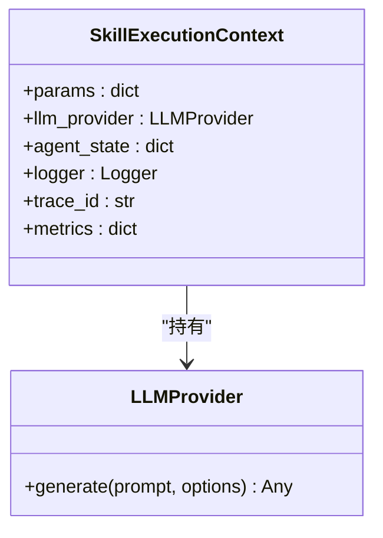
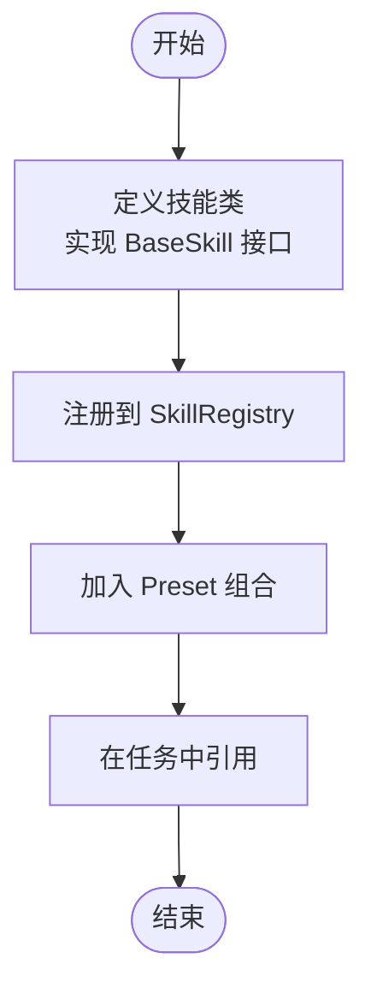
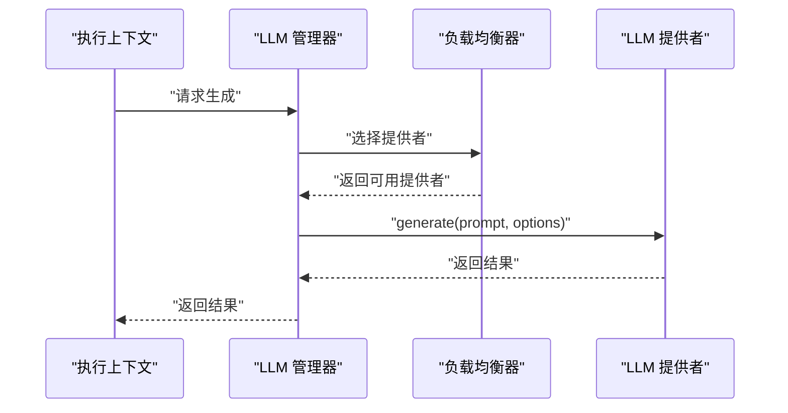
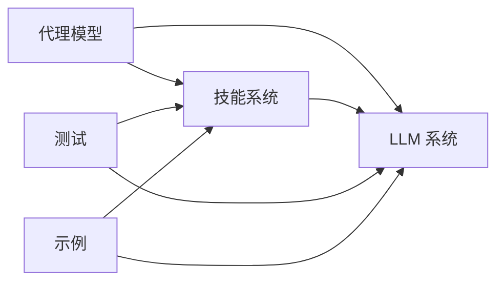

# 技能协议

<cite>
**本文引用的文件**
- [README.md](file://README.md)
- [pyproject.toml](file://pyproject.toml)
- [examples/multi_agent_example.py](file://examples/multi_agent_example.py)
- [tests/testing/test_multi_agent/test_skills.py](file://tests/testing/test_multi_agent/test_skills.py)
- [src/taolib/testing/multi_agent/models/skill.py](file://src/taolib/testing/multi_agent/models/skill.py)
- [src/taolib/testing/multi_agent/skills/protocols.py](file://src/taolib/testing/multi_agent/skills/protocols.py)
- [src/taolib/testing/multi_agent/skills/registry.py](file://src/taolib/testing/multi_agent/skills/registry.py)
- [src/taolib/testing/multi_agent/skills/manager.py](file://src/taolib/testing/multi_agent/skills/manager.py)
- [src/taolib/testing/multi_agent/skills/preset.py](file://src/taolib/testing/multi_agent/skills/preset.py)
- [src/taolib/testing/multi_agent/llm/protocols.py](file://src/taolib/testing/multi_agent/llm/protocols.py)
- [src/taolib/testing/multi_agent/llm/registry.py](file://src/taolib/testing/multi_agent/llm/registry.py)
- [src/taolib/testing/multi_agent/llm/manager.py](file://src/taolib/testing/multi_agent/llm/manager.py)
- [src/taolib/testing/multi_agent/llm/load_balancer.py](file://src/taolib/testing/multi_agent/llm/load_balancer.py)
- [src/taolib/testing/multi_agent/models/agent.py](file://src/taolib/testing/multi_agent/models/agent.py)
- [src/taolib/testing/multi_agent/models/enums.py](file://src/taolib/testing/multi_agent/models/enums.py)
- [src/taolib/testing/multi_agent/models/message.py](file://src/taolib/testing/multi_agent/models/message.py)
- [src/taolib/testing/multi_agent/models/protocol.py](file://src/taolib/testing/multi_agent/models/protocol.py)
- [src/taolib/testing/multi_agent/models/task.py](file://src/taolib/testing/multi_agent/models/task.py)
</cite>

## 目录
1. [简介](#简介)
2. [项目结构](#项目结构)
3. [核心组件](#核心组件)
4. [架构总览](#架构总览)
5. [详细组件分析](#详细组件分析)
6. [依赖分析](#依赖分析)
7. [性能考虑](#性能考虑)
8. [故障排查指南](#故障排查指南)
9. [结论](#结论)
10. [附录](#附录)

## 简介
本文件面向“技能协议体系”的技术文档，聚焦于以下目标：
- 解释 BaseSkill、Skill、SkillExecutionContext 等核心协议的设计理念与实现规范
- 文档化技能接口的标准定义：execute 方法、validate_parameters 方法与生命周期钩子
- 说明执行上下文的结构设计：参数传递、LLM 提供者访问、代理状态管理
- 解释技能协议的扩展机制与自定义技能开发规范
- 提供技能实现的最佳实践与性能考虑
- 协议版本兼容性、向后兼容与升级策略

本仓库提供了多智能体系统中的技能与 LLM 管理能力，技能协议位于 multi_agent 子模块中，配套有注册表、管理器、预设与负载均衡等基础设施。

章节来源
- [README.md:1-100](file://README.md#L1-L100)
- [pyproject.toml:223-235](file://pyproject.toml#L223-L235)

## 项目结构
该仓库采用分层与功能域结合的组织方式，技能协议位于 multi_agent 子模块内，围绕“技能”“LLM 提供者”“代理模型”“任务与消息”等进行模块化拆分。关键路径如下：
- 多智能体模型：agent、enums、message、protocol、task、skill
- 技能系统：protocols、registry、manager、preset
- LLM 系统：protocols、registry、manager、load_balancer
- 示例与测试：examples、tests/testing/test_multi_agent

图表来源
- [src/taolib/testing/multi_agent/models/skill.py](file://src/taolib/testing/multi_agent/models/skill.py)
- [src/taolib/testing/multi_agent/skills/protocols.py](file://src/taolib/testing/multi_agent/skills/protocols.py)
- [src/taolib/testing/multi_agent/skills/registry.py](file://src/taolib/testing/multi_agent/skills/registry.py)
- [src/taolib/testing/multi_agent/skills/manager.py](file://src/taolib/testing/multi_agent/skills/manager.py)
- [src/taolib/testing/multi_agent/skills/preset.py](file://src/taolib/testing/multi_agent/skills/preset.py)
- [src/taolib/testing/multi_agent/llm/protocols.py](file://src/taolib/testing/multi_agent/llm/protocols.py)
- [src/taolib/testing/multi_agent/llm/registry.py](file://src/taolib/testing/multi_agent/llm/registry.py)
- [src/taolib/testing/multi_agent/llm/manager.py](file://src/taolib/testing/multi_agent/llm/manager.py)
- [src/taolib/testing/multi_agent/llm/load_balancer.py](file://src/taolib/testing/multi_agent/llm/load_balancer.py)
- [examples/multi_agent_example.py](file://examples/multi_agent_example.py)
- [tests/testing/test_multi_agent/test_skills.py](file://tests/testing/test_multi_agent/test_skills.py)

章节来源
- [pyproject.toml:223-235](file://pyproject.toml#L223-L235)
- [examples/multi_agent_example.py](file://examples/multi_agent_example.py)
- [tests/testing/test_multi_agent/test_skills.py](file://tests/testing/test_multi_agent/test_skills.py)

## 核心组件
本节聚焦技能协议的核心要素：BaseSkill、Skill、SkillExecutionContext 的职责与交互关系。

- BaseSkill：技能抽象基类，定义统一的接口契约（如 execute、validate_parameters），并提供生命周期钩子（如初始化、清理）
- Skill：具体技能实现需遵循 BaseSkill 的契约；通常封装一次原子能力调用（如查询、计算、调用外部 API）
- SkillExecutionContext：执行上下文对象，承载本次执行所需的参数、LLM 提供者、代理状态、日志与错误处理等

图表来源
- [src/taolib/testing/multi_agent/skills/protocols.py](file://src/taolib/testing/multi_agent/skills/protocols.py)
- [src/taolib/testing/multi_agent/llm/protocols.py](file://src/taolib/testing/multi_agent/llm/protocols.py)
- [src/taolib/testing/multi_agent/models/skill.py](file://src/taolib/testing/multi_agent/models/skill.py)

章节来源
- [src/taolib/testing/multi_agent/skills/protocols.py](file://src/taolib/testing/multi_agent/skills/protocols.py)
- [src/taolib/testing/multi_agent/models/skill.py](file://src/taolib/testing/multi_agent/models/skill.py)
- [src/taolib/testing/multi_agent/llm/protocols.py](file://src/taolib/testing/multi_agent/llm/protocols.py)

## 架构总览
技能协议体系由“模型层”“技能系统”“LLM 系统”三部分组成，形成“代理发起任务 -> 选择技能 -> 执行上下文 -> LLM 提供者 -> 返回结果”的闭环。

图表来源
- [src/taolib/testing/multi_agent/models/agent.py](file://src/taolib/testing/multi_agent/models/agent.py)
- [src/taolib/testing/multi_agent/models/task.py](file://src/taolib/testing/multi_agent/models/task.py)
- [src/taolib/testing/multi_agent/skills/manager.py](file://src/taolib/testing/multi_agent/skills/manager.py)
- [src/taolib/testing/multi_agent/skills/registry.py](file://src/taolib/testing/multi_agent/skills/registry.py)
- [src/taolib/testing/multi_agent/llm/registry.py](file://src/taolib/testing/multi_agent/llm/registry.py)
- [src/taolib/testing/multi_agent/llm/manager.py](file://src/taolib/testing/multi_agent/llm/manager.py)
- [src/taolib/testing/multi_agent/llm/load_balancer.py](file://src/taolib/testing/multi_agent/llm/load_balancer.py)
- [src/taolib/testing/multi_agent/llm/protocols.py](file://src/taolib/testing/multi_agent/llm/protocols.py)

## 详细组件分析

### 技能接口与生命周期
- 接口方法
  - validate_parameters(params): 校验输入参数合法性与完整性
  - execute(context): 执行技能逻辑，返回结果或触发副作用
- 生命周期钩子
  - on_start(context): 执行前回调，可用于初始化资源、记录开始时间
  - on_success(context, result): 成功回调，可用于记录指标、更新状态
  - on_error(context, error): 异常回调，可用于重试、降级、告警
  - on_complete(context): 无论成功失败都会调用，用于释放资源、收尾

图表来源
- [src/taolib/testing/multi_agent/skills/protocols.py](file://src/taolib/testing/multi_agent/skills/protocols.py)
- [src/taolib/testing/multi_agent/skills/manager.py](file://src/taolib/testing/multi_agent/skills/manager.py)
- [src/taolib/testing/multi_agent/models/skill.py](file://src/taolib/testing/multi_agent/models/skill.py)

章节来源
- [src/taolib/testing/multi_agent/skills/protocols.py](file://src/taolib/testing/multi_agent/skills/protocols.py)
- [src/taolib/testing/multi_agent/models/skill.py](file://src/taolib/testing/multi_agent/models/skill.py)

### 执行上下文结构设计
- 参数传递：params 字典作为标准化输入，支持动态键值注入
- LLM 提供者访问：通过 LLMProvider 接口统一生成文本/推理，便于替换与扩展
- 代理状态管理：agent_state 字典用于跨步骤的状态持久化与共享
- 追踪与度量：trace_id 用于链路追踪；metrics 用于采集耗时、调用次数等
- 日志与错误：logger 用于结构化日志；on_error 钩子用于统一错误处理

图表来源
- [src/taolib/testing/multi_agent/llm/protocols.py](file://src/taolib/testing/multi_agent/llm/protocols.py)
- [src/taolib/testing/multi_agent/skills/protocols.py](file://src/taolib/testing/multi_agent/skills/protocols.py)

章节来源
- [src/taolib/testing/multi_agent/skills/protocols.py](file://src/taolib/testing/multi_agent/skills/protocols.py)
- [src/taolib/testing/multi_agent/llm/protocols.py](file://src/taolib/testing/multi_agent/llm/protocols.py)

### 技能扩展机制与自定义开发规范
- 扩展机制
  - 通过 SkillRegistry 注册自定义技能，支持按名称检索与版本化管理
  - 通过 Preset 预设技能组合，快速装配常见工作流
  - 通过 LoadBalancer 对多个 LLM 提供者进行负载均衡与熔断
- 自定义技能开发规范
  - 实现 BaseSkill 接口，确保 validate_parameters 与 execute 的幂等与可测试性
  - 在生命周期钩子中处理资源分配/回收、指标上报与异常恢复
  - 明确输入输出格式，避免隐式依赖，提升可移植性

图表来源
- [src/taolib/testing/multi_agent/skills/registry.py](file://src/taolib/testing/multi_agent/skills/registry.py)
- [src/taolib/testing/multi_agent/skills/preset.py](file://src/taolib/testing/multi_agent/skills/preset.py)
- [src/taolib/testing/multi_agent/skills/protocols.py](file://src/taolib/testing/multi_agent/skills/protocols.py)

章节来源
- [src/taolib/testing/multi_agent/skills/registry.py](file://src/taolib/testing/multi_agent/skills/registry.py)
- [src/taolib/testing/multi_agent/skills/preset.py](file://src/taolib/testing/multi_agent/skills/preset.py)
- [src/taolib/testing/multi_agent/skills/protocols.py](file://src/taolib/testing/multi_agent/skills/protocols.py)

### LLM 提供者与负载均衡
- LLMProvider 接口统一生成能力，便于切换不同供应商
- LLMRegistry 管理提供者集合
- LLMManager 负责调度与生命周期管理
- LoadBalancer 支持权重、健康检查与故障转移

图表来源
- [src/taolib/testing/multi_agent/llm/manager.py](file://src/taolib/testing/multi_agent/llm/manager.py)
- [src/taolib/testing/multi_agent/llm/load_balancer.py](file://src/taolib/testing/multi_agent/llm/load_balancer.py)
- [src/taolib/testing/multi_agent/llm/protocols.py](file://src/taolib/testing/multi_agent/llm/protocols.py)

章节来源
- [src/taolib/testing/multi_agent/llm/manager.py](file://src/taolib/testing/multi_agent/llm/manager.py)
- [src/taolib/testing/multi_agent/llm/load_balancer.py](file://src/taolib/testing/multi_agent/llm/load_balancer.py)
- [src/taolib/testing/multi_agent/llm/protocols.py](file://src/taolib/testing/multi_agent/llm/protocols.py)

### 示例与测试参考
- 示例：examples/multi_agent_example.py 展示如何组装代理、任务与技能
- 测试：tests/testing/test_multi_agent/test_skills.py 验证技能注册、执行与生命周期行为

章节来源
- [examples/multi_agent_example.py](file://examples/multi_agent_example.py)
- [tests/testing/test_multi_agent/test_skills.py](file://tests/testing/test_multi_agent/test_skills.py)

## 依赖分析
- 技能系统依赖 LLM 系统提供的统一生成能力
- 代理模型依赖技能系统与 LLM 系统完成任务编排
- 测试与示例依赖技能与 LLM 的协议实现

图表来源
- [src/taolib/testing/multi_agent/models/agent.py](file://src/taolib/testing/multi_agent/models/agent.py)
- [src/taolib/testing/multi_agent/skills/manager.py](file://src/taolib/testing/multi_agent/skills/manager.py)
- [src/taolib/testing/multi_agent/llm/manager.py](file://src/taolib/testing/multi_agent/llm/manager.py)

章节来源
- [src/taolib/testing/multi_agent/models/agent.py](file://src/taolib/testing/multi_agent/models/agent.py)
- [src/taolib/testing/multi_agent/skills/manager.py](file://src/taolib/testing/multi_agent/skills/manager.py)
- [src/taolib/testing/multi_agent/llm/manager.py](file://src/taolib/testing/multi_agent/llm/manager.py)

## 性能考虑
- 参数校验前置：在 validate_parameters 中尽早失败，减少无效执行
- 上下文复用：在多次调用间复用 LLM 提供者与日志句柄，降低对象创建开销
- 负载均衡与熔断：通过 LoadBalancer 与健康检查避免热点与雪崩
- 指标埋点：在生命周期钩子中记录耗时与成功率，支撑容量规划与优化
- 并发与异步：在执行上下文中合理使用异步/并发，避免阻塞主线程

## 故障排查指南
- 参数校验失败：检查 validate_parameters 的输入约束与默认值
- 执行异常：查看 on_error 回调中的错误分类与重试策略
- LLM 提供者不可用：确认 LLMRegistry 与 LoadBalancer 的健康状态
- 上下文丢失：核对 trace_id 与 agent_state 的传递路径
- 性能瓶颈：通过 metrics 与日志定位慢调用与高延迟阶段

章节来源
- [src/taolib/testing/multi_agent/skills/protocols.py](file://src/taolib/testing/multi_agent/skills/protocols.py)
- [src/taolib/testing/multi_agent/llm/load_balancer.py](file://src/taolib/testing/multi_agent/llm/load_balancer.py)

## 结论
技能协议体系通过清晰的接口契约、可插拔的 LLM 提供者与完善的生命周期钩子，实现了可扩展、可观测、易维护的多智能体技能执行框架。遵循本文规范，可在保证向后兼容的前提下平滑演进协议版本与实现细节。

## 附录

### 协议版本兼容性与升级策略
- 向后兼容
  - 新增字段应具备默认值，避免破坏既有实现
  - 生命周期钩子新增可选参数时，应在调用侧做兼容判断
- 版本化
  - 通过包版本号与模块命名区分不同协议版本
  - 在注册表与管理器中保留历史版本映射
- 升级策略
  - 渐进式迁移：先在新旧版本共存期进行灰度验证
  - 兼容层：提供适配器或转换器，降低迁移成本
  - 文档与测试：同步更新示例与测试用例，确保回归覆盖

### 最佳实践清单
- 明确定义输入输出数据模型，避免隐式依赖
- 将副作用隔离在生命周期钩子中，保持 execute 的纯函数特性
- 使用 trace_id 串联日志与指标，便于问题定位
- 对外部依赖进行超时与重试控制，提升鲁棒性
- 在 Preset 中沉淀常用组合，减少重复配置