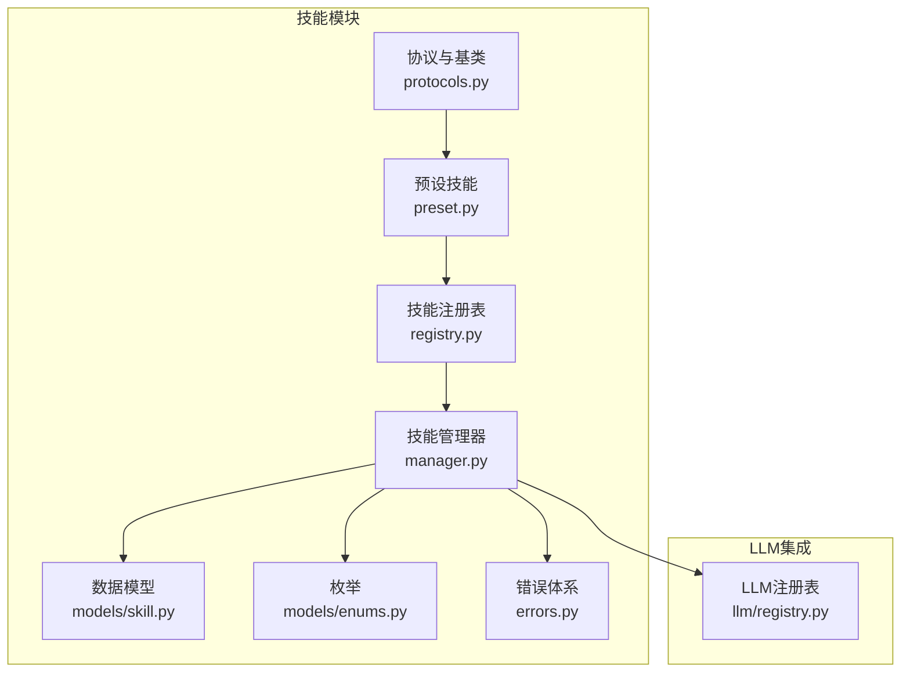
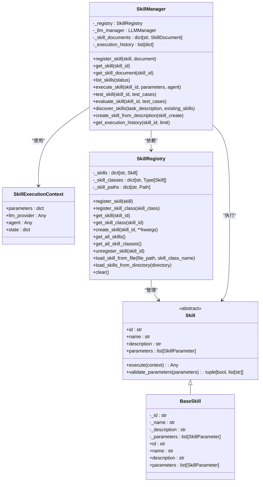
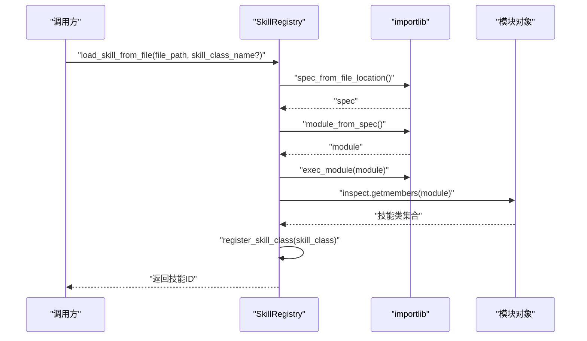
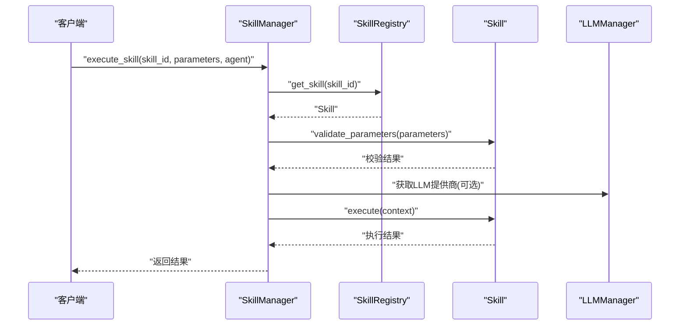
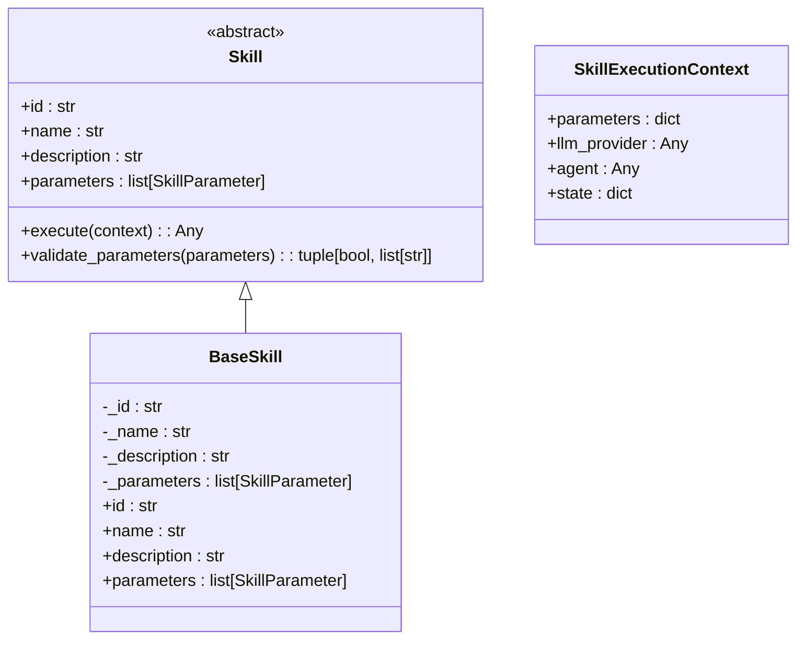
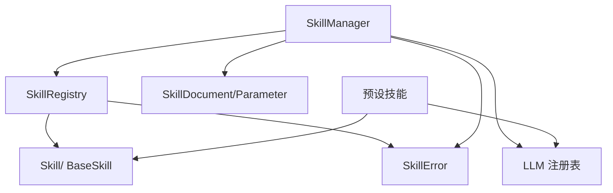

# 技能注册表

<cite>
**本文引用的文件**
- [registry.py](file://src/taolib/testing/multi_agent/skills/registry.py)
- [manager.py](file://src/taolib/testing/multi_agent/skills/manager.py)
- [protocols.py](file://src/taolib/testing/multi_agent/skills/protocols.py)
- [preset.py](file://src/taolib/testing/multi_agent/skills/preset.py)
- [skill.py](file://src/taolib/testing/multi_agent/models/skill.py)
- [enums.py](file://src/taolib/testing/multi_agent/models/enums.py)
- [errors.py](file://src/taolib/testing/multi_agent/errors.py)
- [registry.py（LLM）](file://src/taolib/testing/multi_agent/llm/registry.py)
- [__init__.py（技能模块）](file://src/taolib/testing/multi_agent/skills/__init__.py)
- [test_skills.py](file://tests/testing/test_multi_agent/test_skills.py)
</cite>

## 目录
1. [简介](#简介)
2. [项目结构](#项目结构)
3. [核心组件](#核心组件)
4. [架构总览](#架构总览)
5. [详细组件分析](#详细组件分析)
6. [依赖关系分析](#依赖关系分析)
7. [性能考虑](#性能考虑)
8. [故障排查指南](#故障排查指南)
9. [结论](#结论)
10. [附录](#附录)

## 简介
本文件为“技能注册表”的技术文档，聚焦于 SkillRegistry 类的设计与实现，涵盖技能存储、检索与管理机制；数据结构设计（技能索引、依赖关系与版本控制）；技能发现与加载机制（动态导入、插件式架构与延迟加载策略）；线程安全与并发访问控制；以及完整的技能注册、注销与查询 API 文档。同时提供冲突检测、循环依赖规避与性能优化建议。

## 项目结构
技能系统位于多智能体模块下，采用分层与协议驱动设计：
- 协议与基类：定义技能接口与执行上下文
- 预设技能：提供常用技能实现
- 注册表：集中管理技能类与实例
- 管理器：统一调度技能执行、评估与探索
- 数据模型：技能的多层 Pydantic 模型
- 枚举：技能类型与状态等
- 错误体系：统一的技能相关异常
- LLM 注册表：为技能执行提供外部能力（如大模型）

图表来源
- [protocols.py:1-143](file://src/taolib/testing/multi_agent/skills/protocols.py#L1-L143)
- [preset.py:1-217](file://src/taolib/testing/multi_agent/skills/preset.py#L1-L217)
- [registry.py:1-247](file://src/taolib/testing/multi_agent/skills/registry.py#L1-L247)
- [manager.py:1-404](file://src/taolib/testing/multi_agent/skills/manager.py#L1-L404)
- [skill.py:1-142](file://src/taolib/testing/multi_agent/models/skill.py#L1-L142)
- [enums.py:1-96](file://src/taolib/testing/multi_agent/models/enums.py#L1-L96)
- [errors.py:1-107](file://src/taolib/testing/multi_agent/errors.py#L1-L107)
- [registry.py（LLM）:1-73](file://src/taolib/testing/multi_agent/llm/registry.py#L1-L73)

章节来源
- [__init__.py（技能模块）:1-49](file://src/taolib/testing/multi_agent/skills/__init__.py#L1-L49)

## 核心组件
- SkillRegistry：技能注册表，负责技能类与实例的注册、查询、创建与卸载，并支持从文件动态加载技能。
- SkillManager：技能管理器，封装注册、执行、测试、评估、发现与历史记录等能力。
- 协议与基类：Skill、BaseSkill、SkillExecutionContext 定义了技能的统一接口与执行上下文。
- 预设技能：TextSummarizationSkill、CodeGenerationSkill、TranslationSkill、DataAnalysisSkill 等。
- 数据模型：SkillDocument、SkillCreate、SkillResponse、SkillEvaluation 等。
- 枚举：SkillType、SkillStatus 等。
- 错误体系：SkillError 及其子类。
- LLM 注册表：为技能执行提供外部能力（如大模型生成）。

章节来源
- [registry.py:16-247](file://src/taolib/testing/multi_agent/skills/registry.py#L16-L247)
- [manager.py:29-404](file://src/taolib/testing/multi_agent/skills/manager.py#L29-L404)
- [protocols.py:34-143](file://src/taolib/testing/multi_agent/skills/protocols.py#L34-L143)
- [preset.py:12-217](file://src/taolib/testing/multi_agent/skills/preset.py#L12-L217)
- [skill.py:15-142](file://src/taolib/testing/multi_agent/models/skill.py#L15-L142)
- [enums.py:41-56](file://src/taolib/testing/multi_agent/models/enums.py#L41-L56)
- [errors.py:73-88](file://src/taolib/testing/multi_agent/errors.py#L73-L88)
- [registry.py（LLM）:12-73](file://src/taolib/testing/multi_agent/llm/registry.py#L12-L73)

## 架构总览
技能系统采用“协议驱动 + 插件式注册表 + 管理器编排”的架构：
- 协议层：定义技能必须实现的接口与参数校验规则。
- 注册表层：集中管理技能类与实例，支持动态导入与路径映射。
- 管理器层：统一调度执行、测试、评估与发现，维护技能文档与执行历史。
- 外部能力：通过 LLM 注册表注入外部能力（如大模型生成），在技能执行时按需使用。

图表来源
- [protocols.py:34-143](file://src/taolib/testing/multi_agent/skills/protocols.py#L34-L143)
- [registry.py:16-247](file://src/taolib/testing/multi_agent/skills/registry.py#L16-L247)
- [manager.py:29-404](file://src/taolib/testing/multi_agent/skills/manager.py#L29-L404)

## 详细组件分析

### SkillRegistry 组件分析
- 设计模式与职责
  - 使用字典作为核心存储结构，分别维护技能实例、技能类与文件路径映射。
  - 支持技能类与实例的注册、查询、创建与注销。
  - 动态导入机制：通过 importlib 从文件加载模块并自动识别继承自 Skill 的类。
  - 插件式架构：通过目录扫描批量加载技能，支持延迟加载（仅在需要时创建实例）。
- 关键方法与行为
  - 注册与查询：register_skill、register_skill_class、get_skill、get_skill_class、get_all_skills、get_all_skill_classes。
  - 实例创建：create_skill 基于已注册的技能类构造实例。
  - 卸载：unregister_skill 同步清理实例、类与路径映射。
  - 动态加载：load_skill_from_file 与 load_skills_from_directory 支持从文件与目录加载技能。
  - 全局注册表：get_skill_registry/set_skill_registry 提供全局访问。
- 线程安全与并发控制
  - 当前实现为内存字典操作，未引入锁或原子结构，因此在多线程并发写入场景下存在竞态风险。
  - 建议在关键路径（注册/注销/动态加载）加锁，或使用线程安全容器。
- 数据结构与复杂度
  - 字典查找/插入/删除均为平均 O(1)，整体性能良好。
  - 目录扫描为 O(n) 遍历文件，动态导入为 O(1) 模块加载。
- 错误处理
  - 对重复注册、类缺失、文件不存在等情况抛出 SkillError。
- 依赖关系管理与版本控制
  - 注册表未直接维护依赖关系与版本字段；依赖关系与版本由上层数据模型（SkillDocument）承载。
  - 文件路径映射可用于后续扩展“基于路径的版本/依赖解析”。

图表来源
- [registry.py:134-188](file://src/taolib/testing/multi_agent/skills/registry.py#L134-L188)

章节来源
- [registry.py:16-247](file://src/taolib/testing/multi_agent/skills/registry.py#L16-L247)
- [errors.py:73-88](file://src/taolib/testing/multi_agent/errors.py#L73-L88)

### SkillManager 组件分析
- 设计模式与职责
  - 以组合方式持有 SkillRegistry 与 LLMManager，统一编排技能生命周期与执行流程。
  - 维护技能文档（SkillDocument）与执行历史，支持测试、评估与发现。
- 关键方法与行为
  - 注册与查询：register_skill、get_skill、get_skill_document、list_skills。
  - 执行：execute_skill，包含参数校验、上下文构建、异常记录与历史保存。
  - 测试与评估：test_skill、evaluate_skill，计算成功率与状态变更。
  - 发现：discover_skills 基于关键词匹配推荐技能。
  - 历史：get_execution_history 支持按技能过滤与限制条数。
  - 全局管理器：get_skill_manager/set_skill_manager。
- 并发与线程安全
  - 与 SkillRegistry 类似，当前未显式加锁，存在并发风险。
- 性能与优化
  - 执行历史为列表追加，注意限制大小与滚动清理。
  - 关键词匹配为简单集合交集，适合中小规模技能集。

图表来源
- [manager.py:110-175](file://src/taolib/testing/multi_agent/skills/manager.py#L110-L175)
- [protocols.py:12-32](file://src/taolib/testing/multi_agent/skills/protocols.py#L12-L32)

章节来源
- [manager.py:29-404](file://src/taolib/testing/multi_agent/skills/manager.py#L29-L404)

### 协议与基类分析
- Skill 抽象接口：定义 id、name、description、parameters、execute 与参数校验。
- BaseSkill：提供通用属性与只读属性实现，便于快速实现具体技能。
- SkillExecutionContext：封装执行上下文，包含参数、LLM 提供商与代理对象。

图表来源
- [protocols.py:34-143](file://src/taolib/testing/multi_agent/skills/protocols.py#L34-L143)

章节来源
- [protocols.py:12-143](file://src/taolib/testing/multi_agent/skills/protocols.py#L12-L143)

### 预设技能分析
- TextSummarizationSkill：支持最大长度截断与 LLM 回退。
- CodeGenerationSkill：根据语言与需求生成代码，支持 LLM 回退。
- TranslationSkill：支持源语言与目标语言参数，支持 LLM 回退。
- DataAnalysisSkill：支持多种分析类型，支持 LLM 回退。
- get_preset_skills：统一导出预设技能列表。

章节来源
- [preset.py:12-217](file://src/taolib/testing/multi_agent/skills/preset.py#L12-L217)

### 数据模型与枚举
- SkillDocument/SkillCreate/SkillResponse：多层模型，覆盖创建、响应与文档形态。
- SkillParameter：参数定义，含类型、必填、默认值与约束。
- SkillType、SkillStatus：技能类型与状态枚举。
- SkillEvaluation/SkillTestResult：评估与测试结果模型。

章节来源
- [skill.py:15-142](file://src/taolib/testing/multi_agent/models/skill.py#L15-L142)
- [enums.py:41-56](file://src/taolib/testing/multi_agent/models/enums.py#L41-L56)

### 错误体系
- SkillError 及其子类：统一技能相关异常，便于上层捕获与处理。

章节来源
- [errors.py:73-88](file://src/taolib/testing/multi_agent/errors.py#L73-L88)

## 依赖关系分析
- SkillRegistry 依赖
  - 协议与基类：确保技能符合统一接口。
  - 错误体系：统一异常抛出。
  - 文件系统：动态导入需要路径与模块加载。
- SkillManager 依赖
  - SkillRegistry：技能注册与实例管理。
  - LLM 注册表：为技能执行提供外部能力。
  - 数据模型与枚举：技能文档与状态管理。
  - 错误体系：统一异常处理。
- 预设技能依赖
  - 协议与基类：实现统一接口。
  - LLM 注册表：在无外部能力时提供回退逻辑。

图表来源
- [registry.py:12-13](file://src/taolib/testing/multi_agent/skills/registry.py#L12-L13)
- [manager.py:9-26](file://src/taolib/testing/multi_agent/skills/manager.py#L9-L26)
- [preset.py:8-9](file://src/taolib/testing/multi_agent/skills/preset.py#L8-L9)
- [registry.py（LLM）:8-9](file://src/taolib/testing/multi_agent/llm/registry.py#L8-L9)

## 性能考虑
- 存储与查询
  - 使用字典存储技能实例与类，查找/插入/删除为平均 O(1)，适合高并发查询场景。
- 动态导入
  - 模块加载为一次性开销，后续复用模块缓存；目录扫描为 O(n)。
- 执行链路
  - 参数校验与上下文构建为轻量操作；LLM 调用为 IO 密集，建议异步与连接池优化。
- 内存占用
  - 执行历史列表可能持续增长，建议滚动窗口与定期清理。
- 并发
  - 当前未加锁，建议在注册/注销/动态加载关键路径加锁或使用线程安全容器。

## 故障排查指南
- 技能未找到
  - 检查是否已注册（实例或类），确认 ID 是否正确。
  - 若通过文件加载，确认文件路径存在且包含合法技能类。
- 重复注册
  - 注册同一技能或技能类会触发异常，检查注册逻辑。
- 参数校验失败
  - 检查必填参数与类型是否匹配，参考参数定义。
- 执行失败
  - 查看执行历史记录，定位异常与错误信息。
- 动态导入失败
  - 检查文件是否存在、类名是否正确、模块依赖是否齐全。

章节来源
- [test_skills.py:105-273](file://tests/testing/test_multi_agent/test_skills.py#L105-L273)
- [errors.py:73-88](file://src/taolib/testing/multi_agent/errors.py#L73-L88)

## 结论
SkillRegistry 与 SkillManager 构成了灵活、可扩展的技能管理体系。通过协议驱动与插件式注册表，系统实现了技能的动态加载与统一编排。当前实现简洁高效，但在并发与依赖管理方面仍有改进空间。建议引入线程安全机制与依赖/版本管理，以进一步提升稳定性与可维护性。

## 附录

### API 文档：SkillRegistry
- register_skill(skill)
  - 注册技能实例；若已存在则抛出异常。
- register_skill_class(skill_class)
  - 注册技能类；若已存在则抛出异常；支持从类名推断 ID。
- get_skill(skill_id)
  - 获取技能实例；不存在返回 None。
- get_skill_class(skill_id)
  - 获取技能类；不存在返回 None。
- create_skill(skill_id, **kwargs)
  - 基于技能类创建实例；类不存在抛出异常。
- get_all_skills()
  - 获取所有已注册技能实例。
- get_all_skill_classes()
  - 获取所有已注册技能类。
- unregister_skill(skill_id)
  - 注销技能，同步清理实例、类与路径映射。
- load_skill_from_file(file_path, skill_class_name=None)
  - 从文件动态加载技能类；支持自动查找继承自 Skill 的类。
- load_skills_from_directory(directory)
  - 批量加载目录内技能文件。
- clear()
  - 清空注册表。
- get_skill_registry()/set_skill_registry(registry)
  - 全局注册表访问与设置。

章节来源
- [registry.py:25-247](file://src/taolib/testing/multi_agent/skills/registry.py#L25-L247)

### API 文档：SkillManager
- register_skill(skill, document=None)
  - 注册技能并创建/更新技能文档。
- get_skill(skill_id)
  - 获取技能实例。
- get_skill_document(skill_id)
  - 获取技能文档。
- list_skills(status=None)
  - 列出技能文档；可按状态过滤。
- execute_skill(skill_id, parameters, agent=None)
  - 执行技能；包含参数校验、上下文构建与异常记录。
- test_skill(skill_id, test_cases)
  - 执行测试用例并返回结果统计。
- evaluate_skill(skill_id, test_cases=None)
  - 评估技能并更新状态。
- discover_skills(task_description, existing_skills=None)
  - 基于关键词匹配推荐技能。
- create_skill_from_description(skill_create)
  - 从描述创建技能文档（占位实现）。
- get_execution_history(skill_id=None, limit=100)
  - 获取执行历史记录。
- get_skill_manager()/set_skill_manager(manager)
  - 全局管理器访问与设置。

章节来源
- [manager.py:48-404](file://src/taolib/testing/multi_agent/skills/manager.py#L48-L404)

### 技能发现与加载机制
- 动态导入
  - 使用 importlib.util.spec_from_file_location 与 module_from_spec 加载模块。
  - 通过 inspect.getmembers 自动识别技能类。
- 插件式架构
  - 支持目录扫描批量加载，忽略以“_”开头的文件。
- 延迟加载策略
  - 注册表仅注册类，实例按需通过 create_skill 创建。

章节来源
- [registry.py:134-214](file://src/taolib/testing/multi_agent/skills/registry.py#L134-L214)

### 依赖关系管理与版本控制
- 依赖关系
  - 上层数据模型（SkillDocument）包含 dependencies 字段，用于声明依赖技能 ID。
- 版本控制
  - 上层数据模型（SkillBase）包含 version 字段，用于版本标识。
- 冲突检测与循环依赖避免
  - 当前注册表未内置冲突检测与环依赖检查；建议在注册/评估阶段增加拓扑排序与环检测。

章节来源
- [skill.py:51-67](file://src/taolib/testing/multi_agent/models/skill.py#L51-L67)

### 线程安全与并发访问控制
- 现状
  - 注册表与管理器均未显式加锁，存在并发写入风险。
- 建议
  - 在关键路径（注册/注销/动态加载/执行）引入锁或使用线程安全容器。
  - 对执行历史与文档字典进行并发保护。

章节来源
- [registry.py:16-247](file://src/taolib/testing/multi_agent/skills/registry.py#L16-L247)
- [manager.py:29-404](file://src/taolib/testing/multi_agent/skills/manager.py#L29-L404)