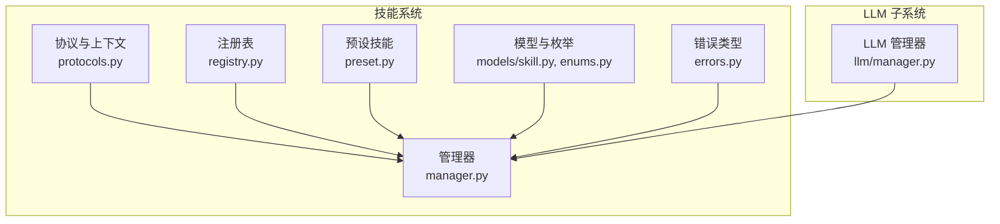
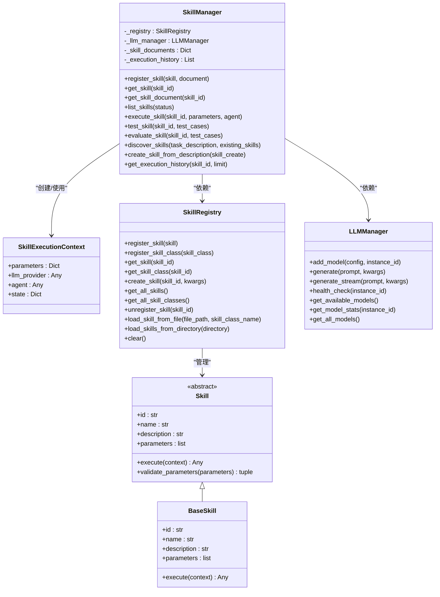
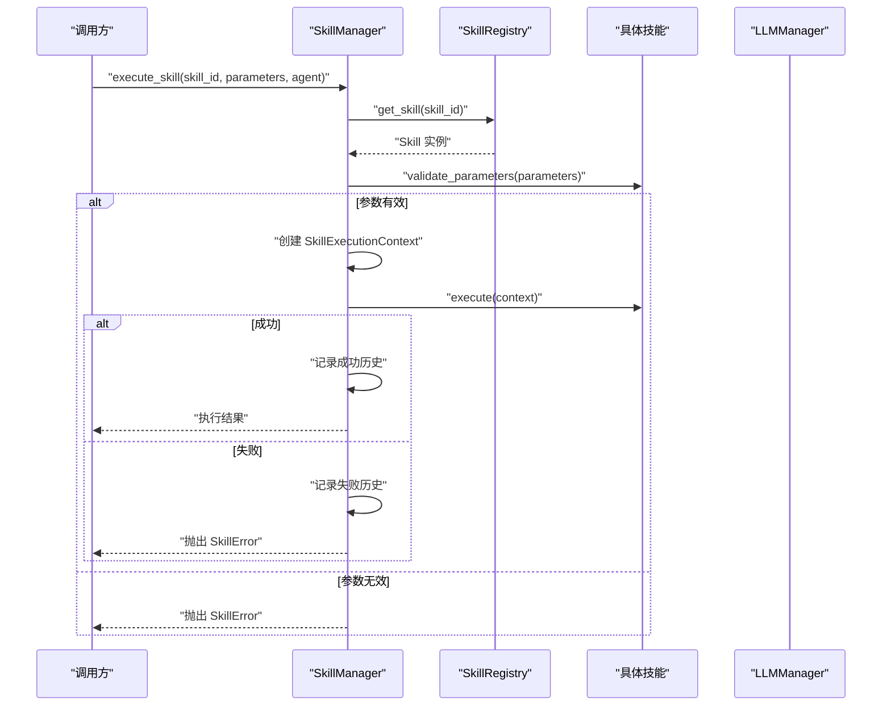
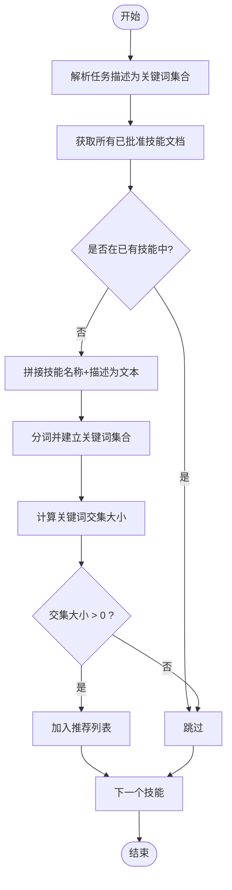
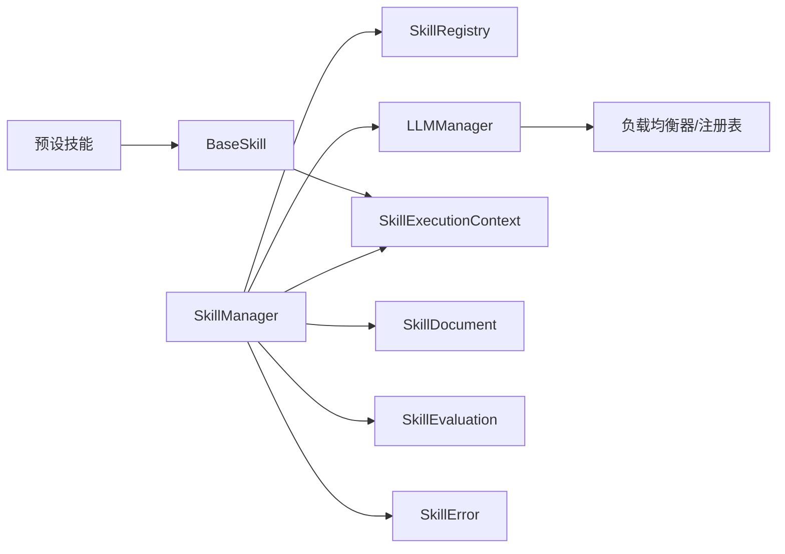
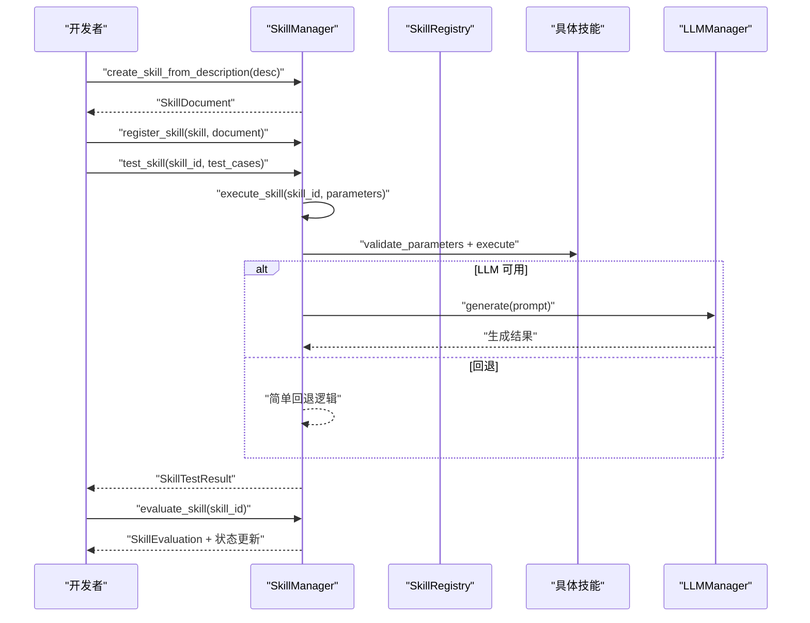

# 技能管理器

<cite>
**本文引用的文件**
- [src/taolib/testing/multi_agent/skills/__init__.py](file://src/taolib/testing/multi_agent/skills/__init__.py)
- [src/taolib/testing/multi_agent/skills/manager.py](file://src/taolib/testing/multi_agent/skills/manager.py)
- [src/taolib/testing/multi_agent/skills/registry.py](file://src/taolib/testing/multi_agent/skills/registry.py)
- [src/taolib/testing/multi_agent/skills/preset.py](file://src/taolib/testing/multi_agent/skills/preset.py)
- [src/taolib/testing/multi_agent/skills/protocols.py](file://src/taolib/testing/multi_agent/skills/protocols.py)
- [src/taolib/testing/multi_agent/models/skill.py](file://src/taolib/testing/multi_agent/models/skill.py)
- [src/taolib/testing/multi_agent/models/enums.py](file://src/taolib/testing/multi_agent/models/enums.py)
- [src/taolib/testing/multi_agent/llm/manager.py](file://src/taolib/testing/multi_agent/llm/manager.py)
- [src/taolib/testing/multi_agent/errors.py](file://src/taolib/testing/multi_agent/errors.py)
- [tests/testing/test_multi_agent/test_skills.py](file://tests/testing/test_multi_agent/test_skills.py)
</cite>

## 目录
1. [引言](#引言)
2. [项目结构](#项目结构)
3. [核心组件](#核心组件)
4. [架构总览](#架构总览)
5. [详细组件分析](#详细组件分析)
6. [依赖关系分析](#依赖关系分析)
7. [性能考量](#性能考量)
8. [故障排查指南](#故障排查指南)
9. [结论](#结论)
10. [附录](#附录)

## 引言
本文件面向“技能管理器”的技术文档，围绕 SkillManager 类的架构设计与核心功能实现进行系统化阐述，覆盖技能注册、执行、测试与评估的完整流程；同时深入解析技能执行上下文的创建与管理机制（参数校验、LLM 提供商集成、代理关联），并说明技能生命周期管理（状态跟踪、执行历史记录、错误处理）。此外，文档还解释了技能发现算法（关键词任务匹配与推荐机制）、技能创建与测试用例执行、性能评估的实现细节，并给出全局管理器模式的使用方法与最佳实践。

## 项目结构
技能管理相关代码位于多智能体系统的子模块中，采用“协议-注册表-管理器-预设技能”分层组织，配合模型与 LLM 管理器协同工作。关键文件如下：
- 协议与上下文：protocols.py
- 注册表：registry.py
- 管理器：manager.py
- 预设技能：preset.py
- 模型与枚举：models/skill.py、models/enums.py
- LLM 管理器：llm/manager.py
- 错误类型：errors.py
- 测试：tests/testing/test_multi_agent/test_skills.py

**图示来源**
- [src/taolib/testing/multi_agent/skills/protocols.py:12-143](file://src/taolib/testing/multi_agent/skills/protocols.py#L12-L143)
- [src/taolib/testing/multi_agent/skills/registry.py:16-247](file://src/taolib/testing/multi_agent/skills/registry.py#L16-L247)
- [src/taolib/testing/multi_agent/skills/manager.py:29-404](file://src/taolib/testing/multi_agent/skills/manager.py#L29-L404)
- [src/taolib/testing/multi_agent/skills/preset.py:12-217](file://src/taolib/testing/multi_agent/skills/preset.py#L12-L217)
- [src/taolib/testing/multi_agent/models/skill.py:15-142](file://src/taolib/testing/multi_agent/models/skill.py#L15-L142)
- [src/taolib/testing/multi_agent/models/enums.py:41-96](file://src/taolib/testing/multi_agent/models/enums.py#L41-L96)
- [src/taolib/testing/multi_agent/llm/manager.py:22-229](file://src/taolib/testing/multi_agent/llm/manager.py#L22-L229)
- [src/taolib/testing/multi_agent/errors.py:73-107](file://src/taolib/testing/multi_agent/errors.py#L73-L107)

**章节来源**
- [src/taolib/testing/multi_agent/skills/__init__.py:1-49](file://src/taolib/testing/multi_agent/skills/__init__.py#L1-L49)

## 核心组件
- 协议与上下文：定义 Skill、BaseSkill、SkillExecutionContext 等核心抽象，提供参数校验与执行上下文承载能力。
- 注册表：集中管理技能实例与类，支持动态加载与检索。
- 管理器：统一编排技能注册、执行、测试、评估、发现与文档管理，内置全局管理器。
- 预设技能：提供常用技能模板（文本摘要、代码生成、翻译、数据分析）。
- 模型与枚举：定义技能数据模型（含文档、响应、评估等）与状态枚举。
- LLM 管理器：统一接入不同 LLM 提供商，提供负载均衡与健康检查。
- 错误类型：封装技能相关异常，便于统一处理与追踪。

**章节来源**
- [src/taolib/testing/multi_agent/skills/protocols.py:12-143](file://src/taolib/testing/multi_agent/skills/protocols.py#L12-L143)
- [src/taolib/testing/multi_agent/skills/registry.py:16-247](file://src/taolib/testing/multi_agent/skills/registry.py#L16-L247)
- [src/taolib/testing/multi_agent/skills/manager.py:29-404](file://src/taolib/testing/multi_agent/skills/manager.py#L29-L404)
- [src/taolib/testing/multi_agent/skills/preset.py:12-217](file://src/taolib/testing/multi_agent/skills/preset.py#L12-L217)
- [src/taolib/testing/multi_agent/models/skill.py:15-142](file://src/taolib/testing/multi_agent/models/skill.py#L15-L142)
- [src/taolib/testing/multi_agent/models/enums.py:41-96](file://src/taolib/testing/multi_agent/models/enums.py#L41-L96)
- [src/taolib/testing/multi_agent/llm/manager.py:22-229](file://src/taolib/testing/multi_agent/llm/manager.py#L22-L229)
- [src/taolib/testing/multi_agent/errors.py:73-107](file://src/taolib/testing/multi_agent/errors.py#L73-L107)

## 架构总览
SkillManager 作为核心编排者，依赖 SkillRegistry 管理技能注册与检索，依赖 LLMManager 提供 LLM 能力，结合 SkillExecutionContext 承载执行上下文（参数、LLM 提供商、代理），并通过 SkillDocument/SkillEvaluation 等模型实现技能生命周期管理与评估闭环。

**图示来源**
- [src/taolib/testing/multi_agent/skills/protocols.py:12-143](file://src/taolib/testing/multi_agent/skills/protocols.py#L12-L143)
- [src/taolib/testing/multi_agent/skills/registry.py:16-247](file://src/taolib/testing/multi_agent/skills/registry.py#L16-L247)
- [src/taolib/testing/multi_agent/skills/manager.py:29-404](file://src/taolib/testing/multi_agent/skills/manager.py#L29-L404)
- [src/taolib/testing/multi_agent/llm/manager.py:22-229](file://src/taolib/testing/multi_agent/llm/manager.py#L22-L229)

## 详细组件分析

### SkillExecutionContext 执行上下文
- 作用：承载技能执行所需参数、LLM 提供商与代理对象，并提供可扩展的状态存储。
- 关键字段：parameters、llm_provider、agent、state。
- 用途：在技能执行过程中传递上下文，便于 LLM 生成与代理协作。

**章节来源**
- [src/taolib/testing/multi_agent/skills/protocols.py:12-32](file://src/taolib/testing/multi_agent/skills/protocols.py#L12-L32)

### 协议与基类（Skill/BaseSkill）
- Skill 抽象协议：定义 id/name/description/parameters/execute/validate_parameters 等。
- BaseSkill 基类：提供参数定义与默认参数校验逻辑（按类型检查）。
- 参数校验规则：必填项缺失、类型不匹配时返回错误列表。

**章节来源**
- [src/taolib/testing/multi_agent/skills/protocols.py:34-143](file://src/taolib/testing/multi_agent/skills/protocols.py#L34-L143)

### 注册表（SkillRegistry）
- 职责：维护技能实例与类映射，支持注册、检索、创建、注销、从文件/目录加载技能。
- 动态加载：通过 importlib 从文件导入模块，自动识别继承自 Skill 的类并注册。
- 并发与健壮性：提供 clear 清空能力，异常时抛出 SkillError。

**章节来源**
- [src/taolib/testing/multi_agent/skills/registry.py:16-247](file://src/taolib/testing/multi_agent/skills/registry.py#L16-L247)

### 管理器（SkillManager）
- 技能注册：将技能注册到注册表，并生成/保存技能文档。
- 技能执行：参数校验、创建执行上下文、调用技能 execute、记录执行历史（成功/失败、耗时、错误）。
- 测试与评估：批量测试用例、计算成功率、生成评估结果与状态迁移（DRAFT/TESTING/APPROVED）。
- 技能发现：基于任务描述的关键词匹配，返回推荐技能 ID 列表。
- 技能创建：从描述创建技能文档（占位实现，后续可接入 LLM 生成代码）。
- 全局管理器：提供 get/set 全局技能管理器，便于跨模块共享。

**图示来源**
- [src/taolib/testing/multi_agent/skills/manager.py:110-175](file://src/taolib/testing/multi_agent/skills/manager.py#L110-L175)
- [src/taolib/testing/multi_agent/skills/protocols.py:73-98](file://src/taolib/testing/multi_agent/skills/protocols.py#L73-L98)
- [src/taolib/testing/multi_agent/llm/manager.py:57-107](file://src/taolib/testing/multi_agent/llm/manager.py#L57-L107)

**章节来源**
- [src/taolib/testing/multi_agent/skills/manager.py:29-404](file://src/taolib/testing/multi_agent/skills/manager.py#L29-L404)

### 预设技能（TextSummarizationSkill/CodeGenerationSkill/TranslationSkill/DataAnalysisSkill）
- 文本摘要：支持最大长度截断与 LLM 生成摘要。
- 代码生成：根据需求与语言生成代码，无 LLM 时提供回退提示。
- 翻译：支持源语言与目标语言，无 LLM 时提示。
- 数据分析：支持多种分析类型，无 LLM 时提示。
- 回退策略：当 llm_provider 为空时，提供简单回退逻辑，保证基本可用性。

**章节来源**
- [src/taolib/testing/multi_agent/skills/preset.py:12-217](file://src/taolib/testing/multi_agent/skills/preset.py#L12-L217)

### 技能发现算法
- 输入：任务描述字符串、已有技能 ID 列表。
- 策略：将任务描述与技能名称/描述拆分为关键词集合，计算交集大小，大于 0 即推荐。
- 输出：推荐技能 ID 列表（去重、排除已有技能）。

**图示来源**
- [src/taolib/testing/multi_agent/skills/manager.py:286-323](file://src/taolib/testing/multi_agent/skills/manager.py#L286-L323)

**章节来源**
- [src/taolib/testing/multi_agent/skills/manager.py:286-323](file://src/taolib/testing/multi_agent/skills/manager.py#L286-L323)

### 全局管理器模式
- 全局变量：_global_manager/_global_registry/_default_manager。
- 访问器：get_skill_manager()/get_skill_registry()/get_llm_manager()。
- 设置器：set_skill_manager()/set_skill_registry()/set_llm_manager()。
- 使用建议：在应用启动时注入自定义实例，运行时通过 get_* 获取；单元测试中可通过 set_* 注入 mock 实例。

**章节来源**
- [src/taolib/testing/multi_agent/skills/manager.py:380-404](file://src/taolib/testing/multi_agent/skills/manager.py#L380-L404)
- [src/taolib/testing/multi_agent/skills/registry.py:223-247](file://src/taolib/testing/multi_agent/skills/registry.py#L223-L247)
- [src/taolib/testing/multi_agent/llm/manager.py:205-229](file://src/taolib/testing/multi_agent/llm/manager.py#L205-L229)

## 依赖关系分析
- SkillManager 依赖 SkillRegistry（技能注册与检索）、LLMManager（LLM 能力）、SkillExecutionContext（执行上下文）、SkillDocument/SkillEvaluation（生命周期与评估）、SkillError（错误处理）。
- 预设技能依赖 BaseSkill 与 SkillExecutionContext，可直接由 SkillManager 注册使用。
- LLMManager 依赖模型注册表与负载均衡器，对外提供统一生成接口。

**图示来源**
- [src/taolib/testing/multi_agent/skills/manager.py:29-47](file://src/taolib/testing/multi_agent/skills/manager.py#L29-L47)
- [src/taolib/testing/multi_agent/skills/registry.py:16-247](file://src/taolib/testing/multi_agent/skills/registry.py#L16-L247)
- [src/taolib/testing/multi_agent/llm/manager.py:22-229](file://src/taolib/testing/multi_agent/llm/manager.py#L22-L229)

**章节来源**
- [src/taolib/testing/multi_agent/skills/manager.py:29-47](file://src/taolib/testing/multi_agent/skills/manager.py#L29-L47)
- [src/taolib/testing/multi_agent/skills/registry.py:16-247](file://src/taolib/testing/multi_agent/skills/registry.py#L16-L247)
- [src/taolib/testing/multi_agent/llm/manager.py:22-229](file://src/taolib/testing/multi_agent/llm/manager.py#L22-L229)

## 性能考量
- 执行历史记录：每次执行都会追加历史条目，建议在高并发场景限制历史数量或定期清理。
- 参数校验：在执行前进行参数校验，避免无效请求进入技能执行阶段。
- LLM 调用：通过 LLMManager 的负载均衡与健康检查降低失败率；对长文本/复杂任务建议使用流式生成接口。
- 技能发现：关键词匹配为 O(N*M)（N 技能数，M 关键词数），建议对任务描述与技能描述做缓存与索引优化。
- 预设技能回退：在无 LLM 时提供简单回退逻辑，减少失败开销。

[本节为通用指导，无需特定文件引用]

## 故障排查指南
- 技能未找到：检查 SkillManager.register_skill 是否正确注册，或 SkillRegistry 是否加载成功。
- 参数校验失败：核对 Skill.parameters 中的 required/type/default，确保传入参数类型与必填项齐全。
- 执行失败：查看执行历史记录中的 error 字段，结合 SkillError 与 LLMError 定位问题。
- LLM 不可用：使用 LLMManager.health_check 检查可用实例，确认负载均衡配置与提供商状态。
- 全局管理器未初始化：确保在使用前通过 set_* 注入实例，或首次访问 get_* 时自动创建。

**章节来源**
- [src/taolib/testing/multi_agent/skills/manager.py:130-170](file://src/taolib/testing/multi_agent/skills/manager.py#L130-L170)
- [src/taolib/testing/multi_agent/llm/manager.py:159-176](file://src/taolib/testing/multi_agent/llm/manager.py#L159-L176)
- [src/taolib/testing/multi_agent/errors.py:73-107](file://src/taolib/testing/multi_agent/errors.py#L73-L107)

## 结论
SkillManager 通过清晰的协议与分层架构，实现了技能的全生命周期管理：从注册、执行、测试到评估与发现。其与 LLM 管理器的集成提供了强大的生成能力，同时保留了回退策略以保障稳定性。全局管理器模式简化了跨模块使用，测试用例覆盖了关键行为，便于持续演进与质量保障。

[本节为总结性内容，无需特定文件引用]

## 附录

### 技能创建、测试与评估流程
- 创建技能文档：通过 create_skill_from_description 生成文档（占位实现，后续可接入 LLM 生成代码）。
- 注册技能：register_skill 将技能与文档入库。
- 执行技能：execute_skill 完成参数校验、上下文创建、调用执行与历史记录。
- 测试技能：test_skill 支持多用例对比，返回通过数、失败数与成功率。
- 评估技能：evaluate_skill 基于测试结果计算分数并更新状态（DRAFT/TESTING/APPROVED）。

**图示来源**
- [src/taolib/testing/multi_agent/skills/manager.py:325-356](file://src/taolib/testing/multi_agent/skills/manager.py#L325-L356)
- [src/taolib/testing/multi_agent/skills/manager.py:176-233](file://src/taolib/testing/multi_agent/skills/manager.py#L176-L233)
- [src/taolib/testing/multi_agent/skills/manager.py:235-284](file://src/taolib/testing/multi_agent/skills/manager.py#L235-L284)

**章节来源**
- [src/taolib/testing/multi_agent/skills/manager.py:325-356](file://src/taolib/testing/multi_agent/skills/manager.py#L325-L356)
- [src/taolib/testing/multi_agent/skills/manager.py:176-233](file://src/taolib/testing/multi_agent/skills/manager.py#L176-L233)
- [src/taolib/testing/multi_agent/skills/manager.py:235-284](file://src/taolib/testing/multi_agent/skills/manager.py#L235-L284)

### 测试用例执行与验证
- 单元测试覆盖：协议与基类初始化、参数校验、执行流程、注册表操作、全局管理器、预设技能回退。
- 断言要点：技能参数类型与必填项校验、执行返回值、历史记录结构、全局实例一致性。

**章节来源**
- [tests/testing/test_multi_agent/test_skills.py:56-273](file://tests/testing/test_multi_agent/test_skills.py#L56-L273)