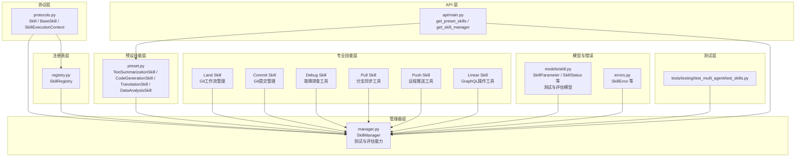
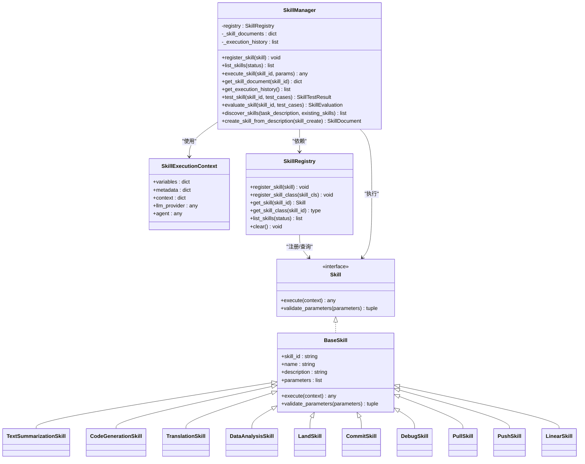
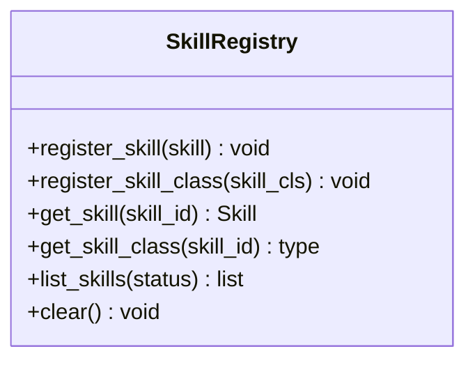
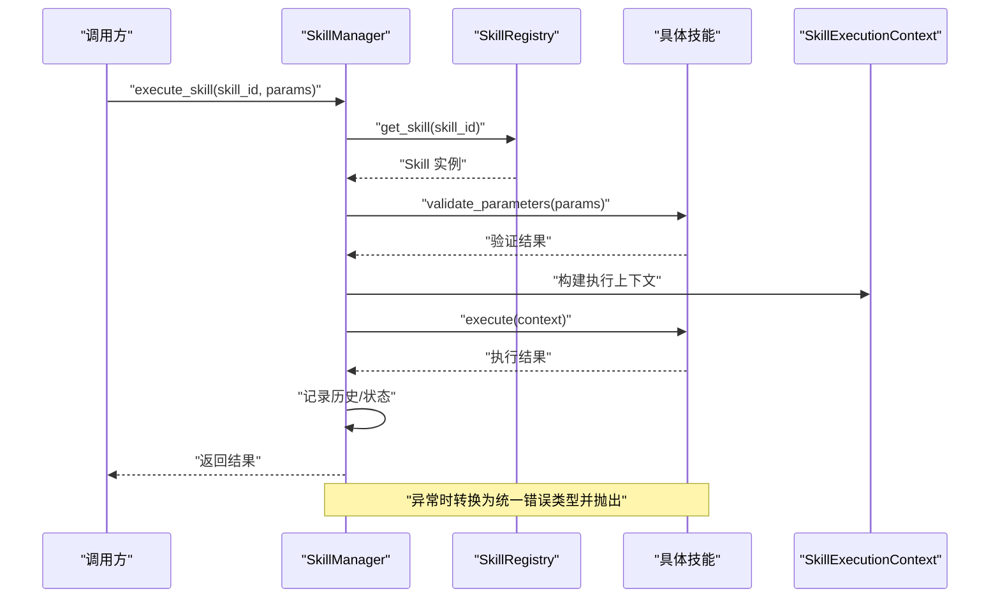
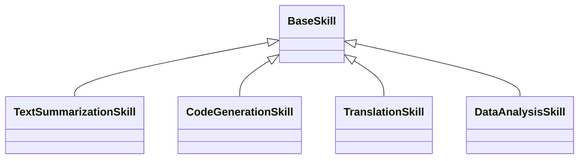
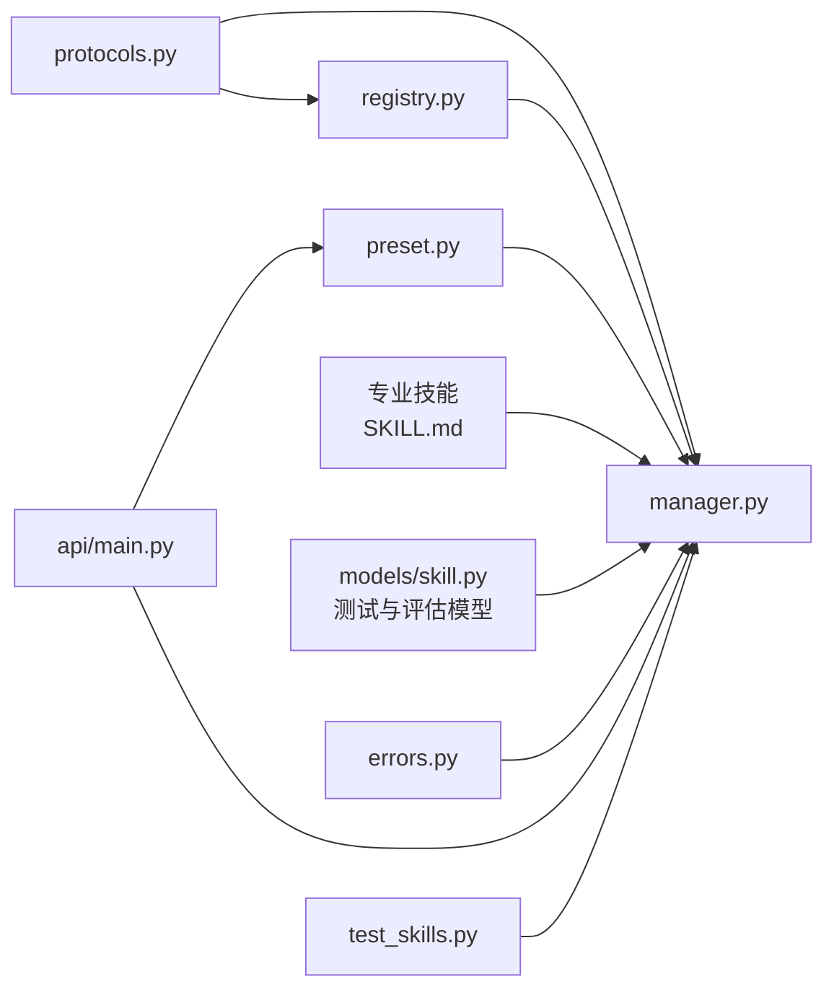

# 技能系统

<cite>
**本文引用的文件**
- [src/taolib/testing/multi_agent/skills/__init__.py](file://src/taolib/testing/multi_agent/skills/__init__.py)
- [src/taolib/testing/multi_agent/skills/protocols.py](file://src/taolib/testing/multi_agent/skills/protocols.py)
- [src/taolib/testing/multi_agent/skills/registry.py](file://src/taolib/testing/multi_agent/skills/registry.py)
- [src/taolib/testing/multi_agent/skills/manager.py](file://src/taolib/testing/multi_agent/skills/manager.py)
- [src/taolib/testing/multi_agent/skills/preset.py](file://src/taolib/testing/multi_agent/skills/preset.py)
- [src/taolib/testing/multi_agent/models/skill.py](file://src/taolib/testing/multi_agent/models/skill.py)
- [src/taolib/testing/multi_agent/errors.py](file://src/taolib/testing/multi_agent/errors.py)
- [tests/testing/test_multi_agent/test_skills.py](file://tests/testing/test_multi_agent/test_skills.py)
- [src/taolib/testing/multi_agent/api/main.py](file://src/taolib/testing/multi_agent/api/main.py)
- [.agents/skills/land/SKILL.md](file://.agents/skills/land/SKILL.md)
- [.agents/skills/commit/SKILL.md](file://.agents/skills/commit/SKILL.md)
- [.agents/skills/debug/SKILL.md](file://.agents/skills/debug/SKILL.md)
- [.agents/skills/pull/SKILL.md](file://.agents/skills/pull/SKILL.md)
- [.agents/skills/push/SKILL.md](file://.agents/skills/push/SKILL.md)
- [.agents/skills/linear/SKILL.md](file://.agents/skills/linear/SKILL.md)
</cite>

## 更新摘要
**所做更改**
- 新增6个专业技能实现：Land、Commit、Debug、Pull、Push、Linear
- 引入标准化的技能验证框架和文档规范
- 扩展技能管理器的评估和测试能力
- 增强技能组合、链式调用和错误传播机制

## 目录
1. [引言](#引言)
2. [项目结构](#项目结构)
3. [核心组件](#核心组件)
4. [架构总览](#架构总览)
5. [详细组件分析](#详细组件分析)
6. [依赖关系分析](#依赖关系分析)
7. [性能考量](#性能考量)
8. [故障排查指南](#故障排查指南)
9. [结论](#结论)
10. [附录](#附录)

## 引言
本文件面向"技能系统"的技术文档，聚焦于技能管理器的架构与实现，涵盖技能注册、执行上下文管理、状态跟踪、技能注册表设计（发现、加载、依赖管理）、预设技能集合（文本摘要、代码生成、翻译、数据分析）以及技能执行协议与自定义技能开发接口。同时提供技能评估、测试结果与性能监控的实现思路，并解释技能组合、链式调用与错误传播机制。

**更新** 本次更新显著增强了技能系统，新增6个专业技能实现（Land、Commit、Debug、Pull、Push、Linear），引入标准化的技能验证框架和文档规范，扩展了技能管理器的评估和测试能力。

## 项目结构
技能系统位于多智能体测试模块中，采用分层与功能域划分相结合的方式组织：
- 协议层：定义技能与执行上下文的统一接口
- 注册表层：负责技能类与实例的注册、查询与依赖管理
- 管理器层：协调注册表、执行上下文、状态跟踪与历史记录
- 预设技能层：内置常见任务的技能实现
- 专业技能层：新增6个专业技能（Land、Commit、Debug、Pull、Push、Linear）
- 模型与错误层：技能模型与异常类型
- 测试层：覆盖协议、注册表、管理器与预设技能的行为验证
- API 层：对外暴露获取预设技能与技能管理器的能力

**图表来源**
- [src/taolib/testing/multi_agent/skills/protocols.py](file://src/taolib/testing/multi_agent/skills/protocols.py)
- [src/taolib/testing/multi_agent/skills/registry.py](file://src/taolib/testing/multi_agent/skills/registry.py)
- [src/taolib/testing/multi_agent/skills/manager.py](file://src/taolib/testing/multi_agent/skills/manager.py)
- [src/taolib/testing/multi_agent/skills/preset.py](file://src/taolib/testing/multi_agent/skills/preset.py)
- [src/taolib/testing/multi_agent/models/skill.py](file://src/taolib/testing/multi_agent/models/skill.py)
- [src/taolib/testing/multi_agent/errors.py](file://src/taolib/testing/multi_agent/errors.py)
- [tests/testing/test_multi_agent/test_skills.py](file://tests/testing/test_multi_agent/test_skills.py)
- [src/taolib/testing/multi_agent/api/main.py](file://src/taolib/testing/multi_agent/api/main.py)

**章节来源**
- [src/taolib/testing/multi_agent/skills/__init__.py](file://src/taolib/testing/multi_agent/skills/__init__.py)
- [src/taolib/testing/multi_agent/skills/protocols.py](file://src/taolib/testing/multi_agent/skills/protocols.py)
- [src/taolib/testing/multi_agent/skills/registry.py](file://src/taolib/testing/multi_agent/skills/registry.py)
- [src/taolib/testing/multi_agent/skills/manager.py](file://src/taolib/testing/multi_agent/skills/manager.py)
- [src/taolib/testing/multi_agent/skills/preset.py](file://src/taolib/testing/multi_agent/skills/preset.py)
- [src/taolib/testing/multi_agent/models/skill.py](file://src/taolib/testing/multi_agent/models/skill.py)
- [src/taolib/testing/multi_agent/errors.py](file://src/taolib/testing/multi_agent/errors.py)
- [tests/testing/test_multi_agent/test_skills.py](file://tests/testing/test_multi_agent/test_skills.py)
- [src/taolib/testing/multi_agent/api/main.py](file://src/taolib/testing/multi_agent/api/main.py)

## 核心组件
- 技能协议与执行上下文：定义技能的统一接口与执行所需的上下文信息，确保不同技能实现的一致性与可扩展性。
- 技能注册表：提供技能类与实例的注册、查询、依赖管理与全局访问能力。
- 技能管理器：负责技能注册、执行调度、状态更新、历史记录与错误传播；支持预设技能与自定义技能的统一管理，新增测试与评估能力。
- 预设技能集合：内置文本摘要、代码生成、翻译、数据分析等常用技能，便于快速集成与使用。
- 专业技能集合：新增6个专业技能实现，涵盖Git工作流管理、故障排查、Linear GraphQL操作等专业领域。
- 模型与错误：定义技能参数、状态等数据模型，以及技能执行过程中的异常类型，新增测试结果和评估模型。
- 测试与 API：通过测试用例验证协议与管理器行为，通过 API 提供获取预设技能与技能管理器的入口。

**章节来源**
- [src/taolib/testing/multi_agent/skills/protocols.py](file://src/taolib/testing/multi_agent/skills/protocols.py)
- [src/taolib/testing/multi_agent/skills/registry.py](file://src/taolib/testing/multi_agent/skills/registry.py)
- [src/taolib/testing/multi_agent/skills/manager.py](file://src/taolib/testing/multi_agent/skills/manager.py)
- [src/taolib/testing/multi_agent/skills/preset.py](file://src/taolib/testing/multi_agent/skills/preset.py)
- [src/taolib/testing/multi_agent/models/skill.py](file://src/taolib/testing/multi_agent/models/skill.py)
- [src/taolib/testing/multi_agent/errors.py](file://src/taolib/testing/multi_agent/errors.py)
- [tests/testing/test_multi_agent/test_skills.py](file://tests/testing/test_multi_agent/test_skills.py)
- [src/taolib/testing/multi_agent/api/main.py](file://src/taolib/testing/multi_agent/api/main.py)

## 架构总览
技能系统采用"协议-注册表-管理器-预设技能-专业技能"分层架构，通过统一协议抽象技能行为，借助注册表进行技能生命周期管理，由管理器编排执行流程与状态跟踪，并以预设技能和专业技能提升开箱即用体验。API 层提供便捷入口，测试层保障行为正确性。

**更新** 新增的专业技能通过标准化文档规范（SKILL.md）进行管理，每个技能都包含详细的使用说明、步骤指导和最佳实践。

**图表来源**
- [src/taolib/testing/multi_agent/skills/protocols.py](file://src/taolib/testing/multi_agent/skills/protocols.py)
- [src/taolib/testing/multi_agent/skills/registry.py](file://src/taolib/testing/multi_agent/skills/registry.py)
- [src/taolib/testing/multi_agent/skills/manager.py](file://src/taolib/testing/multi_agent/skills/manager.py)
- [src/taolib/testing/multi_agent/skills/preset.py](file://src/taolib/testing/multi_agent/skills/preset.py)

## 详细组件分析

### 协议与执行上下文
- 技能协议：定义技能的统一接口，确保所有技能具备一致的执行签名，便于管理器统一调度。
- 执行上下文：封装变量、元数据与通用上下文，作为技能执行的输入载体，支持跨技能传递与共享。
- 参数验证：新增参数验证方法，确保技能执行前的参数完整性。
- 设计要点：通过协议约束实现与管理器解耦，便于扩展新技能类型与执行策略。

**章节来源**
- [src/taolib/testing/multi_agent/skills/protocols.py](file://src/taolib/testing/multi_agent/skills/protocols.py)

### 技能注册表
- 职责：维护技能类与实例的注册、查询、列表与清理；支持按状态过滤与依赖管理。
- 关键方法：注册技能类与实例、按 ID 获取技能或类、列出指定状态的技能、清空注册表。
- 依赖管理：通过注册类与实例，支持后续在管理器中按需实例化与执行。

**图表来源**
- [src/taolib/testing/multi_agent/skills/registry.py](file://src/taolib/testing/multi_agent/skills/registry.py)

**章节来源**
- [src/taolib/testing/multi_agent/skills/registry.py](file://src/taolib/testing/multi_agent/skills/registry.py)

### 技能管理器
- 职责：统一管理技能注册、执行、状态跟踪与历史记录；提供全局访问与上下文注入能力。
- 核心能力：
  - 注册与查询：注册技能实例与类，按 ID 查询技能与文档。
  - 执行调度：校验参数、构建执行上下文、调用技能执行并处理返回值。
  - 状态与历史：维护技能文档与执行历史，支持状态筛选与回溯。
  - 错误传播：捕获技能执行异常并转换为统一错误类型，向上抛出。
  - 测试与评估：新增技能测试、评估和发现能力，支持自动化质量保证。
  - 全局访问：提供获取与设置全局技能管理器的方法，便于应用内共享。

**更新** 新增的测试与评估能力包括：
- `test_skill()`: 执行技能测试，支持多个测试用例和详细结果报告
- `evaluate_skill()`: 对技能进行全面评估，计算分数并更新状态
- `discover_skills()`: 基于任务描述自动发现推荐技能
- `create_skill_from_description()`: 从描述创建新技能文档

**图表来源**
- [src/taolib/testing/multi_agent/skills/manager.py](file://src/taolib/testing/multi_agent/skills/manager.py)
- [src/taolib/testing/multi_agent/skills/registry.py](file://src/taolib/testing/multi_agent/skills/registry.py)
- [src/taolib/testing/multi_agent/skills/protocols.py](file://src/taolib/testing/multi_agent/skills/protocols.py)
- [src/taolib/testing/multi_agent/errors.py](file://src/taolib/testing/multi_agent/errors.py)

**章节来源**
- [src/taolib/testing/multi_agent/skills/manager.py](file://src/taolib/testing/multi_agent/skills/manager.py)
- [src/taolib/testing/multi_agent/errors.py](file://src/taolib/testing/multi_agent/errors.py)

### 预设技能集合
- 文本摘要：对输入文本进行摘要生成，适合信息提炼场景。
- 代码生成：根据自然语言描述生成目标代码片段，辅助自动化编码。
- 翻译：支持多语言之间的文本翻译，满足国际化需求。
- 数据分析：对结构化数据进行统计分析与洞察提取，辅助决策。
- 获取方式：通过统一工厂函数批量获取预设技能集合，便于快速集成。

**图表来源**
- [src/taolib/testing/multi_agent/skills/preset.py](file://src/taolib/testing/multi_agent/skills/preset.py)
- [src/taolib/testing/multi_agent/skills/protocols.py](file://src/taolib/testing/multi_agent/skills/protocols.py)

**章节来源**
- [src/taolib/testing/multi_agent/skills/preset.py](file://src/taolib/testing/multi_agent/skills/preset.py)

### 专业技能集合
**更新** 新增6个专业技能实现，每个技能都遵循标准化的文档规范：

#### Land 技能
- Git工作流管理：自动化PR合并流程，处理冲突、CI检查和squash-merge。
- 核心功能：检查PR状态、处理冲突、监控CI检查、执行合并操作。
- 使用场景：当需要自动化完成PR到合并的整个流程时使用。

#### Commit 技能
- Git提交管理：从会话历史生成规范化的git提交。
- 核心功能：分析会话历史、生成提交消息、遵循git约定格式。
- 使用场景：需要创建符合规范的git提交时使用。

#### Debug 技能
- 故障排查工具：通过日志关联和请求标识根因分析。
- 核心功能：测试失败诊断、服务错误排查、分布式追踪。
- 使用场景：测试失败、服务崩溃或运行时问题排查时使用。

#### Pull 技能
- 分支同步工具：将origin/main合并到当前分支并解决冲突。
- 核心功能：安全合并、冲突解决最佳实践、保持工作区整洁。
- 使用场景：需要同步主分支更新或解决合并冲突时使用。

#### Push 技能
- 远程推送工具：将本地分支推送到origin并创建/更新PR。
- 核心功能：安全推送、PR创建/更新、保持分支历史整洁。
- 使用场景：发布更新或创建PR时使用。

#### Linear 技能
- GraphQL操作工具：使用Symphony的linear_graphql客户端进行原始Linear GraphQL操作。
- 核心功能：执行GraphQL查询/变更、管理Linear问题和评论、上传流程。
- 使用场景：需要直接操作Linear API或进行复杂GraphQL操作时使用。

**章节来源**
- [.agents/skills/land/SKILL.md](file://.agents/skills/land/SKILL.md)
- [.agents/skills/commit/SKILL.md](file://.agents/skills/commit/SKILL.md)
- [.agents/skills/debug/SKILL.md](file://.agents/skills/debug/SKILL.md)
- [.agents/skills/pull/SKILL.md](file://.agents/skills/pull/SKILL.md)
- [.agents/skills/push/SKILL.md](file://.agents/skills/push/SKILL.md)
- [.agents/skills/linear/SKILL.md](file://.agents/skills/linear/SKILL.md)

### 技能执行协议与自定义技能开发接口
- 自定义技能开发步骤：
  - 继承基础技能类，定义唯一标识、名称、描述与参数规范。
  - 实现执行逻辑，接收执行上下文并返回结果。
  - 可选择注册到全局注册表或直接交由管理器管理。
- 参数验证：新增参数验证机制，确保技能执行前的参数完整性。
- 参数与状态：使用统一的参数模型与状态枚举，确保与管理器的交互一致性。
- 上下文注入：通过执行上下文传递变量与元数据，支持跨技能协作。

**章节来源**
- [src/taolib/testing/multi_agent/skills/protocols.py](file://src/taolib/testing/multi_agent/skills/protocols.py)
- [src/taolib/testing/multi_agent/models/skill.py](file://src/taolib/testing/multi_agent/models/skill.py)

### 技能评估、测试结果与性能监控
**更新** 新增完整的技能验证框架：

- 测试框架：
  - `test_skill()`: 执行技能测试，支持多个测试用例和详细结果报告
  - 支持预期结果比较、异常捕获和详细测试详情
- 评估系统：
  - `evaluate_skill()`: 对技能进行全面评估，计算准确率、效率、可靠性等指标
  - 自动生成评估报告和改进建议
  - 根据评估结果自动更新技能状态（APPROVED/TESTING/DRAFT）
- 性能监控建议：
  - 记录每次执行的耗时、入参大小与返回结果大小，形成指标基线
  - 对高耗时技能引入超时控制与重试策略
  - 在管理器中增加执行统计与告警阈值配置
- 测试参考：测试用例验证了技能执行成功、失败与参数不合法等典型场景。

**章节来源**
- [src/taolib/testing/multi_agent/skills/manager.py](file://src/taolib/testing/multi_agent/skills/manager.py)
- [src/taolib/testing/multi_agent/models/skill.py](file://src/taolib/testing/multi_agent/models/skill.py)

### 技能组合、链式调用与错误传播
- 组合与链式调用：通过管理器的执行流程，可在一次调用中串联多个技能，前一个技能的输出可作为后一个技能的输入，实现复杂工作流。
- 错误传播：技能执行异常统一捕获并转换为系统内统一错误类型，便于上层统一处理与恢复。
- 发现与推荐：新增技能发现功能，基于任务描述自动推荐合适的技能组合。

**章节来源**
- [src/taolib/testing/multi_agent/skills/manager.py](file://src/taolib/testing/multi_agent/skills/manager.py)
- [src/taolib/testing/multi_agent/errors.py](file://src/taolib/testing/multi_agent/errors.py)

## 依赖关系分析
技能系统内部依赖清晰，遵循"协议驱动、注册表承载、管理器编排"的原则。API 层通过统一导出接口，将预设技能与管理器暴露给外部使用。新增的专业技能通过标准化文档规范进行管理。

**更新** 专业技能通过SKILL.md文档进行标准化管理，每个技能都包含：
- 技能名称和描述
- 目标和前置条件
- 详细步骤指导
- 命令示例
- 失败处理和最佳实践

**图表来源**
- [src/taolib/testing/multi_agent/skills/protocols.py](file://src/taolib/testing/multi_agent/skills/protocols.py)
- [src/taolib/testing/multi_agent/skills/registry.py](file://src/taolib/testing/multi_agent/skills/registry.py)
- [src/taolib/testing/multi_agent/skills/manager.py](file://src/taolib/testing/multi_agent/skills/manager.py)
- [src/taolib/testing/multi_agent/skills/preset.py](file://src/taolib/testing/multi_agent/skills/preset.py)
- [src/taolib/testing/multi_agent/models/skill.py](file://src/taolib/testing/multi_agent/models/skill.py)
- [src/taolib/testing/multi_agent/errors.py](file://src/taolib/testing/multi_agent/errors.py)
- [src/taolib/testing/multi_agent/api/main.py](file://src/taolib/testing/multi_agent/api/main.py)
- [tests/testing/test_multi_agent/test_skills.py](file://tests/testing/test_multi_agent/test_skills.py)

**章节来源**
- [src/taolib/testing/multi_agent/skills/__init__.py](file://src/taolib/testing/multi_agent/skills/__init__.py)
- [src/taolib/testing/multi_agent/api/main.py](file://src/taolib/testing/multi_agent/api/main.py)

## 性能考量
- 执行开销控制：对高耗时技能引入超时与重试策略，避免阻塞整体执行流。
- 缓存与复用：对重复输入的技能结果进行缓存，减少重复计算。
- 并发与限流：在管理器层面增加并发度与速率限制配置，防止资源争用。
- 指标采集：记录执行耗时、成功率与错误分布，支撑持续优化。
- 评估驱动优化：通过技能评估结果识别性能瓶颈，指导优化方向。

**更新** 新增的评估框架提供了更精细的性能监控能力，包括：
- 执行时间统计
- 成功率分析
- 错误模式识别
- 性能趋势跟踪

## 故障排查指南
- 常见问题
  - 技能未找到：确认技能是否已注册或注册类是否正确。
  - 参数校验失败：核对参数类型、必填项与默认值。
  - 执行异常：查看统一错误类型与堆栈信息，定位具体技能实现。
  - 专业技能失败：检查相关工具（git、gh CLI、Linear API）是否正确配置。
- 排查步骤
  - 检查注册表状态与技能清单。
  - 查看执行历史与最近一次错误日志。
  - 复现最小化用例，逐步缩小问题范围。
  - 使用调试技能进行根因分析。
  - 利用评估结果识别系统性问题。

**更新** 新增专业技能的故障排查：
- Git相关问题：检查git配置、gh CLI认证状态
- Linear API问题：验证认证配置和GraphQL查询语法
- 日志关联：使用调试技能的请求ID进行跨服务日志关联

**章节来源**
- [src/taolib/testing/multi_agent/errors.py](file://src/taolib/testing/multi_agent/errors.py)
- [src/taolib/testing/multi_agent/skills/manager.py](file://src/taolib/testing/multi_agent/skills/manager.py)

## 结论
该技能系统通过协议抽象、注册表管理与管理器编排，实现了技能的标准化、可扩展与可追踪。预设技能和新增的专业技能集合提升了即用性和专业领域覆盖，而统一的执行协议、错误处理机制和新增的测试评估框架保证了系统的稳定性与可观测性。结合测试与性能监控实践，可进一步完善技能系统的工程化落地。

**更新** 本次更新显著增强了技能系统的专业能力和工程化水平，新增的专业技能涵盖了现代软件开发的关键工作流，标准化的验证框架确保了技能质量，为构建更复杂的AI代理系统奠定了坚实基础。

## 附录
- API 入口
  - 获取预设技能集合：通过 API 提供的工厂函数一次性获取多种内置技能。
  - 获取全局技能管理器：通过全局访问方法获取管理器实例，便于集中管理与调度。
  - 专业技能文档：每个专业技能都有详细的SKILL.md文档，包含使用说明和最佳实践。
- 技能开发指南
  - 遵循标准化文档规范创建新技能
  - 使用测试框架验证技能质量
  - 利用评估系统持续改进技能表现

**章节来源**
- [src/taolib/testing/multi_agent/api/main.py](file://src/taolib/testing/multi_agent/api/main.py)
- [.agents/skills/land/SKILL.md](file://.agents/skills/land/SKILL.md)
- [.agents/skills/commit/SKILL.md](file://.agents/skills/commit/SKILL.md)
- [.agents/skills/debug/SKILL.md](file://.agents/skills/debug/SKILL.md)
- [.agents/skills/pull/SKILL.md](file://.agents/skills/pull/SKILL.md)
- [.agents/skills/push/SKILL.md](file://.agents/skills/push/SKILL.md)
- [.agents/skills/linear/SKILL.md](file://.agents/skills/linear/SKILL.md)