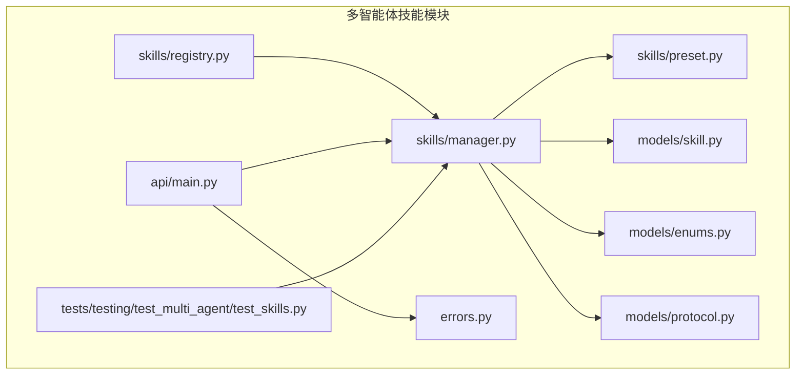
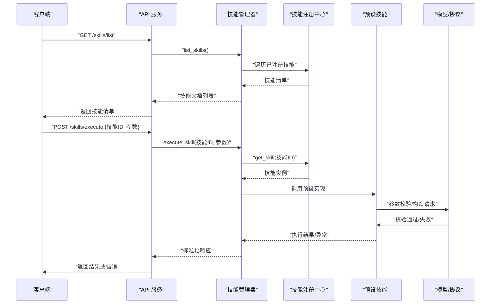
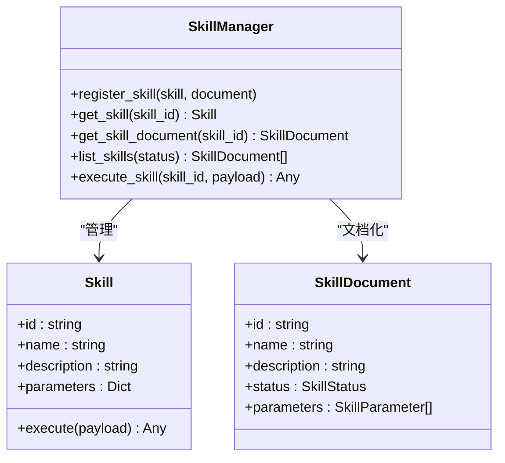
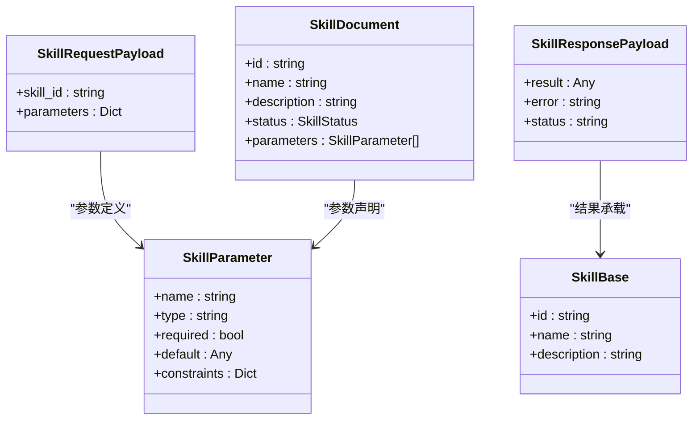
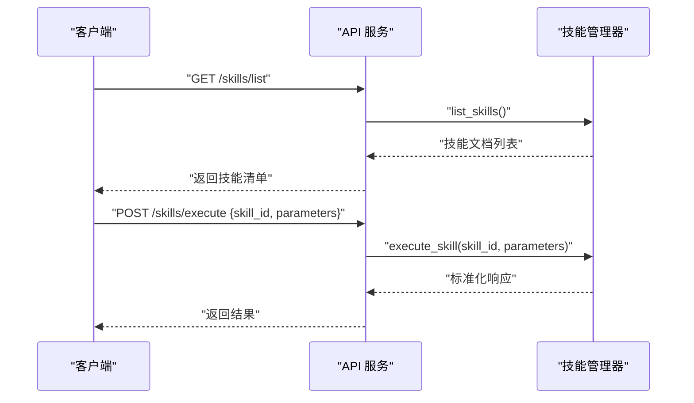
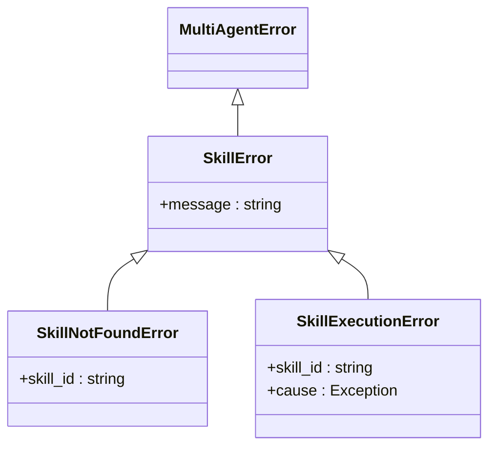
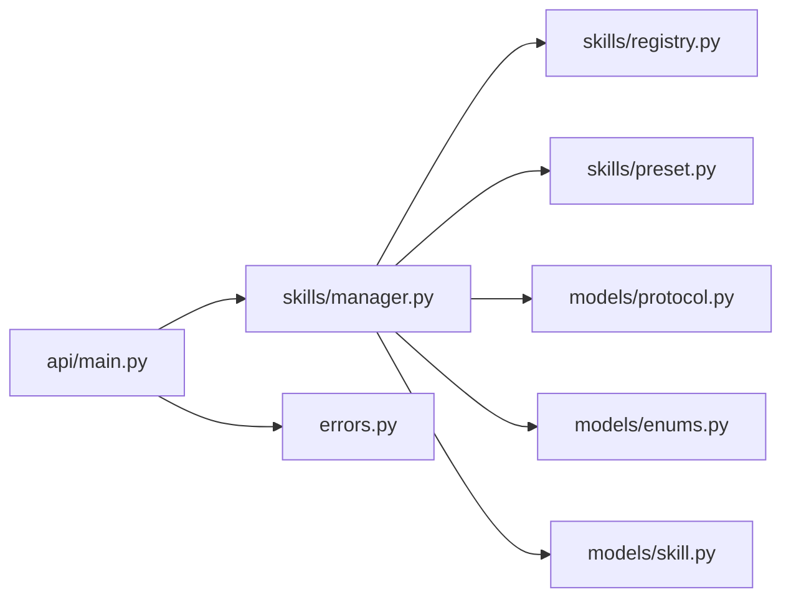
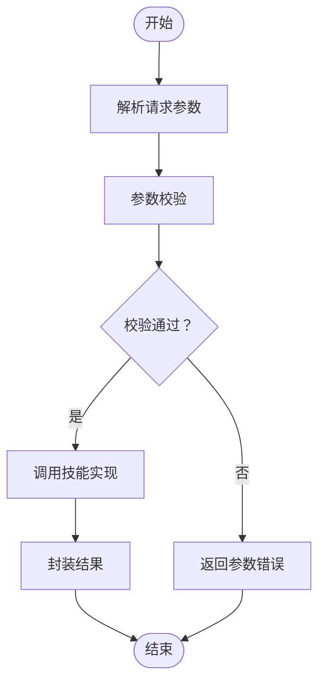

# 预设技能

<cite>
**本文引用的文件**
- [README.md](file://README.md)
- [multi_agent_example.py](file://examples/multi_agent_example.py)
- [manager.py](file://src/taolib/testing/multi_agent/skills/manager.py)
- [preset.py](file://src/taolib/testing/multi_agent/skills/preset.py)
- [registry.py](file://src/taolib/testing/multi_agent/skills/registry.py)
- [protocol.py](file://src/taolib/testing/multi_agent/models/protocol.py)
- [enums.py](file://src/taolib/testing/multi_agent/models/enums.py)
- [skill.py](file://src/taolib/testing/multi_agent/models/skill.py)
- [main.py](file://src/taolib/testing/multi_agent/api/main.py)
- [errors.py](file://src/taolib/testing/multi_agent/errors.py)
- [test_skills.py](file://tests/testing/test_multi_agent/test_skills.py)
</cite>

## 目录
1. [简介](#简介)
2. [项目结构](#项目结构)
3. [核心组件](#核心组件)
4. [架构总览](#架构总览)
5. [详细组件分析](#详细组件分析)
6. [依赖关系分析](#依赖关系分析)
7. [性能考虑](#性能考虑)
8. [故障排查指南](#故障排查指南)
9. [结论](#结论)
10. [附录](#附录)

## 简介
本文件面向“预设技能集合”的技术文档，聚焦于内置技能的实现原理、使用场景与扩展方法。根据仓库现有代码，预设技能主要位于多智能体模块中，围绕技能注册、管理、执行与文档化进行设计。本文将系统阐述以下内容：
- 技能生命周期：注册、发现、执行、文档化与错误处理
- 输入输出协议与参数校验
- 结果处理与错误恢复机制
- 性能优化策略与资源管理
- 最佳实践与常见应用场景
- 扩展接口与自定义预设技能开发指南

## 项目结构
与“预设技能”直接相关的代码集中在多智能体模块的 skills 子包，并配套有模型定义、API 接口与测试用例。

图表来源
- [manager.py:28-130](file://src/taolib/testing/multi_agent/skills/manager.py#L28-L130)
- [preset.py](file://src/taolib/testing/multi_agent/skills/preset.py)
- [registry.py](file://src/taolib/testing/multi_agent/skills/registry.py)
- [protocol.py:76-120](file://src/taolib/testing/multi_agent/models/protocol.py#L76-L120)
- [enums.py:40-60](file://src/taolib/testing/multi_agent/models/enums.py#L40-L60)
- [skill.py:39-120](file://src/taolib/testing/multi_agent/models/skill.py#L39-L120)
- [main.py:61-130](file://src/taolib/testing/multi_agent/api/main.py#L61-L130)
- [errors.py:72-90](file://src/taolib/testing/multi_agent/errors.py#L72-L90)
- [test_skills.py](file://tests/testing/test_multi_agent/test_skills.py)

章节来源
- [README.md:1-100](file://README.md#L1-L100)

## 核心组件
- 技能注册中心：负责技能的注册、查询与分发
- 技能管理器：统一管理技能生命周期，执行技能并返回标准化结果
- 预设技能：内置技能集合，提供常见任务能力（如文本摘要、代码生成、翻译、数据分析等）
- 协议与模型：定义技能请求/响应、参数、状态与枚举
- API 层：对外暴露列出技能、执行技能等接口
- 错误体系：对技能执行过程中的异常进行分类与处理

章节来源
- [manager.py:28-130](file://src/taolib/testing/multi_agent/skills/manager.py#L28-L130)
- [preset.py](file://src/taolib/testing/multi_agent/skills/preset.py)
- [protocol.py:76-120](file://src/taolib/testing/multi_agent/models/protocol.py#L76-L120)
- [enums.py:40-60](file://src/taolib/testing/multi_agent/models/enums.py#L40-L60)
- [skill.py:39-120](file://src/taolib/testing/multi_agent/models/skill.py#L39-L120)
- [main.py:61-130](file://src/taolib/testing/multi_agent/api/main.py#L61-L130)
- [errors.py:72-90](file://src/taolib/testing/multi_agent/errors.py#L72-L90)

## 架构总览
下图展示了从 API 到技能执行的整体流程，以及各组件之间的交互关系。

图表来源
- [main.py:61-130](file://src/taolib/testing/multi_agent/api/main.py#L61-L130)
- [manager.py:28-130](file://src/taolib/testing/multi_agent/skills/manager.py#L28-L130)
- [registry.py](file://src/taolib/testing/multi_agent/skills/registry.py)
- [preset.py](file://src/taolib/testing/multi_agent/skills/preset.py)
- [protocol.py:76-120](file://src/taolib/testing/multi_agent/models/protocol.py#L76-L120)
- [enums.py:40-60](file://src/taolib/testing/multi_agent/models/enums.py#L40-L60)
- [skill.py:39-120](file://src/taolib/testing/multi_agent/models/skill.py#L39-L120)

## 详细组件分析

### 技能管理器（SkillManager）
职责与行为
- 注册技能：将技能实例与可选的技能文档绑定
- 获取技能：按 ID 查询技能
- 获取技能文档：按 ID 查询技能元数据
- 列出技能：支持按状态过滤
- 执行技能：接收请求参数，调用具体技能实现，返回标准化响应

关键接口与流程
- 注册与查询：通过注册中心维护技能映射
- 执行流程：参数校验 → 调用预设实现 → 结果封装 → 异常捕获与转换

图表来源
- [manager.py:28-130](file://src/taolib/testing/multi_agent/skills/manager.py#L28-L130)
- [skill.py:39-120](file://src/taolib/testing/multi_agent/models/skill.py#L39-L120)
- [enums.py:40-60](file://src/taolib/testing/multi_agent/models/enums.py#L40-L60)

章节来源
- [manager.py:28-130](file://src/taolib/testing/multi_agent/skills/manager.py#L28-L130)

### 预设技能（Preset Skills）
职责与行为
- 提供内置技能的具体实现，覆盖常见任务场景（如文本摘要、代码生成、翻译、数据分析等）
- 对输入参数进行校验与转换，确保与底层实现兼容
- 将执行结果标准化为统一的数据结构，便于上层消费

实现要点
- 参数验证：基于模型定义进行字段校验
- 结果处理：将原始结果封装为标准响应对象
- 错误恢复：捕获执行异常并转换为技能错误类型

章节来源
- [preset.py](file://src/taolib/testing/multi_agent/skills/preset.py)

### 技能注册中心（Registry）
职责与行为
- 维护技能 ID 到技能实例的映射
- 提供技能的注册、查询与遍历能力

章节来源
- [registry.py](file://src/taolib/testing/multi_agent/skills/registry.py)

### 协议与模型（Protocol & Models）
职责与行为
- SkillRequestPayload/SkillResponsePayload：定义技能请求与响应的结构
- SkillParameter：描述技能参数的名称、类型、是否必填、默认值与约束
- SkillBase/SkillCreate/SkillUpdate/SkillResponse/SkillDocument：描述技能实体与文档化结构
- SkillType/SkillStatus：枚举技能类型与状态

图表来源
- [protocol.py:76-120](file://src/taolib/testing/multi_agent/models/protocol.py#L76-L120)
- [skill.py:39-120](file://src/taolib/testing/multi_agent/models/skill.py#L39-L120)
- [enums.py:40-60](file://src/taolib/testing/multi_agent/models/enums.py#L40-L60)

章节来源
- [protocol.py:76-120](file://src/taolib/testing/multi_agent/models/protocol.py#L76-L120)
- [skill.py:39-120](file://src/taolib/testing/multi_agent/models/skill.py#L39-L120)
- [enums.py:40-60](file://src/taolib/testing/multi_agent/models/enums.py#L40-L60)

### API 层（对外接口）
职责与行为
- 列出技能：返回技能文档列表
- 执行技能：接收技能 ID 与参数，调用管理器执行并返回结果

图表来源
- [main.py:61-130](file://src/taolib/testing/multi_agent/api/main.py#L61-L130)
- [manager.py:28-130](file://src/taolib/testing/multi_agent/skills/manager.py#L28-L130)

章节来源
- [main.py:61-130](file://src/taolib/testing/multi_agent/api/main.py#L61-L130)

### 错误处理（Errors）
职责与行为
- SkillError：技能通用错误基类
- SkillNotFoundError：技能不存在
- SkillExecutionError：技能执行失败

图表来源
- [errors.py:72-90](file://src/taolib/testing/multi_agent/errors.py#L72-L90)

章节来源
- [errors.py:72-90](file://src/taolib/testing/multi_agent/errors.py#L72-L90)

### 示例与测试（Examples & Tests）
- 示例：多智能体示例脚本演示了基本技能使用方式
- 测试：针对技能模块的单元测试，覆盖注册、执行、文档化与错误处理

章节来源
- [multi_agent_example.py:35-200](file://examples/multi_agent_example.py#L35-L200)
- [test_skills.py](file://tests/testing/test_multi_agent/test_skills.py)

## 依赖关系分析
- 管理器依赖注册中心进行技能发现与调用
- API 层依赖管理器完成业务编排
- 模型与协议为技能执行提供结构化输入输出
- 错误体系贯穿执行链路，保证异常可追踪与可恢复

图表来源
- [main.py:61-130](file://src/taolib/testing/multi_agent/api/main.py#L61-L130)
- [manager.py:28-130](file://src/taolib/testing/multi_agent/skills/manager.py#L28-L130)
- [registry.py](file://src/taolib/testing/multi_agent/skills/registry.py)
- [preset.py](file://src/taolib/testing/multi_agent/skills/preset.py)
- [protocol.py:76-120](file://src/taolib/testing/multi_agent/models/protocol.py#L76-L120)
- [enums.py:40-60](file://src/taolib/testing/multi_agent/models/enums.py#L40-L60)
- [skill.py:39-120](file://src/taolib/testing/multi_agent/models/skill.py#L39-L120)
- [errors.py:72-90](file://src/taolib/testing/multi_agent/errors.py#L72-L90)

## 性能考虑
- 参数校验前置：在进入具体技能实现前完成参数校验，避免无效调用带来的资源浪费
- 结果缓存与去重：对重复输入的结果进行缓存，减少重复计算
- 并发执行：在管理器层面支持并发执行多个技能，提升吞吐量
- 资源池化：对底层 LLM 或外部服务采用连接池与限流策略，防止过载
- 分页与超时：对外接口支持分页与超时控制，保障稳定性
- 日志与指标：在关键路径埋点，采集执行耗时、成功率与错误分布

## 故障排查指南
- 技能不存在：检查技能 ID 是否正确，确认是否已注册
- 参数不合法：核对参数类型、必填项与约束条件
- 执行失败：查看技能内部异常栈，定位具体实现问题
- 超时或资源不足：调整并发度与超时阈值，检查外部依赖可用性

章节来源
- [errors.py:72-90](file://src/taolib/testing/multi_agent/errors.py#L72-L90)

## 结论
预设技能集合通过“注册中心 + 管理器 + 预设实现 + 协议模型 + API 层 + 错误体系”的架构，提供了可扩展、可文档化、可监控的技能执行框架。内置技能覆盖文本摘要、代码生成、翻译与数据分析等高频场景；通过参数校验、结果封装与错误恢复机制，确保系统稳定可靠。建议在生产环境中结合缓存、并发与限流策略，持续优化性能与可用性。

## 附录

### 功能特性与使用场景
- 文本摘要：适用于长文档提炼、会议纪要生成
- 代码生成：适用于模板生成、函数补全与重构建议
- 翻译：适用于多语言文档与实时翻译
- 数据分析：适用于统计摘要、趋势分析与可视化建议

### 输入输出与配置选项
- 输入：技能 ID + 参数字典（遵循 SkillParameter 定义）
- 输出：标准化响应对象（包含结果、状态与错误信息）
- 配置：可通过技能文档查看参数说明与默认值

章节来源
- [protocol.py:76-120](file://src/taolib/testing/multi_agent/models/protocol.py#L76-L120)
- [skill.py:39-120](file://src/taolib/testing/multi_agent/models/skill.py#L39-L120)

### 参数验证流程

图表来源
- [protocol.py:76-120](file://src/taolib/testing/multi_agent/models/protocol.py#L76-L120)
- [manager.py:28-130](file://src/taolib/testing/multi_agent/skills/manager.py#L28-L130)

### 错误恢复机制
- 抛出技能错误：将底层异常包装为技能错误类型
- 返回标准化错误：包含错误码、消息与上下文
- 记录日志：在关键节点记录执行轨迹，便于回溯

章节来源
- [errors.py:72-90](file://src/taolib/testing/multi_agent/errors.py#L72-L90)

### 扩展接口与自定义预设技能开发指南
- 新增技能步骤
  1) 定义技能参数模型（参考 SkillParameter）
  2) 实现技能执行逻辑（返回标准化结果）
  3) 注册技能到注册中心
  4) 编写技能文档（SkillDocument）
  5) 编写单元测试与集成测试
- 最佳实践
  - 明确输入输出契约，保持向后兼容
  - 对外部依赖进行超时与重试控制
  - 使用缓存降低重复计算成本
  - 为每个技能编写清晰的文档与示例

章节来源
- [manager.py:28-130](file://src/taolib/testing/multi_agent/skills/manager.py#L28-L130)
- [preset.py](file://src/taolib/testing/multi_agent/skills/preset.py)
- [test_skills.py](file://tests/testing/test_multi_agent/test_skills.py)