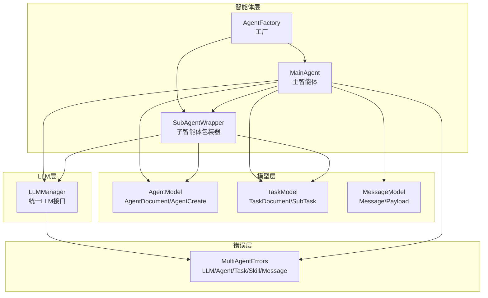
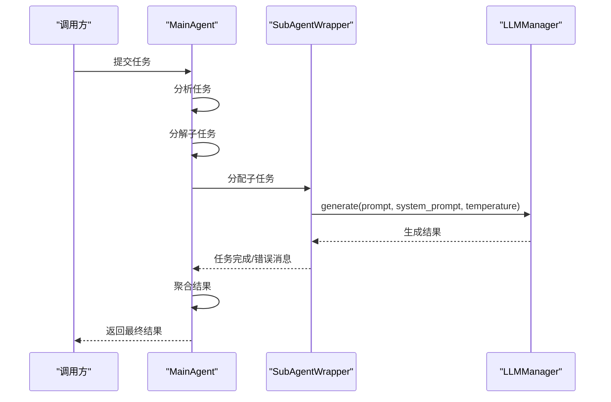
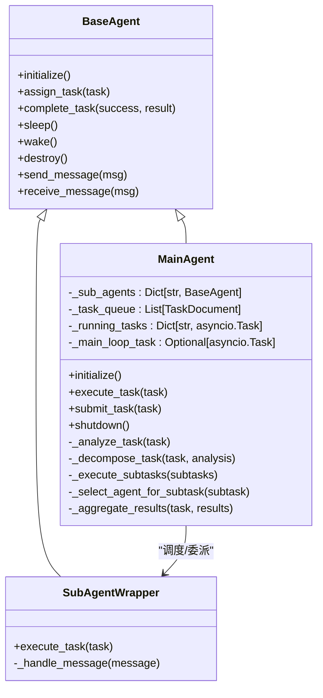
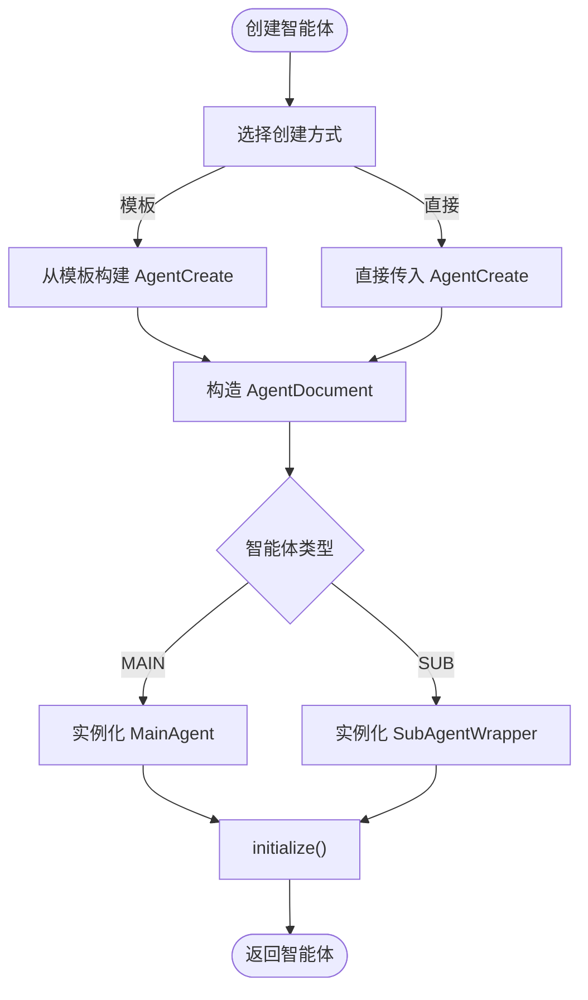
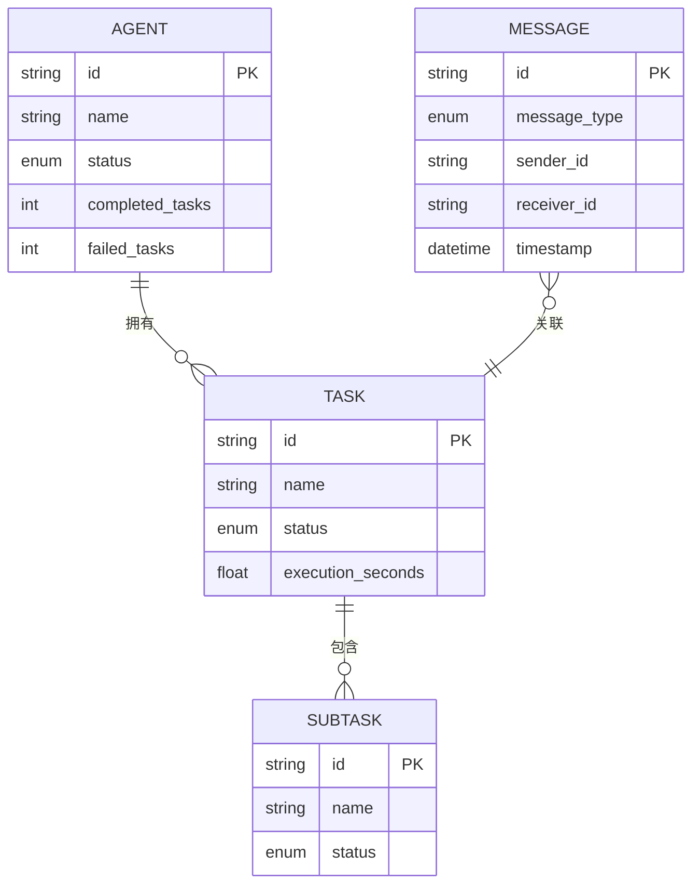
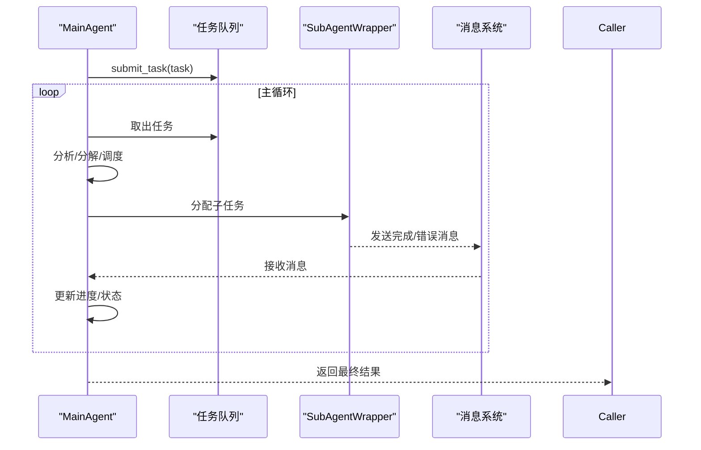
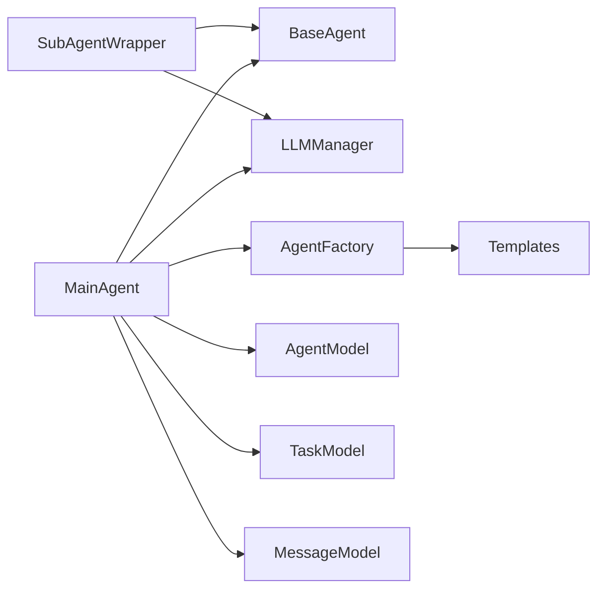

# 主智能体

<cite>
**本文引用的文件**
- [main_agent.py](file://src/taolib/testing/multi_agent/agents/main_agent.py)
- [base.py](file://src/taolib/testing/multi_agent/agents/base.py)
- [factory.py](file://src/taolib/testing/multi_agent/agents/factory.py)
- [templates.py](file://src/taolib/testing/multi_agent/agents/templates.py)
- [manager.py](file://src/taolib/testing/multi_agent/llm/manager.py)
- [agent.py](file://src/taolib/testing/multi_agent/models/agent.py)
- [task.py](file://src/taolib/testing/multi_agent/models/task.py)
- [message.py](file://src/taolib/testing/multi_agent/models/message.py)
- [errors.py](file://src/taolib/testing/multi_agent/errors.py)
- [multi_agent_example.py](file://examples/multi_agent_example.py)
</cite>

## 目录
1. [简介](#简介)
2. [项目结构](#项目结构)
3. [核心组件](#核心组件)
4. [架构总览](#架构总览)
5. [详细组件分析](#详细组件分析)
6. [依赖分析](#依赖分析)
7. [性能考虑](#性能考虑)
8. [故障排查指南](#故障排查指南)
9. [结论](#结论)
10. [附录](#附录)

## 简介
本文件面向“主智能体”（MainAgent）的技术文档，聚焦其在多智能体系统中的协调者角色与实现细节。主智能体负责任务分析、任务分解、子智能体调度、结果聚合与异常处理，并通过统一的 LLM 管理器进行推理与生成。本文将从架构设计、数据模型、任务调度机制、智能体间通信、负载均衡与资源管理等方面进行系统化阐述，并提供配置与使用最佳实践。

## 项目结构
围绕主智能体的关键模块分布如下：
- agents 层：主智能体与子智能体包装器、工厂、模板
- models 层：智能体、任务、消息等数据模型
- llm 层：LLM 管理器与负载均衡
- 错误体系：统一的异常类型
- 示例：多智能体使用示例脚本

**图示来源**
- [main_agent.py:104-472](file://src/taolib/testing/multi_agent/agents/main_agent.py#L104-L472)
- [base.py:21-204](file://src/taolib/testing/multi_agent/agents/base.py#L21-L204)
- [factory.py:27-220](file://src/taolib/testing/multi_agent/agents/factory.py#L27-L220)
- [templates.py:1-309](file://src/taolib/testing/multi_agent/agents/templates.py#L1-L309)
- [manager.py:22-229](file://src/taolib/testing/multi_agent/llm/manager.py#L22-L229)
- [agent.py:15-129](file://src/taolib/testing/multi_agent/models/agent.py#L15-L129)
- [task.py:15-143](file://src/taolib/testing/multi_agent/models/task.py#L15-L143)
- [message.py:14-36](file://src/taolib/testing/multi_agent/models/message.py#L14-L36)
- [errors.py:7-107](file://src/taolib/testing/multi_agent/errors.py#L7-L107)

**章节来源**
- [main_agent.py:1-472](file://src/taolib/testing/multi_agent/agents/main_agent.py#L1-L472)
- [factory.py:1-220](file://src/taolib/testing/multi_agent/agents/factory.py#L1-L220)
- [templates.py:1-309](file://src/taolib/testing/multi_agent/agents/templates.py#L1-L309)
- [manager.py:1-229](file://src/taolib/testing/multi_agent/llm/manager.py#L1-L229)
- [agent.py:1-129](file://src/taolib/testing/multi_agent/models/agent.py#L1-L129)
- [task.py:1-143](file://src/taolib/testing/multi_agent/models/task.py#L1-L143)
- [message.py:1-36](file://src/taolib/testing/multi_agent/models/message.py#L1-L36)
- [errors.py:1-107](file://src/taolib/testing/multi_agent/errors.py#L1-L107)

## 核心组件
- 主智能体 MainAgent：负责任务生命周期管理、任务分析与分解、子任务调度与结果聚合、异常处理与状态同步。
- 子智能体包装器 SubAgentWrapper：封装子智能体执行逻辑，对接 LLM 管理器进行推理与生成。
- 智能体工厂 AgentFactory：按模板或直接创建智能体，支持主智能体与子智能体实例化。
- LLM 管理器 LLMManager：统一接入不同模型提供商，提供负载均衡、健康检查与流式/非流式生成。
- 数据模型：AgentDocument、TaskDocument、SubTask、Message 等，支撑状态、进度、结果与通信。
- 错误体系：集中定义 LLM、Agent、Task、Skill、Message 等异常类型，便于统一处理与上报。

**章节来源**
- [main_agent.py:104-472](file://src/taolib/testing/multi_agent/agents/main_agent.py#L104-L472)
- [base.py:21-204](file://src/taolib/testing/multi_agent/agents/base.py#L21-L204)
- [factory.py:27-220](file://src/taolib/testing/multi_agent/agents/factory.py#L27-L220)
- [manager.py:22-229](file://src/taolib/testing/multi_agent/llm/manager.py#L22-L229)
- [agent.py:15-129](file://src/taolib/testing/multi_agent/models/agent.py#L15-L129)
- [task.py:15-143](file://src/taolib/testing/multi_agent/models/task.py#L15-L143)
- [message.py:14-36](file://src/taolib/testing/multi_agent/models/message.py#L14-L36)
- [errors.py:7-107](file://src/taolib/testing/multi_agent/errors.py#L7-L107)

## 架构总览
主智能体采用“事件驱动 + 异步循环”的架构：
- 初始化阶段：创建默认子智能体模板实例，启动主循环。
- 任务流程：接收任务 → 分析任务 → 分解子任务 → 选择子智能体 → 执行子任务 → 聚合结果 → 完成任务。
- 通信机制：通过消息模型进行任务完成/错误通知；内部通过任务队列与异步任务跟踪完成情况。
- 资源管理：基于 LLM 管理器的负载均衡与健康检查，保障模型可用性与稳定性。

**图示来源**
- [main_agent.py:211-282](file://src/taolib/testing/multi_agent/agents/main_agent.py#L211-L282)
- [main_agent.py:355-405](file://src/taolib/testing/multi_agent/agents/main_agent.py#L355-L405)
- [main_agent.py:48-102](file://src/taolib/testing/multi_agent/agents/main_agent.py#L48-L102)
- [manager.py:57-107](file://src/taolib/testing/multi_agent/llm/manager.py#L57-L107)

**章节来源**
- [main_agent.py:162-172](file://src/taolib/testing/multi_agent/agents/main_agent.py#L162-L172)
- [main_agent.py:211-282](file://src/taolib/testing/multi_agent/agents/main_agent.py#L211-L282)
- [main_agent.py:355-405](file://src/taolib/testing/multi_agent/agents/main_agent.py#L355-L405)
- [manager.py:22-229](file://src/taolib/testing/multi_agent/llm/manager.py#L22-L229)

## 详细组件分析

### 主智能体 MainAgent
- 角色与职责
  - 任务生命周期管理：接收、分析、分解、调度、执行、聚合与完成。
  - 子智能体编排：选择空闲子智能体、分配子任务、收集结果。
  - 异常处理：捕获子任务执行异常，更新任务状态与结果，抛出统一错误类型。
  - 状态同步：维护任务进度、执行耗时、完成时间等。
- 关键方法
  - initialize：初始化默认子智能体并启动主循环。
  - execute_task：完整的任务执行流程，含分析、分解、调度、执行与聚合。
  - _select_agent_for_subtask：简单轮询策略选择空闲子智能体。
  - _aggregate_results：聚合子任务结果为最终结果。
  - submit_task：将任务加入队列等待处理。
  - shutdown：停止主循环并销毁子智能体与自身。
- 数据与状态
  - 内部维护子智能体映射、任务队列、运行中任务集合与主循环任务对象。
  - 使用 AgentDocument、TaskDocument、SubTask、TaskResult 等模型承载状态与结果。

**图示来源**
- [base.py:21-204](file://src/taolib/testing/multi_agent/agents/base.py#L21-L204)
- [main_agent.py:104-472](file://src/taolib/testing/multi_agent/agents/main_agent.py#L104-L472)

**章节来源**
- [main_agent.py:104-472](file://src/taolib/testing/multi_agent/agents/main_agent.py#L104-L472)
- [base.py:21-204](file://src/taolib/testing/multi_agent/agents/base.py#L21-L204)

### 子智能体包装器 SubAgentWrapper
- 角色与职责
  - 作为子智能体的代理，封装具体执行逻辑。
  - 通过 LLM 管理器进行推理与生成，处理模型不可用与执行异常。
  - 完成任务后调用父类 complete_task，触发状态更新与消息通知。
- 关键点
  - 使用智能体配置中的 system_prompt、temperature 等参数。
  - 捕获 ModelUnavailableError 并回退为失败状态。
  - 仅处理内部消息，不对外部消息做处理。

**章节来源**
- [main_agent.py:35-102](file://src/taolib/testing/multi_agent/agents/main_agent.py#L35-L102)

### 智能体工厂 AgentFactory 与模板
- 工厂职责
  - 支持按模板创建智能体（含主智能体与子智能体包装器）。
  - 维护模板注册表，提供模板查询与批量获取。
- 模板体系
  - 提供代码助手、写作助手、数据分析、研究助手、通用助手等模板。
  - 模板包含能力、配置（如最大并发、超时、system_prompt、temperature）、技能与标签等。
- 主智能体创建
  - create_main_agent：基于通用助手模板或兜底配置创建主智能体。

**图示来源**
- [factory.py:74-193](file://src/taolib/testing/multi_agent/agents/factory.py#L74-L193)
- [templates.py:264-309](file://src/taolib/testing/multi_agent/agents/templates.py#L264-L309)

**章节来源**
- [factory.py:27-220](file://src/taolib/testing/multi_agent/agents/factory.py#L27-L220)
- [templates.py:1-309](file://src/taolib/testing/multi_agent/agents/templates.py#L1-L309)

### LLM 管理器与负载均衡
- 统一接口
  - generate/generate_stream：提供非流式与流式两种生成接口。
  - health_check：对指定实例或全部实例进行健康检查。
  - get_available_models/get_all_models：查询可用模型与统计信息。
- 负载均衡
  - 基于权重/成功率等策略选择模型实例，记录成功/失败事件，动态调整。
- 错误处理
  - ModelUnavailableError：模型不可用。
  - LLMError：生成过程异常。

**章节来源**
- [manager.py:22-229](file://src/taolib/testing/multi_agent/llm/manager.py#L22-L229)
- [errors.py:13-107](file://src/taolib/testing/multi_agent/errors.py#L13-L107)

### 数据模型与通信
- 智能体模型
  - AgentDocument/AgentCreate/AgentResponse/AgentBase：描述智能体的生命周期、状态、配置、能力与元数据。
- 任务模型
  - TaskDocument/SubTask/TaskResult/TaskProgress：描述任务状态、进度、结果、子任务与元数据。
- 消息模型
  - Message/Payload：用于智能体间通信，支持任务完成/错误等消息类型与优先级。

**图示来源**
- [agent.py:95-129](file://src/taolib/testing/multi_agent/models/agent.py#L95-L129)
- [task.py:110-143](file://src/taolib/testing/multi_agent/models/task.py#L110-L143)
- [message.py:24-36](file://src/taolib/testing/multi_agent/models/message.py#L24-L36)

**章节来源**
- [agent.py:15-129](file://src/taolib/testing/multi_agent/models/agent.py#L15-L129)
- [task.py:15-143](file://src/taolib/testing/multi_agent/models/task.py#L15-L143)
- [message.py:14-36](file://src/taolib/testing/multi_agent/models/message.py#L14-L36)

### 任务调度机制与智能体间通信
- 任务调度
  - 主循环周期性处理队列任务与检查完成任务。
  - execute_task 中的分析、分解、调度、执行与聚合构成完整流水线。
- 通信协调
  - 子智能体通过消息模型向主智能体汇报完成/错误。
  - 主智能体在 _handle_message 中接收并记录状态变更。
- 状态同步
  - 任务进度、状态、结果与完成时间由模型与主智能体维护。

**图示来源**
- [main_agent.py:162-195](file://src/taolib/testing/multi_agent/agents/main_agent.py#L162-L195)
- [main_agent.py:196-210](file://src/taolib/testing/multi_agent/agents/main_agent.py#L196-L210)
- [main_agent.py:355-405](file://src/taolib/testing/multi_agent/agents/main_agent.py#L355-L405)

**章节来源**
- [main_agent.py:162-195](file://src/taolib/testing/multi_agent/agents/main_agent.py#L162-L195)
- [main_agent.py:196-210](file://src/taolib/testing/multi_agent/agents/main_agent.py#L196-L210)
- [main_agent.py:355-405](file://src/taolib/testing/multi_agent/agents/main_agent.py#L355-L405)

### 负载均衡策略与资源管理
- 负载均衡
  - LLMManager 基于 LoadBalancer 选择模型实例，记录成功/失败，动态调整。
- 资源管理
  - 子智能体并发与超时由 AgentConfig 控制；主智能体通过任务队列与异步任务跟踪避免阻塞。
- 健康检查
  - LLMManager.health_check 支持单实例与全量检查，确保可用性。

**章节来源**
- [manager.py:159-176](file://src/taolib/testing/multi_agent/llm/manager.py#L159-L176)
- [agent.py:24-32](file://src/taolib/testing/multi_agent/models/agent.py#L24-L32)

### 配置与使用最佳实践
- 性能调优
  - 调整 AgentConfig.max_concurrent_tasks 与 timeout_seconds，平衡吞吐与稳定性。
  - 使用 LLMManager 的负载均衡策略与健康检查，提升可用性。
- 故障恢复
  - 在子智能体执行中捕获 ModelUnavailableError 并回退为失败状态，避免中断主流程。
  - 主循环中对异常进行日志记录与短暂休眠，防止忙等。
- 监控告警
  - 结合 TaskDocument.execution_seconds、progress 与 AgentDocument.completed_tasks/failed_tasks 进行指标采集。
  - 对 LLMManager 的可用实例数与失败率进行阈值告警。

**章节来源**
- [main_agent.py:84-98](file://src/taolib/testing/multi_agent/agents/main_agent.py#L84-L98)
- [main_agent.py:169-171](file://src/taolib/testing/multi_agent/agents/main_agent.py#L169-L171)
- [manager.py:159-176](file://src/taolib/testing/multi_agent/llm/manager.py#L159-L176)
- [agent.py:24-32](file://src/taolib/testing/multi_agent/models/agent.py#L24-L32)

## 依赖分析
- 组件耦合
  - MainAgent 依赖 BaseAgent、LLMManager、AgentFactory/模板、Task/Agent/Message 模型与错误体系。
  - SubAgentWrapper 依赖 LLMManager 与 BaseAgent。
  - AgentFactory 维护模板与智能体类映射，负责实例化与初始化。
- 外部依赖
  - LLM 提供商抽象（通过 LLMManager 与 LoadBalancer），便于替换与扩展。
- 循环依赖
  - 未见直接循环依赖；工厂与模板通过静态注册与查询解耦。

**图示来源**
- [main_agent.py:104-472](file://src/taolib/testing/multi_agent/agents/main_agent.py#L104-L472)
- [base.py:21-204](file://src/taolib/testing/multi_agent/agents/base.py#L21-L204)
- [factory.py:27-220](file://src/taolib/testing/multi_agent/agents/factory.py#L27-L220)
- [templates.py:1-309](file://src/taolib/testing/multi_agent/agents/templates.py#L1-L309)
- [manager.py:22-229](file://src/taolib/testing/multi_agent/llm/manager.py#L22-L229)

**章节来源**
- [main_agent.py:104-472](file://src/taolib/testing/multi_agent/agents/main_agent.py#L104-L472)
- [base.py:21-204](file://src/taolib/testing/multi_agent/agents/base.py#L21-L204)
- [factory.py:27-220](file://src/taolib/testing/multi_agent/agents/factory.py#L27-L220)
- [templates.py:1-309](file://src/taolib/testing/multi_agent/agents/templates.py#L1-L309)
- [manager.py:22-229](file://src/taolib/testing/multi_agent/llm/manager.py#L22-L229)

## 性能考虑
- 异步与非阻塞
  - 主循环使用 asyncio.sleep 控制节奏，避免忙等；运行中任务通过 done() 检查完成状态。
- 资源隔离
  - 子智能体并发上限由 AgentConfig 控制；LLMManager 通过负载均衡避免热点实例过载。
- I/O 与计算分离
  - LLM 推理由外部提供商承担，主智能体专注编排与聚合，降低本地计算压力。
- 监控与可观测性
  - 通过任务执行耗时、进度与错误计数进行性能观测与瓶颈定位。

[本节为通用指导，无需特定文件引用]

## 故障排查指南
- 常见错误类型
  - LLM 相关：ModelUnavailableError、ModelTimeoutError、ModelRateLimitError。
  - 智能体相关：AgentBusyError、AgentNotFoundError。
  - 任务相关：TaskError、TaskNotFoundError、TaskCancelledError。
  - 技能与消息：SkillError、MessageError。
- 排查步骤
  - 检查 LLMManager.health_check 与可用实例数。
  - 查看主循环日志与异常栈，确认是否因模型不可用导致失败。
  - 核对子智能体状态与任务队列长度，避免饥饿或拥塞。
  - 检查 AgentConfig.timeout_seconds 与 max_concurrent_tasks 设置是否合理。

**章节来源**
- [errors.py:7-107](file://src/taolib/testing/multi_agent/errors.py#L7-L107)
- [main_agent.py:169-171](file://src/taolib/testing/multi_agent/agents/main_agent.py#L169-L171)
- [manager.py:159-176](file://src/taolib/testing/multi_agent/llm/manager.py#L159-L176)

## 结论
主智能体通过明确的职责划分与标准化的数据模型，实现了从任务分析到结果聚合的完整编排闭环。借助 LLM 管理器的统一接口与负载均衡，系统具备良好的扩展性与稳定性。结合合理的配置与监控策略，可在复杂场景下实现高吞吐、低延迟与高可用的智能体协作。

[本节为总结性内容，无需特定文件引用]

## 附录
- 使用示例
  - 示例脚本展示了如何创建主智能体、子智能体与 LLM 管理器，并执行基本技能与任务流程。

**章节来源**
- [multi_agent_example.py:120-140](file://examples/multi_agent_example.py#L120-L140)
- [multi_agent_example.py:142-171](file://examples/multi_agent_example.py#L142-L171)