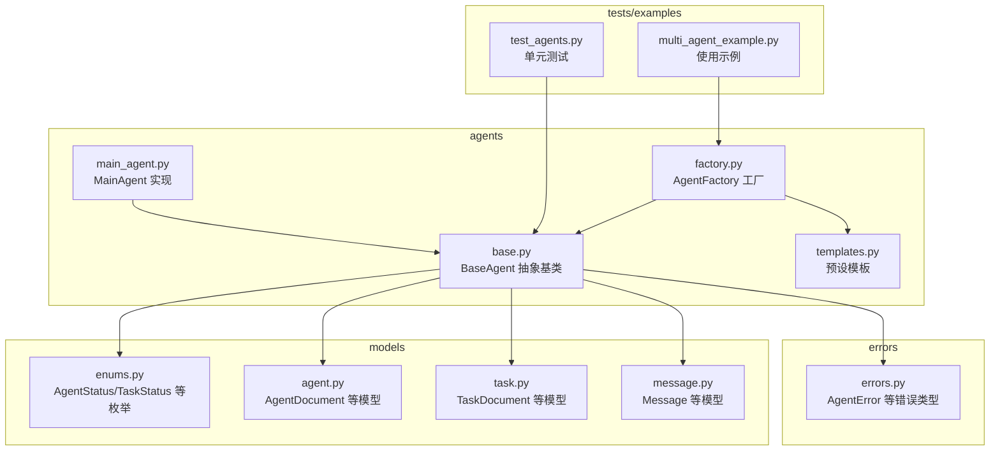
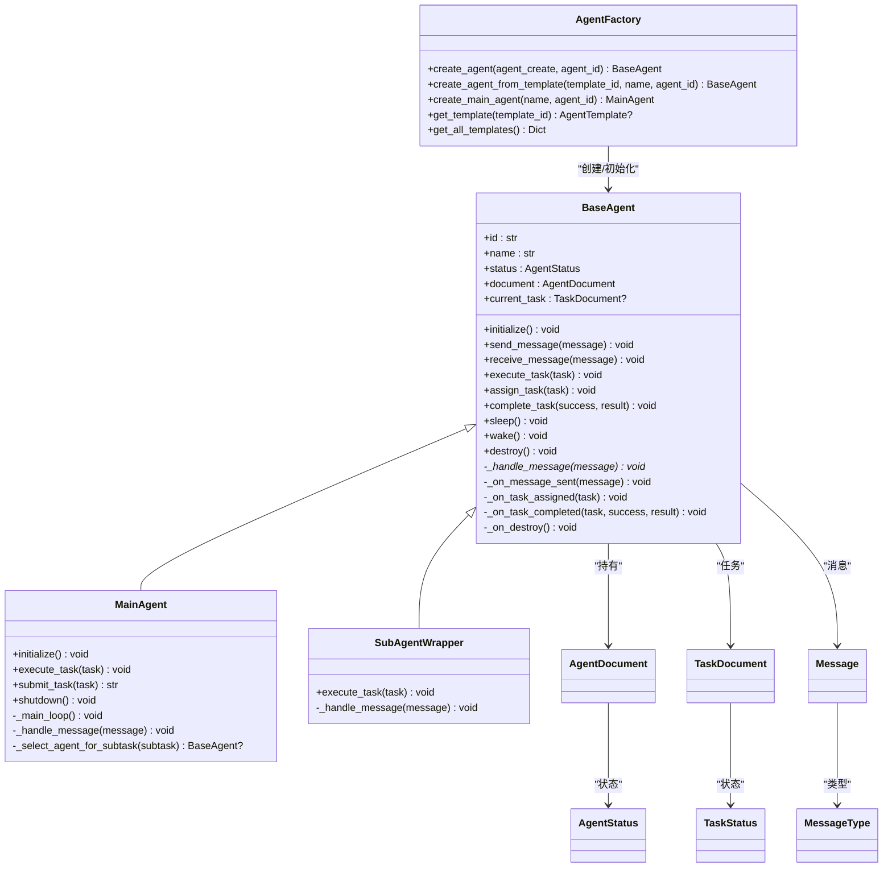
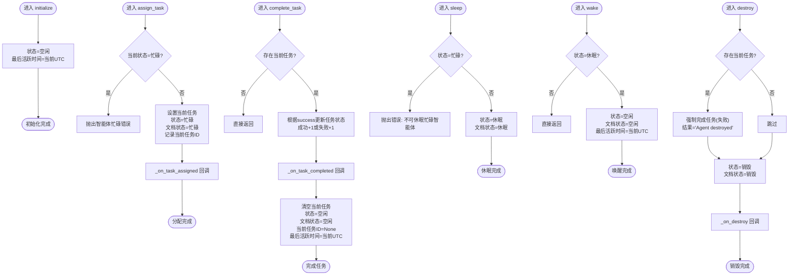
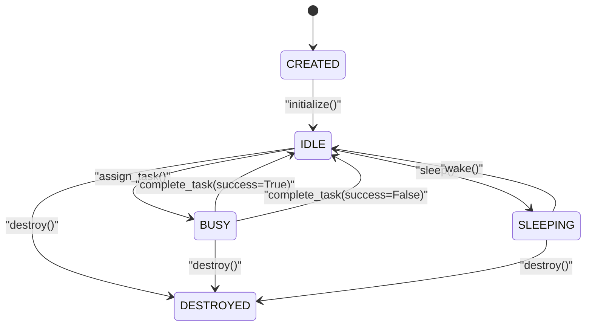
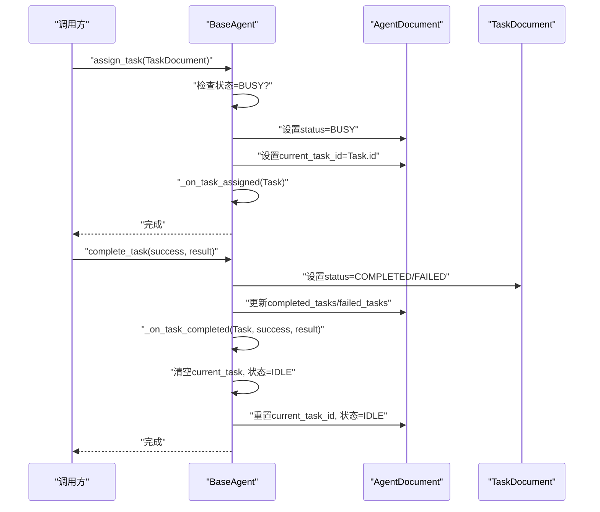
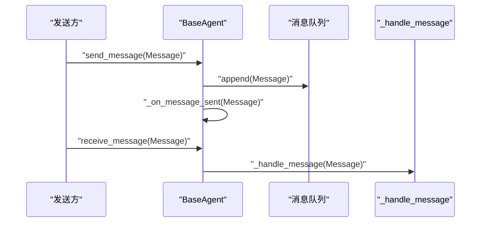
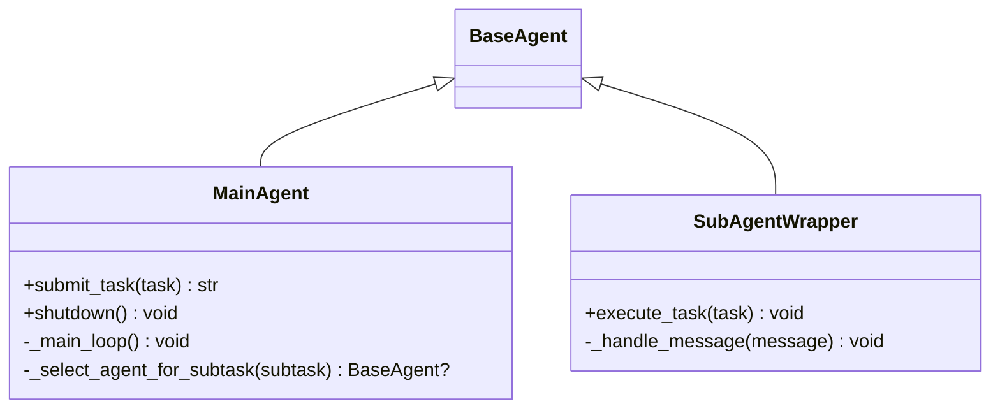
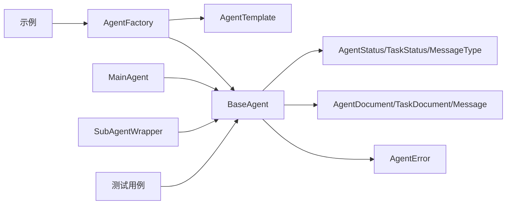

# 智能体基类

<cite>
**本文档引用的文件**
- [base.py](file://src/taolib/testing/multi_agent/agents/base.py)
- [enums.py](file://src/taolib/testing/multi_agent/models/enums.py)
- [agent.py](file://src/taolib/testing/multi_agent/models/agent.py)
- [task.py](file://src/taolib/testing/multi_agent/models/task.py)
- [message.py](file://src/taolib/testing/multi_agent/models/message.py)
- [errors.py](file://src/taolib/testing/multi_agent/errors.py)
- [main_agent.py](file://src/taolib/testing/multi_agent/agents/main_agent.py)
- [factory.py](file://src/taolib/testing/multi_agent/agents/factory.py)
- [templates.py](file://src/taolib/testing/multi_agent/agents/templates.py)
- [test_agents.py](file://tests/testing/test_multi_agent/test_agents.py)
- [multi_agent_example.py](file://examples/multi_agent_example.py)
</cite>

## 目录
1. [简介](#简介)
2. [项目结构](#项目结构)
3. [核心组件](#核心组件)
4. [架构总览](#架构总览)
5. [详细组件分析](#详细组件分析)
6. [依赖关系分析](#依赖关系分析)
7. [性能考虑](#性能考虑)
8. [故障排查指南](#故障排查指南)
9. [结论](#结论)

## 简介
本文件面向智能体基类 BaseAgent 的技术文档，系统阐述其抽象设计、状态管理机制、任务分配与完成流程、消息处理机制，以及生命周期管理的最佳实践。文档同时提供状态转换图、序列图与类图，帮助读者从高层到代码层面全面理解该基类的设计与实现。

## 项目结构
智能体相关代码主要位于 `src/taolib/testing/multi_agent/` 目录下，按功能域划分：
- agents：智能体实现与工厂
- models：数据模型与枚举
- errors：错误类型定义
- 示例与测试：演示与验证

**图表来源**
- [base.py:21-204](file://src/taolib/testing/multi_agent/agents/base.py#L21-L204)
- [enums.py:9-96](file://src/taolib/testing/multi_agent/models/enums.py#L9-L96)
- [agent.py:95-129](file://src/taolib/testing/multi_agent/models/agent.py#L95-L129)
- [task.py:110-143](file://src/taolib/testing/multi_agent/models/task.py#L110-L143)
- [message.py:24-36](file://src/taolib/testing/multi_agent/models/message.py#L24-L36)
- [errors.py:37-107](file://src/taolib/testing/multi_agent/errors.py#L37-L107)
- [main_agent.py:104-472](file://src/taolib/testing/multi_agent/agents/main_agent.py#L104-L472)
- [factory.py:27-220](file://src/taolib/testing/multi_agent/agents/factory.py#L27-L220)
- [templates.py:14-309](file://src/taolib/testing/multi_agent/agents/templates.py#L14-L309)
- [test_agents.py:32-267](file://tests/testing/test_multi_agent/test_agents.py#L32-L267)
- [multi_agent_example.py:14-196](file://examples/multi_agent_example.py#L14-L196)

**章节来源**
- [base.py:1-204](file://src/taolib/testing/multi_agent/agents/base.py#L1-L204)
- [enums.py:1-96](file://src/taolib/testing/multi_agent/models/enums.py#L1-L96)
- [agent.py:1-129](file://src/taolib/testing/multi_agent/models/agent.py#L1-L129)
- [task.py:1-143](file://src/taolib/testing/multi_agent/models/task.py#L1-L143)
- [message.py:1-36](file://src/taolib/testing/multi_agent/models/message.py#L1-L36)
- [errors.py:1-107](file://src/taolib/testing/multi_agent/errors.py#L1-L107)
- [main_agent.py:1-472](file://src/taolib/testing/multi_agent/agents/main_agent.py#L1-L472)
- [factory.py:1-220](file://src/taolib/testing/multi_agent/agents/factory.py#L1-L220)
- [templates.py:1-309](file://src/taolib/testing/multi_agent/agents/templates.py#L1-L309)
- [test_agents.py:1-267](file://tests/testing/test_multi_agent/test_agents.py#L1-L267)
- [multi_agent_example.py:1-196](file://examples/multi_agent_example.py#L1-L196)

## 核心组件
- BaseAgent 抽象基类：定义智能体的统一接口与生命周期管理，包括状态、任务与消息处理。
- AgentDocument/TaskDocument/Message：智能体、任务与消息的数据模型。
- AgentStatus/TaskStatus/MessageType：状态与消息类型的枚举。
- AgentError：智能体相关错误类型。
- MainAgent/SubAgentWrapper：具体实现示例，展示如何继承与扩展。
- AgentFactory：智能体工厂，支持从模板创建与全局管理。

**章节来源**
- [base.py:21-204](file://src/taolib/testing/multi_agent/agents/base.py#L21-L204)
- [enums.py:9-96](file://src/taolib/testing/multi_agent/models/enums.py#L9-L96)
- [agent.py:95-129](file://src/taolib/testing/multi_agent/models/agent.py#L95-L129)
- [task.py:110-143](file://src/taolib/testing/multi_agent/models/task.py#L110-L143)
- [message.py:24-36](file://src/taolib/testing/multi_agent/models/message.py#L24-L36)
- [errors.py:37-107](file://src/taolib/testing/multi_agent/errors.py#L37-L107)
- [main_agent.py:35-472](file://src/taolib/testing/multi_agent/agents/main_agent.py#L35-L472)
- [factory.py:27-220](file://src/taolib/testing/multi_agent/agents/factory.py#L27-L220)

## 架构总览
BaseAgent 作为抽象基类，向上提供统一的智能体接口，向下由具体实现（如 MainAgent/SubAgentWrapper）完成业务逻辑。工厂负责创建与初始化智能体，并通过模板系统提供可复用的配置。

**图表来源**
- [base.py:21-204](file://src/taolib/testing/multi_agent/agents/base.py#L21-L204)
- [main_agent.py:104-472](file://src/taolib/testing/multi_agent/agents/main_agent.py#L104-L472)
- [factory.py:27-220](file://src/taolib/testing/multi_agent/agents/factory.py#L27-L220)
- [enums.py:9-96](file://src/taolib/testing/multi_agent/models/enums.py#L9-L96)
- [agent.py:95-129](file://src/taolib/testing/multi_agent/models/agent.py#L95-L129)
- [task.py:110-143](file://src/taolib/testing/multi_agent/models/task.py#L110-L143)
- [message.py:24-36](file://src/taolib/testing/multi_agent/models/message.py#L24-L36)

## 详细组件分析

### BaseAgent 抽象基类
- 核心属性
  - id/name/status/document/current_task：通过只读属性暴露智能体标识、名称、状态、文档与当前任务。
- 生命周期方法
  - initialize：将状态置为空闲，更新最后活跃时间。
  - sleep/wake/destroy：休眠/唤醒/销毁，包含状态与安全检查。
- 任务管理
  - assign_task：分配任务，若当前忙碌则抛出智能体忙碌错误；更新任务与文档状态。
  - complete_task：完成任务，根据成功与否更新任务状态与统计，触发完成回调，重置当前任务并回到空闲。
- 消息处理
  - send_message：将消息加入队列并触发发送后回调。
  - receive_message：接收消息并调用抽象的 _handle_message 方法。
- 回调钩子
  - _on_message_sent/_on_task_assigned/_on_task_completed/_on_destroy：可在子类中覆盖以扩展行为。

**图表来源**
- [base.py:60-204](file://src/taolib/testing/multi_agent/agents/base.py#L60-L204)
- [errors.py:37-52](file://src/taolib/testing/multi_agent/errors.py#L37-L52)

**章节来源**
- [base.py:21-204](file://src/taolib/testing/multi_agent/agents/base.py#L21-L204)
- [errors.py:37-52](file://src/taolib/testing/multi_agent/errors.py#L37-L52)

### 状态管理机制
- 状态枚举：CREATED、IDLE、BUSY、SLEEPING、ERROR、DESTROYED。
- 转换规则
  - initialize：CREATED → IDLE。
  - assign_task：IDLE → BUSY（忙碌则报错）。
  - complete_task：BUSY → IDLE（完成后清理当前任务）。
  - sleep：IDLE → SLEEPING（忙碌不可休眠）。
  - wake：SLEEPING → IDLE（非休眠状态直接返回）。
  - destroy：任意状态 → DESTROYED（如有当前任务则先强制失败）。

**图表来源**
- [enums.py:9-17](file://src/taolib/testing/multi_agent/models/enums.py#L9-L17)
- [base.py:60-204](file://src/taolib/testing/multi_agent/agents/base.py#L60-L204)

**章节来源**
- [enums.py:9-17](file://src/taolib/testing/multi_agent/models/enums.py#L9-L17)
- [base.py:60-204](file://src/taolib/testing/multi_agent/agents/base.py#L60-L204)

### 任务分配与完成流程
- assign_task
  - 安全校验：忙碌状态下拒绝分配。
  - 更新：当前任务、状态、文档状态与当前任务ID。
  - 回调：_on_task_assigned。
- complete_task
  - 安全校验：无当前任务直接返回。
  - 结果：根据 success 设置任务完成/失败，更新统计。
  - 回调：_on_task_completed。
  - 清理：清空当前任务，回到空闲，更新最后活跃时间。

**图表来源**
- [base.py:109-172](file://src/taolib/testing/multi_agent/agents/base.py#L109-L172)
- [task.py:110-143](file://src/taolib/testing/multi_agent/models/task.py#L110-L143)
- [agent.py:95-129](file://src/taolib/testing/multi_agent/models/agent.py#L95-L129)

**章节来源**
- [base.py:109-172](file://src/taolib/testing/multi_agent/agents/base.py#L109-L172)
- [task.py:110-143](file://src/taolib/testing/multi_agent/models/task.py#L110-L143)
- [agent.py:95-129](file://src/taolib/testing/multi_agent/models/agent.py#L95-L129)

### 消息处理机制
- 发送：send_message 将消息追加到内部队列并触发 _on_message_sent。
- 接收：receive_message 直接调用 _handle_message（抽象方法，子类实现）。
- 模型：Message 包含消息类型、发送者/接收者、载荷、时间戳、优先级等字段。

**图表来源**
- [base.py:66-98](file://src/taolib/testing/multi_agent/agents/base.py#L66-L98)
- [message.py:24-36](file://src/taolib/testing/multi_agent/models/message.py#L24-L36)

**章节来源**
- [base.py:66-98](file://src/taolib/testing/multi_agent/agents/base.py#L66-L98)
- [message.py:24-36](file://src/taolib/testing/multi_agent/models/message.py#L24-L36)

### 生命周期管理最佳实践
- 初始化：通过 initialize 将状态置为 IDLE，并更新最后活跃时间。
- 休眠/唤醒：仅在空闲时休眠；休眠后必须显式唤醒才能继续工作。
- 销毁：销毁前会尝试完成当前任务（失败标记），随后进入 DESTROYED。
- 安全校验：忙碌时禁止休眠；分配任务前检查状态；完成任务前检查是否存在当前任务。
- 回调扩展：通过覆盖 _on_* 回调在关键节点注入业务逻辑（如持久化、通知等）。

**章节来源**
- [base.py:60-204](file://src/taolib/testing/multi_agent/agents/base.py#L60-L204)

### 具体实现示例：MainAgent/SubAgentWrapper
- MainAgent
  - 继承 BaseAgent，扩展任务分析、子任务调度与聚合。
  - 提供 submit_task、shutdown 等高级能力。
- SubAgentWrapper
  - 简化实现，专注于执行任务与消息处理。

**图表来源**
- [main_agent.py:104-472](file://src/taolib/testing/multi_agent/agents/main_agent.py#L104-L472)
- [base.py:21-204](file://src/taolib/testing/multi_agent/agents/base.py#L21-L204)

**章节来源**
- [main_agent.py:35-472](file://src/taolib/testing/multi_agent/agents/main_agent.py#L35-L472)
- [base.py:21-204](file://src/taolib/testing/multi_agent/agents/base.py#L21-L204)

## 依赖关系分析
- BaseAgent 依赖
  - 枚举：AgentStatus、TaskStatus、MessageType。
  - 模型：AgentDocument、TaskDocument、Message。
  - 错误：AgentError。
- 工厂与模板
  - AgentFactory 基于模板创建智能体，映射 AgentType 到具体类（MainAgent/SubAgentWrapper）。
- 测试与示例
  - 单元测试验证状态转换与异常行为。
  - 示例展示工厂与主智能体的使用。

**图表来源**
- [base.py:10-18](file://src/taolib/testing/multi_agent/agents/base.py#L10-L18)
- [enums.py:9-96](file://src/taolib/testing/multi_agent/models/enums.py#L9-L96)
- [agent.py:95-129](file://src/taolib/testing/multi_agent/models/agent.py#L95-L129)
- [task.py:110-143](file://src/taolib/testing/multi_agent/models/task.py#L110-L143)
- [message.py:24-36](file://src/taolib/testing/multi_agent/models/message.py#L24-L36)
- [errors.py:37-107](file://src/taolib/testing/multi_agent/errors.py#L37-L107)
- [factory.py:27-220](file://src/taolib/testing/multi_agent/agents/factory.py#L27-L220)
- [templates.py:264-309](file://src/taolib/testing/multi_agent/agents/templates.py#L264-L309)
- [test_agents.py:32-267](file://tests/testing/test_multi_agent/test_agents.py#L32-L267)
- [multi_agent_example.py:80-140](file://examples/multi_agent_example.py#L80-L140)

**章节来源**
- [base.py:10-18](file://src/taolib/testing/multi_agent/agents/base.py#L10-L18)
- [factory.py:27-220](file://src/taolib/testing/multi_agent/agents/factory.py#L27-L220)
- [test_agents.py:140-267](file://tests/testing/test_multi_agent/test_agents.py#L140-L267)
- [multi_agent_example.py:80-140](file://examples/multi_agent_example.py#L80-L140)

## 性能考虑
- 异步执行：BaseAgent 的关键方法均声明为异步，便于在高并发场景下非阻塞处理任务与消息。
- 状态检查：在关键路径（分配任务、休眠、销毁）进行状态校验，避免无效操作与竞态。
- 队列管理：消息队列采用简单列表，适合轻量级消息传递；若消息吞吐量较大，建议引入异步队列或事件驱动机制。
- 回调扩展：通过回调钩子减少耦合，便于在不修改核心逻辑的前提下扩展功能。

[本节为通用指导，无需特定文件引用]

## 故障排查指南
- 智能体忙碌错误
  - 现象：分配任务时报错“智能体忙碌”。
  - 原因：assign_task 前状态已是 BUSY。
  - 处理：等待当前任务完成后再分配，或检查任务完成流程。
- 休眠失败
  - 现象：调用 sleep 报错“不可休眠忙碌智能体”。
  - 原因：状态为 BUSY。
  - 处理：先完成任务或强制销毁，再休眠。
- 销毁残留任务
  - 现象：销毁后仍有任务未完成。
  - 原因：destroy 会强制完成当前任务（失败）。
  - 处理：确保任务完成后再销毁，或接受失败标记。
- 回调未生效
  - 现象：自定义 _on_task_completed 等未执行。
  - 原因：未正确覆盖回调或流程提前返回。
  - 处理：确认覆盖实现与调用链路。

**章节来源**
- [base.py:118-119](file://src/taolib/testing/multi_agent/agents/base.py#L118-L119)
- [base.py:176-178](file://src/taolib/testing/multi_agent/agents/base.py#L176-L178)
- [base.py:193-194](file://src/taolib/testing/multi_agent/agents/base.py#L193-L194)
- [errors.py:37-52](file://src/taolib/testing/multi_agent/errors.py#L37-L52)
- [test_agents.py:92-128](file://tests/testing/test_multi_agent/test_agents.py#L92-L128)

## 结论
BaseAgent 通过抽象接口与状态机设计，提供了统一的智能体生命周期管理与任务/消息处理框架。结合工厂与模板系统，可快速构建主智能体与专用子智能体。遵循本文档的状态转换、安全检查与回调扩展实践，可有效提升系统的稳定性与可维护性。