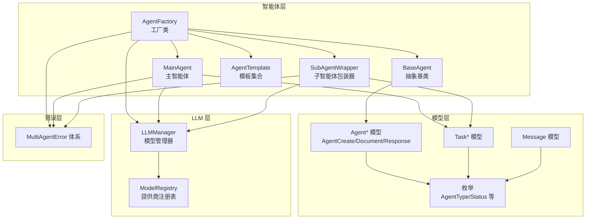
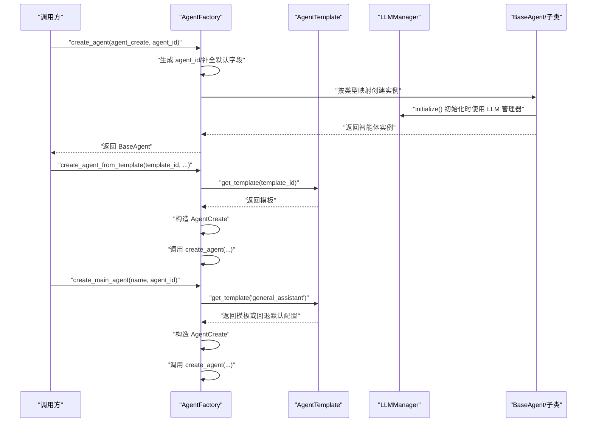
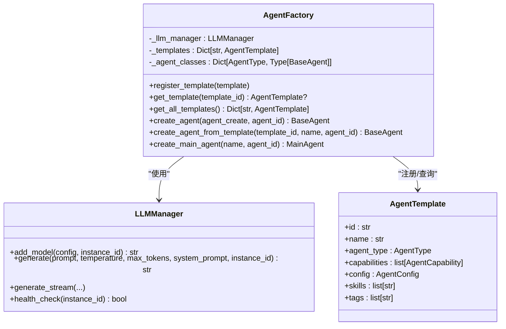
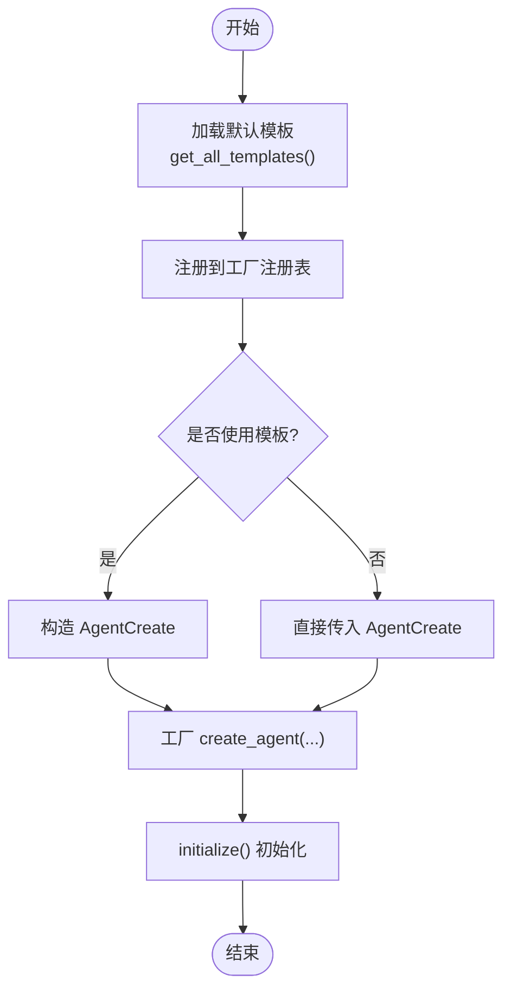
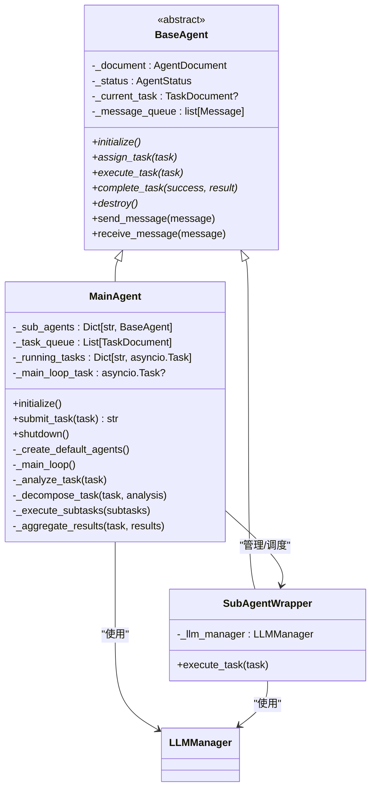
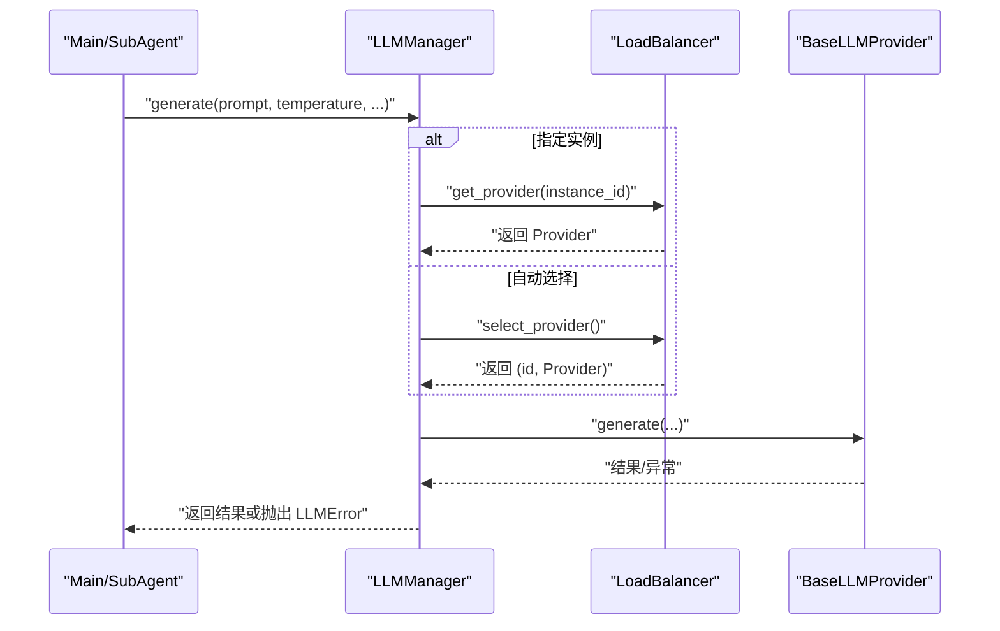
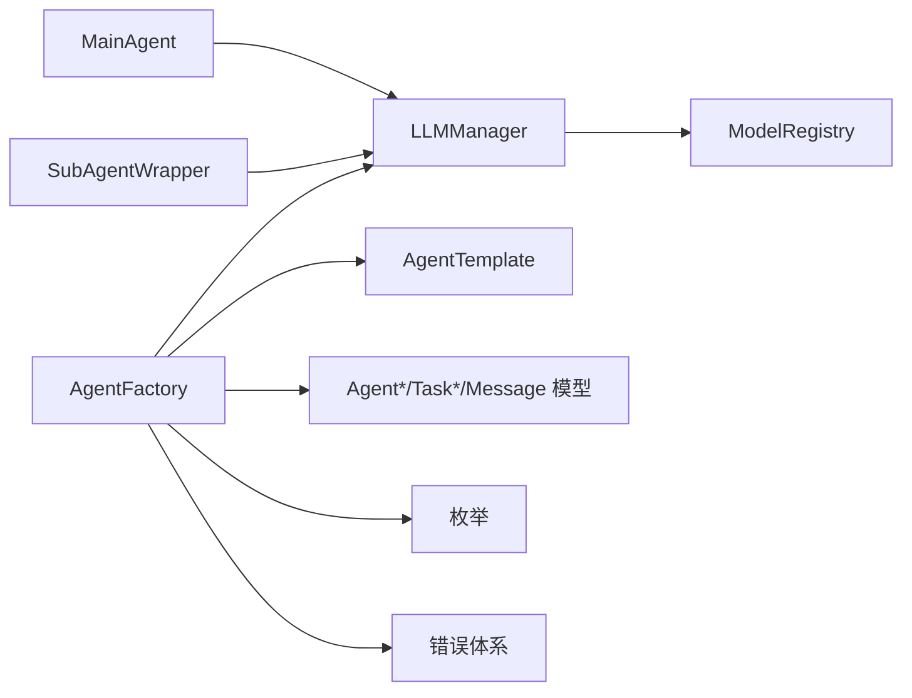
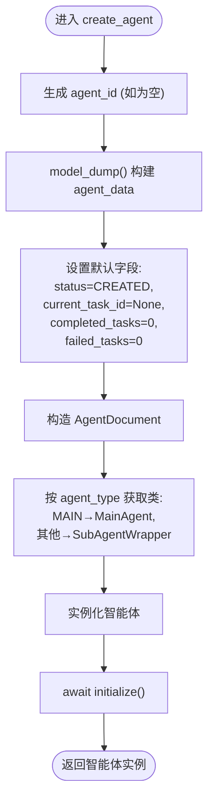

# 智能体工厂

<cite>
**本文引用的文件**
- [factory.py](file://src/taolib/testing/multi_agent/agents/factory.py)
- [templates.py](file://src/taolib/testing/multi_agent/agents/templates.py)
- [base.py](file://src/taolib/testing/multi_agent/agents/base.py)
- [main_agent.py](file://src/taolib/testing/multi_agent/agents/main_agent.py)
- [agent.py](file://src/taolib/testing/multi_agent/models/agent.py)
- [enums.py](file://src/taolib/testing/multi_agent/models/enums.py)
- [errors.py](file://src/taolib/testing/multi_agent/errors.py)
- [task.py](file://src/taolib/testing/multi_agent/models/task.py)
- [message.py](file://src/taolib/testing/multi_agent/models/message.py)
- [manager.py](file://src/taolib/testing/multi_agent/llm/manager.py)
- [registry.py](file://src/taolib/testing/multi_agent/llm/registry.py)
</cite>

## 目录
1. [简介](#简介)
2. [项目结构](#项目结构)
3. [核心组件](#核心组件)
4. [架构总览](#架构总览)
5. [详细组件分析](#详细组件分析)
6. [依赖关系分析](#依赖关系分析)
7. [性能考虑](#性能考虑)
8. [故障排查指南](#故障排查指南)
9. [结论](#结论)
10. [附录](#附录)

## 简介
本文件围绕“智能体工厂”模式，系统化阐述多智能体系统中的智能体实例化与管理机制。重点覆盖以下方面：
- 统一入口：通过工厂类集中创建不同类型的智能体（主智能体、子智能体包装器等）。
- 类型注册：内置智能体类型映射，支持扩展注册新的智能体类型。
- 模板管理：内置模板加载与动态注册，支持从模板快速创建智能体。
- 工厂方法流程：参数校验、默认值设置、智能体实例化与初始化。
- 动态注册与发现：工厂注册表维护、模板加载与发现。
- 扩展性设计：新增智能体类型与配置参数传递机制。
- 最佳实践：错误处理、性能优化与资源管理。

## 项目结构
多智能体系统采用分层与功能模块化组织，智能体工厂位于 agents 子模块，配合模型、LLM 管理与错误体系协同工作。

**图示来源**
- [factory.py:27-220](file://src/taolib/testing/multi_agent/agents/factory.py#L27-L220)
- [base.py:21-204](file://src/taolib/testing/multi_agent/agents/base.py#L21-L204)
- [main_agent.py:104-472](file://src/taolib/testing/multi_agent/agents/main_agent.py#L104-L472)
- [templates.py:1-309](file://src/taolib/testing/multi_agent/agents/templates.py#L1-L309)
- [agent.py:15-129](file://src/taolib/testing/multi_agent/models/agent.py#L15-L129)
- [enums.py:9-96](file://src/taolib/testing/multi_agent/models/enums.py#L9-L96)
- [task.py:15-143](file://src/taolib/testing/multi_agent/models/task.py#L15-L143)
- [message.py:14-36](file://src/taolib/testing/multi_agent/models/message.py#L14-L36)
- [manager.py:22-229](file://src/taolib/testing/multi_agent/llm/manager.py#L22-L229)
- [registry.py:12-73](file://src/taolib/testing/multi_agent/llm/registry.py#L12-L73)
- [errors.py:7-107](file://src/taolib/testing/multi_agent/errors.py#L7-L107)

**章节来源**
- [factory.py:1-220](file://src/taolib/testing/multi_agent/agents/factory.py#L1-L220)
- [templates.py:1-309](file://src/taolib/testing/multi_agent/agents/templates.py#L1-L309)
- [base.py:1-204](file://src/taolib/testing/multi_agent/agents/base.py#L1-L204)
- [main_agent.py:1-472](file://src/taolib/testing/multi_agent/agents/main_agent.py#L1-L472)
- [agent.py:1-129](file://src/taolib/testing/multi_agent/models/agent.py#L1-L129)
- [enums.py:1-96](file://src/taolib/testing/multi_agent/models/enums.py#L1-L96)
- [task.py:1-143](file://src/taolib/testing/multi_agent/models/task.py#L1-L143)
- [message.py:1-36](file://src/taolib/testing/multi_agent/models/message.py#L1-L36)
- [manager.py:1-229](file://src/taolib/testing/multi_agent/llm/manager.py#L1-L229)
- [registry.py:1-73](file://src/taolib/testing/multi_agent/llm/registry.py#L1-L73)
- [errors.py:1-107](file://src/taolib/testing/multi_agent/errors.py#L1-L107)

## 核心组件
- 智能体工厂（AgentFactory）
  - 统一入口：提供 create_agent、create_agent_from_template、create_main_agent 等方法。
  - 注册表：维护 agent 类型到具体类的映射；支持模板注册与查询。
  - LLM 管理：持有或获取 LLMManager，贯穿智能体生命周期。
- 智能体基类（BaseAgent）
  - 抽象接口：initialize、execute_task、assign_task、complete_task、destroy 等。
  - 状态机：基于 AgentStatus 枚举的状态流转。
- 主智能体（MainAgent）
  - 调度与编排：任务分析、子任务分解、子智能体调度、结果聚合。
  - 生命周期：初始化默认子智能体、启动主循环、优雅关闭。
- 子智能体包装器（SubAgentWrapper）
  - 代理执行：委托 LLMManager 进行文本生成，封装任务执行与结果上报。
- 模板系统（AgentTemplate）
  - 内置模板：代码助手、写作助手、数据分析、研究助手、通用助手。
  - 模板注册：工厂在初始化时加载默认模板，支持动态注册。
- 数据模型与枚举
  - Agent*：创建、文档、响应模型，含配置、能力、标签等。
  - Task*：任务、子任务、进度、结果模型。
  - Message：消息类型与载荷。
  - 枚举：AgentType、AgentStatus、TaskStatus、MessageType 等。
- LLM 管理与注册
  - LLMManager：统一生成接口、流式生成、健康检查、负载均衡记录。
  - ModelRegistry：提供商注册与实例创建。

**章节来源**
- [factory.py:27-220](file://src/taolib/testing/multi_agent/agents/factory.py#L27-L220)
- [base.py:21-204](file://src/taolib/testing/multi_agent/agents/base.py#L21-L204)
- [main_agent.py:104-472](file://src/taolib/testing/multi_agent/agents/main_agent.py#L104-L472)
- [templates.py:14-309](file://src/taolib/testing/multi_agent/agents/templates.py#L14-L309)
- [agent.py:15-129](file://src/taolib/testing/multi_agent/models/agent.py#L15-L129)
- [task.py:15-143](file://src/taolib/testing/multi_agent/models/task.py#L15-L143)
- [message.py:14-36](file://src/taolib/testing/multi_agent/models/message.py#L14-L36)
- [enums.py:9-96](file://src/taolib/testing/multi_agent/models/enums.py#L9-L96)
- [manager.py:22-229](file://src/taolib/testing/multi_agent/llm/manager.py#L22-L229)
- [registry.py:12-73](file://src/taolib/testing/multi_agent/llm/registry.py#L12-L73)

## 架构总览
智能体工厂作为统一入口，协调模板、模型与 LLM 管理器，形成“配置驱动 + 类型映射 + LLM 执行”的闭环。

**图示来源**
- [factory.py:74-193](file://src/taolib/testing/multi_agent/agents/factory.py#L74-L193)
- [templates.py:264-295](file://src/taolib/testing/multi_agent/agents/templates.py#L264-L295)
- [manager.py:22-229](file://src/taolib/testing/multi_agent/llm/manager.py#L22-L229)
- [base.py:60-98](file://src/taolib/testing/multi_agent/agents/base.py#L60-L98)

**章节来源**
- [factory.py:74-193](file://src/taolib/testing/multi_agent/agents/factory.py#L74-L193)
- [templates.py:264-295](file://src/taolib/testing/multi_agent/agents/templates.py#L264-L295)
- [manager.py:22-229](file://src/taolib/testing/multi_agent/llm/manager.py#L22-L229)
- [base.py:60-98](file://src/taolib/testing/multi_agent/agents/base.py#L60-L98)

## 详细组件分析

### 智能体工厂（AgentFactory）
- 设计要点
  - 类型映射：内置 MAIN/Sub 映射，未知类型回退为 SubAgentWrapper。
  - 模板系统：初始化时加载全部模板，支持动态注册与查询。
  - LLM 注入：默认使用全局 LLMManager，可注入自定义实例。
  - 工厂方法：
    - create_agent：参数校验与默认值设置（状态、任务计数等），实例化并初始化。
    - create_agent_from_template：模板解析与 AgentCreate 构造，再复用 create_agent。
    - create_main_agent：优先使用通用模板，否则回退默认配置。
  - 全局工厂：提供 get/set 访问器，便于应用级共享。

**图示来源**
- [factory.py:27-220](file://src/taolib/testing/multi_agent/agents/factory.py#L27-L220)
- [templates.py:34-44](file://src/taolib/testing/multi_agent/agents/templates.py#L34-L44)
- [manager.py:22-229](file://src/taolib/testing/multi_agent/llm/manager.py#L22-L229)

**章节来源**
- [factory.py:27-220](file://src/taolib/testing/multi_agent/agents/factory.py#L27-L220)

### 模板系统（AgentTemplate 与模板集合）
- 设计要点
  - 预设模板：包含能力、配置、技能、标签等，便于快速创建专用智能体。
  - 模板注册：工厂初始化时遍历 get_all_templates 注入注册表；支持自定义模板 register_template。
  - 模板发现：get_template 根据 id 查找；get_all_templates 返回快照副本。

**图示来源**
- [templates.py:287-295](file://src/taolib/testing/multi_agent/agents/templates.py#L287-L295)
- [templates.py:264-284](file://src/taolib/testing/multi_agent/agents/templates.py#L264-L284)
- [factory.py:44-45](file://src/taolib/testing/multi_agent/agents/factory.py#L44-L45)
- [factory.py:120-150](file://src/taolib/testing/multi_agent/agents/factory.py#L120-L150)

**章节来源**
- [templates.py:14-309](file://src/taolib/testing/multi_agent/agents/templates.py#L14-L309)
- [factory.py:47-72](file://src/taolib/testing/multi_agent/agents/factory.py#L47-L72)

### 基类与主/子智能体
- BaseAgent
  - 状态机：CREATED → IDLE → BUSY → SLEEPING → DESTROYED。
  - 生命周期：initialize、assign_task、execute_task、complete_task、destroy。
  - 消息接口：send_message/receive_message，便于跨智能体通信。
- MainAgent
  - 调度职责：任务分析、子任务分解、子智能体选择与执行、结果聚合。
  - 默认子智能体：初始化时基于模板批量创建 SubAgentWrapper。
  - 主循环：周期性处理队列、检查完成任务、日志记录与异常恢复。
- SubAgentWrapper
  - 执行职责：委托 LLMManager 生成文本，封装任务结果与状态变更。

**图示来源**
- [base.py:21-204](file://src/taolib/testing/multi_agent/agents/base.py#L21-L204)
- [main_agent.py:104-472](file://src/taolib/testing/multi_agent/agents/main_agent.py#L104-L472)
- [manager.py:22-229](file://src/taolib/testing/multi_agent/llm/manager.py#L22-L229)

**章节来源**
- [base.py:21-204](file://src/taolib/testing/multi_agent/agents/base.py#L21-L204)
- [main_agent.py:104-472](file://src/taolib/testing/multi_agent/agents/main_agent.py#L104-L472)

### LLM 管理与注册
- LLMManager
  - 统一接口：generate/generate_stream，支持指定实例或负载均衡选择。
  - 负载均衡：记录成功/失败，影响后续选择权重。
  - 健康检查：支持单实例与全量检查。
- ModelRegistry
  - 提供商注册：按 ModelProvider 类型注册具体 Provider 类。
  - 实例创建：依据配置创建对应 Provider 实例。

**图示来源**
- [manager.py:57-107](file://src/taolib/testing/multi_agent/llm/manager.py#L57-L107)
- [registry.py:44-55](file://src/taolib/testing/multi_agent/llm/registry.py#L44-L55)

**章节来源**
- [manager.py:22-229](file://src/taolib/testing/multi_agent/llm/manager.py#L22-L229)
- [registry.py:12-73](file://src/taolib/testing/multi_agent/llm/registry.py#L12-L73)

## 依赖关系分析
- 组件耦合
  - AgentFactory 依赖 LLMManager、AgentTemplate、Agent* 模型与枚举。
  - MainAgent 依赖 LLMManager 与模板集合；SubAgentWrapper 依赖 LLMManager。
  - 错误体系被各组件广泛使用，保证一致的异常语义。
- 外部依赖
  - LLM 提供商通过 ModelRegistry 注册，支持扩展新提供商。
  - 模板通过工厂注册表集中管理，便于动态扩展。

**图示来源**
- [factory.py:9-24](file://src/taolib/testing/multi_agent/agents/factory.py#L9-L24)
- [main_agent.py:12-30](file://src/taolib/testing/multi_agent/agents/main_agent.py#L12-L30)
- [manager.py:12-19](file://src/taolib/testing/multi_agent/llm/manager.py#L12-L19)
- [registry.py:12-73](file://src/taolib/testing/multi_agent/llm/registry.py#L12-L73)

**章节来源**
- [factory.py:9-24](file://src/taolib/testing/multi_agent/agents/factory.py#L9-L24)
- [main_agent.py:12-30](file://src/taolib/testing/multi_agent/agents/main_agent.py#L12-L30)
- [manager.py:12-19](file://src/taolib/testing/multi_agent/llm/manager.py#L12-L19)
- [registry.py:12-73](file://src/taolib/testing/multi_agent/llm/registry.py#L12-L73)

## 性能考虑
- 并发与调度
  - MainAgent 使用 asyncio 事件循环与任务队列，避免阻塞；子任务执行采用异步等待与完成检测。
  - SubAgentWrapper 在执行任务时委托 LLMManager，注意控制并发与超时。
- 资源管理
  - 工厂与 LLMManager 支持全局实例共享，减少重复初始化开销。
  - 主智能体关闭时会销毁所有子智能体，确保资源回收。
- 模板与配置
  - 模板注册表为内存缓存，初始化后只读访问，避免频繁 IO。
  - AgentConfig 中的温度、并发数、超时等参数直接影响性能与稳定性，需结合场景调优。

[本节为通用指导，无需特定文件引用]

## 故障排查指南
- 常见错误类型
  - AgentError：智能体忙碌、未找到等。
  - TaskError：任务执行失败。
  - LLMError/ModelUnavailableError：模型不可用或生成失败。
- 排查步骤
  - 检查模板是否存在：create_agent_from_template 会抛出 AgentError。
  - 检查智能体状态：assign_task 在 BUSY 状态下会报错。
  - 检查 LLM 可用性：health_check 或 generate 流程中的异常。
  - 日志定位：MainAgent 主循环与子任务执行处记录错误信息。
- 修复建议
  - 确保模板 id 正确且已注册。
  - 避免对忙碌智能体重复分配任务。
  - 为 LLM 提供商配置健康检查与重试策略。

**章节来源**
- [errors.py:37-106](file://src/taolib/testing/multi_agent/errors.py#L37-L106)
- [main_agent.py:162-172](file://src/taolib/testing/multi_agent/agents/main_agent.py#L162-L172)
- [main_agent.py:196-210](file://src/taolib/testing/multi_agent/agents/main_agent.py#L196-L210)
- [manager.py:159-175](file://src/taolib/testing/multi_agent/llm/manager.py#L159-L175)

## 结论
智能体工厂通过“类型映射 + 模板 + LLM 管理”的组合，提供了统一、可扩展、可维护的智能体创建与管理方案。其关键价值在于：
- 统一入口降低使用复杂度；
- 模板机制加速定制化智能体落地；
- LLM 管理器提供稳定的推理能力与可观测性；
- 异步与状态机设计保障高并发下的稳定性。

[本节为总结性内容，无需特定文件引用]

## 附录

### 工厂方法创建流程（参数验证、默认值、实例化）

**图示来源**
- [factory.py:74-118](file://src/taolib/testing/multi_agent/agents/factory.py#L74-L118)

**章节来源**
- [factory.py:74-118](file://src/taolib/testing/multi_agent/agents/factory.py#L74-L118)

### 智能体类型注册与发现
- 内置注册：工厂初始化时将 MAIN/SUB 映射到具体类。
- 动态注册：register_template/get_template/get_all_templates 支持运行时扩展。
- 模板加载：get_all_templates 遍历预设函数，工厂在初始化时加载。

**章节来源**
- [factory.py:38-45](file://src/taolib/testing/multi_agent/agents/factory.py#L38-L45)
- [templates.py:287-295](file://src/taolib/testing/multi_agent/agents/templates.py#L287-L295)

### 扩展性设计与最佳实践
- 新增智能体类型
  - 定义新类继承 BaseAgent，实现抽象方法。
  - 在工厂注册表中添加类型映射，或通过 create_agent 传入自定义类型。
- 模板扩展
  - 新增模板函数，加入 get_all_templates 与 get_template 分发。
  - 通过 register_template 注册到工厂。
- 参数传递
  - 通过 AgentCreate/AgentDocument 传递配置、能力、技能与标签。
  - LLM 参数（温度、超时、系统提示词）由模板与配置共同决定。
- 最佳实践
  - 统一使用工厂创建智能体，避免绕过初始化流程。
  - 对主智能体与子智能体分别设置合理的并发与超时阈值。
  - 使用健康检查与错误分类，提升可观测性与可恢复性。

**章节来源**
- [base.py:91-107](file://src/taolib/testing/multi_agent/agents/base.py#L91-L107)
- [agent.py:62-92](file://src/taolib/testing/multi_agent/models/agent.py#L62-L92)
- [manager.py:57-107](file://src/taolib/testing/multi_agent/llm/manager.py#L57-L107)
- [templates.py:264-295](file://src/taolib/testing/multi_agent/agents/templates.py#L264-L295)