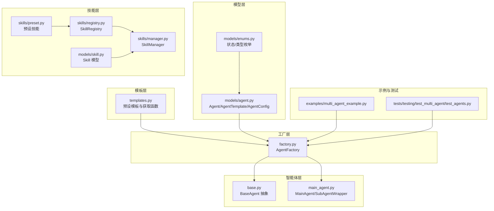
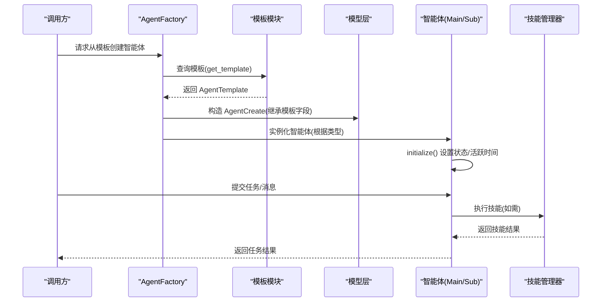
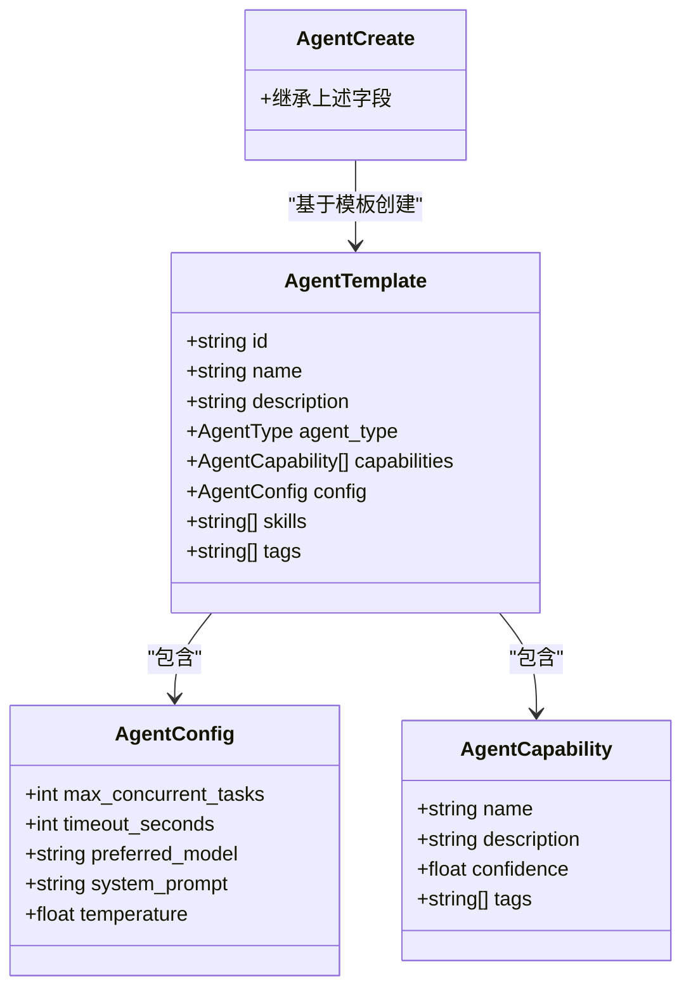
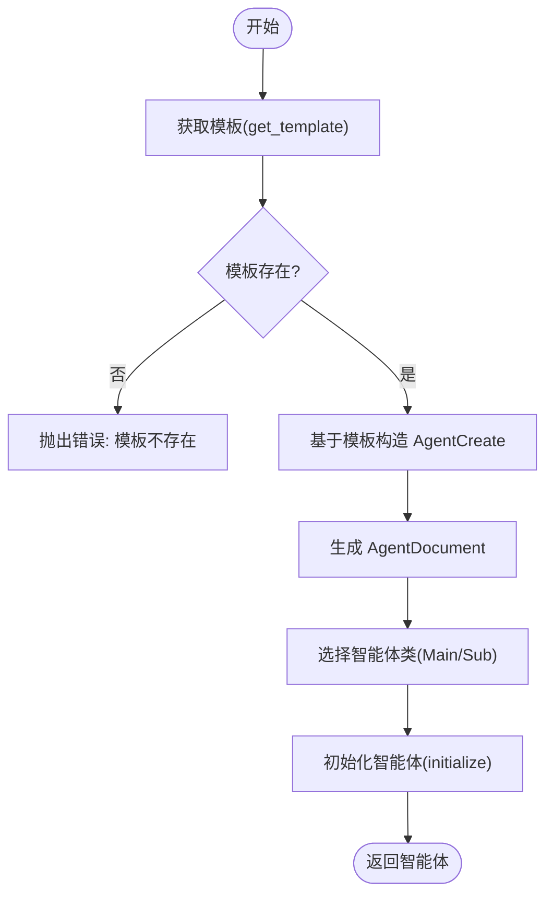
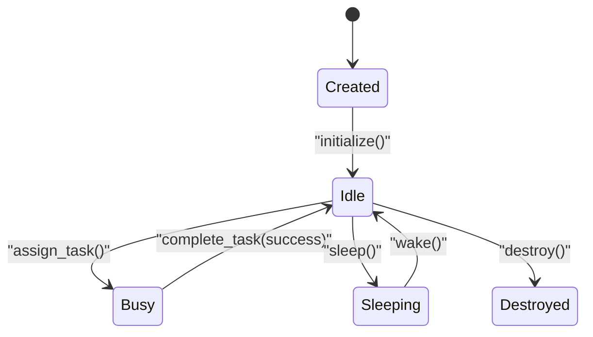
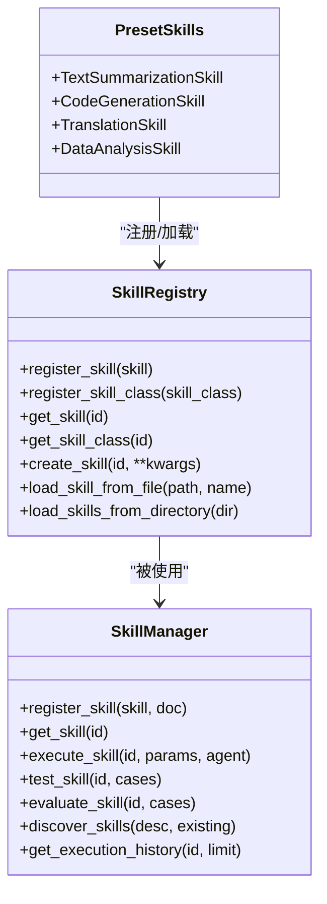
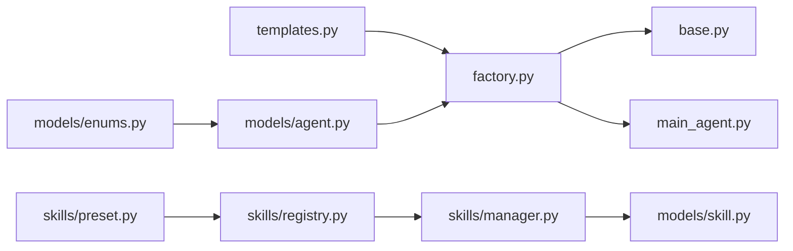

# 智能体模板

<cite>
**本文引用的文件**   
- [src/taolib/testing/multi_agent/agents/templates.py](file://src/taolib/testing/multi_agent/agents/templates.py)
- [src/taolib/testing/multi_agent/agents/factory.py](file://src/taolib/testing/multi_agent/agents/factory.py)
- [src/taolib/testing/multi_agent/agents/base.py](file://src/taolib/testing/multi_agent/agents/base.py)
- [src/taolib/testing/multi_agent/agents/main_agent.py](file://src/taolib/testing/multi_agent/agents/main_agent.py)
- [src/taolib/testing/multi_agent/models/agent.py](file://src/taolib/testing/multi_agent/models/agent.py)
- [src/taolib/testing/multi_agent/models/enums.py](file://src/taolib/testing/multi_agent/models/enums.py)
- [src/taolib/testing/multi_agent/skills/registry.py](file://src/taolib/testing/multi_agent/skills/registry.py)
- [src/taolib/testing/multi_agent/skills/preset.py](file://src/taolib/testing/multi_agent/skills/preset.py)
- [src/taolib/testing/multi_agent/skills/manager.py](file://src/taolib/testing/multi_agent/skills/manager.py)
- [src/taolib/testing/multi_agent/models/skill.py](file://src/taolib/testing/multi_agent/models/skill.py)
- [examples/multi_agent_example.py](file://examples/multi_agent_example.py)
- [tests/testing/test_multi_agent/test_agents.py](file://tests/testing/test_multi_agent/test_agents.py)
</cite>

## 目录
1. [简介](#简介)
2. [项目结构](#项目结构)
3. [核心组件](#核心组件)
4. [架构总览](#架构总览)
5. [详细组件分析](#详细组件分析)
6. [依赖分析](#依赖分析)
7. [性能考量](#性能考量)
8. [故障排查指南](#故障排查指南)
9. [结论](#结论)
10. [附录](#附录)

## 简介
本文件面向“智能体模板系统”的技术文档，聚焦于模板定义、参数化配置、模板继承与扩展、模板注册与实例化流程、模板参数类型系统与默认值机制、版本与兼容性处理、以及开发最佳实践与常见配置模式。文档同时提供模板使用示例与序列图、类图等可视化说明，帮助开发者快速理解并高效使用该系统。

## 项目结构
智能体模板系统位于多智能体子系统内，围绕“模板-工厂-智能体”三层结构组织，配合“技能”体系与“LLM 管理器”协同工作。关键模块如下：
- 模板层：预设模板与模板工具函数，提供标准化的 AgentTemplate 定义与获取逻辑
- 工厂层：AgentFactory 负责模板注册、模板解析与智能体实例化
- 智能体层：BaseAgent 抽象基类与 MainAgent/SubAgentWrapper 实现具体行为
- 数据模型层：Agent/AgentTemplate/AgentConfig 等 Pydantic 模型定义
- 技能层：SkillRegistry/SkillManager/Skill 系列，支撑模板中声明的技能加载与执行

**图表来源**
- [src/taolib/testing/multi_agent/agents/templates.py:1-309](file://src/taolib/testing/multi_agent/agents/templates.py#L1-L309)
- [src/taolib/testing/multi_agent/agents/factory.py:1-220](file://src/taolib/testing/multi_agent/agents/factory.py#L1-L220)
- [src/taolib/testing/multi_agent/agents/base.py:1-204](file://src/taolib/testing/multi_agent/agents/base.py#L1-L204)
- [src/taolib/testing/multi_agent/agents/main_agent.py:1-472](file://src/taolib/testing/multi_agent/agents/main_agent.py#L1-L472)
- [src/taolib/testing/multi_agent/models/agent.py:1-129](file://src/taolib/testing/multi_agent/models/agent.py#L1-L129)
- [src/taolib/testing/multi_agent/models/enums.py:1-96](file://src/taolib/testing/multi_agent/models/enums.py#L1-L96)
- [src/taolib/testing/multi_agent/skills/registry.py:1-247](file://src/taolib/testing/multi_agent/skills/registry.py#L1-L247)
- [src/taolib/testing/multi_agent/skills/manager.py:1-404](file://src/taolib/testing/multi_agent/skills/manager.py#L1-L404)
- [src/taolib/testing/multi_agent/skills/preset.py:1-217](file://src/taolib/testing/multi_agent/skills/preset.py#L1-L217)
- [src/taolib/testing/multi_agent/models/skill.py:1-142](file://src/taolib/testing/multi_agent/models/skill.py#L1-L142)
- [examples/multi_agent_example.py:1-196](file://examples/multi_agent_example.py#L1-L196)
- [tests/testing/test_multi_agent/test_agents.py:1-267](file://tests/testing/test_multi_agent/test_agents.py#L1-L267)

**章节来源**
- [src/taolib/testing/multi_agent/agents/templates.py:1-309](file://src/taolib/testing/multi_agent/agents/templates.py#L1-L309)
- [src/taolib/testing/multi_agent/agents/factory.py:1-220](file://src/taolib/testing/multi_agent/agents/factory.py#L1-L220)
- [src/taolib/testing/multi_agent/agents/base.py:1-204](file://src/taolib/testing/multi_agent/agents/base.py#L1-L204)
- [src/taolib/testing/multi_agent/agents/main_agent.py:1-472](file://src/taolib/testing/multi_agent/agents/main_agent.py#L1-L472)
- [src/taolib/testing/multi_agent/models/agent.py:1-129](file://src/taolib/testing/multi_agent/models/agent.py#L1-L129)
- [src/taolib/testing/multi_agent/models/enums.py:1-96](file://src/taolib/testing/multi_agent/models/enums.py#L1-L96)
- [src/taolib/testing/multi_agent/skills/registry.py:1-247](file://src/taolib/testing/multi_agent/skills/registry.py#L1-L247)
- [src/taolib/testing/multi_agent/skills/manager.py:1-404](file://src/taolib/testing/multi_agent/skills/manager.py#L1-L404)
- [src/taolib/testing/multi_agent/skills/preset.py:1-217](file://src/taolib/testing/multi_agent/skills/preset.py#L1-L217)
- [src/taolib/testing/multi_agent/models/skill.py:1-142](file://src/taolib/testing/multi_agent/models/skill.py#L1-L142)
- [examples/multi_agent_example.py:1-196](file://examples/multi_agent_example.py#L1-L196)
- [tests/testing/test_multi_agent/test_agents.py:1-267](file://tests/testing/test_multi_agent/test_agents.py#L1-L267)

## 核心组件
- 模板定义与获取
  - 预设模板：在模板模块中定义多个标准 AgentTemplate，覆盖代码助手、写作助手、数据分析、研究助手、通用助手等场景
  - 模板获取：提供按 ID 获取与批量获取函数，便于工厂与上层调用
- 工厂与实例化
  - AgentFactory：内置默认模板注册；支持注册新模板；从模板创建智能体；创建主智能体
  - 实例化流程：将模板映射为 AgentCreate，再构建 AgentDocument，最终实例化具体智能体类
- 智能体抽象与实现
  - BaseAgent：定义生命周期、消息收发、任务分配/完成、休眠/唤醒/销毁等抽象接口
  - MainAgent/SubAgentWrapper：主智能体负责任务分析、子任务分解与结果聚合；子包装器负责基于 LLM 的任务执行
- 数据模型与参数系统
  - AgentTemplate/AgentConfig/AgentCapability：模板、配置与能力的结构化定义
  - 参数类型与默认值：通过 Pydantic 字段的类型、默认值与约束控制参数合法性
- 技能体系
  - SkillRegistry/SkillManager：技能注册、加载、执行、评估与发现
  - 预设技能：文本摘要、代码生成、翻译、数据分析等常用技能

**章节来源**
- [src/taolib/testing/multi_agent/agents/templates.py:14-309](file://src/taolib/testing/multi_agent/agents/templates.py#L14-L309)
- [src/taolib/testing/multi_agent/agents/factory.py:27-220](file://src/taolib/testing/multi_agent/agents/factory.py#L27-L220)
- [src/taolib/testing/multi_agent/agents/base.py:21-204](file://src/taolib/testing/multi_agent/agents/base.py#L21-L204)
- [src/taolib/testing/multi_agent/agents/main_agent.py:104-472](file://src/taolib/testing/multi_agent/agents/main_agent.py#L104-L472)
- [src/taolib/testing/multi_agent/models/agent.py:15-129](file://src/taolib/testing/multi_agent/models/agent.py#L15-L129)
- [src/taolib/testing/multi_agent/skills/registry.py:16-247](file://src/taolib/testing/multi_agent/skills/registry.py#L16-L247)
- [src/taolib/testing/multi_agent/skills/manager.py:29-404](file://src/taolib/testing/multi_agent/skills/manager.py#L29-L404)
- [src/taolib/testing/multi_agent/skills/preset.py:12-217](file://src/taolib/testing/multi_agent/skills/preset.py#L12-L217)

## 架构总览
下图展示了从模板到智能体实例化的端到端流程，以及与技能系统的交互：

**图表来源**
- [src/taolib/testing/multi_agent/agents/factory.py:120-151](file://src/taolib/testing/multi_agent/agents/factory.py#L120-L151)
- [src/taolib/testing/multi_agent/agents/templates.py:264-295](file://src/taolib/testing/multi_agent/agents/templates.py#L264-L295)
- [src/taolib/testing/multi_agent/models/agent.py:62-129](file://src/taolib/testing/multi_agent/models/agent.py#L62-L129)
- [src/taolib/testing/multi_agent/skills/manager.py:110-175](file://src/taolib/testing/multi_agent/skills/manager.py#L110-L175)

## 详细组件分析

### 组件一：模板定义与参数系统
- 设计要点
  - 模板以 AgentTemplate 为核心，包含 id/name/description/agent_type/capabilities/config/skills/tags 等字段
  - AgentConfig 提供 max_concurrent_tasks、timeout_seconds、preferred_model、system_prompt、temperature 等配置项
  - AgentCapability 支持 confidence 与 tags，便于能力匹配与排序
- 参数类型与默认值
  - 通过 Pydantic 字段的 type、default、ge/le、min_length/max_length、alias 等约束，确保参数合法与一致
  - 温度、置信度等数值参数具备范围约束，避免非法配置
- 模板继承与扩展
  - 通过 AgentCreate 继承模板字段，可在创建时覆盖部分字段，实现“轻量继承”
  - skills/tags/capabilities 可增量补充，不强制替换

**图表来源**
- [src/taolib/testing/multi_agent/models/agent.py:15-129](file://src/taolib/testing/multi_agent/models/agent.py#L15-L129)

**章节来源**
- [src/taolib/testing/multi_agent/models/agent.py:15-129](file://src/taolib/testing/multi_agent/models/agent.py#L15-L129)
- [src/taolib/testing/multi_agent/models/enums.py:9-96](file://src/taolib/testing/multi_agent/models/enums.py#L9-L96)

### 组件二：模板注册与工厂实例化
- 模板注册
  - 工厂启动时加载默认模板集合，并维护模板字典；支持外部注册新模板
- 实例化流程
  - create_agent_from_template：根据模板 ID 获取模板，构造 AgentCreate，再调用 create_agent
  - create_agent：生成 AgentDocument，选择智能体类（Main/Sub），初始化后返回
- 错误处理
  - 模板不存在时抛出 AgentError
  - 智能体忙碌状态下禁止再次分配任务

**图表来源**
- [src/taolib/testing/multi_agent/agents/factory.py:120-151](file://src/taolib/testing/multi_agent/agents/factory.py#L120-L151)
- [src/taolib/testing/multi_agent/agents/factory.py:74-119](file://src/taolib/testing/multi_agent/agents/factory.py#L74-L119)

**章节来源**
- [src/taolib/testing/multi_agent/agents/factory.py:27-220](file://src/taolib/testing/multi_agent/agents/factory.py#L27-L220)
- [tests/testing/test_multi_agent/test_agents.py:169-209](file://tests/testing/test_multi_agent/test_agents.py#L169-L209)

### 组件三：智能体生命周期与任务执行
- 生命周期
  - initialize：设置状态为空闲，记录活跃时间
  - sleep/wake：休眠与唤醒，禁止在忙碌时休眠
  - destroy：销毁前完成未完成任务并清理状态
- 任务执行
  - BaseAgent：抽象 assign_task/complete_task/_handle_message/send/receive
  - MainAgent：任务分析、子任务分解、子智能体调度、结果聚合
  - SubAgentWrapper：基于 LLM 执行任务，封装生成调用与结果封装

**图表来源**
- [src/taolib/testing/multi_agent/agents/base.py:60-204](file://src/taolib/testing/multi_agent/agents/base.py#L60-L204)
- [src/taolib/testing/multi_agent/agents/main_agent.py:104-472](file://src/taolib/testing/multi_agent/agents/main_agent.py#L104-L472)

**章节来源**
- [src/taolib/testing/multi_agent/agents/base.py:21-204](file://src/taolib/testing/multi_agent/agents/base.py#L21-L204)
- [src/taolib/testing/multi_agent/agents/main_agent.py:104-472](file://src/taolib/testing/multi_agent/agents/main_agent.py#L104-L472)

### 组件四：技能系统与模板集成
- 技能注册与加载
  - SkillRegistry：支持注册技能实例/类、从文件/目录加载、查询与注销
- 技能管理与执行
  - SkillManager：统一执行、测试、评估、发现技能；记录执行历史
- 预设技能
  - 提供文本摘要、代码生成、翻译、数据分析等技能，具备参数定义与默认值
- 与模板的关系
  - 模板可声明 skills 列表，工厂在创建智能体时将技能ID注入，后续由技能管理器统一调度

**图表来源**
- [src/taolib/testing/multi_agent/skills/registry.py:16-247](file://src/taolib/testing/multi_agent/skills/registry.py#L16-L247)
- [src/taolib/testing/multi_agent/skills/manager.py:29-404](file://src/taolib/testing/multi_agent/skills/manager.py#L29-L404)
- [src/taolib/testing/multi_agent/skills/preset.py:12-217](file://src/taolib/testing/multi_agent/skills/preset.py#L12-L217)

**章节来源**
- [src/taolib/testing/multi_agent/skills/registry.py:16-247](file://src/taolib/testing/multi_agent/skills/registry.py#L16-L247)
- [src/taolib/testing/multi_agent/skills/manager.py:29-404](file://src/taolib/testing/multi_agent/skills/manager.py#L29-L404)
- [src/taolib/testing/multi_agent/skills/preset.py:12-217](file://src/taolib/testing/multi_agent/skills/preset.py#L12-L217)

### 组件五：示例与使用模式
- 示例程序展示了：
  - 技能管理器的使用：注册预设技能、执行技能
  - 智能体工厂：列出模板、从模板创建智能体、创建主智能体
  - LLM 管理器：添加模型、轮询策略、查询可用模型
- 常见配置模式
  - 代码助手：高置信度能力组合 + 较低 temperature，强调稳定输出
  - 写作助手：较高 temperature，强调创造性输出
  - 数据分析：强调系统提示词与数据处理能力
  - 通用助手：多能力均衡，适合兜底场景

**章节来源**
- [examples/multi_agent_example.py:1-196](file://examples/multi_agent_example.py#L1-L196)
- [src/taolib/testing/multi_agent/agents/templates.py:14-309](file://src/taolib/testing/multi_agent/agents/templates.py#L14-L309)

## 依赖分析
- 模块耦合
  - 工厂依赖模板模块与模型层；智能体实现依赖工厂提供的 LLM 管理器
  - 技能管理器依赖注册表与 LLM 管理器；预设技能作为注册表的输入
- 外部依赖
  - Pydantic 用于模型定义与参数校验
  - 异步框架用于主智能体的事件循环与子任务并发执行
- 循环依赖
  - 当前模块间无明显循环导入；模板与工厂通过函数式接口解耦

**图表来源**
- [src/taolib/testing/multi_agent/agents/templates.py:1-309](file://src/taolib/testing/multi_agent/agents/templates.py#L1-L309)
- [src/taolib/testing/multi_agent/agents/factory.py:1-220](file://src/taolib/testing/multi_agent/agents/factory.py#L1-L220)
- [src/taolib/testing/multi_agent/agents/base.py:1-204](file://src/taolib/testing/multi_agent/agents/base.py#L1-L204)
- [src/taolib/testing/multi_agent/agents/main_agent.py:1-472](file://src/taolib/testing/multi_agent/agents/main_agent.py#L1-L472)
- [src/taolib/testing/multi_agent/models/agent.py:1-129](file://src/taolib/testing/multi_agent/models/agent.py#L1-L129)
- [src/taolib/testing/multi_agent/models/enums.py:1-96](file://src/taolib/testing/multi_agent/models/enums.py#L1-L96)
- [src/taolib/testing/multi_agent/skills/registry.py:1-247](file://src/taolib/testing/multi_agent/skills/registry.py#L1-L247)
- [src/taolib/testing/multi_agent/skills/manager.py:1-404](file://src/taolib/testing/multi_agent/skills/manager.py#L1-L404)
- [src/taolib/testing/multi_agent/skills/preset.py:1-217](file://src/taolib/testing/multi_agent/skills/preset.py#L1-L217)
- [src/taolib/testing/multi_agent/models/skill.py:1-142](file://src/taolib/testing/multi_agent/models/skill.py#L1-L142)

**章节来源**
- [src/taolib/testing/multi_agent/agents/factory.py:1-220](file://src/taolib/testing/multi_agent/agents/factory.py#L1-L220)
- [src/taolib/testing/multi_agent/agents/main_agent.py:1-472](file://src/taolib/testing/multi_agent/agents/main_agent.py#L1-L472)
- [src/taolib/testing/multi_agent/skills/manager.py:1-404](file://src/taolib/testing/multi_agent/skills/manager.py#L1-L404)

## 性能考量
- 并发与资源
  - 模板与工厂采用内存字典缓存，查询与注册开销低
  - 主智能体内部使用事件循环与任务队列，避免阻塞；子任务并发执行需结合 LLM 管理器的负载均衡策略
- 参数校验与默认值
  - 通过 Pydantic 约束减少运行期错误与无效配置带来的性能损耗
- 日志与可观测性
  - 主智能体循环与异常处理包含日志记录，便于定位性能瓶颈与异常路径

[本节为通用指导，无需特定文件引用]

## 故障排查指南
- 模板不存在
  - 现象：从模板创建智能体时报错
  - 排查：确认模板 ID 正确；检查工厂是否已注册模板；查看模板获取函数返回值
- 智能体忙碌
  - 现象：assign_task 抛出忙碌错误
  - 排查：确认智能体状态；等待任务完成后再分配新任务
- 技能执行失败
  - 现象：execute_skill 抛出参数无效或执行异常
  - 排查：核对技能参数定义与默认值；检查技能是否存在；查看执行历史记录
- LLM 不可用
  - 现象：子智能体执行任务失败
  - 排查：检查 LLM 管理器可用模型列表与负载均衡配置

**章节来源**
- [src/taolib/testing/multi_agent/agents/factory.py:136-139](file://src/taolib/testing/multi_agent/agents/factory.py#L136-L139)
- [src/taolib/testing/multi_agent/agents/base.py:118-119](file://src/taolib/testing/multi_agent/agents/base.py#L118-L119)
- [src/taolib/testing/multi_agent/skills/manager.py:134-137](file://src/taolib/testing/multi_agent/skills/manager.py#L134-L137)
- [src/taolib/testing/multi_agent/agents/main_agent.py:84-98](file://src/taolib/testing/multi_agent/agents/main_agent.py#L84-L98)

## 结论
智能体模板系统通过“模板-工厂-智能体-技能”一体化设计，提供了标准化、可扩展、易维护的智能体创建与管理能力。模板参数的类型系统与默认值机制保证了配置一致性与安全性；工厂的实例化流程与主智能体的任务编排能力使得复杂任务可被拆解与并行执行。结合技能体系，系统能够灵活地扩展能力并进行自动化评估与发现。建议在生产环境中配合完善的日志、监控与版本治理策略，持续提升稳定性与可维护性。

[本节为总结，无需特定文件引用]

## 附录

### 最佳实践
- 模板设计
  - 明确 AgentType（MAIN/SUB/SPECIALIZED）与 capabilities 的边界
  - 为模板提供清晰的 system_prompt 与 temperature 配置
  - 使用 tags 与 description 提升模板可发现性
- 参数与默认值
  - 优先使用 Pydantic 约束定义参数范围与必填项
  - 对动态参数（如 temperature）提供合理默认值与上下限
- 版本与兼容
  - 在 AgentTemplate 中显式维护版本字段，变更时遵循向后兼容策略
  - 对废弃模板与技能及时标注状态并提供迁移指引
- 性能优化
  - 控制 max_concurrent_tasks 与 timeout_seconds，避免资源争用
  - 使用 LLM 管理器的负载均衡策略，避免热点模型过载
- 可维护性
  - 将模板与技能分离，模板仅描述“做什么”，技能实现“怎么做”
  - 为关键流程（任务分析、子任务分解、结果聚合）提供日志与指标

[本节为通用指导，无需特定文件引用]

### 常见配置模式
- 代码助手：高置信度能力 + 适中 temperature，强调系统提示词与稳定性
- 写作助手：较高 temperature，强调创造性输出与风格适配
- 数据分析：明确系统提示词与数据处理能力，适合批量化任务
- 通用助手：多能力均衡，适合兜底与多意图场景

**章节来源**
- [src/taolib/testing/multi_agent/agents/templates.py:14-309](file://src/taolib/testing/multi_agent/agents/templates.py#L14-L309)
- [examples/multi_agent_example.py:1-196](file://examples/multi_agent_example.py#L1-L196)