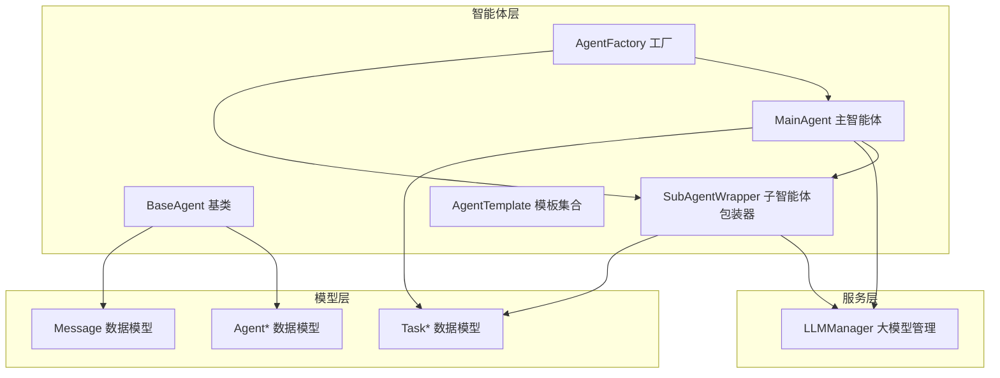
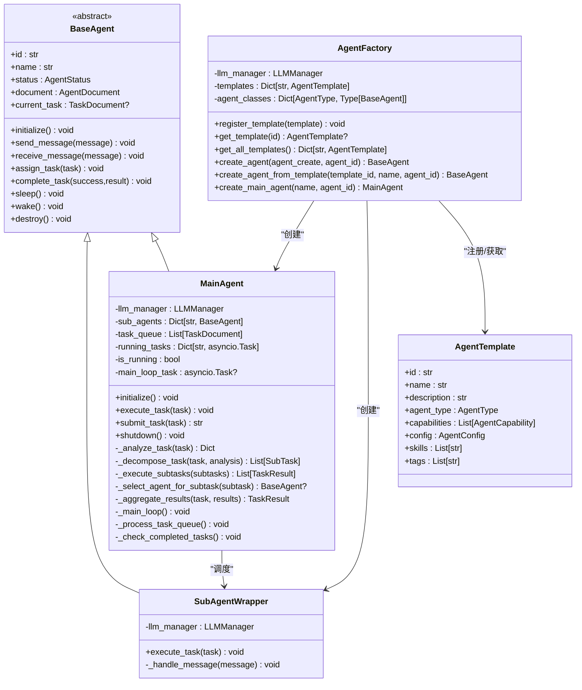
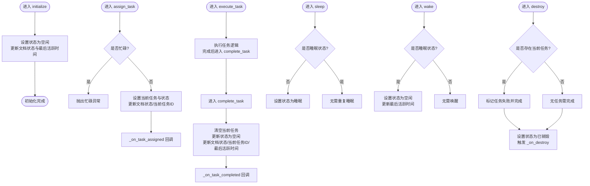
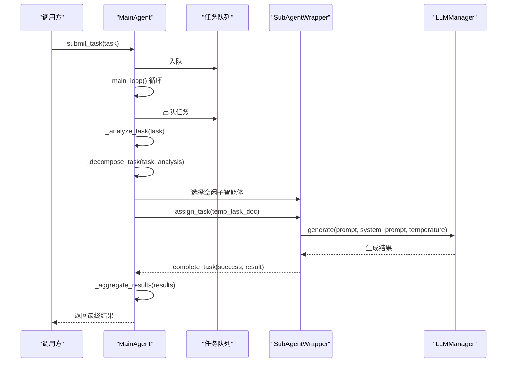
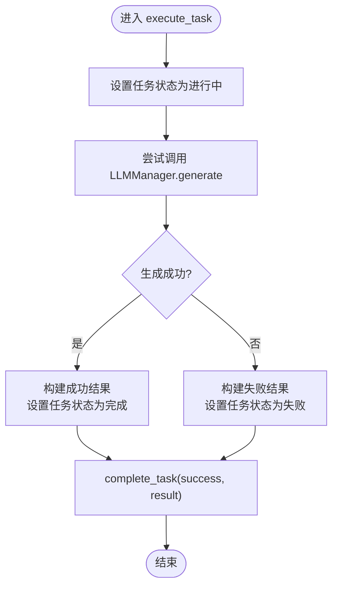
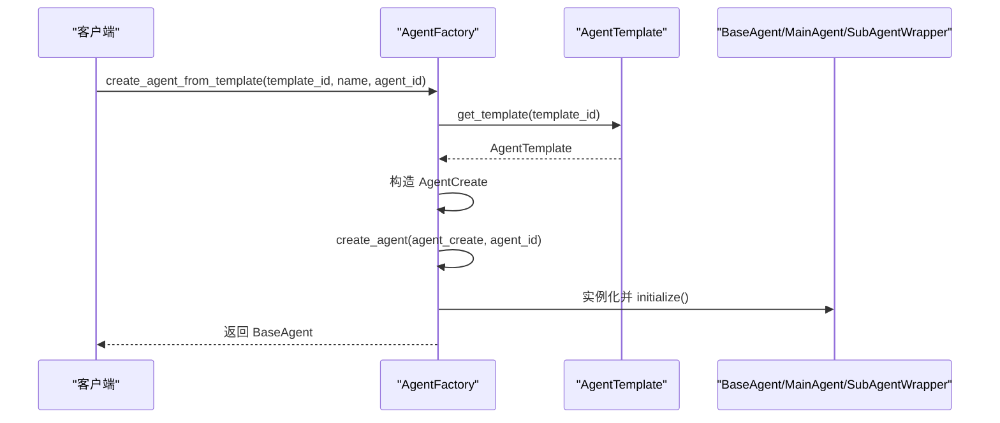
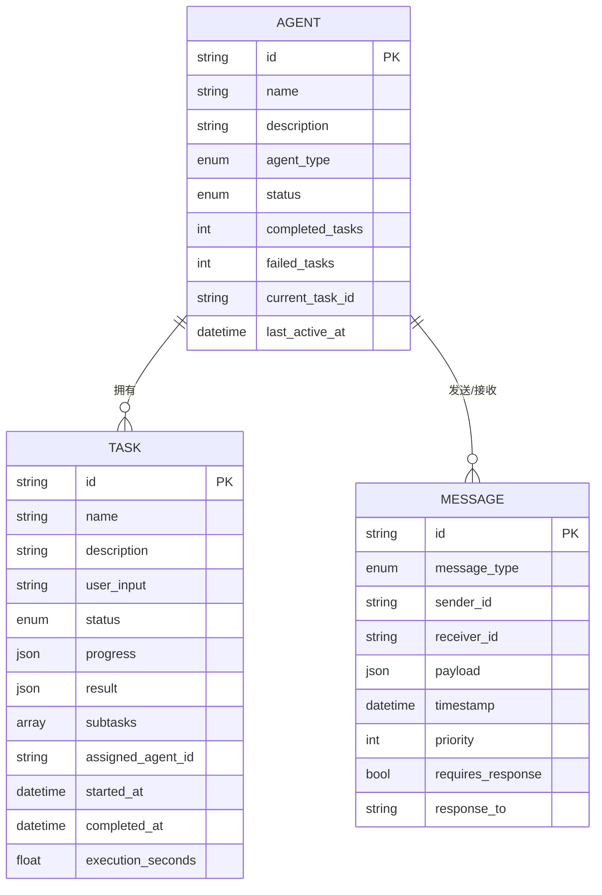
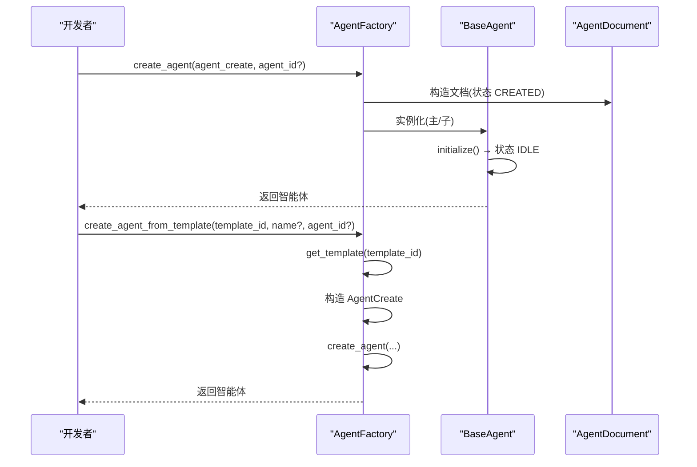
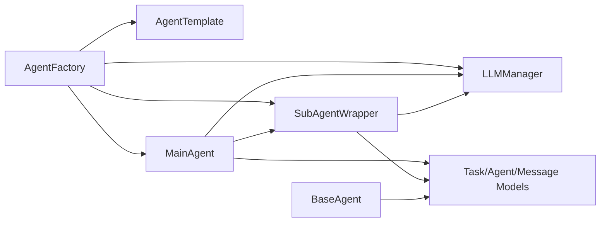

# 智能体管理

<cite>
**本文引用的文件**
- [src/taolib/testing/multi_agent/agents/base.py](file://src/taolib/testing/multi_agent/agents/base.py)
- [src/taolib/testing/multi_agent/agents/factory.py](file://src/taolib/testing/multi_agent/agents/factory.py)
- [src/taolib/testing/multi_agent/agents/main_agent.py](file://src/taolib/testing/multi_agent/agents/main_agent.py)
- [src/taolib/testing/multi_agent/agents/templates.py](file://src/taolib/testing/multi_agent/agents/templates.py)
- [src/taolib/testing/multi_agent/models/agent.py](file://src/taolib/testing/multi_agent/models/agent.py)
- [src/taolib/testing/multi_agent/models/task.py](file://src/taolib/testing/multi_agent/models/task.py)
- [src/taolib/testing/multi_agent/models/message.py](file://src/taolib/testing/multi_agent/models/message.py)
- [src/taolib/testing/multi_agent/errors.py](file://src/taolib/testing/multi_agent/errors.py)
</cite>

## 目录
1. [简介](#简介)
2. [项目结构](#项目结构)
3. [核心组件](#核心组件)
4. [架构总览](#架构总览)
5. [详细组件分析](#详细组件分析)
6. [依赖分析](#依赖分析)
7. [性能考虑](#性能考虑)
8. [故障排查指南](#故障排查指南)
9. [结论](#结论)
10. [附录](#附录)

## 简介
本技术文档围绕智能体管理系统展开，重点阐述多智能体系统的工厂模式设计与实现，涵盖基类抽象、主智能体与子智能体包装器的架构、智能体模板系统、生命周期与状态跟踪、创建/配置/销毁流程、智能体间通信协议与协调机制、冲突解决策略，以及管理API的完整参考。文档旨在帮助开发者在不直接阅读源码的情况下，快速理解并扩展该智能体管理框架。

## 项目结构
多智能体模块位于 src/taolib/testing/multi_agent 下，采用按功能域分层组织：
- agents：智能体实现（基类、工厂、主智能体、模板）
- models：数据模型（智能体、任务、消息等）
- errors：错误类型定义
- llm：大模型管理（与智能体协作）
- skills：技能系统（预留）

**图示来源**
- [src/taolib/testing/multi_agent/agents/base.py:21-204](file://src/taolib/testing/multi_agent/agents/base.py#L21-L204)
- [src/taolib/testing/multi_agent/agents/main_agent.py:104-472](file://src/taolib/testing/multi_agent/agents/main_agent.py#L104-L472)
- [src/taolib/testing/multi_agent/agents/factory.py:27-220](file://src/taolib/testing/multi_agent/agents/factory.py#L27-L220)
- [src/taolib/testing/multi_agent/agents/templates.py:1-309](file://src/taolib/testing/multi_agent/agents/templates.py#L1-L309)
- [src/taolib/testing/multi_agent/models/agent.py:15-129](file://src/taolib/testing/multi_agent/models/agent.py#L15-L129)
- [src/taolib/testing/multi_agent/models/task.py:15-143](file://src/taolib/testing/multi_agent/models/task.py#L15-L143)
- [src/taolib/testing/multi_agent/models/message.py:14-36](file://src/taolib/testing/multi_agent/models/message.py#L14-L36)

**章节来源**
- [src/taolib/testing/multi_agent/agents/base.py:1-204](file://src/taolib/testing/multi_agent/agents/base.py#L1-L204)
- [src/taolib/testing/multi_agent/agents/main_agent.py:1-472](file://src/taolib/testing/multi_agent/agents/main_agent.py#L1-L472)
- [src/taolib/testing/multi_agent/agents/factory.py:1-220](file://src/taolib/testing/multi_agent/agents/factory.py#L1-L220)
- [src/taolib/testing/multi_agent/agents/templates.py:1-309](file://src/taolib/testing/multi_agent/agents/templates.py#L1-L309)
- [src/taolib/testing/multi_agent/models/agent.py:1-129](file://src/taolib/testing/multi_agent/models/agent.py#L1-L129)
- [src/taolib/testing/multi_agent/models/task.py:1-143](file://src/taolib/testing/multi_agent/models/task.py#L1-L143)
- [src/taolib/testing/multi_agent/models/message.py:1-36](file://src/taolib/testing/multi_agent/models/message.py#L1-L36)

## 核心组件
- BaseAgent 抽象基类：定义智能体统一接口与生命周期钩子，包括初始化、消息收发、任务分配/完成、休眠/唤醒、销毁等。
- MainAgent 主智能体：负责任务分析、子任务分解、子智能体调度与结果聚合，并维护主循环与子智能体集合。
- SubAgentWrapper 子智能体包装器：封装具体子智能体行为，通过 LLMManager 执行任务。
- AgentFactory 智能体工厂：集中管理模板注册与智能体创建，支持从模板创建与直接创建两种方式。
- AgentTemplate 模板系统：提供多种预设模板，便于快速创建专用子智能体。
- 数据模型：Agent*、Task*、Message* 等 Pydantic 模型，支撑跨层数据流转。
- 错误体系：MultiAgentError 及其子类，覆盖 LLM、Agent、Task、Skill、Message、Security 等领域。

**章节来源**
- [src/taolib/testing/multi_agent/agents/base.py:21-204](file://src/taolib/testing/multi_agent/agents/base.py#L21-L204)
- [src/taolib/testing/multi_agent/agents/main_agent.py:104-472](file://src/taolib/testing/multi_agent/agents/main_agent.py#L104-L472)
- [src/taolib/testing/multi_agent/agents/factory.py:27-220](file://src/taolib/testing/multi_agent/agents/factory.py#L27-L220)
- [src/taolib/testing/multi_agent/agents/templates.py:1-309](file://src/taolib/testing/multi_agent/agents/templates.py#L1-L309)
- [src/taolib/testing/multi_agent/models/agent.py:15-129](file://src/taolib/testing/multi_agent/models/agent.py#L15-L129)
- [src/taolib/testing/multi_agent/models/task.py:15-143](file://src/taolib/testing/multi_agent/models/task.py#L15-L143)
- [src/taolib/testing/multi_agent/models/message.py:14-36](file://src/taolib/testing/multi_agent/models/message.py#L14-L36)
- [src/taolib/testing/multi_agent/errors.py:7-107](file://src/taolib/testing/multi_agent/errors.py#L7-L107)

## 架构总览
智能体系统采用“工厂 + 模板 + 基类抽象 + 主从协作”的架构：
- 工厂负责创建与配置智能体，支持模板驱动与直接创建。
- 主智能体承担任务编排与子智能体调度；子智能体包装器负责具体执行。
- 数据模型贯穿各层，确保状态与消息的一致性。
- 错误体系提供统一的异常语义，便于上层处理。

**图示来源**
- [src/taolib/testing/multi_agent/agents/base.py:21-204](file://src/taolib/testing/multi_agent/agents/base.py#L21-L204)
- [src/taolib/testing/multi_agent/agents/main_agent.py:35-472](file://src/taolib/testing/multi_agent/agents/main_agent.py#L35-L472)
- [src/taolib/testing/multi_agent/agents/factory.py:27-220](file://src/taolib/testing/multi_agent/agents/factory.py#L27-L220)
- [src/taolib/testing/multi_agent/agents/templates.py:34-309](file://src/taolib/testing/multi_agent/agents/templates.py#L34-L309)

## 详细组件分析

### BaseAgent 基类
- 设计要点
  - 统一接口：initialize、send_message、receive_message、assign_task、complete_task、sleep、wake、destroy。
  - 生命周期钩子：_on_message_sent、_on_task_assigned、_on_task_completed、_on_destroy。
  - 状态管理：内部状态与文档状态同步，记录最近活跃时间、当前任务ID、完成/失败任务计数。
  - 异常控制：忙碌状态下禁止休眠，避免竞态。
- 关键流程
  - 任务分配：检查状态，更新当前任务与状态，触发回调。
  - 任务完成：根据成功与否更新任务与文档状态，清理当前任务并更新活跃时间。
  - 销毁：若存在未完成任务，标记失败并销毁。

**图示来源**
- [src/taolib/testing/multi_agent/agents/base.py:60-204](file://src/taolib/testing/multi_agent/agents/base.py#L60-L204)

**章节来源**
- [src/taolib/testing/multi_agent/agents/base.py:21-204](file://src/taolib/testing/multi_agent/agents/base.py#L21-L204)

### MainAgent 主智能体
- 设计要点
  - 主循环：周期性处理任务队列、检查已完成任务、异步调度与等待。
  - 任务编排：分析任务、分解子任务、选择子智能体、执行子任务、聚合结果。
  - 默认子智能体：启动时基于模板创建一组默认子智能体。
  - 协调与通信：通过消息类型感知子任务完成/错误事件。
- 关键流程
  - submit_task：将任务加入队列并返回任务ID。
  - execute_task：完整生命周期的编排，包含分析、分解、调度、执行、聚合与完成。
  - shutdown：停止主循环，关闭所有子智能体并销毁自身。

**图示来源**
- [src/taolib/testing/multi_agent/agents/main_agent.py:162-282](file://src/taolib/testing/multi_agent/agents/main_agent.py#L162-L282)
- [src/taolib/testing/multi_agent/agents/main_agent.py:355-405](file://src/taolib/testing/multi_agent/agents/main_agent.py#L355-L405)

**章节来源**
- [src/taolib/testing/multi_agent/agents/main_agent.py:104-472](file://src/taolib/testing/multi_agent/agents/main_agent.py#L104-L472)

### SubAgentWrapper 子智能体包装器
- 设计要点
  - 专注执行：通过 LLMManager 生成结果，封装任务状态与结果。
  - 错误处理：捕获模型不可用与通用异常，设置失败状态与错误信息。
- 关键流程
  - execute_task：设置进行中状态，调用 LLM 生成，封装 TaskResult 并完成任务。

**图示来源**
- [src/taolib/testing/multi_agent/agents/main_agent.py:56-102](file://src/taolib/testing/multi_agent/agents/main_agent.py#L56-L102)

**章节来源**
- [src/taolib/testing/multi_agent/agents/main_agent.py:35-102](file://src/taolib/testing/multi_agent/agents/main_agent.py#L35-L102)

### AgentFactory 智能体工厂
- 设计要点
  - 注册模板：支持动态注册与查询模板。
  - 创建策略：支持直接创建与模板创建；默认类型映射 MAIN → MainAgent，SUB → SubAgentWrapper。
  - 全局工厂：提供全局实例与替换接口，便于测试与集成。
- 关键流程
  - create_agent：生成文档、选择类、初始化并返回智能体。
  - create_agent_from_template：基于模板构造 AgentCreate 并委托 create_agent。
  - create_main_agent：使用通用模板创建主智能体。

**图示来源**
- [src/taolib/testing/multi_agent/agents/factory.py:120-151](file://src/taolib/testing/multi_agent/agents/factory.py#L120-L151)
- [src/taolib/testing/multi_agent/agents/factory.py:74-118](file://src/taolib/testing/multi_agent/agents/factory.py#L74-L118)

**章节来源**
- [src/taolib/testing/multi_agent/agents/factory.py:27-220](file://src/taolib/testing/multi_agent/agents/factory.py#L27-L220)

### 智能体模板系统
- 设计要点
  - 预设模板：代码助手、写作助手、数据分析、研究助手、通用助手等。
  - 模板字段：包含能力、配置、技能、标签等，便于快速装配。
  - 查询接口：按ID获取与获取全部模板。
- 使用场景
  - 快速创建专用子智能体，减少重复配置。
  - 作为 create_main_agent 的后备方案。

**章节来源**
- [src/taolib/testing/multi_agent/agents/templates.py:14-309](file://src/taolib/testing/multi_agent/agents/templates.py#L14-L309)

### 数据模型与状态跟踪
- Agent* 模型族：Base、Create、Response、Document，支持 API 层与持久化层转换。
- Task* 模型族：TaskBase、TaskCreate、TaskResponse、TaskDocument，包含进度、结果、子任务等。
- Message 模型：消息类型、载荷、优先级、响应链等，支撑主从通信。
- 状态枚举：AgentStatus、TaskStatus、MessageType 等，贯穿全链路。

**图示来源**
- [src/taolib/testing/multi_agent/models/agent.py:95-129](file://src/taolib/testing/multi_agent/models/agent.py#L95-L129)
- [src/taolib/testing/multi_agent/models/task.py:110-143](file://src/taolib/testing/multi_agent/models/task.py#L110-L143)
- [src/taolib/testing/multi_agent/models/message.py:24-36](file://src/taolib/testing/multi_agent/models/message.py#L24-L36)

**章节来源**
- [src/taolib/testing/multi_agent/models/agent.py:15-129](file://src/taolib/testing/multi_agent/models/agent.py#L15-L129)
- [src/taolib/testing/multi_agent/models/task.py:15-143](file://src/taolib/testing/multi_agent/models/task.py#L15-L143)
- [src/taolib/testing/multi_agent/models/message.py:14-36](file://src/taolib/testing/multi_agent/models/message.py#L14-L36)

### 智能体间通信协议与协调机制
- 消息类型：通过 MessageType 区分任务完成/错误等事件。
- 事件驱动：主智能体监听消息，感知子任务完成或错误，用于日志与可观测性。
- 协调策略：主智能体维护子智能体集合与任务队列，简单轮询式选择空闲子智能体执行子任务。
- 冲突解决：当前实现未见显式锁或仲裁机制，建议在扩展中引入优先级、资源配额与重试策略。

**章节来源**
- [src/taolib/testing/multi_agent/models/message.py:24-36](file://src/taolib/testing/multi_agent/models/message.py#L24-L36)
- [src/taolib/testing/multi_agent/agents/main_agent.py:196-210](file://src/taolib/testing/multi_agent/agents/main_agent.py#L196-L210)
- [src/taolib/testing/multi_agent/agents/main_agent.py:407-422](file://src/taolib/testing/multi_agent/agents/main_agent.py#L407-L422)

### 智能体生命周期管理与状态转换
- 生命周期阶段：CREATED → IDLE → BUSY → COMPLETED/FAILED → DESTROYED。
- 状态转换规则：分配任务 → BUSY；执行完成 → COMPLETED/FAILED；销毁 → DESTROYED；休眠 → SLEEPING；唤醒 → IDLE。
- 状态一致性：内部状态与文档状态同步更新，保证持久化与内存状态一致。

**章节来源**
- [src/taolib/testing/multi_agent/agents/base.py:60-198](file://src/taolib/testing/multi_agent/agents/base.py#L60-L198)
- [src/taolib/testing/multi_agent/models/agent.py:95-129](file://src/taolib/testing/multi_agent/models/agent.py#L95-L129)

### 智能体创建、配置与销毁流程
- 直接创建：AgentFactory.create_agent → 初始化 → 返回智能体。
- 模板创建：AgentFactory.create_agent_from_template → 构造 AgentCreate → 委托 create_agent。
- 主智能体创建：AgentFactory.create_main_agent → 优先使用模板，否则回退默认能力集 → 初始化 → 启动默认子智能体与主循环。
- 销毁：destroy → 若存在当前任务则标记失败 → 设置 DESTROYED → 触发回调。

**图示来源**
- [src/taolib/testing/multi_agent/agents/factory.py:74-151](file://src/taolib/testing/multi_agent/agents/factory.py#L74-L151)
- [src/taolib/testing/multi_agent/agents/base.py:60-65](file://src/taolib/testing/multi_agent/agents/base.py#L60-L65)

**章节来源**
- [src/taolib/testing/multi_agent/agents/factory.py:74-194](file://src/taolib/testing/multi_agent/agents/factory.py#L74-L194)
- [src/taolib/testing/multi_agent/agents/base.py:24-65](file://src/taolib/testing/multi_agent/agents/base.py#L24-L65)

## 依赖分析
- 组件耦合
  - MainAgent 依赖 SubAgentWrapper 与 LLMManager；两者均通过 BaseAgent 抽象耦合。
  - AgentFactory 依赖模板系统与 LLMManager，向外部暴露统一创建接口。
  - 模型层独立，仅通过 Pydantic 字段与校验，降低耦合。
- 外部依赖
  - LLMManager：负责模型调用与错误封装。
  - asyncio：主循环与异步任务管理。
  - Pydantic：数据模型序列化与验证。
- 潜在风险
  - 主循环内未见背压与限流，可能在高并发下造成资源争用。
  - 子任务执行为简化实现，建议替换为真正的异步执行与结果回调。

**图示来源**
- [src/taolib/testing/multi_agent/agents/factory.py:9-24](file://src/taolib/testing/multi_agent/agents/factory.py#L9-L24)
- [src/taolib/testing/multi_agent/agents/main_agent.py:12-30](file://src/taolib/testing/multi_agent/agents/main_agent.py#L12-L30)
- [src/taolib/testing/multi_agent/models/agent.py:15-45](file://src/taolib/testing/multi_agent/models/agent.py#L15-L45)

**章节来源**
- [src/taolib/testing/multi_agent/agents/factory.py:9-24](file://src/taolib/testing/multi_agent/agents/factory.py#L9-L24)
- [src/taolib/testing/multi_agent/agents/main_agent.py:12-30](file://src/taolib/testing/multi_agent/agents/main_agent.py#L12-L30)

## 性能考虑
- 主循环节拍：当前使用固定短间隔轮询，建议引入事件驱动或条件变量减少空转。
- 并发与资源：子任务执行为同步模拟，建议改为异步执行并限制最大并发，结合 LLMManager 的并发控制。
- 缓存与复用：模板与 LLM 配置可缓存，避免重复构造。
- 日志与监控：主循环异常捕获与日志记录有助于定位性能瓶颈。

[本节为通用指导，无需特定文件引用]

## 故障排查指南
- 常见错误类型
  - AgentBusyError：在忙碌状态下调用 sleep 或 assign_task。
  - ModelUnavailableError：LLM 不可用导致任务失败。
  - TaskError：任务执行过程中出现异常。
- 排查步骤
  - 检查智能体状态：确认是否处于 IDLE/SLEEPING/BUSY。
  - 查看任务进度与结果：定位失败步骤与错误信息。
  - 核对模板与配置：确认系统提示词与温度参数合理。
  - 检查主循环日志：关注任务完成/错误事件与异常堆栈。

**章节来源**
- [src/taolib/testing/multi_agent/errors.py:37-107](file://src/taolib/testing/multi_agent/errors.py#L37-L107)
- [src/taolib/testing/multi_agent/agents/main_agent.py:162-172](file://src/taolib/testing/multi_agent/agents/main_agent.py#L162-L172)

## 结论
该智能体管理系统以工厂模式为核心，通过模板化配置与抽象基类实现了主从协作的多智能体编排。BaseAgent 提供统一生命周期与消息接口，MainAgent 负责任务分析与调度，SubAgentWrapper 专注于执行。当前实现简洁清晰，适合快速落地；在生产环境中建议增强并发控制、事件驱动与资源配额管理，以提升稳定性与性能。

[本节为总结性内容，无需特定文件引用]

## 附录

### API 参考（管理接口）
- 工厂
  - register_template(template): 注册模板
  - get_template(id): 获取模板
  - get_all_templates(): 获取全部模板
  - create_agent(agent_create, agent_id?): 创建智能体
  - create_agent_from_template(template_id, name?, agent_id?): 从模板创建
  - create_main_agent(name?, agent_id?): 创建主智能体
  - get_agent_factory()/set_agent_factory(factory): 全局工厂访问与替换
- 智能体
  - initialize(): 初始化
  - send_message(message)/receive_message(message): 发送/接收消息
  - assign_task(task)/complete_task(success, result?): 分配/完成任务
  - sleep()/wake(): 休眠/唤醒
  - destroy(): 销毁
  - submit_task(task): 提交任务（主智能体）
  - shutdown(): 关闭（主智能体）
- 模板
  - get_template(id)/get_all_templates(): 查询模板
  - 预设模板：code_assistant、writing_assistant、data_analyst、research_assistant、general_assistant

**章节来源**
- [src/taolib/testing/multi_agent/agents/factory.py:47-220](file://src/taolib/testing/multi_agent/agents/factory.py#L47-L220)
- [src/taolib/testing/multi_agent/agents/base.py:60-198](file://src/taolib/testing/multi_agent/agents/base.py#L60-L198)
- [src/taolib/testing/multi_agent/agents/main_agent.py:444-472](file://src/taolib/testing/multi_agent/agents/main_agent.py#L444-L472)
- [src/taolib/testing/multi_agent/agents/templates.py:264-309](file://src/taolib/testing/multi_agent/agents/templates.py#L264-L309)