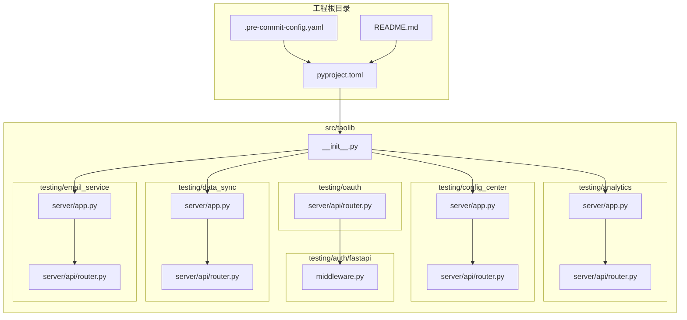
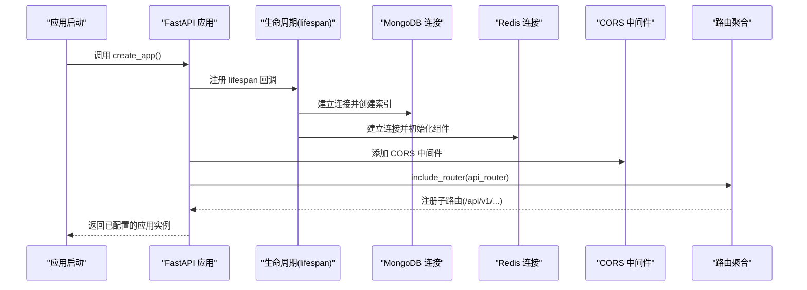
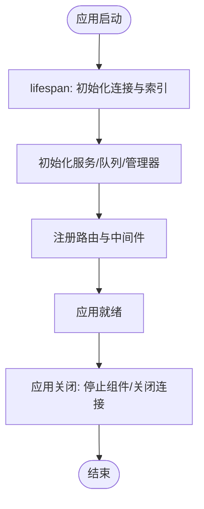
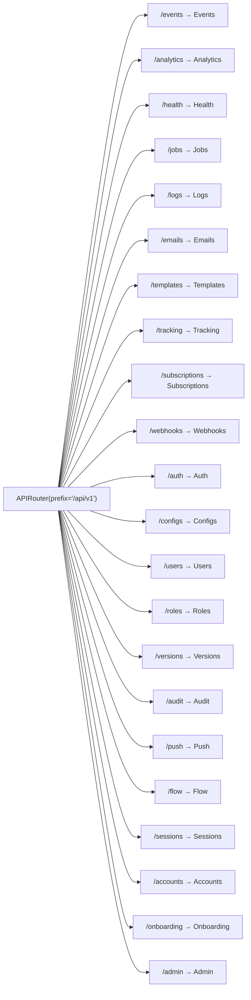
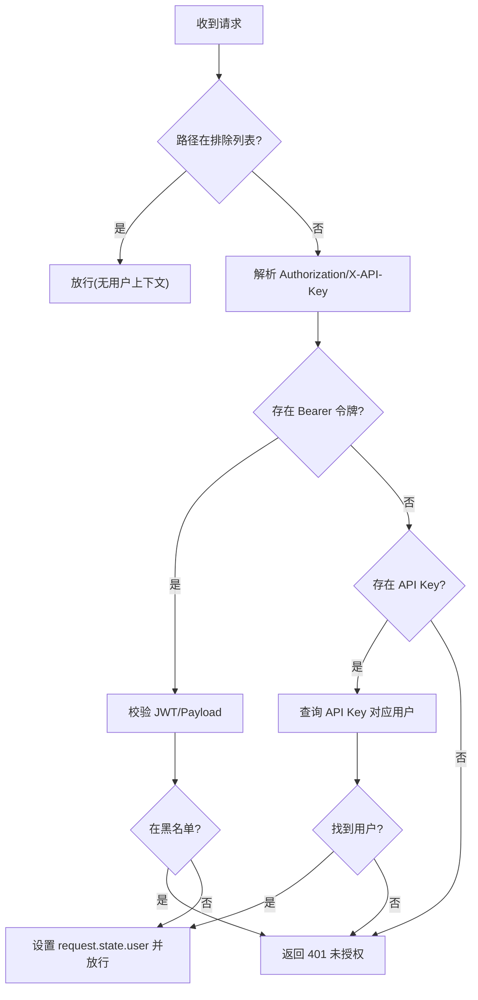
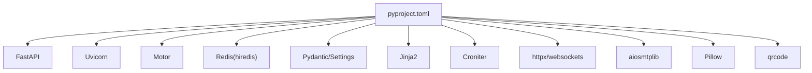

# 代码规范

<cite>
**本文引用的文件**
- [README.md](file://README.md)
- [CONTRIBUTING.md](file://CONTRIBUTING.md)
- [pyproject.toml](file://pyproject.toml)
- [.pre-commit-config.yaml](file://.pre-commit-config.yaml)
- [src/taolib/__init__.py](file://src/taolib/__init__.py)
- [src/taolib/testing/analytics/server/app.py](file://src/taolib/testing/analytics/server/app.py)
- [src/taolib/testing/analytics/server/api/router.py](file://src/taolib/testing/analytics/server/api/router.py)
- [src/taolib/testing/config_center/server/app.py](file://src/taolib/testing/config_center/server/app.py)
- [src/taolib/testing/config_center/server/api/router.py](file://src/taolib/testing/config_center/server/api/router.py)
- [src/taolib/testing/auth/fastapi/middleware.py](file://src/taolib/testing/auth/fastapi/middleware.py)
- [src/taolib/testing/data_sync/server/app.py](file://src/taolib/testing/data_sync/server/app.py)
- [src/taolib/testing/data_sync/server/api/router.py](file://src/taolib/testing/data_sync/server/api/router.py)
- [src/taolib/testing/email_service/server/app.py](file://src/taolib/testing/email_service/server/app.py)
- [src/taolib/testing/email_service/server/api/router.py](file://src/taolib/testing/email_service/server/api/router.py)
- [src/taolib/testing/oauth/server/api/router.py](file://src/taolib/testing/oauth/server/api/router.py)
</cite>

## 目录
1. [简介](#简介)
2. [项目结构](#项目结构)
3. [核心组件](#核心组件)
4. [架构总览](#架构总览)
5. [详细组件分析](#详细组件分析)
6. [依赖分析](#依赖分析)
7. [性能考虑](#性能考虑)
8. [故障排查指南](#故障排查指南)
9. [结论](#结论)
10. [附录](#附录)

## 简介
本文件为 FlexLoop 项目（taolib）制定统一的代码规范，覆盖 Python 代码风格、命名约定、模块组织、类型注解、Docstring 标准、错误处理模式、异步编程规范、FastAPI 路由设计与数据验证规则、Git 提交消息与分支命名、代码审查标准、重构指导、性能优化与安全实践，以及项目特定的架构约束与第三方库集成规范。目标是提升代码一致性、可维护性与协作效率。

## 项目结构
项目采用按功能域分层的模块组织方式，核心位于 src/taolib 下，按业务域拆分为 analytics、config_center、auth、data_sync、email_service、oauth、rate_limiter、task_queue 等子包；每个子系统通常包含 server（FastAPI 应用）、api（路由与视图）、services（业务服务）、repository（数据访问）、models（领域模型）、validation（参数校验）等层次。

- 包级入口与元信息：包文档字符串用于描述模块用途，便于文档生成与 IDE 提示。
- 工程配置：pyproject.toml 定义了版本策略、可选依赖集、工具链配置（Ruff、pytest、coverage），并声明了对 Python 3.14+ 的最低版本要求。
- 提交前钩子：.pre-commit-config.yaml 集成空行清理、YAML/TOML 校验、大文件检测、Ruff 自动修复与格式化等流程，确保提交质量。

**图表来源**
- [pyproject.toml](file://pyproject.toml)
- [.pre-commit-config.yaml](file://.pre-commit-config.yaml)
- [src/taolib/__init__.py](file://src/taolib/__init__.py)
- [src/taolib/testing/analytics/server/app.py](file://src/taolib/testing/analytics/server/app.py)
- [src/taolib/testing/analytics/server/api/router.py](file://src/taolib/testing/analytics/server/api/router.py)
- [src/taolib/testing/config_center/server/app.py](file://src/taolib/testing/config_center/server/app.py)
- [src/taolib/testing/config_center/server/api/router.py](file://src/taolib/testing/config_center/server/api/router.py)
- [src/taolib/testing/auth/fastapi/middleware.py](file://src/taolib/testing/auth/fastapi/middleware.py)
- [src/taolib/testing/data_sync/server/app.py](file://src/taolib/testing/data_sync/server/app.py)
- [src/taolib/testing/data_sync/server/api/router.py](file://src/taolib/testing/data_sync/server/api/router.py)
- [src/taolib/testing/email_service/server/app.py](file://src/taolib/testing/email_service/server/app.py)
- [src/taolib/testing/email_service/server/api/router.py](file://src/taolib/testing/email_service/server/api/router.py)
- [src/taolib/testing/oauth/server/api/router.py](file://src/taolib/testing/oauth/server/api/router.py)

**章节来源**
- [pyproject.toml](file://pyproject.toml)
- [.pre-commit-config.yaml](file://.pre-commit-config.yaml)
- [src/taolib/__init__.py](file://src/taolib/__init__.py)

## 核心组件
- 工具与质量保障
  - 代码格式与风格：Ruff（lint + format），行宽 88，目标 Python 版本 3.14。
  - 测试框架：pytest（异步模式、短回溯、类/文件/函数命名约定）。
  - 覆盖率：分支覆盖率阈值 80%，忽略特定示例文件。
  - 提交前钩子：空行、换行符、YAML/TOML、大文件、Ruff 自动修复与格式化。
- 架构与运行时
  - FastAPI 应用工厂：统一在 server/app.py 中创建应用、注册中间件、挂载路由、定义生命周期。
  - 路由聚合：各子系统在 server/api/router.py 中统一注册子路由，前缀 /api/v1，按标签分组。
  - 中间件：CORS、认证中间件（支持 JWT 与 API Key），在应用工厂中注册。
  - 数据存储：MongoDB（motor）、Redis（hiredis）、文件存储（S3/AWS、CDN）等，按模块独立配置。

**章节来源**
- [pyproject.toml](file://pyproject.toml)
- [.pre-commit-config.yaml](file://.pre-commit-config.yaml)
- [src/taolib/testing/analytics/server/app.py](file://src/taolib/testing/analytics/server/app.py)
- [src/taolib/testing/analytics/server/api/router.py](file://src/taolib/testing/analytics/server/api/router.py)
- [src/taolib/testing/config_center/server/app.py](file://src/taolib/testing/config_center/server/app.py)
- [src/taolib/testing/config_center/server/api/router.py](file://src/taolib/testing/config_center/server/api/router.py)
- [src/taolib/testing/auth/fastapi/middleware.py](file://src/taolib/testing/auth/fastapi/middleware.py)
- [src/taolib/testing/data_sync/server/app.py](file://src/taolib/testing/data_sync/server/app.py)
- [src/taolib/testing/data_sync/server/api/router.py](file://src/taolib/testing/data_sync/server/api/router.py)
- [src/taolib/testing/email_service/server/app.py](file://src/taolib/testing/email_service/server/app.py)
- [src/taolib/testing/email_service/server/api/router.py](file://src/taolib/testing/email_service/server/api/router.py)
- [src/taolib/testing/oauth/server/api/router.py](file://src/taolib/testing/oauth/server/api/router.py)

## 架构总览
以下序列图展示一个典型 FastAPI 应用的启动与路由装配过程，体现生命周期、中间件与路由聚合的协作关系。

**图表来源**
- [src/taolib/testing/analytics/server/app.py](file://src/taolib/testing/analytics/server/app.py)
- [src/taolib/testing/analytics/server/api/router.py](file://src/taolib/testing/analytics/server/api/router.py)
- [src/taolib/testing/config_center/server/app.py](file://src/taolib/testing/config_center/server/app.py)
- [src/taolib/testing/config_center/server/api/router.py](file://src/taolib/testing/config_center/server/api/router.py)
- [src/taolib/testing/data_sync/server/app.py](file://src/taolib/testing/data_sync/server/app.py)
- [src/taolib/testing/data_sync/server/api/router.py](file://src/taolib/testing/data_sync/server/api/router.py)
- [src/taolib/testing/email_service/server/app.py](file://src/taolib/testing/email_service/server/app.py)
- [src/taolib/testing/email_service/server/api/router.py](file://src/taolib/testing/email_service/server/api/router.py)

## 详细组件分析

### FastAPI 应用工厂与生命周期
- 生命周期管理：在 lifespan 中完成数据库连接、索引创建、组件初始化与资源回收，确保应用启动与关闭的一致性。
- 中间件：统一添加 CORS；其他中间件（如认证）在对应模块中注册。
- 路由：include_router(api_router)，避免在工厂内分散注册。

**图表来源**
- [src/taolib/testing/analytics/server/app.py](file://src/taolib/testing/analytics/server/app.py)
- [src/taolib/testing/config_center/server/app.py](file://src/taolib/testing/config_center/server/app.py)
- [src/taolib/testing/data_sync/server/app.py](file://src/taolib/testing/data_sync/server/app.py)
- [src/taolib/testing/email_service/server/app.py](file://src/taolib/testing/email_service/server/app.py)

**章节来源**
- [src/taolib/testing/analytics/server/app.py](file://src/taolib/testing/analytics/server/app.py)
- [src/taolib/testing/config_center/server/app.py](file://src/taolib/testing/config_center/server/app.py)
- [src/taolib/testing/data_sync/server/app.py](file://src/taolib/testing/data_sync/server/app.py)
- [src/taolib/testing/email_service/server/app.py](file://src/taolib/testing/email_service/server/app.py)

### 路由设计与标签规范
- 统一前缀：/api/v1，便于版本控制与演进。
- 子路由按功能模块划分，使用 tags 标注，便于文档生成与 API 分类。
- 示例：analytics、config_center、data_sync、email_service、oauth 等均遵循该模式。

**图表来源**
- [src/taolib/testing/analytics/server/api/router.py](file://src/taolib/testing/analytics/server/api/router.py)
- [src/taolib/testing/config_center/server/api/router.py](file://src/taolib/testing/config_center/server/api/router.py)
- [src/taolib/testing/data_sync/server/api/router.py](file://src/taolib/testing/data_sync/server/api/router.py)
- [src/taolib/testing/email_service/server/api/router.py](file://src/taolib/testing/email_service/server/api/router.py)
- [src/taolib/testing/oauth/server/api/router.py](file://src/taolib/testing/oauth/server/api/router.py)

**章节来源**
- [src/taolib/testing/analytics/server/api/router.py](file://src/taolib/testing/analytics/server/api/router.py)
- [src/taolib/testing/config_center/server/api/router.py](file://src/taolib/testing/config_center/server/api/router.py)
- [src/taolib/testing/data_sync/server/api/router.py](file://src/taolib/testing/data_sync/server/api/router.py)
- [src/taolib/testing/email_service/server/api/router.py](file://src/taolib/testing/email_service/server/api/router.py)
- [src/taolib/testing/oauth/server/api/router.py](file://src/taolib/testing/oauth/server/api/router.py)

### 认证中间件与凭据策略
- 支持两种凭据：Bearer JWT 与 X-API-Key。
- 中间件负责解析头信息、调用服务校验、黑名单检查、填充 request.state.user。
- 提供跳过路径机制，便于健康检查或公开接口免认证。

**图表来源**
- [src/taolib/testing/auth/fastapi/middleware.py](file://src/taolib/testing/auth/fastapi/middleware.py)

**章节来源**
- [src/taolib/testing/auth/fastapi/middleware.py](file://src/taolib/testing/auth/fastpi/middleware.py)

### 错误处理模式
- 明确区分“过期”“无效”“未提供凭据”等异常类型，返回标准化 401 响应与 WWW-Authenticate 头。
- 中间件在捕获异常后构造 JSON 响应体，便于前端统一处理。
- 建议：对外响应体包含统一字段（如 detail），内部保留堆栈以便日志追踪。

**章节来源**
- [src/taolib/testing/auth/fastapi/middleware.py](file://src/taolib/testing/auth/fastapi/middleware.py)

### 异步编程规范
- 使用 asynccontextmanager 管理生命周期，确保资源正确释放。
- FastAPI 视图与服务层广泛采用 async/await，配合 motor、redis、httpx 等异步客户端。
- 建议：避免在异步函数中执行阻塞操作；使用批量/并发策略时注意限流与背压。

**章节来源**
- [src/taolib/testing/analytics/server/app.py](file://src/taolib/testing/analytics/server/app.py)
- [src/taolib/testing/config_center/server/app.py](file://src/taolib/testing/config_center/server/app.py)
- [src/taolib/testing/data_sync/server/app.py](file://src/taolib/testing/data_sync/server/app.py)
- [src/taolib/testing/email_service/server/app.py](file://src/taolib/testing/email_service/server/app.py)

### 类型注解与 Docstring 标准
- 类型注解：优先使用标准库类型提示，结合泛型与可变容器类型；公共函数/方法尽量补齐参数与返回值注解。
- Docstring：采用简洁的中文说明，首行概述，后续段落说明参数、返回值、异常与注意事项；避免冗长示例，必要时在 tests 中给出用法。
- 项目配置：Ruff 规则允许部分宽松项（如某些 ANN 规则在特定目录被忽略），但建议在核心模块补齐注解以提升可读性与 IDE 支持。

**章节来源**
- [pyproject.toml](file://pyproject.toml)

### 数据验证规则与模型设计
- Pydantic 模型：作为请求/响应载体，结合字段约束（必填、长度、枚举、正则）与自定义验证器。
- 参数校验：在 API 层使用 FastAPI 的依赖注入与 Pydantic 模型自动校验，减少重复校验逻辑。
- 建议：对敏感字段（如密码、密钥）避免在日志中输出；对时间戳、ID 等字段统一命名与格式。

**章节来源**
- [pyproject.toml](file://pyproject.toml)

### Git 提交消息与分支命名
- 提交消息：简明扼要地说明变更动机、改动点与影响范围，遵循“主题: 内容”的格式，必要时附上关联 Issue 编号。
- 分支命名：建议使用 feature/<主题>、fix/<问题>、docs/<文档>、refactor/<重构点> 等语义化命名。
- 代码审查：遵循贡献指南，确保通过 Lint/测试/覆盖率检查，并在 PR 描述中说明验证方式与风险点。

**章节来源**
- [README.md](file://README.md)
- [CONTRIBUTING.md](file://CONTRIBUTING.md)

## 依赖分析
- 工程依赖：通过可选依赖集区分不同子系统的功能组合（如 auth-server、config-server、data-sync-server、email-service-server、oauth-server、task-queue-server 等）。
- 第三方库：FastAPI、Uvicorn、Motor、Redis、Pydantic/Settings、Jinja2、Croniter、httpx/websockets、aiosmtplib、Pillow、qrcode 等。
- 版本策略：使用 PDM SCM 版本与 PEP 566 动态版本，确保发布一致性。

**图表来源**
- [pyproject.toml](file://pyproject.toml)

**章节来源**
- [pyproject.toml](file://pyproject.toml)

## 性能考虑
- 异步 I/O：优先使用异步客户端与驱动，避免阻塞主线程；合理设置超时与重试。
- 连接池：复用 MongoDB/Redis 连接，避免频繁创建销毁；在生命周期中集中初始化。
- 索引与查询：为高频查询字段建立复合索引；对 TTL 字段设置合理的过期时间。
- 缓存与降级：对热点数据使用缓存；在外部服务失败时启用降级策略（如快速失败或本地兜底）。
- 监控与可观测：在路由层增加健康检查与指标采集，结合前端仪表板实时观察状态。

**章节来源**
- [src/taolib/testing/analytics/server/app.py](file://src/taolib/testing/analytics/server/app.py)
- [src/taolib/testing/config_center/server/app.py](file://src/taolib/testing/config_center/server/app.py)
- [src/taolib/testing/data_sync/server/app.py](file://src/taolib/testing/data_sync/server/app.py)
- [src/taolib/testing/email_service/server/app.py](file://src/taolib/testing/email_service/server/app.py)

## 故障排查指南
- 启动失败：检查数据库连接串、索引创建是否成功；查看生命周期回调中的异常日志。
- 认证失败：确认凭据格式（Bearer 与 API Key）是否正确；核对黑名单状态与过期时间。
- 路由 404：确认 api_router 是否正确 include，前缀与标签是否匹配。
- 性能问题：检查慢查询、索引缺失、队列积压与外部服务延迟；开启更详细的日志级别定位瓶颈。

**章节来源**
- [src/taolib/testing/auth/fastapi/middleware.py](file://src/taolib/testing/auth/fastapi/middleware.py)
- [src/taolib/testing/analytics/server/app.py](file://src/taolib/testing/analytics/server/app.py)
- [src/taolib/testing/config_center/server/app.py](file://src/taolib/testing/config_center/server/app.py)
- [src/taolib/testing/data_sync/server/app.py](file://src/taolib/testing/data_sync/server/app.py)
- [src/taolib/testing/email_service/server/app.py](file://src/taolib/testing/email_service/server/app.py)

## 结论
本规范以工程配置与现有模块为依据，明确了风格、结构、路由、认证、异步与质量保障等方面的标准。建议在新增模块时严格遵循，以保持整体一致性与可维护性；同时鼓励在实践中持续优化与迭代。

## 附录

### 代码风格与工具链清单
- 代码格式：Ruff（lint + format）
- Lint 规则：E/W/F/I/UP/ANN/B/C4/SIM/RUF 等
- 行宽：88
- 目标 Python：3.14
- 测试：pytest（异步模式）、覆盖率阈值 80%
- 提交前钩子：空行/换行符/大文件/格式化/自动修复

**章节来源**
- [pyproject.toml](file://pyproject.toml)
- [.pre-commit-config.yaml](file://.pre-commit-config.yaml)