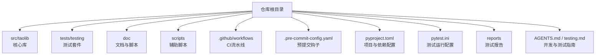
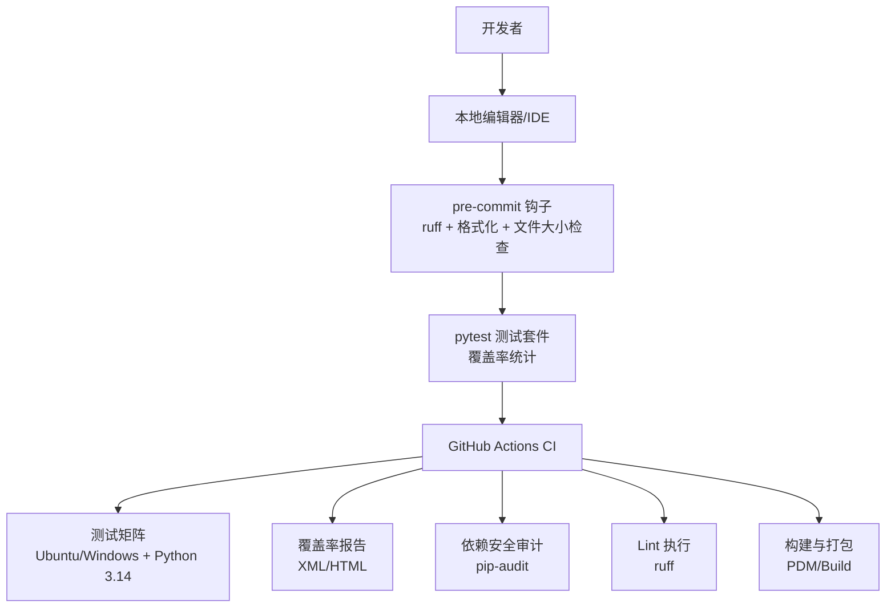

# 开发指南

<cite>
**本文引用的文件**
- [README.md](file://README.md)
- [CONTRIBUTING.md](file://CONTRIBUTING.md)
- [pyproject.toml](file://pyproject.toml)
- [pytest.ini](file://pytest.ini)
- [.pre-commit-config.yaml](file://.pre-commit-config.yaml)
- [.github/workflows/ci.yml](file://.github/workflows/ci.yml)
- [tasks.py](file://tasks.py)
- [scripts/check_file_size.py](file://scripts/check_file_size.py)
- [src/taolib/__init__.py](file://src/taolib/__init__.py)
- [src/taolib/testing/__init__.py](file://src/taolib/testing/__init__.py)
- [AGENTS.md](file://AGENTS.md)
- [testing.md](file://testing.md)
- [tests/testing/dev-environment.yml](file://tests/testing/dev-environment.yml)
- [reports/TEST_REPORT.md](file://reports/TEST_REPORT.md)
</cite>

## 目录
1. [简介](#简介)
2. [项目结构](#项目结构)
3. [核心组件](#核心组件)
4. [架构总览](#架构总览)
5. [详细组件分析](#详细组件分析)
6. [依赖分析](#依赖分析)
7. [性能考虑](#性能考虑)
8. [故障排除指南](#故障排除指南)
9. [结论](#结论)
10. [附录](#附录)

## 简介
本指南面向 FlexLoop（taolib）项目的贡献者与维护者，提供从开发环境搭建、代码规范、测试策略到 Git 工作流、分支管理、代码审查、质量检查、静态分析、持续集成配置、IDE 与调试技巧、模块依赖与扩展机制、以及贡献流程与问题处理的完整开发手册。文档强调可操作性与一致性，帮助团队在 Python 3.14+ 环境下高效协作。

## 项目结构
仓库采用“多模块库 + 测试与文档”的组织方式，核心库位于 src/taolib 下，测试位于 tests/testing，文档与脚本分布在 doc、scripts、reports 等目录；CI 由 GitHub Actions 驱动，预提交钩子由 pre-commit 管理。

图表来源
- [pyproject.toml:1-318](file://pyproject.toml#L1-L318)
- [.github/workflows/ci.yml:1-105](file://.github/workflows/ci.yml#L1-L105)
- [.pre-commit-config.yaml:1-29](file://.pre-commit-config.yaml#L1-L29)
- [AGENTS.md:1-285](file://AGENTS.md#L1-L285)

章节来源
- [pyproject.toml:1-318](file://pyproject.toml#L1-L318)
- [AGENTS.md:1-285](file://AGENTS.md#L1-L285)

## 核心组件
- 项目名称与版本：通过 PDM SCM 版本与动态版本管理，构建时包含 src/taolib。
- 可选依赖组：按功能域划分（如 auth、auth-server、config-center、data-sync、email-service、file-storage、oauth、rate-limiter、task-queue、analytics、site、qrcode、audit、multi-agent 等），便于按需安装与测试。
- 测试与覆盖率：pytest + pytest-asyncio + pytest-cov，覆盖率阈值 80%，忽略特定示例文件。
- Lint 与格式化：ruff（lint + format），pre-commit 钩子统一执行。
- 文档：Invoke + Sphinx，tasks.py 提供文档构建入口。

章节来源
- [pyproject.toml:1-318](file://pyproject.toml#L1-L318)
- [tasks.py:1-4](file://tasks.py#L1-L4)
- [pytest.ini:1-10](file://pytest.ini#L1-L10)

## 架构总览
下图展示开发与发布流程的关键节点：本地开发（编辑器/IDE）、预提交钩子、本地测试、CI 流水线（测试/覆盖率/Lint/安全审计）、产物构建与发布。

图表来源
- [.pre-commit-config.yaml:1-29](file://.pre-commit-config.yaml#L1-L29)
- [.github/workflows/ci.yml:1-105](file://.github/workflows/ci.yml#L1-L105)
- [pyproject.toml:297-318](file://pyproject.toml#L297-L318)

章节来源
- [.github/workflows/ci.yml:1-105](file://.github/workflows/ci.yml#L1-L105)
- [.pre-commit-config.yaml:1-29](file://.pre-commit-config.yaml#L1-L29)
- [pyproject.toml:245-318](file://pyproject.toml#L245-L318)

## 详细组件分析

### 开发环境搭建
- Python 版本：要求 Python >= 3.14。
- 安装方式：
  - 从 PyPI 安装：pip install taolib
  - 从源码安装（开发模式）：pip install -e .
  - 可选安装开发与文档依赖：pip install -e ".[doc,dev]"
- Conda 开发环境：可通过 tests/testing/dev-environment.yml 创建 jupyterlite-sphinx 开发环境，包含 pip 安装的可选依赖组。
- 文档构建：tasks.py 提供站点构建入口，结合 Invoke 与 Sphinx。

章节来源
- [README.md:45-100](file://README.md#L45-L100)
- [tests/testing/dev-environment.yml:1-15](file://tests/testing/dev-environment.yml#L1-L15)
- [tasks.py:1-4](file://tasks.py#L1-L4)

### 代码规范与静态分析
- Lint 与格式化：ruff（lint + format），忽略规则针对 FastAPI 依赖注入、中文注释等场景定制。
- 预提交钩子：trailing-whitespace、end-of-file-fixer、check-yaml、check-added-large-files（10MB）、check-toml、check-merge-conflict、debug-statements、ruff（fix + format）、ruff-format、本地文件大小检查脚本。
- 文件大小限制：scripts/check_file_size.py 拦截过大二进制文件入库。
- 文档字符串风格：Google 风格，Sphinx napoleon 解析。
- 编码与换行：UTF-8 + LF。

章节来源
- [pyproject.toml:245-296](file://pyproject.toml#L245-L296)
- [.pre-commit-config.yaml:1-29](file://.pre-commit-config.yaml#L1-L29)
- [scripts/check_file_size.py:1-27](file://scripts/check_file_size.py#L1-L27)
- [AGENTS.md:170-178](file://AGENTS.md#L170-L178)

### 测试策略与覆盖率
- 测试框架：pytest + pytest-asyncio，测试路径 tests，类/函数命名约定 Test* / test_*。
- 覆盖率：开启分支覆盖率，忽略示例文件，阈值 80%。
- 测试分类：单元测试、集成测试、系统测试、端到端测试；性能基准测试脚本 perf_remote_bench.py。
- 常用命令：安装开发/文档/测试依赖、运行全部测试、按名称模式过滤、带覆盖率运行、运行 Lint/格式化。

章节来源
- [pytest.ini:1-10](file://pytest.ini#L1-L10)
- [pyproject.toml:297-318](file://pyproject.toml#L297-L318)
- [testing.md:1-76](file://testing.md#L1-L76)
- [reports/TEST_REPORT.md:1-169](file://reports/TEST_REPORT.md#L1-L169)

### Git 工作流、分支管理与代码审查
- 分支命名：feature/<topic> 或 fix/<issue>。
- 提交信息：说明动机、改动点、影响范围与验证方式。
- 代码审查：通过 Pull Request 提交，遵循贡献指南与规范。
- 依赖安全：CI 中运行 pip-audit 检查依赖漏洞。

章节来源
- [README.md:87-92](file://README.md#L87-L92)
- [.github/workflows/ci.yml:85-105](file://.github/workflows/ci.yml#L85-L105)

### 持续集成配置
- 触发：push/pull_request 到 main 分支。
- 并发：同一流水线并发组内取消进行中的作业。
- 测试矩阵：Ubuntu/Windows + Python 3.14。
- 步骤：检出代码、设置 Python、安装 -e ".[test]"、pytest 带覆盖率、上传覆盖率报告与 HTML 报告、上传覆盖率到 Codecov（Ubuntu 且通过时）、安全审计 pip-audit。
- Lint：安装 pre-commit 并执行 --all-files。

章节来源
- [.github/workflows/ci.yml:1-105](file://.github/workflows/ci.yml#L1-L105)

### IDE 配置与调试技巧
- 推荐使用支持 Python 3.14 的 IDE，并启用 ruff 插件以获得实时格式化与 Lint 提示。
- 预提交钩子可在 IDE 中配置为保存时执行，或在提交前手动运行 pre-commit run --all-files。
- Windows GBK 编码问题：stdout 包装为 UTF-8 + errors="replace"，避免控制台崩溃。
- 可选依赖缺失导致的测试失败：使用 pytest.importorskip 或条件跳过标记，避免污染测试结果。

章节来源
- [AGENTS.md:241-249](file://AGENTS.md#L241-L249)
- [reports/TEST_REPORT.md:147-149](file://reports/TEST_REPORT.md#L147-L149)

### 模块依赖与扩展机制
- 核心库：src/taolib，提供 testing 子模块与版本管理。
- 可选依赖组：按功能域拆分，如 auth、auth-server、config-center、data-sync、email-service、file-storage、oauth、rate-limiter、task-queue、analytics、site、qrcode、audit、multi-agent 等。
- 构建包含：src/taolib，包目录为 src。
- 版本来源：SCM，回退版本 0.0.0。

章节来源
- [src/taolib/__init__.py:1-2](file://src/taolib/__init__.py#L1-L2)
- [src/taolib/testing/__init__.py:1-19](file://src/taolib/testing/__init__.py#L1-L19)
- [pyproject.toml:241-244](file://pyproject.toml#L241-L244)
- [pyproject.toml:237-239](file://pyproject.toml#L237-L239)

### 贡献流程、问题报告与功能请求
- 贡献指南：参见 CONTRIBUTING.md 指向的外部文档。
- 问题与反馈：通过 GitHub Issues 与 Discussions 提交问题、参与讨论与改进。
- PR 要求：保持代码风格与类型检查通过，补充必要测试与文档，提交时说明动机、改动点、影响范围与验证方式。

章节来源
- [CONTRIBUTING.md:1-3](file://CONTRIBUTING.md#L1-L3)
- [README.md:82-92](file://README.md#L82-L92)

## 依赖分析
- 依赖来源：pyproject.toml 的 [project.optional-dependencies] 与各功能域 extras。
- 测试与覆盖率：pytest、pytest-asyncio、pytest-cov、coverage。
- Lint：ruff（lint + format）。
- 文档：Sphinx、Invoke、sphinx-book-theme 等。
- 安全审计：pip-audit。
- 构建：PDM backend。

```mermaid
graph TB
P["pyproject.toml"] --> D1["doc 可选依赖组"]
P --> D2["dev 可选依赖组"]
P --> D3["test 可选依赖组"]
P --> E1["auth / auth-redis / auth-fastapi / auth-server"]
P --> E2["config-center (server/client)"]
P --> E3["data-sync (server)"]
P --> E4["email-service (server/client)"]
P --> E5["file-storage (server/client/processing)"]
P --> E6["oauth (server)"]
P --> E7["rate-limiter"]
P --> E8["task-queue (server)"]
P --> E9["analytics (server)"]
P --> E10["site"]
P --> E11["qrcode (server)"]
P --> E12["audit (server)"]
P --> E13["multi-agent (server)"]
```

图表来源
- [pyproject.toml:20-236](file://pyproject.toml#L20-L236)

章节来源
- [pyproject.toml:20-236](file://pyproject.toml#L20-L236)

## 性能考虑
- 测试性能：识别慢测试（如 60s 的 test_local_cache_delete_on_miss），建议设置超时上限或优化逻辑，避免拖慢 CI。
- 可选依赖测试隔离：对缺少 matplotlib 等可选依赖的测试使用条件跳过，减少误报失败。
- CI 并发：Ubuntu/Windows 双平台矩阵并行执行，缩短总耗时。

章节来源
- [reports/TEST_REPORT.md:121-126](file://reports/TEST_REPORT.md#L121-L126)
- [reports/TEST_REPORT.md:147-149](file://reports/TEST_REPORT.md#L147-L149)
- [.github/workflows/ci.yml:16-24](file://.github/workflows/ci.yml#L16-L24)

## 故障排除指南
- 配置冲突：pytest.ini 会覆盖 pyproject.toml 中的 pytest 设置，建议统一使用 pyproject.toml 管理。
- Python 2 语法残留：except A, B: 在 Python 3 中需改为 except (A, B):，可通过 ruff 规则或 pre-commit 钩子检测。
- 前向引用 NameError：类型注解中使用尚未定义的类名会导致 NameError，需在文件顶部添加 from __future__ import annotations。
- 测试收集错误：一个源码文件的语法/导入错误可能阻断整个模块的测试收集，导致覆盖率大幅下降，CI 中应零容忍收集错误。
- 可选依赖缺失：缺少 matplotlib 等可选库导致测试失败，应使用 pytest.importorskip 或条件跳过标记。
- Windows GBK 编码崩溃：包装 sys.stdout 为 UTF-8 + errors="replace"。

章节来源
- [reports/TEST_REPORT.md:131-146](file://reports/TEST_REPORT.md#L131-L146)
- [AGENTS.md:241-249](file://AGENTS.md#L241-L249)

## 结论
本指南提供了 FlexLoop（taolib）项目从环境搭建到持续交付的全流程规范。通过统一的可选依赖组、严格的 Lint/格式化、完善的测试与覆盖率策略、以及 CI 安全审计，团队可以在 Python 3.14+ 环境下高效协作。建议在日常开发中坚持 pre-commit 钩子、pytest 约定与 ruff 规则，持续完善测试覆盖面与文档质量。

## 附录

### 常用命令速查
- 安装开发/文档/测试依赖：pip install -e ".[dev,doc,test]"
- 运行全部测试：python -m pytest tests/testing/ -v
- 按名称模式运行：python -m pytest tests/testing/ -k "<pattern>" -v
- 带覆盖率运行：coverage run -m pytest tests/testing/ && coverage report
- Lint/格式化：pre-commit run --all-files
- 构建文档：python -m invoke doc / python -m invoke doc.build --nitpick / python -m invoke doc.clean
- 打包：python -m build

章节来源
- [testing.md:7-30](file://testing.md#L7-L30)
- [AGENTS.md:37-69](file://AGENTS.md#L37-L69)