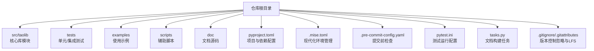
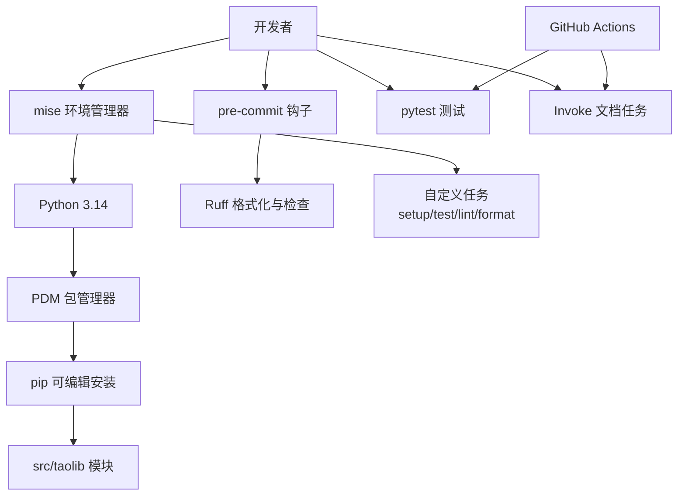
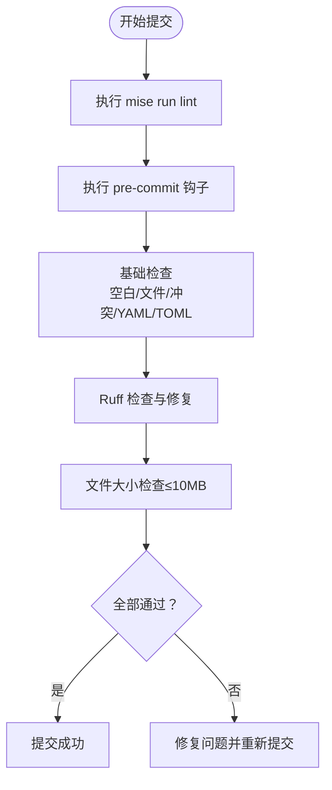
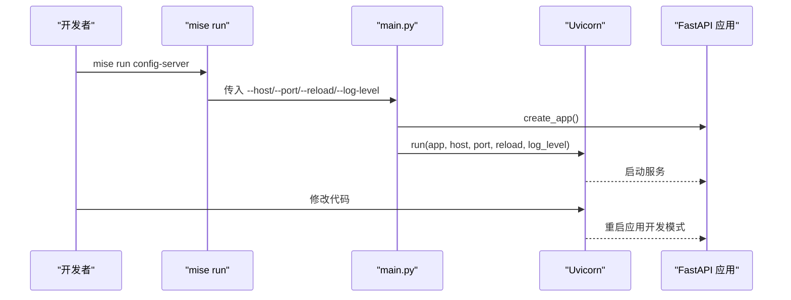
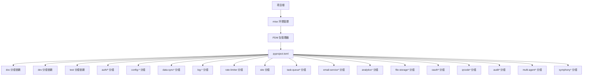

# 开发环境搭建

<cite>
**本文引用的文件**
- [README.md](file://README.md)
- [.mise.toml](file://.mise.toml)
- [pyproject.toml](file://pyproject.toml)
- [.pre-commit-config.yaml](file://.pre-commit-config.yaml)
- [pytest.ini](file://pytest.ini)
- [tasks.py](file://tasks.py)
- [scripts/check_file_size.py](file://scripts/check_file_size.py)
- [examples/multi_agent_example.py](file://examples/multi_agent_example.py)
- [.gitignore](file://.gitignore)
- [.gitattributes](file://.gitattributes)
- [src/taolib/testing/config_center/server/config.py](file://src/taolib/testing/config_center/server/config.py)
- [src/taolib/testing/config_center/server/main.py](file://src/taolib/testing/config_center/server/main.py)
- [src/taolib/testing/data_sync/server/main.py](file://src/taolib/testing/data_sync/server/main.py)
- [src/taolib/testing/file_storage/server/main.py](file://src/taolib/testing/file_storage/server/main.py)
- [src/taolib/testing/qrcode/server/config.py](file://src/taolib/testing/qrcode/server/config.py)
- [tests/testing/dev-environment.yml](file://tests/testing/dev-environment.yml)
- [.github/workflows/pages.yml](file://.github/workflows/pages.yml)
</cite>

## 目录
1. [简介](#简介)
2. [项目结构](#项目结构)
3. [核心组件](#核心组件)
4. [架构总览](#架构总览)
5. [详细组件分析](#详细组件分析)
6. [依赖关系分析](#依赖关系分析)
7. [性能考虑](#性能考虑)
8. [故障排查指南](#故障排查指南)
9. [结论](#结论)
10. [附录](#附录)

## 简介
本指南面向FlexLoop（taolib）项目的开发者，提供从零到一的开发环境搭建步骤，涵盖以下主题：
- Python 3.14环境准备与现代化工具链（mise + PDM）
- 基于.mise.toml的环境管理与任务编排
- 依赖安装与分组依赖管理（PDM + optional-dependencies）
- 开发工具链与IDE设置建议
- Git钩子、代码格式化与静态分析工具的安装与使用
- Docker与容器化文档构建参考
- 数据库与Redis服务的本地连接配置
- 开发服务器启动、调试与热重载
- 项目结构理解、模块导入路径与开发模式切换

## 项目结构
该项目采用"src布局"与"可编辑安装"的标准Python工程组织方式，核心模块位于src/taolib下，测试与示例分别位于tests与examples中。关键配置集中在pyproject.toml与.mise.toml中，现代化工具链提供统一的环境管理。

图表来源
- [pyproject.toml:1-333](file://pyproject.toml#L1-L333)
- [README.md:1-60](file://README.md#L1-L60)
- [.mise.toml:1-26](file://.mise.toml#L1-L26)

章节来源
- [pyproject.toml:1-333](file://pyproject.toml#L1-L333)
- [README.md:1-60](file://README.md#L1-L60)
- [.mise.toml:1-26](file://.mise.toml#L1-L26)

## 核心组件
- **现代化环境管理**：使用mise作为Python版本和工具管理器，.mise.toml配置Python 3.14、Ruff工具和自定义任务。
- **包管理器**：PDM作为构建后端，提供完整的依赖管理和版本控制。
- **可编辑安装**：支持pip安装到开发模式，便于本地修改即时生效。
- **分组依赖**：doc、dev、test、auth、auth-redis、auth-fastapi、auth-server、config-server、config-client、data-sync、data-sync-server、log-platform、log-client、rate-limiter、site、task-queue、task-queue-server、email-service、email-service-server、analytics、analytics-server、file-storage、file-storage-server、file-storage-processing、file-storage-client、oauth、oauth-server、qrcode、qrcode-server、audit、audit-server、multi-agent、multi-agent-server、symphony、symphony-server等。
- **测试框架**：pytest，异步模式开启，测试路径与命名约定明确。
- **文档构建**：Invoke + Sphinx生态，doc分组依赖齐全；CI中使用invoke doc任务。
- **代码质量**：Ruff作为lint与format工具，配合pre-commit钩子自动化检查。

章节来源
- [README.md:35-60](file://README.md#L35-L60)
- [pyproject.toml:20-333](file://pyproject.toml#L20-L333)
- [pytest.ini:1-10](file://pytest.ini#L1-L10)
- [tasks.py:1-4](file://tasks.py#L1-L4)
- [.mise.toml:1-26](file://.mise.toml#L1-L26)

## 架构总览
下图展示了现代化开发环境的关键交互：开发者通过mise管理Python版本和工具；PDM负责依赖管理；pre-commit在提交前执行格式化与静态检查；pytest负责单元测试；Invoke用于文档构建；CI流水线复用相同的依赖与任务。

图表来源
- [.mise.toml:11-25](file://.mise.toml#L11-L25)
- [pyproject.toml:20-333](file://pyproject.toml#L20-L333)
- [.pre-commit-config.yaml:1-29](file://.pre-commit-config.yaml#L1-L29)
- [pytest.ini:1-10](file://pytest.ini#L1-L10)
- [tasks.py:1-4](file://tasks.py#L1-L4)
- [.github/workflows/pages.yml:45-83](file://.github/workflows/pages.yml#L45-L83)

## 详细组件分析

### 现代化环境管理（mise + PDM）
- **mise配置**：Python 3.14版本固定，Ruff工具版本最新，自动信任配置路径。
- **自定义任务**：
  - setup：一次性安装所有开发依赖（dev、test、auth、task-queue、analytics、config-server、data-sync、email-service、file-storage、oauth、rate-limiter、multi-agent、symphony）
  - test：运行pytest测试套件
  - lint：执行Ruff代码检查
  - format：执行Ruff代码格式化
- **PDM集成**：作为构建后端，提供完整的依赖管理和版本控制功能。

章节来源
- [.mise.toml:1-26](file://.mise.toml#L1-L26)
- [pyproject.toml:1-14](file://pyproject.toml#L1-L14)

### Python 3.14环境与虚拟环境
- **环境要求**：Python >= 3.13（项目要求），推荐使用mise管理Python版本。
- **推荐方式**：使用mise安装Python 3.14，自动配置PATH和工具链。
- **传统方式**：pyenv或官方安装包进行版本管理，确保全局或项目级Python指向3.14。

章节来源
- [README.md:35-46](file://README.md#L35-L46)
- [pyproject.toml:14](file://pyproject.toml#L14)

### 依赖安装与分组依赖
- **可编辑安装**：pip安装项目到开发模式，便于本地调试与增量迭代。
- **分组依赖**：现代化的optional-dependencies配置，支持细粒度的功能模块选择。
- **一次性安装**：使用mise run setup命令安装所有开发依赖，包括文档、测试、认证、队列、分析、配置中心、数据同步、邮件服务、文件存储、OAuth、限流、多智能体、Symphony等模块。

章节来源
- [README.md:48-60](file://README.md#L48-L60)
- [pyproject.toml:20-333](file://pyproject.toml#L20-L333)
- [.mise.toml:11-13](file://.mise.toml#L11-L13)

### 开发工具链与IDE设置
- **代码格式化与静态检查**：Ruff作为lint与format工具，pre-commit钩子在提交前自动执行。
- **IDE建议**：
  - VS Code：启用Python Interpreter指向当前虚拟环境；安装Python与Pylance扩展；配置pre-commit钩子在保存或提交时触发。
  - PyCharm：选择正确的解释器与项目结构；在Settings中配置Ruff为外部工具并在VCS提交前运行。
- **文档构建**：使用Invoke任务构建Sphinx文档，输出至doc/_build/html。
- **现代化工具**：mise提供统一的任务管理，支持跨平台的环境一致性。

章节来源
- [.pre-commit-config.yaml:1-29](file://.pre-commit-config.yaml#L1-L29)
- [pyproject.toml:259-333](file://pyproject.toml#L259-L333)
- [tasks.py:1-4](file://tasks.py#L1-L4)
- [.mise.toml:11-25](file://.mise.toml#L11-L25)

### Git钩子、代码格式化与静态分析
- **pre-commit配置**：
  - 基础钩子：去除尾随空白、文件末尾修复、YAML/TOML检查、大文件检查、合并冲突检查、调试语句检查。
  - Ruff钩子：自动修复与格式化。
  - 自定义钩子：检查文件大小（限制10MB）。
- **提交前检查流程**：

图表来源
- [.pre-commit-config.yaml:1-29](file://.pre-commit-config.yaml#L1-L29)
- [scripts/check_file_size.py:1-27](file://scripts/check_file_size.py#L1-L27)
- [.mise.toml:19-25](file://.mise.toml#L19-L25)

章节来源
- [.pre-commit-config.yaml:1-29](file://.pre-commit-config.yaml#L1-L29)
- [scripts/check_file_size.py:1-27](file://scripts/check_file_size.py#L1-L27)
- [.mise.toml:19-25](file://.mise.toml#L19-L25)

### Docker与容器化文档构建
- **容器化支持**：仓库未提供docker-compose或Dockerfile，但CI工作流展示了在GitHub Actions中安装doc与dev依赖并构建文档的过程。
- **本地容器化**：可参考CI步骤在容器内安装依赖并执行invoke doc任务。
- **环境一致性**：mise确保不同开发环境的一致性，减少容器化的必要性。

章节来源
- [.github/workflows/pages.yml:45-83](file://.github/workflows/pages.yml#L45-L83)

### 数据库与Redis连接设置
- **配置中心服务端**使用Pydantic Settings加载环境变量，支持.env文件与环境变量前缀。
- **示例配置项**：MongoDB连接字符串、Redis连接字符串、JWT配置、CORS白名单、推送服务心跳与缓冲参数等。
- **环境变量前缀**：CONFIG_CENTER_，支持本地.env文件配置。
- **建议**：
  - 在本地创建.env文件，设置CONFIG_CENTER_前缀的环境变量。
  - 如需Redis缓存，按需安装对应分组依赖。
  - 如需MongoDB或PostgreSQL，按需安装对应分组依赖。

章节来源
- [src/taolib/testing/config_center/server/config.py:1-72](file://src/taolib/testing/config_center/server/config.py#L1-L72)

### 开发服务器启动、调试与热重载
- **通用入口**：各子系统均提供main.py入口，使用argparse解析host/port/reload/log-level等参数，并通过uvicorn启动。
- **热重载**：通过--reload参数启用（开发模式），支持代码变更自动重启。
- **示例命令**（以配置中心为例）：
  - 启动：python -m src.taolib.testing.config_center.server.main --reload
  - 调试：--log-level debug
- **现代化启动**：使用mise run命令启动各服务，获得更好的环境隔离。
- **其他服务入口**（文件存储、数据同步、二维码等）遵循相同模式。

图表来源
- [src/taolib/testing/config_center/server/main.py:1-48](file://src/taolib/testing/config_center/server/main.py#L1-L48)
- [src/taolib/testing/data_sync/server/main.py:1-48](file://src/taolib/testing/data_sync/server/main.py#L1-L48)
- [src/taolib/testing/file_storage/server/main.py:1-56](file://src/taolib/testing/file_storage/server/main.py#L1-L56)
- [.mise.toml:11-13](file://.mise.toml#L11-L13)

章节来源
- [src/taolib/testing/config_center/server/main.py:1-48](file://src/taolib/testing/config_center/server/main.py#L1-L48)
- [src/taolib/testing/data_sync/server/main.py:1-48](file://src/taolib/testing/data_sync/server/main.py#L1-L48)
- [src/taolib/testing/file_storage/server/main.py:1-56](file://src/taolib/testing/file_storage/server/main.py#L1-L56)
- [.mise.toml:11-13](file://.mise.toml#L11-L13)

### 项目结构理解、模块导入路径与开发模式切换
- **模块导入路径**：src/taolib为包根，tests与examples中通过sys.path.insert或相对导入访问模块。
- **开发模式切换**：
  - 使用可编辑安装（pip -e）以启用实时修改。
  - 在IDE中将src加入Python路径，或在tests/examples中显式添加src路径。
  - 通过--reload参数启用热重载，适合快速迭代。
- **现代化导入**：推荐使用Python 3.14的importlib.metadata和标准库功能。
- **导入路径示例**（来自示例文件）：将项目根目录下的src加入sys.path，再导入taolib.testing.*模块。

章节来源
- [examples/multi_agent_example.py:1-196](file://examples/multi_agent_example.py#L1-L196)

## 依赖关系分析
- **依赖分层**：现代化的optional-dependencies配置，支持细粒度的功能模块选择。
- **运行时依赖**：FastAPI、Uvicorn、Pydantic/Settings、Motor（Mongo）、Redis（hiredis）、HTTPX/Websockets等。
- **开发与文档**：Sphinx、Invoke、Mermaid、AutoAPI、Graphviz、Jupyter生态等。
- **测试**：pytest、pytest-asyncio、coverage等。
- **现代化依赖管理**：PDM提供更好的依赖解析和版本控制。

图表来源
- [pyproject.toml:20-333](file://pyproject.toml#L20-L333)
- [.mise.toml:11-13](file://.mise.toml#L11-L13)

章节来源
- [pyproject.toml:20-333](file://pyproject.toml#L20-L333)
- [.mise.toml:11-13](file://.mise.toml#L11-L13)

## 性能考虑
- **热重载仅用于开发模式**，生产环境应关闭--reload以避免不必要的进程重启开销。
- **选择合适的日志级别**（--log-level）以平衡可观测性与性能。
- **现代化工具链**：mise提供更好的环境隔离和任务管理，减少环境配置开销。
- **依赖管理优化**：PDM提供更高效的依赖解析和缓存机制。
- **文档构建时注意清理中间产物**（CI中演示了清理.doctree与环境缓存文件的做法）。

## 故障排查指南
- **mise相关问题**：
  - 确保已安装mise并执行mise trust
  - 检查.mise.toml配置是否正确
  - 使用mise install重新安装工具链
- **pre-commit失败**：
  - 检查Ruff是否正确安装与配置；确保在提交前运行pre-commit install与pre-commit run --all-files。
  - 文件过大：确认文件大小不超过10MB限制。
- **文档构建失败**：
  - 确认已安装doc分组依赖；使用invoke doc.clean与invoke doc重建。
- **测试失败**：
  - 使用pytest --asyncio-mode=auto运行；关注覆盖率阈值与排除规则。
- **依赖冲突**：
  - 清理虚拟环境后重新安装；优先使用可编辑安装与统一的分组依赖。
- **现代化工具链问题**：
  - 使用mise run命令替代直接调用工具
  - 检查PDM配置和缓存

章节来源
- [.pre-commit-config.yaml:1-29](file://.pre-commit-config.yaml#L1-L29)
- [scripts/check_file_size.py:1-27](file://scripts/check_file_size.py#L1-L27)
- [tasks.py:1-4](file://tasks.py#L1-L4)
- [pytest.ini:1-10](file://pytest.ini#L1-L10)
- [pyproject.toml:320-333](file://pyproject.toml#L320-L333)
- [.mise.toml:11-25](file://.mise.toml#L11-L25)

## 结论
通过现代化的开发环境搭建，您可以在本地快速搭建FlexLoop（taolib）的开发环境：使用mise管理Python 3.14环境，PDM进行依赖管理，一次性安装所有开发依赖，配置pre-commit与Ruff，运行pytest与Invoke任务，按需启动各子系统服务并启用热重载。现代化工具链提供了更好的环境一致性、任务管理和依赖解析能力，结合.env配置与按需依赖安装，即可高效开展开发与调试工作。

## 附录
- **现代化快速清单**
  - 安装mise并执行mise trust
  - mise install（安装Python 3.14和工具链）
  - mise run setup（初始化开发环境）
  - mise run test（运行测试）
  - mise run lint（代码检查）
  - mise run format（代码格式化）
  - 各子系统main.py启动并启用--reload
- **传统方式备选**
  - pip install -e ".[dev,doc,test]"
  - python -m pytest tests/testing/ -v
  - python -m invoke doc
- **参考文件**
  - [README.md:35-60](file://README.md#L35-L60)
  - [pyproject.toml:20-333](file://pyproject.toml#L20-L333)
  - [.pre-commit-config.yaml:1-29](file://.pre-commit-config.yaml#L1-L29)
  - [pytest.ini:1-10](file://pytest.ini#L1-L10)
  - [tasks.py:1-4](file://tasks.py#L1-L4)
  - [.github/workflows/pages.yml:45-83](file://.github/workflows/pages.yml#L45-L83)
  - [.mise.toml:1-26](file://.mise.toml#L1-L26)