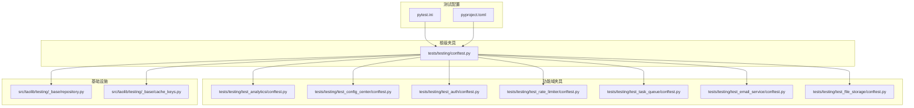
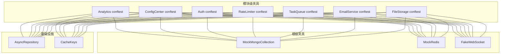

# 测试策略

<cite>
**本文引用的文件**
- [pytest.ini](file://pytest.ini)
- [pyproject.toml](file://pyproject.toml)
- [tests/testing/conftest.py](file://tests/testing/conftest.py)
- [tests/testing/test_analytics/conftest.py](file://tests/testing/test_analytics/conftest.py)
- [tests/testing/test_config_center/conftest.py](file://tests/testing/test_config_center/conftest.py)
- [tests/testing/test_auth/conftest.py](file://tests/testing/test_auth/conftest.py)
- [tests/testing/test_rate_limiter/conftest.py](file://tests/testing/test_rate_limiter/conftest.py)
- [tests/testing/test_task_queue/conftest.py](file://tests/testing/test_task_queue/conftest.py)
- [tests/testing/test_email_service/conftest.py](file://tests/testing/test_email_service/conftest.py)
- [tests/testing/test_file_storage/conftest.py](file://tests/testing/test_file_storage/conftest.py)
- [src/taolib/testing/_base/repository.py](file://src/taolib/testing/_base/repository.py)
- [src/taolib/testing/_base/cache_keys.py](file://src/taolib/testing/_base/cache_keys.py)
- [tests/testing/perf_remote_bench.py](file://tests/testing/perf_remote_bench.py)
</cite>

## 目录
1. [引言](#引言)
2. [项目结构](#项目结构)
3. [核心组件](#核心组件)
4. [架构总览](#架构总览)
5. [详细组件分析](#详细组件分析)
6. [依赖分析](#依赖分析)
7. [性能考虑](#性能考虑)
8. [故障排查指南](#故障排查指南)
9. [结论](#结论)
10. [附录](#附录)

## 引言
本测试策略文档面向 FlexLoop 项目的测试体系，系统化阐述分层测试架构（单元测试、集成测试、端到端测试），并结合现有 pytest 配置与测试夹具，给出异步测试、数据库与外部服务模拟、性能/负载/压力测试、覆盖率要求、测试数据管理与测试环境配置等最佳实践。同时，提供在持续集成中自动化执行、并行测试与测试报告生成的配置建议。

## 项目结构
FlexLoop 的测试目录采用按功能域划分的组织方式，每个子模块拥有独立的 conftest.py 提供该域的共享夹具与 Mock 对象，根级 conftest.py 提供跨模块通用的 Mock（如 MongoDB、Redis、WebSocket）。pytest 配置位于 pytest.ini 与 pyproject.toml 中，统一了测试发现、异步模式与覆盖率策略。

图表来源
- [pytest.ini:1-10](file://pytest.ini#L1-L10)
- [pyproject.toml:297-318](file://pyproject.toml#L297-L318)
- [tests/testing/conftest.py:1-517](file://tests/testing/conftest.py#L1-L517)
- [src/taolib/testing/_base/repository.py:1-131](file://src/taolib/testing/_base/repository.py#L1-L131)
- [src/taolib/testing/_base/cache_keys.py:1-70](file://src/taolib/testing/_base/cache_keys.py#L1-L70)

章节来源
- [pytest.ini:1-10](file://pytest.ini#L1-L10)
- [pyproject.toml:297-318](file://pyproject.toml#L297-L318)
- [tests/testing/conftest.py:1-517](file://tests/testing/conftest.py#L1-L517)

## 核心组件
- 测试框架与配置
  - pytest：通过 pytest.ini 与 pyproject.toml 统一测试发现规则、异步模式与覆盖率阈值。
  - 可选依赖：pytest-asyncio、pytest-cov、coverage。
- 根级通用夹具与 Mock
  - MongoDB：MockCursor、MockMongoCollection，覆盖插入、查询、更新、删除、索引与聚合场景。
  - Redis：MockRedis、MockRedisPipeline、MockRedisPubSub，覆盖字符串、列表、哈希、SCAN、发布订阅与管道。
  - WebSocket：FakeWebSocket，用于 WebSocket 管理器的单元测试。
- 基础设施与工具
  - AsyncRepository：通用异步 MongoDB 仓储基类，便于在测试中注入 Mock 集合进行 CRUD 行为验证。
  - CacheKeys：Redis Key 前缀常量，确保各模块键空间隔离，避免冲突。

章节来源
- [pytest.ini:1-10](file://pytest.ini#L1-L10)
- [pyproject.toml:57-57](file://pyproject.toml#L57-L57)
- [tests/testing/conftest.py:29-212](file://tests/testing/conftest.py#L29-L212)
- [tests/testing/conftest.py:219-458](file://tests/testing/conftest.py#L219-L458)
- [tests/testing/conftest.py:465-503](file://tests/testing/conftest.py#L465-L503)
- [src/taolib/testing/_base/repository.py:15-129](file://src/taolib/testing/_base/repository.py#L15-L129)
- [src/taolib/testing/_base/cache_keys.py:19-68](file://src/taolib/testing/_base/cache_keys.py#L19-L68)

## 架构总览
下图展示测试分层与夹具/基础设施的关系：单元测试以根级夹具提供的 Mock 为核心；集成测试在模块级 conftest 中扩展夹具，连接真实或容器化外部服务；端到端测试通过 FastAPI 应用启动器与数据库/缓存容器进行全链路验证。

```mermaid
graph TB
subgraph "单元测试层"
U1["Analytics 单测<br/>使用根级 Mock"]
U2["ConfigCenter 单测<br/>使用根级 Mock"]
U3["Auth 单测<br/>使用根级 Mock"]
U4["RateLimiter 单测<br/>使用根级 Mock"]
U5["TaskQueue 单测<br/>使用根级 Mock"]
U6["EmailService 单测<br/>使用根级 Mock"]
U7["FileStorage 单测<br/>使用根级 Mock"]
end
subgraph "集成测试层"
I1["Analytics 集成<br/>模块级夹具+容器化服务"]
I2["ConfigCenter 集成<br/>模块级夹具+容器化服务"]
I3["Auth 集成<br/>模块级夹具+容器化服务"]
I4["RateLimiter 集成<br/>模块级夹具+容器化服务"]
I5["TaskQueue 集成<br/>模块级夹具+容器化服务"]
I6["EmailService 集成<br/>模块级夹具+容器化服务"]
I7["FileStorage 集成<br/>模块级夹具+容器化服务"]
end
subgraph "端到端测试层"
E1["Analytics E2E<br/>FastAPI 应用+容器化服务"]
E2["ConfigCenter E2E<br/>FastAPI 应用+容器化服务"]
E3["Auth E2E<br/>FastAPI 应用+容器化服务"]
E4["RateLimiter E2E<br/>FastAPI 应用+容器化服务"]
E5["TaskQueue E2E<br/>FastAPI 应用+容器化服务"]
E6["EmailService E2E<br/>FastAPI 应用+容器化服务"]
E7["FileStorage E2E<br/>FastAPI 应用+容器化服务"]
end
subgraph "根级夹具与基础设施"
M1["MockMongoCollection/MockCursor"]
M2["MockRedis/MockRedisPipeline/PubSub"]
M3["FakeWebSocket"]
R1["AsyncRepository"]
R2["CacheKeys"]
end
U1 --- M1
U2 --- M1
U3 --- M1
U4 --- M1
U5 --- M1
U6 --- M1
U7 --- M1
U1 --- M2
U2 --- M2
U3 --- M2
U4 --- M2
U5 --- M2
U6 --- M2
U7 --- M2
U1 --- M3
U2 --- M3
U3 --- M3
U4 --- M3
U5 --- M3
U6 --- M3
U7 --- M3
I1 --- M1
I2 --- M1
I3 --- M1
I4 --- M1
I5 --- M1
I6 --- M1
I7 --- M1
I1 --- M2
I2 --- M2
I3 --- M2
I4 --- M2
I5 --- M2
I6 --- M2
I7 --- M2
E1 --- M1
E2 --- M1
E3 --- M1
E4 --- M1
E5 --- M1
E6 --- M1
E7 --- M1
E1 --- M2
E2 --- M2
E3 --- M2
E4 --- M2
E5 --- M2
E6 --- M2
E7 --- M2
U1 --- R1
U2 --- R1
U3 --- R1
U4 --- R1
U5 --- R1
U6 --- R1
U7 --- R1
U1 --- R2
U2 --- R2
U3 --- R2
U4 --- R2
U5 --- R2
U6 --- R2
U7 --- R2
```

图表来源
- [tests/testing/conftest.py:29-212](file://tests/testing/conftest.py#L29-L212)
- [tests/testing/conftest.py:219-458](file://tests/testing/conftest.py#L219-L458)
- [src/taolib/testing/_base/repository.py:15-129](file://src/taolib/testing/_base/repository.py#L15-L129)
- [src/taolib/testing/_base/cache_keys.py:19-68](file://src/taolib/testing/_base/cache_keys.py#L19-L68)

## 详细组件分析

### 分层测试架构
- 单元测试（Unit Tests）
  - 使用根级 conftest 提供的 Mock（MongoDB、Redis、WebSocket）进行最小化依赖验证。
  - 重点验证业务逻辑、模型序列化/反序列化、错误路径与边界条件。
- 集成测试（Integration Tests）
  - 在模块级 conftest 中扩展夹具，连接真实或容器化外部服务（如 MongoDB、Redis、FastAPI 应用）。
  - 验证模块内组件协作、路由、中间件、权限控制与数据一致性。
- 端到端测试（End-to-End Tests）
  - 启动完整 FastAPI 应用，配合容器化数据库/缓存，覆盖真实请求路径与外部服务交互。
  - 关注跨模块协作、事务一致性与真实用户场景。

章节来源
- [tests/testing/conftest.py:29-212](file://tests/testing/conftest.py#L29-L212)
- [tests/testing/conftest.py:219-458](file://tests/testing/conftest.py#L219-L458)

### pytest 配置与标记
- 测试发现与异步支持
  - 自动异步模式开启，支持 async/await 测试函数与协程依赖。
  - 统一测试路径、文件/类/函数命名规则，便于大规模项目维护。
- 标记
  - asyncio：标识异步测试。
  - slow：标识耗时测试，便于在 CI 中选择性跳过或并行调度。
- 覆盖率
  - 开启分支覆盖率，源码路径指向 src/taolib，排除示例与特定文件，报告缺失行与失败阈值。

章节来源
- [pytest.ini:1-10](file://pytest.ini#L1-L10)
- [pyproject.toml:297-318](file://pyproject.toml#L297-L318)

### 夹具与模拟对象最佳实践
- MongoDB 模拟
  - MockCursor 支持链式 skip/limit/sort/to_list，满足复杂查询场景。
  - MockMongoCollection 支持 insert/find/update/delete/count/indexes/aggregate 等常用操作，覆盖 upsert、嵌套字段过滤与聚合结果。
- Redis 模拟
  - MockRedis 支持 STRING/LIST/HASH 命令、SCAN、发布订阅与 TTL。
  - MockRedisPipeline 支持批量命令收集与一次性执行，便于测试流水线优化。
- WebSocket 模拟
  - FakeWebSocket 记录发送消息与连接状态，便于断言 WebSocket 管理器行为。
- 模块级夹具
  - 各模块 conftest 提供领域专用数据工厂与清理钩子，确保测试隔离与可重复性。

章节来源
- [tests/testing/conftest.py:29-212](file://tests/testing/conftest.py#L29-L212)
- [tests/testing/conftest.py:219-458](file://tests/testing/conftest.py#L219-L458)
- [tests/testing/test_analytics/conftest.py:10-184](file://tests/testing/test_analytics/conftest.py#L10-L184)
- [tests/testing/test_config_center/conftest.py:76-161](file://tests/testing/test_config_center/conftest.py#L76-L161)
- [tests/testing/test_auth/conftest.py:13-60](file://tests/testing/test_auth/conftest.py#L13-L60)
- [tests/testing/test_rate_limiter/conftest.py:10-67](file://tests/testing/test_rate_limiter/conftest.py#L10-L67)
- [tests/testing/test_task_queue/conftest.py:11-61](file://tests/testing/test_task_queue/conftest.py#L11-L61)
- [tests/testing/test_email_service/conftest.py:14-149](file://tests/testing/test_email_service/conftest.py#L14-L149)
- [tests/testing/test_file_storage/conftest.py:12-232](file://tests/testing/test_file_storage/conftest.py#L12-L232)

### 异步测试编写
- 使用 asyncio 模式自动识别异步测试，无需手动标记。
- 在夹具中注入异步依赖（如 AsyncMock、AsyncIOMotorCollection），并在测试中 await 关键步骤。
- 对于需要并发的测试，使用 pytest-asyncio 的并发能力，并结合标记 slow 控制执行策略。

章节来源
- [pytest.ini:2-2](file://pytest.ini#L2-L2)
- [pyproject.toml:57-57](file://pyproject.toml#L57-L57)

### 数据库测试隔离
- 使用 MockMongoCollection 与 MockRedis 作为默认后端，确保测试无外部依赖。
- 对于需要真实数据库的集成测试，使用模块级夹具创建临时数据库/命名空间，测试结束后清理。
- 使用 CacheKeys 前缀常量，确保 Redis 键空间隔离，避免跨测试污染。

章节来源
- [tests/testing/conftest.py:29-212](file://tests/testing/conftest.py#L29-L212)
- [src/taolib/testing/_base/cache_keys.py:19-68](file://src/taolib/testing/_base/cache_keys.py#L19-L68)

### 外部服务模拟
- 使用 MockRedis/MockRedisPubSub 模拟缓存与消息通道。
- 使用 MockProvider/MockMongoCollection 模拟邮件服务外部依赖。
- 对于文件存储，使用内存集合模拟文件、上传会话与版本管理。

章节来源
- [tests/testing/conftest.py:219-458](file://tests/testing/conftest.py#L219-L458)
- [tests/testing/test_email_service/conftest.py:37-81](file://tests/testing/test_email_service/conftest.py#L37-L81)
- [tests/testing/test_file_storage/conftest.py:12-159](file://tests/testing/test_file_storage/conftest.py#L12-L159)

### 性能测试、负载测试与压力测试
- 性能基准
  - 使用 perf_remote_bench.py 作为远程接口性能基准脚本入口，定义基准场景与度量指标。
- 负载与压力
  - 在 CI 中对 slow 标记的测试进行分批执行，结合并发参数与资源配额控制负载。
  - 结合覆盖率报告与日志，定位性能瓶颈与异常路径。

章节来源
- [tests/testing/perf_remote_bench.py](file://tests/testing/perf_remote_bench.py)

### 测试覆盖率要求
- 分支覆盖率开启，源码路径为 src/taolib，排除示例与特定文件。
- 报告缺失行与失败阈值，确保关键路径被覆盖。

章节来源
- [pyproject.toml:305-318](file://pyproject.toml#L305-L318)

### 测试数据管理
- 使用模块级夹具的数据工厂（如 sample_*）生成测试数据，保证一致性与可读性。
- 对于需要批量数据的场景，使用批量插入与聚合查询的 Mock 支持。
- 在测试结束时，通过 autouse 清理钩子清空数据库与缓存状态。

章节来源
- [tests/testing/test_analytics/conftest.py:211-360](file://tests/testing/test_analytics/conftest.py#L211-L360)
- [tests/testing/test_config_center/conftest.py:30-161](file://tests/testing/test_config_center/conftest.py#L30-L161)
- [tests/testing/test_email_service/conftest.py:84-146](file://tests/testing/test_email_service/conftest.py#L84-L146)
- [tests/testing/test_file_storage/conftest.py:163-232](file://tests/testing/test_file_storage/conftest.py#L163-L232)

### 测试环境配置
- 本地开发：使用根级夹具与本地依赖，快速验证逻辑正确性。
- 集成测试：在 CI 中拉起容器化数据库/缓存，模块级夹具负责连接与清理。
- 端到端测试：通过 FastAPI 应用启动器与容器化服务组合，覆盖真实请求链路。

章节来源
- [tests/testing/conftest.py:29-212](file://tests/testing/conftest.py#L29-L212)
- [tests/testing/test_config_center/conftest.py:76-161](file://tests/testing/test_config_center/conftest.py#L76-L161)

### 持续集成中的测试自动化
- 测试发现与执行
  - 使用统一的 testpaths、python_files、python_classes、python_functions 规则，确保测试自动发现。
- 并行执行
  - 利用 pytest 的并发能力与标记 slow 进行分批执行，避免资源争用。
- 测试报告
  - 结合 pytest-cov 与 coverage 配置，生成覆盖率报告与缺失行提示。

章节来源
- [pytest.ini:3-6](file://pytest.ini#L3-L6)
- [pyproject.toml:297-303](file://pyproject.toml#L297-L303)
- [pyproject.toml:305-318](file://pyproject.toml#L305-L318)

## 依赖分析
下图展示测试夹具与基础设施之间的依赖关系，强调根级夹具对各模块的支撑作用以及模块级夹具的扩展性。

图表来源
- [tests/testing/conftest.py:29-212](file://tests/testing/conftest.py#L29-L212)
- [tests/testing/conftest.py:219-458](file://tests/testing/conftest.py#L219-L458)
- [src/taolib/testing/_base/repository.py:15-129](file://src/taolib/testing/_base/repository.py#L15-L129)
- [src/taolib/testing/_base/cache_keys.py:19-68](file://src/taolib/testing/_base/cache_keys.py#L19-L68)

章节来源
- [tests/testing/conftest.py:29-212](file://tests/testing/conftest.py#L29-L212)
- [tests/testing/conftest.py:219-458](file://tests/testing/conftest.py#L219-L458)
- [src/taolib/testing/_base/repository.py:15-129](file://src/taolib/testing/_base/repository.py#L15-L129)
- [src/taolib/testing/_base/cache_keys.py:19-68](file://src/taolib/testing/_base/cache_keys.py#L19-L68)

## 性能考虑
- 异步测试优先：充分利用 asyncio 模式，减少阻塞等待，提升测试吞吐。
- Mock 优先：在单元测试阶段使用 Mock，降低外部依赖带来的性能波动。
- 覆盖率与性能平衡：通过 slow 标记区分长耗时测试，CI 中分批执行，避免影响主干构建时间。
- 基准测试：使用 perf_remote_bench.py 定义稳定场景，定期回归以发现回归。

章节来源
- [pytest.ini:2-2](file://pytest.ini#L2-L2)
- [pyproject.toml:57-57](file://pyproject.toml#L57-L57)
- [tests/testing/perf_remote_bench.py](file://tests/testing/perf_remote_bench.py)

## 故障排查指南
- 测试超时或不稳定
  - 检查是否遗漏 await 或未正确注入异步依赖。
  - 使用 asyncio 标记与 slow 标记区分测试类型，在 CI 中合理调度。
- 数据库/缓存污染
  - 确认模块级夹具的 autouse 清理钩子是否生效。
  - 使用 CacheKeys 前缀避免键冲突。
- 覆盖率不达标
  - 查看缺失行报告，补充关键路径测试。
  - 确认源码路径与排除规则符合预期。

章节来源
- [pytest.ini:7-10](file://pytest.ini#L7-L10)
- [pyproject.toml:305-318](file://pyproject.toml#L305-L318)
- [src/taolib/testing/_base/cache_keys.py:19-68](file://src/taolib/testing/_base/cache_keys.py#L19-L68)

## 结论
FlexLoop 的测试策略以分层架构为核心，结合根级与模块级夹具、完善的 Mock 体系与统一的 pytest 配置，实现了从单元到端到端的全面覆盖。通过覆盖率阈值、异步测试与外部服务模拟，既能保证质量，又能兼顾性能与可维护性。建议在 CI 中引入并行执行与慢测试分批策略，持续优化测试效率与稳定性。

## 附录
- 快速参考
  - 测试发现规则：testpaths、python_files、python_classes、python_functions
  - 异步模式：asyncio_mode = auto
  - 覆盖率：branch、source、omit、fail_under
  - 标记：asyncio、slow

章节来源
- [pytest.ini:1-10](file://pytest.ini#L1-L10)
- [pyproject.toml:297-318](file://pyproject.toml#L297-L318)