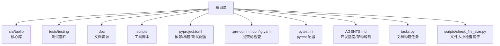
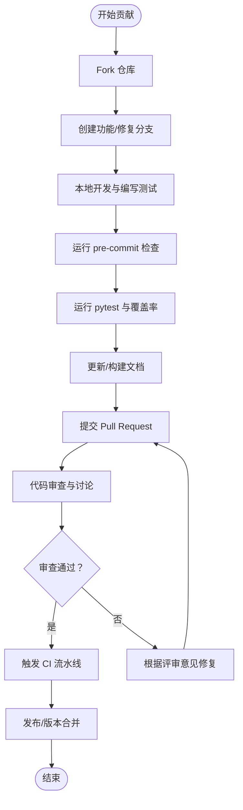
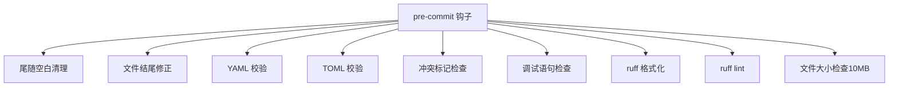
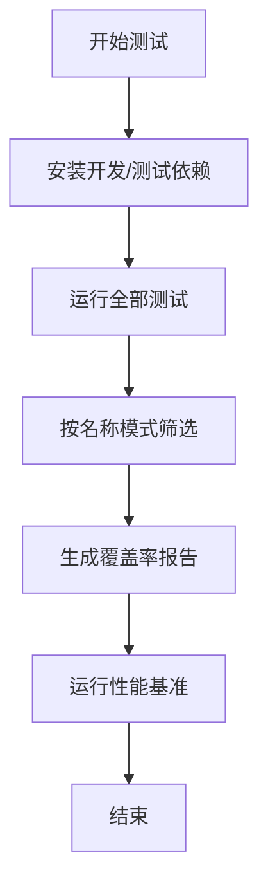
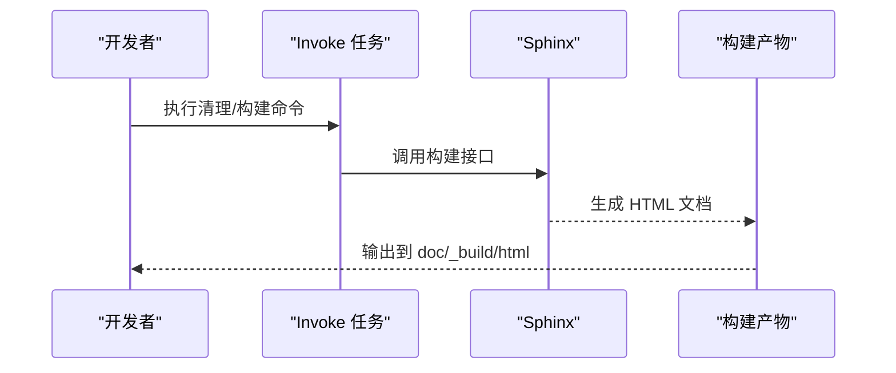
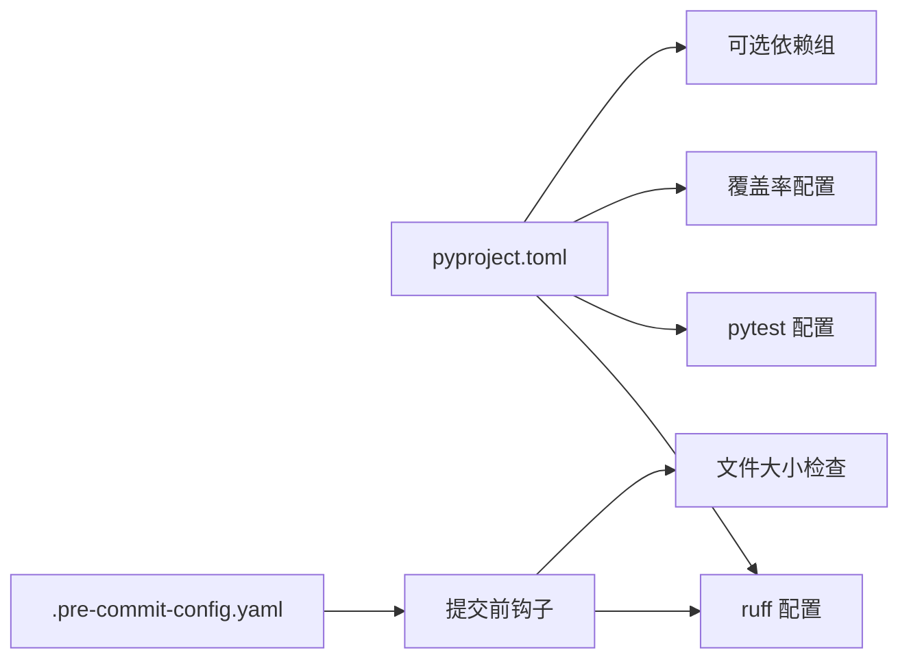

# 贡献流程

<cite>
**本文引用的文件**
- [CONTRIBUTING.md](file://CONTRIBUTING.md)
- [README.md](file://README.md)
- [pyproject.toml](file://pyproject.toml)
- [.pre-commit-config.yaml](file://.pre-commit-config.yaml)
- [pytest.ini](file://pytest.ini)
- [testing.md](file://testing.md)
- [AGENTS.md](file://AGENTS.md)
- [tasks.py](file://tasks.py)
- [scripts/check_file_size.py](file://scripts/check_file_size.py)
</cite>

## 目录
1. [简介](#简介)
2. [项目结构](#项目结构)
3. [核心组件](#核心组件)
4. [架构总览](#架构总览)
5. [详细组件分析](#详细组件分析)
6. [依赖分析](#依赖分析)
7. [性能考虑](#性能考虑)
8. [故障排查指南](#故障排查指南)
9. [结论](#结论)
10. [附录](#附录)

## 简介
本文件面向希望为 FlexLoop（taolib）项目做出贡献的开发者，系统化梳理从 Fork 到提交 Pull Request 的完整流程；规范 Issue 报告、功能请求与 Bug 修复的贡献步骤；明确 Pull Request 模板使用、代码审查流程与合并策略；给出 CI/CD 流水线配置、自动测试触发与发布流程的操作指南；并提供社区参与规范、沟通渠道与协作最佳实践，以及项目维护者决策流程、版本发布周期与向后兼容性政策的说明。

## 项目结构
本项目采用模块化的 Python 包结构，核心代码位于 src/taolib 下，测试用例集中在 tests/testing，文档与脚本分布在 doc、scripts 与根目录配置文件中。关键贡献相关文件包括：
- 依赖与构建配置：pyproject.toml
- 提交前检查：.pre-commit-config.yaml
- 测试与覆盖率：pytest.ini、testing.md
- 文档构建：tasks.py、AGENTS.md
- 贡献与使用说明：CONTRIBUTING.md、README.md
- 文件大小检查钩子：scripts/check_file_size.py

图表来源
- [pyproject.toml](file://pyproject.toml)
- [.pre-commit-config.yaml](file://.pre-commit-config.yaml)
- [pytest.ini](file://pytest.ini)
- [AGENTS.md](file://AGENTS.md)
- [tasks.py](file://tasks.py)
- [scripts/check_file_size.py](file://scripts/check_file_size.py)

章节来源
- [pyproject.toml](file://pyproject.toml)
- [.pre-commit-config.yaml](file://.pre-commit-config.yaml)
- [pytest.ini](file://pytest.ini)
- [AGENTS.md](file://AGENTS.md)
- [tasks.py](file://tasks.py)
- [scripts/check_file_size.py](file://scripts/check_file_size.py)

## 核心组件
- 依赖与可选功能：通过可选依赖组（extras）管理不同子系统的功能开关，便于最小化核心依赖并按需扩展。
- 提交前检查：集成 pre-commit 钩子，覆盖空白字符清理、YAML/TOML 校验、大文件限制、ruff 格式化与 lint。
- 测试体系：pytest 配置与测试指南，覆盖单元、集成、系统与端到端测试，并设定覆盖率门槛。
- 文档构建：Invoke 任务封装 Sphinx，支持多站点与严格模式构建。
- 开发环境：统一的 Python 版本要求与常用命令，便于快速上手。

章节来源
- [pyproject.toml](file://pyproject.toml)
- [.pre-commit-config.yaml](file://.pre-commit-config.yaml)
- [pytest.ini](file://pytest.ini)
- [testing.md](file://testing.md)
- [AGENTS.md](file://AGENTS.md)
- [tasks.py](file://tasks.py)

## 架构总览
贡献流程围绕“准备—开发—测试—审查—合并”闭环展开，结合预提交检查与测试配置，确保变更质量与一致性。

## 详细组件分析

### Issue 报告与功能请求
- 在提交 Issue 前，请先查阅现有 Issue 与讨论区，避免重复。
- Issue 应包含：标题清晰、复现步骤、期望行为、实际行为、环境信息（Python 版本、操作系统、相关依赖版本）、日志片段或最小复现。
- 功能请求建议描述背景、收益与可能的实现方案，便于维护者评估优先级。

章节来源
- [README.md](file://README.md)

### Bug 修复贡献标准程序
- 选择或创建对应 Issue，创建以修复命名的分支（如 fix/<issue>）。
- 编写最小可复现测试，定位问题并修复，确保测试通过。
- 更新相关文档与变更日志（如适用），提交 PR 时说明动机、改动点、影响范围与验证方式。

章节来源
- [README.md](file://README.md)
- [testing.md](file://testing.md)

### Pull Request 模板与审查流程
- PR 描述建议包含：变更动机、具体改动、影响范围、测试覆盖、风险与回滚预案、是否破坏向后兼容性。
- 代码审查关注：代码风格（ruff）、类型注解、测试覆盖率、性能与安全性、文档一致性。
- 合并策略：至少一名维护者批准；满足测试与审查要求后方可合并；紧急修复可走快速通道但需事后补记录。

章节来源
- [README.md](file://README.md)
- [pyproject.toml](file://pyproject.toml)
- [.pre-commit-config.yaml](file://.pre-commit-config.yaml)

### 提交前检查（Pre-commit）
- 钩子清单：尾随空白清理、文件结尾修正、YAML/TOML 校验、大文件检查（默认 10MB）、ruff 格式化与 lint、调试语句检查。
- 大文件限制：通过本地钩子脚本对图片/压缩包等二进制文件进行大小校验，避免污染仓库体积。
- 运行方式：在提交前执行 pre-commit run --all-files，或在 CI 中启用相同规则。

图表来源
- [.pre-commit-config.yaml](file://.pre-commit-config.yaml)
- [scripts/check_file_size.py](file://scripts/check_file_size.py)

章节来源
- [.pre-commit-config.yaml](file://.pre-commit-config.yaml)
- [scripts/check_file_size.py](file://scripts/check_file_size.py)

### 测试与覆盖率
- 测试框架：pytest，支持异步测试、标记（asyncio/slow）与覆盖率统计。
- 覆盖率门槛：整体覆盖率不低于 80%，排除特定示例文件。
- 测试策略：单元、集成、系统、端到端测试并重，优先保证关键路径与边界条件。
- 常用命令：安装开发与测试依赖、运行全部测试、按名称模式筛选、生成覆盖率报告、运行性能基准脚本。

图表来源
- [pytest.ini](file://pytest.ini)
- [testing.md](file://testing.md)
- [pyproject.toml](file://pyproject.toml)

章节来源
- [pytest.ini](file://pytest.ini)
- [testing.md](file://testing.md)
- [pyproject.toml](file://pyproject.toml)

### 文档构建与发布
- 文档构建：通过 Invoke 任务封装 Sphinx，支持清理、构建与严格模式（nitpick）。
- 常用命令：清理输出、构建 HTML、指定语言构建、构建并 nitpick。
- 发布：遵循版本策略与变更日志维护，确保文档与代码同步。

图表来源
- [tasks.py](file://tasks.py)
- [AGENTS.md](file://AGENTS.md)

章节来源
- [tasks.py](file://tasks.py)
- [AGENTS.md](file://AGENTS.md)

### 社区参与与沟通
- 沟通渠道：Issue 与 Discussions；PR 作为协作与审查的主要载体。
- 行为准则：尊重、包容、建设性反馈；遵守许可证条款。
- 贡献认可：贡献者列表与许可证信息详见仓库。

章节来源
- [README.md](file://README.md)
- [CONTRIBUTING.md](file://CONTRIBUTING.md)

### 维护者决策与版本策略
- 维护者：项目维护者负责最终审批与合并。
- 版本发布周期：按里程碑推进，结合质量门禁与审查结果确定发布时间。
- 向后兼容性：尽量保持 API 稳定，破坏性变更需在变更日志中明确标注并提供迁移指引。
- 许可证：项目采用宽松许可证，贡献即默认同意许可证条款。

章节来源
- [README.md](file://README.md)
- [CONTRIBUTING.md](file://CONTRIBUTING.md)

## 依赖分析
- 依赖管理：通过 pyproject.toml 的可选依赖组（如 auth、config-server、data-sync、email-service、file-storage、oauth、rate-limiter、task-queue、analytics、site、qrcode、audit、multi-agent 等）隔离功能模块，降低核心包体积。
- 测试与开发：dev、doc、test 等 extras 便于本地开发与文档构建。
- Lint 与格式化：ruff 配置统一风格，pre-commit 自动执行，减少人工负担。
- 覆盖率：覆盖率阈值与排除规则在 pyproject.toml 中集中配置。

图表来源
- [pyproject.toml](file://pyproject.toml)
- [.pre-commit-config.yaml](file://.pre-commit-config.yaml)
- [scripts/check_file_size.py](file://scripts/check_file_size.py)

章节来源
- [pyproject.toml](file://pyproject.toml)
- [.pre-commit-config.yaml](file://.pre-commit-config.yaml)
- [scripts/check_file_size.py](file://scripts/check_file_size.py)

## 性能考虑
- 测试性能：通过标记（slow）区分慢速测试，便于按需执行；性能基准脚本用于回归检测。
- 代码质量：ruff 格式化与 lint 提升可读性与一致性，减少潜在性能陷阱。
- 文档构建：多站点与严格模式构建有助于提前发现文档问题，避免发布后返工。

章节来源
- [testing.md](file://testing.md)
- [AGENTS.md](file://AGENTS.md)

## 故障排查指南
- 提交前检查失败
  - 空白字符/文件结尾/冲突标记：由 pre-commit 自动修复或提示手动修正。
  - ruff 格式化/lint：根据提示修正风格或类型注解。
  - 大文件：删除或压缩超限文件，或调整钩子阈值（谨慎）。
- 测试失败
  - 逐类/逐文件运行测试定位问题；使用 -k 参数按名称模式筛选；检查覆盖率报告。
  - 异步测试：确保标记与运行模式正确。
- 文档构建异常
  - 清理输出后重新构建；启用 nitpick 模式定位交叉引用问题。
- 常见环境问题
  - Windows GBK 编码崩溃：确保 stdout UTF-8 设置；Conda 环境路径与 Python 3.14 一致。

章节来源
- [.pre-commit-config.yaml](file://.pre-commit-config.yaml)
- [scripts/check_file_size.py](file://scripts/check_file_size.py)
- [pytest.ini](file://pytest.ini)
- [testing.md](file://testing.md)
- [AGENTS.md](file://AGENTS.md)

## 结论
本贡献流程文档将仓库现有的依赖、测试、文档与提交前检查配置整合为一套可操作的协作规范。建议贡献者在每次提交前完成预检与测试，确保 PR 达到审查与合并标准；维护者依据审查结果与质量门禁推进合并与发布。通过持续的测试与文档完善，保障项目的长期可维护性与社区协作效率。

## 附录
- 常用命令速查
  - 安装开发与测试依赖：pip install -e ".[dev,doc,test]"
  - 运行全部测试：python -m pytest tests/testing/ -v
  - 运行单个测试文件：python -m pytest tests/testing/test_remote/ -v
  - 按名称模式运行：python -m pytest tests/testing/ -k "test_probe" -v
  - 带覆盖率：coverage run -m pytest tests/testing/ && coverage report
  - 运行性能基准：python tests/testing/perf_remote_bench.py
  - 提交前检查：pre-commit run --all-files
  - 文档构建：python -m invoke doc.clean / doc / doc.build --nitpick / doc.build --language en
  - 打包：python -m build

章节来源
- [testing.md](file://testing.md)
- [AGENTS.md](file://AGENTS.md)
- [tasks.py](file://tasks.py)
- [pyproject.toml](file://pyproject.toml)