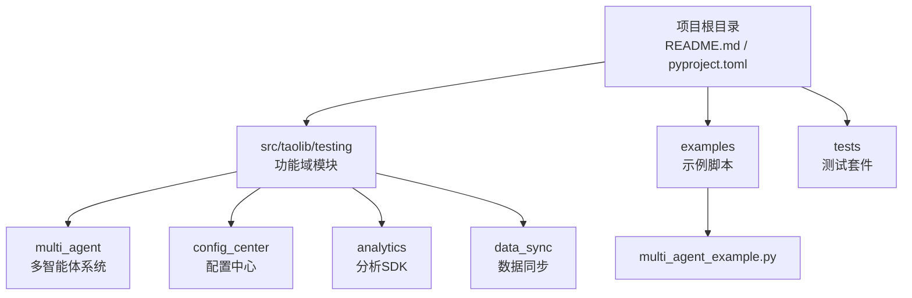
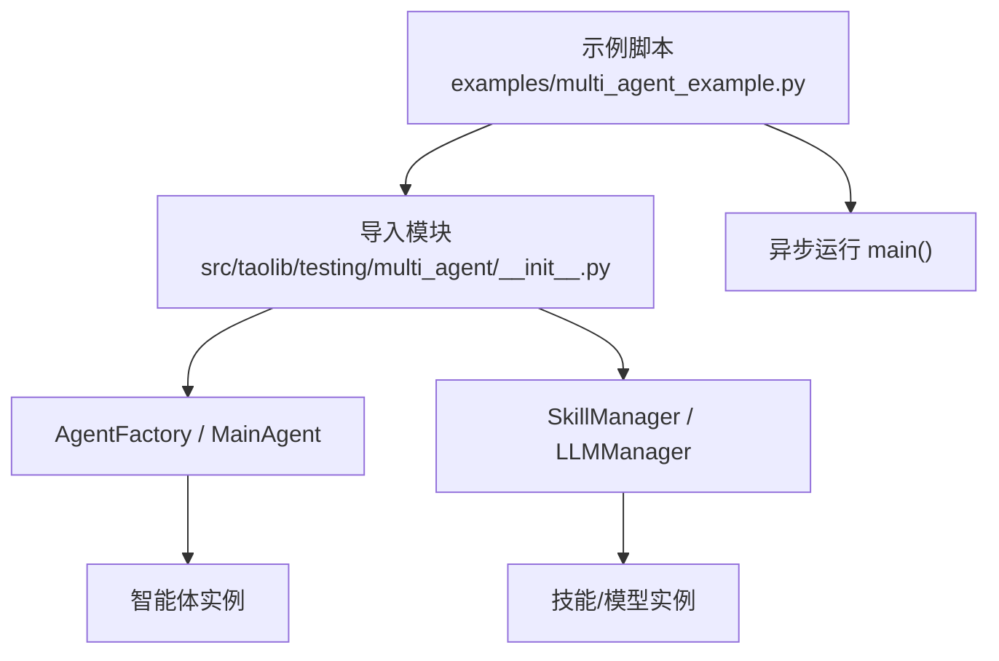
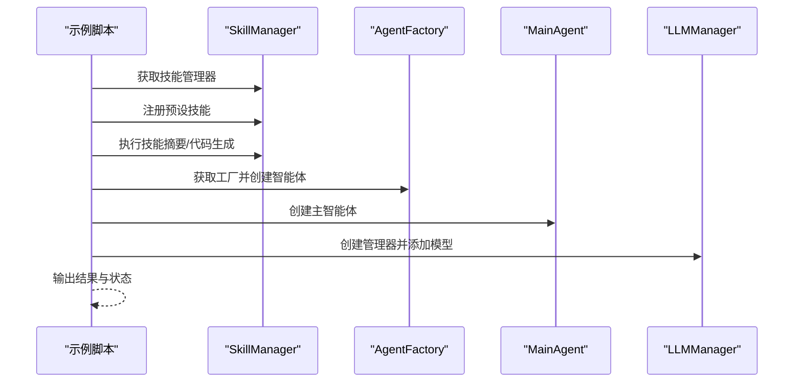
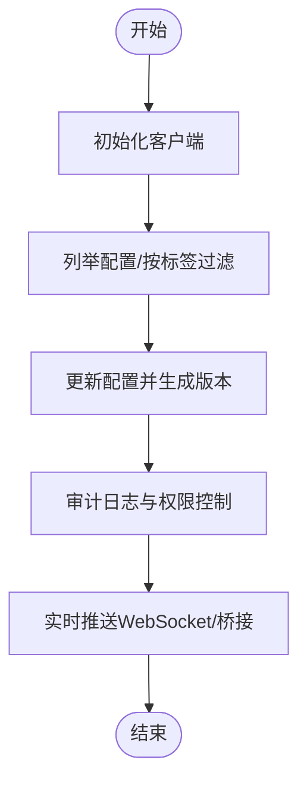
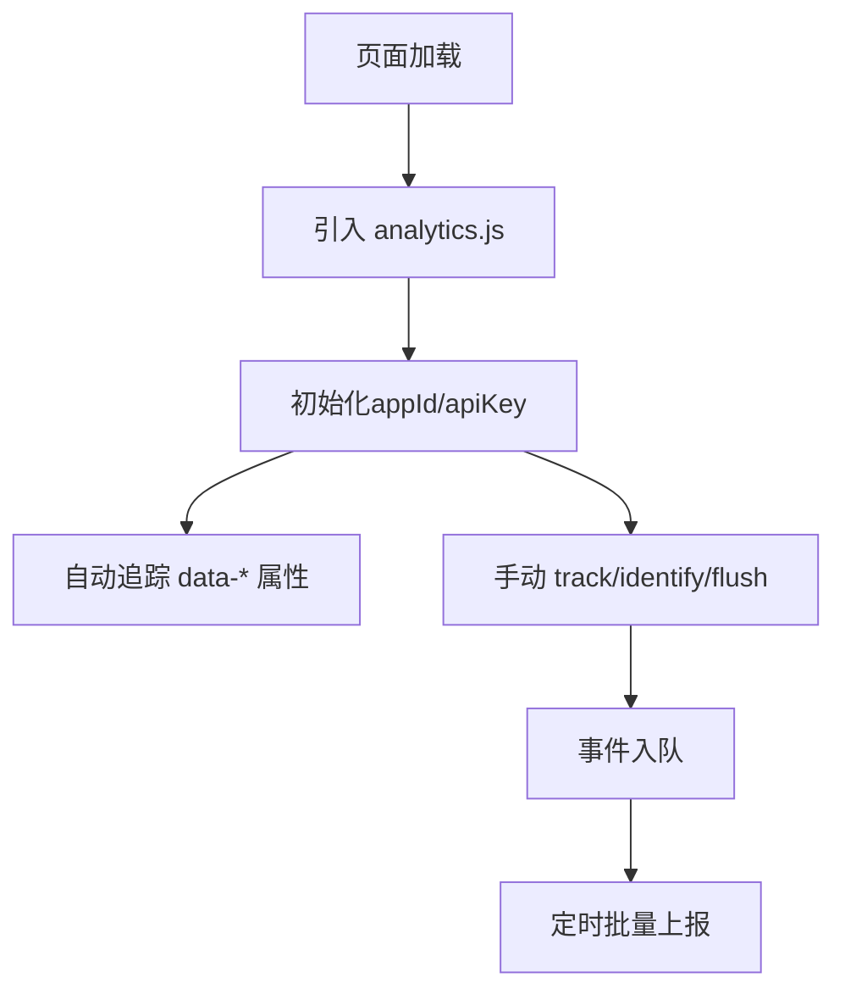
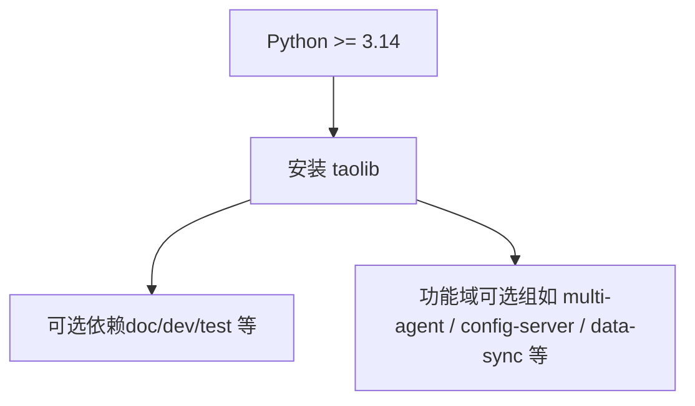

# 快速开始

<cite>
**本文引用的文件**
- [README.md](file://README.md)
- [pyproject.toml](file://pyproject.toml)
- [multi_agent_example.py](file://examples/multi_agent_example.py)
- [multi_agent/__init__.py](file://src/taolib/testing/multi_agent/__init__.py)
- [config_center/__init__.py](file://src/taolib/testing/config_center/__init__.py)
- [analytics.js](file://src/taolib/testing/analytics/sdk/analytics.js)
- [main.py（配置中心）](file://src/taolib/testing/config_center/server/main.py)
- [main.py（数据同步）](file://src/taolib/testing/data_sync/server/main.py)
- [tasks.py](file://tasks.py)
</cite>

## 目录
1. [简介](#简介)
2. [项目结构](#项目结构)
3. [核心组件](#核心组件)
4. [架构总览](#架构总览)
5. [详细组件分析](#详细组件分析)
6. [依赖分析](#依赖分析)
7. [性能考虑](#性能考虑)
8. [故障排除指南](#故障排除指南)
9. [结论](#结论)
10. [附录](#附录)

## 简介
本指南面向首次接触 FlexLoop（taolib）的开发者，帮助你在约 30 分钟内完成环境准备、安装、基础配置与第一个 Hello World 示例运行。你将学会：
- 环境要求与安装方式（PyPI 与源码安装）
- 基础配置与常用初始化模式
- 使用多智能体系统进行“Hello World”示例
- 常见问题排查与最佳实践

## 项目结构
taolib 是一个模块化的 Python 库，采用分层与功能域划分的组织方式：
- 根目录提供安装与文档构建说明
- src/taolib/testing 下按功能域拆分子模块（多智能体、配置中心、数据分析、任务队列等）
- examples 提供可直接运行的示例脚本
- tests 提供各模块的测试用例与验证工具

图表来源
- [README.md:1-100](file://README.md#L1-L100)
- [pyproject.toml:1-318](file://pyproject.toml#L1-L318)

章节来源
- [README.md:45-80](file://README.md#L45-L80)
- [pyproject.toml:1-318](file://pyproject.toml#L1-L318)

## 核心组件
- 多智能体系统：提供智能体工厂、技能管理、LLM 管理与主智能体编排能力，适合快速搭建多 Agent 场景。
- 配置中心：提供多环境配置管理、版本控制、审计与实时推送，支持客户端 SDK 与服务端。
- 分析 SDK：提供前端轻量级分析埋点 SDK，支持会话管理与事件上报。
- 数据同步：提供作业、检查点、失败处理与指标统计的管道与服务端。

章节来源
- [multi_agent/__init__.py:1-181](file://src/taolib/testing/multi_agent/__init__.py#L1-L181)
- [config_center/__init__.py:1-70](file://src/taolib/testing/config_center/__init__.py#L1-L70)
- [analytics.js:1-43](file://src/taolib/testing/analytics/sdk/analytics.js#L1-L43)

## 架构总览
下图展示了从示例脚本到核心模块的调用关系与典型运行路径：

图表来源
- [multi_agent_example.py:14-33](file://examples/multi_agent_example.py#L14-L33)
- [multi_agent_example.py:173-196](file://examples/multi_agent_example.py#L173-L196)
- [multi_agent/__init__.py:6-89](file://src/taolib/testing/multi_agent/__init__.py#L6-L89)

## 详细组件分析

### 多智能体系统（Hello World 示例）
- 目标：通过示例脚本演示技能注册、执行与智能体创建流程
- 步骤概览：
  1) 获取技能管理器并注册预设技能
  2) 执行文本摘要与代码生成技能
  3) 通过工厂创建智能体模板与自定义智能体
  4) 创建主智能体并执行生命周期管理
  5) 使用 LLM 管理器添加模型并列出可用模型

图表来源
- [multi_agent_example.py:36-78](file://examples/multi_agent_example.py#L36-L78)
- [multi_agent_example.py:80-118](file://examples/multi_agent_example.py#L80-L118)
- [multi_agent_example.py:120-140](file://examples/multi_agent_example.py#L120-L140)
- [multi_agent_example.py:142-172](file://examples/multi_agent_example.py#L142-L172)

章节来源
- [multi_agent_example.py:1-196](file://examples/multi_agent_example.py#L1-L196)
- [multi_agent/__init__.py:6-89](file://src/taolib/testing/multi_agent/__init__.py#L6-L89)

### 配置中心（基础使用模式）
- 目标：理解配置中心的公开 API 与基本使用方式
- 常见导出项：客户端、配置模型、枚举与校验器
- 典型流程：通过客户端连接服务端，进行配置读取、变更与版本管理

图表来源
- [config_center/__init__.py:29-67](file://src/taolib/testing/config_center/__init__.py#L29-L67)

章节来源
- [config_center/__init__.py:1-70](file://src/taolib/testing/config_center/__init__.py#L1-L70)

### 分析 SDK（前端埋点）
- 目标：在前端页面集成分析 SDK，自动/手动追踪事件与会话
- 关键能力：会话管理、事件队列、批量上报、自动追踪 data 属性

图表来源
- [analytics.js:1-43](file://src/taolib/testing/analytics/sdk/analytics.js#L1-L43)
- [analytics.js:81-127](file://src/taolib/testing/analytics/sdk/analytics.js#L81-L127)

章节来源
- [analytics.js:1-127](file://src/taolib/testing/analytics/sdk/analytics.js#L1-L127)

## 依赖分析
- Python 版本要求：3.14+
- 可选依赖（开发/文档）：invoke、sphinx 系列、matplotlib、pytest 等
- 功能域依赖：多智能体、配置中心、数据分析、任务队列、邮件服务、文件存储、OAuth、速率限制等，均以可选组形式提供

图表来源
- [pyproject.toml:14](file://pyproject.toml#L14)
- [pyproject.toml:20-142](file://pyproject.toml#L20-L142)

章节来源
- [pyproject.toml:1-318](file://pyproject.toml#L1-L318)

## 性能考虑
- 异步运行：示例脚本使用 asyncio，建议在实际项目中保持异步执行以提升吞吐
- 事件批量与定时刷新：分析 SDK 默认批量大小与刷新间隔，可根据网络与性能需求调整
- 服务端启动参数：配置中心与数据同步服务端支持 host/port/reload/log-level 等参数，便于开发与生产场景切换

章节来源
- [multi_agent_example.py:173-196](file://examples/multi_agent_example.py#L173-L196)
- [analytics.js:27-43](file://src/taolib/testing/analytics/sdk/analytics.js#L27-L43)
- [main.py（配置中心）:14-47](file://src/taolib/testing/config_center/server/main.py#L14-L47)
- [main.py（数据同步）:14-47](file://src/taolib/testing/data_sync/server/main.py#L14-L47)

## 故障排除指南
- Python 版本不满足要求
  - 现象：安装时报错或运行时报错
  - 解决：升级至 Python 3.14+ 后重试
  - 参考：[pyproject.toml:14](file://pyproject.toml#L14)
- 安装后无法导入模块
  - 现象：ImportError 或 ModuleNotFoundError
  - 解决：确认使用的是已安装的 taolib；如需从源码开发，请使用可编辑安装
  - 参考：[README.md:45-66](file://README.md#L45-L66)
- 示例脚本无法运行
  - 现象：找不到模块或路径错误
  - 解决：示例脚本需要将 src 添加到 sys.path，确保导入成功
  - 参考：[multi_agent_example.py:10-12](file://examples/multi_agent_example.py#L10-L12)
- 文档构建命令不可用
  - 现象：inv 命令不存在
  - 解决：使用 python -m invoke 替代，或安装 invoke 并激活虚拟环境
  - 参考：[README.md:72-79](file://README.md#L72-L79)
- 服务端启动失败
  - 现象：端口占用或依赖未安装
  - 解决：修改 --port，或安装对应可选依赖组后再启动
  - 参考：[main.py（配置中心）:16-31](file://src/taolib/testing/config_center/server/main.py#L16-L31), [pyproject.toml:71-95](file://pyproject.toml#L71-L95)
- 任务构建入口
  - 现象：需要构建文档但不知道命令
  - 解决：使用 tasks.py 中定义的站点任务
  - 参考：[tasks.py:1-4](file://tasks.py#L1-L4)

章节来源
- [README.md:45-80](file://README.md#L45-L80)
- [multi_agent_example.py:10-12](file://examples/multi_agent_example.py#L10-L12)
- [tasks.py:1-4](file://tasks.py#L1-L4)

## 结论
通过本指南，你已经完成了：
- 环境与安装准备
- 基础配置与可选依赖安装
- 多智能体系统的 Hello World 示例运行
- 常见问题的定位与解决思路

建议后续深入学习各功能域的 API 与服务端部署方式，结合实际业务场景扩展使用。

## 附录

### 环境要求与安装步骤
- 环境要求：Python >= 3.14
- PyPI 安装：pip install taolib
- 源码安装（开发/调试）：git clone + pip install -e .
- 可选依赖（文档/开发）：pip install -e ".[doc]" 或 ".[dev]"
- 参考：[README.md:45-66](file://README.md#L45-L66), [pyproject.toml:14, 20-L55](file://pyproject.toml#L14, 20-L55)

### 第一个 Hello World 示例（多智能体）
- 运行方式：python examples/multi_agent_example.py
- 关键要点：
  - 示例脚本会注册预设技能并执行摘要与代码生成
  - 通过工厂创建智能体模板与自定义智能体
  - 创建主智能体并进行生命周期管理
  - 使用 LLM 管理器添加模型并列出可用模型
- 参考：[multi_agent_example.py:1-196](file://examples/multi_agent_example.py#L1-L196)

### 基础配置与常用模式
- 配置中心客户端与模型导出：参考公开 API
- 分析 SDK 初始化与事件追踪：参考前端集成说明
- 服务端启动参数：host/port/reload/log-level
- 参考：
  - [config_center/__init__.py:29-67](file://src/taolib/testing/config_center/__init__.py#L29-L67)
  - [analytics.js:1-43](file://src/taolib/testing/analytics/sdk/analytics.js#L1-L43)
  - [main.py（配置中心）:16-31](file://src/taolib/testing/config_center/server/main.py#L16-L31)