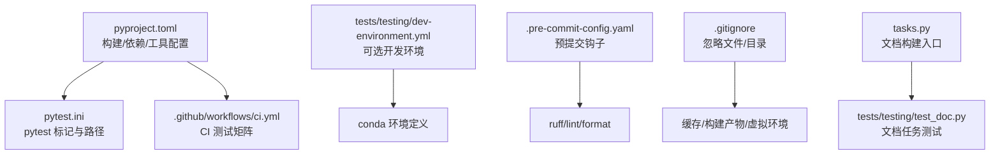
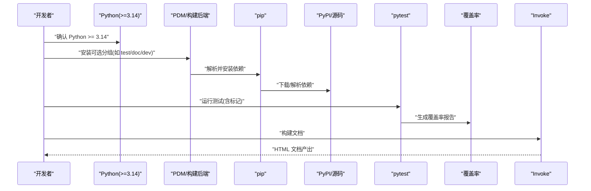
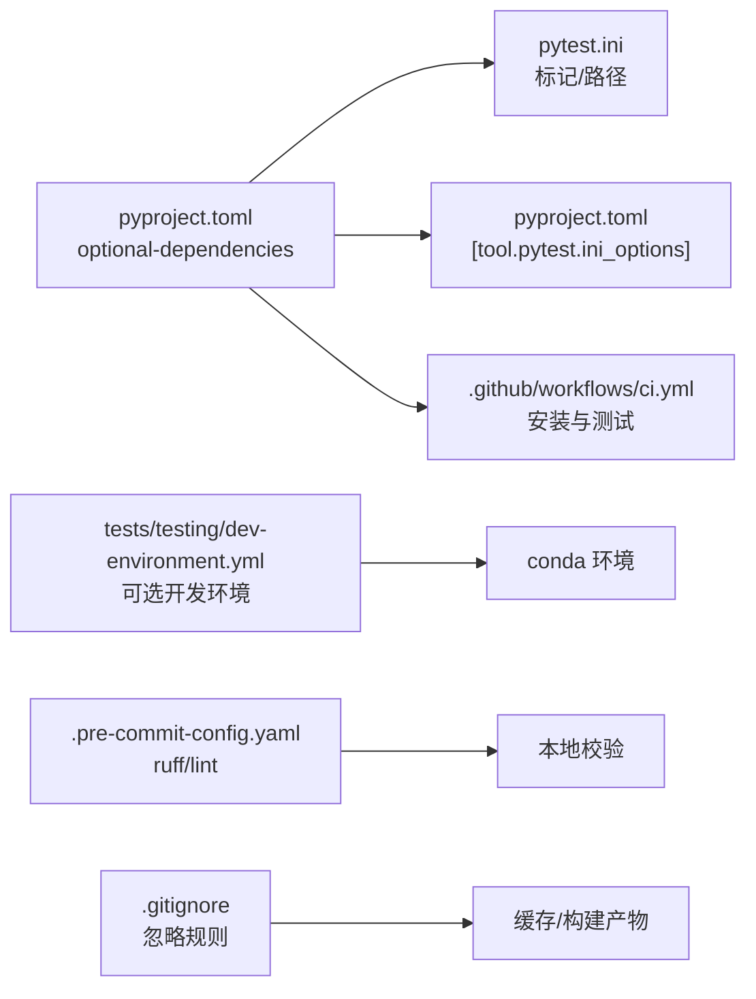

# 安装问题

<cite>
**本文引用的文件**
- [pyproject.toml](file://pyproject.toml)
- [pytest.ini](file://pytest.ini)
- [README.md](file://README.md)
- [.github/workflows/ci.yml](file://.github/workflows/ci.yml)
- [tests/testing/dev-environment.yml](file://tests/testing/dev-environment.yml)
- [.pre-commit-config.yaml](file://.pre-commit-config.yaml)
- [.gitignore](file://.gitignore)
- [tasks.py](file://tasks.py)
- [tests/testing/conftest.py](file://tests/testing/conftest.py)
- [tests/testing/test_doc.py](file://tests/testing/test_doc.py)
</cite>

## 目录
1. [简介](#简介)
2. [项目结构](#项目结构)
3. [核心组件](#核心组件)
4. [架构总览](#架构总览)
5. [详细组件分析](#详细组件分析)
6. [依赖关系分析](#依赖关系分析)
7. [性能考虑](#性能考虑)
8. [故障排查指南](#故障排查指南)
9. [结论](#结论)
10. [附录](#附录)

## 简介
本指南面向首次安装与持续维护 FlexLoop（taolib）项目的用户与贡献者，聚焦以下安装与环境问题：
- Python 版本不兼容
- 依赖安装失败（版本冲突、网络问题、权限问题）
- 虚拟环境配置错误
- 不同操作系统（Windows、Linux、macOS）下的注意事项
- 开发环境初始化、IDE 配置与调试环境搭建
- pytest 配置冲突（pytest.ini 与 pyproject.toml 中的工具配置）
- 环境变量、PATH 与系统依赖检查方法

## 项目结构
本项目采用基于 PDM 的现代 Python 工程组织方式，核心安装与测试配置集中在以下文件中：
- 构建与依赖：pyproject.toml
- 测试框架与标记：pytest.ini 与 pyproject.toml 中的 [tool.pytest.ini_options]
- CI 管道：.github/workflows/ci.yml
- 开发环境（可选）：tests/testing/dev-environment.yml
- 代码质量：.pre-commit-config.yaml
- 忽略规则：.gitignore
- 文档构建入口：tasks.py 与 tests/testing/test_doc.py

图表来源
- [pyproject.toml:1-318](file://pyproject.toml#L1-L318)
- [pytest.ini:1-10](file://pytest.ini#L1-L10)
- [.github/workflows/ci.yml:1-105](file://.github/workflows/ci.yml#L1-L105)
- [tests/testing/dev-environment.yml:1-15](file://tests/testing/dev-environment.yml#L1-L15)
- [.pre-commit-config.yaml:1-29](file://.pre-commit-config.yaml#L1-L29)
- [.gitignore:1-108](file://.gitignore#L1-L108)
- [tasks.py:1-4](file://tasks.py#L1-L4)
- [tests/testing/test_doc.py:1-371](file://tests/testing/test_doc.py#L1-L371)

章节来源
- [pyproject.toml:1-318](file://pyproject.toml#L1-L318)
- [pytest.ini:1-10](file://pytest.ini#L1-L10)
- [.github/workflows/ci.yml:1-105](file://.github/workflows/ci.yml#L1-L105)
- [tests/testing/dev-environment.yml:1-15](file://tests/testing/dev-environment.yml#L1-L15)
- [.pre-commit-config.yaml:1-29](file://.pre-commit-config.yaml#L1-L29)
- [.gitignore:1-108](file://.gitignore#L1-L108)
- [tasks.py:1-4](file://tasks.py#L1-L4)
- [tests/testing/test_doc.py:1-371](file://tests/testing/test_doc.py#L1-L371)

## 核心组件
- Python 版本要求：项目要求 Python >= 3.14，确保使用最新语义与标准库能力，避免旧版兼容性陷阱。
- 依赖管理：使用 PDM 后端进行构建与打包；依赖通过 optional-dependencies 分组（如 test、doc、dev 等），便于按需安装。
- 测试框架：pytest 作为测试运行器，配合 pyproject.toml 中的 [tool.pytest.ini_options] 与 pytest.ini 的标记定义。
- 文档构建：通过 Invoke 任务（tasks.py）与 taolib.testing.doc 模块（tests/testing/test_doc.py）实现。
- 代码质量：Ruff 作为 linter/formatter，pre-commit 钩子自动执行格式化与静态检查。

章节来源
- [pyproject.toml:14](file://pyproject.toml#L14)
- [pyproject.toml:57](file://pyproject.toml#L57)
- [pyproject.toml:297-318](file://pyproject.toml#L297-L318)
- [pytest.ini:1-10](file://pytest.ini#L1-L10)
- [tasks.py:1-4](file://tasks.py#L1-L4)
- [tests/testing/test_doc.py:1-30](file://tests/testing/test_doc.py#L1-L30)
- [.pre-commit-config.yaml:14-20](file://.pre-commit-config.yaml#L14-L20)

## 架构总览
下图展示安装与测试相关的关键流程：从 Python 版本选择到依赖安装、pytest 运行、覆盖率统计与文档构建。

图表来源
- [pyproject.toml:14](file://pyproject.toml#L14)
- [pyproject.toml:57](file://pyproject.toml#L57)
- [pyproject.toml:297-318](file://pyproject.toml#L297-L318)
- [.github/workflows/ci.yml:37-44](file://.github/workflows/ci.yml#L37-L44)
- [tasks.py:1-4](file://tasks.py#L1-L4)
- [tests/testing/test_doc.py:1-30](file://tests/testing/test_doc.py#L1-L30)

## 详细组件分析

### Python 版本与环境要求
- 最低版本：Python >= 3.14
- 推荐：使用官方发行版，避免第三方预编译二进制可能带来的 ABI 不一致
- 虚拟环境：强烈建议使用 venv 或 conda 创建隔离环境，避免全局污染

章节来源
- [pyproject.toml:14](file://pyproject.toml#L14)
- [README.md:47-52](file://README.md#L47-L52)

### 依赖安装与分组
- 依赖分组：test、doc、dev 等，便于按需安装
- 可选分组：例如安装开发与文档相关依赖
- 安装命令示例：参见 README 的“安装”小节

章节来源
- [pyproject.toml:57](file://pyproject.toml#L57)
- [pyproject.toml:20-55](file://pyproject.toml#L20-L55)
- [README.md:62-78](file://README.md#L62-L78)

### pytest 配置与冲突处理
- 配置来源：
  - pytest.ini：定义 testpaths、python_* 规则与自定义标记
  - pyproject.toml：[tool.pytest.ini_options] 提供 addopts、asyncio_mode、testpaths 等
- 冲突说明：
  - 若同时存在 pytest.ini 与 pyproject.toml 的 [tool.pytest.ini_options]，pytest 会合并配置
  - 建议统一在 pyproject.toml 中集中管理，减少重复与歧义
- 常用标记：asyncio、slow，用于区分异步与耗时测试

章节来源
- [pytest.ini:1-10](file://pytest.ini#L1-L10)
- [pyproject.toml:297-303](file://pyproject.toml#L297-L303)

### 文档构建与 Invoke 任务
- 入口：tasks.py 中定义站点命名空间
- 实现：tests/testing/test_doc.py 验证文档任务（clean/build/sites 等）
- 建议：先安装 doc 分组依赖，再执行文档任务

章节来源
- [tasks.py:1-4](file://tasks.py#L1-L4)
- [tests/testing/test_doc.py:1-30](file://tests/testing/test_doc.py#L1-L30)
- [pyproject.toml:21-53](file://pyproject.toml#L21-L53)

### CI 与覆盖率阈值
- CI 矩阵：ubuntu-latest 与 windows-latest，Python 3.14
- 安装：pip install -e ".[test]"
- 运行：pytest tests/ 并生成 XML/HTML 报告
- 覆盖率阈值：fail_under=80

章节来源
- [.github/workflows/ci.yml:22-23](file://.github/workflows/ci.yml#L22-L23)
- [.github/workflows/ci.yml:37-44](file://.github/workflows/ci.yml#L37-L44)
- [pyproject.toml:305-318](file://pyproject.toml#L305-L318)

### 代码质量与预提交
- 钩子：ruff（lint/format）、文件大小检查等
- 建议：在本地启用 pre-commit，避免提交不符合规范的代码

章节来源
- [.pre-commit-config.yaml:1-29](file://.pre-commit-config.yaml#L1-L29)

## 依赖关系分析

图表来源
- [pyproject.toml:20-55](file://pyproject.toml#L20-L55)
- [pytest.ini:1-10](file://pytest.ini#L1-L10)
- [pyproject.toml:297-318](file://pyproject.toml#L297-L318)
- [.github/workflows/ci.yml:37-44](file://.github/workflows/ci.yml#L37-L44)
- [tests/testing/dev-environment.yml:1-15](file://tests/testing/dev-environment.yml#L1-L15)
- [.pre-commit-config.yaml:1-29](file://.pre-commit-config.yaml#L1-L29)
- [.gitignore:1-108](file://.gitignore#L1-L108)

章节来源
- [pyproject.toml:20-55](file://pyproject.toml#L20-L55)
- [pytest.ini:1-10](file://pytest.ini#L1-L10)
- [pyproject.toml:297-318](file://pyproject.toml#L297-L318)
- [.github/workflows/ci.yml:37-44](file://.github/workflows/ci.yml#L37-L44)
- [tests/testing/dev-environment.yml:1-15](file://tests/testing/dev-environment.yml#L1-L15)
- [.pre-commit-config.yaml:1-29](file://.pre-commit-config.yaml#L1-L29)
- [.gitignore:1-108](file://.gitignore#L1-L108)

## 性能考虑
- 依赖解析与安装：尽量使用缓存策略（CI 中已启用 pip 缓存），避免重复下载
- 测试并发：pytest 支持 asyncio_mode，合理使用标记与并行策略提升效率
- 文档构建：并行构建（如适用）与增量构建可减少等待时间

## 故障排查指南

### Python 版本不兼容
- 症状：安装时报错或运行时报“语法/特性不支持”
- 解决：
  - 升级 Python 至 3.14+（推荐使用官方发行版）
  - 在虚拟环境中使用对应版本，避免与系统 Python 冲突
- 参考
  - [pyproject.toml:14](file://pyproject.toml#L14)
  - [README.md:47-52](file://README.md#L47-L52)

章节来源
- [pyproject.toml:14](file://pyproject.toml#L14)
- [README.md:47-52](file://README.md#L47-L52)

### 依赖安装失败（版本冲突）
- 症状：pip 报错“无法解析/冲突”或“找不到满足条件的版本”
- 排查与解决：
  - 使用 PDM 安装（推荐），由 PDM 后端统一解析与安装
  - 按需安装可选分组，避免一次性安装过多依赖导致冲突
  - 清理缓存后重试（删除 pip 缓存目录）
  - 固定版本：在 pyproject.toml 中为关键依赖指定兼容范围
- 参考
  - [pyproject.toml:57](file://pyproject.toml#L57)
  - [pyproject.toml:20-55](file://pyproject.toml#L20-L55)

章节来源
- [pyproject.toml:57](file://pyproject.toml#L57)
- [pyproject.toml:20-55](file://pyproject.toml#L20-L55)

### 网络连接问题
- 症状：pip 下载超时、证书错误、DNS 解析失败
- 解决：
  - 切换至国内镜像源（如清华、阿里云镜像）
  - 代理配置：设置 HTTPS/HTTP 代理环境变量
  - 临时禁用缓存重试：pip install --no-cache-dir
- 参考
  - [pyproject.toml:57](file://pyproject.toml#L57)

章节来源
- [pyproject.toml:57](file://pyproject.toml#L57)

### 权限错误（Windows/macOS/Linux）
- 症状：Permission denied、无法写入全局目录
- 解决：
  - 使用虚拟环境（venv/conda），避免写入系统目录
  - Linux/macOS：不要使用 sudo 执行 pip；如必须，先切换到目标用户
  - Windows：以管理员身份运行终端（谨慎使用）
- 参考
  - [README.md:54-66](file://README.md#L54-L66)

章节来源
- [README.md:54-66](file://README.md#L54-L66)

### 虚拟环境配置错误
- 症状：模块导入失败、路径不在 sys.path 中
- 解决：
  - 使用 -e（可编辑）安装源码，确保导入到 src/taolib
  - 确认虚拟环境已激活后再执行安装与测试
  - 如需在测试中导入 src，参考根 conftest 的 sys.path 注入逻辑
- 参考
  - [README.md:54-66](file://README.md#L54-L66)
  - [tests/testing/conftest.py:17-22](file://tests/testing/conftest.py#L17-L22)

章节来源
- [README.md:54-66](file://README.md#L54-L66)
- [tests/testing/conftest.py:17-22](file://tests/testing/conftest.py#L17-L22)

### pytest 配置冲突（pytest.ini vs pyproject.toml）
- 症状：测试发现异常、标记未生效、路径不匹配
- 解决：
  - 建议统一在 pyproject.toml 的 [tool.pytest.ini_options] 中配置
  - 如保留 pytest.ini，确保与 pyproject.toml 不冲突（尤其是 testpaths、python_*）
  - 使用 --collect-only 或 -v 查看实际发现的测试集，定位问题
- 参考
  - [pytest.ini:1-10](file://pytest.ini#L1-L10)
  - [pyproject.toml:297-303](file://pyproject.toml#L297-L303)

章节来源
- [pytest.ini:1-10](file://pytest.ini#L1-L10)
- [pyproject.toml:297-303](file://pyproject.toml#L297-L303)

### 不同操作系统注意事项
- Windows
  - 使用 PowerShell/WSL；避免在路径中出现空格
  - 注意 .bat/.cmd 与 shell 脚本差异
- Linux/macOS
  - 使用 venv 或 conda；注意系统依赖（如编译工具链）
  - PATH 中确保 Python 与 pip 指向同一虚拟环境
- 参考
  - [.github/workflows/ci.yml:22-23](file://.github/workflows/ci.yml#L22-L23)

章节来源
- [.github/workflows/ci.yml:22-23](file://.github/workflows/ci.yml#L22-L23)

### 开发环境初始化与 IDE 配置
- 初始化步骤
  - 创建并激活虚拟环境
  - 安装可选分组：doc、dev
  - 安装可编辑模式源码：pip install -e .
- IDE 建议
  - 将 src/ 添加到项目源根（Python Path）
  - 启用 Ruff 插件，同步 .pre-commit 配置
  - 使用 pytest 集成，设置工作目录与标记过滤
- 参考
  - [README.md:54-78](file://README.md#L54-L78)
  - [.pre-commit-config.yaml:1-29](file://.pre-commit-config.yaml#L1-L29)

章节来源
- [README.md:54-78](file://README.md#L54-L78)
- [.pre-commit-config.yaml:1-29](file://.pre-commit-config.yaml#L1-L29)

### 调试环境搭建
- 使用 tests/testing/dev-environment.yml（可选）创建专用开发环境
- 在 conda 环境中安装 .[doc,dev]，确保文档与开发工具可用
- 参考
  - [tests/testing/dev-environment.yml:1-15](file://tests/testing/dev-environment.yml#L1-L15)

章节来源
- [tests/testing/dev-environment.yml:1-15](file://tests/testing/dev-environment.yml#L1-L15)

### 环境变量、PATH 与系统依赖检查
- 环境变量
  - 代理：HTTPS_PROXY/HTTP_PROXY
  - pip 缓存：PIP_CACHE_DIR
- PATH
  - 确保虚拟环境的 Scripts/ 或 bin/ 在 PATH 前部
- 系统依赖
  - 编译工具链（Linux/macOS）：gcc/g++/make
  - OpenSSL、zlib 等（某些二进制包需要）
- 参考
  - [.github/workflows/ci.yml:30-35](file://.github/workflows/ci.yml#L30-L35)

章节来源
- [.github/workflows/ci.yml:30-35](file://.github/workflows/ci.yml#L30-L35)

## 结论
- 严格遵循 Python >= 3.14 的版本要求
- 使用 PDM 管理依赖与构建，按需安装可选分组
- pytest 配置建议集中在 pyproject.toml，避免与 pytest.ini 冲突
- 通过虚拟环境、PATH 与环境变量管理，确保跨平台一致性
- 利用 CI 覆盖率阈值与预提交钩子，保障代码质量

## 附录

### 常用命令速查
- 安装可编辑模式：pip install -e .
- 安装可选分组：pip install -e ".[doc,dev]"
- 运行测试：pytest tests/ -v
- 生成覆盖率：pytest --cov=taolib --cov-report=xml --cov-report=term-missing
- 文档构建：python -m invoke doc.clean && python -m invoke doc

章节来源
- [README.md:54-78](file://README.md#L54-L78)
- [pyproject.toml:57](file://pyproject.toml#L57)
- [pyproject.toml:297-303](file://pyproject.toml#L297-L303)