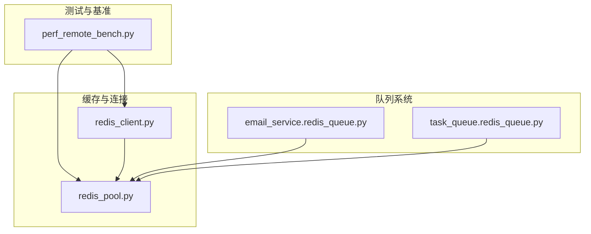
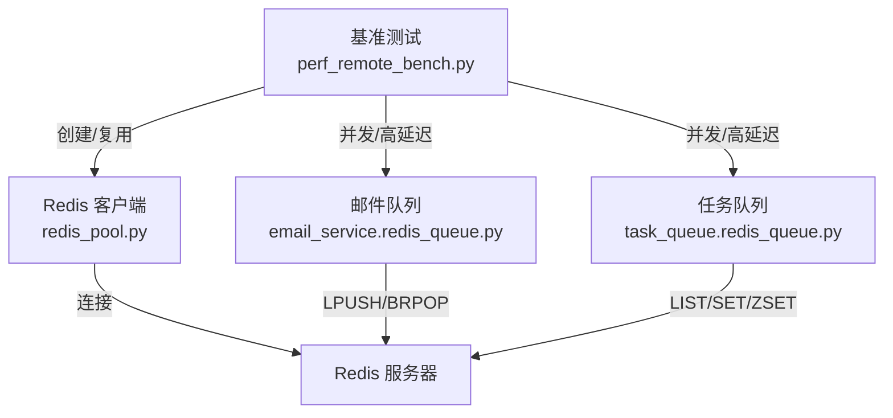
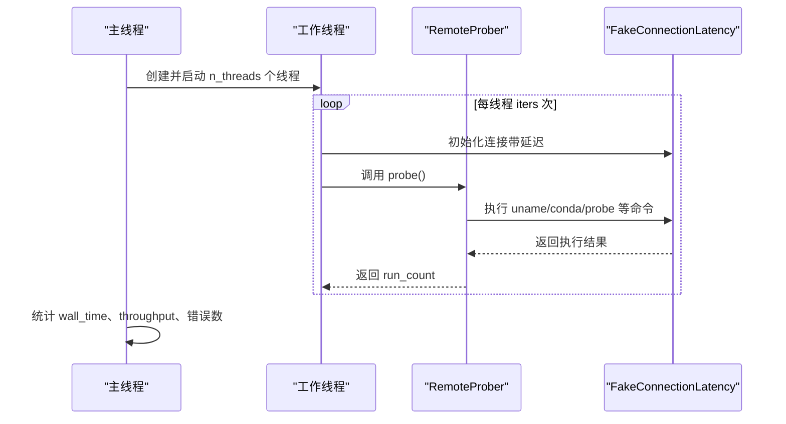
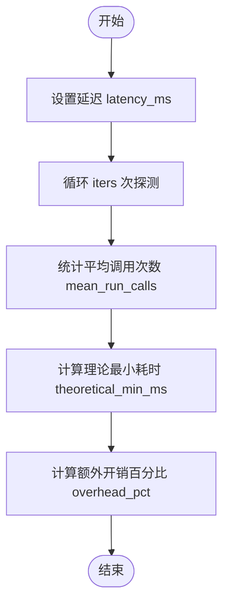
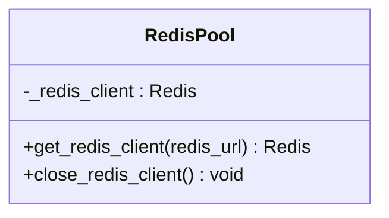
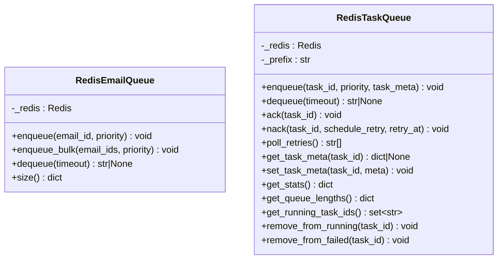
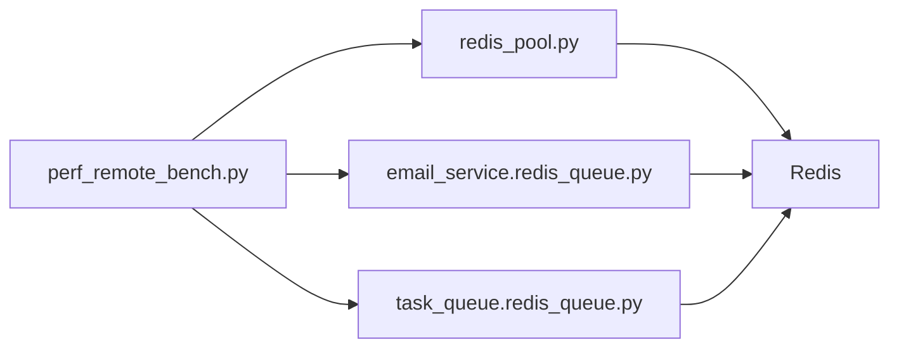

# 性能问题

<cite>
**本文引用的文件**
- [README.md](file://README.md)
- [perf_remote_bench.py](file://tests/testing/perf_remote_bench.py)
- [redis_pool.py](file://src/taolib/testing/_base/redis_pool.py)
- [redis_client.py](file://src/taolib/testing/config_center/cache/redis_client.py)
- [redis_queue.py（邮件服务）](file://src/taolib/testing/email_service/queue/redis_queue.py)
- [redis_queue.py（任务队列）](file://src/taolib/testing/task_queue/queue/redis_queue.py)
</cite>

## 目录
1. [简介](#简介)
2. [项目结构](#项目结构)
3. [核心组件](#核心组件)
4. [架构总览](#架构总览)
5. [详细组件分析](#详细组件分析)
6. [依赖关系分析](#依赖关系分析)
7. [性能考量](#性能考量)
8. [故障排查指南](#故障排查指南)
9. [结论](#结论)
10. [附录](#附录)

## 简介
本指南面向 FlexLoop 项目的性能问题诊断与优化，聚焦以下关键目标：
- 快速定位并缓解内存泄漏、CPU 占用过高、数据库查询缓慢、网络延迟等常见性能问题
- 解读性能监控指标，建立基准测试与回归检测流程
- 优化缓存策略、数据库索引、异步任务调度与并发控制
- 提供慢查询分析、内存使用分析与线程池配置的调试技巧
- 给出负载测试、压力测试与瓶颈识别的方法
- 针对认证、配置中心、文件存储、任务队列等模块给出优化建议与监控告警配置

## 项目结构
本项目采用分层与功能域结合的组织方式，核心性能相关能力集中在以下模块：
- 测试与基准：tests/testing/perf_remote_bench.py 提供远程探测、并发与高延迟场景的基准测试框架
- 缓存与连接：src/taolib/testing/_base/redis_pool.py 提供 Redis 客户端单例与生命周期管理
- 队列系统：src/taolib/testing/email_service/queue/redis_queue.py 与 src/taolib/testing/task_queue/queue/redis_queue.py 分别实现邮件与任务的 Redis 驱动队列
- 配置中心缓存：src/taolib/testing/config_center/cache/redis_client.py 向后兼容重导出 Redis 客户端

图表来源
- [perf_remote_bench.py:1-717](file://tests/testing/perf_remote_bench.py#L1-L717)
- [redis_pool.py:1-38](file://src/taolib/testing/_base/redis_pool.py#L1-L38)
- [redis_client.py:1-11](file://src/taolib/testing/config_center/cache/redis_client.py#L1-L11)
- [redis_queue.py（邮件服务）:1-81](file://src/taolib/testing/email_service/queue/redis_queue.py#L1-L81)
- [redis_queue.py（任务队列）:1-317](file://src/taolib/testing/task_queue/queue/redis_queue.py#L1-L317)

章节来源
- [README.md:1-100](file://README.md#L1-L100)
- [perf_remote_bench.py:1-717](file://tests/testing/perf_remote_bench.py#L1-L717)
- [redis_pool.py:1-38](file://src/taolib/testing/_base/redis_pool.py#L1-L38)
- [redis_client.py:1-11](file://src/taolib/testing/config_center/cache/redis_client.py#L1-L11)
- [redis_queue.py（邮件服务）:1-81](file://src/taolib/testing/email_service/queue/redis_queue.py#L1-L81)
- [redis_queue.py（任务队列）:1-317](file://src/taolib/testing/task_queue/queue/redis_queue.py#L1-L317)

## 核心组件
- 远程探测与并发基准：提供探测成功率、conda 缺失、探测失败三种场景的基准测试，支持并发探测与高延迟场景评估，内置与历史基线对比机制
- Redis 客户端单例：统一管理 Redis 连接，避免重复创建导致的资源泄漏与连接池耗尽
- 队列实现：基于 Redis List/Sorted Set/Set 的高性能队列，支持优先级、重试调度、实时统计与原子管道操作
- 配置中心缓存：向后兼容的 Redis 客户端重导出，确保缓存层一致性

章节来源
- [perf_remote_bench.py:147-213](file://tests/testing/perf_remote_bench.py#L147-L213)
- [perf_remote_bench.py:338-395](file://tests/testing/perf_remote_bench.py#L338-L395)
- [perf_remote_bench.py:456-504](file://tests/testing/perf_remote_bench.py#L456-L504)
- [perf_remote_bench.py:597-651](file://tests/testing/perf_remote_bench.py#L597-L651)
- [redis_pool.py:11-36](file://src/taolib/testing/_base/redis_pool.py#L11-L36)
- [redis_queue.py（任务队列）:14-317](file://src/taolib/testing/task_queue/queue/redis_queue.py#L14-L317)
- [redis_client.py:6-7](file://src/taolib/testing/config_center/cache/redis_client.py#L6-L7)

## 架构总览
下图展示性能相关组件在系统中的交互关系，重点体现 Redis 在队列与缓存中的中枢作用，以及基准测试对并发与延迟的覆盖。

图表来源
- [perf_remote_bench.py:1-717](file://tests/testing/perf_remote_bench.py#L1-L717)
- [redis_pool.py:1-38](file://src/taolib/testing/_base/redis_pool.py#L1-L38)
- [redis_queue.py（邮件服务）:1-81](file://src/taolib/testing/email_service/queue/redis_queue.py#L1-L81)
- [redis_queue.py（任务队列）:1-317](file://src/taolib/testing/task_queue/queue/redis_queue.py#L1-L317)

## 详细组件分析

### 远程探测与并发基准（perf_remote_bench.py）
- 场景覆盖
  - 成功探测、conda 缺失、探测失败三类场景，保证新旧实现行为一致性
  - 并发探测：多线程同时执行，评估吞吐与线程安全
  - 高延迟场景：模拟网络抖动，计算理论最小开销与额外开销占比
  - 基线对比：与历史结果比较，自动判定是否回归
- 关键流程（并发探测）

图表来源
- [perf_remote_bench.py:338-395](file://tests/testing/perf_remote_bench.py#L338-L395)

- 关键流程（高延迟场景）

图表来源
- [perf_remote_bench.py:456-504](file://tests/testing/perf_remote_bench.py#L456-L504)

章节来源
- [perf_remote_bench.py:166-314](file://tests/testing/perf_remote_bench.py#L166-L314)
- [perf_remote_bench.py:317-395](file://tests/testing/perf_remote_bench.py#L317-L395)
- [perf_remote_bench.py:456-504](file://tests/testing/perf_remote_bench.py#L456-L504)
- [perf_remote_bench.py:507-594](file://tests/testing/perf_remote_bench.py#L507-L594)
- [perf_remote_bench.py:597-651](file://tests/testing/perf_remote_bench.py#L597-L651)

### Redis 客户端单例（redis_pool.py）
- 设计要点
  - 单例模式避免重复创建连接，降低 CPU 与内存开销
  - 支持 decode_responses 与 UTF-8 编码，减少序列化成本
  - 提供 close 方法，便于测试与进程退出时清理
- 优化建议
  - 在长生命周期进程中复用同一客户端
  - 结合连接池参数（最大连接数、空闲回收、超时）进行调优
  - 在多进程或多实例部署时，确保连接释放与进程隔离

图表来源
- [redis_pool.py:11-36](file://src/taolib/testing/_base/redis_pool.py#L11-L36)

章节来源
- [redis_pool.py:11-36](file://src/taolib/testing/_base/redis_pool.py#L11-L36)

### 队列系统（邮件与任务）
- 邮件队列（RedisEmailQueue）
  - 使用三个 Redis List 实现优先级队列，BRPOP 自然实现优先级消费
  - 支持批量入队与队列长度查询
- 任务队列（RedisTaskQueue）
  - 键空间设计：LIST（待处理）、SET（运行中/失败）、ZSET（重试调度）、HASH（任务元数据）、HASH（全局统计）
  - 原子管道：入队、确认、失败/重试均使用 pipeline 保证一致性
  - 实时统计：支持提交、完成、失败、重试、队列长度等指标查询

图表来源
- [redis_queue.py（邮件服务）:23-81](file://src/taolib/testing/email_service/queue/redis_queue.py#L23-L81)
- [redis_queue.py（任务队列）:14-317](file://src/taolib/testing/task_queue/queue/redis_queue.py#L14-L317)

章节来源
- [redis_queue.py（邮件服务）:23-81](file://src/taolib/testing/email_service/queue/redis_queue.py#L23-L81)
- [redis_queue.py（任务队列）:14-317](file://src/taolib/testing/task_queue/queue/redis_queue.py#L14-L317)

## 依赖关系分析
- 组件耦合
  - 基准测试依赖 Redis 客户端单例与队列实现，形成“测试-基础设施-业务”的链路
  - 队列实现依赖 Redis，需关注网络延迟与持久化策略
- 外部依赖
  - Redis 作为高性能键值存储，是队列与缓存的关键
  - Python 异步 Redis 客户端（aioredis）提供非阻塞访问

图表来源
- [perf_remote_bench.py:1-717](file://tests/testing/perf_remote_bench.py#L1-L717)
- [redis_pool.py:1-38](file://src/taolib/testing/_base/redis_pool.py#L1-L38)
- [redis_queue.py（邮件服务）:1-81](file://src/taolib/testing/email_service/queue/redis_queue.py#L1-L81)
- [redis_queue.py（任务队列）:1-317](file://src/taolib/testing/task_queue/queue/redis_queue.py#L1-L317)

章节来源
- [perf_remote_bench.py:1-717](file://tests/testing/perf_remote_bench.py#L1-L717)
- [redis_pool.py:1-38](file://src/taolib/testing/_base/redis_pool.py#L1-L38)
- [redis_queue.py（邮件服务）:1-81](file://src/taolib/testing/email_service/queue/redis_queue.py#L1-L81)
- [redis_queue.py（任务队列）:1-317](file://src/taolib/testing/task_queue/queue/redis_queue.py#L1-L317)

## 性能考量
- 内存泄漏
  - 确保 Redis 客户端在进程退出时被正确关闭，避免句柄泄漏
  - 队列实现使用管道一次性提交，减少中间对象与临时列表的分配
- CPU 占用过高
  - 避免在热路径上进行重复的字符串编码/解码，Redis 客户端已启用 decode_responses
  - 控制并发度，避免过多线程/协程竞争 CPU 与网络带宽
- 数据库查询缓慢
  - 本项目以 Redis 为主，建议在需要持久化的场景引入索引与查询计划分析工具
  - 对高频查询使用缓存与预聚合，减少热点键的写放大
- 网络延迟
  - 基于基准测试的高延迟场景评估，识别网络抖动对吞吐的影响
  - 通过并发探测评估线程安全与锁竞争，必要时调整线程池大小与队列批处理

## 故障排查指南
- 内存泄漏排查
  - 使用进程内存快照对比，确认 Redis 客户端是否被全局持有且未释放
  - 检查队列实现中是否存在未释放的连接或未关闭的管道
- CPU 占用过高
  - 使用火焰图定位热点函数，关注字符串处理与网络 I/O
  - 评估队列批处理大小与并发度，避免过度唤醒
- 数据库查询缓慢
  - 分析慢查询日志，确认索引使用情况与扫描规模
  - 对热点键进行分片或引入二级索引
- 网络延迟
  - 使用基准测试模拟高延迟，计算理论最小耗时与额外开销占比
  - 检查队列消费者阻塞等待时间与超时设置

章节来源
- [perf_remote_bench.py:456-504](file://tests/testing/perf_remote_bench.py#L456-L504)
- [redis_pool.py:30-36](file://src/taolib/testing/_base/redis_pool.py#L30-L36)
- [redis_queue.py（任务队列）:75-124](file://src/taolib/testing/task_queue/queue/redis_queue.py#L75-L124)

## 结论
通过基准测试与 Redis 驱动的队列/缓存实现，FlexLoop 在并发、延迟与一致性方面具备良好的性能基础。建议持续运行基准测试，结合基线对比与监控告警，及时发现并修复性能退化；在队列与缓存层面遵循原子操作与批处理原则，避免热点与写放大；在网络与并发层面合理配置线程/协程与超时参数，确保系统稳定与高效。

## 附录

### 性能监控指标与解读
- 基础指标
  - 吞吐（ops/s）：并发探测/队列处理的每秒操作数
  - 延迟（ms）：均值、中位数、P95；高延迟场景下额外开销占比
  - 错误率：并发与异常场景下的错误数量
- 队列指标
  - 各优先级队列长度、运行中任务数、失败/重试任务数、最近完成任务数
  - 任务元数据缓存命中与更新频率
- 缓存指标
  - Redis 连接数、内存使用、命令响应时间、过期与淘汰率

### 基准测试实施步骤
- 准备阶段
  - 准备测试环境（本地/远端），确保 Redis 可用
  - 运行基准脚本，收集默认场景结果并保存为基线
- 执行阶段
  - 并发探测：调整线程数与迭代次数，观察吞吐与错误
  - 高延迟场景：设置不同延迟，评估额外开销占比
  - 基线对比：与历史基线比较，判断是否回归
- 报告与回归
  - 输出完整结果，若检测到回归则中断 CI 并告警

章节来源
- [perf_remote_bench.py:654-714](file://tests/testing/perf_remote_bench.py#L654-L714)
- [perf_remote_bench.py:597-651](file://tests/testing/perf_remote_bench.py#L597-L651)

### 缓存策略优化
- 使用 Redis 客户端单例，避免重复创建连接
- 对热点配置与元数据进行缓存，结合 TTL 与失效策略
- 在队列实现中使用管道一次性提交，减少往返与 GC 压力

章节来源
- [redis_pool.py:11-36](file://src/taolib/testing/_base/redis_pool.py#L11-L36)
- [redis_queue.py（任务队列）:75-124](file://src/taolib/testing/task_queue/queue/redis_queue.py#L75-L124)

### 数据库索引优化（概念性建议）
- 分析慢查询日志，识别全表扫描与回表
- 为高频过滤字段建立合适索引，避免复合索引冗余
- 对热点键进行分片或引入二级索引，降低单点压力

### 异步任务调度与并发控制最佳实践
- 使用 Redis 队列实现优先级与重试调度，避免阻塞主流程
- 控制并发度与批处理大小，结合背压与限流策略
- 对关键路径使用原子管道，保证一致性与低延迟

### 慢查询分析与内存使用分析
- 慢查询：使用数据库慢查询日志与执行计划分析工具定位热点
- 内存使用：使用进程内存快照与对象计数工具，识别泄漏与峰值

### 线程池配置调试技巧
- 通过并发探测评估线程/协程数量与超时设置
- 观察吞吐与错误率变化，逐步逼近最优配置

### 负载测试、压力测试与瓶颈识别
- 负载测试：在稳定基线上逐步增加并发与请求速率
- 压力测试：超过系统容量，观察系统行为与恢复能力
- 瓶颈识别：结合指标与日志，定位 CPU、内存、网络与磁盘瓶颈

### 模块性能优化与监控告警配置（建议）
- 认证/配置中心
  - 使用 Redis 缓存配置与令牌，结合 TTL 与失效策略
  - 监控缓存命中率与延迟，设置告警阈值
- 文件存储
  - CDN 与本地存储分离，热点文件走 CDN
  - 监控上传/下载吞吐与失败率
- 任务队列
  - 优先级与重试策略结合 SLA，设置队列长度与失败告警
  - 监控运行中任务数与重试队列规模