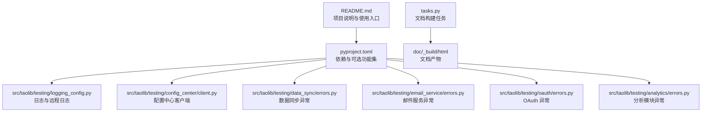
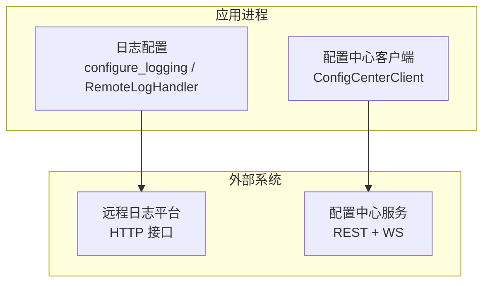
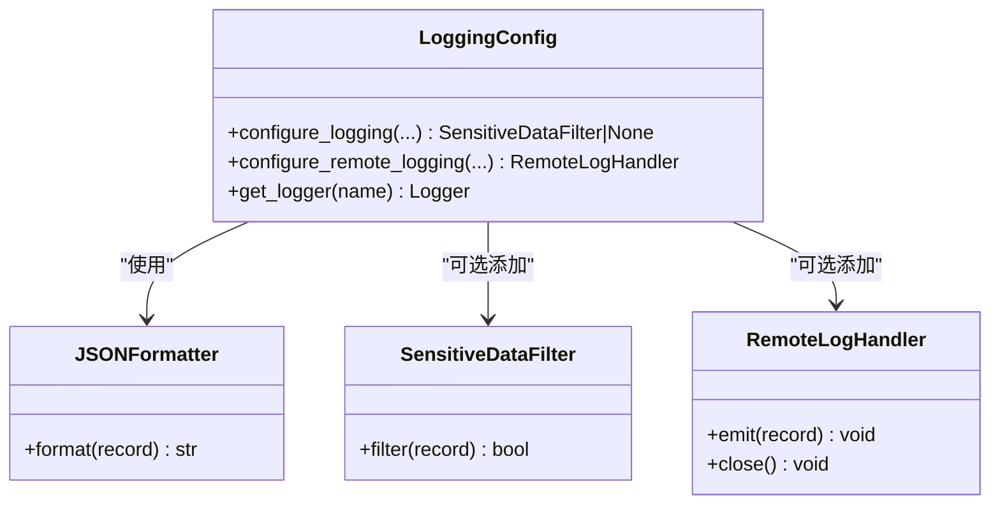
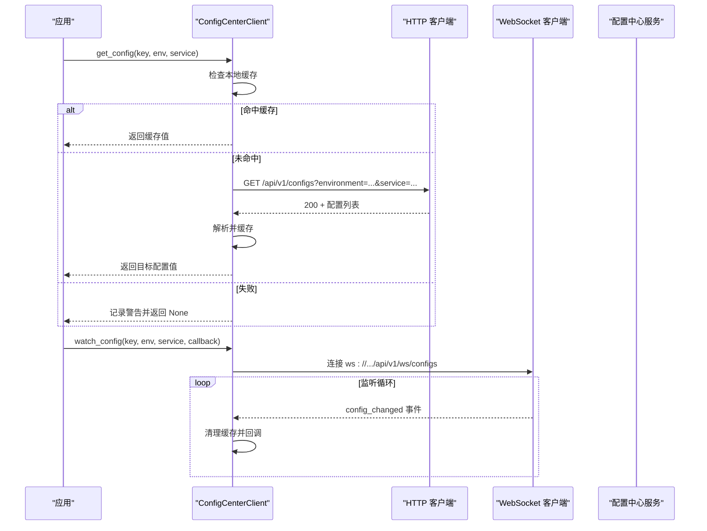
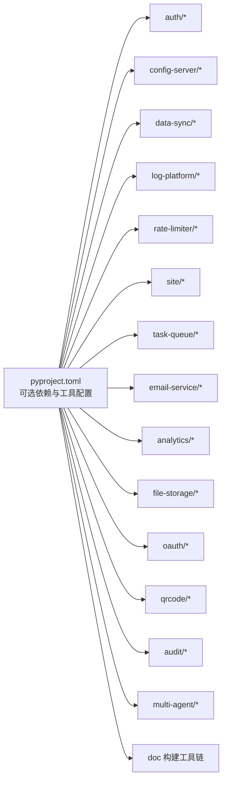

# 故障排除

<cite>
**本文引用的文件**
- [README.md](file://README.md)
- [pyproject.toml](file://pyproject.toml)
- [tasks.py](file://tasks.py)
- [src/taolib/testing/logging_config.py](file://src/taolib/testing/logging_config.py)
- [src/taolib/testing/config_center/client.py](file://src/taolib/testing/config_center/client.py)
- [src/taolib/testing/data_sync/errors.py](file://src/taolib/testing/data_sync/errors.py)
- [src/taolib/testing/email_service/errors.py](file://src/taolib/testing/email_service/errors.py)
- [src/taolib/testing/oauth/errors.py](file://src/taolib/testing/oauth/errors.py)
- [src/taolib/testing/analytics/errors.py](file://src/taolib/testing/analytics/errors.py)
</cite>

## 目录
1. [简介](#简介)
2. [项目结构](#项目结构)
3. [核心组件](#核心组件)
4. [架构总览](#架构总览)
5. [详细组件分析](#详细组件分析)
6. [依赖关系分析](#依赖关系分析)
7. [性能考虑](#性能考虑)
8. [故障排除指南](#故障排除指南)
9. [结论](#结论)
10. [附录](#附录)

## 简介
本指南面向 FlexLoop（taolib）项目的使用者与维护者，提供覆盖安装、配置、运行时异常与性能问题的系统化故障排除方法。内容涵盖日志分析、错误追踪、调试技巧、多环境排查策略、性能瓶颈定位、内存与并发问题诊断、预防性维护与监控告警、灾难恢复流程，并给出社区支持与问题报告模板。

## 项目结构
taolib 是一个模块化的 Python 包，采用分层与功能域划分的组织方式：
- 核心库位于 src/taolib 下，按功能域拆分为多个子模块（如配置中心、数据同步、邮件服务、OAuth、分析、任务队列等）
- 测试与文档脚本位于 tests 与 doc 目录
- 构建与打包配置位于 pyproject.toml
- 文档构建任务由 tasks.py 驱动

图示来源
- [README.md](file://README.md)
- [pyproject.toml](file://pyproject.toml)
- [tasks.py](file://tasks.py)

章节来源
- [README.md](file://README.md)
- [pyproject.toml](file://pyproject.toml)
- [tasks.py](file://tasks.py)

## 核心组件
- 日志与远程日志：提供统一日志格式、敏感数据脱敏、本地与远程双输出能力，支持 JSON 与文本两种格式，便于集中化日志采集与检索。
- 配置中心客户端：提供同步/异步获取配置、全量配置拉取、WebSocket 监听配置变更的能力，并内置本地缓存与超时控制。
- 功能域异常体系：针对分析、数据同步、邮件服务、OAuth 等模块定义了清晰的异常层次，便于快速定位问题来源与类型。

章节来源
- [src/taolib/testing/logging_config.py](file://src/taolib/testing/logging_config.py)
- [src/taolib/testing/config_center/client.py](file://src/taolib/testing/config_center/client.py)
- [src/taolib/testing/analytics/errors.py](file://src/taolib/testing/analytics/errors.py)
- [src/taolib/testing/data_sync/errors.py](file://src/taolib/testing/data_sync/errors.py)
- [src/taolib/testing/email_service/errors.py](file://src/taolib/testing/email_service/errors.py)
- [src/taolib/testing/oauth/errors.py](file://src/taolib/testing/oauth/errors.py)

## 架构总览
下图展示了日志与配置中心在系统中的位置与交互关系，以及异常在各模块中的分布：

图示来源
- [src/taolib/testing/logging_config.py](file://src/taolib/testing/logging_config.py)
- [src/taolib/testing/config_center/client.py](file://src/taolib/testing/config_center/client.py)

## 详细组件分析

### 日志与远程日志组件
- 统一日志格式：支持文本与 JSON 两种格式，JSON 模式自动注入时间戳、级别、模块、函数、行号、异常堆栈等字段，便于结构化检索。
- 敏感数据脱敏：内置密码、JWT 密钥、API Key、邮箱、手机号、IP 等脱敏规则，可按需启用与扩展。
- 远程日志：通过 RemoteLogHandler 将日志批量发送至远程日志平台，具备缓冲、批处理、定时刷新与优雅降级能力。
- 本地与远程双输出：可同时输出到控制台、文件与远程平台，满足开发、测试与生产多场景需求。

图示来源
- [src/taolib/testing/logging_config.py](file://src/taolib/testing/logging_config.py)

章节来源
- [src/taolib/testing/logging_config.py](file://src/taolib/testing/logging_config.py)

### 配置中心客户端组件
- 同步/异步获取配置：支持按 key、environment、service 查询，内部带 TTL 缓存，减少重复请求。
- 全量配置拉取：一次性获取服务的所有配置项，便于应用启动时预热。
- WebSocket 监听：基于 websockets 库接收配置变更事件，触发回调并清理缓存。
- 错误处理：对 HTTP 与网络异常进行记录与降级，保证主流程稳定。

图示来源
- [src/taolib/testing/config_center/client.py](file://src/taolib/testing/config_center/client.py)

章节来源
- [src/taolib/testing/config_center/client.py](file://src/taolib/testing/config_center/client.py)

### 功能域异常体系
- 分析模块异常：事件校验失败、应用不存在、聚合执行失败等。
- 数据同步异常：作业不存在/禁用、MongoDB 连接失败、转换函数异常、检查点损坏、达到阈值中止等。
- 邮件服务异常：邮件/模板未找到、模板渲染失败、提供商通信错误（含“全部失败”聚合）、队列与订阅错误等。
- OAuth 异常：提供商错误、授权码交换失败、用户信息获取失败、Token 刷新/解密失败、状态校验失败、凭证缺失/未注册、会话无效、引导数据无效等。

```mermaid
classDiagram
class AnalyticsError
class EventValidationError
class AppNotFoundError
class AggregationError
class SyncError
class SyncJobNotFoundError
class SyncConnectionError
class SyncTransformError
class SyncCheckpointError
class SyncAbortError
class EmailServiceError
class EmailNotFoundError
class TemplateNotFoundError
class TemplateRenderError
class ProviderError
class AllProvidersFailedError
class QueueError
class SubscriptionError
class OAuthError
class OAuthProviderError
class OAuthCodeExchangeError
class OAuthUserInfoError
class OAuthTokenError
class OAuthTokenRefreshError
class OAuthTokenDecryptionError
class OAuthStateError
class OAuthCredentialNotFoundError
class OAuthProviderNotRegisteredError
class OAuthAlreadyLinkedError
class OAuthCannotUnlinkError
class OAuthSessionError
class OAuthOnboardingError
AnalyticsError <|-- EventValidationError
AnalyticsError <|-- AppNotFoundError
AnalyticsError <|-- AggregationError
SyncError <|-- SyncJobNotFoundError
SyncError <|-- SyncConnectionError
SyncError <|-- SyncTransformError
SyncError <|-- SyncCheckpointError
SyncError <|-- SyncAbortError
EmailServiceError <|-- EmailNotFoundError
EmailServiceError <|-- TemplateNotFoundError
EmailServiceError <|-- TemplateRenderError
EmailServiceError <|-- ProviderError
ProviderError <|-- AllProvidersFailedError
EmailServiceError <|-- QueueError
EmailServiceError <|-- SubscriptionError
OAuthError <|-- OAuthProviderError
OAuthProviderError <|-- OAuthCodeExchangeError
OAuthProviderError <|-- OAuthUserInfoError
OAuthError <|-- OAuthTokenError
OAuthTokenError <|-- OAuthTokenRefreshError
OAuthTokenError <|-- OAuthTokenDecryptionError
OAuthError <|-- OAuthStateError
OAuthError <|-- OAuthCredentialNotFoundError
OAuthError <|-- OAuthProviderNotRegisteredError
OAuthError <|-- OAuthAlreadyLinkedError
OAuthError <|-- OAuthCannotUnlinkError
OAuthError <|-- OAuthSessionError
OAuthError <|-- OAuthOnboardingError
```

图示来源
- [src/taolib/testing/analytics/errors.py](file://src/taolib/testing/analytics/errors.py)
- [src/taolib/testing/data_sync/errors.py](file://src/taolib/testing/data_sync/errors.py)
- [src/taolib/testing/email_service/errors.py](file://src/taolib/testing/email_service/errors.py)
- [src/taolib/testing/oauth/errors.py](file://src/taolib/testing/oauth/errors.py)

章节来源
- [src/taolib/testing/analytics/errors.py](file://src/taolib/testing/analytics/errors.py)
- [src/taolib/testing/data_sync/errors.py](file://src/taolib/testing/data_sync/errors.py)
- [src/taolib/testing/email_service/errors.py](file://src/taolib/testing/email_service/errors.py)
- [src/taolib/testing/oauth/errors.py](file://src/taolib/testing/oauth/errors.py)

## 依赖关系分析
- 可选功能集：通过 pyproject.toml 的可选依赖区分不同子系统（如 auth、config-server、data-sync、log-platform、rate-limiter、site、task-queue、email-service、analytics、file-storage、oauth、qrcode、audit、multi-agent 等），便于按需安装与最小化部署。
- 工具链：ruff 用于 lint/format，pytest 用于测试，coverage 用于覆盖率，invoke 用于文档构建任务。

图示来源
- [pyproject.toml](file://pyproject.toml)

章节来源
- [pyproject.toml](file://pyproject.toml)

## 性能考虑
- 日志性能：RemoteLogHandler 采用缓冲+批处理+定时刷新，避免高频网络开销；当缓冲超过阈值时进行截断，防止内存膨胀。
- 配置中心：客户端内置缓存与超时控制，减少重复请求与阻塞；WebSocket 监听在连接断开时自动重连。
- 异常开销：异常捕获与日志记录应避免在热路径频繁触发；建议结合采样与阈值控制。

章节来源
- [src/taolib/testing/logging_config.py](file://src/taolib/testing/logging_config.py)
- [src/taolib/testing/config_center/client.py](file://src/taolib/testing/config_center/client.py)

## 故障排除指南

### 一、安装与环境问题
- 症状
  - 安装失败或依赖冲突
  - Python 版本不满足要求
  - 文档构建命令不可用
- 原因
  - Python 版本低于要求
  - 未安装可选功能依赖导致模块导入失败
  - 开发工具链（如 invoke）未安装或未激活虚拟环境
- 解决方案
  - 确认 Python 版本满足要求
  - 按需安装可选功能依赖（参考可选依赖清单）
  - 使用推荐的安装方式与开发依赖
  - 文档构建使用提供的任务脚本
- 参考
  - [README.md](file://README.md)
  - [pyproject.toml](file://pyproject.toml)
  - [tasks.py](file://tasks.py)

章节来源
- [README.md](file://README.md)
- [pyproject.toml](file://pyproject.toml)
- [tasks.py](file://tasks.py)

### 二、配置错误
- 症状
  - 获取配置为空或报网络异常
  - WebSocket 监听功能报缺少依赖
  - 配置变更未生效或延迟明显
- 原因
  - 服务端接口不可达或鉴权失败
  - 本地缓存未正确失效
  - WebSocket 依赖未安装
- 解决方案
  - 校验 base_url、token 与网络连通性
  - 使用 watch_config 时确保安装 websockets
  - 触发变更后等待客户端清理缓存并回调
- 参考
  - [src/taolib/testing/config_center/client.py](file://src/taolib/testing/config_center/client.py)

章节来源
- [src/taolib/testing/config_center/client.py](file://src/taolib/testing/config_center/client.py)

### 三、运行时异常与错误追踪
- 症状
  - 分析模块事件校验失败、聚合失败
  - 数据同步作业不存在、连接失败、转换异常、检查点损坏、达到阈值中止
  - 邮件服务模板未找到、渲染失败、提供商全部失败、队列/订阅异常
  - OAuth 授权码交换失败、用户信息获取失败、Token 刷新/解密失败、状态校验失败、凭证缺失/未注册、会话无效、引导数据无效
- 原因
  - 输入数据不符合预期或上游服务异常
  - 配置中心/数据库/第三方服务不可用
  - 凭证配置错误或过期
- 解决方案
  - 结合异常类型定位模块与环节
  - 查看日志中异常堆栈与上下文字段
  - 校验配置中心与下游依赖可用性
- 参考
  - [src/taolib/testing/analytics/errors.py](file://src/taolib/testing/analytics/errors.py)
  - [src/taolib/testing/data_sync/errors.py](file://src/taolib/testing/data_sync/errors.py)
  - [src/taolib/testing/email_service/errors.py](file://src/taolib/testing/email_service/errors.py)
  - [src/taolib/testing/oauth/errors.py](file://src/taolib/testing/oauth/errors.py)

章节来源
- [src/taolib/testing/analytics/errors.py](file://src/taolib/testing/analytics/errors.py)
- [src/taolib/testing/data_sync/errors.py](file://src/taolib/testing/data_sync/errors.py)
- [src/taolib/testing/email_service/errors.py](file://src/taolib/testing/email_service/errors.py)
- [src/taolib/testing/oauth/errors.py](file://src/taolib/testing/oauth/errors.py)

### 四、日志分析与调试技巧
- 症状
  - 日志缺失、格式不一致、敏感信息泄露风险
  - 远程日志发送失败影响业务
- 原因
  - 未启用统一日志配置或脱敏
  - 远程日志依赖未安装或端点配置错误
- 解决方案
  - 使用统一日志配置函数，选择 JSON 或文本格式
  - 启用敏感数据脱敏，按需扩展自定义规则
  - 生产环境同时输出到本地与远程平台，确保降级可用
- 参考
  - [src/taolib/testing/logging_config.py](file://src/taolib/testing/logging_config.py)

章节来源
- [src/taolib/testing/logging_config.py](file://src/taolib/testing/logging_config.py)

### 五、多环境排查策略与工具
- 开发环境
  - 使用文本日志格式，便于快速阅读
  - 本地文件输出与控制台输出并存
- 测试/预发布环境
  - 启用 JSON 日志格式，便于集中采集
  - 配置远程日志端点，开启脱敏
- 生产环境
  - 严格启用脱敏与远程日志
  - 设置合理的批大小与刷新间隔，避免抖动
  - 监控远程日志发送失败率与缓冲长度

章节来源
- [src/taolib/testing/logging_config.py](file://src/taolib/testing/logging_config.py)

### 六、性能瓶颈识别
- 关注点
  - 日志发送批次与频率是否过高
  - 配置中心请求是否频繁命中缓存
  - 异常处理是否在热路径频繁触发
- 方法
  - 通过日志中的时间戳与模块字段定位热点模块
  - 使用远程日志缓冲长度与发送失败计数评估网络与服务压力
  - 对配置中心调用进行采样统计

章节来源
- [src/taolib/testing/logging_config.py](file://src/taolib/testing/logging_config.py)
- [src/taolib/testing/config_center/client.py](file://src/taolib/testing/config_center/client.py)

### 七、内存泄漏与并发问题诊断
- 内存泄漏
  - 远程日志缓冲区设置了上限截断，防止无限增长
  - 建议在高吞吐场景下适当降低批大小与刷新间隔
- 并发问题
  - RemoteLogHandler 使用线程锁保护缓冲区
  - WebSocket 监听在连接断开时自动重连
- 建议
  - 在压测环境中观察缓冲长度与发送失败率
  - 对高并发场景增加日志采样与阈值控制

章节来源
- [src/taolib/testing/logging_config.py](file://src/taolib/testing/logging_config.py)
- [src/taolib/testing/config_center/client.py](file://src/taolib/testing/config_center/client.py)

### 八、预防性维护与监控告警
- 预防性维护
  - 定期升级依赖，关注安全公告
  - 对日志脱敏规则进行审计与更新
- 监控告警
  - 远程日志发送失败率、缓冲长度、异常计数
  - 配置中心请求成功率、延迟、缓存命中率
- 灾难恢复
  - 本地日志作为兜底，确保问题可追溯
  - 配置中心与下游服务的健康检查与自动切换

章节来源
- [src/taolib/testing/logging_config.py](file://src/taolib/testing/logging_config.py)
- [src/taolib/testing/config_center/client.py](file://src/taolib/testing/config_center/client.py)

### 九、社区支持与问题报告
- 社区支持渠道
  - 提交 Issue 与讨论
  - 参与改进与贡献
- 问题报告模板（建议）
  - 环境信息：Python 版本、操作系统、依赖版本
  - 复现步骤：最小可复现示例或操作序列
  - 期望行为与实际行为
  - 日志片段与异常堆栈
  - 影响范围与紧急程度
- 紧急响应流程
  - 快速降级：关闭远程日志或降低日志级别
  - 限流：减少日志批大小与刷新频率
  - 回滚：回退到上一个稳定版本

章节来源
- [README.md](file://README.md)

## 结论
通过统一的日志与远程日志配置、完善的异常体系与可选功能依赖管理，FlexLoop（taolib）能够在多环境下稳定运行。本指南提供了从安装、配置到运行时异常与性能问题的系统化排查方法，并给出了预防性维护与应急响应建议，帮助团队快速定位与解决问题。

## 附录

### A. 常见问题症状与处理对照
- 安装失败
  - 检查 Python 版本与依赖
  - 使用推荐安装方式与可选依赖
- 配置获取失败
  - 校验 base_url、token、网络连通性
  - 查看日志警告与 HTTP 状态码
- WebSocket 监听报错
  - 安装 websockets 依赖
  - 检查服务端 WS 端点与鉴权
- 远程日志发送失败
  - 检查端点、鉴权与网络
  - 降低批大小与刷新间隔
- 性能抖动
  - 优化日志批处理参数
  - 对热路径进行采样与限流

章节来源
- [src/taolib/testing/logging_config.py](file://src/taolib/testing/logging_config.py)
- [src/taolib/testing/config_center/client.py](file://src/taolib/testing/config_center/client.py)