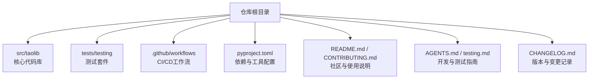
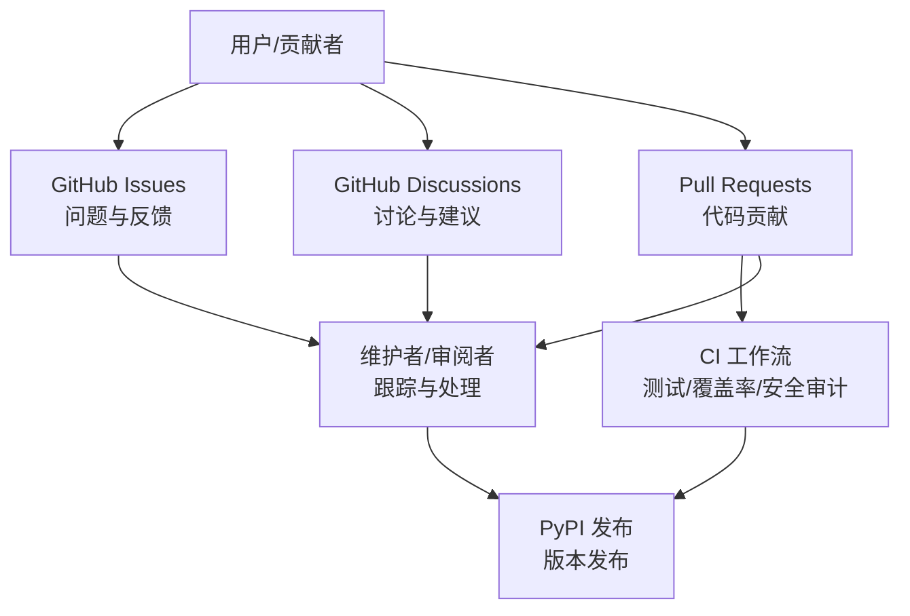
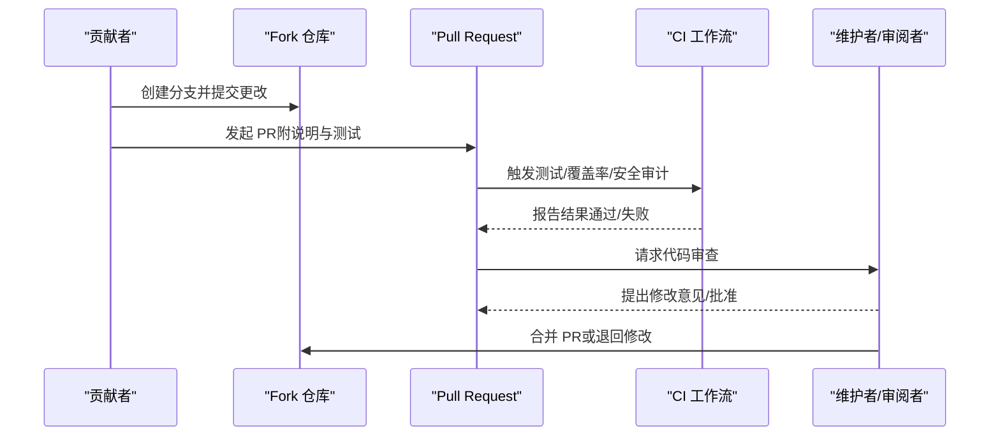
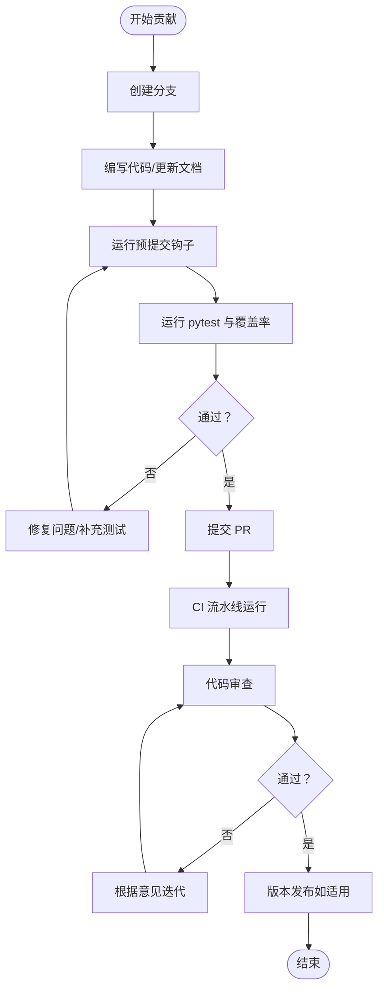
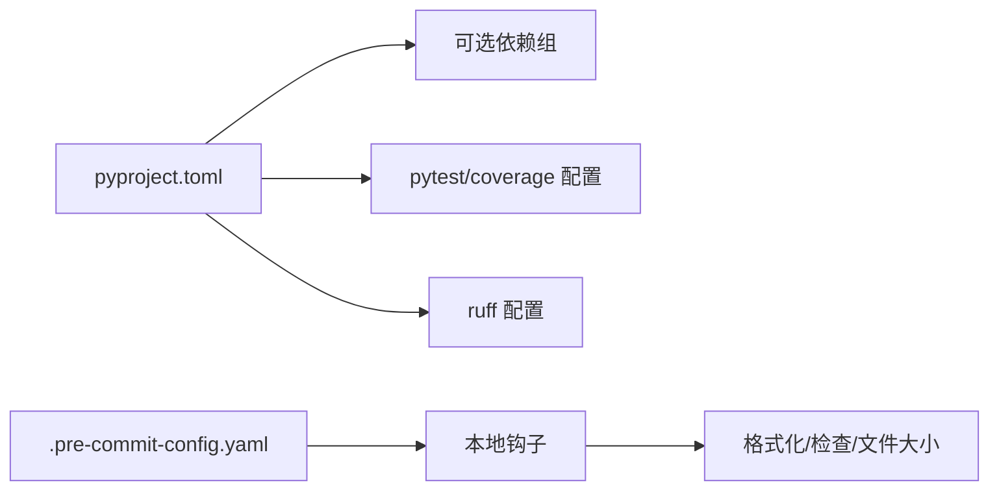

# 社区支持

<cite>
**本文引用的文件**
- [README.md](file://README.md)
- [CONTRIBUTING.md](file://CONTRIBUTING.md)
- [AGENTS.md](file://AGENTS.md)
- [testing.md](file://testing.md)
- [pyproject.toml](file://pyproject.toml)
- [.pre-commit-config.yaml](file://.pre-commit-config.yaml)
- [.github/workflows/ci.yml](file://.github/workflows/ci.yml)
- [.github/workflows/python-publish.yml](file://.github/workflows/python-publish.yml)
- [CHANGELOG.md](file://CHANGELOG.md)
</cite>

## 目录
1. [简介](#简介)
2. [项目结构](#项目结构)
3. [核心组件](#核心组件)
4. [架构总览](#架构总览)
5. [详细组件分析](#详细组件分析)
6. [依赖分析](#依赖分析)
7. [性能考虑](#性能考虑)
8. [故障排查指南](#故障排查指南)
9. [结论](#结论)
10. [附录](#附录)

## 简介
本指南面向FlexLoop（taolib）项目的使用者与贡献者，提供社区支持与问题报告的完整流程，涵盖获取帮助、参与开源贡献、提交问题与拉取请求的规范，以及紧急问题响应、安全漏洞上报与版本发布计划等信息。同时给出代码贡献流程、PR规范与代码审查标准，并提供行为准则与协作最佳实践建议，帮助您高效、友好地参与社区建设。

## 项目结构
- 仓库根目录包含项目说明、贡献指南、测试与构建配置、CI/CD工作流与发布配置等关键文件。
- 代码位于 src/taolib 下，按功能域拆分为多个子模块（认证授权、配置中心、数据分析、邮件服务、文件存储、OAuth、限流、任务队列等）。
- 测试位于 tests/testing 下，覆盖各模块的单元、集成与系统测试；另有性能基准脚本与覆盖率配置。
- 文档与站点构建通过 pyproject.toml 中的可选依赖与 Invoke 任务完成。

**图表来源**
- [README.md](file://README.md)
- [pyproject.toml](file://pyproject.toml)
- [.github/workflows/ci.yml](file://.github/workflows/ci.yml)

**章节来源**
- [README.md](file://README.md)
- [pyproject.toml](file://pyproject.toml)

## 核心组件
- 社区入口与支持渠道
  - 问题反馈与讨论：通过 GitHub Issues 与 Discussions 获取帮助、参与讨论与改进。
  - 贡献入口：Fork 仓库、创建功能/修复分支、保持风格与测试通过、提交 PR。
- 开发与测试
  - 测试命令与覆盖率目标：≥80%，使用 pytest 与 coverage。
  - 预提交钩子：ruff 格式化与检查、文件大小检查等。
  - CI/CD：跨平台测试、覆盖率阈值检查、依赖安全审计。
- 发布与版本
  - 版本遵循语义化版本；发布前运行测试；通过 GitHub Actions 自动发布到 PyPI。

**章节来源**
- [README.md](file://README.md)
- [testing.md](file://testing.md)
- [.pre-commit-config.yaml](file://.pre-commit-config.yaml)
- [.github/workflows/ci.yml](file://.github/workflows/ci.yml)
- [.github/workflows/python-publish.yml](file://.github/workflows/python-publish.yml)
- [CHANGELOG.md](file://CHANGELOG.md)

## 架构总览
社区协作与质量保障围绕“问题—贡献—测试—发布”闭环展开，CI/CD 与预提交钩子共同保证代码质量与一致性。

**图表来源**
- [README.md](file://README.md)
- [.github/workflows/ci.yml](file://.github/workflows/ci.yml)
- [.github/workflows/python-publish.yml](file://.github/workflows/python-publish.yml)

## 详细组件分析

### 1) 获取社区帮助与参与讨论
- 使用渠道
  - 问题反馈：前往 Issues 页面提交问题。
  - 讨论交流：前往 Discussions 页面提出建议、参与讨论。
- 搜索已有问题
  - 在 Issues 中使用标签、关键词与状态筛选，避免重复提问。
  - 查看 CHANGELOG 与 README 的“使用说明/问题与反馈”部分，确认是否已有解决方案或注意事项。
- 参与讨论与反馈
  - 提供背景、复现步骤、期望与实际结果、环境信息与日志片段。
  - 遵循礼貌与尊重，积极回应维护者的反馈与建议。

**章节来源**
- [README.md](file://README.md)
- [CHANGELOG.md](file://CHANGELOG.md)

### 2) 问题报告与信息收集清单
- 问题模板与规范（建议）
  - 标题：简明扼要描述问题
  - 描述：背景、复现步骤、期望结果、实际结果
  - 环境信息：操作系统、Python 版本、依赖版本、taolib 版本
  - 日志与截图：关键错误日志、UI 截图、网络抓包（如涉及网络）
  - 复现最小示例：最小可复现代码或命令
  - 影响范围：是否影响其他模块或功能
- 信息收集清单
  - 环境变量与配置：是否使用了可选依赖组与自定义配置
  - 依赖版本：使用 pip list 或 pip freeze 输出
  - 日志级别：开启详细日志并附上关键片段
  - 平台差异：是否仅在特定 OS/Python 版本出现

**章节来源**
- [README.md](file://README.md)
- [AGENTS.md](file://AGENTS.md)

### 3) 代码贡献流程与 Pull Request 规范
- 分支策略
  - Fork 仓库，创建功能分支（如 feature/<主题>）或修复分支（fix/<问题>）。
- 提交规范
  - 保持代码风格一致（ruff 格式化与检查）、类型注解完整、测试覆盖充分。
  - 提交信息清晰，说明动机、改动点、影响范围与验证方式。
- PR 规范
  - PR 描述中包含问题链接、变更摘要、测试与覆盖率说明、升级/迁移注意事项。
  - 通过 CI（测试、覆盖率、安全审计）与代码审查后方可合并。
- 代码审查标准
  - 正确性：逻辑正确、边界条件处理、异常路径覆盖。
  - 可维护性：命名清晰、模块职责单一、文档与注释完整。
  - 性能与安全性：避免性能退化、遵循安全最佳实践。
  - 兼容性：遵循语义化版本，避免破坏性变更；必要时提供迁移指南。

**图表来源**
- [.github/workflows/ci.yml](file://.github/workflows/ci.yml)
- [.github/workflows/python-publish.yml](file://.github/workflows/python-publish.yml)

**章节来源**
- [README.md](file://README.md)
- [CONTRIBUTING.md](file://CONTRIBUTING.md)
- [.pre-commit-config.yaml](file://.pre-commit-config.yaml)
- [.github/workflows/ci.yml](file://.github/workflows/ci.yml)

### 4) 测试与质量保障
- 测试命令与覆盖率
  - 安装开发与测试依赖，运行 pytest；覆盖率阈值为 ≥80%。
  - 性能基准测试脚本可用于回归评估。
- 预提交钩子
  - 自动执行 ruff 格式化与检查、YAML/TOML 校验、大文件检查等。
- CI/CD
  - 跨平台测试矩阵、覆盖率报告与上传、依赖安全审计（pip-audit）。

**图表来源**
- [.pre-commit-config.yaml](file://.pre-commit-config.yaml)
- [.github/workflows/ci.yml](file://.github/workflows/ci.yml)
- [testing.md](file://testing.md)

**章节来源**
- [testing.md](file://testing.md)
- [.pre-commit-config.yaml](file://.pre-commit-config.yaml)
- [.github/workflows/ci.yml](file://.github/workflows/ci.yml)

### 5) 紧急问题响应流程
- 快速定位
  - 检查最近一次发布与变更记录，确认是否为已知回归。
  - 在 Issues 中按标签与时间筛选，优先查看高优先级与严重程度标记。
- 临时缓解
  - 回滚到上一个稳定版本；禁用相关可选功能组；检查环境变量与配置。
- 报告与跟进
  - 提交 Issue 时选择合适的标签（如 bug、security、regression），并@维护者。
  - 提供最小复现与环境信息，保持沟通及时性。

**章节来源**
- [CHANGELOG.md](file://CHANGELOG.md)
- [README.md](file://README.md)

### 6) 安全漏洞报告渠道
- 报告渠道
  - 通过 Issues 的“安全”相关标签或私下联系维护者进行报告。
- 响应流程
  - 维护者确认后将进入修复与发布流程；在修复完成前避免公开披露细节。
- 预防措施
  - 定期运行依赖安全审计（pip-audit）；启用 CI 安全扫描；使用强密钥与加密存储。

**章节来源**
- [.github/workflows/ci.yml](file://.github/workflows/ci.yml)

### 7) 版本发布计划与变更记录
- 版本策略
  - 遵循语义化版本；重大功能扩展与破坏性变更会在更新日志中明确标注。
- 发布流程
  - 发布前运行测试并通过 CI；通过 GitHub Actions 自动构建并发布到 PyPI。
- 变更记录
  - 更新日志包含新增、修改、修复与移除条目，便于用户评估升级影响。

**章节来源**
- [CHANGELOG.md](file://CHANGELOG.md)
- [.github/workflows/python-publish.yml](file://.github/workflows/python-publish.yml)

### 8) 社区行为准则与协作最佳实践
- 行为准则
  - 尊重与包容：避免人身攻击，鼓励不同观点。
  - 透明与开放：公开讨论、共享信息、及时回复。
  - 建设性反馈：就事论事，提供具体改进建议。
- 协作最佳实践
  - 使用清晰的标题与描述；附带最小复现与环境信息。
  - 在 PR 中说明动机与影响范围；确保测试与覆盖率达标。
  - 遵循代码风格与命名约定，保持模块职责单一。

[本节为通用指导，无需文件引用]

## 依赖分析
- 依赖与可选功能组
  - 通过 pyproject.toml 的可选依赖组（如 auth、config-center、data-sync、email-service、file-storage、oauth、rate-limiter、task-queue、site、qrcode、audit、multi-agent 等）按需启用功能。
- 测试与覆盖率
  - pytest、pytest-cov、coverage 配置在 pyproject.toml 与 pytest.ini 中集中管理。
- 预提交与静态检查
  - ruff、pre-commit 钩子与本地脚本共同保障代码质量与体积控制。

**图表来源**
- [pyproject.toml](file://pyproject.toml)
- [.pre-commit-config.yaml](file://.pre-commit-config.yaml)

**章节来源**
- [pyproject.toml](file://pyproject.toml)
- [.pre-commit-config.yaml](file://.pre-commit-config.yaml)

## 性能考虑
- 测试与基准
  - 使用性能基准脚本进行回归评估；关注关键路径的性能指标。
- 代码质量
  - 通过预提交与 CI 保持代码整洁与一致性，减少潜在性能退化。
- 部署与运维
  - 采用容器化与持续集成，结合限流与缓存策略提升稳定性与吞吐。

[本节提供一般性建议，无需文件引用]

## 故障排查指南
- 常见问题定位
  - 环境与依赖：核对 Python 版本与可选依赖组是否正确安装。
  - 测试与覆盖率：运行 pytest 并查看覆盖率报告，定位缺失测试。
  - 预提交失败：根据 ruff 与钩子提示修正格式与静态检查问题。
- 日志与诊断
  - 提升日志级别，收集关键错误片段；在 Issue 中附上最小复现与环境信息。
- 回归与对比
  - 使用性能基准脚本进行前后对比，确认是否存在回归。

**章节来源**
- [testing.md](file://testing.md)
- [.pre-commit-config.yaml](file://.pre-commit-config.yaml)
- [.github/workflows/ci.yml](file://.github/workflows/ci.yml)

## 结论
通过规范的问题报告、贡献流程与质量保障机制，FlexLoop 社区能够高效协作、持续交付高质量的开源产品。建议贡献者在提交 Issue 与 PR 前先查阅相关文档与变更记录，遵循测试与审查标准，共同维护健康、开放、包容的社区生态。

[本节为总结性内容，无需文件引用]

## 附录
- 快速链接
  - 问题与反馈：[Issues](file://README.md)
  - 讨论与建议：[Discussions](file://README.md)
  - 贡献指南：[Contributing](file://CONTRIBUTING.md)
  - 开发与测试：[AGENTS.md](file://AGENTS.md)、[testing.md](file://testing.md)
  - 版本与变更：[CHANGELOG.md](file://CHANGELOG.md)
  - 发布与 CI：[python-publish.yml](file://.github/workflows/python-publish.yml)、[ci.yml](file://.github/workflows/ci.yml)

[本节为导航性内容，无需文件引用]