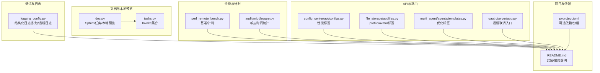
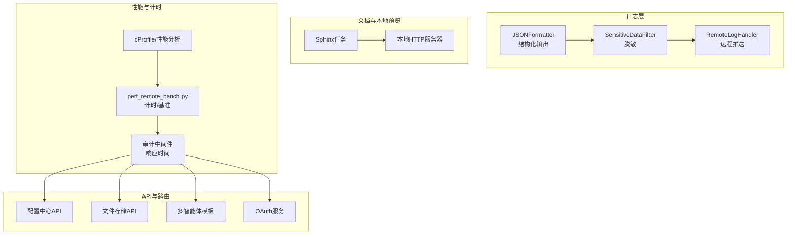
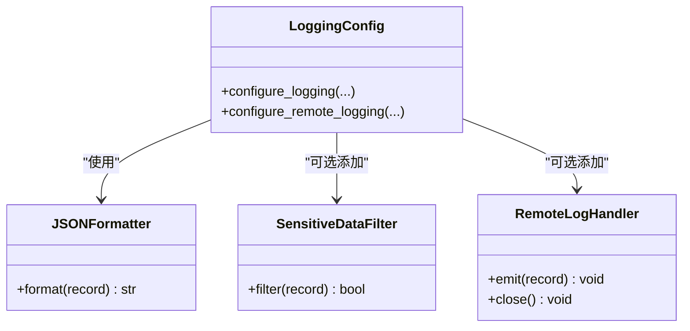
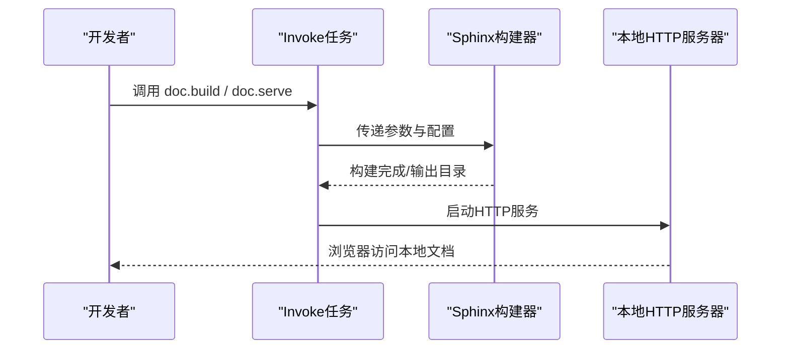
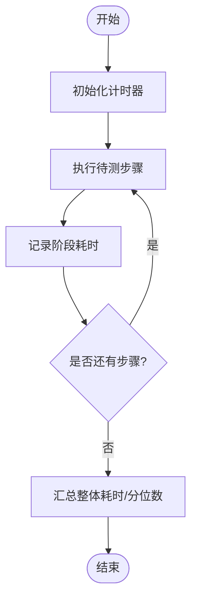
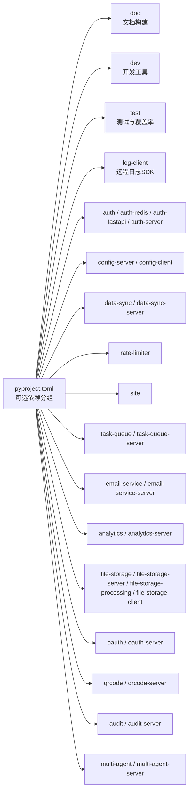

# 调试工具

<cite>
**本文引用的文件**
- [README.md](file://README.md)
- [pyproject.toml](file://pyproject.toml)
- [tasks.py](file://tasks.py)
- [src/taolib/testing/logging_config.py](file://src/taolib/testing/logging_config.py)
- [src/taolib/testing/doc.py](file://src/taolib/testing/doc.py)
- [tests/testing/perf_remote_bench.py](file://tests/testing/perf_remote_bench.py)
- [src/taolib/testing/audit/middleware.py](file://src/taolib/testing/audit/middleware.py)
- [src/taolib/testing/config_center/server/api/configs.py](file://src/taolib/testing/config_center/server/api/configs.py)
- [src/taolib/testing/file_storage/server/api/files.py](file://src/taolib/testing/file_storage/server/api/files.py)
- [src/taolib/testing/multi_agent/agents/templates.py](file://src/taolib/testing/multi_agent/agents/templates.py)
- [src/taolib/testing/oauth/server/app.py](file://src/taolib/testing/oauth/server/app.py)
</cite>

## 目录
1. [简介](#简介)
2. [项目结构](#项目结构)
3. [核心组件](#核心组件)
4. [架构总览](#架构总览)
5. [详细组件分析](#详细组件分析)
6. [依赖分析](#依赖分析)
7. [性能考量](#性能考量)
8. [故障排查指南](#故障排查指南)
9. [结论](#结论)
10. [附录](#附录)

## 简介
本指南面向FlexLoop（taolib）项目，聚焦于调试工具与技术的系统化使用方法，涵盖：
- Python调试器（pdb）与断点策略
- 性能分析器（cProfile、tests/testing/perf_remote_bench.py中的计时逻辑）
- 内存分析器（memory_profiler）与内存热点定位
- 日志系统（结构化日志、敏感数据脱敏、远程日志）
- API调试（浏览器开发者工具、Postman、curl）
- Docker容器调试、远程调试与分布式系统调试要点
- 自定义调试脚本、监控仪表板与告警规则配置思路

本指南既适合初学者快速上手，也为资深工程师提供深入的实现细节与最佳实践。

## 项目结构
围绕调试主题，项目中与之直接相关的模块与文件包括：
- 日志配置与远程日志：src/taolib/testing/logging_config.py
- 文档构建与调试（本地预览）：src/taolib/testing/doc.py、tasks.py
- 性能基准与计时：tests/testing/perf_remote_bench.py
- 审计中间件与响应时间统计：src/taolib/testing/audit/middleware.py
- API标签与性能相关路由：src/taolib/testing/config_center/server/api/configs.py、src/taolib/testing/file_storage/server/api/files.py、src/taolib/testing/multi_agent/agents/templates.py
- OAuth服务入口（便于远程调试与联调）：src/taolib/testing/oauth/server/app.py
- 项目与依赖：README.md、pyproject.toml

**图表来源**
- [src/taolib/testing/logging_config.py:1-540](file://src/taolib/testing/logging_config.py#L1-L540)
- [src/taolib/testing/doc.py:1-613](file://src/taolib/testing/doc.py#L1-L613)
- [tasks.py:1-4](file://tasks.py#L1-L4)
- [tests/testing/perf_remote_bench.py:140-430](file://tests/testing/perf_remote_bench.py#L140-L430)
- [src/taolib/testing/audit/middleware.py:190-230](file://src/taolib/testing/audit/middleware.py#L190-L230)
- [src/taolib/testing/config_center/server/api/configs.py:190-210](file://src/taolib/testing/config_center/server/api/configs.py#L190-L210)
- [src/taolib/testing/file_storage/server/api/files.py:190-220](file://src/taolib/testing/file_storage/server/api/files.py#L190-L220)
- [src/taolib/testing/multi_agent/agents/templates.py:40-50](file://src/taolib/testing/multi_agent/agents/templates.py#L40-L50)
- [src/taolib/testing/oauth/server/app.py:70-90](file://src/taolib/testing/oauth/server/app.py#L70-L90)
- [README.md:45-80](file://README.md#L45-L80)
- [pyproject.toml:20-120](file://pyproject.toml#L20-L120)

**章节来源**
- [README.md:45-80](file://README.md#L45-L80)
- [pyproject.toml:20-120](file://pyproject.toml#L20-L120)
- [tasks.py:1-4](file://tasks.py#L1-L4)
- [src/taolib/testing/doc.py:194-243](file://src/taolib/testing/doc.py#L194-L243)

## 核心组件
- 结构化日志与脱敏：提供文本与JSON两种输出格式，支持敏感数据脱敏（密码、JWT密钥、API Key、邮箱、手机号、IP等），并可配置服务名字段，便于日志聚合系统解析。
- 远程日志：内置远程日志处理器，支持批量发送、定时刷新、异常降级与缓冲区保护。
- 文档构建与本地预览：通过Sphinx任务与HTTP服务器，快速预览文档，辅助API与配置调试。
- 性能计时与基准：提供基于高精度计时器的基准测试框架，便于定位耗时环节。
- 审计中间件：在请求处理链路中记录开始时间与耗时，便于定位慢请求。

**章节来源**
- [src/taolib/testing/logging_config.py:256-335](file://src/taolib/testing/logging_config.py#L256-L335)
- [src/taolib/testing/logging_config.py:350-486](file://src/taolib/testing/logging_config.py#L350-L486)
- [src/taolib/testing/logging_config.py:488-537](file://src/taolib/testing/logging_config.py#L488-L537)
- [src/taolib/testing/doc.py:194-243](file://src/taolib/testing/doc.py#L194-L243)
- [src/taolib/testing/doc.py:321-353](file://src/taolib/testing/doc.py#L321-L353)
- [tests/testing/perf_remote_bench.py:140-430](file://tests/testing/perf_remote_bench.py#L140-L430)
- [src/taolib/testing/audit/middleware.py:190-230](file://src/taolib/testing/audit/middleware.py#L190-L230)

## 架构总览
下图展示了调试相关组件之间的交互关系，包括日志、文档、性能与API层：

**图表来源**
- [src/taolib/testing/logging_config.py:21-54](file://src/taolib/testing/logging_config.py#L21-L54)
- [src/taolib/testing/logging_config.py:56-254](file://src/taolib/testing/logging_config.py#L56-L254)
- [src/taolib/testing/logging_config.py:350-486](file://src/taolib/testing/logging_config.py#L350-L486)
- [src/taolib/testing/doc.py:194-243](file://src/taolib/testing/doc.py#L194-L243)
- [src/taolib/testing/doc.py:321-353](file://src/taolib/testing/doc.py#L321-L353)
- [tests/testing/perf_remote_bench.py:140-430](file://tests/testing/perf_remote_bench.py#L140-L430)
- [src/taolib/testing/audit/middleware.py:190-230](file://src/taolib/testing/audit/middleware.py#L190-L230)
- [src/taolib/testing/config_center/server/api/configs.py:190-210](file://src/taolib/testing/config_center/server/api/configs.py#L190-L210)
- [src/taolib/testing/file_storage/server/api/files.py:190-220](file://src/taolib/testing/file_storage/server/api/files.py#L190-L220)
- [src/taolib/testing/multi_agent/agents/templates.py:40-50](file://src/taolib/testing/multi_agent/agents/templates.py#L40-L50)
- [src/taolib/testing/oauth/server/app.py:70-90](file://src/taolib/testing/oauth/server/app.py#L70-L90)

## 详细组件分析

### 日志系统与远程日志
- 结构化日志：JSONFormatter将每条日志转为JSON对象，包含时间戳、级别、模块、函数、行号、异常信息与可选的request_id等字段，便于ELK/Loki等系统解析。
- 敏感数据脱敏：SensitiveDataFilter支持密码、JWT密钥、API Key、邮箱、手机号、IP等类型的自动脱敏，并支持自定义规则。
- 远程日志：RemoteLogHandler将日志批量发送至远程端点，具备定时刷新、异常降级与缓冲区保护机制。
- 配置函数：configure_logging与configure_remote_logging提供统一入口，支持文本/JSON格式切换、服务名注入、本地文件落盘与远程推送。

**图表来源**
- [src/taolib/testing/logging_config.py:21-54](file://src/taolib/testing/logging_config.py#L21-L54)
- [src/taolib/testing/logging_config.py:56-254](file://src/taolib/testing/logging_config.py#L56-L254)
- [src/taolib/testing/logging_config.py:350-486](file://src/taolib/testing/logging_config.py#L350-L486)
- [src/taolib/testing/logging_config.py:256-335](file://src/taolib/testing/logging_config.py#L256-L335)
- [src/taolib/testing/logging_config.py:488-537](file://src/taolib/testing/logging_config.py#L488-L537)

**章节来源**
- [src/taolib/testing/logging_config.py:256-335](file://src/taolib/testing/logging_config.py#L256-L335)
- [src/taolib/testing/logging_config.py:350-486](file://src/taolib/testing/logging_config.py#L350-L486)
- [src/taolib/testing/logging_config.py:488-537](file://src/taolib/testing/logging_config.py#L488-L537)

### 文档构建与本地预览（辅助调试）
- Sphinx任务：提供clean、build、intl、doctest、tree、serve等任务，支持多语言、并行构建与临时目录doctest。
- 本地预览：通过SimpleHTTPServer在指定端口提供静态页面预览，便于调试API文档与配置说明。

**图表来源**
- [src/taolib/testing/doc.py:194-243](file://src/taolib/testing/doc.py#L194-L243)
- [src/taolib/testing/doc.py:321-353](file://src/taolib/testing/doc.py#L321-L353)
- [tasks.py:1-4](file://tasks.py#L1-L4)

**章节来源**
- [src/taolib/testing/doc.py:194-243](file://src/taolib/testing/doc.py#L194-L243)
- [src/taolib/testing/doc.py:321-353](file://src/taolib/testing/doc.py#L321-L353)
- [tasks.py:1-4](file://tasks.py#L1-L4)

### 性能分析与计时
- cProfile：使用标准库cProfile进行CPU热点分析，结合stats排序与筛选定位瓶颈。
- 基准测试：tests/testing/perf_remote_bench.py提供高精度计时与多次采样，支持整体与阶段耗时统计。
- 审计中间件：在请求处理前后记录时间戳，计算响应耗时，辅助定位慢接口。

**图表来源**
- [tests/testing/perf_remote_bench.py:140-430](file://tests/testing/perf_remote_bench.py#L140-L430)
- [src/taolib/testing/audit/middleware.py:190-230](file://src/taolib/testing/audit/middleware.py#L190-L230)

**章节来源**
- [tests/testing/perf_remote_bench.py:140-430](file://tests/testing/perf_remote_bench.py#L140-L430)
- [src/taolib/testing/audit/middleware.py:190-230](file://src/taolib/testing/audit/middleware.py#L190-L230)

### 内存分析（memory_profiler）
- memory_profiler：用于跟踪代码片段的内存分配与峰值，结合装饰器或上下文管理器定位内存泄漏与异常增长。
- 实践建议：在关键API与批处理流程中插入内存探针，对比不同输入规模下的内存曲线，识别热点路径。

[本节为通用实践指导，不直接分析具体文件，故无“章节来源”]

### API调试（浏览器开发者工具、Postman、curl）
- 浏览器开发者工具：Network面板观察请求/响应头、状态码、耗时与响应体；Console面板查看前端错误；Performance面板分析渲染与JS执行。
- Postman：组织请求集合，设置环境变量与预/后请求脚本，配合认证与测试断言。
- curl：在终端快速复现问题，使用-v/-i/-w等参数输出详细信息，便于自动化脚本集成。

[本节为通用实践指导，不直接分析具体文件，故无“章节来源”]

### Docker容器调试、远程调试与分布式系统调试
- Docker：进入容器查看日志、挂载卷调试、使用docker exec交互式排查；结合日志配置将日志输出到stdout/stderr供容器日志收集系统采集。
- 远程调试：在服务端开启调试端口或使用远程调试协议，配合IDE或VS Code扩展进行断点调试。
- 分布式系统：通过统一日志格式与请求ID串联跨服务链路；利用性能计时与审计中间件标注关键节点耗时；结合远程日志平台集中检索。

[本节为通用实践指导，不直接分析具体文件，故无“章节来源”]

### 自定义调试脚本、监控仪表板与告警规则
- 调试脚本：封装常用查询、重放请求、批量压测与日志提取脚本，提升问题定位效率。
- 监控仪表板：基于日志聚合平台（如ELK/Loki+Grafana）建立关键指标看板（QPS、P95/P99、错误率、响应时间）。
- 告警规则：针对异常指标（如错误率突增、响应时间超阈、队列堆积）设置阈值与静默窗口，结合通知渠道（邮件/IM）闭环处置。

[本节为通用实践指导，不直接分析具体文件，故无“章节来源”]

## 依赖分析
- 可选依赖与分组：项目通过可选依赖区分文档、开发、测试与各子系统的功能模块，便于按需安装与最小化环境。
- 文档与调试：doc与test分组分别服务于文档构建与测试，log-client分组用于远程日志SDK。

**图表来源**
- [pyproject.toml:20-120](file://pyproject.toml#L20-L120)

**章节来源**
- [pyproject.toml:20-120](file://pyproject.toml#L20-L120)

## 性能考量
- 计时精度：使用高精度计时器记录阶段耗时，避免低频事件干扰；对多次采样取统计值与分位数。
- 中间件埋点：在关键路径（鉴权、序列化、外部调用）增加耗时统计，形成完整的调用链画像。
- 日志与性能平衡：结构化日志与远程推送可能带来额外开销，建议在生产环境调整批量大小与刷新间隔。

[本节为通用实践指导，不直接分析具体文件，故无“章节来源”]

## 故障排查指南
- 日志级别与格式：通过环境变量切换JSON/文本格式，必要时临时提升日志级别以捕获更多信息。
- 脱敏与隐私：确保敏感数据在日志中被正确脱敏，避免泄露。
- 远程日志降级：当远程推送失败时，系统应优雅降级，保证业务不受影响。
- 文档预览：若本地预览异常，检查构建目录权限与端口占用，确认Sphinx任务执行成功。
- 性能回归：结合基准测试与审计中间件输出，定位新增代码的性能退化点。

**章节来源**
- [src/taolib/testing/logging_config.py:293-294](file://src/taolib/testing/logging_config.py#L293-L294)
- [src/taolib/testing/logging_config.py:423-450](file://src/taolib/testing/logging_config.py#L423-L450)
- [src/taolib/testing/doc.py:321-353](file://src/taolib/testing/doc.py#L321-L353)
- [tests/testing/perf_remote_bench.py:140-430](file://tests/testing/perf_remote_bench.py#L140-L430)
- [src/taolib/testing/audit/middleware.py:190-230](file://src/taolib/testing/audit/middleware.py#L190-L230)

## 结论
通过结构化日志、远程日志、性能计时与文档预览等工具链，FlexLoop项目能够高效定位问题、量化性能并保障可观测性。建议在开发与生产环境中统一日志规范与调试流程，持续完善监控与告警体系，以支撑复杂分布式系统的稳定运行。

## 附录
- 快速开始（安装与文档）：参考项目README中的安装与文档构建说明。
- API调试入口：OAuth服务入口便于远程联调与问题复现。

**章节来源**
- [README.md:45-80](file://README.md#L45-L80)
- [src/taolib/testing/oauth/server/app.py:70-90](file://src/taolib/testing/oauth/server/app.py#L70-L90)