# 运行时异常

<cite>
**本文引用的文件**
- [src/taolib/testing/auth/errors.py](file://src/taolib/testing/auth/errors.py)
- [src/taolib/testing/oauth/errors.py](file://src/taolib/testing/oauth/errors.py)
- [src/taolib/testing/file_storage/errors.py](file://src/taolib/testing/file_storage/errors.py)
- [src/taolib/testing/data_sync/errors.py](file://src/taolib/testing/data_sync/errors.py)
- [src/taolib/testing/email_service/errors.py](file://src/taolib/testing/email_service/errors.py)
- [src/taolib/testing/task_queue/errors.py](file://src/taolib/testing/task_queue/errors.py)
- [src/taolib/testing/rate_limiter/errors.py](file://src/taolib/testing/rate_limiter/errors.py)
- [src/taolib/testing/audit/logger.py](file://src/taolib/testing/audit/logger.py)
- [src/taolib/testing/auth/blacklist.py](file://src/taolib/testing/auth/blacklist.py)
- [src/taolib/testing/rate_limiter/limiter.py](file://src/taolib/testing/rate_limiter/limiter.py)
- [src/taolib/testing/remote/connection.py](file://src/taolib/testing/remote/connection.py)
- [tests/testing/test_task_queue/test_worker.py](file://tests/testing/test_task_queue/test_worker.py)
- [tests/testing/test_oauth/test_services/test_services.py](file://tests/testing/test_oauth/test_services/test_services.py)
- [tests/testing/test_config_center/test_auth.py](file://tests/testing/test_config_center/test_auth.py)
- [tests/testing/perf_remote_bench.py](file://tests/testing/perf_remote_bench.py)
</cite>

## 目录
1. [简介](#简介)
2. [项目结构](#项目结构)
3. [核心组件](#核心组件)
4. [架构总览](#架构总览)
5. [详细组件分析](#详细组件分析)
6. [依赖关系分析](#依赖关系分析)
7. [性能考量](#性能考量)
8. [故障排查指南](#故障排查指南)
9. [结论](#结论)
10. [附录](#附录)

## 简介
本指南面向FlexLoop项目的运行时异常排查，覆盖认证失败、权限拒绝、数据库连接异常、文件操作错误、任务执行失败、异步取消与超时、服务间调用失败与网络超时、资源竞争等问题。文档从异常类型、症状表现、可能原因、定位方法、日志分析、异常捕获与优雅降级等方面提供系统化实践建议，并结合仓库中的异常定义与测试用例，给出可操作的排障步骤。

## 项目结构
围绕异常排查，本项目的关键代码分布在以下模块：
- 认证与权限：认证异常、令牌黑名单、RBAC测试
- OAuth：OAuth异常体系
- 文件存储：文件/桶/上传/CDN等异常
- 数据同步：同步作业/连接/转换/检查点/中止等异常
- 邮件服务：邮件/模板/提供商/队列/订阅等异常
- 任务队列：任务不存在/已存在/处理器缺失/执行错误/连接/重试上限等异常
- 速率限制：限流阈值超限异常
- 审计日志：统一的审计记录与存储后端
- 远程探测：远程连接工厂与依赖缺失异常

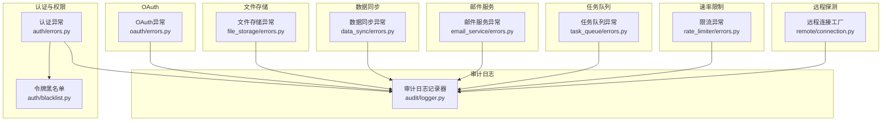

图表来源
- [src/taolib/testing/auth/errors.py:1-55](file://src/taolib/testing/auth/errors.py#L1-L55)
- [src/taolib/testing/oauth/errors.py:1-113](file://src/taolib/testing/oauth/errors.py#L1-L113)
- [src/taolib/testing/file_storage/errors.py:1-63](file://src/taolib/testing/file_storage/errors.py#L1-L63)
- [src/taolib/testing/data_sync/errors.py:1-43](file://src/taolib/testing/data_sync/errors.py#L1-L43)
- [src/taolib/testing/email_service/errors.py:1-65](file://src/taolib/testing/email_service/errors.py#L1-L65)
- [src/taolib/testing/task_queue/errors.py:1-49](file://src/taolib/testing/task_queue/errors.py#L1-L49)
- [src/taolib/testing/rate_limiter/errors.py:1-40](file://src/taolib/testing/rate_limiter/errors.py#L1-L40)
- [src/taolib/testing/audit/logger.py:1-747](file://src/taolib/testing/audit/logger.py#L1-L747)
- [src/taolib/testing/remote/connection.py:1-39](file://src/taolib/testing/remote/connection.py#L1-L39)

章节来源
- [src/taolib/testing/auth/errors.py:1-55](file://src/taolib/testing/auth/errors.py#L1-L55)
- [src/taolib/testing/oauth/errors.py:1-113](file://src/taolib/testing/oauth/errors.py#L1-L113)
- [src/taolib/testing/file_storage/errors.py:1-63](file://src/taolib/testing/file_storage/errors.py#L1-L63)
- [src/taolib/testing/data_sync/errors.py:1-43](file://src/taolib/testing/data_sync/errors.py#L1-L43)
- [src/taolib/testing/email_service/errors.py:1-65](file://src/taolib/testing/email_service/errors.py#L1-L65)
- [src/taolib/testing/task_queue/errors.py:1-49](file://src/taolib/testing/task_queue/errors.py#L1-L49)
- [src/taolib/testing/rate_limiter/errors.py:1-40](file://src/taolib/testing/rate_limiter/errors.py#L1-L40)
- [src/taolib/testing/audit/logger.py:1-747](file://src/taolib/testing/audit/logger.py#L1-L747)
- [src/taolib/testing/remote/connection.py:1-39](file://src/taolib/testing/remote/connection.py#L1-L39)

## 核心组件
- 异常类型分层：各子系统定义了清晰的异常层次，便于区分错误来源与严重程度（如认证、OAuth、文件存储、数据同步、邮件服务、任务队列、速率限制）。
- 审计日志：统一的审计记录器支持多种存储后端（内存、文件、MongoDB），并提供查询、计数、清理等能力，是定位异常上下文的重要依据。
- 令牌黑名单：支持Redis/内存/空实现，用于吊销令牌，配合认证异常进行权限控制。
- 速率限制：滑动窗口+白名单+Bypass路径，超限时抛出限流异常，包含重试等待时间等元信息。
- 远程连接：按需导入Fabric，缺失依赖时抛出远程依赖异常，避免隐式失败。

章节来源
- [src/taolib/testing/audit/logger.py:470-747](file://src/taolib/testing/audit/logger.py#L470-L747)
- [src/taolib/testing/auth/blacklist.py:10-113](file://src/taolib/testing/auth/blacklist.py#L10-L113)
- [src/taolib/testing/rate_limiter/limiter.py:15-202](file://src/taolib/testing/rate_limiter/limiter.py#L15-L202)
- [src/taolib/testing/remote/connection.py:27-39](file://src/taolib/testing/remote/connection.py#L27-L39)

## 架构总览
下图展示异常与审计日志在系统中的交互关系，以及关键异常类型如何影响业务流程。

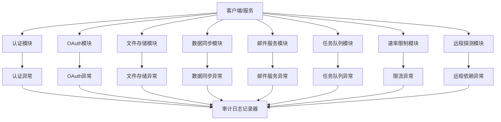

图表来源
- [src/taolib/testing/auth/errors.py:1-55](file://src/taolib/testing/auth/errors.py#L1-L55)
- [src/taolib/testing/oauth/errors.py:1-113](file://src/taolib/testing/oauth/errors.py#L1-L113)
- [src/taolib/testing/file_storage/errors.py:1-63](file://src/taolib/testing/file_storage/errors.py#L1-L63)
- [src/taolib/testing/data_sync/errors.py:1-43](file://src/taolib/testing/data_sync/errors.py#L1-L43)
- [src/taolib/testing/email_service/errors.py:1-65](file://src/taolib/testing/email_service/errors.py#L1-L65)
- [src/taolib/testing/task_queue/errors.py:1-49](file://src/taolib/testing/task_queue/errors.py#L1-L49)
- [src/taolib/testing/rate_limiter/errors.py:1-40](file://src/taolib/testing/rate_limiter/errors.py#L1-L40)
- [src/taolib/testing/audit/logger.py:470-747](file://src/taolib/testing/audit/logger.py#L470-L747)
- [src/taolib/testing/remote/connection.py:27-39](file://src/taolib/testing/remote/connection.py#L27-L39)

## 详细组件分析

### 认证与权限异常
- 异常类型：令牌过期、令牌无效、令牌在黑名单、权限不足、API密钥无效。
- 关键点：令牌黑名单支持Redis/内存/空实现；审计日志记录登录/登出与失败信息。
- 排查要点：确认令牌是否过期、是否被吊销、是否具备所需权限；查看审计日志中的登录失败记录与错误信息字段。

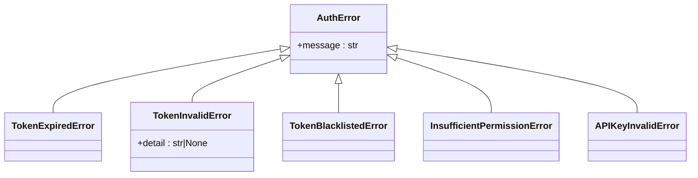

图表来源
- [src/taolib/testing/auth/errors.py:7-55](file://src/taolib/testing/auth/errors.py#L7-L55)

章节来源
- [src/taolib/testing/auth/errors.py:1-55](file://src/taolib/testing/auth/errors.py#L1-L55)
- [src/taolib/testing/auth/blacklist.py:38-113](file://src/taolib/testing/auth/blacklist.py#L38-L113)
- [src/taolib/testing/audit/logger.py:651-705](file://src/taolib/testing/audit/logger.py#L651-L705)

### OAuth异常
- 异常类型：提供商错误、授权码交换失败、用户信息获取失败、Token刷新/解密失败、状态无效、凭证/提供商未注册、已关联、无法解除、会话无效、引导数据无效。
- 关键点：OAuth服务在创建/验证会话、解除关联等场景抛出特定异常；审计日志记录OAuth相关动作。

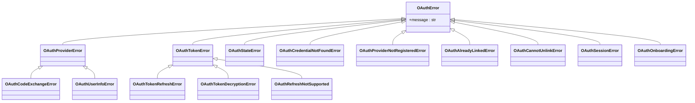

图表来源
- [src/taolib/testing/oauth/errors.py:7-113](file://src/taolib/testing/oauth/errors.py#L7-L113)

章节来源
- [src/taolib/testing/oauth/errors.py:1-113](file://src/taolib/testing/oauth/errors.py#L1-L113)
- [tests/testing/test_oauth/test_services/test_services.py:188-211](file://tests/testing/test_oauth/test_services/test_services.py#L188-L211)

### 文件存储异常
- 异常类型：文件不存在、存储桶不存在/非空、上传会话不存在/已过期、文件验证失败、后端存储失败、CDN操作失败、访问被拒绝、配额超限、分片不匹配、对象键重复、签名URL验证失败。
- 关键点：异常覆盖文件/桶/上传/分片/配额/签名URL等场景；审计日志记录文件相关操作。

```mermaid
classDiagram
class StorageError
class FileNotFoundError_
class BucketNotFoundError
class BucketNotEmptyError
class UploadSessionNotFoundError
class UploadSessionExpiredError
class FileValidationError
class StorageBackendError
class CDNError
class AccessDeniedError
class QuotaExceededError
class ChunkMismatchError
class DuplicateObjectError
class SignedUrlError
StorageError <|-- FileNotFoundError_
StorageError <|-- BucketNotFoundError
StorageError <|-- BucketNotEmptyError
StorageError <|-- UploadSessionNotFoundError
StorageError <|-- UploadSessionExpiredError
StorageError <|-- FileValidationError
StorageError <|-- StorageBackendError
StorageError <|-- CDNError
StorageError <|-- AccessDeniedError
StorageError <|-- QuotaExceededError
StorageError <|-- ChunkMismatchError
StorageError <|-- DuplicateObjectError
StorageError <|-- SignedUrlError
```

图表来源
- [src/taolib/testing/file_storage/errors.py:7-63](file://src/taolib/testing/file_storage/errors.py#L7-L63)

章节来源
- [src/taolib/testing/file_storage/errors.py:1-63](file://src/taolib/testing/file_storage/errors.py#L1-L63)
- [src/taolib/testing/audit/logger.py:510-553](file://src/taolib/testing/audit/logger.py#L510-L553)

### 数据同步异常
- 异常类型：同步作业不存在/禁用、连接MongoDB失败、转换函数抛错、检查点损坏/更新失败、达到阈值触发中止。
- 关键点：异常明确同步生命周期中的关键节点，便于快速定位阶段。

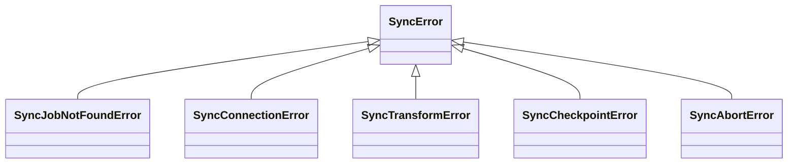

图表来源
- [src/taolib/testing/data_sync/errors.py:7-43](file://src/taolib/testing/data_sync/errors.py#L7-L43)

章节来源
- [src/taolib/testing/data_sync/errors.py:1-43](file://src/taolib/testing/data_sync/errors.py#L1-L43)

### 邮件服务异常
- 异常类型：邮件/模板未找到、模板渲染失败、提供商通信错误、全部提供商失败（携带明细）、队列/订阅操作错误。
- 关键点：AllProvidersFailedError聚合多个提供商的错误明细，便于快速定位失败根因。

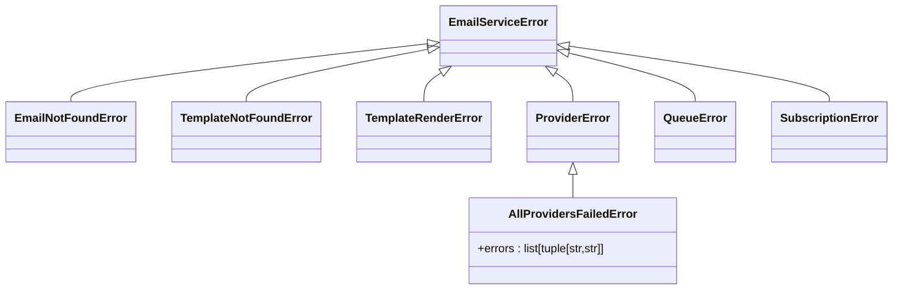

图表来源
- [src/taolib/testing/email_service/errors.py:7-65](file://src/taolib/testing/email_service/errors.py#L7-L65)

章节来源
- [src/taolib/testing/email_service/errors.py:1-65](file://src/taolib/testing/email_service/errors.py#L1-L65)

### 任务队列异常
- 异常类型：任务不存在、幂等键冲突（任务已存在）、处理器未找到、任务执行错误、Redis连接失败、重试次数上限。
- 关键点：任务生命周期（创建/调度/执行/取消/重试）均有对应异常；测试覆盖了取消任务的异常分支。

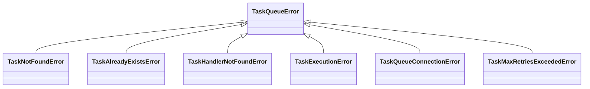

图表来源
- [src/taolib/testing/task_queue/errors.py:7-49](file://src/taolib/testing/task_queue/errors.py#L7-L49)

章节来源
- [src/taolib/testing/task_queue/errors.py:1-49](file://src/taolib/testing/task_queue/errors.py#L1-L49)
- [tests/testing/test_task_queue/test_worker.py:396-431](file://tests/testing/test_task_queue/test_worker.py#L396-L431)

### 速率限制异常
- 异常类型：RateLimitExceededError，包含阈值、窗口、重试等待、标识符、重置时间戳等信息。
- 关键点：限流器根据路径/方法匹配规则，计算剩余配额与重试等待时间，超限即抛出异常。

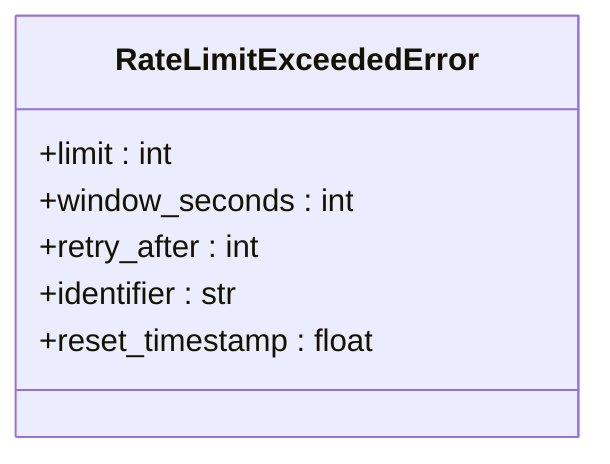

图表来源
- [src/taolib/testing/rate_limiter/errors.py:6-38](file://src/taolib/testing/rate_limiter/errors.py#L6-L38)

章节来源
- [src/taolib/testing/rate_limiter/errors.py:1-40](file://src/taolib/testing/rate_limiter/errors.py#L1-L40)
- [src/taolib/testing/rate_limiter/limiter.py:123-178](file://src/taolib/testing/rate_limiter/limiter.py#L123-L178)

### 审计日志与异常上下文
- 统一记录：审计日志记录器支持同步/异步，提供创建/更新/删除/登录/登出等动作记录，并可附带错误信息。
- 存储后端：内存、文件、MongoDB三种实现，便于不同环境下的调试与生产落盘。
- 关键字段：用户ID、资源类型/ID、IP/User-Agent、状态（成功/失败）、错误信息等，是定位异常上下文的核心。

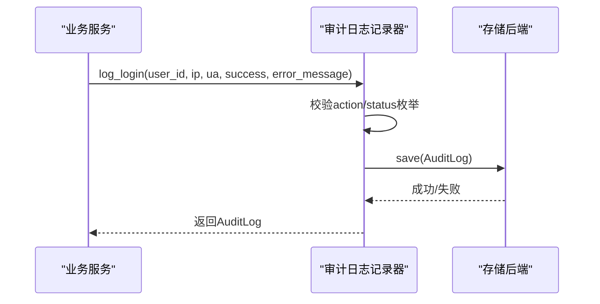

图表来源
- [src/taolib/testing/audit/logger.py:498-553](file://src/taolib/testing/audit/logger.py#L498-L553)

章节来源
- [src/taolib/testing/audit/logger.py:470-747](file://src/taolib/testing/audit/logger.py#L470-L747)

## 依赖关系分析
- 异常定义与审计日志：各异常模块与审计日志记录器之间无直接耦合，但通过业务调用链间接关联；审计日志可记录异常发生时的上下文。
- 令牌黑名单：与认证异常配合，黑名单命中将触发“令牌在黑名单”类异常。
- 速率限制：与限流异常配合，超限后由限流器抛出异常并附带重试信息。
- 远程连接：按需导入Fabric，缺失依赖时抛出远程依赖异常，避免隐式失败。

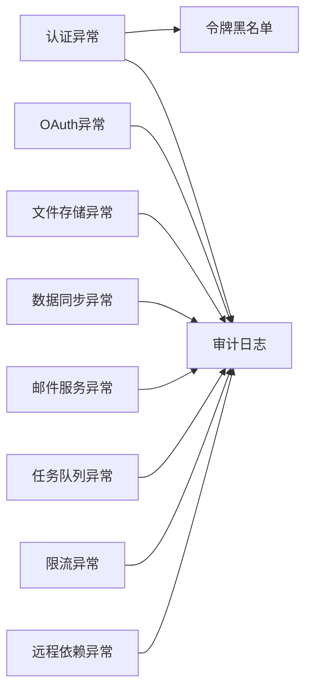

图表来源
- [src/taolib/testing/auth/errors.py:1-55](file://src/taolib/testing/auth/errors.py#L1-L55)
- [src/taolib/testing/oauth/errors.py:1-113](file://src/taolib/testing/oauth/errors.py#L1-L113)
- [src/taolib/testing/file_storage/errors.py:1-63](file://src/taolib/testing/file_storage/errors.py#L1-L63)
- [src/taolib/testing/data_sync/errors.py:1-43](file://src/taolib/testing/data_sync/errors.py#L1-L43)
- [src/taolib/testing/email_service/errors.py:1-65](file://src/taolib/testing/email_service/errors.py#L1-L65)
- [src/taolib/testing/task_queue/errors.py:1-49](file://src/taolib/testing/task_queue/errors.py#L1-L49)
- [src/taolib/testing/rate_limiter/errors.py:1-40](file://src/taolib/testing/rate_limiter/errors.py#L1-L40)
- [src/taolib/testing/audit/logger.py:1-747](file://src/taolib/testing/audit/logger.py#L1-L747)
- [src/taolib/testing/remote/connection.py:27-39](file://src/taolib/testing/remote/connection.py#L27-L39)

章节来源
- [src/taolib/testing/audit/logger.py:1-747](file://src/taolib/testing/audit/logger.py#L1-L747)
- [src/taolib/testing/remote/connection.py:1-39](file://src/taolib/testing/remote/connection.py#L1-L39)

## 性能考量
- 限流策略：滑动窗口+白名单+Bypass路径，减少热点路径的限流开销；超限时返回重试等待时间，避免雪崩。
- 审计日志：MongoDB后端创建索引以优化查询；文件后端注意I/O瓶颈；内存后端注意容量限制。
- 任务队列：工作线程在异常后sleep短暂时间再继续，避免忙等；建议结合指数退避与熔断策略。

## 故障排查指南

### 通用排查流程
- 复现与最小化：在测试环境中复现，缩小输入范围与调用链。
- 查看异常类型：根据异常层次判断来源（认证/OAuth/文件存储/任务队列/速率限制等）。
- 分析审计日志：定位操作时间、用户、IP、资源、状态与错误信息。
- 检查依赖与配置：确认Redis/MongoDB/Fabric等外部依赖可用且配置正确。
- 观察重试与退避：若为限流/网络抖动，遵循异常提供的重试等待时间。

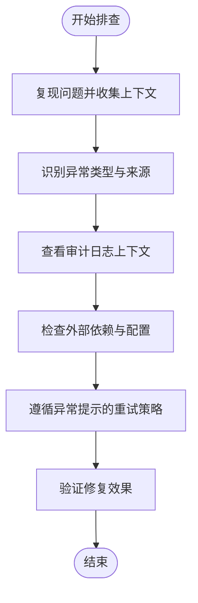

### 认证失败
- 症状：登录/鉴权接口返回“令牌无效/过期/在黑名单/权限不足/API密钥无效”。
- 可能原因：令牌过期、签名不匹配、被吊销、RBAC权限不足、API密钥错误或未配置。
- 定位方法：查看审计日志中的登录失败记录与错误信息；核对令牌有效期与黑名单状态；检查RBAC角色与权限映射。
- 修复建议：刷新令牌或重新登录；检查黑名单配置；修正权限或API密钥；完善令牌吊销流程。

章节来源
- [src/taolib/testing/auth/errors.py:15-55](file://src/taolib/testing/auth/errors.py#L15-L55)
- [src/taolib/testing/auth/blacklist.py:38-113](file://src/taolib/testing/auth/blacklist.py#L38-L113)
- [src/taolib/testing/audit/logger.py:651-705](file://src/taolib/testing/audit/logger.py#L651-L705)
- [tests/testing/test_config_center/test_auth.py:125-130](file://tests/testing/test_config_center/test_auth.py#L125-L130)

### 权限拒绝
- 症状：RBAC校验失败，抛出“权限不足”异常。
- 可能原因：角色未授予所需权限、权限字符串不匹配、系统角色缺失。
- 定位方法：核对RBAC服务中的系统角色与权限映射；检查用户角色集合。
- 修复建议：补充角色权限或调整用户角色；确保权限字符串一致。

章节来源
- [src/taolib/testing/auth/errors.py:41-45](file://src/taolib/testing/auth/errors.py#L41-L45)
- [tests/testing/test_config_center/test_auth.py:133-156](file://tests/testing/test_config_center/test_auth.py#L133-L156)

### 数据库连接异常
- 症状：MongoDB/Redis连接失败，或查询/插入报错。
- 可能原因：连接参数错误、网络不通、认证失败、服务不可用。
- 定位方法：查看审计日志中MongoDB后端的保存/批量保存异常；检查Redis连接工厂与客户端初始化。
- 修复建议：修正连接参数与认证信息；检查网络连通性；增加健康检查与重试。

章节来源
- [src/taolib/testing/audit/logger.py:354-383](file://src/taolib/testing/audit/logger.py#L354-L383)
- [src/taolib/testing/config_center/cache/redis_client.py:1-11](file://src/taolib/testing/config_center/cache/redis_client.py#L1-L11)

### 文件操作错误
- 症状：文件不存在、桶不存在/非空、上传会话不存在/过期、文件验证失败、CDN操作失败、访问被拒绝、配额超限、分片不匹配、签名URL验证失败。
- 可能原因：路径错误、权限不足、配额限制、CDN配置错误、分片校验失败。
- 定位方法：查看审计日志中的文件操作记录；核对桶/文件/上传会话状态；检查配额与MIME类型。
- 修复建议：修正路径与权限；清理非空桶；调整配额；校验分片与签名URL。

章节来源
- [src/taolib/testing/file_storage/errors.py:11-63](file://src/taolib/testing/file_storage/errors.py#L11-L63)
- [src/taolib/testing/audit/logger.py:510-553](file://src/taolib/testing/audit/logger.py#L510-L553)

### 任务执行失败
- 症状：任务不存在、幂等键冲突、处理器未找到、执行错误、Redis连接失败、重试次数上限。
- 可能原因：任务状态不正确、处理器未注册、Redis不可用、处理器内部异常。
- 定位方法：查看任务状态与处理器注册情况；检查Redis连接；观察工作线程异常后的处理逻辑。
- 修复建议：确保处理器已注册；修复Redis配置；完善异常捕获与重试策略；必要时降级或旁路。

章节来源
- [src/taolib/testing/task_queue/errors.py:13-49](file://src/taolib/testing/task_queue/errors.py#L13-L49)
- [tests/testing/test_task_queue/test_worker.py:396-431](file://tests/testing/test_task_queue/test_worker.py#L396-L431)

### 异步编程中的常见错误
- CancelledError/TimeoutError：通常由超时或取消触发，需区分是应用侧主动取消还是外部中断。
- 排查要点：检查任务取消时机与状态；确认超时阈值设置；在工作循环中捕获异常并安全退出。
- 修复建议：合理设置超时；在关键路径添加取消点；完善异常捕获与清理逻辑。

章节来源
- [tests/testing/test_task_queue/test_worker.py:396-431](file://tests/testing/test_task_queue/test_worker.py#L396-L431)

### 服务间调用失败、网络超时与资源竞争
- 症状：远程依赖缺失、连接工厂初始化失败、高延迟场景下探测失败。
- 可能原因：依赖未安装、网络延迟高、并发竞争导致资源争用。
- 定位方法：查看远程连接工厂的依赖异常；在基准测试中模拟高延迟场景；观察并发线程/协程的资源竞争。
- 修复建议：安装缺失依赖；引入熔断/隔离/超时；优化锁与并发策略。

章节来源
- [src/taolib/testing/remote/connection.py:27-39](file://src/taolib/testing/remote/connection.py#L27-L39)
- [tests/testing/perf_remote_bench.py:456-467](file://tests/testing/perf_remote_bench.py#L456-L467)

### 错误日志分析、异常捕获与优雅降级
- 日志分析：优先关注审计日志中的错误信息字段与状态；结合异常类型快速定位阶段。
- 异常捕获：在关键路径捕获具体异常类型，避免宽泛的Exception；记录上下文并决定是否重试。
- 优雅降级：对非关键路径采用降级策略（如缓存回退、只读模式、降级接口），保证主流程可用。

章节来源
- [src/taolib/testing/audit/logger.py:498-553](file://src/taolib/testing/audit/logger.py#L498-L553)
- [src/taolib/testing/rate_limiter/errors.py:19-37](file://src/taolib/testing/rate_limiter/errors.py#L19-L37)

## 结论
通过异常类型分层、统一的审计日志记录、完善的测试覆盖与性能考量，FlexLoop项目在运行时异常排查方面具备良好的可维护性与可观测性。建议在日常运维中：
- 明确异常分类与处理策略；
- 依托审计日志快速定位上下文；
- 在关键路径实施合理的超时、重试与熔断；
- 对非关键路径进行优雅降级，保障系统整体稳定性。

## 附录
- 常见异常类型速查：认证、OAuth、文件存储、数据同步、邮件服务、任务队列、速率限制、远程依赖。
- 排障清单：复现→识别异常→查看审计日志→检查依赖与配置→遵循重试策略→验证修复。