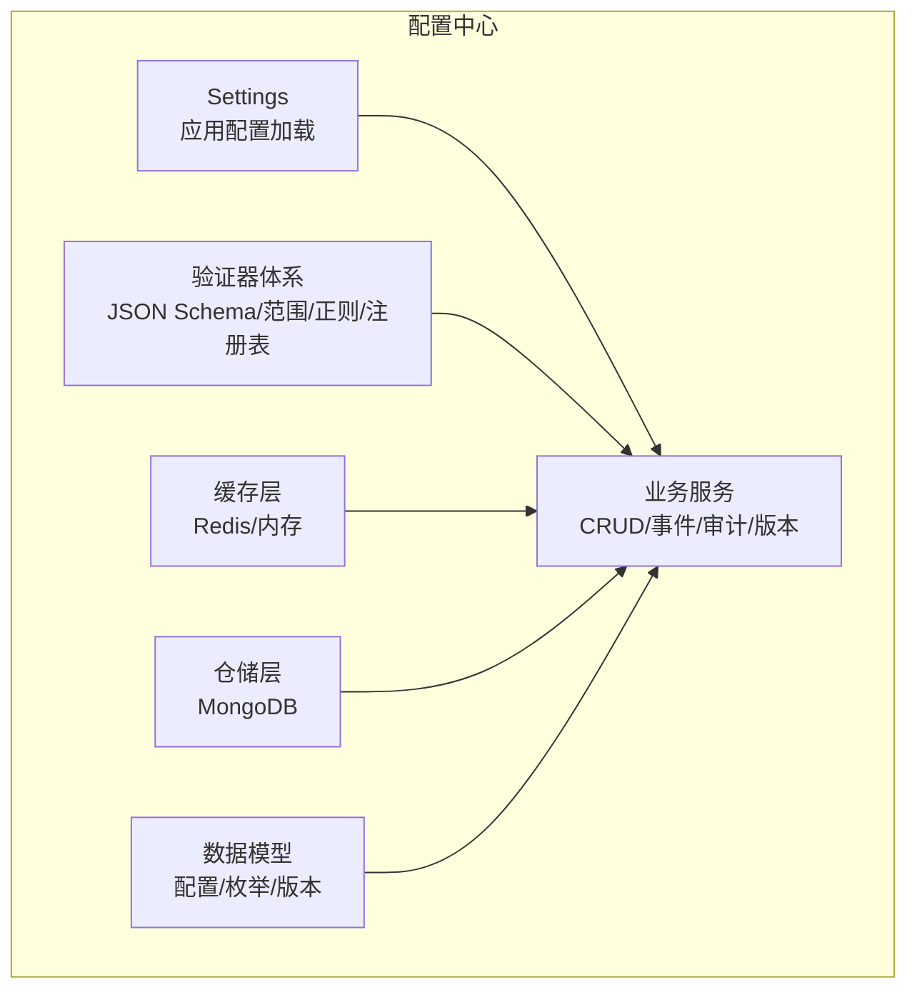
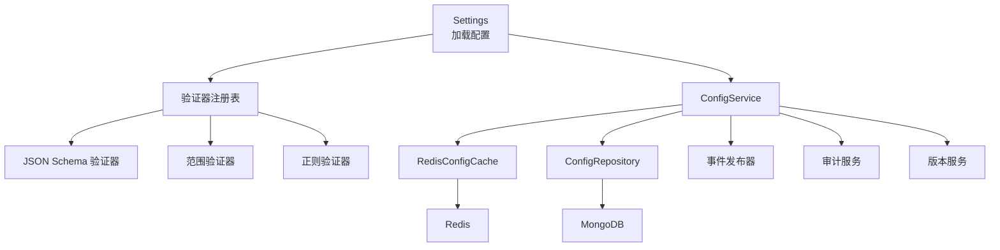
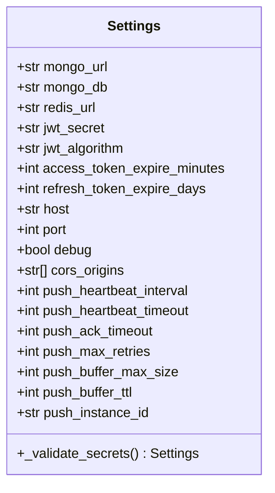
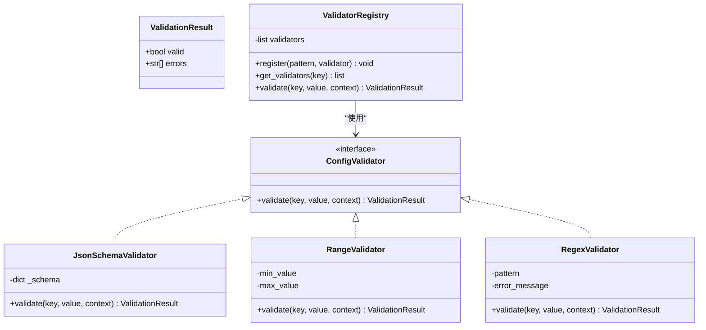
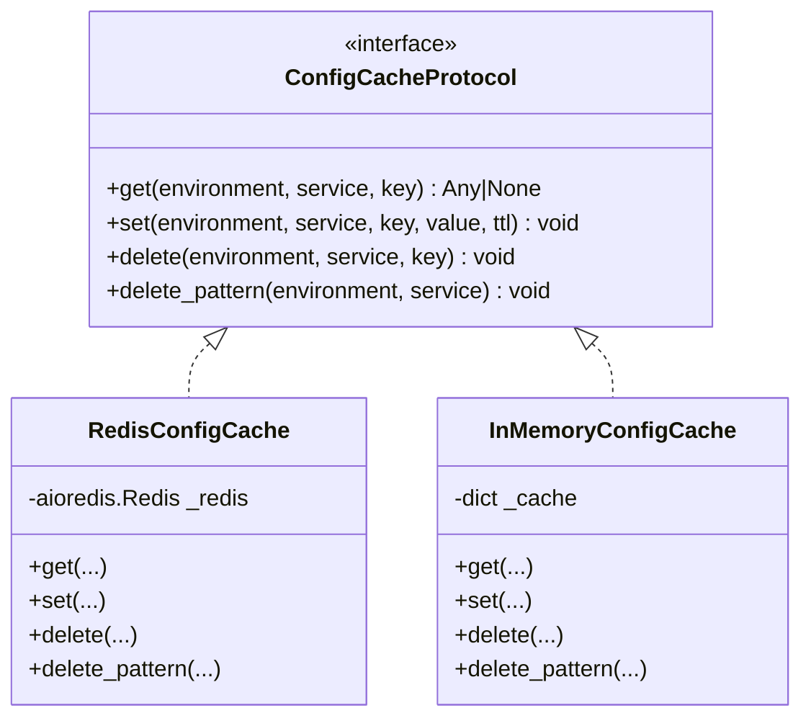
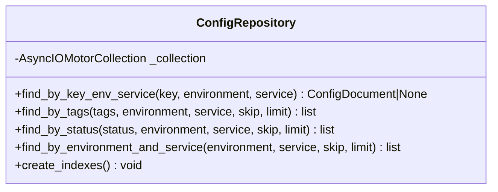
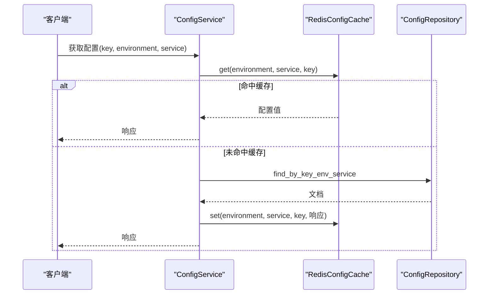
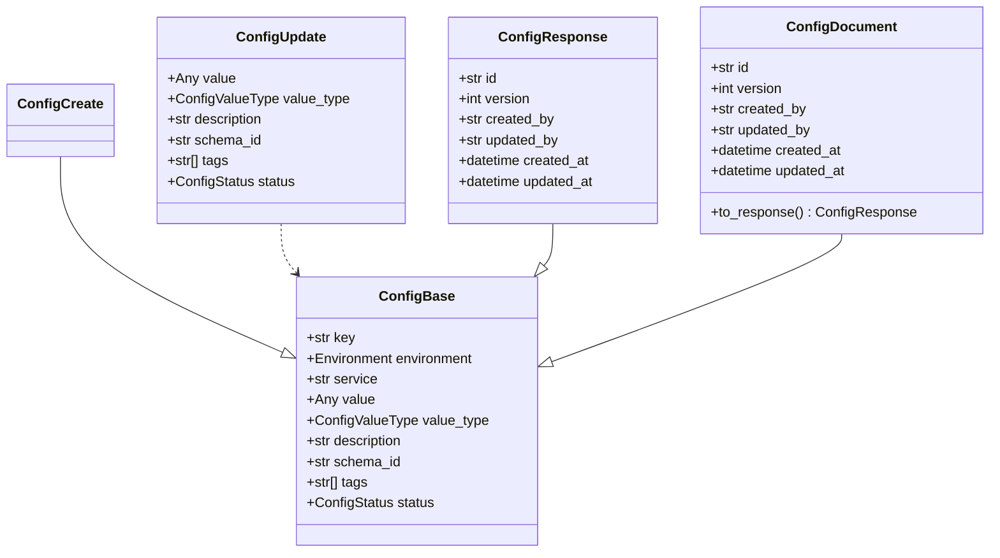
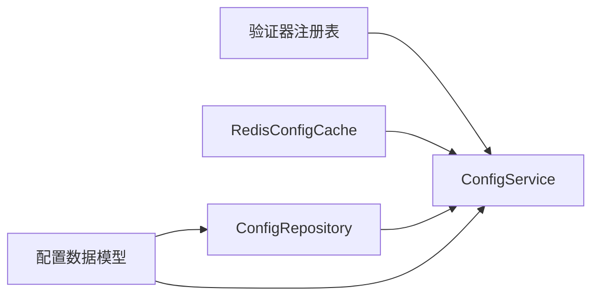

# 配置错误

<cite>
**本文引用的文件**
- [配置中心服务配置](file://src/taolib/testing/config_center/server/config.py)
- [配置缓存策略](file://src/taolib/testing/config_center/cache/config_cache.py)
- [配置仓库](file://src/taolib/testing/config_center/repository/config_repo.py)
- [配置业务服务](file://src/taolib/testing/config_center/services/config_service.py)
- [验证器基类](file://src/taolib/testing/config_center/validation/base.py)
- [JSON Schema 验证器](file://src/taolib/testing/config_center/validation/json_schema.py)
- [范围验证器](file://src/taolib/testing/config_center/validation/range.py)
- [正则验证器](file://src/taolib/testing/config_center/validation/regex.py)
- [验证器注册表](file://src/taolib/testing/config_center/validation/registry.py)
- [配置数据模型](file://src/taolib/testing/config_center/models/config.py)
- [配置验证单元测试](file://tests/testing/test_config_center/test_validation.py)
- [配置模型单元测试](file://tests/testing/test_config_center/test_models_config.py)
- [配置缓存单元测试](file://tests/testing/test_config_center/test_cache.py)
</cite>

## 目录
1. [简介](#简介)
2. [项目结构](#项目结构)
3. [核心组件](#核心组件)
4. [架构总览](#架构总览)
5. [详细组件分析](#详细组件分析)
6. [依赖分析](#依赖分析)
7. [性能考虑](#性能考虑)
8. [故障排查指南](#故障排查指南)
9. [结论](#结论)
10. [附录](#附录)

## 简介
本指南面向 FlexLoop 项目的配置中心模块，聚焦配置错误的诊断与修复。内容覆盖配置文件格式、参数验证、加载异常、数据库与缓存连接、JWT 密钥、配置中心验证机制与错误处理流程，并提供不同环境（开发、测试、生产）的差异与迁移注意事项，以及热更新失败、缓存失效与版本控制问题的解决方案。

## 项目结构
配置中心相关代码采用分层组织：配置加载与校验（Settings）、验证器体系（JSON Schema、范围、正则、注册表）、缓存层（Redis/内存）、仓储层（MongoDB）、业务服务（CRUD、事件发布、审计、版本控制）以及对应的模型定义与测试。

**图表来源**
- [配置中心服务配置:12-72](file://src/taolib/testing/config_center/server/config.py#L12-L72)
- [验证器注册表:12-74](file://src/taolib/testing/config_center/validation/registry.py#L12-L74)
- [配置缓存策略:75-172](file://src/taolib/testing/config_center/cache/config_cache.py#L75-L172)
- [配置仓库:15-145](file://src/taolib/testing/config_center/repository/config_repo.py#L15-L145)
- [配置业务服务:22-466](file://src/taolib/testing/config_center/services/config_service.py#L22-L466)
- [配置数据模型:14-106](file://src/taolib/testing/config_center/models/config.py#L14-L106)

**章节来源**
- [配置中心服务配置:12-72](file://src/taolib/testing/config_center/server/config.py#L12-L72)
- [配置缓存策略:75-172](file://src/taolib/testing/config_center/cache/config_cache.py#L75-L172)
- [配置仓库:15-145](file://src/taolib/testing/config_center/repository/config_repo.py#L15-L145)
- [配置业务服务:22-466](file://src/taolib/testing/config_center/services/config_service.py#L22-L466)
- [验证器注册表:12-74](file://src/taolib/testing/config_center/validation/registry.py#L12-L74)
- [配置数据模型:14-106](file://src/taolib/testing/config_center/models/config.py#L14-L106)

## 核心组件
- 应用配置加载（Settings）
  - 支持从 .env 文件加载，环境变量前缀为 CONFIG_CENTER_，大小写不敏感。
  - 包含 MongoDB、Redis、JWT、服务器、CORS、推送服务等配置项。
  - 提供模型级校验，如 jwt_secret 长度必须 ≥ 32 字符。
- 验证器体系
  - 基于协议的验证器接口，支持 JSON Schema、数值范围、正则表达式。
  - 注册表按键模式（支持通配符）注册验证器，执行链式验证。
- 缓存层
  - RedisConfigCache：异步 Redis 缓存，负责配置值的序列化/反序列化与 TTL。
  - InMemoryConfigCache：测试用内存缓存，支持 TTL 与模式删除。
- 仓储层
  - ConfigRepository：基于 Motor 的异步 MongoDB 访问，提供多字段唯一索引与常用查询。
- 业务服务
  - ConfigService：封装 CRUD、缓存集成、事件发布、审计与版本控制。
- 数据模型
  - ConfigBase/ConfigCreate/ConfigUpdate/ConfigResponse/ConfigDocument 及枚举类型，统一请求/响应与文档映射。

**章节来源**
- [配置中心服务配置:12-72](file://src/taolib/testing/config_center/server/config.py#L12-L72)
- [验证器基类:10-45](file://src/taolib/testing/config_center/validation/base.py#L10-L45)
- [JSON Schema 验证器:13-44](file://src/taolib/testing/config_center/validation/json_schema.py#L13-L44)
- [范围验证器:11-53](file://src/taolib/testing/config_center/validation/range.py#L11-L53)
- [正则验证器:12-48](file://src/taolib/testing/config_center/validation/regex.py#L12-L48)
- [验证器注册表:12-74](file://src/taolib/testing/config_center/validation/registry.py#L12-L74)
- [配置缓存策略:75-172](file://src/taolib/testing/config_center/cache/config_cache.py#L75-L172)
- [配置仓库:15-145](file://src/taolib/testing/config_center/repository/config_repo.py#L15-L145)
- [配置业务服务:22-466](file://src/taolib/testing/config_center/services/config_service.py#L22-L466)
- [配置数据模型:14-106](file://src/taolib/testing/config_center/models/config.py#L14-L106)

## 架构总览
配置中心的运行时交互围绕 Settings 加载、验证器链、缓存与数据库协作展开。下图展示关键组件间的依赖与调用关系。

**图表来源**
- [配置中心服务配置:12-72](file://src/taolib/testing/config_center/server/config.py#L12-L72)
- [验证器注册表:12-74](file://src/taolib/testing/config_center/validation/registry.py#L12-L74)
- [JSON Schema 验证器:13-44](file://src/taolib/testing/config_center/validation/json_schema.py#L13-L44)
- [范围验证器:11-53](file://src/taolib/testing/config_center/validation/range.py#L11-L53)
- [正则验证器:12-48](file://src/taolib/testing/config_center/validation/regex.py#L12-L48)
- [配置缓存策略:75-172](file://src/taolib/testing/config_center/cache/config_cache.py#L75-L172)
- [配置仓库:15-145](file://src/taolib/testing/config_center/repository/config_repo.py#L15-L145)
- [配置业务服务:22-466](file://src/taolib/testing/config_center/services/config_service.py#L22-L466)

## 详细组件分析

### 配置加载与校验（Settings）
- 环境变量前缀与文件
  - 前缀：CONFIG_CENTER_
  - 文件：.env
  - 编码：utf-8
  - 大小写不敏感
- 关键配置项
  - 数据库：mongo_url、mongo_db
  - 缓存：redis_url
  - 安全：jwt_secret（生产必须 ≥ 32 字符）、jwt_algorithm、access_token_expire_minutes、refresh_token_expire_days
  - 服务：host、port、debug
  - CORS：cors_origins
  - 推送：心跳间隔/超时、ACK 超时、最大重试、离线消息缓冲上限/TTL、实例 ID
- 校验逻辑
  - 模型级校验：jwt_secret 长度校验，失败抛出异常

**图表来源**
- [配置中心服务配置:12-72](file://src/taolib/testing/config_center/server/config.py#L12-L72)

**章节来源**
- [配置中心服务配置:12-72](file://src/taolib/testing/config_center/server/config.py#L12-L72)

### 验证器体系
- 协议与结果
  - ConfigValidator 协议定义 validate 方法
  - ValidationResult 冻结数据类，包含 valid 与 errors
- 验证器实现
  - JsonSchemaValidator：基于 jsonschema 的结构校验
  - RangeValidator：数值范围校验
  - RegexValidator：字符串正则匹配校验
- 注册表
  - ValidatorRegistry：按键模式注册与匹配，支持通配符
  - validate 聚合多个验证器结果，收集所有错误

**图表来源**
- [验证器基类:10-45](file://src/taolib/testing/config_center/validation/base.py#L10-L45)
- [JSON Schema 验证器:13-44](file://src/taolib/testing/config_center/validation/json_schema.py#L13-L44)
- [范围验证器:11-53](file://src/taolib/testing/config_center/validation/range.py#L11-L53)
- [正则验证器:12-48](file://src/taolib/testing/config_center/validation/regex.py#L12-L48)
- [验证器注册表:12-74](file://src/taolib/testing/config_center/validation/registry.py#L12-L74)

**章节来源**
- [验证器基类:10-45](file://src/taolib/testing/config_center/validation/base.py#L10-L45)
- [JSON Schema 验证器:13-44](file://src/taolib/testing/config_center/validation/json_schema.py#L13-L44)
- [范围验证器:11-53](file://src/taolib/testing/config_center/validation/range.py#L11-L53)
- [正则验证器:12-48](file://src/taolib/testing/config_center/validation/regex.py#L12-L48)
- [验证器注册表:12-74](file://src/taolib/testing/config_center/validation/registry.py#L12-L74)

### 缓存层（Redis/内存）
- RedisConfigCache
  - 使用 aioredis 异步客户端
  - 键命名规范：config:<environment>:<service>:<key>
  - JSON 序列化/反序列化，异常时记录告警并返回 None
  - 支持按模式批量删除（keys + delete）
- InMemoryConfigCache（测试）
  - 内存字典存储 + 过期时间戳
  - 支持 TTL 与模式删除（fnmatch）

**图表来源**
- [配置缓存策略:18-172](file://src/taolib/testing/config_center/cache/config_cache.py#L18-L172)

**章节来源**
- [配置缓存策略:75-172](file://src/taolib/testing/config_center/cache/config_cache.py#L75-L172)

### 仓储层（MongoDB）
- ConfigRepository
  - 基于 Motor 的异步集合操作
  - 唯一复合索引：(key, environment, service)
  - 辅助索引：status、tags、(environment, service)
  - 查询方法：按 key/env/service、标签、状态、环境+服务

**图表来源**
- [配置仓库:15-145](file://src/taolib/testing/config_center/repository/config_repo.py#L15-L145)

**章节来源**
- [配置仓库:15-145](file://src/taolib/testing/config_center/repository/config_repo.py#L15-L145)

### 业务服务（CRUD/事件/审计/版本）
- ConfigService
  - 缓存优先策略：先查缓存，未命中再查数据库并写回缓存
  - 更新/删除/发布均清理对应缓存键
  - 审计日志记录：创建/更新/删除/发布/回滚
  - 事件发布：变更事件通过事件发布器广播
  - 版本控制：每次变更递增版本号并记录版本历史

**图表来源**
- [配置业务服务:129-166](file://src/taolib/testing/config_center/services/config_service.py#L129-L166)
- [配置缓存策略:86-108](file://src/taolib/testing/config_center/cache/config_cache.py#L86-L108)
- [配置仓库:26-52](file://src/taolib/testing/config_center/repository/config_repo.py#L26-L52)

**章节来源**
- [配置业务服务:129-166](file://src/taolib/testing/config_center/services/config_service.py#L129-L166)

### 数据模型
- ConfigBase/ConfigCreate/ConfigUpdate/ConfigResponse/ConfigDocument
  - 统一 key、environment、service、value、value_type、description、schema_id、tags、status
  - ConfigDocument 增加版本号与审计字段，支持 to_response 转换
  - Pydantic 字段约束（长度、类型、枚举）

**图表来源**
- [配置数据模型:14-106](file://src/taolib/testing/config_center/models/config.py#L14-L106)

**章节来源**
- [配置数据模型:14-106](file://src/taolib/testing/config_center/models/config.py#L14-L106)

## 依赖分析
- 组件耦合
  - ConfigService 依赖 ConfigRepository、ConfigCacheProtocol、VersionService、AuditService、EventPublisher
  - 验证器通过注册表被集中调用，降低对具体验证器的直接依赖
  - 缓存层通过协议抽象，便于替换实现
- 外部依赖
  - Redis（aioredis）、MongoDB（motor）、jsonschema、Pydantic
- 潜在循环依赖
  - 当前模块间为单向依赖，未见循环

**图表来源**
- [配置业务服务:22-466](file://src/taolib/testing/config_center/services/config_service.py#L22-L466)
- [配置缓存策略:75-172](file://src/taolib/testing/config_center/cache/config_cache.py#L75-L172)
- [配置仓库:15-145](file://src/taolib/testing/config_center/repository/config_repo.py#L15-L145)
- [配置数据模型:14-106](file://src/taolib/testing/config_center/models/config.py#L14-L106)
- [验证器注册表:12-74](file://src/taolib/testing/config_center/validation/registry.py#L12-L74)

**章节来源**
- [配置业务服务:22-466](file://src/taolib/testing/config_center/services/config_service.py#L22-L466)
- [配置缓存策略:75-172](file://src/taolib/testing/config_center/cache/config_cache.py#L75-L172)
- [配置仓库:15-145](file://src/taolib/testing/config_center/repository/config_repo.py#L15-L145)
- [配置数据模型:14-106](file://src/taolib/testing/config_center/models/config.py#L14-L106)
- [验证器注册表:12-74](file://src/taolib/testing/config_center/validation/registry.py#L12-L74)

## 性能考虑
- 缓存命中率
  - 通过缓存优先策略减少数据库访问；建议合理设置 TTL，避免过期风暴
- 索引设计
  - 复合唯一索引与常用过滤字段索引有助于查询性能
- 异步 I/O
  - Redis/MongoDB 均为异步实现，注意事件循环与并发控制
- 验证开销
  - 注册表按键模式匹配，建议精简模式数量，避免过多验证器叠加

[本节为通用指导，无需列出章节来源]

## 故障排查指南

### 一、配置文件格式与加载错误
- 症状
  - 启动时报错提示无法解析配置或缺少必要字段
- 排查步骤
  - 检查 .env 文件是否存在且编码为 utf-8
  - 确认环境变量前缀 CONFIG_CENTER_ 与键名拼写一致（大小写不敏感）
  - 使用最小化配置集验证 Settings 能否成功实例化
- 关联文件
  - [配置中心服务配置:60-72](file://src/taolib/testing/config_center/server/config.py#L60-L72)

**章节来源**
- [配置中心服务配置:60-72](file://src/taolib/testing/config_center/server/config.py#L60-L72)

### 二、参数验证失败（模型级）
- 症状
  - 启动即抛出 ValueError，提示 jwt_secret 长度不足
- 排查步骤
  - 确保 jwt_secret ≥ 32 字符
  - 在生产环境务必设置安全密钥
- 关联文件
  - [配置中心服务配置:53-58](file://src/taolib/testing/config_center/server/config.py#L53-L58)

**章节来源**
- [配置中心服务配置:53-58](file://src/taolib/testing/config_center/server/config.py#L53-L58)

### 三、配置验证机制与错误处理
- 症状
  - 配置提交后立即生效但后续读取异常，或出现类型/范围/格式错误
- 排查步骤
  - 检查验证器注册表是否正确注册了目标键模式
  - 使用单元测试中的验证器用例作为参考，逐项比对
  - 关注 JSON Schema、范围、正则验证器的错误消息聚合
- 关联文件
  - [验证器注册表:42-67](file://src/taolib/testing/config_center/validation/registry.py#L42-L67)
  - [JSON Schema 验证器:24-42](file://src/taolib/testing/config_center/validation/json_schema.py#L24-L42)
  - [范围验证器:26-50](file://src/taolib/testing/config_center/validation/range.py#L26-L50)
  - [正则验证器:25-45](file://src/taolib/testing/config_center/validation/regex.py#L25-L45)
  - [配置验证单元测试:117-188](file://tests/testing/test_config_center/test_validation.py#L117-L188)

**章节来源**
- [验证器注册表:42-67](file://src/taolib/testing/config_center/validation/registry.py#L42-L67)
- [JSON Schema 验证器:24-42](file://src/taolib/testing/config_center/validation/json_schema.py#L24-L42)
- [范围验证器:26-50](file://src/taolib/testing/config_center/validation/range.py#L26-L50)
- [正则验证器:25-45](file://src/taolib/testing/config_center/validation/regex.py#L25-L45)
- [配置验证单元测试:117-188](file://tests/testing/test_config_center/test_validation.py#L117-L188)

### 四、数据库连接配置问题
- 症状
  - 查询/插入失败，报连接或认证错误
- 排查步骤
  - 校验 mongo_url 与 mongo_db 设置
  - 确认 MongoDB 服务可达、凭据正确
  - 查看仓储层索引创建是否成功
- 关联文件
  - [配置中心服务配置:15-19](file://src/taolib/testing/config_center/server/config.py#L15-L19)
  - [配置仓库:134-142](file://src/taolib/testing/config_center/repository/config_repo.py#L134-L142)

**章节来源**
- [配置中心服务配置:15-19](file://src/taolib/testing/config_center/server/config.py#L15-L19)
- [配置仓库:134-142](file://src/taolib/testing/config_center/repository/config_repo.py#L134-L142)

### 五、Redis 缓存配置问题
- 症状
  - 配置读取缓慢或偶发 KeyError；更新后读取不到最新值
- 排查步骤
  - 校验 redis_url 设置
  - 检查键命名规范与 TTL 设置
  - 观察 JSON 解析异常日志（缓存数据解码失败）
  - 使用单元测试验证键生成与模式删除功能
- 关联文件
  - [配置中心服务配置:21-24](file://src/taolib/testing/config_center/server/config.py#L21-L24)
  - [配置缓存策略:86-123](file://src/taolib/testing/config_center/cache/config_cache.py#L86-L123)
  - [配置缓存单元测试:21-58](file://tests/testing/test_config_center/test_cache.py#L21-L58)

**章节来源**
- [配置中心服务配置:21-24](file://src/taolib/testing/config_center/server/config.py#L21-L24)
- [配置缓存策略:86-123](file://src/taolib/testing/config_center/cache/config_cache.py#L86-L123)
- [配置缓存单元测试:21-58](file://tests/testing/test_config_center/test_cache.py#L21-L58)

### 六、JWT 密钥配置问题
- 症状
  - 启动失败或运行时报密钥长度/算法错误
- 排查步骤
  - 确认 jwt_secret ≥ 32 字符
  - 检查 jwt_algorithm 是否受支持
  - 生产环境务必设置安全密钥并妥善保管
- 关联文件
  - [配置中心服务配置:26-34](file://src/taolib/testing/config_center/server/config.py#L26-L34)

**章节来源**
- [配置中心服务配置:26-34](file://src/taolib/testing/config_center/server/config.py#L26-L34)

### 七、环境变量读取错误
- 症状
  - 配置项为空或默认值被使用
- 排查步骤
  - 确认 .env 文件路径与编码
  - 检查环境变量前缀 CONFIG_CENTER_ 与键名一致性
  - 验证大小写不敏感设置是否生效
- 关联文件
  - [配置中心服务配置:60-65](file://src/taolib/testing/config_center/server/config.py#L60-L65)

**章节来源**
- [配置中心服务配置:60-65](file://src/taolib/testing/config_center/server/config.py#L60-L65)

### 八、配置冲突与重复
- 症状
  - 同 key/environment/service 出现多条记录或更新冲突
- 排查步骤
  - 检查唯一复合索引是否创建成功
  - 确认更新流程是否正确递增版本号
- 关联文件
  - [配置仓库:134-139](file://src/taolib/testing/config_center/repository/config_repo.py#L134-L139)

**章节来源**
- [配置仓库:134-139](file://src/taolib/testing/config_center/repository/config_repo.py#L134-L139)

### 九、配置中心验证机制与错误处理流程
- 症状
  - 提交配置后未触发预期行为或错误未明确
- 排查步骤
  - 检查验证器注册表是否按模式正确匹配
  - 关注 ValidationResult 的 valid 与 errors 聚合
  - 对照单元测试用例定位问题
- 关联文件
  - [验证器注册表:31-67](file://src/taolib/testing/config_center/validation/registry.py#L31-L67)
  - [配置验证单元测试:35-115](file://tests/testing/test_config_center/test_validation.py#L35-L115)

**章节来源**
- [验证器注册表:31-67](file://src/taolib/testing/config_center/validation/registry.py#L31-L67)
- [配置验证单元测试:35-115](file://tests/testing/test_config_center/test_validation.py#L35-L115)

### 十、不同环境（开发/测试/生产）差异与迁移
- 开发环境
  - 可使用较短 jwt_secret 进行本地测试
  - Redis/MongoDB 使用本地或容器服务
- 测试环境
  - 使用 InMemoryConfigCache 进行快速验证
  - 验证器注册表与模型约束保持一致
- 生产环境
  - 必须设置安全 jwt_secret（≥32 字符）
  - Redis/MongoDB 使用高可用集群
  - 启用严格 CORS 与 TLS
- 迁移注意事项
  - 逐步将开发配置迁移到测试，再进入生产
  - 迁移前后核对键名、前缀与索引
  - 使用版本控制确保可回滚

[本节为通用指导，无需列出章节来源]

### 十一、配置热更新失败、缓存失效与版本控制
- 症状
  - 更新配置后客户端仍读取旧值；事件未广播
- 排查步骤
  - 确认 ConfigService 在更新/删除/发布后清理了对应缓存键
  - 检查事件发布器是否可用并正常工作
  - 核对版本号递增与版本历史记录
- 关联文件
  - [配置业务服务:209-214](file://src/taolib/testing/config_center/services/config_service.py#L209-L214)
  - [配置业务服务:290-293](file://src/taolib/testing/config_center/services/config_service.py#L290-L293)
  - [配置业务服务:359-385](file://src/taolib/testing/config_center/services/config_service.py#L359-L385)

**章节来源**
- [配置业务服务:209-214](file://src/taolib/testing/config_center/services/config_service.py#L209-L214)
- [配置业务服务:290-293](file://src/taolib/testing/config_center/services/config_service.py#L290-L293)
- [配置业务服务:359-385](file://src/taolib/testing/config_center/services/config_service.py#L359-L385)

## 结论
配置中心通过 Settings 统一加载、验证器体系保障数据质量、缓存与数据库协同提升性能，并以审计与版本控制确保可追溯性。排查配置错误时，应优先检查加载与模型校验、验证器注册与错误聚合、缓存键与 TTL、数据库索引与连接，以及事件与版本流程。遵循不同环境的差异与迁移策略，可显著降低配置风险。

[本节为总结性内容，无需列出章节来源]

## 附录

### A. 配置项清单与校验要点
- 数据库
  - mongo_url：连接字符串
  - mongo_db：数据库名
- 缓存
  - redis_url：连接字符串
- 安全
  - jwt_secret：≥32 字符（生产）
  - jwt_algorithm：算法名称
  - access_token_expire_minutes：过期时间（分钟）
  - refresh_token_expire_days：过期时间（天）
- 服务
  - host/port/debug：监听配置
  - cors_origins：CORS 源
- 推送
  - 心跳/ACK/重试/缓冲：推送服务参数

**章节来源**
- [配置中心服务配置:15-51](file://src/taolib/testing/config_center/server/config.py#L15-L51)

### B. 常见错误与修复对照
- 症状：启动失败（jwt_secret 长度不足）
  - 修复：设置 ≥32 字符的安全密钥
- 症状：配置读取异常（缓存解码失败）
  - 修复：检查缓存数据格式与 JSON 序列化
- 症状：更新后未生效
  - 修复：确认缓存清理与事件发布流程

**章节来源**
- [配置中心服务配置:53-58](file://src/taolib/testing/config_center/server/config.py#L53-L58)
- [配置缓存策略:92-96](file://src/taolib/testing/config_center/cache/config_cache.py#L92-L96)
- [配置业务服务:209-214](file://src/taolib/testing/config_center/services/config_service.py#L209-L214)