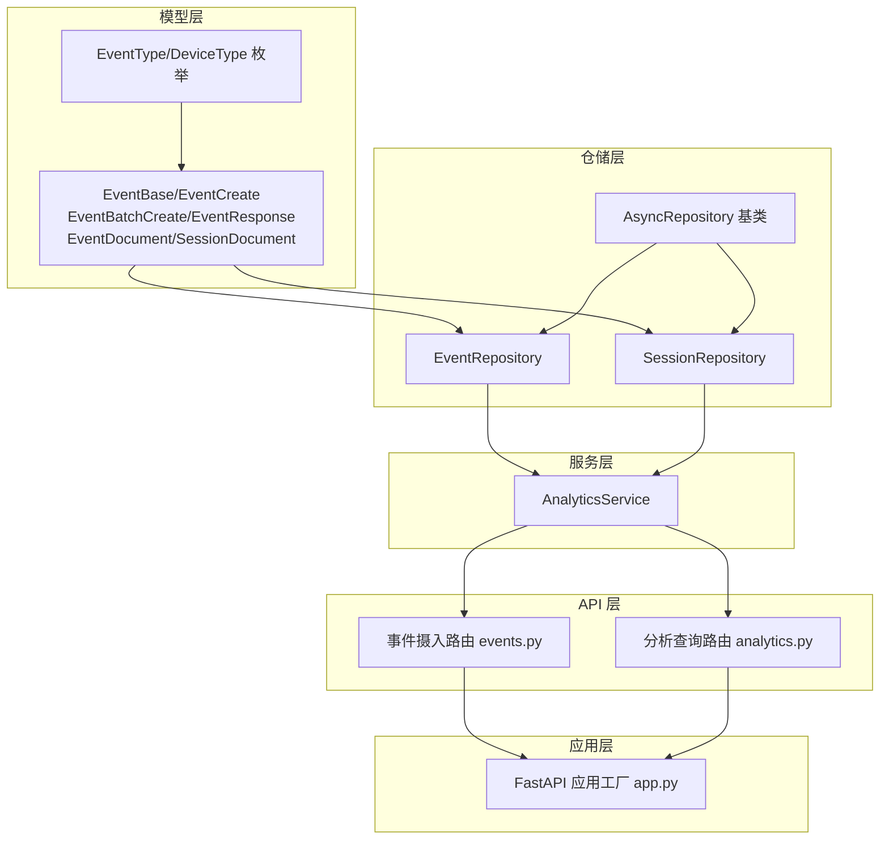
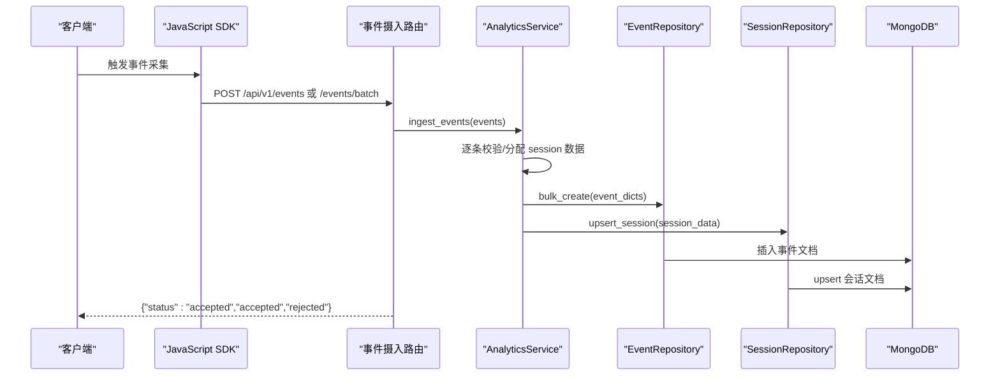
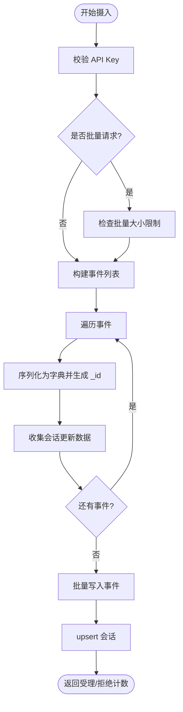
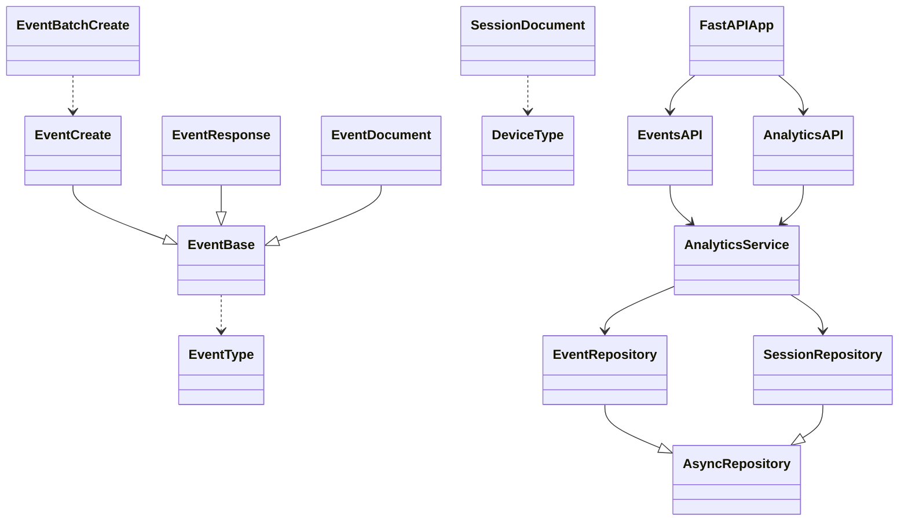

# 事件追踪系统

<cite>
**本文引用的文件**
- [event.py](file://src/taolib/testing/analytics/models/event.py)
- [enums.py](file://src/taolib/testing/analytics/models/enums.py)
- [event_repo.py](file://src/taolib/testing/analytics/repository/event_repo.py)
- [session_repo.py](file://src/taolib/testing/analytics/repository/session_repo.py)
- [analytics_service.py](file://src/taolib/testing/analytics/services/analytics_service.py)
- [events.py](file://src/taolib/testing/analytics/server/api/events.py)
- [analytics.py](file://src/taolib/testing/analytics/server/api/analytics.py)
- [app.py](file://src/taolib/testing/analytics/server/app.py)
- [repository.py](file://src/taolib/testing/_base/repository.py)
- [test_models.py](file://tests/testing/test_analytics/test_models.py)
</cite>

## 目录
1. [简介](#简介)
2. [项目结构](#项目结构)
3. [核心组件](#核心组件)
4. [架构总览](#架构总览)
5. [详细组件分析](#详细组件分析)
6. [依赖关系分析](#依赖关系分析)
7. [性能考量](#性能考量)
8. [故障排查指南](#故障排查指南)
9. [结论](#结论)
10. [附录](#附录)

## 简介
本文件为事件追踪系统的完整技术文档，聚焦于事件模型设计、事件类型与数据结构、事件收集与存储、事件验证规则、批量处理、去重与路由机制，并提供最佳实践、性能优化策略与错误处理机制。系统采用 FastAPI + Motor 异步 MongoDB 访问，提供事件摄入与分析查询 API，支持概览统计、转化漏斗、功能使用排名、导航路径、停留时间与流失分析等能力。

## 项目结构
事件追踪子系统位于 analytics 模块内，主要由以下层次组成：
- 模型层：事件与会话的 Pydantic 模型，定义字段、类型与约束
- 仓储层：基于 AsyncRepository 的事件与会话数据访问
- 服务层：事件摄入与分析聚合的业务逻辑
- API 层：FastAPI 路由，提供事件摄入与分析查询接口
- 应用层：FastAPI 应用工厂，负责生命周期与索引初始化

图表来源
- [event.py:17-105](file://src/taolib/testing/analytics/models/event.py#L17-L105)
- [enums.py:9-31](file://src/taolib/testing/analytics/models/enums.py#L9-L31)
- [event_repo.py:16-469](file://src/taolib/testing/analytics/repository/event_repo.py#L16-L469)
- [session_repo.py:15-197](file://src/taolib/testing/analytics/repository/session_repo.py#L15-L197)
- [repository.py:15-131](file://src/taolib/testing/_base/repository.py#L15-L131)
- [analytics_service.py:16-271](file://src/taolib/testing/analytics/services/analytics_service.py#L16-L271)
- [events.py:11-63](file://src/taolib/testing/analytics/server/api/events.py#L11-L63)
- [analytics.py:28-343](file://src/taolib/testing/analytics/server/api/analytics.py#L28-L343)
- [app.py:19-96](file://src/taolib/testing/analytics/server/app.py#L19-L96)

章节来源
- [event.py:1-105](file://src/taolib/testing/analytics/models/event.py#L1-L105)
- [enums.py:1-31](file://src/taolib/testing/analytics/models/enums.py#L1-L31)
- [event_repo.py:1-469](file://src/taolib/testing/analytics/repository/event_repo.py#L1-L469)
- [session_repo.py:1-197](file://src/taolib/testing/analytics/repository/session_repo.py#L1-L197)
- [repository.py:1-131](file://src/taolib/testing/_base/repository.py#L1-L131)
- [analytics_service.py:1-271](file://src/taolib/testing/analytics/services/analytics_service.py#L1-L271)
- [events.py:1-63](file://src/taolib/testing/analytics/server/api/events.py#L1-L63)
- [analytics.py:1-343](file://src/taolib/testing/analytics/server/api/analytics.py#L1-L343)
- [app.py:1-243](file://src/taolib/testing/analytics/server/app.py#L1-L243)

## 核心组件
- 事件模型四层结构：Base → Create/BatchCreate → Response → Document
- 会话聚合模型：SessionDocument
- 事件类型与设备类型枚举
- 事件与会话仓储：批量写入、聚合分析、索引管理
- 分析服务：事件摄入、会话聚合、分析查询
- API 路由：事件摄入与分析查询接口
- 应用工厂：MongoDB 连接、索引创建、生命周期管理

章节来源
- [event.py:17-105](file://src/taolib/testing/analytics/models/event.py#L17-L105)
- [enums.py:9-31](file://src/taolib/testing/analytics/models/enums.py#L9-L31)
- [event_repo.py:16-469](file://src/taolib/testing/analytics/repository/event_repo.py#L16-L469)
- [session_repo.py:15-197](file://src/taolib/testing/analytics/repository/session_repo.py#L15-L197)
- [analytics_service.py:16-271](file://src/taolib/testing/analytics/services/analytics_service.py#L16-L271)
- [events.py:11-63](file://src/taolib/testing/analytics/server/api/events.py#L11-L63)
- [analytics.py:28-343](file://src/taolib/testing/analytics/server/api/analytics.py#L28-L343)
- [app.py:19-96](file://src/taolib/testing/analytics/server/app.py#L19-L96)

## 架构总览
事件从客户端经 SDK 上报到 API，服务层进行摄入与会话聚合，仓储层持久化至 MongoDB，分析查询通过聚合管道完成。

图表来源
- [events.py:38-61](file://src/taolib/testing/analytics/server/api/events.py#L38-L61)
- [analytics_service.py:33-101](file://src/taolib/testing/analytics/services/analytics_service.py#L33-L101)
- [event_repo.py:23-35](file://src/taolib/testing/analytics/repository/event_repo.py#L23-L35)
- [session_repo.py:22-79](file://src/taolib/testing/analytics/repository/session_repo.py#L22-L79)

章节来源
- [events.py:1-63](file://src/taolib/testing/analytics/server/api/events.py#L1-L63)
- [analytics_service.py:1-271](file://src/taolib/testing/analytics/services/analytics_service.py#L1-L271)
- [event_repo.py:1-469](file://src/taolib/testing/analytics/repository/event_repo.py#L1-L469)
- [session_repo.py:1-197](file://src/taolib/testing/analytics/repository/session_repo.py#L1-L197)

## 详细组件分析

### 事件模型设计与数据结构
- EventBase：定义事件基础字段，含事件类型、应用标识、会话 ID、用户 ID、时间戳、页面 URL/标题、来源页、设备类型、UA、屏幕尺寸、扩展元数据等
- EventCreate：事件摄入输入模型，继承自 EventBase
- EventBatchCreate：批量摄入输入模型，包含事件数组（长度 1..1000）
- EventResponse：API 响应模型，字段别名为 _id
- EventDocument：MongoDB 文档模型，支持 populate_by_name，提供 to_response 转换
- SessionDocument：会话聚合模型，包含会话起止时间、时长、页面数、事件数、入口/出口页、访问页面列表等

字段约束与类型要点
- 字符串字段多带长度约束（如 app_id、session_id 的最小长度）
- 时间字段默认使用 UTC 时区
- 设备类型与事件类型来自枚举
- 元数据为字典型扩展字段

章节来源
- [event.py:17-105](file://src/taolib/testing/analytics/models/event.py#L17-L105)
- [enums.py:9-31](file://src/taolib/testing/analytics/models/enums.py#L9-L31)

### 事件类型枚举与验证规则
- 事件类型枚举：页面浏览、点击、功能使用、会话开始/结束、导航、区域停留、自定义
- 设备类型枚举：桌面、移动、平板、未知
- 验证规则：字段必填、长度限制、默认值、时区强制、元数据字典

章节来源
- [enums.py:9-31](file://src/taolib/testing/analytics/models/enums.py#L9-L31)
- [test_models.py:19-108](file://tests/testing/test_analytics/test_models.py#L19-L108)

### 事件收集机制与摄入流程
- 单事件摄入：events.py 中的 POST /api/v1/events，校验 API Key 后调用服务层摄入
- 批量摄入：POST /api/v1/events/batch，校验批量大小上限后摄入
- 服务层摄入：逐条校验，生成文档 ID，收集会话更新数据，批量写入事件，最后 upsert 会话

图表来源
- [events.py:38-61](file://src/taolib/testing/analytics/server/api/events.py#L38-L61)
- [analytics_service.py:33-101](file://src/taolib/testing/analytics/services/analytics_service.py#L33-L101)

章节来源
- [events.py:1-63](file://src/taolib/testing/analytics/server/api/events.py#L1-L63)
- [analytics_service.py:1-271](file://src/taolib/testing/analytics/services/analytics_service.py#L1-L271)

### 事件存储结构与索引策略
- 事件集合索引：
  - app_id + timestamp（降序）：按应用与时间范围查询
  - app_id + event_type：按应用与事件类型过滤
  - session_id + timestamp（升序）：按会话重建事件序列
  - app_id + event_type + metadata.feature_name（稀疏）：功能使用聚合
  - timestamp + TTL（默认 90 天）：自动清理
- 会话集合索引：
  - app_id + started_at（降序）
  - app_id + user_id（稀疏）
  - started_at + TTL（默认 180 天）

章节来源
- [event_repo.py:443-467](file://src/taolib/testing/analytics/repository/event_repo.py#L443-L467)
- [session_repo.py:179-194](file://src/taolib/testing/analytics/repository/session_repo.py#L179-L194)
- [app.py:28-49](file://src/taolib/testing/analytics/server/app.py#L28-L49)

### 事件验证与约束
- 模型层：Pydantic 字段约束（必填、长度、类型、默认值、时区）
- API 层：批量大小限制、API Key 校验
- 服务层：逐条异常捕获，保证摄入过程健壮性

章节来源
- [event.py:17-105](file://src/taolib/testing/analytics/models/event.py#L17-L105)
- [events.py:11-61](file://src/taolib/testing/analytics/server/api/events.py#L11-L61)
- [analytics_service.py:33-101](file://src/taolib/testing/analytics/services/analytics_service.py#L33-L101)

### 事件批量处理、去重与路由
- 批量处理：EventBatchCreate.events 最大长度 1000；AnalyticsService 批量写入事件
- 去重策略：
  - 转化漏斗与流失分析：按 session_id 去重计数
  - 功能使用排名：按 metadata.feature_name 与 category 分组，unique_users 使用集合去重
  - 导航路径：按 session_id 排序后对相邻页面对计数
- 路由与聚合：
  - 概览统计：总事件数、唯一会话与用户、热门页面、事件类型分布
  - 转化漏斗：计算每步完成人数与转化率
  - 导航路径：生成页面对流，统计频次
  - 停留分析：按 section_id 计算平均停留毫秒数
  - 流失分析：计算每步进入/完成/流失率

章节来源
- [event_repo.py:93-467](file://src/taolib/testing/analytics/repository/event_repo.py#L93-L467)
- [analytics_service.py:103-271](file://src/taolib/testing/analytics/services/analytics_service.py#L103-L271)

### 核心模型字段定义与约束
- EventBase/EventCreate
  - event_type: EventType（必填）
  - app_id: str（必填，长度 1..100）
  - session_id: str（必填，长度 ≥1）
  - user_id: str | None
  - timestamp: datetime（默认 UTC）
  - page_url: str（必填）
  - page_title: str（默认空字符串）
  - referrer: str | None
  - device_type: DeviceType（默认 UNKNOWN）
  - user_agent: str | None
  - screen_width/screen_height: int | None
  - metadata: dict[str, Any]（默认空字典）
- EventBatchCreate
  - events: list[EventCreate]（必填，长度 1..1000）
- EventResponse/EventDocument
  - id: str（别名 _id）
- SessionDocument
  - id/app_id/user_id/device_type/started_at/ended_at/duration_seconds/page_count/event_count/entry_page/exit_page/pages_visited

章节来源
- [event.py:17-105](file://src/taolib/testing/analytics/models/event.py#L17-L105)
- [enums.py:9-31](file://src/taolib/testing/analytics/models/enums.py#L9-L31)

### 事件摄入 API 与分析查询 API
- 事件摄入
  - POST /api/v1/events：单事件摄入
  - POST /api/v1/events/batch：批量摄入（受 max_batch_size 限制）
- 分析查询
  - GET /api/v1/analytics/overview：概览统计（默认最近 7 天）
  - GET /api/v1/analytics/funnel：转化漏斗（steps 逗号分隔）
  - GET /api/v1/analytics/features：功能使用排名（limit 1..100）
  - GET /api/v1/analytics/paths：导航路径（limit 1..200）
  - GET /api/v1/analytics/retention：停留时间
  - GET /api/v1/analytics/drop-off：流失分析（steps 逗号分隔）

章节来源
- [events.py:1-63](file://src/taolib/testing/analytics/server/api/events.py#L1-L63)
- [analytics.py:28-343](file://src/taolib/testing/analytics/server/api/analytics.py#L28-L343)

## 依赖关系分析
- 模型依赖：Event* 模型依赖 EventType/DeviceType 枚举
- 仓储依赖：EventRepository/SessionRepository 继承 AsyncRepository，依赖 Motor 集合
- 服务依赖：AnalyticsService 依赖两个 Repository
- API 依赖：路由依赖服务层，服务层依赖仓储层
- 应用依赖：app.py 负责连接 MongoDB 并创建索引

图表来源
- [event.py:17-105](file://src/taolib/testing/analytics/models/event.py#L17-L105)
- [enums.py:9-31](file://src/taolib/testing/analytics/models/enums.py#L9-L31)
- [repository.py:15-131](file://src/taolib/testing/_base/repository.py#L15-L131)
- [event_repo.py:16-469](file://src/taolib/testing/analytics/repository/event_repo.py#L16-L469)
- [session_repo.py:15-197](file://src/taolib/testing/analytics/repository/session_repo.py#L15-L197)
- [analytics_service.py:16-271](file://src/taolib/testing/analytics/services/analytics_service.py#L16-L271)
- [events.py:1-63](file://src/taolib/testing/analytics/server/api/events.py#L1-L63)
- [analytics.py:1-343](file://src/taolib/testing/analytics/server/api/analytics.py#L1-L343)
- [app.py:1-243](file://src/taolib/testing/analytics/server/app.py#L1-L243)

章节来源
- [event.py:1-105](file://src/taolib/testing/analytics/models/event.py#L1-L105)
- [enums.py:1-31](file://src/taolib/testing/analytics/models/enums.py#L1-L31)
- [repository.py:1-131](file://src/taolib/testing/_base/repository.py#L1-L131)
- [event_repo.py:1-469](file://src/taolib/testing/analytics/repository/event_repo.py#L1-L469)
- [session_repo.py:1-197](file://src/taolib/testing/analytics/repository/session_repo.py#L1-L197)
- [analytics_service.py:1-271](file://src/taolib/testing/analytics/services/analytics_service.py#L1-L271)
- [events.py:1-63](file://src/taolib/testing/analytics/server/api/events.py#L1-L63)
- [analytics.py:1-343](file://src/taolib/testing/analytics/server/api/analytics.py#L1-L343)
- [app.py:1-243](file://src/taolib/testing/analytics/server/app.py#L1-L243)

## 性能考量
- 批量写入：EventRepository.bulk_create 使用 insert_many，减少网络往返
- 索引优化：针对高频查询建立复合索引，聚合查询使用稀疏索引避免全表扫描
- TTL 清理：事件与会话集合设置过期时间，降低存储压力
- 聚合管道：使用 $addToSet/$group/$project/$sort/$limit 控制内存与 CPU 开销
- 会话 upsert：使用 $set/$setOnInsert/$inc/$addToSet 原子更新，减少多次往返
- 默认时间范围：分析查询默认最近 7 天，避免超大数据集扫描

章节来源
- [event_repo.py:23-35](file://src/taolib/testing/analytics/repository/event_repo.py#L23-L35)
- [event_repo.py:443-467](file://src/taolib/testing/analytics/repository/event_repo.py#L443-L467)
- [session_repo.py:179-194](file://src/taolib/testing/analytics/repository/session_repo.py#L179-L194)
- [analytics.py:28-41](file://src/taolib/testing/analytics/server/api/analytics.py#L28-L41)

## 故障排查指南
- API Key 错误：校验失败返回 401，检查请求头 X-API-Key
- 批量大小超限：超过 max_batch_size 返回 400
- 模型校验失败：字段缺失或类型不符触发 Pydantic 验证错误
- 会话 upsert 异常：MongoDB 写入异常或并发冲突，检查集合权限与索引
- 聚合结果为空：确认时间范围、app_id、事件类型匹配，检查索引是否存在

章节来源
- [events.py:11-61](file://src/taolib/testing/analytics/server/api/events.py#L11-L61)
- [analytics_service.py:33-101](file://src/taolib/testing/analytics/services/analytics_service.py#L33-L101)
- [session_repo.py:22-79](file://src/taolib/testing/analytics/repository/session_repo.py#L22-L79)

## 结论
该事件追踪系统通过清晰的模型分层、完善的索引策略与聚合分析能力，提供了从事件摄入到多维度分析的完整链路。其设计兼顾了易用性与性能，适合在高并发场景下稳定运行。建议在生产环境中结合监控与日志，持续评估索引命中率与聚合性能，并根据业务需求调整 TTL 与聚合上限。

## 附录

### 集成指南（客户端）
- 引入 SDK：通过 /sdk/analytics.js 提供前端 SDK
- 发送事件：调用 /api/v1/events 或 /api/v1/events/batch，携带 X-API-Key
- 配置项：max_batch_size、api_keys、mongo_url、mongo_db、event_ttl_days、session_ttl_days、cors_origins

章节来源
- [app.py:65-96](file://src/taolib/testing/analytics/server/app.py#L65-L96)
- [events.py:11-61](file://src/taolib/testing/analytics/server/api/events.py#L11-L61)

### 最佳实践
- 事件类型命名规范：使用 EventType 枚举值，避免自定义字符串
- 元数据组织：metadata 中统一键名，便于聚合与查询
- 批量大小控制：合理设置 max_batch_size，避免单次过大导致超时
- 时间范围：分析查询尽量限定时间范围，提升响应速度
- 索引维护：定期评估索引使用情况，按需新增或调整

章节来源
- [enums.py:9-31](file://src/taolib/testing/analytics/models/enums.py#L9-L31)
- [analytics.py:28-41](file://src/taolib/testing/analytics/server/api/analytics.py#L28-L41)
- [app.py:28-49](file://src/taolib/testing/analytics/server/app.py#L28-L49)