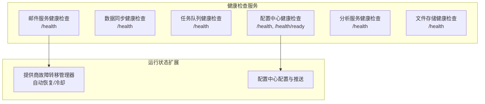
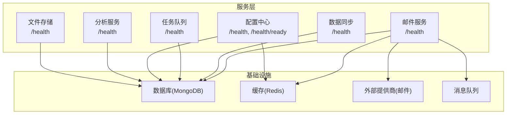
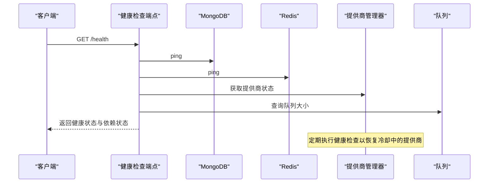
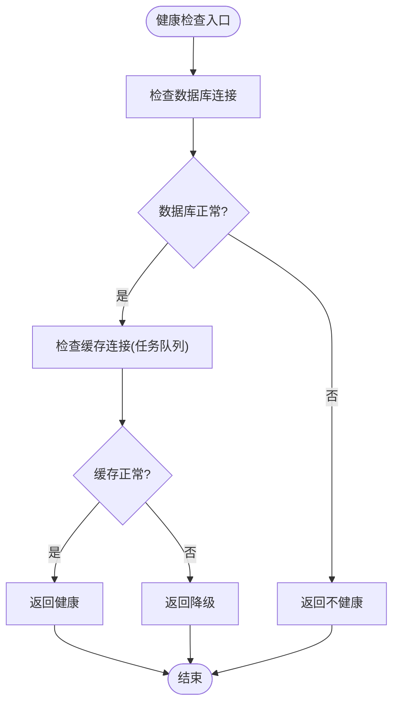
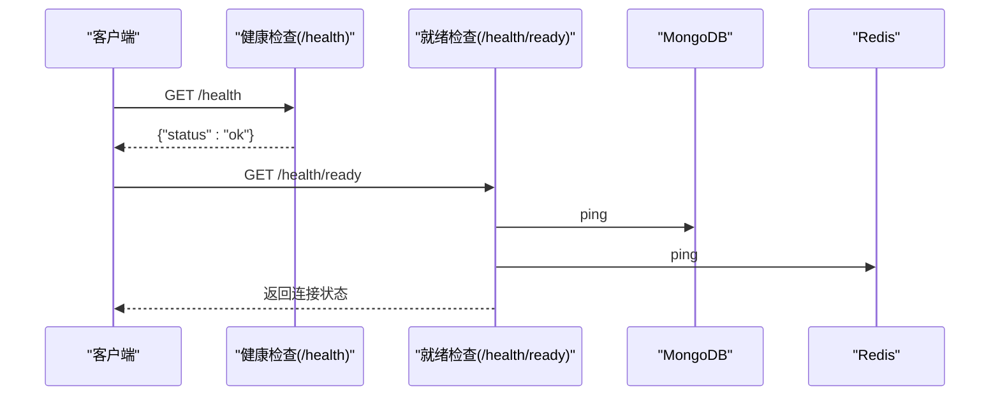
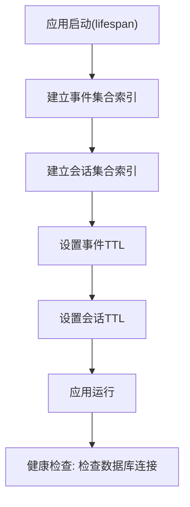
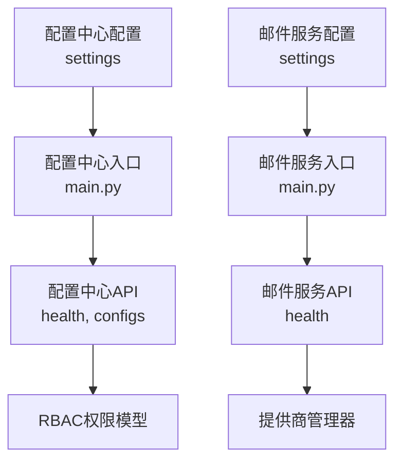
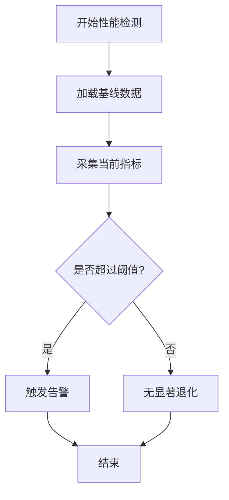

# 健康监控

<cite>
**本文引用的文件**
- [src/taolib/testing/email_service/server/api/health.py](file://src/taolib/testing/email_service/server/api/health.py)
- [src/taolib/testing/email_service/providers/failover.py](file://src/taolib/testing/email_service/providers/failover.py)
- [src/taolib/testing/email_service/errors.py](file://src/taolib/testing/email_service/errors.py)
- [src/taolib/testing/data_sync/server/api/health.py](file://src/taolib/testing/data_sync/server/api/health.py)
- [src/taolib/testing/task_queue/server/api/health.py](file://src/taolib/testing/task_queue/server/api/health.py)
- [src/taolib/testing/config_center/server/api/health.py](file://src/taolib/testing/config_center/server/api/health.py)
- [src/taolib/testing/analytics/server/api/health.py](file://src/taolib/testing/analytics/server/api/health.py)
- [src/taolib/testing/file_storage/server/api/health.py](file://src/taolib/testing/file_storage/server/api/health.py)
- [src/taolib/testing/config_center/server/config.py](file://src/taolib/testing/config_center/server/config.py)
- [src/taolib/testing/email_service/server/config.py](file://src/taolib/testing/email_service/server/config.py)
- [src/taolib/testing/analytics/server/app.py](file://src/taolib/testing/analytics/server/app.py)
- [src/taolib/testing/config_center/server/main.py](file://src/taolib/testing/config_center/server/main.py)
- [src/taolib/testing/email_service/server/main.py](file://src/taolib/testing/email_service/server/main.py)
- [tests/testing/perf_remote_bench.py](file://tests/testing/perf_remote_bench.py)
- [doc/scripts/build_metrics.json](file://doc/scripts/build_metrics.json)
- [src/taolib/testing/config_center/server/api/configs.py](file://src/taolib/testing/config_center/server/api/configs.py)
- [src/taolib/testing/config_center/services/config_service.py](file://src/taolib/testing/config_center/services/config_service.py)
- [src/taolib/testing/config_center/server/auth/rbac.py](file://src/taolib/testing/config_center/server/auth/rbac.py)
- [src/taolib/testing/analytics/repository/event_repo.py](file://src/taolib/testing/analytics/repository/event_repo.py)
- [src/taolib/testing/analytics/repository/session_repo.py](file://src/taolib/testing/analytics/repository/session_repo.py)
</cite>

## 目录
1. [简介](#简介)
2. [项目结构](#项目结构)
3. [核心组件](#核心组件)
4. [架构总览](#架构总览)
5. [详细组件分析](#详细组件分析)
6. [依赖分析](#依赖分析)
7. [性能考虑](#性能考虑)
8. [故障排查指南](#故障排查指南)
9. [结论](#结论)
10. [附录](#附录)

## 简介
本技术文档围绕健康监控系统展开，聚焦以下目标：
- 系统状态监控的实现机制与健康检查API
- 健康检查端点的HTTP接口、响应格式与错误码定义
- 性能指标采集、异常检测与自动恢复机制
- 监控数据的存储策略、历史趋势分析与可视化集成
- 告警配置、通知机制与故障排查流程
- 完整的部署配置与运维指南

健康监控体系由多个子服务共同组成，包括配置中心、邮件服务、数据同步、任务队列、分析服务与文件存储等。每个服务均提供健康检查端点，并在必要时提供更丰富的运行状态信息（如数据库、缓存、外部提供商与队列状态）。

## 项目结构
健康监控相关代码主要分布在以下模块中：
- 各服务的健康检查API：email_service、data_sync、task_queue、config_center、analytics、file_storage
- 邮件服务的故障转移与健康状态管理
- 配置中心与邮件服务的配置与启动入口
- 分析服务的生命周期与索引建立
- 性能基准与构建指标（用于性能回归检测）

**图表来源**
- [src/taolib/testing/email_service/server/api/health.py:1-56](file://src/taolib/testing/email_service/server/api/health.py#L1-L56)
- [src/taolib/testing/data_sync/server/api/health.py:1-31](file://src/taolib/testing/data_sync/server/api/health.py#L1-L31)
- [src/taolib/testing/task_queue/server/api/health.py:1-46](file://src/taolib/testing/task_queue/server/api/health.py#L1-L46)
- [src/taolib/testing/config_center/server/api/health.py:1-54](file://src/taolib/testing/config_center/server/api/health.py#L1-L54)
- [src/taolib/testing/analytics/server/api/health.py:1-22](file://src/taolib/testing/analytics/server/api/health.py#L1-L22)
- [src/taolib/testing/file_storage/server/api/health.py:1-13](file://src/taolib/testing/file_storage/server/api/health.py#L1-L13)
- [src/taolib/testing/email_service/providers/failover.py:1-175](file://src/taolib/testing/email_service/providers/failover.py#L1-L175)
- [src/taolib/testing/config_center/server/api/configs.py:35-339](file://src/taolib/testing/config_center/server/api/configs.py#L35-L339)

**章节来源**
- [src/taolib/testing/email_service/server/api/health.py:1-56](file://src/taolib/testing/email_service/server/api/health.py#L1-L56)
- [src/taolib/testing/data_sync/server/api/health.py:1-31](file://src/taolib/testing/data_sync/server/api/health.py#L1-L31)
- [src/taolib/testing/task_queue/server/api/health.py:1-46](file://src/taolib/testing/task_queue/server/api/health.py#L1-L46)
- [src/taolib/testing/config_center/server/api/health.py:1-54](file://src/taolib/testing/config_center/server/api/health.py#L1-L54)
- [src/taolib/testing/analytics/server/api/health.py:1-22](file://src/taolib/testing/analytics/server/api/health.py#L1-L22)
- [src/taolib/testing/file_storage/server/api/health.py:1-13](file://src/taolib/testing/file_storage/server/api/health.py#L1-L13)

## 核心组件
- 健康检查API：各服务在各自路由中提供健康检查端点，返回系统整体健康状态与关键依赖（数据库、缓存、外部提供商、队列等）的状态信息。
- 故障转移与健康恢复：邮件服务提供商管理器实现简化的电路断路器逻辑，对失败的提供商进行冷却与恢复探测。
- 配置中心与推送：配置中心提供健康检查、就绪检查与配置发布后的实时推送能力，支撑告警与变更通知。
- 分析服务生命周期：分析服务在启动时建立索引并设置TTL，保障历史数据清理与查询性能。
- 性能与构建指标：测试脚本与构建指标JSON用于性能回归检测与构建大小监控。

**章节来源**
- [src/taolib/testing/email_service/providers/failover.py:1-175](file://src/taolib/testing/email_service/providers/failover.py#L1-L175)
- [src/taolib/testing/config_center/server/api/health.py:1-54](file://src/taolib/testing/config_center/server/api/health.py#L1-L54)
- [src/taolib/testing/analytics/server/app.py:1-96](file://src/taolib/testing/analytics/server/app.py#L1-L96)
- [tests/testing/perf_remote_bench.py:605-716](file://tests/testing/perf_remote_bench.py#L605-L716)
- [doc/scripts/build_metrics.json:1-14](file://doc/scripts/build_metrics.json#L1-L14)

## 架构总览
健康监控系统采用多服务协作架构，每个服务独立提供健康检查端点，并在需要时暴露更详细的运行状态。配置中心负责配置与推送，邮件服务负责邮件发送与提供商健康状态管理，分析服务负责用户行为数据的采集与可视化，其他服务提供各自领域的健康检查能力。

**图表来源**
- [src/taolib/testing/email_service/server/api/health.py:1-56](file://src/taolib/testing/email_service/server/api/health.py#L1-L56)
- [src/taolib/testing/data_sync/server/api/health.py:1-31](file://src/taolib/testing/data_sync/server/api/health.py#L1-L31)
- [src/taolib/testing/task_queue/server/api/health.py:1-46](file://src/taolib/testing/task_queue/server/api/health.py#L1-L46)
- [src/taolib/testing/config_center/server/api/health.py:1-54](file://src/taolib/testing/config_center/server/api/health.py#L1-L54)
- [src/taolib/testing/analytics/server/api/health.py:1-22](file://src/taolib/testing/analytics/server/api/health.py#L1-L22)
- [src/taolib/testing/file_storage/server/api/health.py:1-13](file://src/taolib/testing/file_storage/server/api/health.py#L1-L13)

## 详细组件分析

### 邮件服务健康检查与故障转移
- 健康检查端点返回系统总体状态、数据库与缓存连接状态，以及提供商健康状态列表与队列大小。
- 故障转移管理器实现简化的电路断路器逻辑：连续失败达到阈值后进入冷却期；冷却结束后定期尝试健康检查以恢复服务。
- 异常类型涵盖提供商错误、队列错误、模板错误等，便于统一处理与告警。

**图表来源**
- [src/taolib/testing/email_service/server/api/health.py:1-56](file://src/taolib/testing/email_service/server/api/health.py#L1-L56)
- [src/taolib/testing/email_service/providers/failover.py:139-175](file://src/taolib/testing/email_service/providers/failover.py#L139-L175)

**章节来源**
- [src/taolib/testing/email_service/server/api/health.py:1-56](file://src/taolib/testing/email_service/server/api/health.py#L1-L56)
- [src/taolib/testing/email_service/providers/failover.py:1-175](file://src/taolib/testing/email_service/providers/failover.py#L1-L175)
- [src/taolib/testing/email_service/errors.py:1-65](file://src/taolib/testing/email_service/errors.py#L1-L65)

### 数据同步与任务队列健康检查
- 数据同步与任务队列均提供健康检查端点，前者检查数据库连接，后者检查数据库与缓存连接，并根据依赖状态计算整体健康状态。
- 任务队列健康检查端点还提供Pydantic模型定义响应格式，确保前后端一致性。

**图表来源**
- [src/taolib/testing/data_sync/server/api/health.py:1-31](file://src/taolib/testing/data_sync/server/api/health.py#L1-L31)
- [src/taolib/testing/task_queue/server/api/health.py:1-46](file://src/taolib/testing/task_queue/server/api/health.py#L1-L46)

**章节来源**
- [src/taolib/testing/data_sync/server/api/health.py:1-31](file://src/taolib/testing/data_sync/server/api/health.py#L1-L31)
- [src/taolib/testing/task_queue/server/api/health.py:1-46](file://src/taolib/testing/task_queue/server/api/health.py#L1-L46)

### 配置中心健康检查与就绪检查
- 健康检查端点返回系统“ok”，就绪检查端点检查数据库与缓存连接，并在连接失败时返回错误状态。
- 配置中心提供配置发布后的事件推送，可用于告警与通知。

**图表来源**
- [src/taolib/testing/config_center/server/api/health.py:1-54](file://src/taolib/testing/config_center/server/api/health.py#L1-L54)

**章节来源**
- [src/taolib/testing/config_center/server/api/health.py:1-54](file://src/taolib/testing/config_center/server/api/health.py#L1-L54)

### 分析服务健康检查与数据生命周期
- 分析服务在启动时建立索引并设置TTL，保障历史数据清理与查询性能。
- 健康检查端点检查数据库连接，确保服务可用性。

**图表来源**
- [src/taolib/testing/analytics/server/app.py:19-56](file://src/taolib/testing/analytics/server/app.py#L19-L56)
- [src/taolib/testing/analytics/server/api/health.py:1-22](file://src/taolib/testing/analytics/server/api/health.py#L1-L22)

**章节来源**
- [src/taolib/testing/analytics/server/app.py:1-96](file://src/taolib/testing/analytics/server/app.py#L1-L96)
- [src/taolib/testing/analytics/server/api/health.py:1-22](file://src/taolib/testing/analytics/server/api/health.py#L1-L22)

### 文件存储健康检查
- 文件存储服务提供简单健康检查端点，返回系统“ok”。

**章节来源**
- [src/taolib/testing/file_storage/server/api/health.py:1-13](file://src/taolib/testing/file_storage/server/api/health.py#L1-L13)

## 依赖分析
- 配置中心与邮件服务均通过环境变量加载配置，支持主机、端口、数据库、缓存与推送等参数。
- 配置中心提供RBAC权限模型，支持配置的读写、发布、回滚等操作。
- 分析服务在启动时建立索引与TTL，保障历史数据清理与查询性能。

**图表来源**
- [src/taolib/testing/config_center/server/config.py:1-72](file://src/taolib/testing/config_center/server/config.py#L1-L72)
- [src/taolib/testing/email_service/server/config.py:1-63](file://src/taolib/testing/email_service/server/config.py#L1-L63)
- [src/taolib/testing/config_center/server/main.py:1-48](file://src/taolib/testing/config_center/server/main.py#L1-L48)
- [src/taolib/testing/email_service/server/main.py:1-35](file://src/taolib/testing/email_service/server/main.py#L1-L35)
- [src/taolib/testing/config_center/server/api/configs.py:35-339](file://src/taolib/testing/config_center/server/api/configs.py#L35-L339)
- [src/taolib/testing/config_center/server/auth/rbac.py:39-75](file://src/taolib/testing/config_center/server/auth/rbac.py#L39-L75)
- [src/taolib/testing/email_service/providers/failover.py:1-175](file://src/taolib/testing/email_service/providers/failover.py#L1-L175)

**章节来源**
- [src/taolib/testing/config_center/server/config.py:1-72](file://src/taolib/testing/config_center/server/config.py#L1-L72)
- [src/taolib/testing/email_service/server/config.py:1-63](file://src/taolib/testing/email_service/server/config.py#L1-L63)
- [src/taolib/testing/config_center/server/main.py:1-48](file://src/taolib/testing/config_center/server/main.py#L1-L48)
- [src/taolib/testing/email_service/server/main.py:1-35](file://src/taolib/testing/email_service/server/main.py#L1-L35)
- [src/taolib/testing/config_center/server/api/configs.py:35-339](file://src/taolib/testing/config_center/server/api/configs.py#L35-L339)
- [src/taolib/testing/config_center/server/auth/rbac.py:39-75](file://src/taolib/testing/config_center/server/auth/rbac.py#L39-L75)
- [src/taolib/testing/email_service/providers/failover.py:1-175](file://src/taolib/testing/email_service/providers/failover.py#L1-L175)

## 性能考虑
- 性能回归检测：测试脚本支持与基线对比，当指标变化超过阈值时触发告警。
- 构建指标监控：构建指标JSON记录基线、阈值与历史变化，便于持续监控。
- 分析服务索引与TTL：通过合理的索引与TTL设置，保障查询性能与存储空间。

**图表来源**
- [tests/testing/perf_remote_bench.py:605-716](file://tests/testing/perf_remote_bench.py#L605-L716)
- [doc/scripts/build_metrics.json:1-14](file://doc/scripts/build_metrics.json#L1-L14)

**章节来源**
- [tests/testing/perf_remote_bench.py:605-716](file://tests/testing/perf_remote_bench.py#L605-L716)
- [doc/scripts/build_metrics.json:1-14](file://doc/scripts/build_metrics.json#L1-L14)

## 故障排查指南
- 健康检查端点返回状态字段，结合依赖状态（数据库、缓存、提供商、队列）定位问题。
- 邮件服务提供商冷却与恢复：检查提供商连续失败次数与冷却时间，确认健康检查是否成功恢复。
- 配置中心就绪检查：若返回错误，检查数据库与缓存连接字符串与网络连通性。
- 分析服务索引与TTL：若查询缓慢或存储占用过高，检查索引创建与TTL设置是否生效。
- 日志与异常：根据异常类型（提供商错误、队列错误、模板错误等）进行针对性排查。

**章节来源**
- [src/taolib/testing/email_service/server/api/health.py:1-56](file://src/taolib/testing/email_service/server/api/health.py#L1-L56)
- [src/taolib/testing/email_service/providers/failover.py:139-175](file://src/taolib/testing/email_service/providers/failover.py#L139-L175)
- [src/taolib/testing/config_center/server/api/health.py:31-54](file://src/taolib/testing/config_center/server/api/health.py#L31-L54)
- [src/taolib/testing/analytics/server/app.py:24-56](file://src/taolib/testing/analytics/server/app.py#L24-L56)
- [src/taolib/testing/email_service/errors.py:1-65](file://src/taolib/testing/email_service/errors.py#L1-L65)

## 结论
健康监控系统通过多服务协作，实现了对数据库、缓存、外部提供商与队列的全面健康检查，并在邮件服务中引入了简化的故障转移与自动恢复机制。配置中心提供了配置发布与推送能力，支持告警与通知场景。分析服务在启动阶段完成索引与TTL设置，保障性能与存储效率。配合性能回归检测与构建指标监控，系统具备持续改进与稳定运行的能力。

## 附录

### 健康检查端点与响应格式
- 邮件服务健康检查
  - 端点：GET /health
  - 响应字段：status（ok/degraded）、database（True/False）、redis（True/False）、providers（提供商状态数组）、queue（队列大小）
  - 参考：[src/taolib/testing/email_service/server/api/health.py:1-56](file://src/taolib/testing/email_service/server/api/health.py#L1-L56)

- 数据同步健康检查
  - 端点：GET /health
  - 响应字段：status（healthy/unhealthy）、database（connected/disconnected）
  - 参考：[src/taolib/testing/data_sync/server/api/health.py:1-31](file://src/taolib/testing/data_sync/server/api/health.py#L1-L31)

- 任务队列健康检查
  - 端点：GET /health
  - 响应模型：HealthResponse（status、database、redis）
  - 参考：[src/taolib/testing/task_queue/server/api/health.py:1-46](file://src/taolib/testing/task_queue/server/api/health.py#L1-L46)

- 配置中心健康检查
  - 端点：GET /health、GET /health/ready
  - 响应字段：/health 返回 {"status":"ok"}；/health/ready 返回数据库与缓存连接状态
  - 参考：[src/taolib/testing/config_center/server/api/health.py:21-54](file://src/taolib/testing/config_center/server/api/health.py#L21-L54)

- 分析服务健康检查
  - 端点：GET /health
  - 响应字段：status（healthy/unhealthy）、database（connected/disconnected）
  - 参考：[src/taolib/testing/analytics/server/api/health.py:1-22](file://src/taolib/testing/analytics/server/api/health.py#L1-L22)

- 文件存储健康检查
  - 端点：GET /health
  - 响应字段：status（ok）
  - 参考：[src/taolib/testing/file_storage/server/api/health.py:1-13](file://src/taolib/testing/file_storage/server/api/health.py#L1-L13)

### 错误码定义
- 健康检查端点通常返回标准HTTP状态码：
  - 200：健康或就绪
  - 500：依赖检查失败（数据库/缓存/提供商/队列）
- 配置中心与邮件服务的业务错误通过异常类型区分，便于统一处理与告警：
  - ProviderError、AllProvidersFailedError、QueueError、TemplateNotFoundError 等
  - 参考：[src/taolib/testing/email_service/errors.py:1-65](file://src/taolib/testing/email_service/errors.py#L1-L65)

### 监控数据存储与可视化
- 分析服务在启动时建立索引与TTL，保障历史数据清理与查询性能：
  - 事件集合索引与TTL
  - 会话集合索引与TTL
  - 参考：[src/taolib/testing/analytics/server/app.py:24-56](file://src/taolib/testing/analytics/server/app.py#L24-L56)
- 事件与会话聚合查询支持历史趋势分析：
  - 事件类型分布、功能使用统计、页面导航路径、区域停留时间、漏斗与流失分析
  - 参考：[src/taolib/testing/analytics/repository/event_repo.py:162-468](file://src/taolib/testing/analytics/repository/event_repo.py#L162-L468)、[src/taolib/testing/analytics/repository/session_repo.py:156-196](file://src/taolib/testing/analytics/repository/session_repo.py#L156-L196)
- 仪表板集成：前端通过API拉取数据并渲染图表，支持定时刷新与交互式分析
  - 参考：[src/taolib/testing/analytics/server/app.py:90-243](file://src/taolib/testing/analytics/server/app.py#L90-L243)

### 告警配置与通知机制
- 配置中心：配置发布后通过事件推送至客户端，可用于告警与通知
  - 参考：[src/taolib/testing/config_center/server/api/configs.py:35-339](file://src/taolib/testing/config_center/server/api/configs.py#L35-L339)
- 邮件服务：提供商健康状态与失败计数可用于触发告警
  - 参考：[src/taolib/testing/email_service/providers/failover.py:1-175](file://src/taolib/testing/email_service/providers/failover.py#L1-L175)
- 权限模型：RBAC权限模型支持最小权限原则与审计
  - 参考：[src/taolib/testing/config_center/server/auth/rbac.py:39-75](file://src/taolib/testing/config_center/server/auth/rbac.py#L39-L75)

### 部署配置与运维指南
- 配置中心
  - 环境变量前缀：CONFIG_CENTER_
  - 关键配置：MongoDB连接、Redis连接、JWT密钥、服务器监听地址与端口、CORS源、推送心跳与ACK超时等
  - 启动方式：CLI入口支持主机、端口、自动重载与日志级别参数
  - 参考：[src/taolib/testing/config_center/server/config.py:1-72](file://src/taolib/testing/config_center/server/config.py#L1-L72)、[src/taolib/testing/config_center/server/main.py:1-48](file://src/taolib/testing/config_center/server/main.py#L1-L48)
- 邮件服务
  - 环境变量前缀：EMAIL_SERVICE_
  - 关键配置：MongoDB/Redis连接、默认发件人、提供商密钥（SendGrid/Mailgun/AWS SES/SMTP）、队列轮询间隔与批大小、最大重试次数等
  - 启动方式：CLI入口支持主机、端口、自动重载与日志级别参数
  - 参考：[src/taolib/testing/email_service/server/config.py:1-63](file://src/taolib/testing/email_service/server/config.py#L1-L63)、[src/taolib/testing/email_service/server/main.py:1-35](file://src/taolib/testing/email_service/server/main.py#L1-L35)