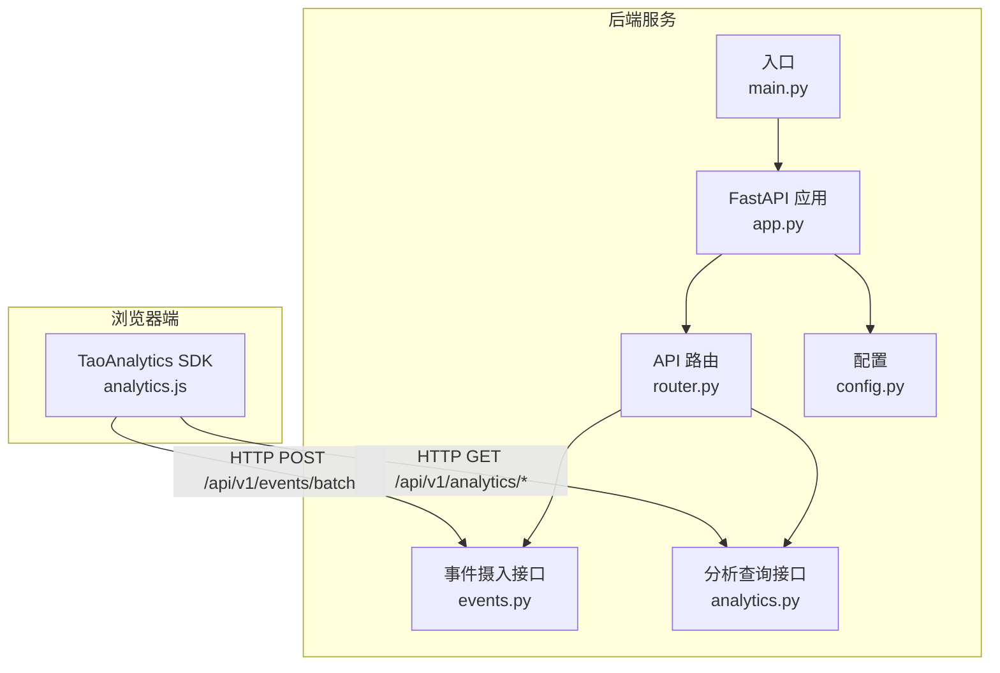
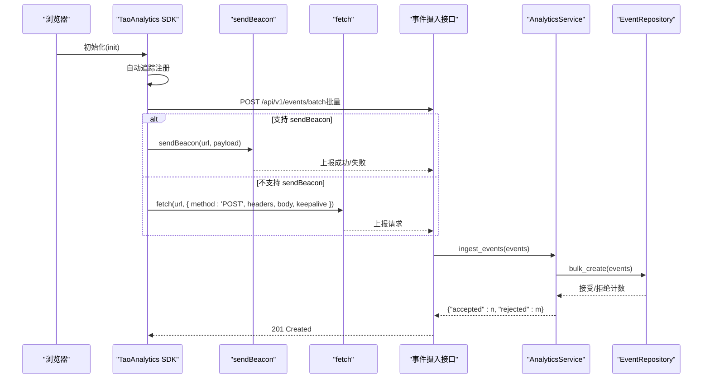
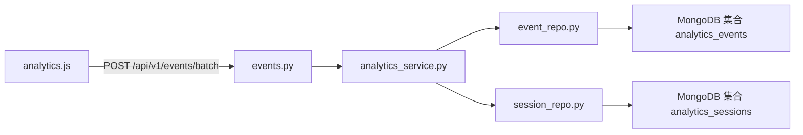

# 前端SDK

<cite>
**本文引用的文件**
- [analytics.js](file://src/taolib/testing/analytics/sdk/analytics.js)
- [event.py](file://src/taolib/testing/analytics/models/event.py)
- [enums.py](file://src/taolib/testing/analytics/models/enums.py)
- [types.py](file://src/taolib/testing/analytics/events/types.py)
- [event_repo.py](file://src/taolib/testing/analytics/repository/event_repo.py)
- [analytics_service.py](file://src/taolib/testing/analytics/services/analytics_service.py)
- [analytics.py](file://src/taolib/testing/analytics/server/api/analytics.py)
- [events.py](file://src/taolib/testing/analytics/server/api/events.py)
- [router.py](file://src/taolib/testing/analytics/server/api/router.py)
- [app.py](file://src/taolib/testing/analytics/server/app.py)
- [config.py](file://src/taolib/testing/analytics/server/config.py)
- [main.py](file://src/taolib/testing/analytics/server/main.py)
- [errors.py](file://src/taolib/testing/analytics/errors.py)
- [README.md](file://README.md)
</cite>

## 目录
1. [简介](#简介)
2. [项目结构](#项目结构)
3. [核心组件](#核心组件)
4. [架构总览](#架构总览)
5. [详细组件分析](#详细组件分析)
6. [依赖关系分析](#依赖关系分析)
7. [性能考量](#性能考量)
8. [故障排除指南](#故障排除指南)
9. [结论](#结论)
10. [附录](#附录)

## 简介
本文件为前端 JavaScript SDK 的全面使用文档，聚焦于 TaoAnalytics SDK 的初始化配置、事件追踪 API、数据发送机制与自动追踪能力。文档同时覆盖 SDK 与后端 API 的通信协议、数据格式、错误处理策略，并给出浏览器兼容性、性能优化与隐私保护的最佳实践，以及完整的集成示例、调试工具与故障排除指南。

SDK 名称：TaoAnalytics  
版本：0.1.0  
SDK 文件：analytics.js  
后端服务：FastAPI 分析服务（事件摄入与分析查询）

## 项目结构
该分析系统采用前后端分离设计：
- 前端：浏览器端 JavaScript SDK（analytics.js），负责采集与上报事件
- 后端：FastAPI 应用，提供事件摄入接口与分析查询接口，并内置一个简单的可视化仪表板

图表来源
- [app.py:82-95](file://src/taolib/testing/analytics/server/app.py#L82-L95)
- [router.py:7-12](file://src/taolib/testing/analytics/server/api/router.py#L7-L12)
- [events.py:38-61](file://src/taolib/testing/analytics/server/api/events.py#L38-L61)
- [analytics.py:54-104](file://src/taolib/testing/analytics/server/api/analytics.py#L54-L104)

章节来源
- [app.py:65-95](file://src/taolib/testing/analytics/server/app.py#L65-L95)
- [router.py:1-15](file://src/taolib/testing/analytics/server/api/router.py#L1-L15)
- [README.md:68-80](file://README.md#L68-L80)

## 核心组件
- SDK 初始化与配置
  - 支持参数：apiUrl、appId、apiKey（可选）、flushInterval（可选）、batchSize（可选）
  - 初始化后自动开启：页面浏览、点击、区域停留、会话、导航等自动追踪
- 事件追踪 API
  - track(eventType, metadata)：自定义事件
  - trackFeature(featureName, category)：功能使用事件
  - identify(userId)：绑定用户 ID
  - flush()：强制上报队列
- 数据发送机制
  - 队列缓冲与批处理（默认批次大小）
  - 定时上报（默认周期）
  - 优先使用 navigator.sendBeacon，回退到 fetch
  - 支持 X-API-Key 请求头（当配置了 apiKey）

章节来源
- [analytics.js:376-402](file://src/taolib/testing/analytics/sdk/analytics.js#L376-L402)
- [analytics.js:409-444](file://src/taolib/testing/analytics/sdk/analytics.js#L409-L444)
- [analytics.js:141-174](file://src/taolib/testing/analytics/sdk/analytics.js#L141-L174)

## 架构总览
SDK 与后端的交互遵循如下协议：
- 事件摄入：POST /api/v1/events/batch（批量），或 POST /api/v1/events（单个）
- 分析查询：GET /api/v1/analytics/*（概览、漏斗、功能排名、导航路径、停留分析、流失分析）
- 认证：可选 API Key（X-API-Key），未配置时跳过校验
- 数据格式：JSON；事件体包含事件数组（批量）或单个事件对象

图表来源
- [analytics.js:155-174](file://src/taolib/testing/analytics/sdk/analytics.js#L155-L174)
- [events.py:38-61](file://src/taolib/testing/analytics/server/api/events.py#L38-L61)
- [analytics_service.py:33-101](file://src/taolib/testing/analytics/services/analytics_service.py#L33-L101)
- [event_repo.py:23-35](file://src/taolib/testing/analytics/repository/event_repo.py#L23-L35)

## 详细组件分析

### SDK 初始化与配置
- 必需参数
  - apiUrl：后端服务根地址（末尾斜杠会被移除）
  - appId：应用标识
- 可选参数
  - apiKey：API Key（用于鉴权）
  - flushInterval：定时上报间隔（毫秒，默认 5000）
  - batchSize：批量大小（默认 20）
- 初始化后的行为
  - 生成或复用会话 ID（localStorage）
  - 注册自动追踪：页面浏览、点击、区域停留、会话生命周期、导航
  - 启动定时器周期性 flush

章节来源
- [analytics.js:376-402](file://src/taolib/testing/analytics/sdk/analytics.js#L376-L402)
- [analytics.js:86-107](file://src/taolib/testing/analytics/sdk/analytics.js#L86-L107)
- [analytics.js:393-401](file://src/taolib/testing/analytics/sdk/analytics.js#L393-L401)

### 自动追踪功能
- 页面浏览（page_view）
  - patch history.pushState/replaceState 与 popstate
  - 初始页面加载即触发一次
- 点击追踪（click）
  - 优先识别 data-track-feature 的元素，上报 feature_use
  - 否则识别交互元素（a/button/input/role=button/onclick），上报 click
  - 采集元素选择器、文本、坐标等元数据
- 区域停留（time_on_section）
  - IntersectionObserver 监听带 data-track-section 的元素
  - 动态新增节点通过 MutationObserver 观察
  - 停留超过 500ms 才上报
- 会话事件（session_start/session_end）
  - 页面可见性变化 hidden 时上报 session_end 并 flush
  - beforeunload 时同样上报
- 导航追踪（navigation）
  - 监听 history.pushState/replaceState 与 popstate
  - 上报 from_page/to_page

章节来源
- [analytics.js:178-202](file://src/taolib/testing/analytics/sdk/analytics.js#L178-L202)
- [analytics.js:206-248](file://src/taolib/testing/analytics/sdk/analytics.js#L206-L248)
- [analytics.js:252-300](file://src/taolib/testing/analytics/sdk/analytics.js#L252-L300)
- [analytics.js:304-335](file://src/taolib/testing/analytics/sdk/analytics.js#L304-L335)
- [analytics.js:339-367](file://src/taolib/testing/analytics/sdk/analytics.js#L339-L367)

### 手动追踪与自定义事件
- track(eventType, metadata)
  - 构造基础事件并入队
- trackFeature(featureName, category)
  - 快速上报功能使用事件（feature_use）
- identify(userId)
  - 将用户 ID 写入 localStorage，后续事件携带 user_id
- flush()
  - 强制清空队列并上报

章节来源
- [analytics.js:409-444](file://src/taolib/testing/analytics/sdk/analytics.js#L409-L444)
- [analytics.js:122-139](file://src/taolib/testing/analytics/sdk/analytics.js#L122-L139)

### 数据发送机制与可靠性
- 队列与批处理
  - 队列长度达到 batchSize 即 flush
  - 定时器周期性 flush（默认 5000ms）
- 发送优先级
  - navigator.sendBeacon 优先（适合 unload 场景）
  - 回退至 fetch（keepalive）
- 请求头
  - Content-Type: application/json
  - 若配置 apiKey，则附加 X-API-Key
- 错误处理
  - sendBeacon 失败时回退 fetch
  - fetch 抛错静默处理（不阻塞主线程）

章节来源
- [analytics.js:141-174](file://src/taolib/testing/analytics/sdk/analytics.js#L141-L174)
- [analytics.js:388-389](file://src/taolib/testing/analytics/sdk/analytics.js#L388-L389)

### 事件数据模型与后端协议
- 前端事件结构（基础字段）
  - event_type、app_id、session_id、user_id（可选）
  - timestamp、page_url、page_title、referrer
  - device_type、user_agent、screen_width、screen_height
  - metadata（扩展字段）
- 批量摄入接口
  - POST /api/v1/events/batch
  - 请求体：{ events: [EventCreate, ...] }
  - 响应：{ status: "accepted", accepted, rejected }
- 单事件摄入接口
  - POST /api/v1/events
  - 请求体：EventCreate
  - 响应：{ status: "accepted", accepted, rejected }

章节来源
- [analytics.js:122-139](file://src/taolib/testing/analytics/sdk/analytics.js#L122-L139)
- [events.py:38-61](file://src/taolib/testing/analytics/server/api/events.py#L38-L61)
- [event.py:17-48](file://src/taolib/testing/analytics/models/event.py#L17-L48)

### 后端分析查询接口
- 概览统计：GET /api/v1/analytics/overview
- 转化漏斗：GET /api/v1/analytics/funnel?steps=...
- 功能使用排名：GET /api/v1/analytics/features?limit=...
- 用户导航路径：GET /api/v1/analytics/paths?limit=...
- 停留分析：GET /api/v1/analytics/retention
- 流失分析：GET /api/v1/analytics/drop-off?steps=...

章节来源
- [analytics.py:54-104](file://src/taolib/testing/analytics/server/api/analytics.py#L54-L104)
- [analytics.py:156-167](file://src/taolib/testing/analytics/server/api/analytics.py#L156-L167)
- [analytics.py:199-209](file://src/taolib/testing/analytics/server/api/analytics.py#L199-L209)
- [analytics.py:243-253](file://src/taolib/testing/analytics/server/api/analytics.py#L243-L253)
- [analytics.py:283-292](file://src/taolib/testing/analytics/server/api/analytics.py#L283-L292)
- [analytics.py:329-340](file://src/taolib/testing/analytics/server/api/analytics.py#L329-L340)

### 会话与聚合模型
- 事件模型（Pydantic）
  - EventBase：基础字段
  - EventCreate：创建输入
  - EventResponse/EventDocument：响应与文档映射
- 会话聚合模型
  - SessionDocument：聚合会话统计字段（入口/出口页、时长、事件数等）

章节来源
- [event.py:17-83](file://src/taolib/testing/analytics/models/event.py#L17-L83)
- [event.py:86-105](file://src/taolib/testing/analytics/models/event.py#L86-L105)

### 事件摄入与聚合服务
- AnalyticsService
  - ingest_events：批量摄入、会话更新、返回接受/拒绝计数
  - 聚合分析：概览、漏斗、功能排名、导航路径、停留、流失
- EventRepository
  - bulk_create、find_by_session/find_by_app
  - 聚合管道：漏斗、功能使用、导航路径、停留、流失、概览统计
- SessionRepository（在服务中注入，用于会话 Upsert）

章节来源
- [analytics_service.py:16-101](file://src/taolib/testing/analytics/services/analytics_service.py#L16-L101)
- [event_repo.py:16-469](file://src/taolib/testing/analytics/repository/event_repo.py#L16-L469)

### SDK 与后端的通信协议
- SDK 发送
  - URL：/api/v1/events/batch
  - 方法：POST
  - 头部：Content-Type: application/json；可选 X-API-Key
  - 负载：JSON.stringify({ events: [...] })
- 后端接收
  - 校验 API Key（可选）
  - 调用 AnalyticsService.ingest_events
  - 返回 { status, accepted, rejected }

章节来源
- [analytics.js:153-174](file://src/taolib/testing/analytics/sdk/analytics.js#L153-L174)
- [events.py:11-25](file://src/taolib/testing/analytics/server/api/events.py#L11-L25)
- [events.py:38-61](file://src/taolib/testing/analytics/server/api/events.py#L38-L61)

## 依赖关系分析
- SDK 依赖
  - 浏览器特性：crypto.randomUUID、navigator.sendBeacon、IntersectionObserver、MutationObserver、localStorage
- 后端依赖
  - FastAPI、Motor（异步 MongoDB）、CORS、Uvicorn
  - 配置：MongoDB 连接、API Key、TTL、批量大小、CORS 源

图表来源
- [analytics.js:153-174](file://src/taolib/testing/analytics/sdk/analytics.js#L153-L174)
- [events.py:27-35](file://src/taolib/testing/analytics/server/api/events.py#L27-L35)
- [analytics_service.py:19-31](file://src/taolib/testing/analytics/services/analytics_service.py#L19-L31)
- [event_repo.py:19-21](file://src/taolib/testing/analytics/repository/event_repo.py#L19-L21)

章节来源
- [config.py:20-44](file://src/taolib/testing/analytics/server/config.py#L20-L44)
- [app.py:19-56](file://src/taolib/testing/analytics/server/app.py#L19-L56)

## 性能考量
- 事件批处理
  - 默认批次大小：20；可通过初始化参数调整
  - 达到批次阈值立即上报，避免队列积压
- 定时上报
  - 默认周期：5000ms；可根据网络状况调优
- 发送可靠性
  - 优先 sendBeacon，适合页面卸载场景
  - fetch 回退并使用 keepalive，提升成功率
- 资源观察
  - IntersectionObserver 仅在可用时启用
  - MutationObserver 仅对动态新增节点生效，减少不必要的遍历
- 存储与会话
  - localStorage 读写失败静默忽略，不影响主流程
  - 会话超时：30 分钟；超时后重新生成 session_id

章节来源
- [analytics.js:32-33](file://src/taolib/testing/analytics/sdk/analytics.js#L32-L33)
- [analytics.js:141-174](file://src/taolib/testing/analytics/sdk/analytics.js#L141-L174)
- [analytics.js:252-300](file://src/taolib/testing/analytics/sdk/analytics.js#L252-L300)
- [analytics.js:86-107](file://src/taolib/testing/analytics/sdk/analytics.js#L86-L107)

## 故障排除指南
- SDK 未初始化
  - 现象：track/trackFeature/identify 调用无效果
  - 排查：确认 init 已被调用且参数正确
- 缺少 apiUrl 或 appId
  - 现象：控制台报错并终止初始化
  - 排查：检查初始化参数
- API Key 认证失败
  - 现象：事件摄入 401 Unauthorized
  - 排查：核对 X-API-Key 是否与后端配置一致
- 批量大小超限
  - 现象：事件摄入 400 Bad Request
  - 排查：检查单次批量数量是否超过后端 max_batch_size
- sendBeacon 失败
  - 现象：上报未达预期
  - 排查：检查网络状态与跨域配置；确认 fetch 回退路径正常
- 会话/区域停留未上报
  - 现象：session_start/session_end 或 time_on_section 未出现
  - 排查：确认浏览器支持相关 API；检查 data-track-* 属性是否正确

章节来源
- [analytics.js:376-380](file://src/taolib/testing/analytics/sdk/analytics.js#L376-L380)
- [events.py:11-25](file://src/taolib/testing/analytics/server/api/events.py#L11-L25)
- [events.py:52-56](file://src/taolib/testing/analytics/server/api/events.py#L52-L56)
- [errors.py:7-23](file://src/taolib/testing/analytics/errors.py#L7-L23)

## 结论
TaoAnalytics SDK 提供轻量、可靠、易用的前端事件采集方案，具备完善的自动追踪能力与灵活的手动追踪接口。配合后端 FastAPI 服务，可快速搭建从事件采集到分析可视化的闭环。通过合理配置批处理与上报周期、启用 API Key 认证与合适的存储策略，可在保证性能的同时满足隐私与合规要求。

## 附录

### 集成示例（步骤说明）
- 引入 SDK
  - 通过后端提供的静态资源路径获取 SDK：/sdk/analytics.js
- 初始化
  - 调用 init(options)，传入 apiUrl、appId（可选 apiKey）
- 自动追踪
  - 在页面中添加 data-track-feature、data-track-section 等属性即可启用自动追踪
- 手动追踪
  - track('custom', { key: 'value' })
  - trackFeature('feature-name', 'category')
  - identify('user-123')
- 强制上报
  - flush()

章节来源
- [app.py:84-88](file://src/taolib/testing/analytics/server/app.py#L84-L88)
- [analytics.js:7-23](file://src/taolib/testing/analytics/sdk/analytics.js#L7-L23)
- [analytics.js:376-402](file://src/taolib/testing/analytics/sdk/analytics.js#L376-L402)

### 调试工具与最佳实践
- 调试
  - 控制台输出：初始化失败、未初始化警告、API Key 错误
  - 仪表板：/dashboard（内置简单可视化界面）
- 最佳实践
  - 合理设置 flushInterval 与 batchSize，平衡实时性与带宽
  - 对关键功能使用 trackFeature，便于后续聚合分析
  - 启用 API Key 并限制 CORS 源，降低滥用风险
  - 使用 data-track-* 属性进行细粒度追踪，避免过度采集

章节来源
- [app.py:90-94](file://src/taolib/testing/analytics/server/app.py#L90-L94)
- [analytics.js:376-380](file://src/taolib/testing/analytics/sdk/analytics.js#L376-L380)
- [config.py:31-37](file://src/taolib/testing/analytics/server/config.py#L31-L37)