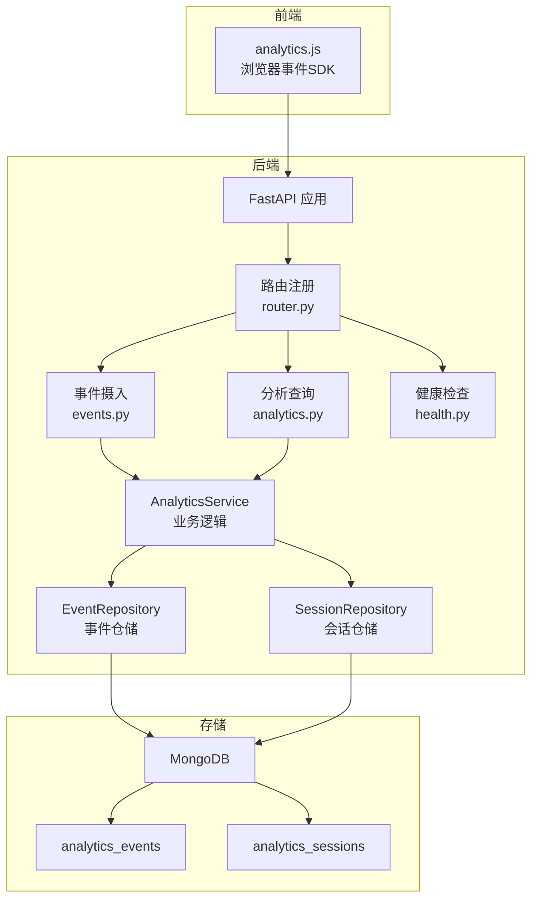
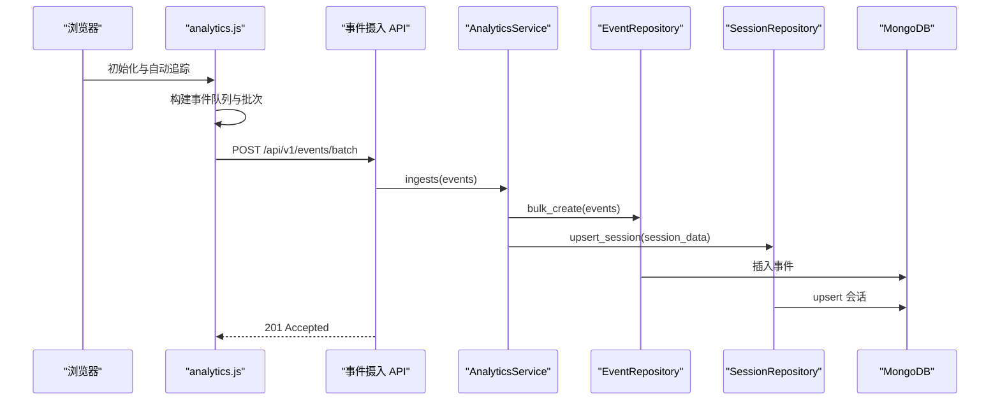
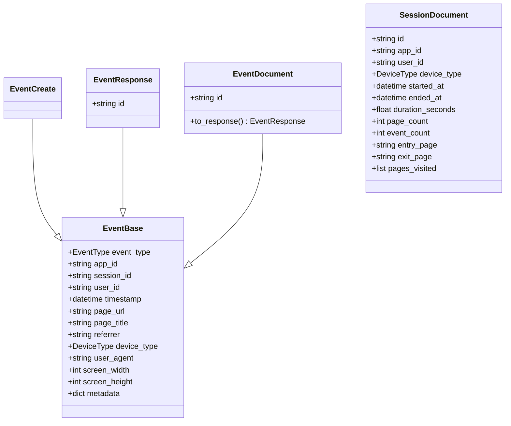
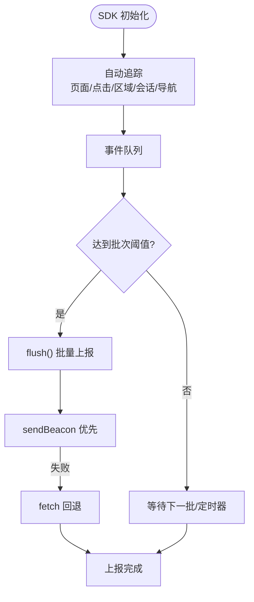
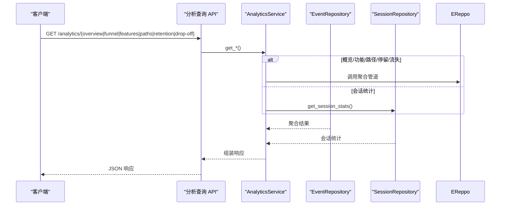
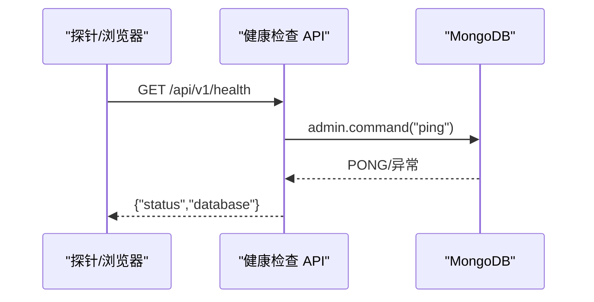
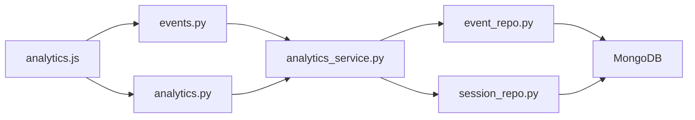

# 数据分析平台

<cite>
**本文引用的文件**
- [analytics.js](file://src/taolib/testing/analytics/sdk/analytics.js)
- [event.py](file://src/taolib/testing/analytics/models/event.py)
- [enums.py](file://src/taolib/testing/analytics/models/enums.py)
- [event_repo.py](file://src/taolib/testing/analytics/repository/event_repo.py)
- [session_repo.py](file://src/taolib/testing/analytics/repository/session_repo.py)
- [analytics_service.py](file://src/taolib/testing/analytics/services/analytics_service.py)
- [analytics.py](file://src/taolib/testing/analytics/server/api/analytics.py)
- [events.py](file://src/taolib/testing/analytics/server/api/events.py)
- [health.py](file://src/taolib/testing/analytics/server/api/health.py)
- [router.py](file://src/taolib/testing/analytics/server/api/router.py)
- [app.py](file://src/taolib/testing/analytics/server/app.py)
- [config.py](file://src/taolib/testing/analytics/server/config.py)
- [types.py](file://src/taolib/testing/analytics/events/types.py)
- [errors.py](file://src/taolib/testing/analytics/errors.py)
</cite>

## 目录
1. [简介](#简介)
2. [项目结构](#项目结构)
3. [核心组件](#核心组件)
4. [架构总览](#架构总览)
5. [详细组件分析](#详细组件分析)
6. [依赖分析](#依赖分析)
7. [性能考虑](#性能考虑)
8. [故障排查指南](#故障排查指南)
9. [结论](#结论)
10. [附录](#附录)

## 简介
本项目是一个轻量级数据分析平台，围绕“事件追踪—数据收集—统计分析—健康监控”的闭环设计，提供前端 JavaScript SDK、后端 FastAPI 服务、MongoDB 存储与聚合分析能力。平台支持自动追踪（页面浏览、点击、区域停留）、手动追踪、会话聚合、漏斗分析、功能使用排行、用户导航路径、区域停留时间与流失点分析，并内置健康检查与可视化仪表板。

## 项目结构
- 前端 SDK：位于 analytics/sdk/analytics.js，提供浏览器端事件采集、自动追踪与批量上报。
- 后端服务：FastAPI 应用，包含事件摄入、分析查询与健康检查路由。
- 数据模型：Pydantic 模型定义事件与会话结构，含基础、创建、响应、文档四层映射。
- 仓储层：EventRepository 与 SessionRepository 封装 MongoDB 访问与聚合管道。
- 服务层：AnalyticsService 负责事件摄入与各类统计分析的业务逻辑。
- 配置与路由：统一配置、路由注册与仪表板页面。

图表来源
- [app.py:65-95](file://src/taolib/testing/analytics/server/app.py#L65-L95)
- [router.py:7-12](file://src/taolib/testing/analytics/server/api/router.py#L7-L12)
- [events.py:38-61](file://src/taolib/testing/analytics/server/api/events.py#L38-L61)
- [analytics.py:95-104](file://src/taolib/testing/analytics/server/api/analytics.py#L95-L104)
- [health.py:8-20](file://src/taolib/testing/analytics/server/api/health.py#L8-L20)
- [analytics_service.py:16-32](file://src/taolib/testing/analytics/services/analytics_service.py#L16-L32)
- [event_repo.py:16-22](file://src/taolib/testing/analytics/repository/event_repo.py#L16-L22)
- [session_repo.py:15-21](file://src/taolib/testing/analytics/repository/session_repo.py#L15-L21)

章节来源
- [app.py:65-95](file://src/taolib/testing/analytics/server/app.py#L65-L95)
- [router.py:7-12](file://src/taolib/testing/analytics/server/api/router.py#L7-L12)

## 核心组件
- 事件模型与枚举：定义事件类型、设备类型与事件文档结构，支持基础/创建/响应/文档四层映射。
- 事件仓储：提供批量写入、按会话/应用+时间范围查询、漏斗/功能使用/导航路径/停留时间/流失分析等聚合。
- 会话仓储：维护会话聚合信息（开始/结束时间、页面数、事件数、入口/出口页、设备类型），并计算平均时长与跳出率。
- 分析服务：事件摄入与多类统计分析的编排层，负责会话更新与事件入库。
- API 路由：事件摄入（单条/批量）、分析查询（概览/漏斗/功能/路径/停留/流失）、健康检查。
- 前端 SDK：自动追踪页面浏览、点击、区域停留；支持手动追踪与用户标识；批量上报至后端。

章节来源
- [event.py:17-105](file://src/taolib/testing/analytics/models/event.py#L17-L105)
- [enums.py:9-31](file://src/taolib/testing/analytics/models/enums.py#L9-L31)
- [event_repo.py:16-469](file://src/taolib/testing/analytics/repository/event_repo.py#L16-L469)
- [session_repo.py:15-197](file://src/taolib/testing/analytics/repository/session_repo.py#L15-L197)
- [analytics_service.py:16-271](file://src/taolib/testing/analytics/services/analytics_service.py#L16-L271)
- [events.py:38-61](file://src/taolib/testing/analytics/server/api/events.py#L38-L61)
- [analytics.py:95-343](file://src/taolib/testing/analytics/server/api/analytics.py#L95-L343)
- [health.py:8-20](file://src/taolib/testing/analytics/server/api/health.py#L8-L20)
- [analytics.js:24-451](file://src/taolib/testing/analytics/sdk/analytics.js#L24-L451)

## 架构总览
平台采用“前端 SDK + 后端 API + MongoDB”三层架构。前端 SDK 自动采集用户行为并批量上报；后端 API 接收事件并写入 MongoDB；服务层进行会话聚合与统计分析；仓储层封装聚合管道；路由层暴露查询接口与健康检查；配置模块集中管理数据库连接、CORS、认证与保留策略。

图表来源
- [analytics.js:148-174](file://src/taolib/testing/analytics/sdk/analytics.js#L148-L174)
- [events.py:47-61](file://src/taolib/testing/analytics/server/api/events.py#L47-L61)
- [analytics_service.py:33-101](file://src/taolib/testing/analytics/services/analytics_service.py#L33-L101)
- [event_repo.py:23-35](file://src/taolib/testing/analytics/repository/event_repo.py#L23-L35)
- [session_repo.py:22-79](file://src/taolib/testing/analytics/repository/session_repo.py#L22-L79)

## 详细组件分析

### 事件模型设计
- 四层模型映射：Base（基础字段）、Create（创建输入）、Response（API 响应）、Document（MongoDB 文档）。
- 关键字段：事件类型、应用标识、会话 ID、用户 ID、时间戳、页面 URL/标题、来源页、设备类型、UA、屏幕尺寸、扩展元数据。
- 会话聚合模型：包含会话起止时间、时长、页面数、事件数、入口/出口页、访问页面列表等。

图表来源
- [event.py:17-105](file://src/taolib/testing/analytics/models/event.py#L17-L105)

章节来源
- [event.py:17-105](file://src/taolib/testing/analytics/models/event.py#L17-L105)
- [enums.py:9-31](file://src/taolib/testing/analytics/models/enums.py#L9-L31)

### 数据收集机制与存储结构
- 前端 SDK 自动追踪：页面浏览、点击、区域停留、会话开始/结束、页面跳转；支持手动追踪与用户标识。
- 批量上报：默认批次大小与刷新间隔可配置；优先使用 sendBeacon，失败回退 fetch。
- 后端入库：事件批量写入 analytics_events；会话 upsert 写入 analytics_sessions 并计算会话指标。
- 索引策略：按应用+时间、应用+事件类型、会话+时间、功能名等建立索引；事件与会话集合分别设置 TTL。

图表来源
- [analytics.js:148-174](file://src/taolib/testing/analytics/sdk/analytics.js#L148-L174)
- [analytics.js:376-402](file://src/taolib/testing/analytics/sdk/analytics.js#L376-L402)

章节来源
- [analytics.js:24-451](file://src/taolib/testing/analytics/sdk/analytics.js#L24-L451)
- [events.py:38-61](file://src/taolib/testing/analytics/server/api/events.py#L38-L61)
- [event_repo.py:443-467](file://src/taolib/testing/analytics/repository/event_repo.py#L443-L467)
- [session_repo.py:179-194](file://src/taolib/testing/analytics/repository/session_repo.py#L179-L194)

### 统计分析功能
- 概览统计：总事件数、唯一会话数、唯一用户数、热门页面、事件类型分布。
- 转化漏斗：按步骤统计进入/完成/流失率，计算总体转化率。
- 功能使用排行：按功能名与分类统计使用次数与去重用户数。
- 导航路径：统计页面间流转频次（桑基图数据）。
- 停留分析：按区域统计平均停留时长与总浏览次数。
- 流失分析：按流程步骤统计流失人数与流失率。

图表来源
- [analytics.py:95-343](file://src/taolib/testing/analytics/server/api/analytics.py#L95-L343)
- [analytics_service.py:103-271](file://src/taolib/testing/analytics/services/analytics_service.py#L103-L271)
- [event_repo.py:93-469](file://src/taolib/testing/analytics/repository/event_repo.py#L93-L469)
- [session_repo.py:119-197](file://src/taolib/testing/analytics/repository/session_repo.py#L119-L197)

章节来源
- [analytics.py:95-343](file://src/taolib/testing/analytics/server/api/analytics.py#L95-L343)
- [analytics_service.py:103-271](file://src/taolib/testing/analytics/services/analytics_service.py#L103-L271)
- [event_repo.py:93-469](file://src/taolib/testing/analytics/repository/event_repo.py#L93-L469)
- [session_repo.py:119-197](file://src/taolib/testing/analytics/repository/session_repo.py#L119-L197)

### 健康监控机制
- 健康检查：通过 ping 命令检测数据库连通性，返回健康状态与数据库连接状态。
- 仪表板：内置 HTML 仪表板，集成 Chart.js，展示概览指标、漏斗、功能排行、路径、停留与流失分析。
- 配置：支持 CORS、API Key 认证开关、MongoDB 连接、TTL 天数与批量上限等。

图表来源
- [health.py:8-20](file://src/taolib/testing/analytics/server/api/health.py#L8-L20)
- [app.py:19-56](file://src/taolib/testing/analytics/server/app.py#L19-L56)

章节来源
- [health.py:8-20](file://src/taolib/testing/analytics/server/api/health.py#L8-L20)
- [app.py:90-94](file://src/taolib/testing/analytics/server/app.py#L90-L94)
- [config.py:10-51](file://src/taolib/testing/analytics/server/config.py#L10-L51)

### JavaScript SDK 使用方法与事件追踪配置
- 引入与初始化：通过 CDN 引入 SDK，调用初始化函数传入服务端地址、应用标识与可选 API Key。
- 自动追踪：页面浏览、点击、区域停留、会话开始/结束、页面跳转自动采集。
- 手动追踪：track() 上报自定义事件；trackFeature() 上报功能使用；identify() 绑定用户 ID；flush() 强制上报。
- 配置项：支持刷新间隔、批次大小、API Key、服务端地址等。

章节来源
- [analytics.js:24-451](file://src/taolib/testing/analytics/sdk/analytics.js#L24-L451)

### 自定义事件处理与数据聚合策略
- 自定义事件：通过 track() 传入事件类型与元数据，SDK 自动填充基础字段并批量上报。
- 聚合策略：仓储层针对不同分析维度构建聚合管道，如按会话去重、按页面/功能名分组、按时间窗口排序与 zip 组合页面序列等。
- 会话重建：根据会话 ID 与时间顺序重建用户会话，计算页面数与时长，用于会话统计。

章节来源
- [analytics.js:409-441](file://src/taolib/testing/analytics/sdk/analytics.js#L409-L441)
- [event_repo.py:93-469](file://src/taolib/testing/analytics/repository/event_repo.py#L93-L469)
- [session_repo.py:22-79](file://src/taolib/testing/analytics/repository/session_repo.py#L22-L79)

### 前端 SDK 与后端 API 的交互方式与数据传输协议
- 事件摄入：POST /api/v1/events 与 /api/v1/events/batch，请求体为单个事件或事件数组，支持 X-API-Key 头部认证。
- 分析查询：GET /api/v1/analytics/*，支持 app_id、start/end 时间范围与各分析接口特定参数。
- 健康检查：GET /api/v1/health，返回数据库连通性与整体健康状态。
- SDK 传输：sendBeacon 优先，失败回退 fetch，保持 keepalive 以提升可靠性。

章节来源
- [events.py:38-61](file://src/taolib/testing/analytics/server/api/events.py#L38-L61)
- [analytics.py:95-343](file://src/taolib/testing/analytics/server/api/analytics.py#L95-L343)
- [health.py:8-20](file://src/taolib/testing/analytics/server/api/health.py#L8-L20)
- [analytics.js:156-174](file://src/taolib/testing/analytics/sdk/analytics.js#L156-L174)

## 依赖分析
- 组件耦合：服务层依赖仓储层；API 路由依赖服务层；应用工厂负责生命周期与索引创建。
- 外部依赖：FastAPI、Motor（异步 MongoDB）、Pydantic、Chart.js（前端仪表板）。
- 可能的循环依赖：当前模块组织避免了循环导入，路由模块仅导入子模块而不反向依赖。

图表来源
- [router.py:7-12](file://src/taolib/testing/analytics/server/api/router.py#L7-L12)
- [events.py:27-35](file://src/taolib/testing/analytics/server/api/events.py#L27-L35)
- [analytics.py:43-51](file://src/taolib/testing/analytics/server/api/analytics.py#L43-L51)
- [analytics_service.py:19-31](file://src/taolib/testing/analytics/services/analytics_service.py#L19-L31)

章节来源
- [router.py:7-12](file://src/taolib/testing/analytics/server/api/router.py#L7-L12)
- [analytics_service.py:16-32](file://src/taolib/testing/analytics/services/analytics_service.py#L16-L32)

## 性能考虑
- 批量与定时：SDK 默认批次大小与刷新间隔平衡吞吐与延迟；后端批量写入减少网络往返。
- 索引优化：事件集合按应用+时间、应用+事件类型、会话+时间建立复合索引；功能使用聚合对 metadata.feature_name 建稀疏索引。
- TTL 清理：事件与会话集合分别设置 TTL，避免历史数据无限增长。
- 聚合复杂度：聚合管道使用 $group/$match/$sort/$limit 控制输出规模，避免全表扫描。
- 前端可靠性：sendBeacon 优先保证卸载场景下的事件送达。

章节来源
- [analytics.js:31-33](file://src/taolib/testing/analytics/sdk/analytics.js#L31-L33)
- [event_repo.py:443-467](file://src/taolib/testing/analytics/repository/event_repo.py#L443-L467)
- [session_repo.py:179-194](file://src/taolib/testing/analytics/repository/session_repo.py#L179-L194)
- [config.py:40-44](file://src/taolib/testing/analytics/server/config.py#L40-L44)

## 故障排查指南
- 事件未入库：检查 API Key 是否正确配置与传递；确认后端日志与数据库连接；查看 SDK flush 行为与 sendBeacon 回退。
- 聚合结果为空：核对时间范围是否正确、app_id 是否匹配；检查集合索引是否存在；确认事件类型与页面路径是否符合聚合条件。
- 健康检查失败：检查 MongoDB 连接串与网络连通性；确认数据库服务可用。
- 会话统计异常：确认会话字段（开始/结束时间、页面列表）是否正确更新；检查 upsert 逻辑与时长计算。

章节来源
- [errors.py:7-23](file://src/taolib/testing/analytics/errors.py#L7-L23)
- [health.py:11-20](file://src/taolib/testing/analytics/server/api/health.py#L11-L20)
- [analytics_service.py:53-101](file://src/taolib/testing/analytics/services/analytics_service.py#L53-L101)

## 结论
该数据分析平台以简洁的前端 SDK 与后端 API 实现了从事件采集到统计分析的完整链路，结合 MongoDB 聚合与会话重建，提供了漏斗、功能排行、导航路径、停留与流失等关键分析能力。通过健康检查与可视化仪表板，平台具备良好的可观测性与可运维性。建议在生产环境中合理配置 API Key、批量大小与 TTL，并持续监控聚合性能与索引命中率。

## 附录

### API 参考
- 事件摄入
  - POST /api/v1/events：单个事件上报
  - POST /api/v1/events/batch：批量事件上报（受 max_batch_size 限制）
- 分析查询
  - GET /api/v1/analytics/overview：概览统计（app_id、start、end）
  - GET /api/v1/analytics/funnel：转化漏斗（app_id、steps、start、end）
  - GET /api/v1/analytics/features：功能使用排行（app_id、start、end、limit）
  - GET /api/v1/analytics/paths：用户导航路径（app_id、start、end、limit）
  - GET /api/v1/analytics/retention：区域停留时间（app_id、start、end）
  - GET /api/v1/analytics/drop-off：流失点分析（app_id、steps、start、end）
- 健康检查
  - GET /api/v1/health：数据库连通性检查

章节来源
- [events.py:38-61](file://src/taolib/testing/analytics/server/api/events.py#L38-L61)
- [analytics.py:95-343](file://src/taolib/testing/analytics/server/api/analytics.py#L95-L343)
- [health.py:8-20](file://src/taolib/testing/analytics/server/api/health.py#L8-L20)

### 集成示例
- 前端集成：引入 SDK，初始化并配置服务端地址与应用标识；在页面中添加 data-* 属性以启用自动追踪；必要时调用 trackFeature/track/identify/flush。
- 后端集成：启动 FastAPI 应用，确保 MongoDB 连接与索引创建；按需配置 CORS、API Key 与 TTL；通过 /dashboard 查看实时统计。

章节来源
- [analytics.js:376-451](file://src/taolib/testing/analytics/sdk/analytics.js#L376-L451)
- [app.py:65-95](file://src/taolib/testing/analytics/server/app.py#L65-L95)
- [config.py:10-51](file://src/taolib/testing/analytics/server/config.py#L10-L51)