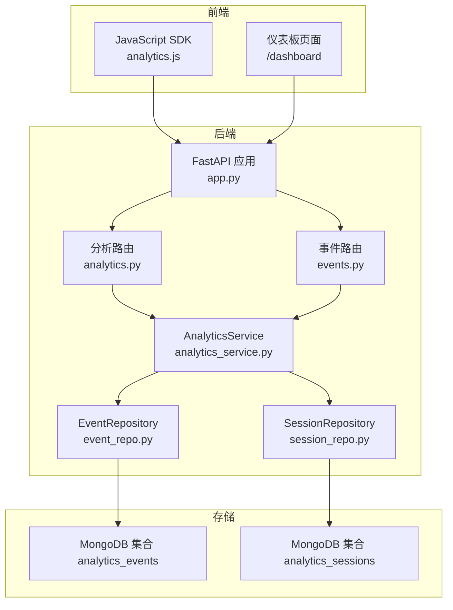
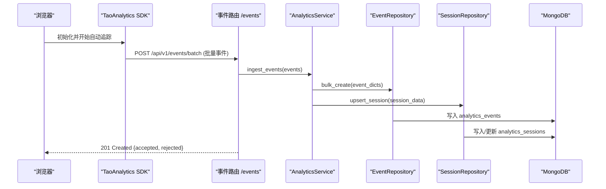
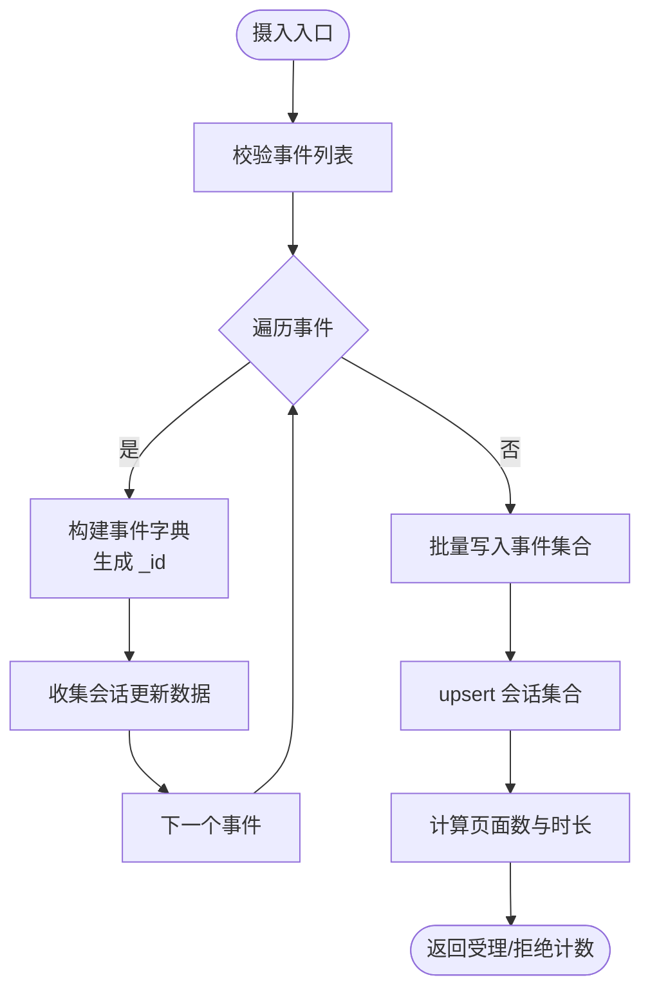
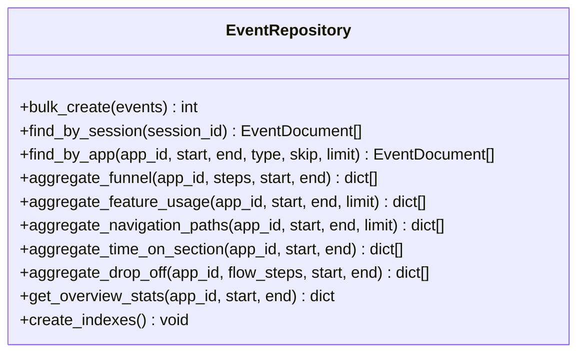
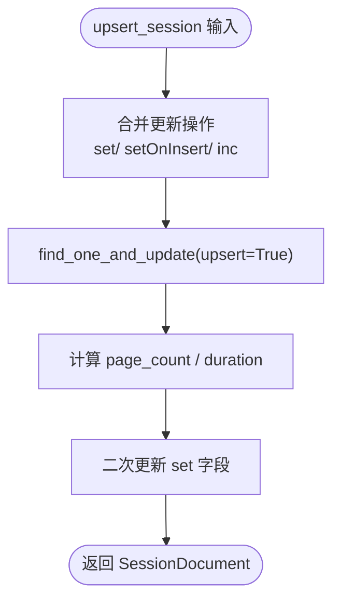
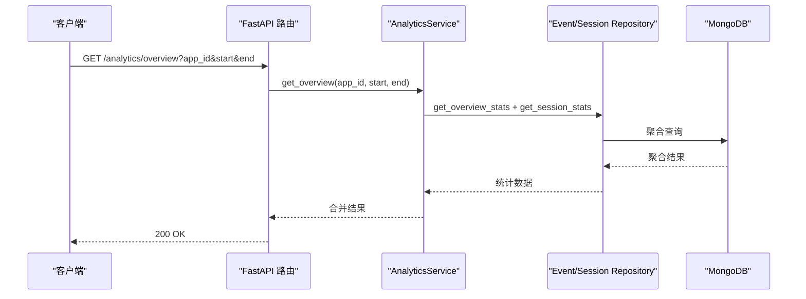
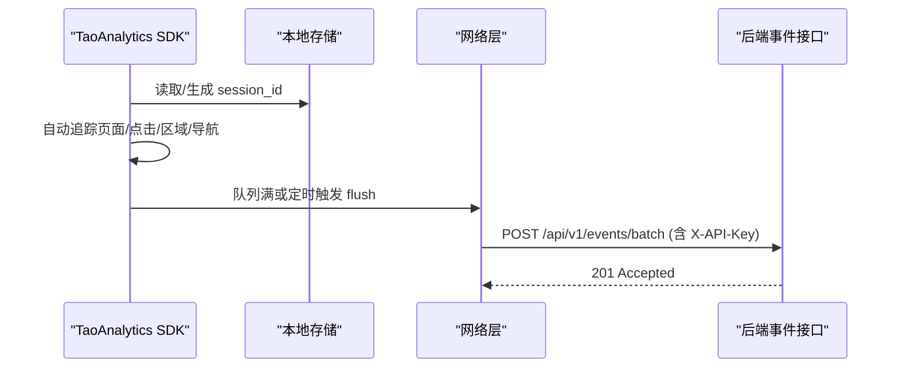
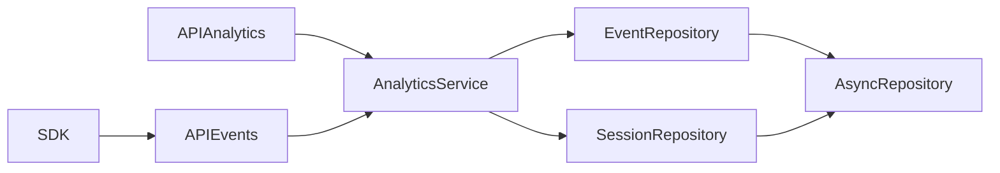

# 统计分析功能

<cite>
**本文引用的文件**
- [analytics_service.py](file://src/taolib/testing/analytics/services/analytics_service.py)
- [event_repo.py](file://src/taolib/testing/analytics/repository/event_repo.py)
- [session_repo.py](file://src/taolib/testing/analytics/repository/session_repo.py)
- [event.py](file://src/taolib/testing/analytics/models/event.py)
- [enums.py](file://src/taolib/testing/analytics/models/enums.py)
- [analytics.py](file://src/taolib/testing/analytics/server/api/analytics.py)
- [events.py](file://src/taolib/testing/analytics/server/api/events.py)
- [app.py](file://src/taolib/testing/analytics/server/app.py)
- [config.py](file://src/taolib/testing/analytics/server/config.py)
- [analytics.js](file://src/taolib/testing/analytics/sdk/analytics.js)
- [repository.py](file://src/taolib/testing/_base/repository.py)
- [test_api.py](file://tests/testing/test_analytics/test_api.py)
</cite>

## 目录
1. [简介](#简介)
2. [项目结构](#项目结构)
3. [核心组件](#核心组件)
4. [架构总览](#架构总览)
5. [详细组件分析](#详细组件分析)
6. [依赖分析](#依赖分析)
7. [性能考虑](#性能考虑)
8. [故障排查指南](#故障排查指南)
9. [结论](#结论)
10. [附录](#附录)

## 简介
本文件系统性地文档化统计分析功能，涵盖实时事件摄入、会话管理、用户行为分析与报表生成机制。重点包括：
- AnalyticsService 的核心职责与统计算法
- 事件与会话的实时摄入与聚合策略
- MongoDB 聚合管道与索引设计
- 前端仪表板与 SDK 的集成方案
- 缓存与增量更新思路、批量处理流程
- API 接口规范与响应格式
- 使用示例与性能基准建议

## 项目结构
统计分析子系统位于 taolib.testing.analytics 模块，采用“服务层 + 仓储层 + 模型 + API + SDK”的分层架构，并通过 FastAPI 提供 REST 接口，前端仪表板用于可视化展示。

图表来源
- [app.py:65-95](file://src/taolib/testing/analytics/server/app.py#L65-L95)
- [analytics.py:1-343](file://src/taolib/testing/analytics/server/api/analytics.py#L1-L343)
- [events.py:1-63](file://src/taolib/testing/analytics/server/api/events.py#L1-L63)
- [analytics_service.py:16-271](file://src/taolib/testing/analytics/services/analytics_service.py#L16-L271)
- [event_repo.py:16-469](file://src/taolib/testing/analytics/repository/event_repo.py#L16-L469)
- [session_repo.py:15-197](file://src/taolib/testing/analytics/repository/session_repo.py#L15-L197)

章节来源
- [app.py:1-243](file://src/taolib/testing/analytics/server/app.py#L1-L243)
- [analytics.py:1-343](file://src/taolib/testing/analytics/server/api/analytics.py#L1-L343)
- [events.py:1-63](file://src/taolib/testing/analytics/server/api/events.py#L1-L63)

## 核心组件
- AnalyticsService：统一的业务逻辑层，负责事件摄入、会话更新与各类统计查询的编排。
- EventRepository/SessionRepository：异步仓储层，封装 MongoDB 访问与聚合管道。
- 模型层：EventBase/EventCreate/EventResponse/EventDocument 与 SessionDocument 四层模型，确保输入输出与存储的一致性。
- API 层：FastAPI 路由，提供事件摄入与统计查询接口，并内置仪表板与 SDK 下载。
- SDK：前端 JavaScript SDK，自动采集页面浏览、点击、功能使用、区域停留、会话生命周期等事件，并批量上报。

章节来源
- [analytics_service.py:16-271](file://src/taolib/testing/analytics/services/analytics_service.py#L16-L271)
- [event_repo.py:16-469](file://src/taolib/testing/analytics/repository/event_repo.py#L16-L469)
- [session_repo.py:15-197](file://src/taolib/testing/analytics/repository/session_repo.py#L15-L197)
- [event.py:17-105](file://src/taolib/testing/analytics/models/event.py#L17-L105)
- [enums.py:9-31](file://src/taolib/testing/analytics/models/enums.py#L9-L31)
- [analytics.py:1-343](file://src/taolib/testing/analytics/server/api/analytics.py#L1-L343)
- [events.py:1-63](file://src/taolib/testing/analytics/server/api/events.py#L1-L63)
- [analytics.js:1-451](file://src/taolib/testing/analytics/sdk/analytics.js#L1-L451)

## 架构总览
统计分析系统采用“事件驱动 + 聚合分析”的架构：
- 事件摄入：前端 SDK 自动采集并批量上报；后端校验 API Key 后写入事件集合。
- 会话管理：在摄入过程中增量更新会话集合，计算页面数与时长。
- 统计查询：通过聚合管道对事件集合进行多维统计，返回概览、漏斗、功能使用、导航路径、停留时间、流失分析等报表。

图表来源
- [events.py:38-61](file://src/taolib/testing/analytics/server/api/events.py#L38-L61)
- [analytics_service.py:33-101](file://src/taolib/testing/analytics/services/analytics_service.py#L33-L101)
- [event_repo.py:23-35](file://src/taolib/testing/analytics/repository/event_repo.py#L23-L35)
- [session_repo.py:22-79](file://src/taolib/testing/analytics/repository/session_repo.py#L22-L79)

## 详细组件分析

### AnalyticsService：实时统计与聚合编排
- 事件摄入
  - 将传入的事件转为字典并生成唯一 ID，收集会话更新数据（开始/结束时间、入口/出口页面、事件计数、已访问页面等）。
  - 批量写入事件集合，随后对会话集合执行 upsert 并计算页面数与时长。
- 统计查询
  - 概览统计：总事件数、去重会话数、去重用户数、热门页面、事件类型分布。
  - 转化漏斗：按步骤匹配事件，基于会话维度去重统计每步人数与转化率。
  - 功能使用排名：筛选功能使用事件，按功能名与分类分组统计次数与独立用户数。
  - 导航路径：按会话排序，提取相邻页面对，统计流向频次。
  - 停留时间：按区域分组统计平均停留毫秒数与总浏览次数。
  - 流失分析：按步骤统计进入/完成/流失率。
- 默认时间范围：最近 7 天。

图表来源
- [analytics_service.py:33-101](file://src/taolib/testing/analytics/services/analytics_service.py#L33-L101)
- [session_repo.py:22-79](file://src/taolib/testing/analytics/repository/session_repo.py#L22-L79)

章节来源
- [analytics_service.py:16-271](file://src/taolib/testing/analytics/services/analytics_service.py#L16-L271)

### EventRepository：MongoDB 聚合与索引
- 批量写入：insert_many，返回写入条数。
- 查询接口：按会话/应用+时间范围检索事件，支持排序与分页。
- 聚合分析：
  - 转化漏斗：按步骤匹配 page_url 或 metadata.feature_name，基于会话去重统计。
  - 功能使用排名：筛选 FEATURE_USE 事件，按功能名与分类分组统计次数与独立会话数。
  - 导航路径：按会话排序，生成相邻页面对，统计流向频次。
  - 停留时间：按区域分组统计平均停留毫秒数与总浏览次数。
  - 流失分析：按步骤统计独立会话数，计算流失率。
  - 概览统计：总事件数、去重会话/用户数、热门页面、事件类型分布。
- 索引策略：
  - 事件集合：应用+时间、应用+事件类型、会话+时间、功能名稀疏索引、按时间 TTL 清理。
  - 会话集合：应用+开始时间、应用+用户稀疏索引、按开始时间 TTL 清理。

图表来源
- [event_repo.py:16-469](file://src/taolib/testing/analytics/repository/event_repo.py#L16-L469)

章节来源
- [event_repo.py:16-469](file://src/taolib/testing/analytics/repository/event_repo.py#L16-L469)

### SessionRepository：会话聚合与统计
- upsert_session：基于会话 ID 更新/插入，设置开始/结束时间、入口/出口页面、设备类型、用户 ID；增量计数事件数；按需追加已访问页面；最后计算页面数与时长。
- 查询接口：按应用+时间范围检索会话，支持排序与分页。
- 会话统计：按会话分组统计总会话数、平均时长、平均页面数与跳出率。

图表来源
- [session_repo.py:22-79](file://src/taolib/testing/analytics/repository/session_repo.py#L22-L79)

章节来源
- [session_repo.py:15-197](file://src/taolib/testing/analytics/repository/session_repo.py#L15-L197)

### 模型与枚举：事件与会话数据结构
- 事件模型四层：Base → Create/BatchCreate → Response → Document，确保输入校验、API 输出与数据库存储一致。
- 会话模型：包含应用 ID、用户 ID、设备类型、起止时间、页面数、事件数、入口/出口页面、已访问页面列表等。
- 枚举：EventType（页面浏览、点击、功能使用、会话开始/结束、导航、区域停留、自定义）、DeviceType（桌面/移动/平板/未知）。

章节来源
- [event.py:17-105](file://src/taolib/testing/analytics/models/event.py#L17-L105)
- [enums.py:9-31](file://src/taolib/testing/analytics/models/enums.py#L9-L31)

### API 层：事件摄入与统计查询
- 事件摄入
  - 单事件 POST /api/v1/events（需要 API Key）
  - 批量 POST /api/v1/events/batch（受 max_batch_size 限制）
  - API Key 校验：settings.api_keys 为空表示不启用认证。
- 统计查询
  - GET /api/v1/analytics/overview：概览统计（默认最近 7 天）
  - GET /api/v1/analytics/funnel：转化漏斗（steps 逗号分隔）
  - GET /api/v1/analytics/features：功能使用排名（limit 控制）
  - GET /api/v1/analytics/paths：导航路径（limit 控制）
  - GET /api/v1/analytics/retention：区域停留时间
  - GET /api/v1/analytics/drop-off：流失分析（steps 逗号分隔）
- 仪表板与 SDK
  - /dashboard 提供可视化仪表板
  - /sdk/analytics.js 提供前端 SDK

图表来源
- [analytics.py:95-104](file://src/taolib/testing/analytics/server/api/analytics.py#L95-L104)
- [analytics_service.py:103-121](file://src/taolib/testing/analytics/services/analytics_service.py#L103-L121)

章节来源
- [events.py:1-63](file://src/taolib/testing/analytics/server/api/events.py#L1-L63)
- [analytics.py:1-343](file://src/taolib/testing/analytics/server/api/analytics.py#L1-L343)

### SDK：前端事件采集与上报
- 会话管理：本地存储 session_id 与最近活动时间，超时自动刷新；支持用户标识持久化。
- 自动追踪：
  - 页面浏览：history API 埋点，首次与每次路由变化触发 page_view。
  - 点击事件：优先识别 data-track-feature，否则记录元素选择器、文本、坐标等。
  - 区域停留：IntersectionObserver 监测带 data-track-section 的元素，超过阈值记录 time_on_section。
  - 会话生命周期：自动发送 session_start/end，在页面隐藏/卸载时结束会话。
  - 导航事件：记录 from_page/to_page 的 navigation 事件。
- 上报策略：队列满（默认 20）或定时（默认 5 秒）触发 flush；优先使用 sendBeacon，失败回退 fetch；支持 API Key 注入。

图表来源
- [analytics.js:148-174](file://src/taolib/testing/analytics/sdk/analytics.js#L148-L174)
- [events.py:38-61](file://src/taolib/testing/analytics/server/api/events.py#L38-L61)

章节来源
- [analytics.js:1-451](file://src/taolib/testing/analytics/sdk/analytics.js#L1-L451)

## 依赖分析
- 组件耦合
  - AnalyticsService 依赖 EventRepository 与 SessionRepository，承担业务编排。
  - API 层通过工厂函数注入仓储实例，避免全局状态。
  - SDK 仅依赖浏览器能力与后端接口，低耦合。
- 外部依赖
  - MongoDB（Motor 异步驱动），FastAPI，CORS 中间件，Chart.js（仪表板）。
- 索引与 TTL
  - 事件集合与会话集合分别建立复合索引与 TTL 索引，保障查询性能与数据生命周期管理。

图表来源
- [analytics_service.py:19-31](file://src/taolib/testing/analytics/services/analytics_service.py#L19-L31)
- [repository.py:15-131](file://src/taolib/testing/_base/repository.py#L15-L131)
- [analytics.py:43-51](file://src/taolib/testing/analytics/server/api/analytics.py#L43-L51)
- [events.py:27-35](file://src/taolib/testing/analytics/server/api/events.py#L27-L35)

章节来源
- [repository.py:15-131](file://src/taolib/testing/_base/repository.py#L15-L131)
- [event_repo.py:443-466](file://src/taolib/testing/analytics/repository/event_repo.py#L443-L466)
- [session_repo.py:179-194](file://src/taolib/testing/analytics/repository/session_repo.py#L179-L194)

## 性能考虑
- 索引设计
  - 事件集合：应用+时间、应用+事件类型、会话+时间、功能名稀疏索引，提升聚合效率。
  - 会话集合：应用+开始时间、应用+用户稀疏索引，便于会话统计。
  - TTL 索引：事件与会话按时间字段自动清理，降低存储压力。
- 聚合优化
  - 使用 $addToSet + $size 减少重复计数开销；在聚合中尽早过滤与排序。
  - 导航路径聚合通过相邻数组 zip 与 group 统计，避免多次扫描。
- 上报与批处理
  - SDK 默认批量大小与定时刷新，减少网络请求次数；sendBeacon 提升可靠性。
- 查询默认范围
  - API 默认最近 7 天，避免全表扫描；可通过 start/end 参数精确控制。

[本节为通用性能建议，无需特定文件来源]

## 故障排查指南
- API Key 认证
  - 当 settings.api_keys 非空时，未携带或错误的 X-API-Key 将返回 401。
- 批量大小限制
  - 超过 settings.max_batch_size 将返回 400。
- 输入校验
  - 事件字段缺失或格式错误返回 422。
- 健康检查
  - /api/v1/health 可检查数据库连通性。
- 仪表板与 SDK
  - /dashboard 返回 HTML；/sdk/analytics.js 返回 SDK 脚本。
- 单元测试参考
  - 测试覆盖事件摄入、API Key 认证、各分析端点与错误场景。

章节来源
- [events.py:11-24](file://src/taolib/testing/analytics/server/api/events.py#L11-L24)
- [events.py:52-56](file://src/taolib/testing/analytics/server/api/events.py#L52-L56)
- [test_api.py:149-198](file://tests/testing/test_analytics/test_api.py#L149-L198)
- [test_api.py:200-323](file://tests/testing/test_analytics/test_api.py#L200-L323)

## 结论
该统计分析系统通过 SDK 自动采集、后端事件摄入与聚合分析，实现了从实时到离线的完整用户行为洞察链路。其核心优势在于：
- 明确的分层架构与职责分离，便于维护与扩展。
- 基于 MongoDB 聚合管道的高效统计，覆盖转化漏斗、功能使用、导航路径、停留时间与流失分析。
- 前端 SDK 与仪表板提供即插即用的可视化体验。
建议在生产环境中结合监控与日志，持续评估聚合性能并按需调整索引与批处理策略。

[本节为总结，无需特定文件来源]

## 附录

### API 接口一览
- 事件摄入
  - POST /api/v1/events：单事件上报（需 API Key）
  - POST /api/v1/events/batch：批量上报（受 max_batch_size 限制）
- 统计查询
  - GET /api/v1/analytics/overview：概览统计（默认最近 7 天）
  - GET /api/v1/analytics/funnel：转化漏斗（steps 逗号分隔）
  - GET /api/v1/analytics/features：功能使用排名（limit 控制）
  - GET /api/v1/analytics/paths：导航路径（limit 控制）
  - GET /api/v1/analytics/retention：区域停留时间
  - GET /api/v1/analytics/drop-off：流失分析（steps 逗号分隔）
- 辅助
  - GET /api/v1/health：健康检查
  - GET /dashboard：仪表板
  - GET /sdk/analytics.js：SDK 脚本

章节来源
- [events.py:38-61](file://src/taolib/testing/analytics/server/api/events.py#L38-L61)
- [analytics.py:54-341](file://src/taolib/testing/analytics/server/api/analytics.py#L54-L341)

### 数据格式与字段说明
- 事件模型（EventBase）
  - 必填：event_type、app_id、session_id、page_url、timestamp
  - 可选：user_id、referrer、device_type、user_agent、screen_width、screen_height、metadata
- 会话模型（SessionDocument）
  - 必填：app_id、started_at、entry_page
  - 可选：ended_at、exit_page、user_id、device_type、duration_seconds、page_count、pages_visited
- 聚合结果示例
  - 概览：total_events、unique_sessions、unique_users、top_pages、event_types
  - 漏斗：steps[name, count, conversion_rate]、overall_conversion
  - 功能排名：features[{name, category, count, unique_users}]
  - 导航路径：paths[{source, target, value}]
  - 停留时间：sections[{section_id, avg_duration_ms, total_views}]
  - 流失分析：steps[{name, entered, completed, drop_off_rate}]

章节来源
- [event.py:17-105](file://src/taolib/testing/analytics/models/event.py#L17-L105)
- [analytics_service.py:103-253](file://src/taolib/testing/analytics/services/analytics_service.py#L103-L253)

### 使用示例
- 前端集成
  - 引入 SDK 脚本，调用 TaoAnalytics.init(options)，即可自动采集页面浏览、点击、功能使用、区域停留与会话生命周期事件。
- 后端启动
  - 配置 MongoDB 连接与 API Key，启动 FastAPI 应用，访问 /dashboard 查看可视化面板。
- API 调用
  - 使用 curl 或任意 HTTP 客户端调用 /api/v1/analytics/* 接口，传入 app_id 与时间范围参数。

章节来源
- [app.py:65-95](file://src/taolib/testing/analytics/server/app.py#L65-L95)
- [analytics.js:376-402](file://src/taolib/testing/analytics/sdk/analytics.js#L376-L402)

### 性能基准建议
- 索引与 TTL
  - 确保事件与会话集合具备相应索引；根据数据量定期评估 TTL 设置。
- 聚合优化
  - 对高频查询（如概览、漏斗、功能排名）预估数据规模，必要时拆分时间窗口或增加缓存层。
- SDK 批处理
  - 根据网络状况调整 SDK 的批量大小与刷新间隔，平衡延迟与吞吐。
- 监控与告警
  - 关注聚合耗时、事件积压、会话异常（如长时间无更新）等指标。

[本节为通用建议，无需特定文件来源]