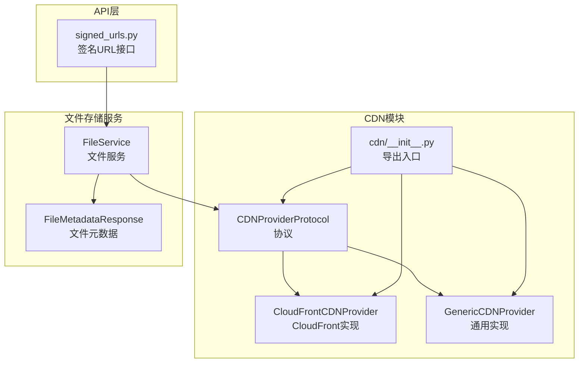
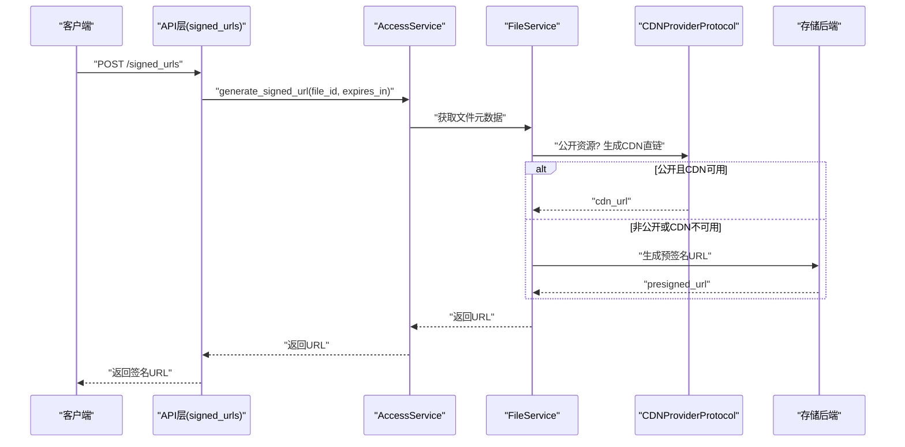
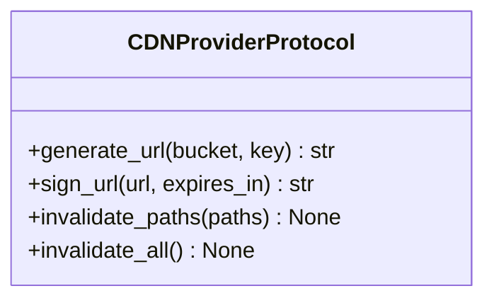
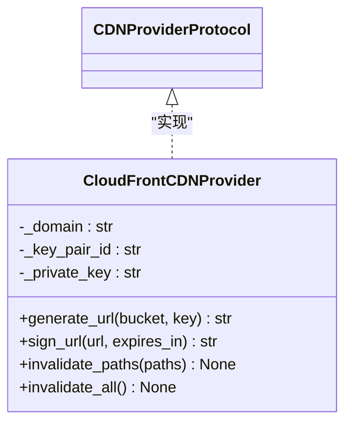
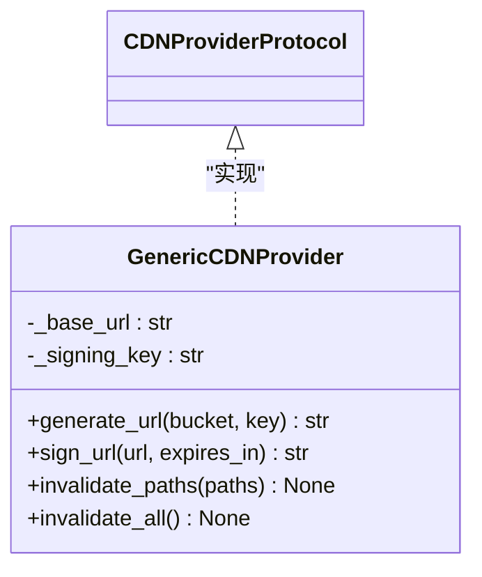
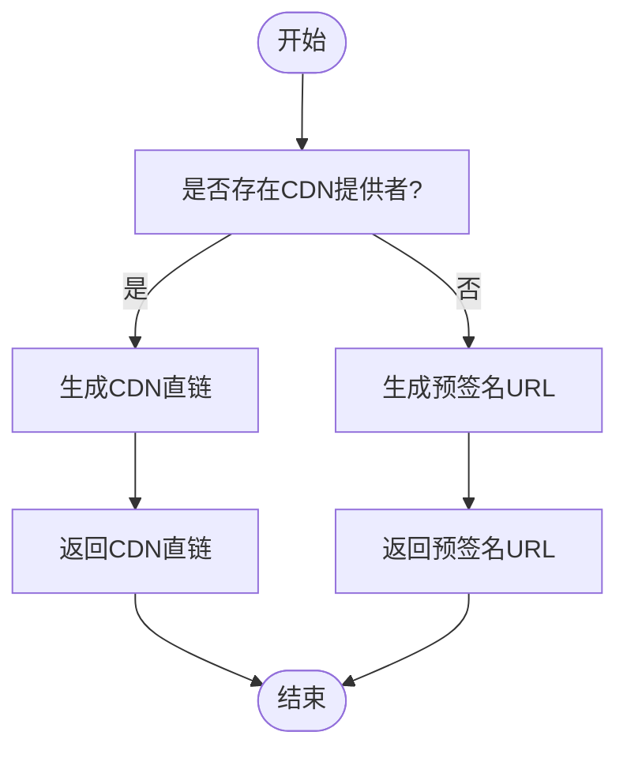
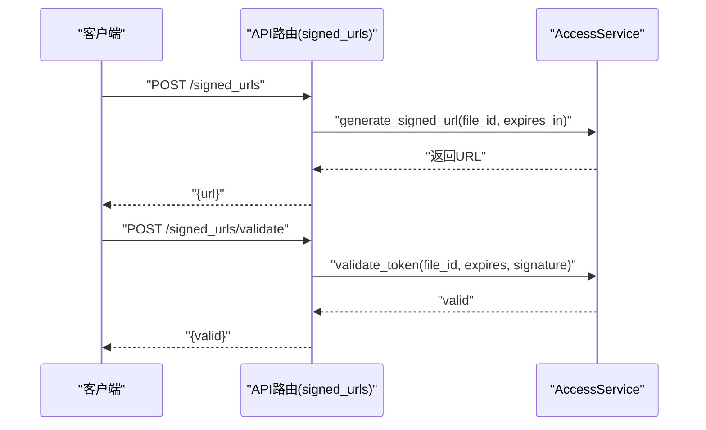
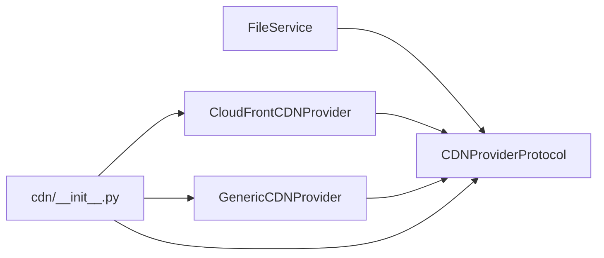

# CDN集成

<cite>
**本文引用的文件**
- [src/taolib/testing/file_storage/cdn/__init__.py](file://src/taolib/testing/file_storage/cdn/__init__.py)
- [src/taolib/testing/file_storage/cdn/cloudfront.py](file://src/taolib/testing/file_storage/cdn/cloudfront.py)
- [src/taolib/testing/file_storage/cdn/generic.py](file://src/taolib/testing/file_storage/cdn/generic.py)
- [src/taolib/testing/file_storage/cdn/protocols.py](file://src/taolib/testing/file_storage/cdn/protocols.py)
- [src/taolib/testing/file_storage/services/file_service.py](file://src/taolib/testing/file_storage/services/file_service.py)
- [src/taolib/testing/file_storage/models/file.py](file://src/taolib/testing/file_storage/models/file.py)
- [src/taolib/testing/file_storage/server/api/signed_urls.py](file://src/taolib/testing/file_storage/server/api/signed_urls.py)
</cite>

## 目录
1. [简介](#简介)
2. [项目结构](#项目结构)
3. [核心组件](#核心组件)
4. [架构总览](#架构总览)
5. [详细组件分析](#详细组件分析)
6. [依赖分析](#依赖分析)
7. [性能考虑](#性能考虑)
8. [故障排除指南](#故障排除指南)
9. [结论](#结论)
10. [附录](#附录)

## 简介
本技术文档面向CDN集成系统，聚焦于CDN提供商支持架构、CloudFront集成实现与通用CDN适配器设计，系统性阐述URL签名机制、缓存策略配置与CDN边缘节点优化，并给出CDN提供商选择指南、成本优化策略与性能监控方法。文档同时覆盖CDN与存储后端的协作机制、配置示例、自定义CDN提供商开发指南以及常见问题排查方案。

## 项目结构
CDN相关能力位于文件存储模块的CDN子包中，采用“协议 + 实现”的分层设计，便于扩展与替换。核心文件包括：
- 协议定义：CDNProviderProtocol
- 具体实现：CloudFrontCDNProvider、GenericCDNProvider
- 导出入口：cdn/__init__.py
- 与文件服务的集成：在文件上传、缩略图生成、URL生成等流程中调用CDN能力
- 与存储后端的协作：通过存储后端生成预签名URL，CDN用于公开资源的直链加速

图表来源
- [src/taolib/testing/file_storage/cdn/protocols.py:1-29](file://src/taolib/testing/file_storage/cdn/protocols.py#L1-L29)
- [src/taolib/testing/file_storage/cdn/cloudfront.py:1-64](file://src/taolib/testing/file_storage/cdn/cloudfront.py#L1-L64)
- [src/taolib/testing/file_storage/cdn/generic.py:1-52](file://src/taolib/testing/file_storage/cdn/generic.py#L1-L52)
- [src/taolib/testing/file_storage/cdn/__init__.py:1-17](file://src/taolib/testing/file_storage/cdn/__init__.py#L1-L17)
- [src/taolib/testing/file_storage/services/file_service.py:1-274](file://src/taolib/testing/file_storage/services/file_service.py#L1-L274)
- [src/taolib/testing/file_storage/models/file.py:1-117](file://src/taolib/testing/file_storage/models/file.py#L1-L117)
- [src/taolib/testing/file_storage/server/api/signed_urls.py:1-50](file://src/taolib/testing/file_storage/server/api/signed_urls.py#L1-L50)

章节来源
- [src/taolib/testing/file_storage/cdn/__init__.py:1-17](file://src/taolib/testing/file_storage/cdn/__init__.py#L1-L17)
- [src/taolib/testing/file_storage/cdn/protocols.py:1-29](file://src/taolib/testing/file_storage/cdn/protocols.py#L1-L29)
- [src/taolib/testing/file_storage/cdn/cloudfront.py:1-64](file://src/taolib/testing/file_storage/cdn/cloudfront.py#L1-L64)
- [src/taolib/testing/file_storage/cdn/generic.py:1-52](file://src/taolib/testing/file_storage/cdn/generic.py#L1-L52)
- [src/taolib/testing/file_storage/services/file_service.py:1-274](file://src/taolib/testing/file_storage/services/file_service.py#L1-L274)
- [src/taolib/testing/file_storage/models/file.py:1-117](file://src/taolib/testing/file_storage/models/file.py#L1-L117)
- [src/taolib/testing/file_storage/server/api/signed_urls.py:1-50](file://src/taolib/testing/file_storage/server/api/signed_urls.py#L1-L50)

## 核心组件
- CDNProviderProtocol：定义统一的CDN接口，包括生成URL、签名URL、缓存刷新（按路径/全部）。
- CloudFrontCDNProvider：AWS CloudFront实现，支持基于HMAC的简化签名与缓存刷新占位。
- GenericCDNProvider：通用CDN实现，支持自定义base URL与HMAC签名。
- FileService：在文件上传、缩略图生成、URL生成等流程中注入CDN能力；公开资源直接返回CDN URL，私有资源返回存储后端预签名URL。
- FileMetadataResponse：在元数据中保留cdn_url字段，便于前端直接使用CDN直链。
- signed_urls API：对外暴露签名URL生成与校验接口，供鉴权与安全访问场景使用。

章节来源
- [src/taolib/testing/file_storage/cdn/protocols.py:1-29](file://src/taolib/testing/file_storage/cdn/protocols.py#L1-L29)
- [src/taolib/testing/file_storage/cdn/cloudfront.py:1-64](file://src/taolib/testing/file_storage/cdn/cloudfront.py#L1-L64)
- [src/taolib/testing/file_storage/cdn/generic.py:1-52](file://src/taolib/testing/file_storage/cdn/generic.py#L1-L52)
- [src/taolib/testing/file_storage/services/file_service.py:1-274](file://src/taolib/testing/file_storage/services/file_service.py#L1-L274)
- [src/taolib/testing/file_storage/models/file.py:1-117](file://src/taolib/testing/file_storage/models/file.py#L1-L117)
- [src/taolib/testing/file_storage/server/api/signed_urls.py:1-50](file://src/taolib/testing/file_storage/server/api/signed_urls.py#L1-L50)

## 架构总览
CDN集成以“协议抽象 + 多实现 + 服务编排”为核心，形成如下闭环：
- 文件上传时，若启用CDN，则生成cdn_url并写入元数据；缩略图同样可生成CDN直链。
- 访问请求到来时，根据文件访问级别决定返回CDN直链或存储后端预签名URL。
- 需要缓存刷新时，调用对应CDN实现的invalidate_paths/invalidate_all（CloudFront当前为占位）。

图表来源
- [src/taolib/testing/file_storage/server/api/signed_urls.py:1-50](file://src/taolib/testing/file_storage/server/api/signed_urls.py#L1-L50)
- [src/taolib/testing/file_storage/services/file_service.py:258-273](file://src/taolib/testing/file_storage/services/file_service.py#L258-L273)

## 详细组件分析

### CDNProviderProtocol 协议设计
- 统一接口：generate_url、sign_url、invalidate_paths、invalidate_all。
- 设计要点：通过协议约束实现类行为，便于替换不同CDN提供商；签名与刷新接口异步化，便于对接云原生SDK。

图表来源
- [src/taolib/testing/file_storage/cdn/protocols.py:1-29](file://src/taolib/testing/file_storage/cdn/protocols.py#L1-L29)

章节来源
- [src/taolib/testing/file_storage/cdn/protocols.py:1-29](file://src/taolib/testing/file_storage/cdn/protocols.py#L1-L29)

### CloudFrontCDNProvider 实现
- URL生成：基于分发域名拼接对象键，形成可访问的CDN直链。
- URL签名：提供HMAC简化签名方案（需私钥），包含过期时间、签名值与Key-Pair-Id参数。
- 缓存刷新：当前为占位实现，提示后续可通过boto3调用invalidation API完成实际刷新。

图表来源
- [src/taolib/testing/file_storage/cdn/cloudfront.py:1-64](file://src/taolib/testing/file_storage/cdn/cloudfront.py#L1-L64)
- [src/taolib/testing/file_storage/cdn/protocols.py:1-29](file://src/taolib/testing/file_storage/cdn/protocols.py#L1-L29)

章节来源
- [src/taolib/testing/file_storage/cdn/cloudfront.py:1-64](file://src/taolib/testing/file_storage/cdn/cloudfront.py#L1-L64)

### GenericCDNProvider 实现
- URL生成：支持自定义base_url，按“base_url/bucket/key”规则生成CDN直链。
- URL签名：基于HMAC的简化签名，包含过期时间与签名参数。
- 缓存刷新：当前为空实现，表明该实现不内置刷新能力，需结合外部运维流程。

图表来源
- [src/taolib/testing/file_storage/cdn/generic.py:1-52](file://src/taolib/testing/file_storage/cdn/generic.py#L1-L52)
- [src/taolib/testing/file_storage/cdn/protocols.py:1-29](file://src/taolib/testing/file_storage/cdn/protocols.py#L1-L29)

### FileService 中的CDN集成
- 上传流程：在生成文件元数据时，若存在CDN提供者，则生成cdn_url并写入响应模型。
- 缩略图流程：同样可生成CDN直链，便于前端快速加载。
- URL生成：公开资源优先返回CDN直链；非公开资源返回存储后端预签名URL，确保访问安全。

图表来源
- [src/taolib/testing/file_storage/services/file_service.py:92-96](file://src/taolib/testing/file_storage/services/file_service.py#L92-L96)
- [src/taolib/testing/file_storage/services/file_service.py:258-273](file://src/taolib/testing/file_storage/services/file_service.py#L258-L273)

章节来源
- [src/taolib/testing/file_storage/services/file_service.py:1-274](file://src/taolib/testing/file_storage/services/file_service.py#L1-L274)
- [src/taolib/testing/file_storage/models/file.py:53-71](file://src/taolib/testing/file_storage/models/file.py#L53-L71)

### signed_urls API
- 生成签名URL：接收file_id与过期时间，调用AccessService生成并返回。
- 校验Token：接收file_id、expires与signature，验证签名有效性。

图表来源
- [src/taolib/testing/file_storage/server/api/signed_urls.py:1-50](file://src/taolib/testing/file_storage/server/api/signed_urls.py#L1-L50)

章节来源
- [src/taolib/testing/file_storage/server/api/signed_urls.py:1-50](file://src/taolib/testing/file_storage/server/api/signed_urls.py#L1-L50)

## 依赖分析
- 协议与实现解耦：CDNProviderProtocol作为抽象边界，CloudFront与Generic实现彼此独立，便于替换与扩展。
- 服务层依赖：FileService依赖CDNProviderProtocol进行URL生成与缓存刷新；当CDN不可用时，自动回退至存储后端预签名URL。
- 导出入口：cdn/__init__.py集中导出协议与实现，便于上层模块按需导入。

图表来源
- [src/taolib/testing/file_storage/cdn/__init__.py:1-17](file://src/taolib/testing/file_storage/cdn/__init__.py#L1-L17)
- [src/taolib/testing/file_storage/cdn/protocols.py:1-29](file://src/taolib/testing/file_storage/cdn/protocols.py#L1-L29)
- [src/taolib/testing/file_storage/cdn/cloudfront.py:1-64](file://src/taolib/testing/file_storage/cdn/cloudfront.py#L1-L64)
- [src/taolib/testing/file_storage/cdn/generic.py:1-52](file://src/taolib/testing/file_storage/cdn/generic.py#L1-L52)
- [src/taolib/testing/file_storage/services/file_service.py:1-274](file://src/taolib/testing/file_storage/services/file_service.py#L1-L274)

章节来源
- [src/taolib/testing/file_storage/cdn/__init__.py:1-17](file://src/taolib/testing/file_storage/cdn/__init__.py#L1-L17)
- [src/taolib/testing/file_storage/services/file_service.py:1-274](file://src/taolib/testing/file_storage/services/file_service.py#L1-L274)

## 性能考虑
- CDN直链优先：对公开资源优先返回CDN直链，减少回源压力，提升边缘节点命中率。
- 缓存策略配置：建议在CDN层设置合理的Cache-Control与TTL，结合对象键命名策略避免不必要的回源。
- 边缘节点优化：通过就近分发与压缩（如Gzip/Br）降低延迟；对静态资源启用HTTP/2或HTTP/3以提升并发性能。
- 缩略图直链：缩略图同样走CDN直链，减少主图带宽占用与服务器压力。
- 刷新策略：批量刷新时尽量合并路径，避免频繁invalidation导致边缘节点抖动。

## 故障排除指南
- 无法生成签名URL
  - 检查CDN提供者是否正确初始化（CloudFront需配置私钥与Key-Pair-Id）。
  - 若使用GenericCDNProvider，请确认签名密钥已配置。
- 返回的是预签名URL而非CDN直链
  - 确认文件访问级别为公开且CDN提供者可用；否则将回退到存储后端预签名URL。
- 缓存刷新无效
  - CloudFront实现当前为占位，需补充boto3调用；Generic实现不内置刷新能力，需结合外部流程。
- CDN直链访问失败
  - 核对分发域名与对象键拼接是否正确；检查CDN缓存策略与回源配置。

章节来源
- [src/taolib/testing/file_storage/cdn/cloudfront.py:28-50](file://src/taolib/testing/file_storage/cdn/cloudfront.py#L28-L50)
- [src/taolib/testing/file_storage/cdn/generic.py:29-43](file://src/taolib/testing/file_storage/cdn/generic.py#L29-L43)
- [src/taolib/testing/file_storage/services/file_service.py:258-273](file://src/taolib/testing/file_storage/services/file_service.py#L258-L273)

## 结论
本CDN集成方案通过协议抽象实现了多提供商适配，CloudFront与通用实现满足不同部署需求。配合文件服务的直链生成与预签名URL回退机制，既保证了性能又兼顾了安全性。建议在生产环境中完善CloudFront的缓存刷新能力，并结合业务特性制定缓存策略与监控方案。

## 附录

### CDN提供商选择指南
- 公开静态资源优先：选择具备全球边缘节点与高命中率的CDN（如CloudFront）。
- 自建或私有化：可选用GenericCDNProvider，结合自有域名与签名策略。
- 成本考量：对比带宽、请求次数与缓存命中率，选择适合的计费模式。

### 成本优化策略
- 合理TTL：对不变或低频变更资源设置较长TTL，减少回源。
- 对象键命名：引入内容指纹或版本号，便于长缓存与精准失效。
- 批量刷新：合并路径刷新，避免高频invalidation。

### 性能监控方法
- CDN指标：边缘命中率、回源比率、传输时延、错误率。
- 应用指标：签名URL生成耗时、CDN直链访问成功率、缩略图加载性能。
- 告警阈值：命中率骤降、回源异常、刷新失败等。

### CDN配置示例
- CloudFront直链生成：基于分发域名与对象键拼接。
- CloudFront签名URL：HMAC签名（需私钥与Key-Pair-Id），包含过期时间与签名参数。
- 通用CDN直链：自定义base_url与bucket/key组合。
- 通用CDN签名：HMAC签名（需签名密钥），包含过期时间与签名参数。

章节来源
- [src/taolib/testing/file_storage/cdn/cloudfront.py:24-50](file://src/taolib/testing/file_storage/cdn/cloudfront.py#L24-L50)
- [src/taolib/testing/file_storage/cdn/generic.py:25-43](file://src/taolib/testing/file_storage/cdn/generic.py#L25-L43)

### 自定义CDN提供商开发指南
- 实现步骤
  - 定义类并实现CDNProviderProtocol接口（generate_url、sign_url、invalidate_paths、invalidate_all）。
  - 在cdn/__init__.py中导出新实现，便于上层模块导入。
  - 在FileService中注入新实现，即可在上传与URL生成流程中使用。
- 注意事项
  - 签名算法需与前端/客户端一致；过期时间与签名参数命名保持兼容。
  - 缓存刷新需结合云厂商API或运维流程，确保边缘节点及时生效。

章节来源
- [src/taolib/testing/file_storage/cdn/protocols.py:1-29](file://src/taolib/testing/file_storage/cdn/protocols.py#L1-L29)
- [src/taolib/testing/file_storage/cdn/__init__.py:1-17](file://src/taolib/testing/file_storage/cdn/__init__.py#L1-L17)
- [src/taolib/testing/file_storage/services/file_service.py:30-47](file://src/taolib/testing/file_storage/services/file_service.py#L30-L47)