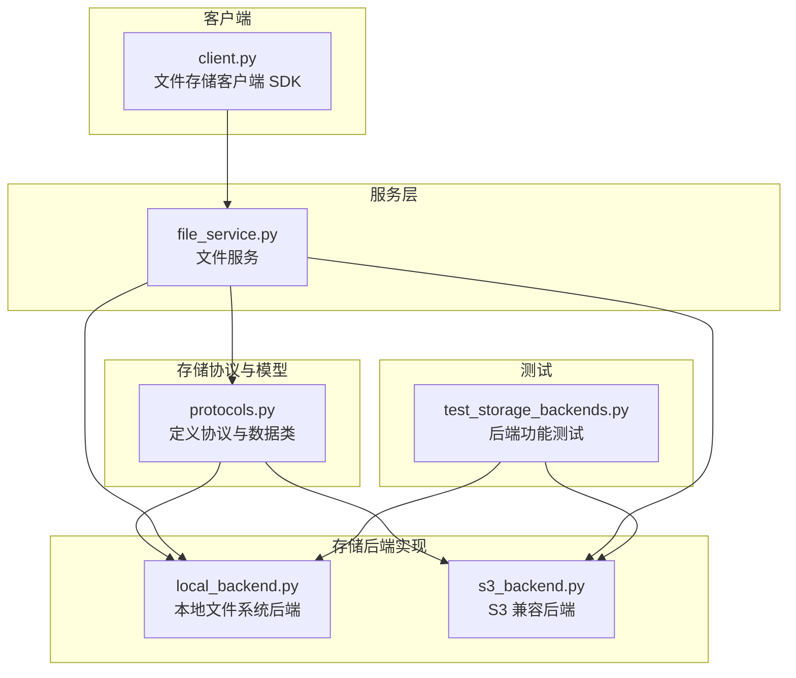
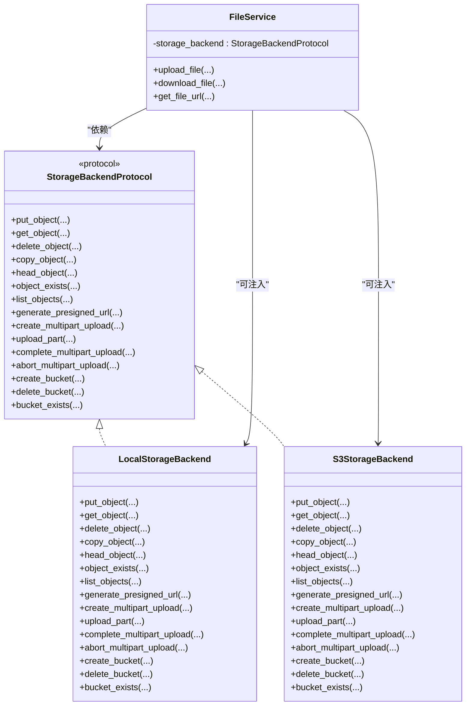
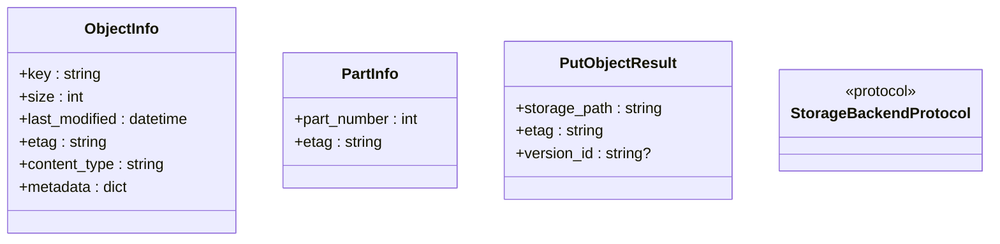
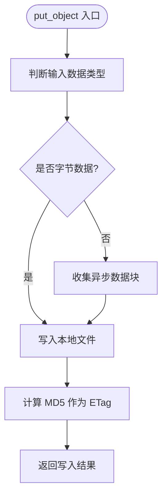
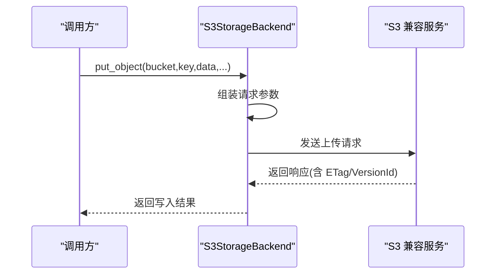
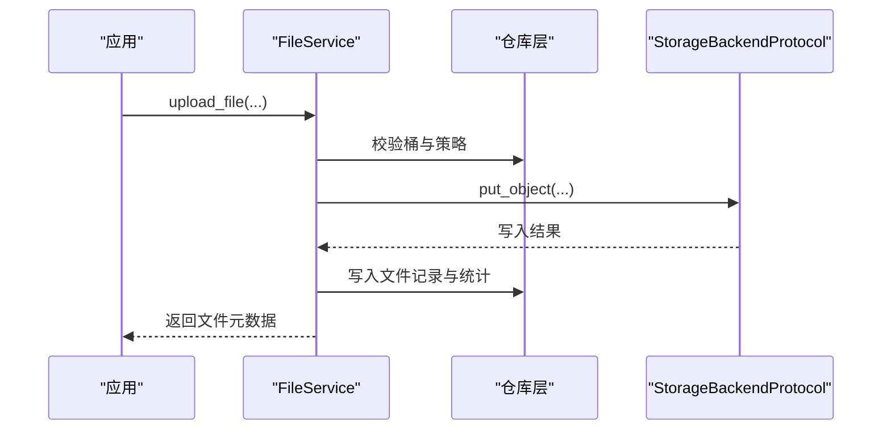
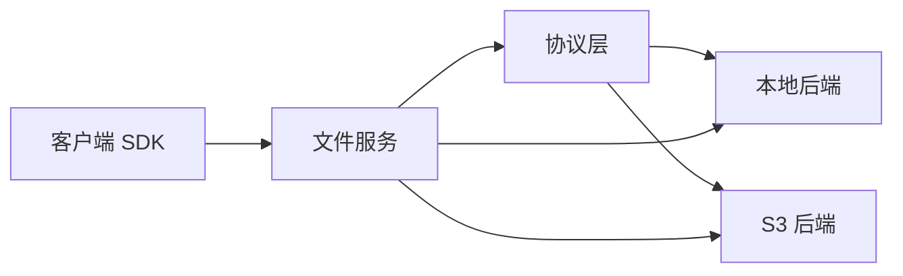

# 存储架构设计

<cite>
**本文引用的文件**
- [src/taolib/testing/file_storage/storage/protocols.py](file://src/taolib/testing/file_storage/storage/protocols.py)
- [src/taolib/testing/file_storage/storage/local_backend.py](file://src/taolib/testing/file_storage/storage/local_backend.py)
- [src/taolib/testing/file_storage/storage/s3_backend.py](file://src/taolib/testing/file_storage/storage/s3_backend.py)
- [src/taolib/testing/file_storage/client.py](file://src/taolib/testing/file_storage/client.py)
- [src/taolib/testing/file_storage/services/file_service.py](file://src/taolib/testing/file_storage/services/file_service.py)
- [tests/testing/test_file_storage/test_storage_backends.py](file://tests/testing/test_file_storage/test_storage_backends.py)
</cite>

## 目录
1. [引言](#引言)
2. [项目结构](#项目结构)
3. [核心组件](#核心组件)
4. [架构总览](#架构总览)
5. [详细组件分析](#详细组件分析)
6. [依赖分析](#依赖分析)
7. [性能考虑](#性能考虑)
8. [故障排查指南](#故障排查指南)
9. [结论](#结论)
10. [附录](#附录)

## 引言
本技术文档围绕多后端存储架构展开，系统性阐述本地存储后端与 S3 兼容存储后端的设计与实现，以及贯穿其中的协议抽象层、适配器模式与统一接口。文档还覆盖存储策略选择原则、数据一致性保障机制、扩展接口设计、性能对比分析、容量规划建议、故障转移机制、配置示例、自定义后端开发指南与性能优化策略，帮助读者在不同环境下做出合理的技术选型并安全落地。

## 项目结构
文件存储相关代码主要集中在以下模块：
- 协议与数据模型：定义统一的存储后端协议与数据结构，确保多后端的一致行为契约。
- 后端实现：本地文件系统后端与 S3 兼容后端，分别满足开发测试与生产高可用场景。
- 服务层：文件服务封装业务流程，屏蔽具体后端差异，提供统一的上传、下载、元数据管理等能力。
- 客户端：提供同步/异步客户端 SDK，便于应用侧调用。
- 测试：对后端功能进行端到端验证，覆盖对象存取、分片上传、列表与预签名 URL 等。

图表来源
- [src/taolib/testing/file_storage/storage/protocols.py:1-159](file://src/taolib/testing/file_storage/storage/protocols.py#L1-L159)
- [src/taolib/testing/file_storage/storage/local_backend.py:1-254](file://src/taolib/testing/file_storage/storage/local_backend.py#L1-L254)
- [src/taolib/testing/file_storage/storage/s3_backend.py:1-337](file://src/taolib/testing/file_storage/storage/s3_backend.py#L1-L337)
- [src/taolib/testing/file_storage/services/file_service.py:1-274](file://src/taolib/testing/file_storage/services/file_service.py#L1-L274)
- [src/taolib/testing/file_storage/client.py:1-214](file://src/taolib/testing/file_storage/client.py#L1-L214)
- [tests/testing/test_file_storage/test_storage_backends.py:70-151](file://tests/testing/test_file_storage/test_storage_backends.py#L70-L151)

章节来源
- [src/taolib/testing/file_storage/storage/protocols.py:1-159](file://src/taolib/testing/file_storage/storage/protocols.py#L1-L159)
- [src/taolib/testing/file_storage/storage/local_backend.py:1-254](file://src/taolib/testing/file_storage/storage/local_backend.py#L1-L254)
- [src/taolib/testing/file_storage/storage/s3_backend.py:1-337](file://src/taolib/testing/file_storage/storage/s3_backend.py#L1-L337)
- [src/taolib/testing/file_storage/services/file_service.py:1-274](file://src/taolib/testing/file_storage/services/file_service.py#L1-L274)
- [src/taolib/testing/file_storage/client.py:1-214](file://src/taolib/testing/file_storage/client.py#L1-L214)
- [tests/testing/test_file_storage/test_storage_backends.py:70-151](file://tests/testing/test_file_storage/test_storage_backends.py#L70-L151)

## 核心组件
- 存储协议与数据模型
  - 协议接口：统一定义对象上传、下载、复制、头信息、存在性检查、列举、预签名 URL、分片上传全流程操作。
  - 数据类：对象信息、分片信息、写入结果等，承载跨后端一致的数据结构。
- 本地存储后端
  - 基于文件系统的实现，适合开发与测试；支持分片上传、桶管理、对象列举与预签名 URL 生成（开发用途）。
- S3 兼容存储后端
  - 基于异步 S3 客户端库实现，兼容 AWS S3、MinIO、阿里云 OSS 等；支持完整的对象生命周期与分片上传。
- 文件服务
  - 将业务需求与底层存储解耦，负责校验、处理、缩略图生成、CDN 集成与生命周期管理，并通过统一协议调用后端。
- 客户端 SDK
  - 提供同步/异步 HTTP 客户端，封装桶、文件与分片上传的 API 调用。

章节来源
- [src/taolib/testing/file_storage/storage/protocols.py:41-157](file://src/taolib/testing/file_storage/storage/protocols.py#L41-L157)
- [src/taolib/testing/file_storage/storage/local_backend.py:22-254](file://src/taolib/testing/file_storage/storage/local_backend.py#L22-L254)
- [src/taolib/testing/file_storage/storage/s3_backend.py:18-337](file://src/taolib/testing/file_storage/storage/s3_backend.py#L18-L337)
- [src/taolib/testing/file_storage/services/file_service.py:30-274](file://src/taolib/testing/file_storage/services/file_service.py#L30-L274)
- [src/taolib/testing/file_storage/client.py:14-214](file://src/taolib/testing/file_storage/client.py#L14-L214)

## 架构总览
该架构采用“协议抽象 + 适配器”的设计，将业务层与存储实现解耦。文件服务作为统一入口，面向上层提供一致的 API；具体存储由本地或 S3 后端实现，遵循同一协议，从而实现无缝切换与扩展。

图表来源
- [src/taolib/testing/file_storage/storage/protocols.py:41-157](file://src/taolib/testing/file_storage/storage/protocols.py#L41-L157)
- [src/taolib/testing/file_storage/storage/local_backend.py:22-254](file://src/taolib/testing/file_storage/storage/local_backend.py#L22-L254)
- [src/taolib/testing/file_storage/storage/s3_backend.py:18-337](file://src/taolib/testing/file_storage/storage/s3_backend.py#L18-L337)
- [src/taolib/testing/file_storage/services/file_service.py:30-47](file://src/taolib/testing/file_storage/services/file_service.py#L30-L47)

## 详细组件分析

### 协议抽象层与数据模型
- 协议接口定义了完整的对象存储操作集合，涵盖基础 CRUD、元信息、列举、分片上传与桶管理，确保不同后端实现具备统一的行为契约。
- 数据类用于承载对象信息、分片信息与写入结果，避免上层对后端细节的感知。

图表来源
- [src/taolib/testing/file_storage/storage/protocols.py:12-39](file://src/taolib/testing/file_storage/storage/protocols.py#L12-L39)
- [src/taolib/testing/file_storage/storage/protocols.py:41-157](file://src/taolib/testing/file_storage/storage/protocols.py#L41-L157)

章节来源
- [src/taolib/testing/file_storage/storage/protocols.py:12-157](file://src/taolib/testing/file_storage/storage/protocols.py#L12-L157)

### 本地存储后端实现
- 设计要点
  - 以目录结构模拟桶与对象，路径组织清晰，便于调试与运维。
  - 支持分片上传的完整流程：创建会话、上传分片、合并完成、中止清理。
  - 对象元信息通过本地文件系统 stat 获取，ETag 基于内容哈希生成。
  - 预签名 URL 在开发环境中返回本地文件路径，便于本地联调。
- 错误处理
  - 对象不存在、会话无效等异常均抛出自定义存储错误类型，便于上层捕获与处理。
- 性能特征
  - 顺序读写，流式下载基于固定块大小分块传输；适合小规模开发与测试。

图表来源
- [src/taolib/testing/file_storage/storage/local_backend.py:36-58](file://src/taolib/testing/file_storage/storage/local_backend.py#L36-L58)

章节来源
- [src/taolib/testing/file_storage/storage/local_backend.py:22-254](file://src/taolib/testing/file_storage/storage/local_backend.py#L22-L254)

### S3 兼容存储后端实现
- 设计要点
  - 基于异步客户端库，按需延迟创建会话与客户端，降低启动成本。
  - 完整实现对象 CRUD、复制、头信息、列举、预签名 URL、分片上传与桶管理。
  - 预签名 URL 动态选择 GET/PUT 方法，满足下载与上传场景。
- 错误处理
  - 统一捕获异常并转换为存储错误，保留原始异常链路，便于定位问题。
- 性能特征
  - 流式下载与上传，支持大文件与高并发；分片上传提升网络波动下的稳定性。

图表来源
- [src/taolib/testing/file_storage/storage/s3_backend.py:57-92](file://src/taolib/testing/file_storage/storage/s3_backend.py#L57-L92)

章节来源
- [src/taolib/testing/file_storage/storage/s3_backend.py:18-337](file://src/taolib/testing/file_storage/storage/s3_backend.py#L18-L337)

### 文件服务与统一接口
- 服务职责
  - 业务编排：文件校验、缩略图生成、生命周期管理、CDN 集成。
  - 存储解耦：通过协议接口调用后端，支持本地与 S3 的无缝切换。
  - 元数据管理：与仓库层协作，维护文件与桶的统计与状态。
- 接口统一
  - 上传、下载、URL 生成等均通过协议方法暴露，上层无需感知后端差异。

图表来源
- [src/taolib/testing/file_storage/services/file_service.py:49-171](file://src/taolib/testing/file_storage/services/file_service.py#L49-L171)

章节来源
- [src/taolib/testing/file_storage/services/file_service.py:30-274](file://src/taolib/testing/file_storage/services/file_service.py#L30-L274)

### 客户端 SDK
- 能力范围
  - 桶管理：创建、列举。
  - 文件操作：上传、下载、获取元数据、删除、列举、生成访问 URL。
  - 分片上传：初始化、上传分片、完成、中止、查询状态。
- 设计特点
  - 同步/异步双栈，适配不同运行时。
  - 自动选择简单上传或分片上传，简化上层使用。

章节来源
- [src/taolib/testing/file_storage/client.py:14-214](file://src/taolib/testing/file_storage/client.py#L14-L214)

### 测试验证
- 覆盖范围
  - 本地后端：对象存取、复制、头信息、存在性、列举、预签名 URL、分片上传。
  - S3 后端：同上，验证与本地后端一致的行为契约。
- 价值
  - 保证协议一致性与后端实现正确性，为扩展新后端提供回归保障。

章节来源
- [tests/testing/test_file_storage/test_storage_backends.py:70-151](file://tests/testing/test_file_storage/test_storage_backends.py#L70-L151)

## 依赖分析
- 组件内聚与耦合
  - 协议层与实现层松耦合，通过协议接口连接，便于替换与扩展。
  - 服务层依赖协议接口，不直接依赖具体后端，保持业务稳定。
- 外部依赖
  - S3 后端依赖异步客户端库；本地后端依赖标准库与第三方错误类型。
- 循环依赖
  - 未发现循环依赖，模块边界清晰。

图表来源
- [src/taolib/testing/file_storage/storage/protocols.py:41-157](file://src/taolib/testing/file_storage/storage/protocols.py#L41-L157)
- [src/taolib/testing/file_storage/storage/local_backend.py:22-254](file://src/taolib/testing/file_storage/storage/local_backend.py#L22-L254)
- [src/taolib/testing/file_storage/storage/s3_backend.py:18-337](file://src/taolib/testing/file_storage/storage/s3_backend.py#L18-L337)
- [src/taolib/testing/file_storage/services/file_service.py:30-47](file://src/taolib/testing/file_storage/services/file_service.py#L30-L47)
- [src/taolib/testing/file_storage/client.py:14-41](file://src/taolib/testing/file_storage/client.py#L14-L41)

## 性能考虑
- 本地后端
  - 顺序 IO，适合小规模数据与开发联调；大文件下载采用固定块大小流式传输。
  - 分片上传在本地临时目录聚合，完成后一次性落盘，减少多次写入开销。
- S3 兼容后端
  - 支持流式上传/下载，适合大文件与高并发；分片上传提升网络不稳定场景的可靠性。
  - 预签名 URL 由服务端生成，避免大文件直接经服务端转发。
- 选择原则
  - 开发/测试：优先本地后端，部署简单、调试方便。
  - 生产/高可用：优先 S3 兼容后端，具备弹性扩展与持久化能力。
- 容量规划建议
  - 评估峰值并发、单文件大小分布与分片阈值，结合后端吞吐与延迟目标确定实例规格与副本数。
  - 对热点资源启用 CDN 缓存，降低对象存储压力。
- 故障转移机制
  - 多区域桶与跨区域复制策略；客户端在主区域不可用时自动切换备用 Endpoint。
  - 本地后端可配合监控告警与日志审计，快速定位问题。

## 故障排查指南
- 常见问题
  - 对象不存在：检查桶与键拼写、权限与生命周期策略。
  - 分片上传失败：确认会话 ID、分片序号与 ETag 是否匹配；查看临时目录清理状态。
  - 预签名 URL 失效：确认过期时间与服务端时区设置。
  - S3 权限错误：核对凭证、区域与桶策略。
- 定位手段
  - 查看存储错误异常堆栈，结合后端日志与监控指标定位根因。
  - 使用客户端 SDK 的状态查询与列举接口辅助诊断。
- 修复建议
  - 重试幂等操作（如上传），必要时重建分片会话。
  - 调整超时与并发参数，优化网络环境。

章节来源
- [src/taolib/testing/file_storage/storage/local_backend.py:60-83](file://src/taolib/testing/file_storage/storage/local_backend.py#L60-L83)
- [src/taolib/testing/file_storage/storage/s3_backend.py:94-108](file://src/taolib/testing/file_storage/storage/s3_backend.py#L94-L108)
- [src/taolib/testing/file_storage/storage/s3_backend.py:239-262](file://src/taolib/testing/file_storage/storage/s3_backend.py#L239-L262)

## 结论
该多后端存储架构通过协议抽象与适配器模式实现了业务与存储的解耦，既满足开发测试的便捷性，又具备生产环境所需的弹性与可靠性。统一接口与完善的测试覆盖为后续扩展新后端提供了坚实基础。建议在生产环境中优先采用 S3 兼容后端，并结合 CDN 与生命周期策略实现高性能与低成本的存储方案。

## 附录

### 存储策略选择原则
- 开发/测试：本地后端，部署简单、调试直观。
- 生产/高可用：S3 兼容后端，支持弹性扩展与跨区域复制。
- 成本敏感：结合冷热分层与生命周期策略，降低长期持有成本。
- 合规要求：依据数据地域与加密策略选择合适后端与传输方式。

### 数据一致性保证机制
- ETag 校验：上传与分片上传均生成并校验 ETag，确保数据完整性。
- 版本控制：S3 后端支持版本 ID，便于回滚与审计。
- 幂等操作：客户端与服务端均提供幂等接口，降低重复提交风险。

### 存储后端扩展接口
- 新增后端步骤
  - 实现协议接口：put_object/get_object/delete_object/copy_object/head_object/object_exists/list_objects/generate_presigned_url/create_multipart_upload/upload_part/complete_multipart_upload/abort_multipart_upload/create_bucket/delete_bucket/bucket_exists。
  - 在服务层注入新后端实例，或通过配置切换默认后端。
  - 补充单元与集成测试，确保行为与现有后端一致。

章节来源
- [src/taolib/testing/file_storage/storage/protocols.py:41-157](file://src/taolib/testing/file_storage/storage/protocols.py#L41-L157)

### 存储性能对比与容量规划
- 性能对比
  - 本地后端：低延迟、高吞吐，适合小规模与开发环境。
  - S3 兼容后端：高可用、弹性扩展，适合大规模与生产环境。
- 容量规划
  - 评估峰值 QPS、单文件大小分布与分片阈值，结合带宽与延迟目标确定实例规格与副本数。
  - 对热点资源启用 CDN 缓存，降低对象存储压力。

### 故障转移机制
- 多区域与跨区域复制：在主区域不可用时自动切换备用 Endpoint。
- 本地后端：结合监控告警与日志审计，快速定位问题并恢复。

### 存储后端配置示例
- 本地后端
  - 基础路径：指定本地存储根目录。
  - 适用场景：开发、测试、小规模部署。
- S3 兼容后端
  - Endpoint：S3 服务地址（AWS、MinIO、OSS 等）。
  - 凭证：Access Key 与 Secret Key。
  - 区域：服务所在区域。
  - 适用场景：生产高可用、弹性扩展。

### 自定义存储后端开发指南
- 必须实现的方法清单：参见协议接口定义。
- 关键注意事项
  - 正确处理流式数据与分片上传。
  - 严格校验与生成 ETag，确保一致性。
  - 提供完备的错误类型与异常处理。
  - 编写覆盖全量场景的测试用例。

### 性能优化策略
- 上传优化
  - 大文件采用分片上传，提高成功率与速度。
  - 合理设置分片大小，平衡并发与内存占用。
- 下载优化
  - 使用预签名 URL 直接访问，减少中间层转发。
  - 对静态资源启用 CDN 缓存。
- 运维优化
  - 监控延迟、吞吐与错误率，及时发现瓶颈。
  - 定期清理临时分片与过期对象，释放空间。