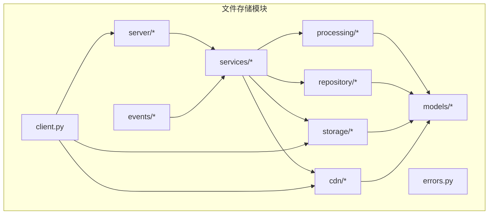
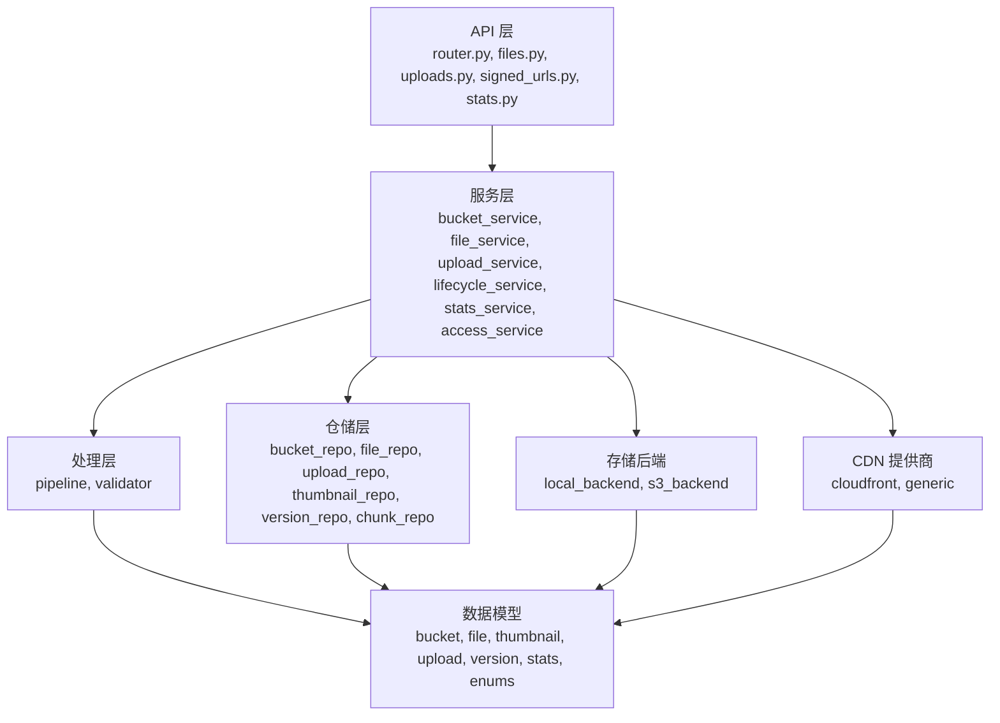
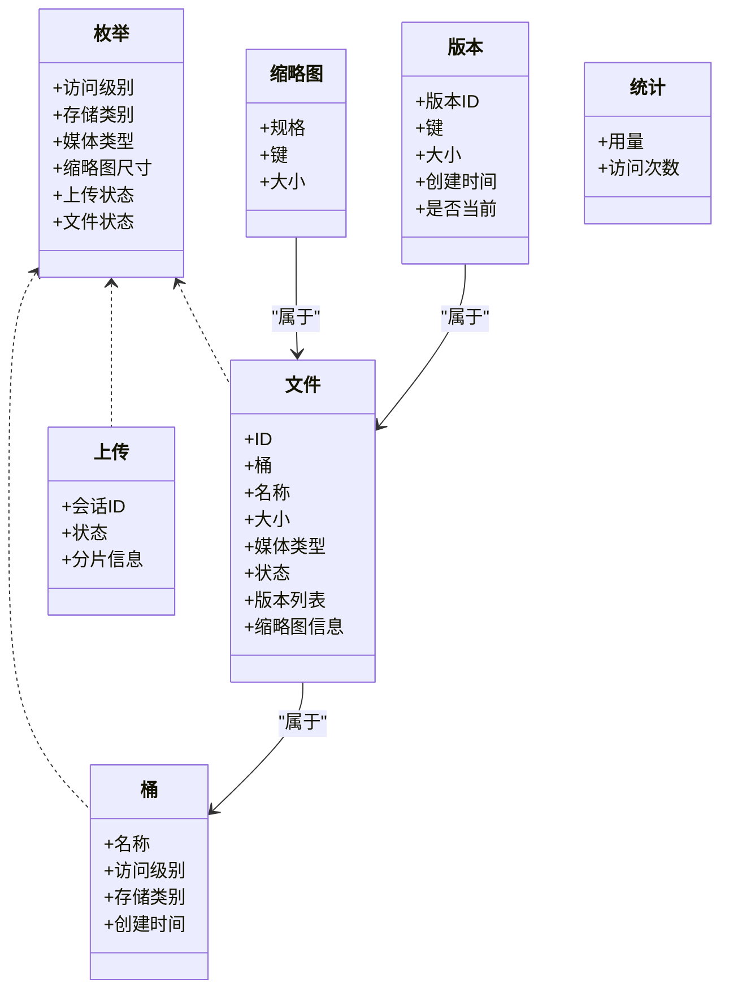
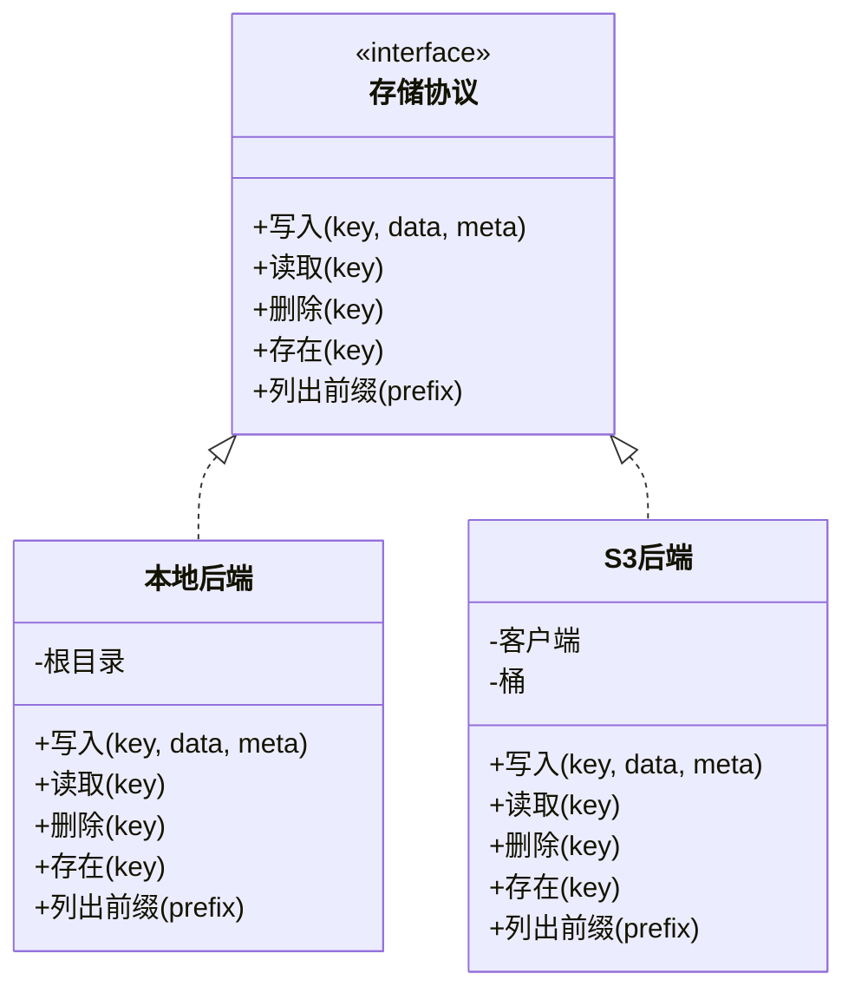
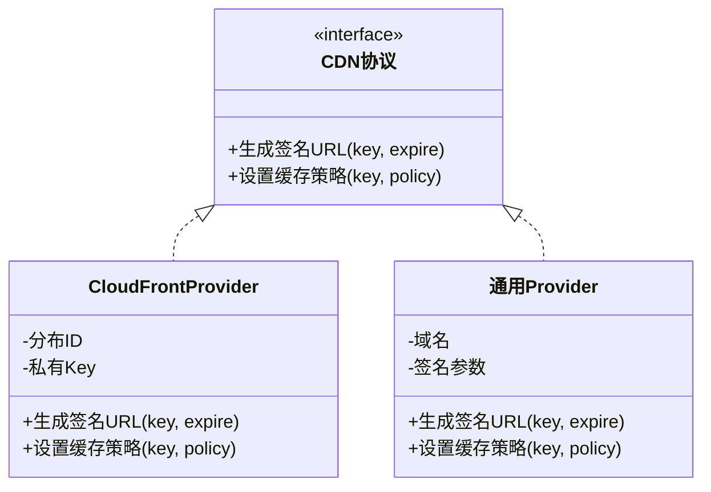
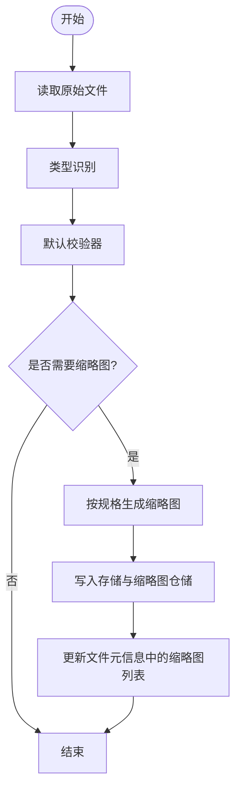
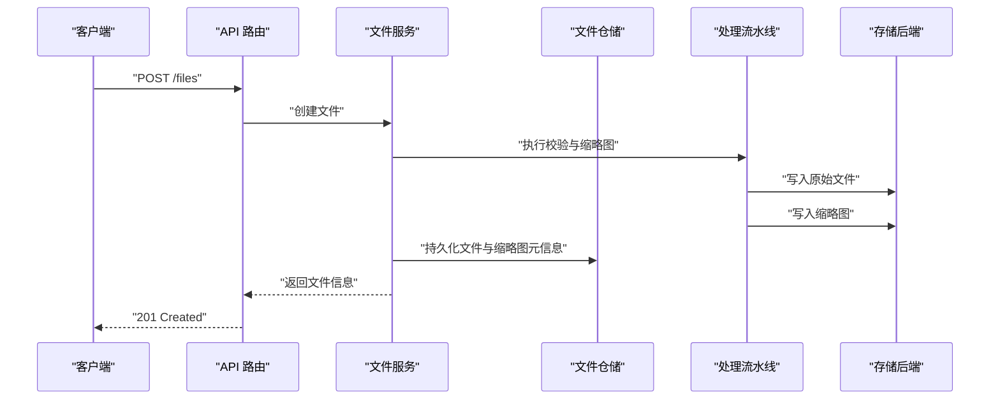
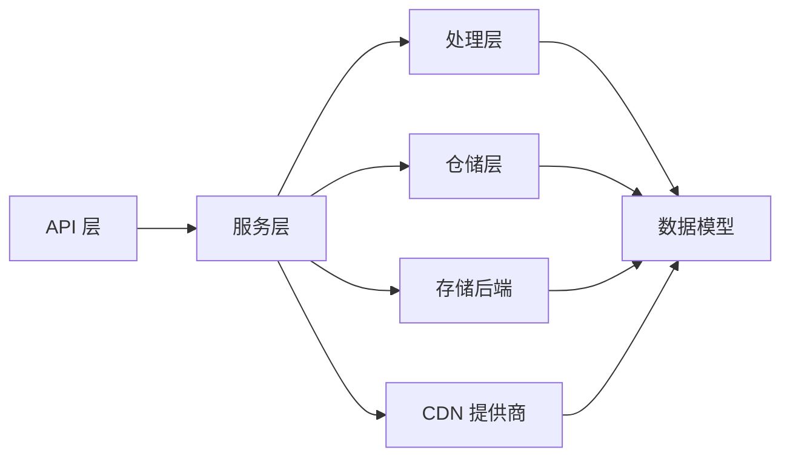

# 文件存储系统

<cite>
**本文引用的文件**
- [README.md](file://README.md)
- [src/taolib/testing/file_storage/__init__.py](file://src/taolib/testing/file_storage/__init__.py)
- [src/taolib/testing/file_storage/client.py](file://src/taolib/testing/file_storage/client.py)
- [src/taolib/testing/file_storage/errors.py](file://src/taolib/testing/file_storage/errors.py)
- [src/taolib/testing/file_storage/models/__init__.py](file://src/taolib/testing/file_storage/models/__init__.py)
- [src/taolib/testing/file_storage/models/enums.py](file://src/taolib/testing/file_storage/models/enums.py)
- [src/taolib/testing/file_storage/models/bucket.py](file://src/taolib/testing/file_storage/models/bucket.py)
- [src/taolib/testing/file_storage/models/file.py](file://src/taolib/testing/file_storage/models/file.py)
- [src/taolib/testing/file_storage/models/thumbnail.py](file://src/taolib/testing/file_storage/models/thumbnail.py)
- [src/taolib/testing/file_storage/models/upload.py](file://src/taolib/testing/file_storage/models/upload.py)
- [src/taolib/testing/file_storage/models/stats.py](file://src/taolib/testing/file_storage/models/stats.py)
- [src/taolib/testing/file_storage/models/version.py](file://src/taolib/testing/file_storage/models/version.py)
- [src/taolib/testing/file_storage/storage/__init__.py](file://src/taolib/testing/file_storage/storage/__init__.py)
- [src/taolib/testing/file_storage/storage/local_backend.py](file://src/taolib/testing/file_storage/storage/local_backend.py)
- [src/taolib/testing/file_storage/storage/s3_backend.py](file://src/taolib/testing/file_storage/storage/s3_backend.py)
- [src/taolib/testing/file_storage/storage/protocols.py](file://src/taolib/testing/file_storage/storage/protocols.py)
- [src/taolib/testing/file_storage/cdn/__init__.py](file://src/taolib/testing/file_storage/cdn/__init__.py)
- [src/taolib/testing/file_storage/cdn/cloudfront.py](file://src/taolib/testing/file_storage/cdn/cloudfront.py)
- [src/taolib/testing/file_storage/cdn/generic.py](file://src/taolib/testing/file_storage/cdn/generic.py)
- [src/taolib/testing/file_storage/cdn/protocols.py](file://src/taolib/testing/file_storage/cdn/protocols.py)
- [src/taolib/testing/file_storage/processing/__init__.py](file://src/taolib/testing/file_storage/processing/__init__.py)
- [src/taolib/testing/file_storage/processing/pipeline.py](file://src/taolib/testing/file_storage/processing/pipeline.py)
- [src/taolib/testing/file_storage/processing/validator.py](file://src/taolib/testing/file_storage/processing/validator.py)
- [src/taolib/testing/file_storage/processing/protocols.py](file://src/taolib/testing/file_storage/processing/protocols.py)
- [src/taolib/testing/file_storage/repository/__init__.py](file://src/taolib/testing/file_storage/repository/__init__.py)
- [src/taolib/testing/file_storage/repository/bucket_repo.py](file://src/taolib/testing/file_storage/repository/bucket_repo.py)
- [src/taolib/testing/file_storage/repository/chunk_repo.py](file://src/taolib/testing/file_storage/repository/chunk_repo.py)
- [src/taolib/testing/file_storage/repository/file_repo.py](file://src/taolib/testing/file_storage/repository/file_repo.py)
- [src/taolib/testing/file_storage/repository/thumbnail_repo.py](file://src/taolib/testing/file_storage/repository/thumbnail_repo.py)
- [src/taolib/testing/file_storage/repository/upload_repo.py](file://src/taolib/testing/file_storage/repository/upload_repo.py)
- [src/taolib/testing/file_storage/repository/version_repo.py](file://src/taolib/testing/file_storage/repository/version_repo.py)
- [src/taolib/testing/file_storage/services/__init__.py](file://src/taolib/testing/file_storage/services/__init__.py)
- [src/taolib/testing/file_storage/services/access_service.py](file://src/taolib/testing/file_storage/services/access_service.py)
- [src/taolib/testing/file_storage/services/bucket_service.py](file://src/taolib/testing/file_storage/services/bucket_service.py)
- [src/taolib/testing/file_storage/services/file_service.py](file://src/taolib/testing/file_storage/services/file_service.py)
- [src/taolib/testing/file_storage/services/lifecycle_service.py](file://src/taolib/testing/file_storage/services/lifecycle_service.py)
- [src/taolib/testing/file_storage/services/stats_service.py](file://src/taolib/testing/file_storage/services/stats_service.py)
- [src/taolib/testing/file_storage/services/upload_service.py](file://src/taolib/testing/file_storage/services/upload_service.py)
- [src/taolib/testing/file_storage/server/__init__.py](file://src/taolib/testing/file_storage/server/__init__.py)
- [src/taolib/testing/file_storage/server/app.py](file://src/taolib/testing/file_storage/server/app.py)
- [src/taolib/testing/file_storage/server/config.py](file://src/taolib/testing/file_storage/server/config.py)
- [src/taolib/testing/file_storage/server/dependencies.py](file://src/taolib/testing/file_storage/server/dependencies.py)
- [src/taolib/testing/file_storage/server/main.py](file://src/taolib/testing/file_storage/server/main.py)
- [src/taolib/testing/file_storage/server/api/__init__.py](file://src/taolib/testing/file_storage/server/api/__init__.py)
- [src/taolib/testing/file_storage/server/api/router.py](file://src/taolib/testing/file_storage/server/api/router.py)
- [src/taolib/testing/file_storage/server/api/buckets.py](file://src/taolib/testing/file_storage/server/api/buckets.py)
- [src/taolib/testing/file_storage/server/api/files.py](file://src/taolib/testing/file_storage/server/api/files.py)
- [src/taolib/testing/file_storage/server/api/uploads.py](file://src/taolib/testing/file_storage/server/api/uploads.py)
- [src/taolib/testing/file_storage/server/api/signed_urls.py](file://src/taolib/testing/file_storage/server/api/signed_urls.py)
- [src/taolib/testing/file_storage/server/api/stats.py](file://src/taolib/testing/file_storage/server/api/stats.py)
- [src/taolib/testing/file_storage/events/__init__.py](file://src/taolib/testing/file_storage/events/__init__.py)
- [src/taolib/testing/file_storage/events/publisher.py](file://src/taolib/testing/file_storage/events/publisher.py)
- [src/taolib/testing/file_storage/events/types.py](file://src/taolib/testing/file_storage/events/types.py)
- [tests/testing/test_file_storage/__init__.py](file://tests/testing/test_file_storage/__init__.py)
- [tests/testing/test_file_storage/test_models.py](file://tests/testing/test_file_storage/test_models.py)
- [tests/testing/test_file_storage/test_processing.py](file://tests/testing/test_file_storage/test_processing.py)
- [tests/testing/test_file_storage/test_repository.py](file://tests/testing/test_file_storage/test_repository.py)
- [tests/testing/test_file_storage/test_services.py](file://tests/testing/test_file_storage/test_services.py)
- [tests/testing/test_file_storage/test_storage_backends.py](file://tests/testing/test_file_storage/test_storage_backends.py)
</cite>

## 目录
1. [简介](#简介)
2. [项目结构](#项目结构)
3. [核心组件](#核心组件)
4. [架构总览](#架构总览)
5. [详细组件分析](#详细组件分析)
6. [依赖关系分析](#依赖关系分析)
7. [性能考量](#性能考量)
8. [故障排除指南](#故障排除指南)
9. [结论](#结论)
10. [附录](#附录)

## 简介
本文件存储系统采用多后端存储架构，支持本地文件系统与 S3 兼容对象存储，并提供 CDN 集成能力（CloudFront 与通用 CDN Provider）。系统内置缩略图处理流水线、生命周期管理、统计与事件发布等能力，覆盖从上传到访问的完整链路。本文面向开发者与运维人员，提供架构说明、组件解析、API 参考、配置要点、性能优化与故障排除。

## 项目结构
文件存储模块位于 testing 子包中，采用“分层+协议”的组织方式：
- models：数据模型与枚举定义
- storage：存储后端抽象与实现（本地、S3）
- cdn：CDN 提供商抽象与实现（CloudFront、通用）
- processing：文件处理流水线与校验器
- repository：持久化仓储接口与实现
- services：业务服务（桶、文件、上传、生命周期、统计、访问控制）
- server：FastAPI 应用与路由（API 层）
- events：事件发布与类型
- client：对外客户端封装
- errors：统一错误类型

图表来源
- [src/taolib/testing/file_storage/server/__init__.py](file://src/taolib/testing/file_storage/server/__init__.py)
- [src/taolib/testing/file_storage/services/__init__.py](file://src/taolib/testing/file_storage/services/__init__.py)
- [src/taolib/testing/file_storage/storage/__init__.py](file://src/taolib/testing/file_storage/storage/__init__.py)
- [src/taolib/testing/file_storage/cdn/__init__.py](file://src/taolib/testing/file_storage/cdn/__init__.py)
- [src/taolib/testing/file_storage/processing/__init__.py](file://src/taolib/testing/file_storage/processing/__init__.py)
- [src/taolib/testing/file_storage/repository/__init__.py](file://src/taolib/testing/file_storage/repository/__init__.py)
- [src/taolib/testing/file_storage/events/__init__.py](file://src/taolib/testing/file_storage/events/__init__.py)
- [src/taolib/testing/file_storage/client.py](file://src/taolib/testing/file_storage/client.py)
- [src/taolib/testing/file_storage/errors.py](file://src/taolib/testing/file_storage/errors.py)

章节来源
- [README.md:1-100](file://README.md#L1-L100)
- [src/taolib/testing/file_storage/__init__.py:1-22](file://src/taolib/testing/file_storage/__init__.py#L1-L22)

## 核心组件
- 客户端 FileStorageClient：统一入口，封装桶、文件、上传、缩略图、统计、事件等操作
- 存储后端：本地文件系统与 S3 兼容对象存储，通过协议抽象解耦
- CDN 提供商：CloudFront 与通用 Provider，支持 URL 签名与缓存策略
- 处理流水线：文件类型识别、校验、缩略图生成与写入
- 仓储层：对桶、文件、上传、分片、缩略图、版本进行持久化
- 业务服务：围绕桶、文件、上传、生命周期、统计、访问控制的领域逻辑
- 事件系统：事件发布器与事件类型，用于审计与异步处理
- 错误体系：统一的存储异常类型

章节来源
- [src/taolib/testing/file_storage/client.py](file://src/taolib/testing/file_storage/client.py)
- [src/taolib/testing/file_storage/storage/protocols.py](file://src/taolib/testing/file_storage/storage/protocols.py)
- [src/taolib/testing/file_storage/cdn/protocols.py](file://src/taolib/testing/file_storage/cdn/protocols.py)
- [src/taolib/testing/file_storage/processing/pipeline.py](file://src/taolib/testing/file_storage/processing/pipeline.py)
- [src/taolib/testing/file_storage/repository/__init__.py](file://src/taolib/testing/file_storage/repository/__init__.py)
- [src/taolib/testing/file_storage/services/__init__.py](file://src/taolib/testing/file_storage/services/__init__.py)
- [src/taolib/testing/file_storage/events/publisher.py](file://src/taolib/testing/file_storage/events/publisher.py)
- [src/taolib/testing/file_storage/errors.py](file://src/taolib/testing/file_storage/errors.py)

## 架构总览
系统采用“协议 + 实现”的解耦设计，API 层通过依赖注入调用服务层，服务层协调仓储、处理与存储/CDN 后端完成业务闭环。

图表来源
- [src/taolib/testing/file_storage/server/api/router.py](file://src/taolib/testing/file_storage/server/api/router.py)
- [src/taolib/testing/file_storage/server/api/files.py](file://src/taolib/testing/file_storage/server/api/files.py)
- [src/taolib/testing/file_storage/server/api/uploads.py](file://src/taolib/testing/file_storage/server/api/uploads.py)
- [src/taolib/testing/file_storage/server/api/signed_urls.py](file://src/taolib/testing/file_storage/server/api/signed_urls.py)
- [src/taolib/testing/file_storage/server/api/stats.py](file://src/taolib/testing/file_storage/server/api/stats.py)
- [src/taolib/testing/file_storage/services/__init__.py](file://src/taolib/testing/file_storage/services/__init__.py)
- [src/taolib/testing/file_storage/repository/__init__.py](file://src/taolib/testing/file_storage/repository/__init__.py)
- [src/taolib/testing/file_storage/processing/pipeline.py](file://src/taolib/testing/file_storage/processing/pipeline.py)
- [src/taolib/testing/file_storage/storage/local_backend.py](file://src/taolib/testing/file_storage/storage/local_backend.py)
- [src/taolib/testing/file_storage/storage/s3_backend.py](file://src/taolib/testing/file_storage/storage/s3_backend.py)
- [src/taolib/testing/file_storage/cdn/cloudfront.py](file://src/taolib/testing/file_storage/cdn/cloudfront.py)
- [src/taolib/testing/file_storage/cdn/generic.py](file://src/taolib/testing/file_storage/cdn/generic.py)
- [src/taolib/testing/file_storage/models/__init__.py](file://src/taolib/testing/file_storage/models/__init__.py)

## 详细组件分析

### 数据模型与枚举
- 枚举：访问级别、存储类别、媒体类型、缩略图尺寸、上传状态、文件状态
- 桶：桶元信息、访问控制、存储类别
- 文件：文件元信息、版本、状态、缩略图信息
- 缩略图：缩略图规格与存储信息
- 上传：分片上传状态、会话信息
- 版本：文件版本历史
- 统计：存储用量、访问统计

图表来源
- [src/taolib/testing/file_storage/models/enums.py](file://src/taolib/testing/file_storage/models/enums.py)
- [src/taolib/testing/file_storage/models/bucket.py](file://src/taolib/testing/file_storage/models/bucket.py)
- [src/taolib/testing/file_storage/models/file.py](file://src/taolib/testing/file_storage/models/file.py)
- [src/taolib/testing/file_storage/models/thumbnail.py](file://src/taolib/testing/file_storage/models/thumbnail.py)
- [src/taolib/testing/file_storage/models/upload.py](file://src/taolib/testing/file_storage/models/upload.py)
- [src/taolib/testing/file_storage/models/version.py](file://src/taolib/testing/file_storage/models/version.py)
- [src/taolib/testing/file_storage/models/stats.py](file://src/taolib/testing/file_storage/models/stats.py)

章节来源
- [src/taolib/testing/file_storage/models/__init__.py:1-50](file://src/taolib/testing/file_storage/models/__init__.py#L1-L50)
- [src/taolib/testing/file_storage/models/enums.py](file://src/taolib/testing/file_storage/models/enums.py)
- [src/taolib/testing/file_storage/models/bucket.py](file://src/taolib/testing/file_storage/models/bucket.py)
- [src/taolib/testing/file_storage/models/file.py](file://src/taolib/testing/file_storage/models/file.py)
- [src/taolib/testing/file_storage/models/thumbnail.py](file://src/taolib/testing/file_storage/models/thumbnail.py)
- [src/taolib/testing/file_storage/models/upload.py](file://src/taolib/testing/file_storage/models/upload.py)
- [src/taolib/testing/file_storage/models/version.py](file://src/taolib/testing/file_storage/models/version.py)
- [src/taolib/testing/file_storage/models/stats.py](file://src/taolib/testing/file_storage/models/stats.py)

### 存储后端与协议
- 协议层：定义统一的存储接口，屏蔽本地与 S3 的差异
- 本地后端：基于文件系统，适合开发与小规模部署
- S3 后端：兼容 S3 的对象存储，适合生产与高可用场景

图表来源
- [src/taolib/testing/file_storage/storage/protocols.py](file://src/taolib/testing/file_storage/storage/protocols.py)
- [src/taolib/testing/file_storage/storage/local_backend.py](file://src/taolib/testing/file_storage/storage/local_backend.py)
- [src/taolib/testing/file_storage/storage/s3_backend.py](file://src/taolib/testing/file_storage/storage/s3_backend.py)

章节来源
- [src/taolib/testing/file_storage/storage/protocols.py](file://src/taolib/testing/file_storage/storage/protocols.py)
- [src/taolib/testing/file_storage/storage/local_backend.py](file://src/taolib/testing/file_storage/storage/local_backend.py)
- [src/taolib/testing/file_storage/storage/s3_backend.py](file://src/taolib/testing/file_storage/storage/s3_backend.py)

### CDN 集成与 URL 签名
- 协议层：定义 CDN Provider 接口，支持签名 URL 与缓存策略
- CloudFront Provider：AWS CloudFront 集成，支持受控访问与缓存头
- 通用 Provider：可适配其他 CDN 厂商

图表来源
- [src/taolib/testing/file_storage/cdn/protocols.py](file://src/taolib/testing/file_storage/cdn/protocols.py)
- [src/taolib/testing/file_storage/cdn/cloudfront.py](file://src/taolib/testing/file_storage/cdn/cloudfront.py)
- [src/taolib/testing/file_storage/cdn/generic.py](file://src/taolib/testing/file_storage/cdn/generic.py)

章节来源
- [src/taolib/testing/file_storage/cdn/protocols.py](file://src/taolib/testing/file_storage/cdn/protocols.py)
- [src/taolib/testing/file_storage/cdn/cloudfront.py](file://src/taolib/testing/file_storage/cdn/cloudfront.py)
- [src/taolib/testing/file_storage/cdn/generic.py](file://src/taolib/testing/file_storage/cdn/generic.py)

### 缩略图处理流水线
- 流水线：接收文件输入，执行类型识别与校验，按预设尺寸生成缩略图，写入存储与缩略图仓储
- 校验器：默认校验器，限制媒体类型与尺寸
- 协议：处理阶段的抽象，便于扩展新处理器

图表来源
- [src/taolib/testing/file_storage/processing/pipeline.py](file://src/taolib/testing/file_storage/processing/pipeline.py)
- [src/taolib/testing/file_storage/processing/validator.py](file://src/taolib/testing/file_storage/processing/validator.py)
- [src/taolib/testing/file_storage/processing/protocols.py](file://src/taolib/testing/file_storage/processing/protocols.py)

章节来源
- [src/taolib/testing/file_storage/processing/pipeline.py](file://src/taolib/testing/file_storage/processing/pipeline.py)
- [src/taolib/testing/file_storage/processing/validator.py](file://src/taolib/testing/file_storage/processing/validator.py)
- [src/taolib/testing/file_storage/processing/protocols.py](file://src/taolib/testing/file_storage/processing/protocols.py)

### 生命周期管理
- 生命周期服务：根据策略对旧版本、临时上传、过期缩略图进行清理
- 策略维度：时间阈值、版本数量上限、存储用量阈值
- 与统计服务配合：避免误删活跃资源

章节来源
- [src/taolib/testing/file_storage/services/lifecycle_service.py](file://src/taolib/testing/file_storage/services/lifecycle_service.py)
- [src/taolib/testing/file_storage/services/stats_service.py](file://src/taolib/testing/file_storage/services/stats_service.py)

### API 与服务层
- API 层：提供桶、文件、上传、签名 URL、统计等接口
- 服务层：封装业务规则，协调仓储、处理与存储/CDN
- 依赖注入：通过依赖工厂注入服务实例

图表来源
- [src/taolib/testing/file_storage/server/api/files.py](file://src/taolib/testing/file_storage/server/api/files.py)
- [src/taolib/testing/file_storage/services/file_service.py](file://src/taolib/testing/file_storage/services/file_service.py)
- [src/taolib/testing/file_storage/repository/file_repo.py](file://src/taolib/testing/file_storage/repository/file_repo.py)
- [src/taolib/testing/file_storage/processing/pipeline.py](file://src/taolib/testing/file_storage/processing/pipeline.py)
- [src/taolib/testing/file_storage/storage/local_backend.py](file://src/taolib/testing/file_storage/storage/local_backend.py)

章节来源
- [src/taolib/testing/file_storage/server/api/__init__.py](file://src/taolib/testing/file_storage/server/api/__init__.py)
- [src/taolib/testing/file_storage/server/api/router.py](file://src/taolib/testing/file_storage/server/api/router.py)
- [src/taolib/testing/file_storage/server/api/files.py](file://src/taolib/testing/file_storage/server/api/files.py)
- [src/taolib/testing/file_storage/server/api/uploads.py](file://src/taolib/testing/file_storage/server/api/uploads.py)
- [src/taolib/testing/file_storage/server/api/signed_urls.py](file://src/taolib/testing/file_storage/server/api/signed_urls.py)
- [src/taolib/testing/file_storage/server/api/stats.py](file://src/taolib/testing/file_storage/server/api/stats.py)
- [src/taolib/testing/file_storage/services/__init__.py](file://src/taolib/testing/file_storage/services/__init__.py)

### 事件系统
- 事件发布器：在关键节点发布事件，便于审计与异步处理
- 事件类型：定义事件载荷与触发条件

章节来源
- [src/taolib/testing/file_storage/events/publisher.py](file://src/taolib/testing/file_storage/events/publisher.py)
- [src/taolib/testing/file_storage/events/types.py](file://src/taolib/testing/file_storage/events/types.py)

## 依赖关系分析
- 低耦合：API、服务、仓储、处理、存储/CDN 通过协议解耦
- 可替换性：任意实现可替换，便于扩展新后端或 CDN
- 可观测性：事件系统贯穿关键流程，便于监控与审计

图表来源
- [src/taolib/testing/file_storage/server/api/router.py](file://src/taolib/testing/file_storage/server/api/router.py)
- [src/taolib/testing/file_storage/services/__init__.py](file://src/taolib/testing/file_storage/services/__init__.py)
- [src/taolib/testing/file_storage/repository/__init__.py](file://src/taolib/testing/file_storage/repository/__init__.py)
- [src/taolib/testing/file_storage/processing/pipeline.py](file://src/taolib/testing/file_storage/processing/pipeline.py)
- [src/taolib/testing/file_storage/storage/local_backend.py](file://src/taolib/testing/file_storage/storage/local_backend.py)
- [src/taolib/testing/file_storage/cdn/cloudfront.py](file://src/taolib/testing/file_storage/cdn/cloudfront.py)
- [src/taolib/testing/file_storage/models/__init__.py](file://src/taolib/testing/file_storage/models/__init__.py)

## 性能考量
- 并发与限流：上传与处理阶段应结合速率限制与队列
- 缓存策略：CDN 缓存头与过期时间需与版本控制策略匹配
- 分片上传：大文件采用分片上传与断点续传
- 缩略图预生成：热点资源提前生成常用尺寸缩略图
- 存储分层：热数据走高性能存储，冷数据走低频存储
- 异步处理：事件驱动的异步清理与统计更新

## 故障排除指南
- 常见错误类型：统一在错误模块中定义，便于捕获与分类处理
- 上传失败：检查校验器规则、存储权限、CDN 签名参数
- 缩略图缺失：确认处理流水线执行、存储写入成功、缩略图仓储同步
- 生命周期误删：核对策略阈值与统计服务数据
- CDN 访问失败：核对签名 URL 过期时间与缓存策略

章节来源
- [src/taolib/testing/file_storage/errors.py](file://src/taolib/testing/file_storage/errors.py)
- [src/taolib/testing/file_storage/processing/validator.py](file://src/taolib/testing/file_storage/processing/validator.py)
- [src/taolib/testing/file_storage/services/lifecycle_service.py](file://src/taolib/testing/file_storage/services/lifecycle_service.py)

## 结论
该文件存储系统通过协议抽象实现了存储与 CDN 的可插拔架构，结合处理流水线与生命周期管理，满足多场景需求。建议在生产中启用 CDN 缓存策略与事件驱动的异步处理，配合严格的校验与生命周期策略，确保性能与成本平衡。

## 附录

### API 参考（概览）
- 桶管理：创建、查询、更新、删除
- 文件管理：上传、查询、删除、版本管理
- 上传：初始化、分片上传、完成
- 签名 URL：生成带过期时间的访问链接
- 统计：用量、访问统计

章节来源
- [src/taolib/testing/file_storage/server/api/buckets.py](file://src/taolib/testing/file_storage/server/api/buckets.py)
- [src/taolib/testing/file_storage/server/api/files.py](file://src/taolib/testing/file_storage/server/api/files.py)
- [src/taolib/testing/file_storage/server/api/uploads.py](file://src/taolib/testing/file_storage/server/api/uploads.py)
- [src/taolib/testing/file_storage/server/api/signed_urls.py](file://src/taolib/testing/file_storage/server/api/signed_urls.py)
- [src/taolib/testing/file_storage/server/api/stats.py](file://src/taolib/testing/file_storage/server/api/stats.py)

### 配置示例（要点）
- 存储后端：本地/ S3 参数（路径、桶、凭证）
- CDN：CloudFront 分发 ID、私钥；或通用 Provider 的域名与签名参数
- 处理：缩略图尺寸集合、校验规则
- 生命周期：版本保留数、过期天数、用量阈值
- 事件：事件发布通道与主题

章节来源
- [src/taolib/testing/file_storage/server/config.py](file://src/taolib/testing/file_storage/server/config.py)
- [src/taolib/testing/file_storage/storage/local_backend.py](file://src/taolib/testing/file_storage/storage/local_backend.py)
- [src/taolib/testing/file_storage/storage/s3_backend.py](file://src/taolib/testing/file_storage/storage/s3_backend.py)
- [src/taolib/testing/file_storage/cdn/cloudfront.py](file://src/taolib/testing/file_storage/cdn/cloudfront.py)
- [src/taolib/testing/file_storage/cdn/generic.py](file://src/taolib/testing/file_storage/cdn/generic.py)
- [src/taolib/testing/file_storage/processing/pipeline.py](file://src/taolib/testing/file_storage/processing/pipeline.py)
- [src/taolib/testing/file_storage/services/lifecycle_service.py](file://src/taolib/testing/file_storage/services/lifecycle_service.py)

### 扩展机制
- 新存储后端：实现存储协议并在依赖注入处注册
- 新 CDN 提供商：实现 CDN 协议并接入签名与缓存策略
- 新处理阶段：实现处理协议并接入流水线
- 新事件类型：在事件类型模块中新增并发布

章节来源
- [src/taolib/testing/file_storage/storage/protocols.py](file://src/taolib/testing/file_storage/storage/protocols.py)
- [src/taolib/testing/file_storage/cdn/protocols.py](file://src/taolib/testing/file_storage/cdn/protocols.py)
- [src/taolib/testing/file_storage/processing/protocols.py](file://src/taolib/testing/file_storage/processing/protocols.py)
- [src/taolib/testing/file_storage/events/types.py](file://src/taolib/testing/file_storage/events/types.py)

### 测试与验证
- 模型与枚举：验证导入与取值正确性
- 处理流水线：验证校验与缩略图生成
- 仓储：验证 CRUD 与关联查询
- 服务：验证业务流程与边界条件
- 存储后端：验证写入、读取、删除与列举

章节来源
- [tests/testing/test_file_storage/test_models.py](file://tests/testing/test_file_storage/test_models.py)
- [tests/testing/test_file_storage/test_processing.py](file://tests/testing/test_file_storage/test_processing.py)
- [tests/testing/test_file_storage/test_repository.py](file://tests/testing/test_file_storage/test_repository.py)
- [tests/testing/test_file_storage/test_services.py](file://tests/testing/test_file_storage/test_services.py)
- [tests/testing/test_file_storage/test_storage_backends.py](file://tests/testing/test_file_storage/test_storage_backends.py)