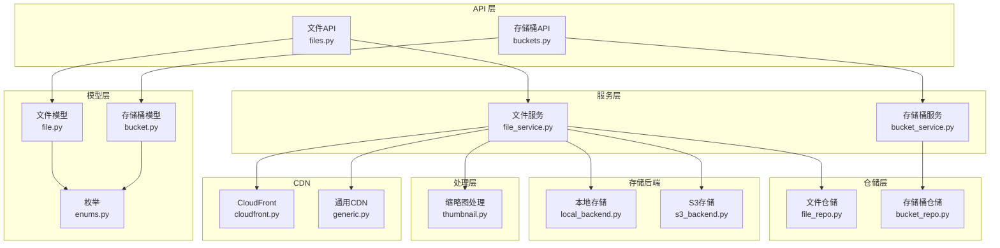
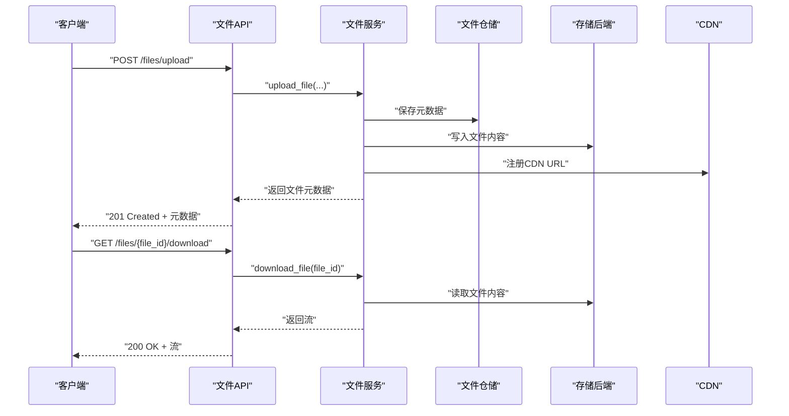
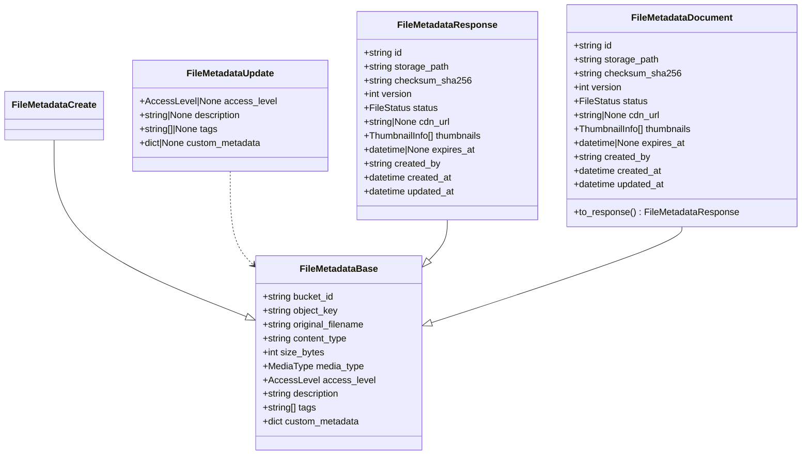
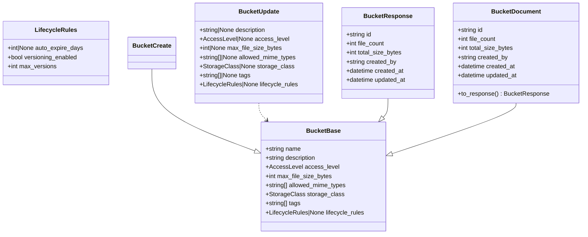
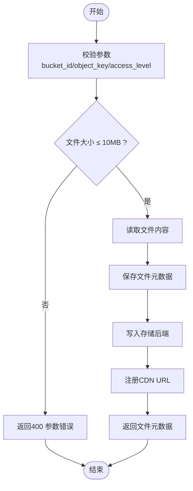
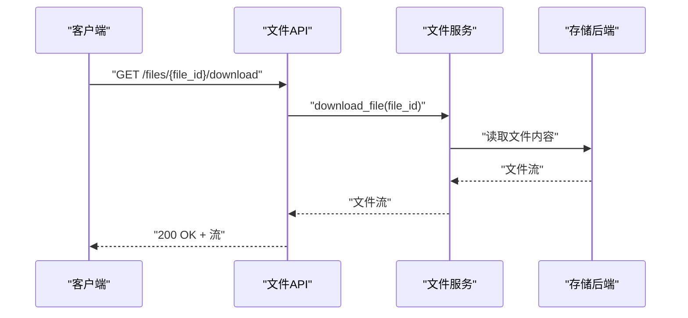
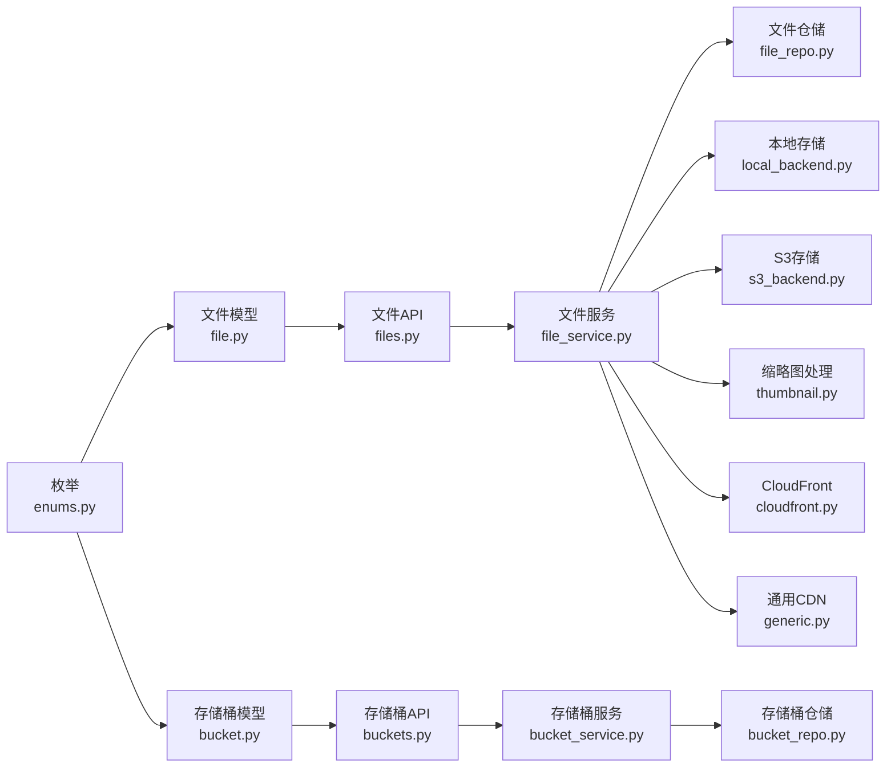

# 文件模型与API

<cite>
**本文引用的文件**
- [src/taolib/testing/file_storage/models/file.py](file://src/taolib/testing/file_storage/models/file.py)
- [src/taolib/testing/file_storage/models/bucket.py](file://src/taolib/testing/file_storage/models/bucket.py)
- [src/taolib/testing/file_storage/models/enums.py](file://src/taolib/testing/file_storage/models/enums.py)
- [src/taolib/testing/file_storage/server/api/files.py](file://src/taolib/testing/file_storage/server/api/files.py)
- [src/taolib/testing/file_storage/server/api/buckets.py](file://src/taolib/testing/file_storage/server/api/buckets.py)
- [src/taolib/testing/file_storage/services/file_service.py](file://src/taolib/testing/file_storage/services/file_service.py)
- [src/taolib/testing/file_storage/services/bucket_service.py](file://src/taolib/testing/file_storage/services/bucket_service.py)
- [src/taolib/testing/file_storage/storage/local_backend.py](file://src/taolib/testing/file_storage/storage/local_backend.py)
- [src/taolib/testing/file_storage/storage/s3_backend.py](file://src/taolib/testing/file_storage/storage/s3_backend.py)
- [src/taolib/testing/file_storage/processing/thumbnail.py](file://src/taolib/testing/file_storage/processing/thumbnail.py)
- [src/taolib/testing/file_storage/repository/file_repo.py](file://src/taolib/testing/file_storage/repository/file_repo.py)
- [src/taolib/testing/file_storage/repository/bucket_repo.py](file://src/taolib/testing/file_storage/repository/bucket_repo.py)
- [src/taolib/testing/file_storage/cdn/cloudfront.py](file://src/taolib/testing/file_storage/cdn/cloudfront.py)
- [src/taolib/testing/file_storage/cdn/generic.py](file://src/taolib/testing/file_storage/cdn/generic.py)
</cite>

## 目录
1. [简介](#简介)
2. [项目结构](#项目结构)
3. [核心组件](#核心组件)
4. [架构概览](#架构概览)
5. [详细组件分析](#详细组件分析)
6. [依赖分析](#依赖分析)
7. [性能考虑](#性能考虑)
8. [故障排除指南](#故障排除指南)
9. [结论](#结论)
10. [附录](#附录)

## 简介
本文件面向文件存储系统的模型与API，提供从数据模型到RESTful接口的完整技术文档。内容涵盖：
- 文件实体模型与存储桶模型的字段定义、业务规则与约束
- 枚举类型（访问级别、文件状态、存储类型等）的语义与取值范围
- RESTful API端点、请求/响应格式、认证授权机制
- 文件上传、下载与管理接口的使用方法与最佳实践
- 错误码定义、响应示例与SDK集成指南
- 版本管理、向后兼容性与迁移建议

## 项目结构
文件存储子系统采用分层架构，围绕“模型-服务-仓储-存储后端”组织代码，API层通过FastAPI暴露REST接口。

**图表来源**
- [src/taolib/testing/file_storage/server/api/files.py:1-350](file://src/taolib/testing/file_storage/server/api/files.py#L1-L350)
- [src/taolib/testing/file_storage/server/api/buckets.py:1-85](file://src/taolib/testing/file_storage/server/api/buckets.py#L1-L85)
- [src/taolib/testing/file_storage/services/file_service.py](file://src/taolib/testing/file_storage/services/file_service.py)
- [src/taolib/testing/file_storage/services/bucket_service.py](file://src/taolib/testing/file_storage/services/bucket_service.py)
- [src/taolib/testing/file_storage/repository/file_repo.py](file://src/taolib/testing/file_storage/repository/file_repo.py)
- [src/taolib/testing/file_storage/repository/bucket_repo.py](file://src/taolib/testing/file_storage/repository/bucket_repo.py)
- [src/taolib/testing/file_storage/storage/local_backend.py](file://src/taolib/testing/file_storage/storage/local_backend.py)
- [src/taolib/testing/file_storage/storage/s3_backend.py](file://src/taolib/testing/file_storage/storage/s3_backend.py)
- [src/taolib/testing/file_storage/processing/thumbnail.py](file://src/taolib/testing/file_storage/processing/thumbnail.py)
- [src/taolib/testing/file_storage/cdn/cloudfront.py](file://src/taolib/testing/file_storage/cdn/cloudfront.py)
- [src/taolib/testing/file_storage/cdn/generic.py](file://src/taolib/testing/file_storage/cdn/generic.py)
- [src/taolib/testing/file_storage/models/file.py:1-117](file://src/taolib/testing/file_storage/models/file.py#L1-L117)
- [src/taolib/testing/file_storage/models/bucket.py:1-108](file://src/taolib/testing/file_storage/models/bucket.py#L1-L108)
- [src/taolib/testing/file_storage/models/enums.py:1-63](file://src/taolib/testing/file_storage/models/enums.py#L1-L63)

**章节来源**
- [src/taolib/testing/file_storage/server/api/files.py:1-350](file://src/taolib/testing/file_storage/server/api/files.py#L1-L350)
- [src/taolib/testing/file_storage/server/api/buckets.py:1-85](file://src/taolib/testing/file_storage/server/api/buckets.py#L1-L85)

## 核心组件
本节概述数据模型与API的关键要素，包括字段、约束、业务规则与枚举取值。

- 文件模型（FileMetadata）
  - 基础字段：所属桶ID、对象键（桶内路径）、原始文件名、MIME类型、大小（字节）、媒体类型分类、访问级别、描述、标签、自定义元数据
  - 创建/更新/响应/文档模型分层，确保API与数据库映射清晰
  - 关键约束：对象键长度限制、大小非负、媒体类型枚举校验
  - 响应扩展：存储路径、SHA-256校验和、版本号、状态、CDN URL、缩略图列表、过期时间、创建/更新信息

- 存储桶模型（Bucket）
  - 基础字段：名称（唯一）、描述、默认访问级别、单文件最大大小、允许的MIME类型、存储类型、标签、生命周期策略
  - 生命周期策略：自动过期天数、版本控制开关、最大版本数
  - 响应扩展：文件数量、总存储大小、创建者、创建/更新时间

- 枚举类型
  - 访问级别：public（公开）、private（私有）、signed_url（签名URL）
  - 文件状态：pending（待处理）、active（活跃）、archived（归档）、deleted（已删除）
  - 上传状态：initiated（已发起）、in_progress（进行中）、completing（完成中）、completed（已完成）、aborted（已中止）、expired（已过期）
  - 存储类型：standard（标准）、infrequent_access（低频访问）、archive（归档）
  - 缩略图尺寸：small（小）、medium（中）、large（大）
  - 媒体类型：image（图片）、video（视频）、document（文档）、audio（音频）、other（其他）

**章节来源**
- [src/taolib/testing/file_storage/models/file.py:1-117](file://src/taolib/testing/file_storage/models/file.py#L1-L117)
- [src/taolib/testing/file_storage/models/bucket.py:1-108](file://src/taolib/testing/file_storage/models/bucket.py#L1-L108)
- [src/taolib/testing/file_storage/models/enums.py:1-63](file://src/taolib/testing/file_storage/models/enums.py#L1-L63)

## 架构概览
文件存储系统遵循“API-服务-仓储-存储后端”的分层设计，支持本地与S3两种存储后端，并提供缩略图生成与CDN集成能力。

**图表来源**
- [src/taolib/testing/file_storage/server/api/files.py:128-146](file://src/taolib/testing/file_storage/server/api/files.py#L128-L146)
- [src/taolib/testing/file_storage/services/file_service.py](file://src/taolib/testing/file_storage/services/file_service.py)
- [src/taolib/testing/file_storage/repository/file_repo.py](file://src/taolib/testing/file_storage/repository/file_repo.py)
- [src/taolib/testing/file_storage/storage/local_backend.py](file://src/taolib/testing/file_storage/storage/local_backend.py)
- [src/taolib/testing/file_storage/storage/s3_backend.py](file://src/taolib/testing/file_storage/storage/s3_backend.py)
- [src/taolib/testing/file_storage/cdn/cloudfront.py](file://src/taolib/testing/file_storage/cdn/cloudfront.py)

## 详细组件分析

### 文件模型类图

**图表来源**
- [src/taolib/testing/file_storage/models/file.py:19-117](file://src/taolib/testing/file_storage/models/file.py#L19-L117)

**章节来源**
- [src/taolib/testing/file_storage/models/file.py:1-117](file://src/taolib/testing/file_storage/models/file.py#L1-L117)

### 存储桶模型类图

**图表来源**
- [src/taolib/testing/file_storage/models/bucket.py:14-108](file://src/taolib/testing/file_storage/models/bucket.py#L14-L108)

**章节来源**
- [src/taolib/testing/file_storage/models/bucket.py:1-108](file://src/taolib/testing/file_storage/models/bucket.py#L1-L108)

### 文件API端点
- 列出文件
  - 方法与路径：GET /files
  - 查询参数：bucket_id、prefix、tags（逗号分隔）、media_type、skip、limit
  - 响应：文件元数据数组
  - 示例响应：见API源码注释中的JSON示例

- 简单上传
  - 方法与路径：POST /files/upload
  - 查询参数：file（multipart文件）、bucket_id、object_key、access_level
  - 限制：单文件最大10MB；超过请使用分片上传
  - 响应：文件元数据
  - 示例响应：见API源码注释中的JSON示例

- 获取文件元数据
  - 方法与路径：GET /files/{file_id}
  - 路径参数：file_id
  - 响应：文件元数据
  - 错误：404 文件不存在

- 更新文件元数据
  - 方法与路径：PATCH /files/{file_id}
  - 路径参数：file_id
  - 请求体：FileMetadataUpdate（可选字段：access_level、description、tags、custom_metadata）
  - 响应：文件元数据
  - 错误：404 文件不存在

- 删除文件
  - 方法与路径：DELETE /files/{file_id}
  - 路径参数：file_id
  - 响应：204 No Content
  - 错误：400 删除失败；404 文件不存在

- 下载文件
  - 方法与路径：GET /files/{file_id}/download
  - 路径参数：file_id
  - 响应：文件流（Content-Type为实际类型）
  - 错误：404 文件不存在

- 获取文件访问URL
  - 方法与路径：GET /files/{file_id}/url
  - 路径参数：file_id
  - 查询参数：expires_in（默认3600秒，最小60秒）
  - 响应：{"url": "..."}

**章节来源**
- [src/taolib/testing/file_storage/server/api/files.py:33-348](file://src/taolib/testing/file_storage/server/api/files.py#L33-L348)

### 存储桶API端点
- 列出所有桶
  - 方法与路径：GET /buckets
  - 查询参数：skip、limit
  - 响应：存储桶数组

- 创建桶
  - 方法与路径：POST /buckets
  - 请求体：BucketCreate
  - 响应：BucketResponse

- 获取桶详情
  - 方法与路径：GET /buckets/{bucket_id}
  - 路径参数：bucket_id
  - 响应：BucketResponse
  - 错误：404 存储桶不存在

- 更新桶配置
  - 方法与路径：PUT /buckets/{bucket_id}
  - 路径参数：bucket_id
  - 请求体：BucketUpdate
  - 响应：BucketResponse
  - 错误：404 存储桶不存在

- 删除桶
  - 方法与路径：DELETE /buckets/{bucket_id}
  - 路径参数：bucket_id
  - 查询参数：force（默认false）
  - 响应：204 No Content
  - 错误：400 删除失败；404 存储桶不存在

- 获取桶统计信息
  - 方法与路径：GET /buckets/{bucket_id}/stats
  - 路径参数：bucket_id
  - 响应：统计信息对象
  - 错误：404 存储桶不存在

**章节来源**
- [src/taolib/testing/file_storage/server/api/buckets.py:11-83](file://src/taolib/testing/file_storage/server/api/buckets.py#L11-L83)

### 处理流程与算法

#### 文件上传流程（简单上传）

**图表来源**
- [src/taolib/testing/file_storage/server/api/files.py:128-146](file://src/taolib/testing/file_storage/server/api/files.py#L128-L146)
- [src/taolib/testing/file_storage/services/file_service.py](file://src/taolib/testing/file_storage/services/file_service.py)

#### 文件下载流程（流式）

**图表来源**
- [src/taolib/testing/file_storage/server/api/files.py:297-303](file://src/taolib/testing/file_storage/server/api/files.py#L297-L303)
- [src/taolib/testing/file_storage/services/file_service.py](file://src/taolib/testing/file_storage/services/file_service.py)

## 依赖分析
- 模型依赖：文件/存储桶模型依赖枚举类型，确保字段取值合法
- API依赖：文件API依赖文件服务，存储桶API依赖存储桶服务
- 服务依赖：文件服务依赖仓储与存储后端；存储桶服务依赖仓储
- 处理与CDN：文件服务可调用缩略图生成与CDN注册逻辑

**图表来源**
- [src/taolib/testing/file_storage/models/enums.py:1-63](file://src/taolib/testing/file_storage/models/enums.py#L1-L63)
- [src/taolib/testing/file_storage/models/file.py:1-117](file://src/taolib/testing/file_storage/models/file.py#L1-L117)
- [src/taolib/testing/file_storage/models/bucket.py:1-108](file://src/taolib/testing/file_storage/models/bucket.py#L1-L108)
- [src/taolib/testing/file_storage/server/api/files.py:1-350](file://src/taolib/testing/file_storage/server/api/files.py#L1-L350)
- [src/taolib/testing/file_storage/server/api/buckets.py:1-85](file://src/taolib/testing/file_storage/server/api/buckets.py#L1-L85)
- [src/taolib/testing/file_storage/services/file_service.py](file://src/taolib/testing/file_storage/services/file_service.py)
- [src/taolib/testing/file_storage/services/bucket_service.py](file://src/taolib/testing/file_storage/services/bucket_service.py)
- [src/taolib/testing/file_storage/repository/file_repo.py](file://src/taolib/testing/file_storage/repository/file_repo.py)
- [src/taolib/testing/file_storage/repository/bucket_repo.py](file://src/taolib/testing/file_storage/repository/bucket_repo.py)
- [src/taolib/testing/file_storage/storage/local_backend.py](file://src/taolib/testing/file_storage/storage/local_backend.py)
- [src/taolib/testing/file_storage/storage/s3_backend.py](file://src/taolib/testing/file_storage/storage/s3_backend.py)
- [src/taolib/testing/file_storage/processing/thumbnail.py](file://src/taolib/testing/file_storage/processing/thumbnail.py)
- [src/taolib/testing/file_storage/cdn/cloudfront.py](file://src/taolib/testing/file_storage/cdn/cloudfront.py)
- [src/taolib/testing/file_storage/cdn/generic.py](file://src/taolib/testing/file_storage/cdn/generic.py)

**章节来源**
- [src/taolib/testing/file_storage/models/enums.py:1-63](file://src/taolib/testing/file_storage/models/enums.py#L1-L63)
- [src/taolib/testing/file_storage/models/file.py:1-117](file://src/taolib/testing/file_storage/models/file.py#L1-L117)
- [src/taolib/testing/file_storage/models/bucket.py:1-108](file://src/taolib/testing/file_storage/models/bucket.py#L1-L108)
- [src/taolib/testing/file_storage/server/api/files.py:1-350](file://src/taolib/testing/file_storage/server/api/files.py#L1-L350)
- [src/taolib/testing/file_storage/server/api/buckets.py:1-83](file://src/taolib/testing/file_storage/server/api/buckets.py#L1-L83)

## 性能考虑
- 分片上传：对于大于10MB的文件，建议使用分片上传接口（需在API中实现），以提升稳定性与并发效率
- 缓存策略：对频繁访问的文件元数据与CDN URL进行缓存，减少数据库与外部服务调用
- 并发控制：上传/下载接口应限制并发连接数，避免存储后端压力过大
- 存储类型选择：根据访问频率选择合适的存储类型（标准/低频/归档），平衡成本与性能
- 缩略图生成：异步生成缩略图，避免阻塞主流程

## 故障排除指南
- 400 参数错误
  - 简单上传时文件过大或缺少必要参数
  - 存储桶删除失败（如存在未清理的版本或依赖）
- 404 资源不存在
  - 文件或存储桶ID无效
  - 获取URL时文件未找到
- 403 权限不足
  - 访问级别为私有时，需要有效的签名URL或认证
- 500 内部错误
  - 存储后端异常、CDN注册失败或缩略图生成异常

**章节来源**
- [src/taolib/testing/file_storage/server/api/files.py:127-146](file://src/taolib/testing/file_storage/server/api/files.py#L127-L146)
- [src/taolib/testing/file_storage/server/api/buckets.py:60-71](file://src/taolib/testing/file_storage/server/api/buckets.py#L60-L71)

## 结论
本文档提供了文件存储系统的完整模型与API说明，覆盖了数据模型、枚举定义、端点规范、处理流程与错误码。通过清晰的分层架构与可扩展的存储后端，系统能够满足多场景下的文件管理需求。建议在生产环境中结合缓存、CDN与监控体系，持续优化性能与可靠性。

## 附录

### API参数与响应示例
- 列出文件
  - 请求：GET /files?bucket_id={id}&prefix={path}&tags=a,b&media_type=image&skip=0&limit=100
  - 响应：文件元数据数组（见API源码注释）
- 简单上传
  - 请求：POST /files/upload?bucket_id={id}&object_key={key}&access_level=public
  - 响应：文件元数据（见API源码注释）
- 获取文件元数据
  - 请求：GET /files/{file_id}
  - 响应：文件元数据
- 更新文件元数据
  - 请求：PATCH /files/{file_id}
  - 请求体：{"tags": ["a","b"],"description":"desc","access_level":"public"}
  - 响应：更新后的文件元数据
- 删除文件
  - 请求：DELETE /files/{file_id}
  - 响应：204 No Content
- 下载文件
  - 请求：GET /files/{file_id}/download
  - 响应：文件流
- 获取文件访问URL
  - 请求：GET /files/{file_id}/url?expires_in=3600
  - 响应：{"url":"..."}
- 列出存储桶
  - 请求：GET /buckets?skip=0&limit=100
  - 响应：存储桶数组
- 创建存储桶
  - 请求：POST /buckets
  - 请求体：BucketCreate
  - 响应：BucketResponse
- 获取存储桶详情
  - 请求：GET /buckets/{bucket_id}
  - 响应：BucketResponse
- 更新存储桶配置
  - 请求：PUT /buckets/{bucket_id}
  - 请求体：BucketUpdate
  - 响应：BucketResponse
- 删除存储桶
  - 请求：DELETE /buckets/{bucket_id}?force=false
  - 响应：204 No Content
- 获取桶统计信息
  - 请求：GET /buckets/{bucket_id}/stats
  - 响应：统计信息对象

**章节来源**
- [src/taolib/testing/file_storage/server/api/files.py:33-348](file://src/taolib/testing/file_storage/server/api/files.py#L33-L348)
- [src/taolib/testing/file_storage/server/api/buckets.py:11-83](file://src/taolib/testing/file_storage/server/api/buckets.py#L11-L83)

### SDK使用指南与集成最佳实践
- 客户端SDK
  - 使用HTTP客户端封装常见操作（上传、下载、管理）
  - 实现重试与指数退避，处理网络抖动
  - 对于大文件，优先使用分片上传（需按API扩展）
- 认证与授权
  - 私有文件访问需使用签名URL或API密钥
  - 在网关层统一鉴权，避免在服务层重复校验
- 监控与日志
  - 记录关键指标（QPS、延迟、错误率、存储用量）
  - 对敏感操作（删除）增加审计日志
- 版本管理与迁移
  - API版本化：通过路径前缀（/v1/...）隔离变更
  - 向后兼容：新增字段使用默认值，不破坏现有客户端
  - 迁移策略：灰度发布、回滚预案、数据一致性检查