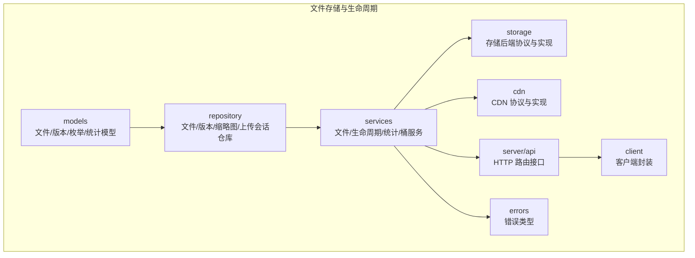
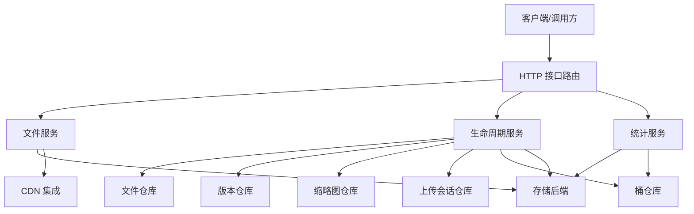
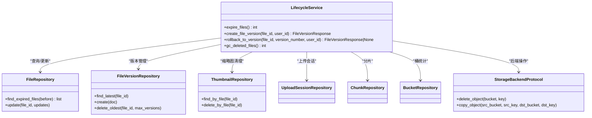
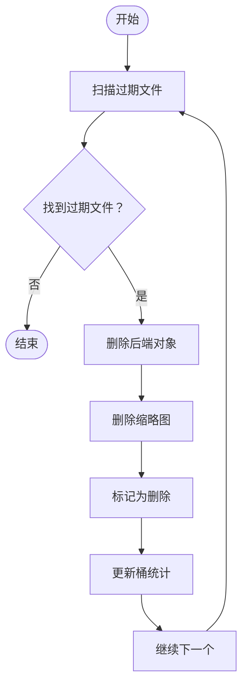
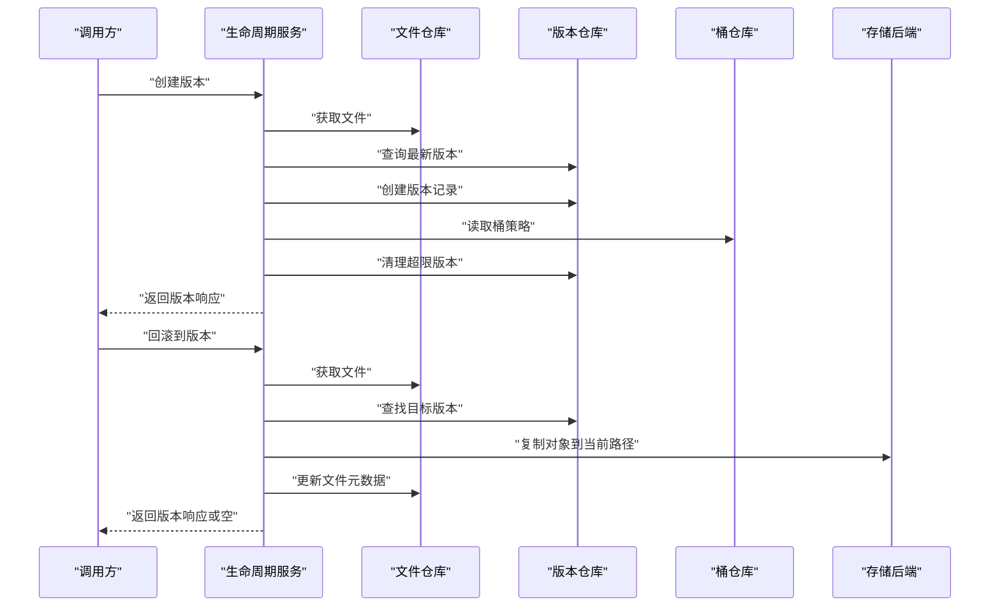
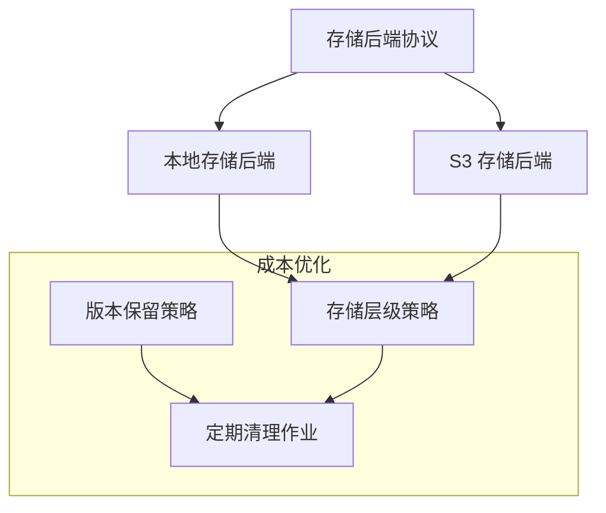
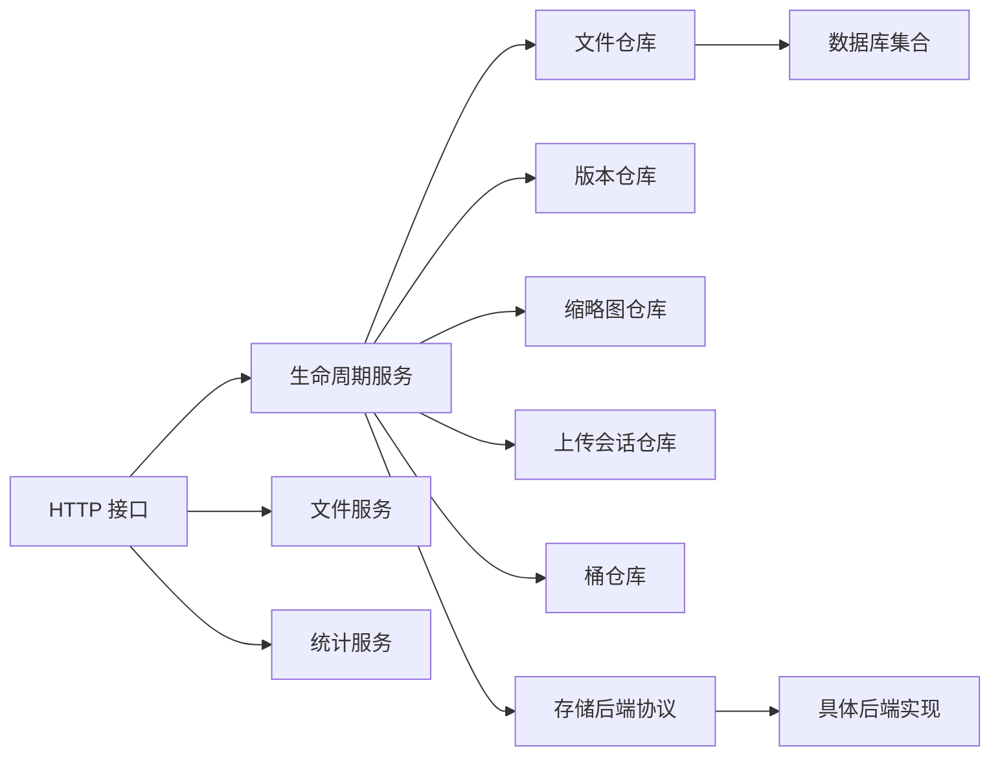

# 生命周期管理

<cite>
**本文引用的文件**
- [生命周期服务](file://src/taolib/testing/file_storage/services/lifecycle_service.py)
- [文件元数据模型](file://src/taolib/testing/file_storage/models/file.py)
- [文件仓库](file://src/taolib/testing/file_storage/repository/file_repo.py)
- [枚举定义](file://src/taolib/testing/file_storage/models/enums.py)
- [存储后端协议](file://src/taolib/testing/file_storage/storage/protocols.py)
- [本地存储后端](file://src/taolib/testing/file_storage/storage/local_backend.py)
- [S3 存储后端](file://src/taolib/testing/file_storage/storage/s3_backend.py)
- [CDN 协议](file://src/taolib/testing/file_storage/cdn/protocols.py)
- [CloudFront 集成](file://src/taolib/testing/file_storage/cdn/cloudfront.py)
- [通用 CDN](file://src/taolib/testing/file_storage/cdn/generic.py)
- [文件服务](file://src/taolib/testing/file_storage/services/file_service.py)
- [桶服务](file://src/taolib/testing/file_storage/services/bucket_service.py)
- [统计服务](file://src/taolib/testing/file_storage/services/stats_service.py)
- [文件存储错误](file://src/taolib/testing/file_storage/errors.py)
- [文件存储客户端](file://src/taolib/testing/file_storage/client.py)
- [文件存储 API 路由](file://src/taolib/testing/file_storage/server/api/files.py)
- [桶 API 路由](file://src/taolib/testing/file_storage/server/api/buckets.py)
- [统计 API 路由](file://src/taolib/testing/file_storage/server/api/stats.py)
- [生命周期配置示例](file://examples/multi_agent_example.py)
</cite>

## 目录
1. [简介](#简介)
2. [项目结构](#项目结构)
3. [核心组件](#核心组件)
4. [架构总览](#架构总览)
5. [详细组件分析](#详细组件分析)
6. [依赖关系分析](#依赖关系分析)
7. [性能考虑](#性能考虑)
8. [故障排除指南](#故障排除指南)
9. [结论](#结论)
10. [附录](#附录)

## 简介
本技术文档围绕文件生命周期管理系统进行深入解析，涵盖文件从创建、存储、归档到删除的全生命周期管理机制。重点包括：
- 文件状态转换与过期检测机制
- 自动清理策略与批量清理作业
- 版本管理与回滚能力
- 存储成本优化与数据保留策略
- 存储统计分析、容量监控与成本控制
- 与存储后端的集成方式、备份与灾难恢复方案
- 生命周期配置示例与合规性管理建议

## 项目结构
文件存储与生命周期管理相关的核心模块位于 `src/taolib/testing/file_storage` 目录下，采用分层设计：
- models：定义文件元数据、枚举、版本、缩略图等数据模型
- repository：提供对文件、版本、缩略图、上传会话等实体的持久化访问
- services：实现业务逻辑，如文件服务、生命周期服务、统计服务等
- storage：抽象存储后端协议并提供本地与 S3 后端实现
- cdn：CDN 集成协议与具体实现
- server/api：HTTP 接口路由
- client：对外客户端封装
- errors：统一错误类型

**图表来源**
- [文件元数据模型:1-117](file://src/taolib/testing/file_storage/models/file.py#L1-L117)
- [文件仓库:1-128](file://src/taolib/testing/file_storage/repository/file_repo.py#L1-L128)
- [生命周期服务:1-171](file://src/taolib/testing/file_storage/services/lifecycle_service.py#L1-L171)
- [存储后端协议](file://src/taolib/testing/file_storage/storage/protocols.py)
- [本地存储后端](file://src/taolib/testing/file_storage/storage/local_backend.py)
- [S3 存储后端](file://src/taolib/testing/file_storage/storage/s3_backend.py)
- [CDN 协议](file://src/taolib/testing/file_storage/cdn/protocols.py)
- [CloudFront 集成](file://src/taolib/testing/file_storage/cdn/cloudfront.py)
- [通用 CDN](file://src/taolib/testing/file_storage/cdn/generic.py)
- [文件存储 API 路由](file://src/taolib/testing/file_storage/server/api/files.py)
- [文件存储客户端](file://src/taolib/testing/file_storage/client.py)
- [文件存储错误](file://src/taolib/testing/file_storage/errors.py)

**章节来源**
- [文件元数据模型:1-117](file://src/taolib/testing/file_storage/models/file.py#L1-L117)
- [文件仓库:1-128](file://src/taolib/testing/file_storage/repository/file_repo.py#L1-L128)
- [生命周期服务:1-171](file://src/taolib/testing/file_storage/services/lifecycle_service.py#L1-L171)

## 核心组件
- 生命周期服务：负责过期文件处理、版本创建与回滚、已删除文件的垃圾回收
- 文件仓库：提供按桶、前缀、标签、媒体类型查询，以及过期文件检索与索引管理
- 存储后端：通过协议抽象支持本地与 S3 等后端，提供对象复制、删除等操作
- CDN 集成：提供 CDN 访问 URL 生成与管理
- 统计服务：聚合存储统计信息，支撑容量监控与成本分析
- 错误体系：统一异常类型，便于上层捕获与处理

**章节来源**
- [生命周期服务:23-171](file://src/taolib/testing/file_storage/services/lifecycle_service.py#L23-L171)
- [文件仓库:14-128](file://src/taolib/testing/file_storage/repository/file_repo.py#L14-L128)
- [存储后端协议](file://src/taolib/testing/file_storage/storage/protocols.py)
- [CDN 协议](file://src/taolib/testing/file_storage/cdn/protocols.py)
- [统计服务](file://src/taolib/testing/file_storage/services/stats_service.py)

## 架构总览
生命周期管理在系统中的交互关系如下：

**图表来源**
- [生命周期服务:23-43](file://src/taolib/testing/file_storage/services/lifecycle_service.py#L23-L43)
- [文件仓库:14-72](file://src/taolib/testing/file_storage/repository/file_repo.py#L14-L72)
- [文件服务](file://src/taolib/testing/file_storage/services/file_service.py)
- [统计服务](file://src/taolib/testing/file_storage/services/stats_service.py)
- [存储后端协议](file://src/taolib/testing/file_storage/storage/protocols.py)
- [CDN 协议](file://src/taolib/testing/file_storage/cdn/protocols.py)
- [文件存储 API 路由](file://src/taolib/testing/file_storage/server/api/files.py)

## 详细组件分析

### 生命周期服务（LifecycleService）
职责与流程：
- 过期文件处理：扫描过期且状态为活跃的文件，删除后端对象与缩略图，标记为删除，并更新桶统计
- 版本管理：创建文件版本快照，遵循桶级版本保留策略，自动清理最旧版本
- 回滚功能：将文件回滚到指定历史版本，复制对应存储对象并更新元数据
- 垃圾回收：清理已标记为删除的文件记录及其缩略图

**图表来源**
- [生命周期服务:23-171](file://src/taolib/testing/file_storage/services/lifecycle_service.py#L23-L171)
- [文件仓库:14-72](file://src/taolib/testing/file_storage/repository/file_repo.py#L14-L72)

**章节来源**
- [生命周期服务:44-171](file://src/taolib/testing/file_storage/services/lifecycle_service.py#L44-L171)

### 文件状态与过期检测
- 状态枚举：文件状态包括待处理、活跃、归档、删除，用于区分不同生命周期阶段
- 过期检测：通过文件元数据中的过期时间字段与当前时间比较，筛选出需要清理的文件
- 索引优化：针对状态、标签、媒体类型、过期时间等字段建立索引，提升查询效率

**图表来源**
- [文件仓库:59-72](file://src/taolib/testing/file_storage/repository/file_repo.py#L59-L72)
- [生命周期服务:44-73](file://src/taolib/testing/file_storage/services/lifecycle_service.py#L44-L73)
- [枚举定义:17-24](file://src/taolib/testing/file_storage/models/enums.py#L17-L24)

**章节来源**
- [文件仓库:59-72](file://src/taolib/testing/file_storage/repository/file_repo.py#L59-L72)
- [文件元数据模型:53-87](file://src/taolib/testing/file_storage/models/file.py#L53-L87)
- [枚举定义:17-24](file://src/taolib/testing/file_storage/models/enums.py#L17-L24)

### 版本管理与回滚
- 版本创建：基于最新版本号生成新版本，写入版本记录，并根据桶策略清理超限版本
- 回滚流程：定位目标版本，复制存储对象到当前路径，更新文件元数据中的版本号与校验信息

**图表来源**
- [生命周期服务:75-156](file://src/taolib/testing/file_storage/services/lifecycle_service.py#L75-L156)
- [文件仓库:14-18](file://src/taolib/testing/file_storage/repository/file_repo.py#L14-L18)
- [文件元数据模型:53-87](file://src/taolib/testing/file_storage/models/file.py#L53-L87)

**章节来源**
- [生命周期服务:75-156](file://src/taolib/testing/file_storage/services/lifecycle_service.py#L75-L156)

### 存储后端集成与成本优化
- 后端协议：通过统一协议抽象，支持本地与 S3 等多种后端，便于替换与扩展
- 成本优化策略：
  - 使用存储类别（标准、低频访问、归档）配合生命周期规则，自动降级存储层级以降低成本
  - 结合版本保留策略，避免冗余版本占用空间
  - 定期执行过期清理与垃圾回收，释放存储空间
- CDN 集成：通过 CDN 提升访问性能，减少源站压力，结合签名 URL 控制访问权限

**图表来源**
- [存储后端协议](file://src/taolib/testing/file_storage/storage/protocols.py)
- [本地存储后端](file://src/taolib/testing/file_storage/storage/local_backend.py)
- [S3 存储后端](file://src/taolib/testing/file_storage/storage/s3_backend.py)
- [枚举定义:37-43](file://src/taolib/testing/file_storage/models/enums.py#L37-L43)

**章节来源**
- [存储后端协议](file://src/taolib/testing/file_storage/storage/protocols.py)
- [本地存储后端](file://src/taolib/testing/file_storage/storage/local_backend.py)
- [S3 存储后端](file://src/taolib/testing/file_storage/storage/s3_backend.py)
- [枚举定义:37-43](file://src/taolib/testing/file_storage/models/enums.py#L37-L43)

### 统计分析、容量监控与成本控制
- 统计聚合：统计服务汇总文件数量、总大小、按桶/按状态/按媒体类型的分布
- 容量监控：结合桶统计与过期清理，持续跟踪容量变化趋势
- 成本控制：通过存储层级策略与版本策略，降低长期存储成本；定期评估与调整策略

**章节来源**
- [统计服务](file://src/taolib/testing/file_storage/services/stats_service.py)
- [生命周期服务:66-71](file://src/taolib/testing/file_storage/services/lifecycle_service.py#L66-L71)

### API 与客户端集成
- HTTP 接口：提供文件、桶、统计、上传等 API 路由，供前端或外部系统调用
- 客户端封装：提供统一的客户端接口，简化调用流程
- 错误处理：统一错误类型，便于上层捕获与处理

**章节来源**
- [文件存储 API 路由](file://src/taolib/testing/file_storage/server/api/files.py)
- [桶 API 路由](file://src/taolib/testing/file_storage/server/api/buckets.py)
- [统计 API 路由](file://src/taolib/testing/file_storage/server/api/stats.py)
- [文件存储客户端](file://src/taolib/testing/file_storage/client.py)
- [文件存储错误](file://src/taolib/testing/file_storage/errors.py)

## 依赖关系分析
生命周期管理涉及多个模块之间的耦合与协作：
- 生命周期服务依赖仓库层完成数据访问，依赖存储后端执行对象操作
- 文件仓库依赖数据库集合与索引，确保查询性能
- 服务层依赖协议层实现跨后端兼容
- API 层依赖服务层提供业务能力

**图表来源**
- [生命周期服务:23-43](file://src/taolib/testing/file_storage/services/lifecycle_service.py#L23-L43)
- [文件仓库:14-18](file://src/taolib/testing/file_storage/repository/file_repo.py#L14-L18)
- [存储后端协议](file://src/taolib/testing/file_storage/storage/protocols.py)

**章节来源**
- [生命周期服务:23-43](file://src/taolib/testing/file_storage/services/lifecycle_service.py#L23-L43)
- [文件仓库:14-18](file://src/taolib/testing/file_storage/repository/file_repo.py#L14-L18)

## 性能考虑
- 查询优化：为常用过滤字段（状态、标签、媒体类型、过期时间）建立索引，提升检索效率
- 批量处理：过期清理与垃圾回收采用批量处理，限制单次处理数量，避免阻塞
- 存储层级：合理选择存储类别，结合生命周期规则自动降级，降低长期存储成本
- CDN 加速：通过 CDN 缓存热点内容，减少源站负载

**章节来源**
- [文件仓库:116-126](file://src/taolib/testing/file_storage/repository/file_repo.py#L116-L126)
- [生命周期服务:44-73](file://src/taolib/testing/file_storage/services/lifecycle_service.py#L44-L73)
- [枚举定义:37-43](file://src/taolib/testing/file_storage/models/enums.py#L37-L43)

## 故障排除指南
- 文件不存在：当目标文件不存在时抛出相应错误，需检查文件 ID 与存储路径
- 过期清理失败：检查后端连接、权限与对象是否存在；确认过期时间是否正确设置
- 版本回滚异常：验证目标版本是否存在，存储路径是否有效
- 统计不准确：检查索引是否生效，清理作业是否按时执行

**章节来源**
- [文件存储错误](file://src/taolib/testing/file_storage/errors.py)
- [生命周期服务:82-83](file://src/taolib/testing/file_storage/services/lifecycle_service.py#L82-L83)
- [生命周期服务:123-124](file://src/taolib/testing/file_storage/services/lifecycle_service.py#L123-L124)

## 结论
生命周期管理系统通过清晰的状态流转、完善的过期检测与清理机制、版本管理与回滚能力，以及与存储后端的灵活集成，实现了高效、可控的文件全生命周期管理。结合统计分析与成本优化策略，能够有效降低存储成本并保障数据安全与合规。

## 附录

### 生命周期配置示例
- 存储类别与生命周期规则：根据数据访问频率选择标准、低频或归档存储类别，并设置自动降级与删除规则
- 版本保留策略：为关键业务设置最大版本数，自动清理最旧版本
- 过期时间策略：为临时文件设置合理的过期时间，结合定期清理作业自动回收

**章节来源**
- [生命周期服务:103-113](file://src/taolib/testing/file_storage/services/lifecycle_service.py#L103-L113)
- [枚举定义:37-43](file://src/taolib/testing/file_storage/models/enums.py#L37-L43)

### 自定义清理规则
- 基于标签与媒体类型的批量清理：通过仓库层提供的查询方法，筛选满足条件的文件并执行清理
- 定时任务调度：结合定时任务框架，定期执行过期清理与垃圾回收作业

**章节来源**
- [文件仓库:74-108](file://src/taolib/testing/file_storage/repository/file_repo.py#L74-L108)
- [生命周期服务:158-168](file://src/taolib/testing/file_storage/services/lifecycle_service.py#L158-L168)

### 合规性管理方案
- 访问控制：通过访问级别枚举与签名 URL，控制文件访问范围
- 审计日志：结合审计模块记录关键操作，满足合规审计要求
- 数据保留：根据法规要求设置数据保留期限与删除策略

**章节来源**
- [枚举定义:9-14](file://src/taolib/testing/file_storage/models/enums.py#L9-L14)
- [文件元数据模型:30-32](file://src/taolib/testing/file_storage/models/file.py#L30-L32)

### 备份策略与灾难恢复
- 多后端备份：同时向本地与 S3 等多个后端写入，确保数据冗余
- 定期快照：结合版本管理创建快照，支持快速回滚
- 灾难恢复演练：定期验证备份数据的可用性与恢复流程

**章节来源**
- [生命周期服务:135-143](file://src/taolib/testing/file_storage/services/lifecycle_service.py#L135-L143)
- [存储后端协议](file://src/taolib/testing/file_storage/storage/protocols.py)