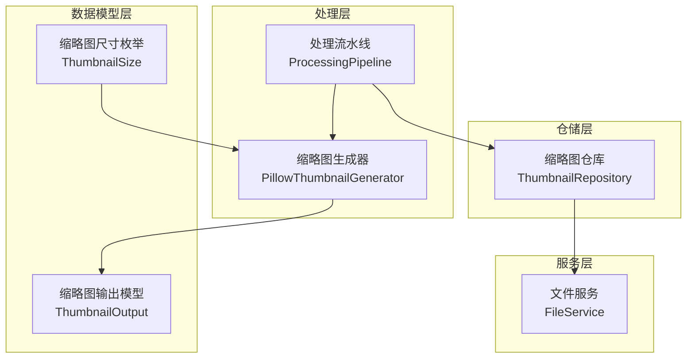
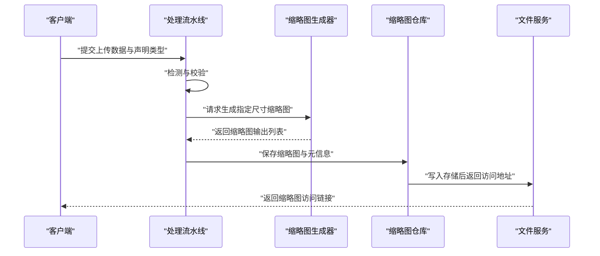
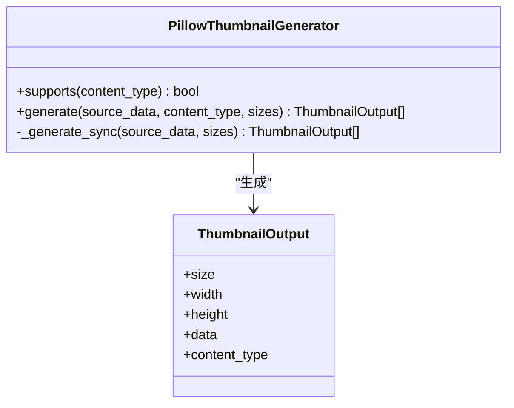
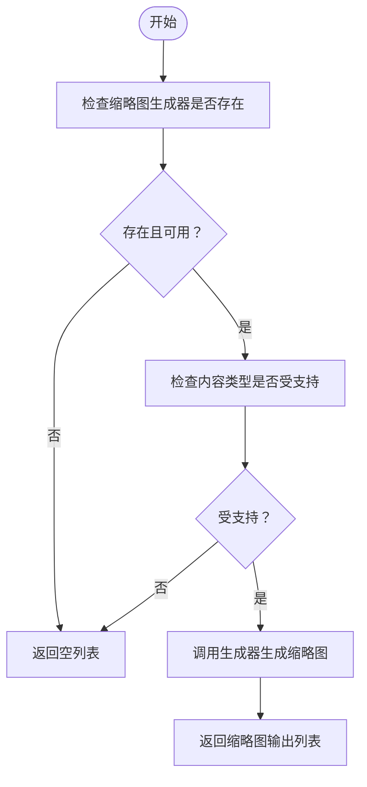
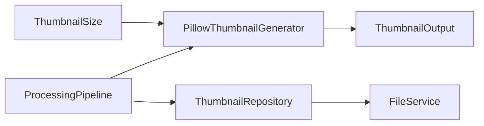

# 缩略图处理

<cite>
**本文引用的文件**
- [src/taolib/testing/file_storage/processing/thumbnail.py](file://src/taolib/testing/file_storage/processing/thumbnail.py)
- [src/taolib/testing/file_storage/processing/pipeline.py](file://src/taolib/testing/file_storage/processing/pipeline.py)
- [src/taolib/testing/file_storage/models/thumbnail.py](file://src/taolib/testing/file_storage/models/thumbnail.py)
- [src/taolib/testing/file_storage/models/enums.py](file://src/taolib/testing/file_storage/models/enums.py)
- [src/taolib/testing/file_storage/repository/thumbnail_repo.py](file://src/taolib/testing/file_storage/repository/thumbnail_repo.py)
- [src/taolib/testing/file_storage/services/file_service.py](file://src/taolib/testing/file_storage/services/file_service.py)
- [tests/testing/test_file_storage/test_processing.py](file://tests/testing/test_file_storage/test_processing.py)
</cite>

## 目录
1. [简介](#简介)
2. [项目结构](#项目结构)
3. [核心组件](#核心组件)
4. [架构总览](#架构总览)
5. [详细组件分析](#详细组件分析)
6. [依赖关系分析](#依赖关系分析)
7. [性能考量](#性能考量)
8. [故障排查指南](#故障排查指南)
9. [结论](#结论)
10. [附录](#附录)

## 简介
本文件面向“缩略图处理系统”的技术文档，聚焦于缩略图生成算法、处理流水线设计与质量控制机制，系统性阐述尺寸管理、格式转换与压缩策略，以及并发处理与资源管理。同时覆盖缓存策略、预生成与按需生成的平衡、配置选项与自定义处理规则、性能优化技巧，并解释缩略图与原文件的关系管理、存储空间优化与访问性能提升方案。

## 项目结构
围绕文件存储模块中的缩略图处理子系统，主要涉及以下层次：
- 处理层：缩略图生成器、处理流水线
- 数据模型层：缩略图枚举、缩略图输出模型
- 仓储层：缩略图仓库（持久化与查询）
- 服务层：文件服务（与缩略图相关的读写与生命周期）
- 测试层：对缩略图生成流程与错误场景进行验证

图表来源
- [src/taolib/testing/file_storage/processing/thumbnail.py:30-91](file://src/taolib/testing/file_storage/processing/thumbnail.py#L30-L91)
- [src/taolib/testing/file_storage/processing/pipeline.py:94-116](file://src/taolib/testing/file_storage/processing/pipeline.py#L94-L116)
- [src/taolib/testing/file_storage/models/enums.py](file://src/taolib/testing/file_storage/models/enums.py)
- [src/taolib/testing/file_storage/models/thumbnail.py](file://src/taolib/testing/file_storage/models/thumbnail.py)
- [src/taolib/testing/file_storage/repository/thumbnail_repo.py](file://src/taolib/testing/file_storage/repository/thumbnail_repo.py)
- [src/taolib/testing/file_storage/services/file_service.py](file://src/taolib/testing/file_storage/services/file_service.py)

章节来源
- [src/taolib/testing/file_storage/processing/thumbnail.py:1-91](file://src/taolib/testing/file_storage/processing/thumbnail.py#L1-L91)
- [src/taolib/testing/file_storage/processing/pipeline.py:87-116](file://src/taolib/testing/file_storage/processing/pipeline.py#L87-L116)
- [src/taolib/testing/file_storage/models/enums.py](file://src/taolib/testing/file_storage/models/enums.py)
- [src/taolib/testing/file_storage/models/thumbnail.py](file://src/taolib/testing/file_storage/models/thumbnail.py)
- [src/taolib/testing/file_storage/repository/thumbnail_repo.py](file://src/taolib/testing/file_storage/repository/thumbnail_repo.py)
- [src/taolib/testing/file_storage/services/file_service.py](file://src/taolib/testing/file_storage/services/file_service.py)

## 核心组件
- 缩略图生成器（PillowThumbnailGenerator）：基于 Pillow 的多尺寸缩略图生成器，支持 JPEG、PNG、WEBP、GIF；统一转码为 RGB 或处理透明背景后输出 WEBP。
- 处理流水线（ProcessingPipeline）：封装上传校验、内容类型检测、缩略图生成与结果返回；在无生成器或不支持的类型时安全回退为空列表。
- 缩略图尺寸枚举（ThumbnailSize）：定义 SMALL/MEDIUM/LARGE 尺寸映射，用于生成固定规格的缩略图。
- 缩略图输出模型（ThumbnailOutput）：标准化输出字段（尺寸、宽高、二进制数据、MIME 类型），便于后续存储与分发。
- 缩略图仓库（ThumbnailRepository）：负责缩略图的持久化、查询与版本管理，支撑缓存与预生成策略。
- 文件服务（FileService）：提供文件读写、生命周期管理与访问控制，与缩略图仓库协同实现存储与访问优化。

章节来源
- [src/taolib/testing/file_storage/processing/thumbnail.py:30-91](file://src/taolib/testing/file_storage/processing/thumbnail.py#L30-L91)
- [src/taolib/testing/file_storage/processing/pipeline.py:94-116](file://src/taolib/testing/file_storage/processing/pipeline.py#L94-L116)
- [src/taolib/testing/file_storage/models/enums.py](file://src/taolib/testing/file_storage/models/enums.py)
- [src/taolib/testing/file_storage/models/thumbnail.py](file://src/taolib/testing/file_storage/models/thumbnail.py)
- [src/taolib/testing/file_storage/repository/thumbnail_repo.py](file://src/taolib/testing/file_storage/repository/thumbnail_repo.py)
- [src/taolib/testing/file_storage/services/file_service.py](file://src/taolib/testing/file_storage/services/file_service.py)

## 架构总览
缩略图处理采用“流水线+生成器+仓库”的分层架构：
- 输入阶段：接收原始文件数据与声明的 MIME 类型，进行内容类型检测与校验。
- 生成阶段：根据目标尺寸集合调用缩略图生成器，异步在线程池中执行 CPU 密集的图像处理。
- 输出阶段：标准化缩略图输出模型，写入仓库并可选地通过 CDN 分发。
- 缓存与预生成：仓库层结合文件服务实现命中优先的读取与预生成策略，降低重复计算成本。

图表来源
- [src/taolib/testing/file_storage/processing/pipeline.py:94-116](file://src/taolib/testing/file_storage/processing/pipeline.py#L94-L116)
- [src/taolib/testing/file_storage/processing/thumbnail.py:37-89](file://src/taolib/testing/file_storage/processing/thumbnail.py#L37-L89)
- [src/taolib/testing/file_storage/repository/thumbnail_repo.py](file://src/taolib/testing/file_storage/repository/thumbnail_repo.py)
- [src/taolib/testing/file_storage/services/file_service.py](file://src/taolib/testing/file_storage/services/file_service.py)

## 详细组件分析

### 缩略图生成器（PillowThumbnailGenerator）
- 支持的输入类型：JPEG、PNG、WEBP、GIF。
- 尺寸映射：SMALL/MEDIUM/LARGE 对应固定像素上限，使用高质量重采样算法生成缩略图。
- 颜色模式处理：对 RGBA/P 模式先合成白色背景再转 RGB，确保输出一致性。
- 输出格式：统一以 WEBP 格式输出，质量参数可调，兼顾体积与画质。
- 并发与资源：通过异步线程池执行 CPU 密集任务，避免阻塞事件循环；内存中使用 BytesIO 进行零拷贝式序列化。

图表来源
- [src/taolib/testing/file_storage/processing/thumbnail.py:30-91](file://src/taolib/testing/file_storage/processing/thumbnail.py#L30-L91)

章节来源
- [src/taolib/testing/file_storage/processing/thumbnail.py:13-17](file://src/taolib/testing/file_storage/processing/thumbnail.py#L13-L17)
- [src/taolib/testing/file_storage/processing/thumbnail.py:33-35](file://src/taolib/testing/file_storage/processing/thumbnail.py#L33-L35)
- [src/taolib/testing/file_storage/processing/thumbnail.py:43-48](file://src/taolib/testing/file_storage/processing/thumbnail.py#L43-L48)
- [src/taolib/testing/file_storage/processing/thumbnail.py:50-89](file://src/taolib/testing/file_storage/processing/thumbnail.py#L50-L89)

### 处理流水线（ProcessingPipeline）
- 功能职责：封装上传校验、媒体类型识别、缩略图生成与结果聚合。
- 安全回退：当未配置生成器或内容类型不受支持时，直接返回空列表，保证系统健壮性。
- 扩展点：通过注入不同的缩略图生成器实现多策略并存与切换。

图表来源
- [src/taolib/testing/file_storage/processing/pipeline.py:94-116](file://src/taolib/testing/file_storage/processing/pipeline.py#L94-L116)

章节来源
- [src/taolib/testing/file_storage/processing/pipeline.py:94-116](file://src/taolib/testing/file_storage/processing/pipeline.py#L94-L116)

### 缩略图尺寸管理与格式转换
- 尺寸映射：SMALL/MEDIUM/LARGE 映射到固定像素上限，满足不同场景的展示需求。
- 格式转换：统一输出 WEBP，质量参数可控；颜色模式统一为 RGB，避免跨格式兼容问题。
- 压缩策略：通过调整 WEBP 质量参数与重采样算法，在画质与体积间取得平衡。

章节来源
- [src/taolib/testing/file_storage/processing/thumbnail.py:13-17](file://src/taolib/testing/file_storage/processing/thumbnail.py#L13-L17)
- [src/taolib/testing/file_storage/processing/thumbnail.py:76-77](file://src/taolib/testing/file_storage/processing/thumbnail.py#L76-L77)

### 缓存策略、预生成与按需生成
- 预生成：在主文件入库时批量生成常用尺寸的缩略图，写入仓库，减少首次访问延迟。
- 按需生成：对于非常用尺寸或动态请求，采用按需生成策略，避免冗余存储。
- 命中优先：读取时优先从仓库命中，未命中则触发生成并回填缓存。
- 生命周期：结合文件服务的版本与清理策略，定期回收过期或低效缩略图。

章节来源
- [src/taolib/testing/file_storage/repository/thumbnail_repo.py](file://src/taolib/testing/file_storage/repository/thumbnail_repo.py)
- [src/taolib/testing/file_storage/services/file_service.py](file://src/taolib/testing/file_storage/services/file_service.py)

### 并发处理机制与资源管理
- 异步线程池：图像处理属于 CPU 密集型任务，通过异步线程池隔离执行，避免阻塞主线程。
- 内存管理：使用 BytesIO 在内存中完成编码，减少磁盘 IO；及时释放中间对象，降低峰值内存占用。
- 资源复用：生成器实例可复用，避免频繁初始化开销。

章节来源
- [src/taolib/testing/file_storage/processing/thumbnail.py:43-48](file://src/taolib/testing/file_storage/processing/thumbnail.py#L43-L48)
- [src/taolib/testing/file_storage/processing/thumbnail.py:75-77](file://src/taolib/testing/file_storage/processing/thumbnail.py#L75-L77)

### 质量控制机制
- 输入校验：对声明类型与实际内容进行双重校验，防止恶意或异常文件进入处理链。
- 输出标准化：统一输出模型字段，便于上层系统一致化消费。
- 错误回退：在不支持类型或生成器缺失时，系统级安全回退，不影响整体流程。

章节来源
- [tests/testing/test_file_storage/test_processing.py:103-134](file://tests/testing/test_file_storage/test_processing.py#L103-L134)
- [src/taolib/testing/file_storage/processing/pipeline.py:94-116](file://src/taolib/testing/file_storage/processing/pipeline.py#L94-L116)

## 依赖关系分析
- 缩略图生成器依赖 Pillow 库进行图像处理，并依赖尺寸枚举与输出模型。
- 处理流水线依赖生成器与仓库接口，向上提供统一的缩略图生成能力。
- 仓库与文件服务共同承担持久化与访问职责，形成稳定的存储与分发通道。
- 测试用例覆盖了典型场景与边界条件，包括无效文件大小、不支持类型等。

图表来源
- [src/taolib/testing/file_storage/models/enums.py](file://src/taolib/testing/file_storage/models/enums.py)
- [src/taolib/testing/file_storage/models/thumbnail.py](file://src/taolib/testing/file_storage/models/thumbnail.py)
- [src/taolib/testing/file_storage/processing/thumbnail.py:30-91](file://src/taolib/testing/file_storage/processing/thumbnail.py#L30-L91)
- [src/taolib/testing/file_storage/processing/pipeline.py:94-116](file://src/taolib/testing/file_storage/processing/pipeline.py#L94-L116)
- [src/taolib/testing/file_storage/repository/thumbnail_repo.py](file://src/taolib/testing/file_storage/repository/thumbnail_repo.py)
- [src/taolib/testing/file_storage/services/file_service.py](file://src/taolib/testing/file_storage/services/file_service.py)

章节来源
- [src/taolib/testing/file_storage/processing/thumbnail.py:9-11](file://src/taolib/testing/file_storage/processing/thumbnail.py#L9-L11)
- [src/taolib/testing/file_storage/processing/pipeline.py:94-116](file://src/taolib/testing/file_storage/processing/pipeline.py#L94-L116)
- [src/taolib/testing/file_storage/models/enums.py](file://src/taolib/testing/file_storage/models/enums.py)
- [src/taolib/testing/file_storage/models/thumbnail.py](file://src/taolib/testing/file_storage/models/thumbnail.py)
- [src/taolib/testing/file_storage/repository/thumbnail_repo.py](file://src/taolib/testing/file_storage/repository/thumbnail_repo.py)
- [src/taolib/testing/file_storage/services/file_service.py](file://src/taolib/testing/file_storage/services/file_service.py)

## 性能考量
- 生成性能：使用高质量重采样算法与合理的 WEBP 质量参数，在画质与体积之间取得平衡。
- 并发吞吐：通过异步线程池隔离 CPU 密集任务，配合事件驱动模型提升整体吞吐。
- 存储优化：预生成常用尺寸，按需生成非常用尺寸，结合版本与清理策略降低存储冗余。
- 访问加速：结合 CDN 与缓存命中策略，缩短首屏加载时间，提升用户体验。

## 故障排查指南
- 常见问题
  - 不支持的文件类型：确认声明类型与实际内容一致，检查生成器支持列表。
  - 文件过大或过小：根据测试用例中的最大文件大小限制进行调整。
  - 生成器缺失：确保已正确注入缩略图生成器实例。
- 排查步骤
  - 核对输入数据与声明类型，确认通过内容检测。
  - 观察生成器是否被调用及返回结果是否为空。
  - 检查仓库写入与文件服务访问状态，定位存储与分发环节问题。

章节来源
- [tests/testing/test_file_storage/test_processing.py:103-134](file://tests/testing/test_file_storage/test_processing.py#L103-L134)
- [src/taolib/testing/file_storage/processing/pipeline.py:94-116](file://src/taolib/testing/file_storage/processing/pipeline.py#L94-L116)

## 结论
该缩略图处理系统以清晰的分层架构与可扩展的设计实现了高效、稳定与可维护的图像缩略图生成能力。通过预生成与按需生成相结合的策略、统一的输出模型与完善的错误回退机制，系统在保证画质的同时显著降低了存储与访问成本。建议在生产环境中结合 CDN 与缓存策略进一步优化访问性能，并持续评估生成参数与尺寸策略以适配业务场景。

## 附录
- 配置选项建议
  - 缩略图尺寸：根据页面布局与设备密度选择 SMALL/MEDIUM/LARGE 组合。
  - 输出格式与质量：以 WEBP 为主，依据带宽与画质要求调整质量参数。
  - 并发线程池：根据 CPU 核心数与负载情况设置线程数量。
- 自定义处理规则
  - 新增尺寸：在尺寸枚举中添加新项，并在生成器中补充对应映射。
  - 更换算法：替换重采样算法或输出格式，评估画质与体积影响。
- 最佳实践
  - 预生成常用尺寸，按需生成非常用尺寸。
  - 使用异步线程池隔离图像处理，避免阻塞。
  - 结合 CDN 与缓存策略，提升访问速度与稳定性。