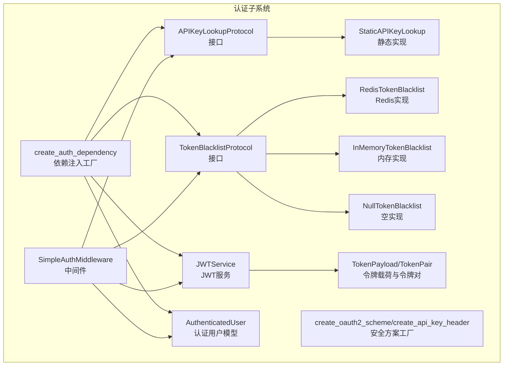
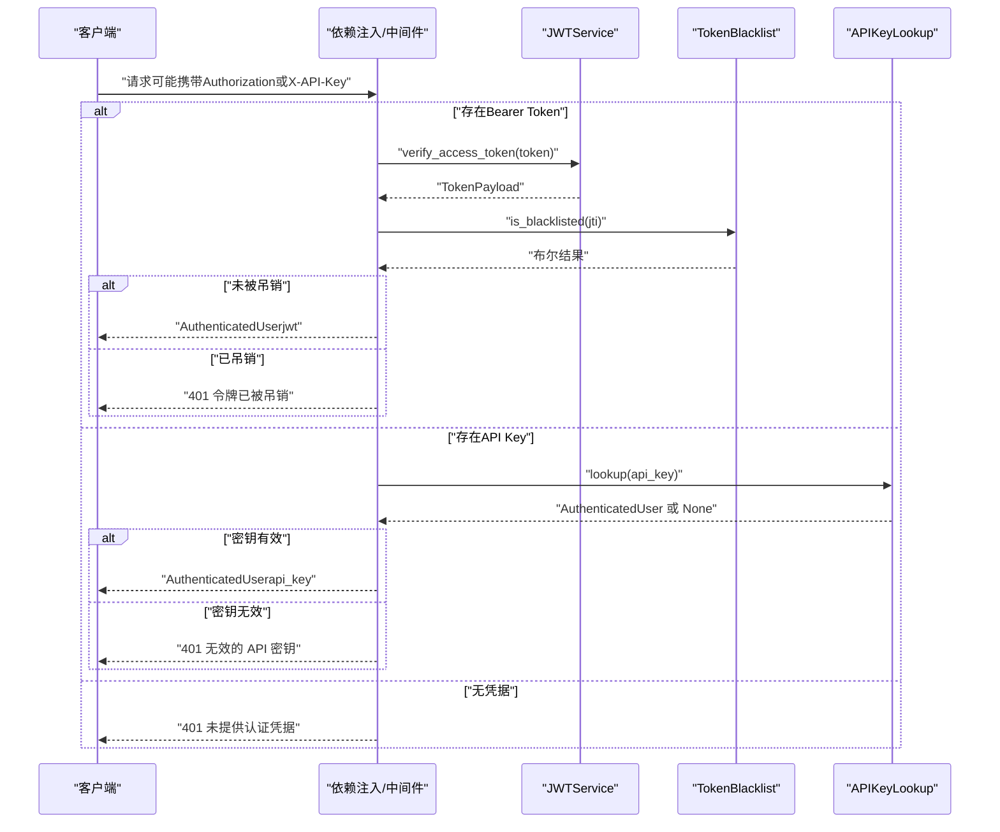
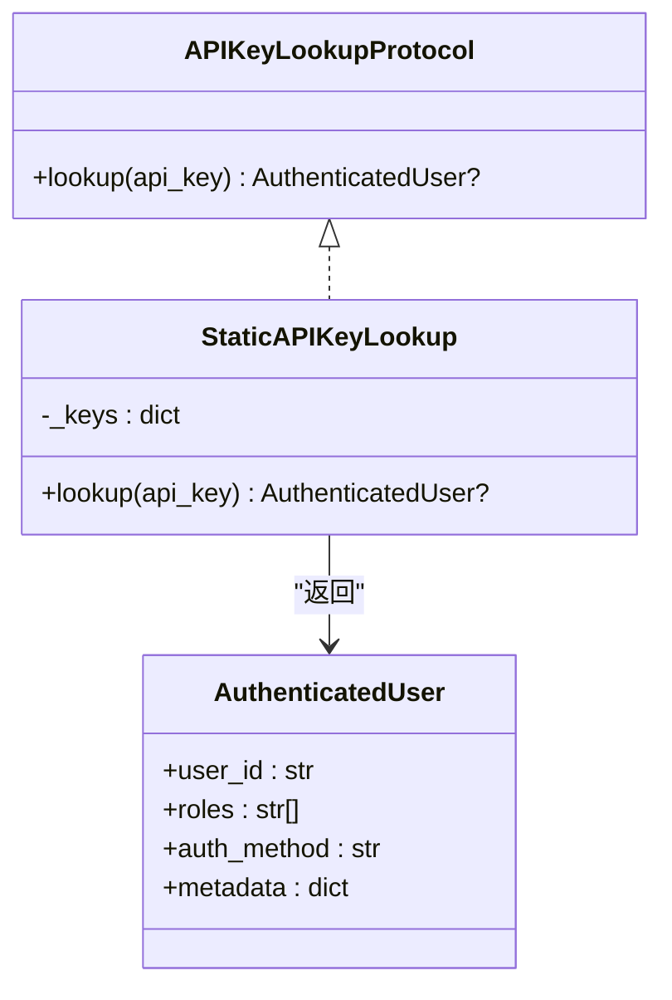
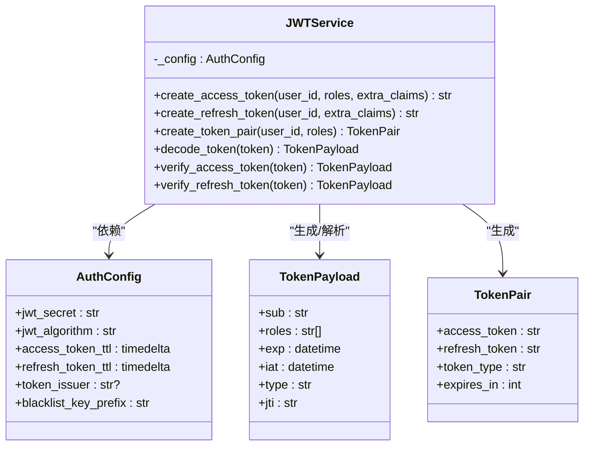
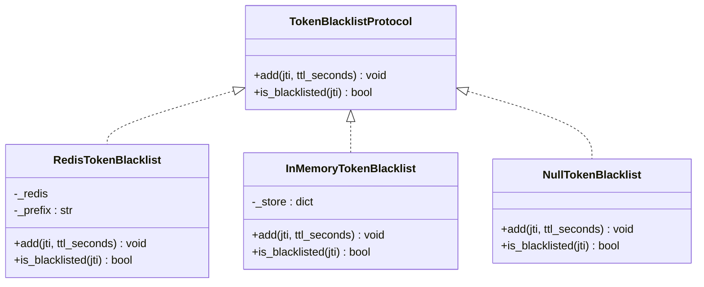
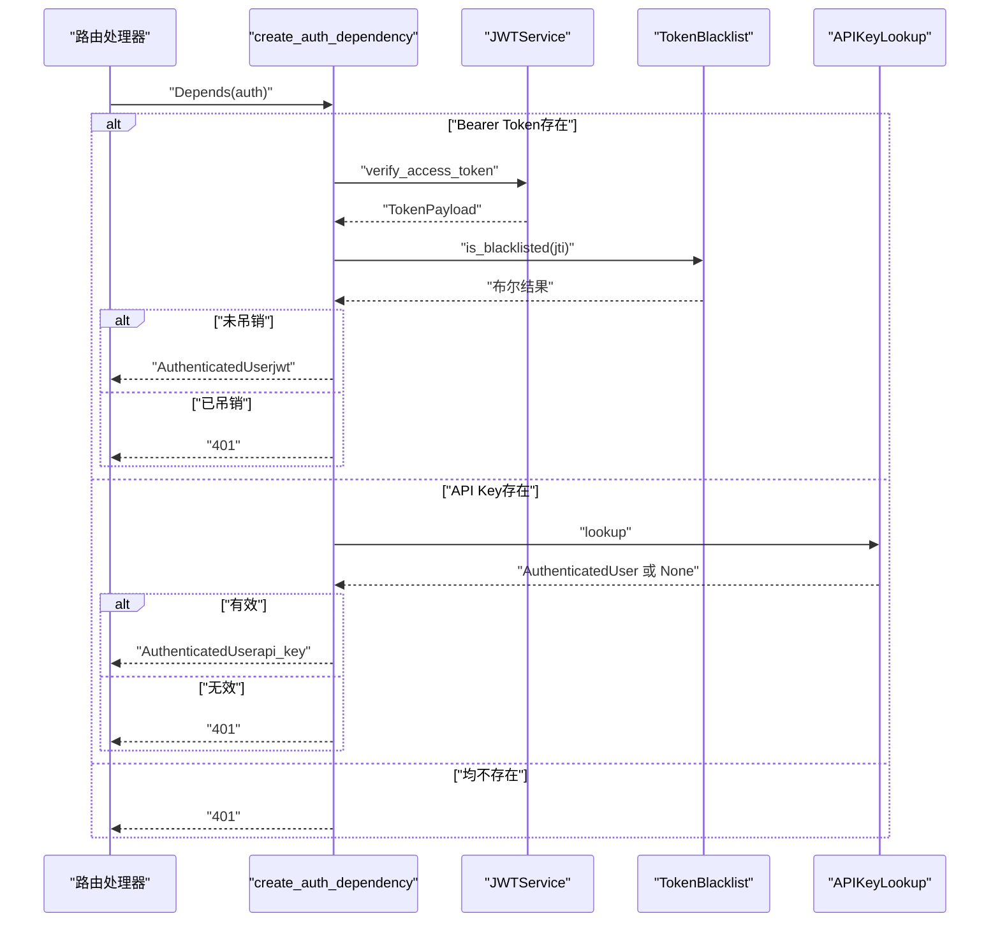
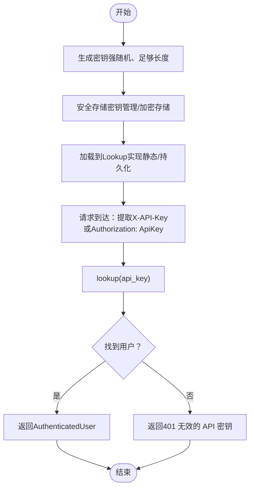
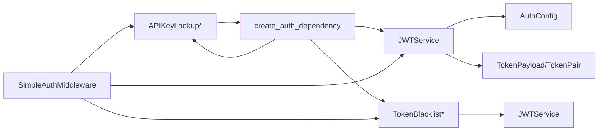

# API密钥认证

<cite>
**本文引用的文件**
- [api_key.py](file://src/taolib/testing/auth/api_key.py)
- [models.py](file://src/taolib/testing/auth/models.py)
- [errors.py](file://src/taolib/testing/auth/errors.py)
- [config.py](file://src/taolib/testing/auth/config.py)
- [tokens.py](file://src/taolib/testing/auth/tokens.py)
- [dependencies.py](file://src/taolib/testing/auth/fastapi/dependencies.py)
- [middleware.py](file://src/taolib/testing/auth/fastapi/middleware.py)
- [schemes.py](file://src/taolib/testing/auth/fastapi/schemes.py)
- [test_api_key.py](file://tests/testing/test_auth/test_api_key.py)
- [test_dependencies.py](file://tests/testing/test_auth/test_fastapi/test_dependencies.py)
- [test_middleware.py](file://tests/testing/test_auth/test_fastapi/test_middleware.py)
- [token_encryption.py](file://src/taolib/testing/oauth/crypto/token_encryption.py)
</cite>

## 目录
1. [简介](#简介)
2. [项目结构](#项目结构)
3. [核心组件](#核心组件)
4. [架构总览](#架构总览)
5. [组件详解](#组件详解)
6. [依赖关系分析](#依赖关系分析)
7. [性能考量](#性能考量)
8. [故障排除指南](#故障排除指南)
9. [结论](#结论)
10. [附录](#附录)

## 简介
本文件面向API密钥认证系统，围绕以下目标展开：API密钥的生成、存储与验证机制；密钥格式、生命周期管理与轮换策略；APIKeyLookupProtocol接口与StaticAPIKeyLookup实现的使用方法；API密钥的安全存储、加密处理与访问控制；API密钥与JWT令牌的协同工作机制与使用策略；安全最佳实践、性能考虑与故障排除；以及实际集成示例与配置选项说明。

## 项目结构
本认证子系统位于src/taolib/testing/auth目录，采用按功能分层组织：
- 接口与协议层：APIKeyLookupProtocol、TokenBlacklistProtocol
- 数据模型层：AuthenticatedUser、TokenPayload、TokenPair
- 服务层：JWTService、Blacklist实现（Redis/内存/空实现）
- FastAPI集成层：依赖注入工厂、安全方案工厂、中间件
- 测试层：覆盖APIKeyLookup、依赖注入与中间件行为

图表来源
- [api_key.py:11-46](file://src/taolib/testing/auth/api_key.py#L11-L46)
- [blacklist.py:10-113](file://src/taolib/testing/auth/blacklist.py#L10-L113)
- [models.py:11-67](file://src/taolib/testing/auth/models.py#L11-L67)
- [tokens.py:17-237](file://src/taolib/testing/auth/tokens.py#L17-L237)
- [dependencies.py:27-141](file://src/taolib/testing/auth/fastapi/dependencies.py#L27-L141)
- [middleware.py:20-173](file://src/taolib/testing/auth/fastapi/middleware.py#L20-L173)
- [schemes.py:9-41](file://src/taolib/testing/auth/fastapi/schemes.py#L9-L41)

章节来源
- [api_key.py:1-48](file://src/taolib/testing/auth/api_key.py#L1-L48)
- [models.py:1-68](file://src/taolib/testing/auth/models.py#L1-L68)
- [dependencies.py:1-291](file://src/taolib/testing/auth/fastapi/dependencies.py#L1-L291)
- [middleware.py:1-173](file://src/taolib/testing/auth/fastapi/middleware.py#L1-L173)

## 核心组件
- APIKeyLookupProtocol与StaticAPIKeyLookup：定义API密钥查找协议与静态配置实现，支持异步查找。
- JWTService：提供Access/Refresh Token生成、解码与验证，包含jti、iat、exp等标准字段。
- TokenBlacklistProtocol及其实现：支持Redis、内存与空实现三种黑名单策略。
- AuthenticatedUser：认证后用户信息载体，包含user_id、roles、auth_method与metadata。
- FastAPI依赖注入与中间件：统一处理Bearer Token与API Key两种认证通道，并支持RBAC与作用域检查。

章节来源
- [api_key.py:11-46](file://src/taolib/testing/auth/api_key.py#L11-L46)
- [models.py:11-67](file://src/taolib/testing/auth/models.py#L11-L67)
- [tokens.py:17-237](file://src/taolib/testing/auth/tokens.py#L17-L237)
- [dependencies.py:27-141](file://src/taolib/testing/auth/fastapi/dependencies.py#L27-L141)
- [middleware.py:20-173](file://src/taolib/testing/auth/fastapi/middleware.py#L20-L173)

## 架构总览
API密钥与JWT双通道认证的整体流程如下：

图表来源
- [dependencies.py:61-141](file://src/taolib/testing/auth/fastapi/dependencies.py#L61-L141)
- [middleware.py:103-170](file://src/taolib/testing/auth/fastapi/middleware.py#L103-L170)
- [tokens.py:129-199](file://src/taolib/testing/auth/tokens.py#L129-L199)
- [blacklist.py:10-113](file://src/taolib/testing/auth/blacklist.py#L10-L113)
- [api_key.py:18-45](file://src/taolib/testing/auth/api_key.py#L18-L45)

## 组件详解

### APIKeyLookupProtocol与StaticAPIKeyLookup
- APIKeyLookupProtocol：定义异步lookup(api_key)方法，返回AuthenticatedUser或None，便于替换为数据库/缓存等持久化实现。
- StaticAPIKeyLookup：基于构造时提供的字典进行查找，适合小规模部署或配置文件管理的固定密钥。

图表来源
- [api_key.py:11-46](file://src/taolib/testing/auth/api_key.py#L11-L46)
- [models.py:32-48](file://src/taolib/testing/auth/models.py#L32-L48)

章节来源
- [api_key.py:11-46](file://src/taolib/testing/auth/api_key.py#L11-L46)
- [test_api_key.py:9-67](file://tests/testing/test_auth/test_api_key.py#L9-L67)

### JWTService与令牌模型
- JWTService：负责Access/Refresh Token生成、解码与验证，支持自定义issuer、额外claims，以及jti用于黑名单。
- TokenPayload/TokenPair：标准化令牌载荷与令牌对结构，便于下游处理。

图表来源
- [tokens.py:17-237](file://src/taolib/testing/auth/tokens.py#L17-L237)
- [models.py:11-67](file://src/taolib/testing/auth/models.py#L11-L67)
- [config.py:12-82](file://src/taolib/testing/auth/config.py#L12-L82)

章节来源
- [tokens.py:17-237](file://src/taolib/testing/auth/tokens.py#L17-L237)
- [models.py:11-67](file://src/taolib/testing/auth/models.py#L11-L67)
- [config.py:12-82](file://src/taolib/testing/auth/config.py#L12-L82)

### 令牌黑名单与吊销
- TokenBlacklistProtocol：定义add与is_blacklisted方法。
- RedisTokenBlacklist：基于Redis SET+EX，TTL自动过期，适合分布式场景。
- InMemoryTokenBlacklist：内存字典+过期清理，适合测试与单进程。
- NullTokenBlacklist：空实现，始终返回False，用于禁用黑名单。

图表来源
- [blacklist.py:10-113](file://src/taolib/testing/auth/blacklist.py#L10-L113)

章节来源
- [blacklist.py:10-113](file://src/taolib/testing/auth/blacklist.py#L10-L113)

### FastAPI依赖注入与中间件
- create_auth_dependency：统一处理Bearer Token与API Key，支持OAuth2密码流、API Key头与Authorization: ApiKey格式，优先JWT。
- SimpleAuthMiddleware：在ASGI中间件层直接进行认证，便于在路由之外拦截请求。
- 安全方案工厂：create_oauth2_scheme与create_api_key_header，支持auto_error配置以适配双通道。

图表来源
- [dependencies.py:27-141](file://src/taolib/testing/auth/fastapi/dependencies.py#L27-L141)
- [middleware.py:71-173](file://src/taolib/testing/auth/fastapi/middleware.py#L71-L173)
- [schemes.py:9-41](file://src/taolib/testing/auth/fastapi/schemes.py#L9-L41)

章节来源
- [dependencies.py:27-141](file://src/taolib/testing/auth/fastapi/dependencies.py#L27-L141)
- [middleware.py:71-173](file://src/taolib/testing/auth/fastapi/middleware.py#L71-L173)
- [schemes.py:9-41](file://src/taolib/testing/auth/fastapi/schemes.py#L9-L41)

### API密钥生成、存储与验证流程
- 生成：建议使用强随机源生成密钥，长度≥32字符，避免可预测性；可结合密钥轮换策略定期更换。
- 存储：生产环境建议使用安全的密钥管理系统或加密存储（见“安全存储与加密”章节）；测试/开发可用StaticAPIKeyLookup加载静态映射。
- 验证：通过APIKeyLookupProtocol实现查找，返回AuthenticatedUser；在依赖注入或中间件中统一接入。

图表来源
- [api_key.py:18-45](file://src/taolib/testing/auth/api_key.py#L18-L45)
- [test_api_key.py:33-62](file://tests/testing/test_auth/test_api_key/test_api_key.py#L33-L62)

章节来源
- [api_key.py:18-45](file://src/taolib/testing/auth/api_key.py#L18-L45)
- [test_api_key.py:33-62](file://tests/testing/test_auth/test_api_key/test_api_key.py#L33-L62)

### API密钥与JWT协同机制
- 双通道认证：JWT优先于API Key；若同时提供两者，JWT通道优先。
- 访问控制：结合RBAC策略与作用域检查，确保最小权限原则。
- 黑名单：JWT使用jti进行吊销；API Key目前由lookup实现控制有效性。

章节来源
- [dependencies.py:61-141](file://src/taolib/testing/auth/fastapi/dependencies.py#L61-L141)
- [middleware.py:103-170](file://src/taolib/testing/auth/fastapi/middleware.py#L103-L170)

## 依赖关系分析
- 低耦合高内聚：APIKeyLookupProtocol与TokenBlacklistProtocol均为抽象接口，便于替换实现。
- 依赖注入：JWTService、Blacklist实现与APIKeyLookup通过依赖注入进入应用层，便于测试与扩展。
- FastAPI集成：依赖注入工厂与中间件分别适配框架依赖注入与ASGI中间件两种场景。

图表来源
- [tokens.py:17-237](file://src/taolib/testing/auth/tokens.py#L17-L237)
- [dependencies.py:27-141](file://src/taolib/testing/auth/fastapi/dependencies.py#L27-L141)
- [middleware.py:71-173](file://src/taolib/testing/auth/fastapi/middleware.py#L71-L173)

章节来源
- [dependencies.py:27-141](file://src/taolib/testing/auth/fastapi/dependencies.py#L27-L141)
- [middleware.py:71-173](file://src/taolib/testing/auth/fastapi/middleware.py#L71-L173)

## 性能考量
- 查找复杂度：StaticAPIKeyLookup为O(1)字典查找；持久化实现需评估索引与查询延迟。
- 黑名单策略：Redis实现具备分布式共享与TTL过期优势；内存实现适合单进程与测试。
- 令牌验证：JWT解码与签名验证为CPU密集型，建议合理设置Access Token TTL并使用高效算法。
- 并发与异步：所有查找与验证均为异步，适合高并发场景。

## 故障排除指南
- 401 未提供认证凭据：检查请求头Authorization（Bearer）或X-API-Key是否正确传递。
- 401 令牌已过期：提示刷新令牌；检查服务器时间同步与TTL配置。
- 401 令牌已被吊销：确认jti是否在黑名单中；检查黑名单实现与TTL设置。
- 401 无效的 API 密钥：确认密钥是否存在于lookup映射；检查大小写与前缀格式。
- 403 权限不足：检查RBAC策略与用户角色/作用域配置。

章节来源
- [errors.py:7-55](file://src/taolib/testing/auth/errors.py#L7-L55)
- [dependencies.py:83-122](file://src/taolib/testing/auth/fastapi/dependencies.py#L83-L122)
- [middleware.py:116-170](file://src/taolib/testing/auth/fastapi/middleware.py#L116-L170)

## 结论
本认证子系统提供了灵活的API密钥与JWT双通道认证能力，通过协议抽象与依赖注入实现了良好的可扩展性与可测试性。配合RBAC与黑名单机制，可在多场景下实现细粒度的访问控制与安全策略。建议在生产环境中采用安全的密钥存储与轮换策略，并结合Redis黑名单实现提升安全性与可运维性。

## 附录

### API密钥安全最佳实践
- 密钥生成：使用强随机源，长度≥32字符；避免使用弱熵源或字典词汇。
- 密钥存储：生产环境使用密钥管理服务或硬件安全模块；敏感数据采用对称加密存储。
- 密钥轮换：定期轮换密钥，支持渐进式切换与回滚；记录轮换历史。
- 访问控制：最小权限原则，结合RBAC与作用域限制；定期审计密钥使用日志。
- 传输安全：仅通过HTTPS传输密钥；避免在URL或日志中泄露。

### API密钥生命周期管理与轮换策略
- 生命周期：为每个密钥分配创建时间、到期时间与状态（启用/停用/吊销）。
- 轮换流程：生成新密钥→迁移至新密钥→逐步下线旧密钥→删除旧密钥。
- 吊销机制：通过黑名单或禁用映射快速生效；记录吊销原因与时间。

### API密钥与JWT协同使用策略
- 场景一：服务到服务调用优先使用API Key，简化令牌管理。
- 场景二：用户交互使用JWT，短期访问令牌+定期刷新；长链路使用Refresh Token。
- 场景三：混合策略：API Key用于后台任务，JWT用于前端会话；通过RBAC统一控制权限。

### 实际集成示例与配置选项
- FastAPI依赖注入集成：使用create_auth_dependency注入JWTService与可选APIKeyLookup；支持OAuth2与API Key双通道。
- 中间件集成：使用SimpleAuthMiddleware在ASGI层拦截请求，支持排除路径与黑名单检查。
- 配置选项：AuthConfig支持jwt_secret、jwt_algorithm、Access/Refresh Token TTL、issuer与黑名单键前缀；可通过环境变量批量注入。

章节来源
- [dependencies.py:27-141](file://src/taolib/testing/auth/fastapi/dependencies.py#L27-L141)
- [middleware.py:71-173](file://src/taolib/testing/auth/fastapi/middleware.py#L71-L173)
- [config.py:34-82](file://src/taolib/testing/auth/config.py#L34-L82)

### 安全存储与加密处理
- OAuth Token加密参考：使用Fernet对称加密，支持密钥生成、旋转与解密；可用于加密存储敏感令牌。
- API密钥加密：建议采用与OAuth相同的对称加密策略，结合密钥轮换与访问控制。

章节来源
- [token_encryption.py:11-85](file://src/taolib/testing/oauth/crypto/token_encryption.py#L11-L85)