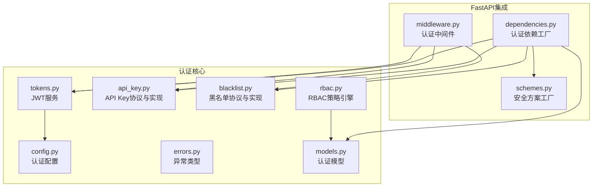
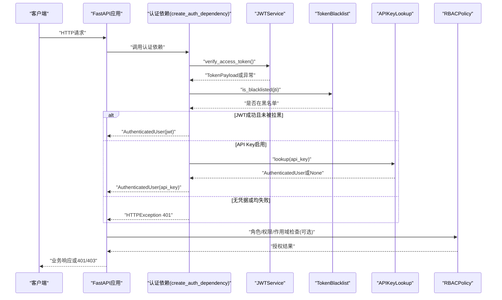
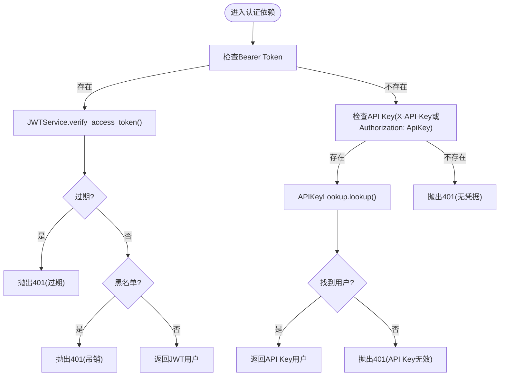
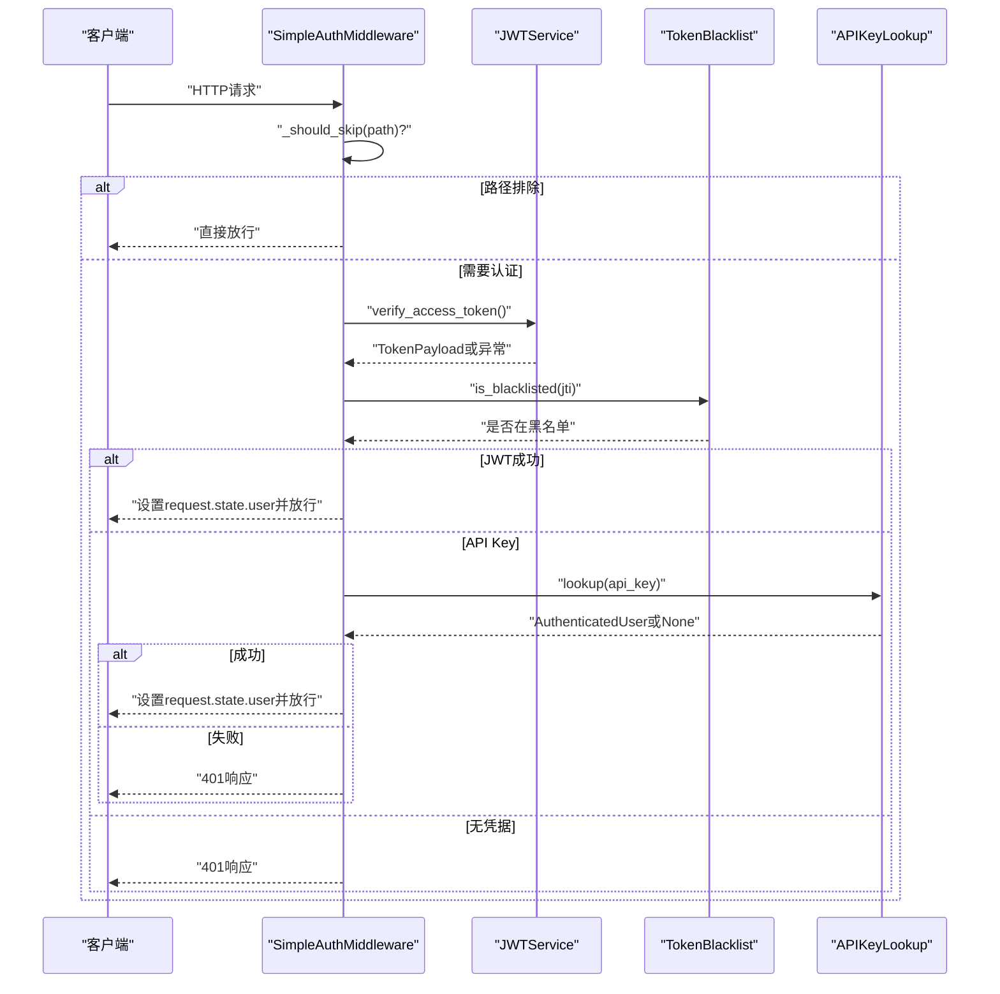
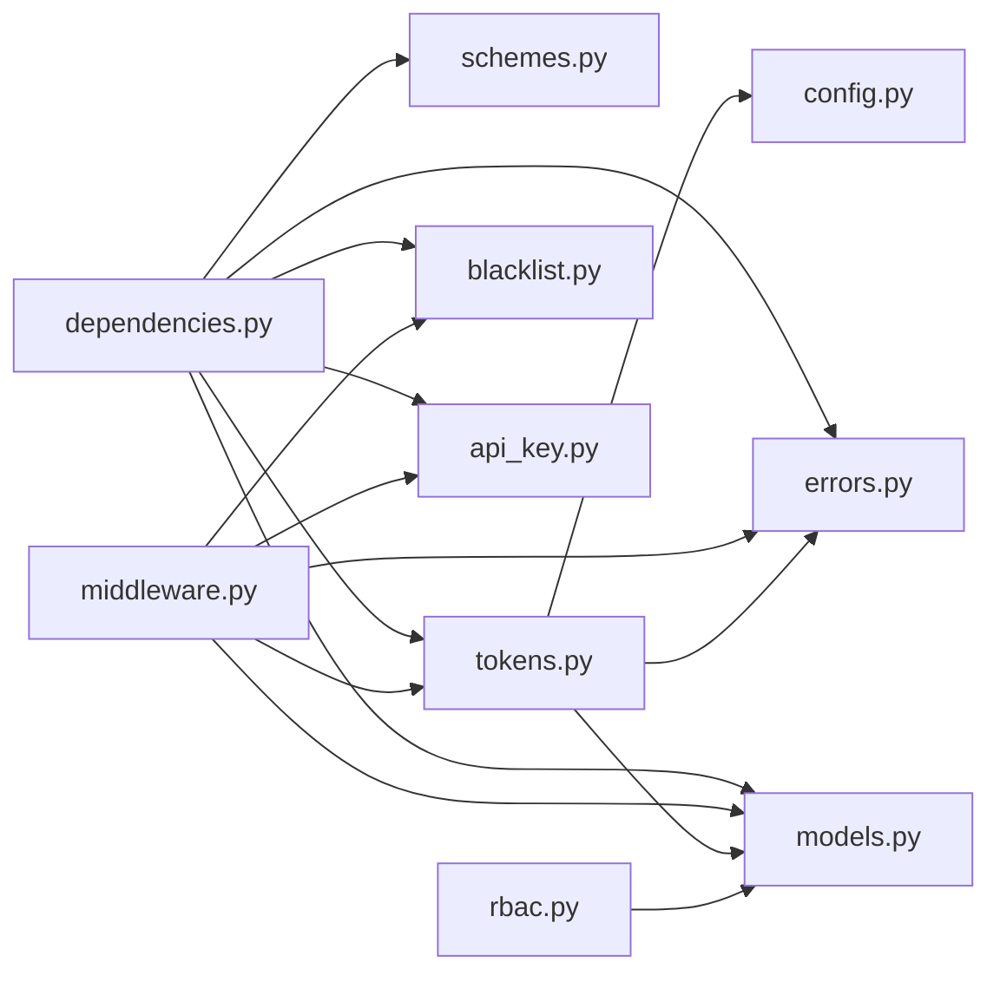

# FastAPI集成

<cite>
**本文引用的文件**
- [dependencies.py](file://src/taolib/testing/auth/fastapi/dependencies.py)
- [middleware.py](file://src/taolib/testing/auth/fastapi/middleware.py)
- [schemes.py](file://src/taolib/testing/auth/fastapi/schemes.py)
- [__init__.py](file://src/taolib/testing/auth/__init__.py)
- [config.py](file://src/taolib/testing/auth/config.py)
- [models.py](file://src/taolib/testing/auth/models.py)
- [tokens.py](file://src/taolib/testing/auth/tokens.py)
- [api_key.py](file://src/taolib/testing/auth/api_key.py)
- [blacklist.py](file://src/taolib/testing/auth/blacklist.py)
- [rbac.py](file://src/taolib/testing/auth/rbac.py)
- [errors.py](file://src/taolib/testing/auth/errors.py)
- [test_dependencies.py](file://tests/testing/test_auth/test_fastapi/test_dependencies.py)
- [test_middleware.py](file://tests/testing/test_auth/test_fastapi/test_middleware.py)
</cite>

## 目录
1. [简介](#简介)
2. [项目结构](#项目结构)
3. [核心组件](#核心组件)
4. [架构总览](#架构总览)
5. [详细组件分析](#详细组件分析)
6. [依赖关系分析](#依赖关系分析)
7. [性能考虑](#性能考虑)
8. [故障排查指南](#故障排查指南)
9. [结论](#结论)
10. [附录](#附录)

## 简介
本文件面向在FastAPI中集成认证能力的开发者，系统性阐述以下内容：
- 如何使用 create_auth_dependency 创建认证依赖项及其参数选项
- 认证中间件的工作原理、请求拦截机制与响应处理
- 认证方案（AuthSchemes）的实现，涵盖 Bearer Token 与 API Key 两种方式
- 在路由中使用认证依赖项的完整集成示例
- 认证异常处理、错误响应格式与安全头设置
- 中间件配置选项、性能优化与调试技巧
- 实际代码示例与最佳实践指南

## 项目结构
本认证子系统位于 src/taolib/testing/auth 下，FastAPI相关集成位于 fastapi 子目录中。核心文件组织如下：
- fastapi/dependencies.py：认证依赖工厂与角色/权限/作用域检查依赖
- fastapi/middleware.py：FastAPI认证中间件与简化版中间件
- fastapi/schemes.py：OAuth2与API Key安全方案工厂
- auth/*：JWT服务、配置、模型、API Key、黑名单、RBAC、错误类型等

图表来源
- [dependencies.py:1-291](file://src/taolib/testing/auth/fastapi/dependencies.py#L1-L291)
- [middleware.py:1-173](file://src/taolib/testing/auth/fastapi/middleware.py#L1-L173)
- [schemes.py:1-41](file://src/taolib/testing/auth/fastapi/schemes.py#L1-L41)
- [config.py:1-82](file://src/taolib/testing/auth/config.py#L1-L82)
- [tokens.py:1-237](file://src/taolib/testing/auth/tokens.py#L1-L237)
- [api_key.py:1-48](file://src/taolib/testing/auth/api_key.py#L1-L48)
- [blacklist.py:1-113](file://src/taolib/testing/auth/blacklist.py#L1-L113)
- [rbac.py:1-160](file://src/taolib/testing/auth/rbac.py#L1-L160)
- [errors.py:1-55](file://src/taolib/testing/auth/errors.py#L1-L55)
- [models.py:1-68](file://src/taolib/testing/auth/models.py#L1-L68)

章节来源
- [dependencies.py:1-291](file://src/taolib/testing/auth/fastapi/dependencies.py#L1-L291)
- [middleware.py:1-173](file://src/taolib/testing/auth/fastapi/middleware.py#L1-L173)
- [schemes.py:1-41](file://src/taolib/testing/auth/fastapi/schemes.py#L1-L41)
- [__init__.py:1-86](file://src/taolib/testing/auth/__init__.py#L1-L86)

## 核心组件
- 认证依赖工厂：create_auth_dependency，支持JWT Bearer与API Key双通道认证，可选黑名单校验与API Key查找
- 安全方案工厂：create_oauth2_scheme、create_api_key_header，提供OAuth2与API Key头部的安全方案
- 中间件：AuthMiddleware（简化版）、SimpleAuthMiddleware，支持在中间件层进行认证并注入 request.state.user
- JWT服务：JWTService，负责令牌创建、解码与验证，支持Access/Refresh令牌类型
- API Key：APIKeyLookupProtocol与StaticAPIKeyLookup，提供API Key查找接口与静态配置实现
- 黑名单：TokenBlacklistProtocol与Redis/内存/空实现，支持令牌吊销
- RBAC：RBACPolicy，基于角色的权限与作用域检查
- 模型与异常：AuthenticatedUser、TokenPayload、TokenPair与各类认证异常

章节来源
- [dependencies.py:27-141](file://src/taolib/testing/auth/fastapi/dependencies.py#L27-L141)
- [schemes.py:9-38](file://src/taolib/testing/auth/fastapi/schemes.py#L9-L38)
- [middleware.py:20-171](file://src/taolib/testing/auth/fastapi/middleware.py#L20-L171)
- [tokens.py:17-237](file://src/taolib/testing/auth/tokens.py#L17-L237)
- [api_key.py:11-47](file://src/taolib/testing/auth/api_key.py#L11-L47)
- [blacklist.py:10-113](file://src/taolib/testing/auth/blacklist.py#L10-L113)
- [rbac.py:41-160](file://src/taolib/testing/auth/rbac.py#L41-L160)
- [models.py:11-68](file://src/taolib/testing/auth/models.py#L11-L68)
- [errors.py:7-55](file://src/taolib/testing/auth/errors.py#L7-L55)

## 架构总览
下图展示了FastAPI认证集成的整体交互：路由依赖使用 create_auth_dependency 获取认证用户；中间件在请求进入时进行认证并注入 request.state.user；JWTService负责令牌验证与黑名单检查；API Key Lookup与RBAC策略提供额外认证与授权能力。

图表来源
- [dependencies.py:61-141](file://src/taolib/testing/auth/fastapi/dependencies.py#L61-L141)
- [tokens.py:155-176](file://src/taolib/testing/auth/tokens.py#L155-L176)
- [blacklist.py:26-35](file://src/taolib/testing/auth/blacklist.py#L26-L35)
- [api_key.py:18-27](file://src/taolib/testing/auth/api_key.py#L18-L27)
- [rbac.py:64-115](file://src/taolib/testing/auth/rbac.py#L64-L115)

## 详细组件分析

### 组件A：认证依赖工厂 create_auth_dependency
- 功能概述
  - 返回可用于 Depends() 的异步依赖函数，支持JWT Bearer与API Key双通道认证
  - 可选参数：JWT服务、黑名单实现、API Key查找器、OAuth2方案、API Key头部方案
  - 当仅启用JWT时，返回简化的依赖函数以减少分支开销
- 认证流程
  - 优先尝试Bearer Token（OAuth2方案）
  - 若未提供则尝试API Key（X-API-Key或Authorization: ApiKey）
  - 任一成功即返回 AuthenticatedUser，否则抛出401
- 错误处理
  - 令牌过期：401 + WWW-Authenticate: Bearer
  - 令牌无效：401 + 详细信息
  - 令牌在黑名单：401 + 详细信息
  - 无凭据：401 + WWW-Authenticate: Bearer
  - API Key无效：401
- 参数选项
  - jwt_service：JWTService实例
  - blacklist：TokenBlacklistProtocol，默认 NullTokenBlacklist
  - api_key_lookup：APIKeyLookupProtocol，None表示禁用API Key认证
  - oauth2_scheme：OAuth2PasswordBearer，auto_error=False以支持双通道
  - api_key_header：APIKeyHeader，auto_error=False

图表来源
- [dependencies.py:61-141](file://src/taolib/testing/auth/fastapi/dependencies.py#L61-L141)
- [tokens.py:155-176](file://src/taolib/testing/auth/tokens.py#L155-L176)
- [blacklist.py:61-67](file://src/taolib/testing/auth/blacklist.py#L61-L67)
- [api_key.py:43-45](file://src/taolib/testing/auth/api_key.py#L43-L45)

章节来源
- [dependencies.py:27-141](file://src/taolib/testing/auth/fastapi/dependencies.py#L27-L141)
- [schemes.py:9-38](file://src/taolib/testing/auth/fastapi/schemes.py#L9-L38)
- [errors.py:15-31](file://src/taolib/testing/auth/errors.py#L15-L31)

### 组件B：认证中间件（AuthMiddleware与SimpleAuthMiddleware）
- AuthMiddleware
  - 作为Starlette中间件，提供路径排除与认证注入能力
  - dispatch中对排除路径直接放行，其余路径可按需扩展认证逻辑
- SimpleAuthMiddleware
  - 独立于FastAPI依赖注入系统，在中间件层直接进行JWT与API Key认证
  - 支持路径排除、黑名单检查、错误响应格式化
  - 通过 request.state.user 传递认证用户

图表来源
- [middleware.py:71-171](file://src/taolib/testing/auth/fastapi/middleware.py#L71-L171)
- [tokens.py:155-176](file://src/taolib/testing/auth/tokens.py#L155-L176)
- [blacklist.py:61-67](file://src/taolib/testing/auth/blacklist.py#L61-L67)
- [api_key.py:43-45](file://src/taolib/testing/auth/api_key.py#L43-L45)

章节来源
- [middleware.py:20-171](file://src/taolib/testing/auth/fastapi/middleware.py#L20-L171)

### 组件C：认证方案（AuthSchemes）
- OAuth2 Bearer
  - create_oauth2_scheme(tokenUrl, auto_error=False)
  - 用于Bearer Token认证，auto_error=False以支持双通道
- API Key Header
  - create_api_key_header(name="X-API-Key", auto_error=False)
  - 支持X-API-Key头部与Authorization: ApiKey格式

章节来源
- [schemes.py:9-38](file://src/taolib/testing/auth/fastapi/schemes.py#L9-L38)

### 组件D：认证模型与数据结构
- TokenPayload：JWT解码后的标准声明（sub、roles、exp、iat、type、jti）
- AuthenticatedUser：认证后用户信息（user_id、roles、auth_method、metadata）
- TokenPair：包含access_token、refresh_token及过期时间

章节来源
- [models.py:11-68](file://src/taolib/testing/auth/models.py#L11-L68)

### 组件E：JWT服务与配置
- JWTService
  - create_access_token/create_refresh_token：生成Access/Refresh令牌
  - verify_access_token/verify_refresh_token：验证令牌类型与有效性
  - decode_token：通用解码，区分过期与无效
- AuthConfig
  - jwt_secret、jwt_algorithm、access_token_ttl、refresh_token_ttl、issuer、黑名单键前缀
  - from_env：从环境变量批量加载配置

章节来源
- [tokens.py:17-237](file://src/taolib/testing/auth/tokens.py#L17-L237)
- [config.py:12-82](file://src/taolib/testing/auth/config.py#L12-L82)

### 组件F：API Key与黑名单
- APIKeyLookupProtocol：抽象API Key查找接口
- StaticAPIKeyLookup：静态字典实现，适合小规模部署
- TokenBlacklistProtocol：抽象黑名单接口
- RedisTokenBlacklist/InMemoryTokenBlacklist/NullTokenBlacklist：三种实现

章节来源
- [api_key.py:11-47](file://src/taolib/testing/auth/api_key.py#L11-L47)
- [blacklist.py:10-113](file://src/taolib/testing/auth/blacklist.py#L10-L113)

### 组件G：RBAC策略引擎
- RBACPolicy：基于角色的权限与作用域检查
- RoleDefinition：角色定义（权限集合、作用域映射）
- Permission：资源+动作权限

章节来源
- [rbac.py:41-160](file://src/taolib/testing/auth/rbac.py#L41-L160)

### 组件H：角色/权限/作用域依赖
- require_roles：要求至少拥有指定角色之一
- require_permissions：通过RBAC策略检查资源+动作权限
- require_scope：通过RBAC策略检查作用域

章节来源
- [dependencies.py:161-288](file://src/taolib/testing/auth/fastapi/dependencies.py#L161-L288)

## 依赖关系分析
- 组件内聚与耦合
  - dependencies.py 依赖 schemes、tokens、blacklist、api_key、models、errors
  - middleware.py 依赖 tokens、blacklist、api_key、models、errors
  - tokens.py 依赖 config、errors、models
  - rbac.py 依赖 models
- 外部依赖
  - FastAPI/Starlette：依赖注入与中间件基础设施
  - python-jose：JWT编码/解码与异常类型
- 循环依赖
  - 未发现循环导入；各模块职责清晰，通过协议接口解耦

图表来源
- [dependencies.py:9-21](file://src/taolib/testing/auth/fastapi/dependencies.py#L9-L21)
- [middleware.py:9-17](file://src/taolib/testing/auth/fastapi/middleware.py#L9-L17)
- [tokens.py:10-14](file://src/taolib/testing/auth/tokens.py#L10-L14)
- [config.py:6-10](file://src/taolib/testing/auth/config.py#L6-L10)
- [models.py:6-8](file://src/taolib/testing/auth/models.py#L6-L8)
- [errors.py:6-13](file://src/taolib/testing/auth/errors.py#L6-L13)
- [rbac.py:6-7](file://src/taolib/testing/auth/rbac.py#L6-L7)

章节来源
- [dependencies.py:1-291](file://src/taolib/testing/auth/fastapi/dependencies.py#L1-L291)
- [middleware.py:1-173](file://src/taolib/testing/auth/fastapi/middleware.py#L1-L173)
- [tokens.py:1-237](file://src/taolib/testing/auth/tokens.py#L1-L237)

## 性能考虑
- 令牌验证成本
  - JWT解码与签名验证为CPU密集型，建议使用HS256并保持密钥长度≥32字符
  - Access Token TTL较短，Refresh Token较长，避免频繁刷新
- 黑名单查询
  - Redis黑名单：O(1)读取，TTL自动过期，适合高并发
  - 内存黑名单：适合开发/测试，注意进程重启后失效
- API Key查找
  - StaticAPIKeyLookup为O(1)字典查找，适合少量固定密钥
  - 生产建议使用持久化存储并配合缓存
- 中间件路径排除
  - 对无需认证的路径（如健康检查、文档）使用exclude_paths，减少不必要的认证开销
- 依赖注入优化
  - 仅启用必要的认证通道（如仅JWT），可减少分支判断与依赖注入开销

## 故障排查指南
- 常见错误与响应
  - 401 未提供认证凭据：检查Authorization或X-API-Key头
  - 401 令牌已过期：刷新令牌或重新登录
  - 401 令牌无效：检查密钥、算法与签名
  - 401 令牌已被吊销：确认黑名单写入与TTL设置
  - 401 无效的 API 密钥：检查密钥是否存在与格式
  - 403 权限不足/无权访问：检查角色、权限与作用域
- 调试技巧
  - 启用FastAPI日志，观察依赖注入与中间件dispatch调用
  - 在中间件中打印请求头与路径，定位凭据位置
  - 使用测试用例覆盖各种场景（有效/无效JWT、过期、黑名单、API Key）
- 测试参考
  - 依赖注入与RBAC测试：验证JWT优先级、角色/权限/作用域检查
  - 中间件集成测试：验证路径排除、API Key头部与Authorization: ApiKey格式

章节来源
- [test_dependencies.py:128-463](file://tests/testing/test_auth/test_fastapi/test_dependencies.py#L128-L463)
- [test_middleware.py:63-264](file://tests/testing/test_auth/test_fastapi/test_middleware.py#L63-L264)

## 结论
本认证集成提供了：
- 可插拔的双通道认证（JWT Bearer + API Key）
- 与FastAPI依赖注入与中间件生态无缝衔接
- 完整的异常处理与错误响应格式
- 可扩展的RBAC授权与黑名单机制
- 易于测试与调试的实现

建议在生产环境中：
- 使用Redis黑名单与强密钥
- 合理设置Token TTL与刷新策略
- 通过中间件路径排除降低认证开销
- 使用RBAC精细化控制权限与作用域

## 附录

### 快速开始：在FastAPI中使用认证依赖
- 步骤概览
  - 创建AuthConfig并初始化JWTService
  - 使用create_auth_dependency创建认证依赖
  - 在路由中通过Depends(auth)注入认证用户
  - 可选：使用require_roles/require_permissions/require_scope进行授权
- 示例路径
  - 依赖注入与路由示例：[test_dependencies.py:75-126](file://tests/testing/test_auth/test_fastapi/test_dependencies.py#L75-L126)
  - 中间件集成示例：[test_middleware.py:30-61](file://tests/testing/test_auth/test_fastapi/test_middleware.py#L30-L61)

章节来源
- [test_dependencies.py:75-126](file://tests/testing/test_auth/test_fastapi/test_dependencies.py#L75-L126)
- [test_middleware.py:30-61](file://tests/testing/test_auth/test_fastapi/test_middleware.py#L30-L61)

### 安全头与错误响应格式
- 安全头
  - 401响应设置WWW-Authenticate: Bearer，提示客户端使用Bearer Token
- 错误响应
  - 统一为JSON格式，包含detail字段
  - 令牌过期/无效/吊销/无凭据/权限不足等场景均有明确提示

章节来源
- [dependencies.py:77-97](file://src/taolib/testing/auth/fastapi/dependencies.py#L77-L97)
- [middleware.py:125-148](file://src/taolib/testing/auth/fastapi/middleware.py#L125-L148)

### 配置选项清单
- AuthConfig
  - jwt_secret：必需，长度≥32
  - jwt_algorithm：默认HS256
  - access_token_ttl：默认1小时
  - refresh_token_ttl：默认30天
  - token_issuer：可选
  - blacklist_key_prefix：黑名单键前缀
- create_oauth2_scheme
  - token_url：默认"/api/v1/auth/token"
  - auto_error：默认False（支持双通道）
- create_api_key_header
  - name：默认"X-API-Key"
  - auto_error：默认False

章节来源
- [config.py:12-82](file://src/taolib/testing/auth/config.py#L12-L82)
- [schemes.py:9-38](file://src/taolib/testing/auth/fastapi/schemes.py#L9-L38)