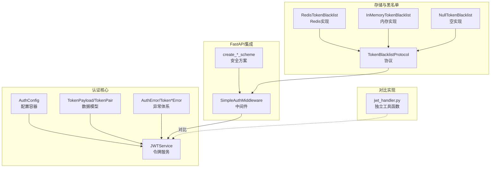
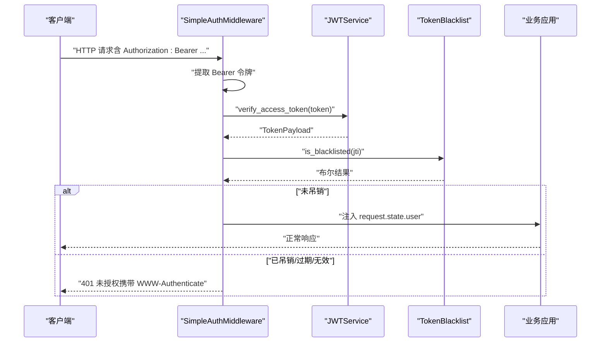
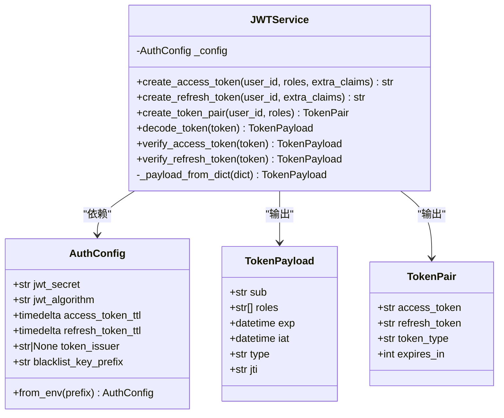
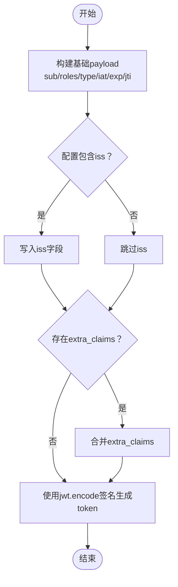
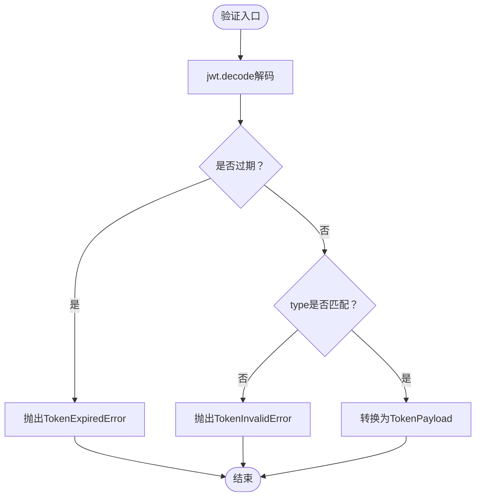
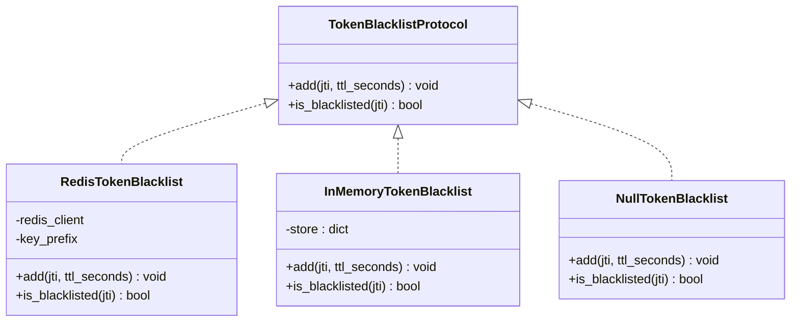
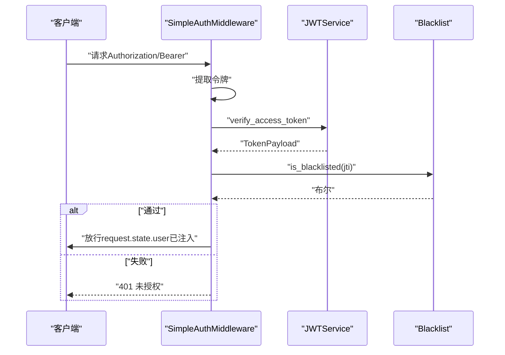
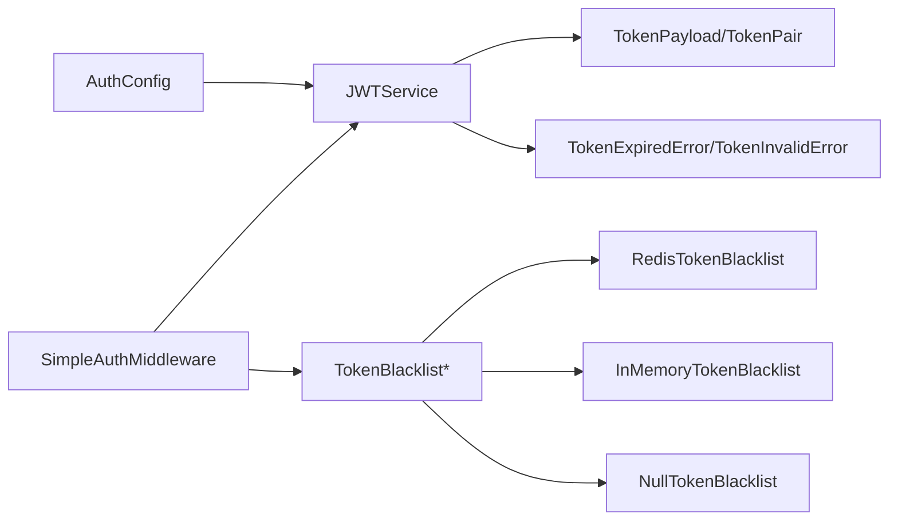

# JWT令牌管理

<cite>
**本文引用的文件**
- [tokens.py](file://src/taolib/testing/auth/tokens.py)
- [config.py](file://src/taolib/testing/auth/config.py)
- [models.py](file://src/taolib/testing/auth/models.py)
- [errors.py](file://src/taolib/testing/auth/errors.py)
- [jwt_handler.py](file://src/taolib/testing/config_center/server/auth/jwt_handler.py)
- [blacklist.py](file://src/taolib/testing/auth/blacklist.py)
- [middleware.py](file://src/taolib/testing/auth/fastapi/middleware.py)
- [schemes.py](file://src/taolib/testing/auth/fastapi/schemes.py)
- [test_tokens.py](file://tests/testing/test_auth/test_tokens.py)
- [token_service.py](file://src/taolib/testing/oauth/services/token_service.py)
</cite>

## 目录
1. [简介](#简介)
2. [项目结构](#项目结构)
3. [核心组件](#核心组件)
4. [架构总览](#架构总览)
5. [详细组件分析](#详细组件分析)
6. [依赖关系分析](#依赖关系分析)
7. [性能考量](#性能考量)
8. [故障排查指南](#故障排查指南)
9. [结论](#结论)
10. [附录](#附录)

## 简介
本技术文档围绕JWT令牌管理系统展开，重点覆盖以下方面：
- 令牌生成、验证与刷新机制
- JWTService类的核心功能与实现原理
- 令牌负载（payload）设计、字段含义与安全考虑
- 令牌过期处理、自动刷新与错误处理策略
- 安全性最佳实践、性能优化建议与常见问题解决方案

该系统采用可注入配置的JWTService，支持Access Token与Refresh Token的生成与校验，并提供黑名单吊销能力，配合FastAPI中间件实现统一认证入口。

## 项目结构
与JWT相关的关键文件分布如下：
- 认证服务与模型：tokens.py、config.py、models.py、errors.py
- FastAPI集成：middleware.py、schemes.py
- 黑名单：blacklist.py
- 示例与对比：jwt_handler.py（另一套实现）
- OAuth自动刷新参考：token_service.py
- 测试：test_tokens.py

图表来源
- [tokens.py:17-237](file://src/taolib/testing/auth/tokens.py#L17-L237)
- [config.py:12-82](file://src/taolib/testing/auth/config.py#L12-L82)
- [models.py:11-68](file://src/taolib/testing/auth/models.py#L11-L68)
- [errors.py:7-55](file://src/taolib/testing/auth/errors.py#L7-L55)
- [middleware.py:71-173](file://src/taolib/testing/auth/fastapi/middleware.py#L71-L173)
- [blacklist.py:10-113](file://src/taolib/testing/auth/blacklist.py#L10-L113)
- [jwt_handler.py:14-94](file://src/taolib/testing/config_center/server/auth/jwt_handler.py#L14-L94)

章节来源
- [tokens.py:17-237](file://src/taolib/testing/auth/tokens.py#L17-L237)
- [config.py:12-82](file://src/taolib/testing/auth/config.py#L12-L82)
- [models.py:11-68](file://src/taolib/testing/auth/models.py#L11-L68)
- [errors.py:7-55](file://src/taolib/testing/auth/errors.py#L7-L55)
- [middleware.py:71-173](file://src/taolib/testing/auth/fastapi/middleware.py#L71-L173)
- [blacklist.py:10-113](file://src/taolib/testing/auth/blacklist.py#L10-L113)
- [jwt_handler.py:14-94](file://src/taolib/testing/config_center/server/auth/jwt_handler.py#L14-L94)

## 核心组件
- JWTService：提供令牌创建、解码与验证，支持Access/Refresh两类令牌及令牌对生成。
- AuthConfig：不可变配置容器，集中管理密钥、算法、有效期、发行者与黑名单键前缀。
- TokenPayload/TokenPair：标准化的payload与令牌对数据结构。
- 异常体系：TokenExpiredError、TokenInvalidError等，提供明确的错误语义。
- 黑名单：支持Redis/内存/空实现，结合jti实现吊销控制。
- FastAPI中间件：统一从Authorization头解析Bearer令牌，结合黑名单与API Key双通道认证。

章节来源
- [tokens.py:17-237](file://src/taolib/testing/auth/tokens.py#L17-L237)
- [config.py:12-82](file://src/taolib/testing/auth/config.py#L12-L82)
- [models.py:11-68](file://src/taolib/testing/auth/models.py#L11-L68)
- [errors.py:7-55](file://src/taolib/testing/auth/errors.py#L7-L55)
- [blacklist.py:10-113](file://src/taolib/testing/auth/blacklist.py#L10-L113)
- [middleware.py:71-173](file://src/taolib/testing/auth/fastapi/middleware.py#L71-L173)

## 架构总览
JWT认证在系统中的位置与交互如下：

图表来源
- [middleware.py:103-170](file://src/taolib/testing/auth/fastapi/middleware.py#L103-L170)
- [tokens.py:155-199](file://src/taolib/testing/auth/tokens.py#L155-L199)
- [blacklist.py:61-67](file://src/taolib/testing/auth/blacklist.py#L61-L67)

## 详细组件分析

### JWTService类详解
JWTService是JWT令牌管理的核心，负责：
- 生成Access Token：包含sub、roles、exp、iat、type、jti、iss（可选）、extra_claims。
- 生成Refresh Token：不含roles，其余字段与Access一致。
- 生成令牌对：同时产出Access与Refresh，并封装为TokenPair。
- 解码与验证：decode_token通用解码；verify_access_token/verify_refresh_token按类型校验。
- 兼容旧版payload：对缺失jti/iat的令牌进行兼容处理。

图表来源
- [tokens.py:26-237](file://src/taolib/testing/auth/tokens.py#L26-L237)
- [config.py:12-82](file://src/taolib/testing/auth/config.py#L12-L82)
- [models.py:11-68](file://src/taolib/testing/auth/models.py#L11-L68)

章节来源
- [tokens.py:34-127](file://src/taolib/testing/auth/tokens.py#L34-L127)
- [tokens.py:129-199](file://src/taolib/testing/auth/tokens.py#L129-L199)
- [tokens.py:201-234](file://src/taolib/testing/auth/tokens.py#L201-L234)

### 令牌负载（payload）设计与字段含义
- sub：用户标识，标准JWT subject声明。
- roles：用户角色列表，Access Token包含，Refresh Token为空。
- exp：过期时间（UTC）。
- iat：签发时间（UTC），若缺失则回退为当前时间。
- type：令牌类型，"access"或"refresh"。
- jti：令牌唯一标识（JWT ID），用于黑名单与审计。
- iss：发行者（可选），由配置决定是否写入。
- extra_claims：可选扩展声明，随Access Token写入。

安全考虑：
- Access Token短有效期，Refresh Token长有效期。
- 使用强密钥（长度≥32字符），避免弱密钥。
- 启用黑名单（jti）以支持即时吊销。
- 严格区分Access/Refresh类型，防止混淆使用。

章节来源
- [models.py:11-68](file://src/taolib/testing/auth/models.py#L11-L68)
- [config.py:12-82](file://src/taolib/testing/auth/config.py#L12-L82)
- [tokens.py:52-68](file://src/taolib/testing/auth/tokens.py#L52-L68)
- [tokens.py:88-104](file://src/taolib/testing/auth/tokens.py#L88-L104)

### 令牌生成流程

图表来源
- [tokens.py:52-68](file://src/taolib/testing/auth/tokens.py#L52-L68)
- [tokens.py:88-104](file://src/taolib/testing/auth/tokens.py#L88-L104)

章节来源
- [tokens.py:34-104](file://src/taolib/testing/auth/tokens.py#L34-L104)

### 令牌验证与类型校验
- decode_token：通用解码，捕获过期与无效错误并映射为具体异常。
- verify_access_token/verify_refresh_token：在解码基础上进一步校验type字段。
- _payload_from_dict：将底层字典转换为TokenPayload，兼容旧版字段缺失场景。

图表来源
- [tokens.py:142-153](file://src/taolib/testing/auth/tokens.py#L142-L153)
- [tokens.py:170-176](file://src/taolib/testing/auth/tokens.py#L170-L176)
- [tokens.py:193-199](file://src/taolib/testing/auth/tokens.py#L193-L199)

章节来源
- [tokens.py:129-199](file://src/taolib/testing/auth/tokens.py#L129-L199)

### 黑名单与吊销
- TokenBlacklistProtocol：定义add/is_blacklisted接口。
- RedisTokenBlacklist：基于Redis SET+EX，TTL自动过期。
- InMemoryTokenBlacklist：内存字典+过期清理，适合测试。
- NullTokenBlacklist：空实现，不执行吊销。
- 中间件在验证通过后查询黑名单，若命中则返回401。

图表来源
- [blacklist.py:10-113](file://src/taolib/testing/auth/blacklist.py#L10-L113)

章节来源
- [blacklist.py:10-113](file://src/taolib/testing/auth/blacklist.py#L10-L113)
- [middleware.py:122-129](file://src/taolib/testing/auth/fastapi/middleware.py#L122-L129)

### FastAPI中间件与双通道认证
- SimpleAuthMiddleware：从Authorization头提取Bearer令牌，优先JWT认证；失败则尝试API Key。
- 支持排除路径、黑名单检查、401响应与WWW-Authenticate头。
- 与OAuth Token服务不同，JWT中间件关注Access Token即时有效性。

图表来源
- [middleware.py:103-170](file://src/taolib/testing/auth/fastapi/middleware.py#L103-L170)
- [tokens.py:155-176](file://src/taolib/testing/auth/tokens.py#L155-L176)
- [blacklist.py:61-67](file://src/taolib/testing/auth/blacklist.py#L61-L67)

章节来源
- [middleware.py:71-173](file://src/taolib/testing/auth/fastapi/middleware.py#L71-L173)
- [schemes.py:9-41](file://src/taolib/testing/auth/fastapi/schemes.py#L9-L41)

### OAuth自动刷新（对比参考）
- OAuthTokenService：在Access Token即将过期前（缓冲5分钟）主动刷新。
- 依赖Provider Registry与加密存储，刷新成功后更新连接文档并记录活动日志。
- 与JWT不同，OAuth刷新针对第三方令牌，而非应用内JWT。

章节来源
- [token_service.py:63-155](file://src/taolib/testing/oauth/services/token_service.py#L63-L155)

## 依赖关系分析
- JWTService依赖AuthConfig提供密钥、算法与有效期；输出TokenPayload/TokenPair。
- FastAPI中间件依赖JWTService与黑名单实现，负责统一认证入口。
- 黑名单实现可替换，便于在不同部署环境选择合适后端。
- 错误体系统一，便于上层处理与前端提示。

图表来源
- [tokens.py:26-237](file://src/taolib/testing/auth/tokens.py#L26-L237)
- [middleware.py:94-97](file://src/taolib/testing/auth/fastapi/middleware.py#L94-L97)
- [blacklist.py:38-113](file://src/taolib/testing/auth/blacklist.py#L38-L113)

章节来源
- [tokens.py:26-237](file://src/taolib/testing/auth/tokens.py#L26-L237)
- [middleware.py:94-97](file://src/taolib/testing/auth/fastapi/middleware.py#L94-L97)
- [blacklist.py:38-113](file://src/taolib/testing/auth/blacklist.py#L38-L113)

## 性能考量
- 令牌生成与验证均为CPU密集型，建议：
  - 使用高性能哈希算法（如HS256）与足够强度的密钥。
  - 将黑名单存储置于Redis，减少内存压力与进程重启丢失。
  - 控制Access Token TTL，缩短过期窗口降低无效请求。
  - 在高并发场景下，避免频繁黑名单查询，必要时缓存短期结果。
- 传输安全：
  - 始终通过HTTPS传输，防止令牌被窃取。
  - Access Token尽量短时，Refresh Token启用吊销与安全存储。

## 故障排查指南
- 令牌过期：verify_access_token会抛出TokenExpiredError，需引导用户刷新或重新登录。
- 令牌无效：decode_token捕获JWTError并映射为TokenInvalidError，检查密钥、算法与签名一致性。
- 类型不正确：verify_access_token/verify_refresh_token会拒绝非目标类型的令牌。
- 黑名单命中：中间件返回401并携带WWW-Authenticate，检查jti是否已加入黑名单。
- 无凭据或API Key无效：中间件返回401，检查请求头与API Key查找逻辑。

章节来源
- [test_tokens.py:169-194](file://tests/testing/test_auth/test_tokens.py#L169-L194)
- [middleware.py:137-169](file://src/taolib/testing/auth/fastapi/middleware.py#L137-L169)
- [errors.py:15-31](file://src/taolib/testing/auth/errors.py#L15-L31)

## 结论
本JWT令牌管理系统通过可注入配置与清晰的数据模型，提供了完整的Access/Refresh令牌生命周期管理。配合黑名单与FastAPI中间件，实现了统一、可扩展的认证入口。建议在生产环境中：
- 使用强密钥与合理有效期
- 启用黑名单并结合Redis
- 统一异常处理与错误提示
- 在高并发场景优化黑名单查询与缓存

## 附录

### 代码示例（路径指引）
- 创建Access Token：[tokens.py:34-68](file://src/taolib/testing/auth/tokens.py#L34-L68)
- 创建Refresh Token：[tokens.py:70-104](file://src/taolib/testing/auth/tokens.py#L70-L104)
- 生成令牌对：[tokens.py:106-127](file://src/taolib/testing/auth/tokens.py#L106-L127)
- 解码与验证：[tokens.py:129-199](file://src/taolib/testing/auth/tokens.py#L129-L199)
- 配置加载（环境变量）：[config.py:34-79](file://src/taolib/testing/auth/config.py#L34-L79)
- 中间件认证流程：[middleware.py:103-170](file://src/taolib/testing/auth/fastapi/middleware.py#L103-L170)
- 黑名单实现：[blacklist.py:38-113](file://src/taolib/testing/auth/blacklist.py#L38-L113)
- 对比实现（独立函数）：[jwt_handler.py:14-94](file://src/taolib/testing/config_center/server/auth/jwt_handler.py#L14-L94)