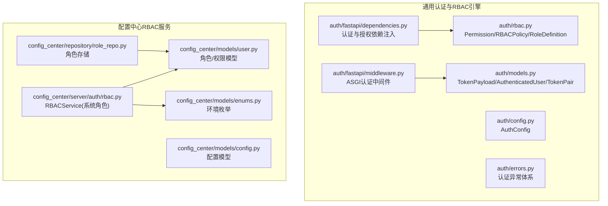
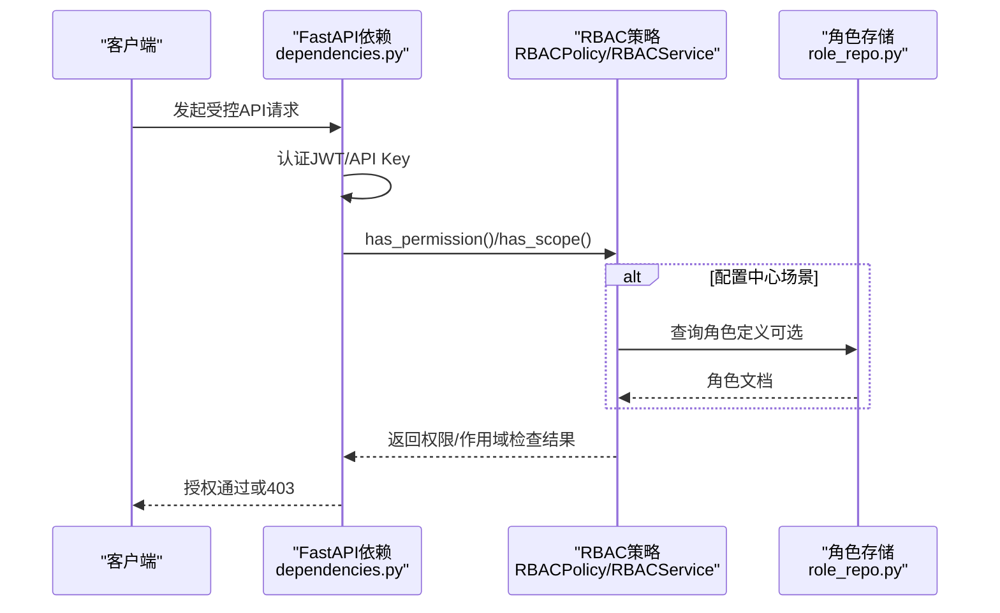
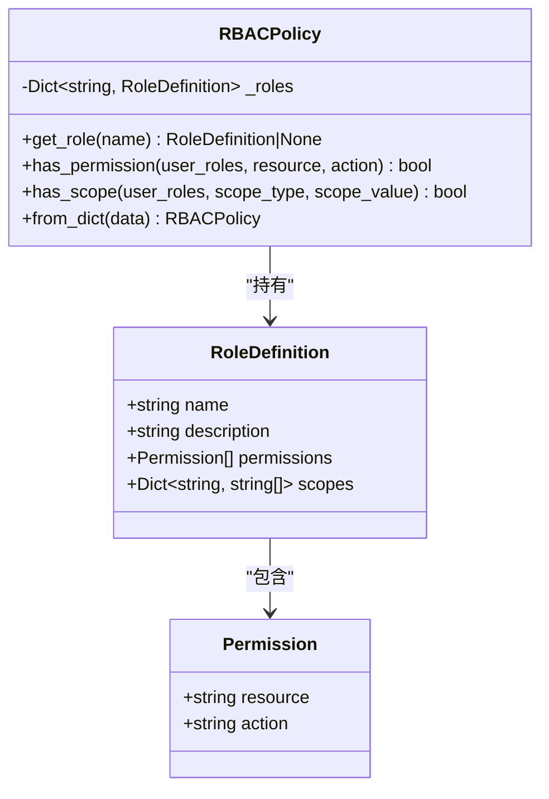
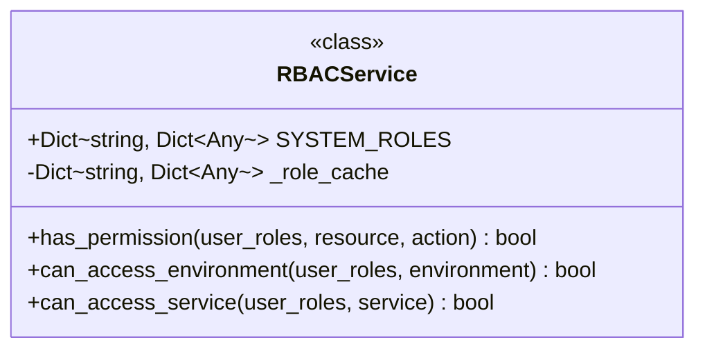
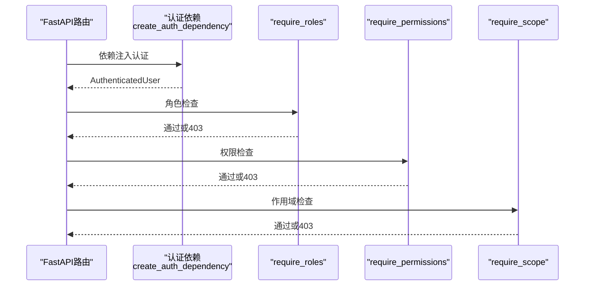
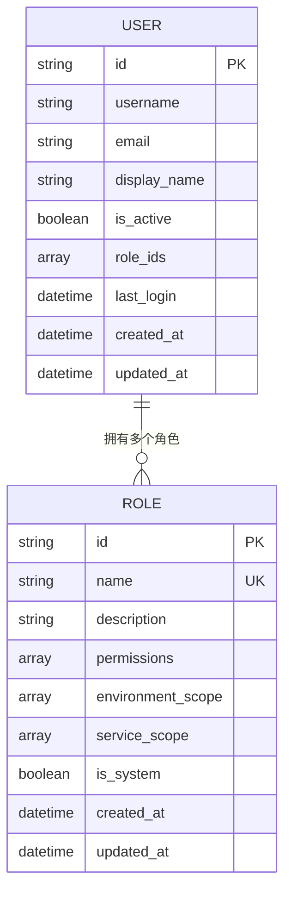
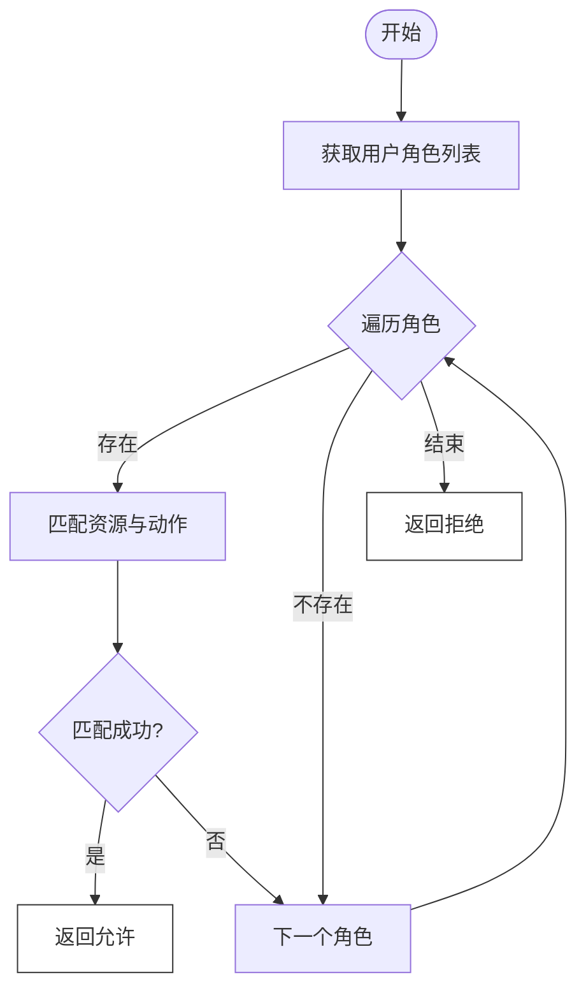
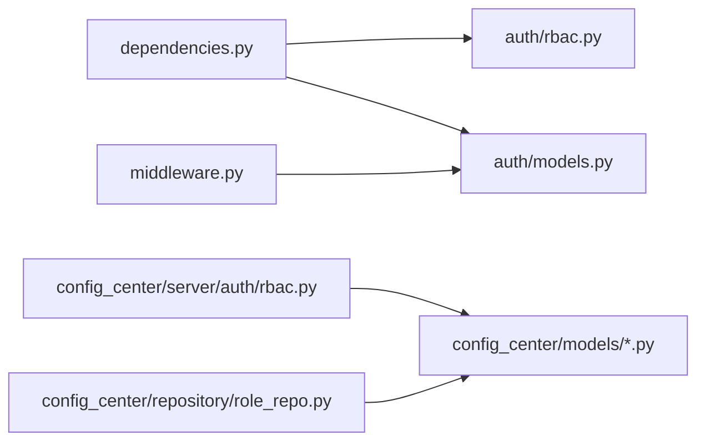

# RBAC权限控制

<cite>
**本文引用的文件**
- [rbac.py](file://src/taolib/testing/auth/rbac.py)
- [models.py](file://src/taolib/testing/auth/models.py)
- [config.py](file://src/taolib/testing/auth/config.py)
- [errors.py](file://src/taolib/testing/auth/errors.py)
- [dependencies.py](file://src/taolib/testing/auth/fastapi/dependencies.py)
- [middleware.py](file://src/taolib/testing/auth/fastapi/middleware.py)
- [rbac.py](file://src/taolib/testing/config_center/server/auth/rbac.py)
- [role_repo.py](file://src/taolib/testing/config_center/repository/role_repo.py)
- [user.py](file://src/taolib/testing/config_center/models/user.py)
- [enums.py](file://src/taolib/testing/config_center/models/enums.py)
- [config.py](file://src/taolib/testing/config_center/models/config.py)
- [test_rbac.py](file://tests/testing/test_auth/test_rbac.py)
</cite>

## 目录
1. [简介](#简介)
2. [项目结构](#项目结构)
3. [核心组件](#核心组件)
4. [架构总览](#架构总览)
5. [组件详解](#组件详解)
6. [依赖关系分析](#依赖关系分析)
7. [性能考量](#性能考量)
8. [故障排查指南](#故障排查指南)
9. [结论](#结论)
10. [附录](#附录)

## 简介
本文件面向基于角色的访问控制（RBAC）系统，提供从模型设计、实现细节到集成实践的完整技术文档。重点覆盖以下方面：
- RBAC模型设计原理：角色定义、权限分配、作用域控制与访问策略
- 核心类实现：Permission、RBACPolicy、RoleDefinition 的职责、接口与使用方式
- 角色层次与继承：通过多角色组合实现权限叠加与作用域合并
- 动态权限检查：运行时基于用户角色的权限与作用域验证流程
- 安全与性能：令牌安全、权限缓存策略与扩展性设计
- FastAPI集成：在实际应用中实现细粒度访问控制的端到端示例

## 项目结构
RBAC相关能力分布在两个子系统中：
- 通用认证与RBAC引擎：位于 src/taolib/testing/auth，提供通用的权限模型与FastAPI集成工具
- 配置中心RBAC服务：位于 src/taolib/testing/config_center，提供系统内置角色与环境/服务作用域的访问控制

图表来源
- [rbac.py:1-160](file://src/taolib/testing/auth/rbac.py#L1-L160)
- [dependencies.py:1-291](file://src/taolib/testing/auth/fastapi/dependencies.py#L1-L291)
- [middleware.py:1-173](file://src/taolib/testing/auth/fastapi/middleware.py#L1-L173)
- [rbac.py:1-162](file://src/taolib/testing/config_center/server/auth/rbac.py#L1-L162)
- [role_repo.py:1-41](file://src/taolib/testing/config_center/repository/role_repo.py#L1-L41)
- [user.py:1-163](file://src/taolib/testing/config_center/models/user.py#L1-L163)
- [enums.py:1-65](file://src/taolib/testing/config_center/models/enums.py#L1-L65)
- [config.py:1-106](file://src/taolib/testing/config_center/models/config.py#L1-L106)

章节来源
- [rbac.py:1-160](file://src/taolib/testing/auth/rbac.py#L1-L160)
- [dependencies.py:1-291](file://src/taolib/testing/auth/fastapi/dependencies.py#L1-L291)
- [middleware.py:1-173](file://src/taolib/testing/auth/fastapi/middleware.py#L1-L173)
- [rbac.py:1-162](file://src/taolib/testing/config_center/server/auth/rbac.py#L1-L162)
- [role_repo.py:1-41](file://src/taolib/testing/config_center/repository/role_repo.py#L1-L41)
- [user.py:1-163](file://src/taolib/testing/config_center/models/user.py#L1-L163)
- [enums.py:1-65](file://src/taolib/testing/config_center/models/enums.py#L1-L65)
- [config.py:1-106](file://src/taolib/testing/config_center/models/config.py#L1-L106)

## 核心组件
- Permission：最小权限单元，由资源与动作组成
- RoleDefinition：角色定义，包含名称、描述、权限集合与作用域映射
- RBACPolicy：策略引擎，提供权限与作用域的动态检查
- RBACService：配置中心专用的RBAC服务，内置系统角色与环境/服务作用域控制
- AuthenticatedUser：认证后携带用户身份与角色的上下文载体
- FastAPI依赖与中间件：提供JWT/API Key双通道认证、角色/权限/作用域检查依赖以及ASGI中间件

章节来源
- [rbac.py:10-160](file://src/taolib/testing/auth/rbac.py#L10-L160)
- [rbac.py:11-162](file://src/taolib/testing/config_center/server/auth/rbac.py#L11-L162)
- [models.py:11-68](file://src/taolib/testing/auth/models.py#L11-L68)
- [dependencies.py:161-289](file://src/taolib/testing/auth/fastapi/dependencies.py#L161-L289)

## 架构总览
RBAC在系统中的工作流分为两条主线：
- 通用RBAC引擎：面向通用场景，提供Permission/RoleDefinition/RBACPolicy与FastAPI依赖注入
- 配置中心RBAC服务：面向具体业务（配置中心），提供系统内置角色与环境/服务作用域

图表来源
- [dependencies.py:27-289](file://src/taolib/testing/auth/fastapi/dependencies.py#L27-L289)
- [rbac.py:41-158](file://src/taolib/testing/auth/rbac.py#L41-L158)
- [rbac.py:11-162](file://src/taolib/testing/config_center/server/auth/rbac.py#L11-L162)
- [role_repo.py:10-41](file://src/taolib/testing/config_center/repository/role_repo.py#L10-L41)

## 组件详解

### Permission、RoleDefinition、RBACPolicy 类分析
- Permission：封装资源与动作，作为权限的基本原子单位
- RoleDefinition：角色的完整定义，包含权限列表与作用域映射（键为作用域类型，值为允许范围列表或None）
- RBACPolicy：
  - has_permission：遍历用户角色，匹配资源与动作
  - has_scope：按作用域类型检查值是否在允许范围内；None表示无限制
  - from_dict：从字典构建策略，兼容系统角色数据格式，自动解析作用域字段

图表来源
- [rbac.py:10-160](file://src/taolib/testing/auth/rbac.py#L10-L160)

章节来源
- [rbac.py:10-160](file://src/taolib/testing/auth/rbac.py#L10-L160)

### RBACService（配置中心）分析
- 内置系统角色：super_admin、config_admin、config_editor、config_viewer、auditor
- has_permission：基于角色权限列表判断资源+动作
- can_access_environment/can_access_service：基于环境/服务作用域判断访问权限
- 支持None作用域（无限制）与枚举值（如Environment）

图表来源
- [rbac.py:11-162](file://src/taolib/testing/config_center/server/auth/rbac.py#L11-L162)

章节来源
- [rbac.py:11-162](file://src/taolib/testing/config_center/server/auth/rbac.py#L11-L162)

### FastAPI 集成与依赖注入
- create_auth_dependency：支持JWT Bearer与API Key双通道认证，返回可注入的依赖函数
- require_roles：要求用户至少具备指定角色之一
- require_permissions：基于RBACPolicy检查资源+动作权限
- require_scope：基于RBACPolicy检查作用域
- SimpleAuthMiddleware：在ASGI层直接进行认证，无需依赖注入

图表来源
- [dependencies.py:27-289](file://src/taolib/testing/auth/fastapi/dependencies.py#L27-L289)

章节来源
- [dependencies.py:27-289](file://src/taolib/testing/auth/fastapi/dependencies.py#L27-L289)
- [middleware.py:71-173](file://src/taolib/testing/auth/fastapi/middleware.py#L71-L173)

### 数据模型与存储
- 用户与角色模型：RoleBase/RoleDocument/RoleResponse，支持环境与服务作用域
- 角色存储：RoleRepository提供按名称查询与索引创建
- 枚举：Environment等业务枚举支撑作用域控制

图表来源
- [user.py:20-163](file://src/taolib/testing/config_center/models/user.py#L20-L163)
- [role_repo.py:10-41](file://src/taolib/testing/config_center/repository/role_repo.py#L10-L41)

章节来源
- [user.py:1-163](file://src/taolib/testing/config_center/models/user.py#L1-L163)
- [role_repo.py:1-41](file://src/taolib/testing/config_center/repository/role_repo.py#L1-L41)
- [enums.py:1-65](file://src/taolib/testing/config_center/models/enums.py#L1-L65)

### 权限验证流程与动态检查
- 权限检查：用户角色列表逐个匹配角色定义中的权限，匹配资源与动作即通过
- 作用域检查：按作用域类型检索允许范围，None表示无限制，否则必须包含目标值
- 多角色合并：用户同时拥有多个角色时，权限与作用域按“或”逻辑合并

图表来源
- [rbac.py:64-87](file://src/taolib/testing/auth/rbac.py#L64-L87)

章节来源
- [rbac.py:64-116](file://src/taolib/testing/auth/rbac.py#L64-L116)

### 角色层次结构与继承机制
- 多角色组合：用户可同时拥有多个角色，权限与作用域按“或”逻辑合并
- 作用域继承：当多个角色的作用域存在交集时，取并集扩大访问范围
- 系统角色：配置中心提供内置角色，覆盖常见业务场景（如配置管理、审计）

章节来源
- [rbac.py:14-85](file://src/taolib/testing/config_center/server/auth/rbac.py#L14-L85)
- [test_rbac.py:84-117](file://tests/testing/test_auth/test_rbac.py#L84-L117)

### 用户角色映射与令牌上下文
- TokenPayload：JWT解码后的载荷，包含用户ID、角色列表与令牌元信息
- AuthenticatedUser：认证后在请求上下文中使用的用户对象，包含认证方式与元数据
- 认证流程：优先JWT Bearer，其次API Key，均失败则返回401

章节来源
- [models.py:11-68](file://src/taolib/testing/auth/models.py#L11-L68)
- [dependencies.py:61-141](file://src/taolib/testing/auth/fastapi/dependencies.py#L61-L141)

### 权限缓存策略
- RBACService内部维护_role_cache，可用于缓存角色定义，减少重复解析成本
- 建议结合外部缓存（如Redis）实现跨进程共享与失效策略

章节来源
- [rbac.py:87-90](file://src/taolib/testing/config_center/server/auth/rbac.py#L87-L90)

## 依赖关系分析
- 低耦合：通用RBAC引擎与配置中心RBAC服务相互独立，分别服务于不同场景
- 依赖注入：FastAPI依赖函数将认证、角色、权限、作用域检查解耦为可插拔组件
- 存储抽象：角色存储通过Repository模式抽象，便于替换底层数据库

图表来源
- [dependencies.py:1-291](file://src/taolib/testing/auth/fastapi/dependencies.py#L1-L291)
- [rbac.py:1-160](file://src/taolib/testing/auth/rbac.py#L1-L160)
- [middleware.py:1-173](file://src/taolib/testing/auth/fastapi/middleware.py#L1-L173)
- [rbac.py:1-162](file://src/taolib/testing/config_center/server/auth/rbac.py#L1-L162)
- [role_repo.py:1-41](file://src/taolib/testing/config_center/repository/role_repo.py#L1-L41)

章节来源
- [dependencies.py:1-291](file://src/taolib/testing/auth/fastapi/dependencies.py#L1-L291)
- [middleware.py:1-173](file://src/taolib/testing/auth/fastapi/middleware.py#L1-L173)
- [rbac.py:1-160](file://src/taolib/testing/auth/rbac.py#L1-L160)
- [rbac.py:1-162](file://src/taolib/testing/config_center/server/auth/rbac.py#L1-L162)
- [role_repo.py:1-41](file://src/taolib/testing/config_center/repository/role_repo.py#L1-L41)

## 性能考量
- 时间复杂度
  - has_permission：O(R×P)，R为用户角色数，P为单角色权限数
  - has_scope：O(R)，R为用户角色数
- 优化建议
  - 缓存策略：缓存角色定义与权限集合，降低重复解析开销
  - 并发控制：在高并发场景下使用连接池与限流
  - 索引优化：角色存储建立唯一索引，加速按名称查询
- 扩展性设计
  - 通过RoleDefinition的scopes扩展更多作用域类型
  - 通过RBACPolicy.from_dict支持外部策略配置热加载

[本节为通用性能讨论，不直接分析具体文件]

## 故障排查指南
- 认证相关异常
  - TokenExpiredError：令牌过期，需刷新
  - TokenInvalidError：令牌无效或签名不匹配
  - TokenBlacklistedError：令牌在黑名单中
  - APIKeyInvalidError：API Key无效
- 权限不足
  - InsufficientPermissionError：权限不足，检查角色与权限映射
- 常见问题定位
  - 确认用户角色列表是否正确注入到请求上下文
  - 检查RBAC策略中是否存在对应资源与动作
  - 核对作用域值是否在允许范围内

章节来源
- [errors.py:7-55](file://src/taolib/testing/auth/errors.py#L7-L55)

## 结论
本RBAC系统通过通用引擎与业务服务相结合的方式，提供了灵活、可扩展的权限控制能力。其核心优势在于：
- 清晰的模型边界：Permission/RoleDefinition/RBACPolicy职责明确
- 易于集成：提供FastAPI依赖与中间件，快速落地
- 可扩展：支持多角色组合、作用域扩展与外部策略加载
- 安全可控：完善的异常体系与令牌黑名单机制

## 附录

### FastAPI集成示例（步骤说明）
- 认证依赖
  - 使用 create_auth_dependency 创建认证依赖，支持JWT与API Key
  - 在路由中通过 Depends(auth_dep) 注入 AuthenticatedUser
- 角色检查
  - 使用 require_roles(*roles) 确保用户至少具备某角色
- 权限检查
  - 使用 require_permissions(resource, action, rbac_policy) 检查资源+动作
- 作用域检查
  - 使用 require_scope(scope_type, scope_value, rbac_policy) 检查作用域
- 中间件模式
  - 使用 SimpleAuthMiddleware 在ASGI层进行认证，适合WebSocket或非依赖注入场景

章节来源
- [dependencies.py:27-289](file://src/taolib/testing/auth/fastapi/dependencies.py#L27-L289)
- [middleware.py:71-173](file://src/taolib/testing/auth/fastapi/middleware.py#L71-L173)

### 测试用例要点（验证场景）
- 权限覆盖：管理员拥有所有权限，编辑者与查看者权限递减
- 多角色合并：多角色权限叠加，作用域按并集合并
- 作用域限制：None表示无限制，枚举值与字符串值均可
- 字典构建：from_dict兼容系统角色数据格式

章节来源
- [test_rbac.py:8-195](file://tests/testing/test_auth/test_rbac.py#L8-L195)