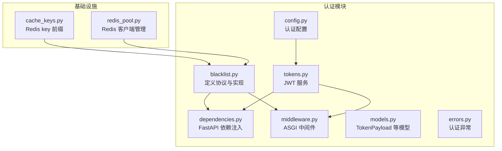
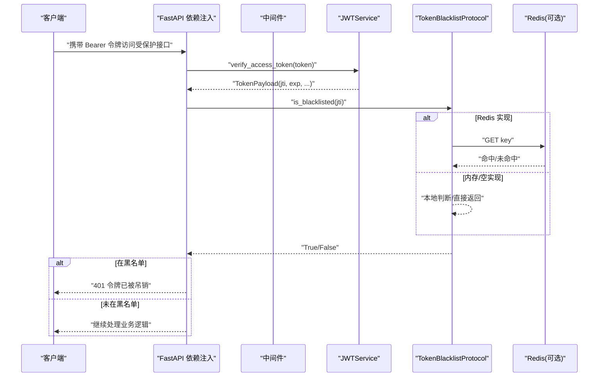
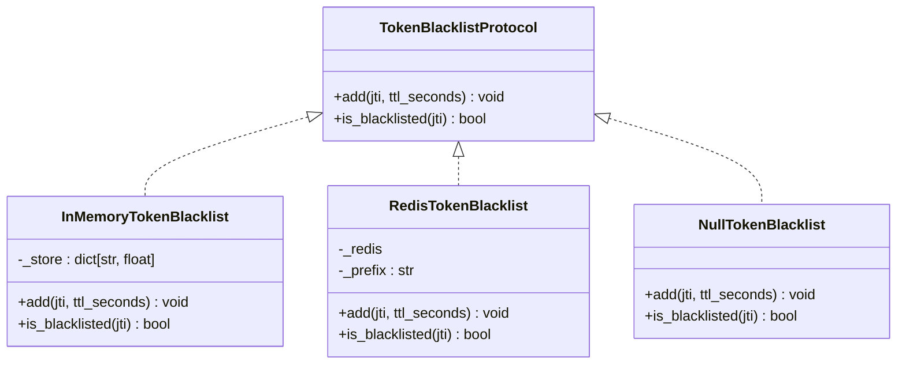
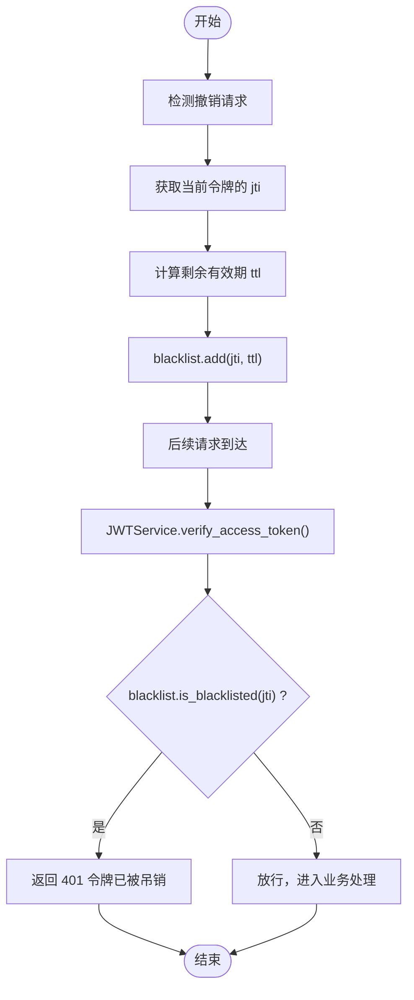
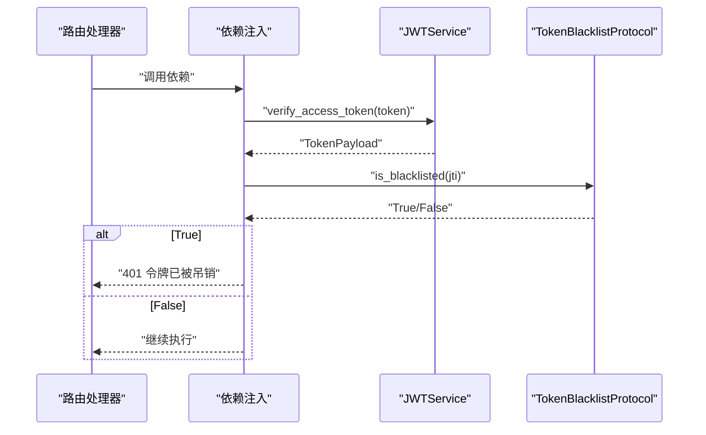
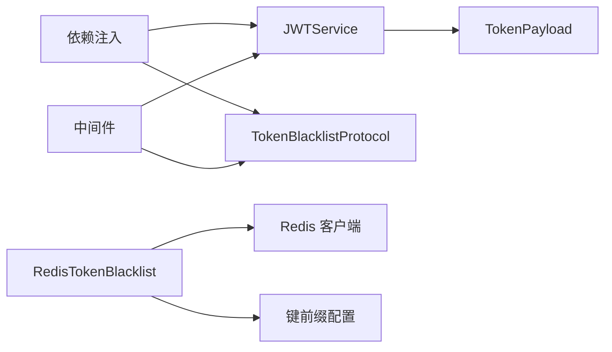
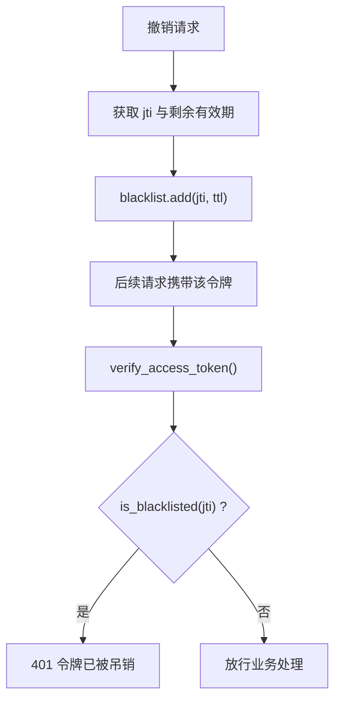

# 令牌黑名单系统

<cite>
**本文引用的文件**
- [blacklist.py](file://src/taolib/testing/auth/blacklist.py)
- [dependencies.py](file://src/taolib/testing/auth/fastapi/dependencies.py)
- [middleware.py](file://src/taolib/testing/auth/fastapi/middleware.py)
- [tokens.py](file://src/taolib/testing/auth/tokens.py)
- [models.py](file://src/taolib/testing/auth/models.py)
- [errors.py](file://src/taolib/testing/auth/errors.py)
- [config.py](file://src/taolib/testing/auth/config.py)
- [cache_keys.py](file://src/taolib/testing/_base/cache_keys.py)
- [redis_pool.py](file://src/taolib/testing/_base/redis_pool.py)
- [__init__.py](file://src/taolib/testing/auth/__init__.py)
- [test_blacklist.py](file://tests/testing/test_auth/test_blacklist.py)
</cite>

## 目录
1. [简介](#简介)
2. [项目结构](#项目结构)
3. [核心组件](#核心组件)
4. [架构总览](#架构总览)
5. [组件详解](#组件详解)
6. [依赖关系分析](#依赖关系分析)
7. [性能考量](#性能考量)
8. [故障排查指南](#故障排查指南)
9. [结论](#结论)
10. [附录](#附录)

## 简介
本文件为“令牌黑名单系统”的技术文档，聚焦于令牌撤销机制、黑名单存储策略与令牌有效性检查流程。文档详细说明了 TokenBlacklistProtocol 接口及三种实现：InMemoryTokenBlacklist、RedisTokenBlacklist、NullTokenBlacklist 的特点与适用场景；深入解析令牌撤销触发条件、黑名单更新机制与缓存策略；提供 Redis 集成配置、内存存储优化与分布式环境下黑名单同步方案；并给出性能、一致性与故障恢复方面的建议与最佳实践。

## 项目结构
黑名单系统位于认证模块 testing.auth 下，围绕 TokenBlacklistProtocol 接口提供多种实现，并与 FastAPI 依赖注入、中间件以及 JWT 服务紧密协作，形成完整的令牌验证与吊销检查链路。

图表来源
- [blacklist.py:1-113](file://src/taolib/testing/auth/blacklist.py#L1-L113)
- [dependencies.py:1-291](file://src/taolib/testing/auth/fastapi/dependencies.py#L1-L291)
- [middleware.py:1-173](file://src/taolib/testing/auth/fastapi/middleware.py#L1-L173)
- [tokens.py:1-237](file://src/taolib/testing/auth/tokens.py#L1-L237)
- [models.py:1-68](file://src/taolib/testing/auth/models.py#L1-L68)
- [errors.py:1-55](file://src/taolib/testing/auth/errors.py#L1-L55)
- [config.py:1-82](file://src/taolib/testing/auth/config.py#L1-L82)
- [cache_keys.py:1-70](file://src/taolib/testing/_base/cache_keys.py#L1-L70)
- [redis_pool.py:1-38](file://src/taolib/testing/_base/redis_pool.py#L1-L38)

章节来源
- [blacklist.py:1-113](file://src/taolib/testing/auth/blacklist.py#L1-L113)
- [dependencies.py:1-291](file://src/taolib/testing/auth/fastapi/dependencies.py#L1-L291)
- [middleware.py:1-173](file://src/taolib/testing/auth/fastapi/middleware.py#L1-L173)
- [tokens.py:1-237](file://src/taolib/testing/auth/tokens.py#L1-L237)
- [models.py:1-68](file://src/taolib/testing/auth/models.py#L1-L68)
- [errors.py:1-55](file://src/taolib/testing/auth/errors.py#L1-L55)
- [config.py:1-82](file://src/taolib/testing/auth/config.py#L1-L82)
- [cache_keys.py:1-70](file://src/taolib/testing/_base/cache_keys.py#L1-L70)
- [redis_pool.py:1-38](file://src/taolib/testing/_base/redis_pool.py#L1-L38)

## 核心组件
- TokenBlacklistProtocol：定义 add 与 is_blacklisted 两个异步方法，作为黑名单实现的统一契约。
- RedisTokenBlacklist：基于 Redis 的持久化黑名单，使用 SET + EX 命令，TTL 自动过期，适合分布式与高并发场景。
- InMemoryTokenBlacklist：基于内存字典的黑名单，自动清理过期项，适合单进程开发与测试。
- NullTokenBlacklist：空实现，始终返回 False，用于无需黑名单功能的场景。
- JWTService：负责令牌签发与校验，生成包含 jti 的 payload，为黑名单提供关键标识。
- FastAPI 依赖注入与中间件：在请求进入路由前进行认证与黑名单检查。
- 配置与键空间：AuthConfig 提供黑名单键前缀配置，cache_keys 统一 Redis 命名规范。

章节来源
- [blacklist.py:10-113](file://src/taolib/testing/auth/blacklist.py#L10-L113)
- [tokens.py:17-237](file://src/taolib/testing/auth/tokens.py#L17-L237)
- [dependencies.py:27-142](file://src/taolib/testing/auth/fastapi/dependencies.py#L27-L142)
- [middleware.py:71-173](file://src/taolib/testing/auth/fastapi/middleware.py#L71-L173)
- [config.py:12-82](file://src/taolib/testing/auth/config.py#L12-L82)
- [cache_keys.py:41-43](file://src/taolib/testing/_base/cache_keys.py#L41-L43)

## 架构总览
下图展示了令牌黑名单在认证流程中的位置与交互：

图表来源
- [dependencies.py:83-112](file://src/taolib/testing/auth/fastapi/dependencies.py#L83-L112)
- [middleware.py:116-148](file://src/taolib/testing/auth/fastapi/middleware.py#L116-L148)
- [blacklist.py:54-67](file://src/taolib/testing/auth/blacklist.py#L54-L67)
- [tokens.py:155-176](file://src/taolib/testing/auth/tokens.py#L155-L176)

## 组件详解

### TokenBlacklistProtocol 接口与三类实现
- 协议职责
  - add(jti, ttl_seconds)：将令牌加入黑名单，ttl_seconds 与令牌剩余有效期对齐。
  - is_blacklisted(jti)：检查令牌是否在黑名单中。
- 实现对比
  - InMemoryTokenBlacklist：内存字典 + 过期时间戳，检查时自动清理过期项；适合单进程与测试。
  - RedisTokenBlacklist：Redis SET + EX，键前缀来自配置；天然具备 TTL 过期，适合分布式。
  - NullTokenBlacklist：不做任何操作，is_blacklisted 总是 False；用于禁用黑名单功能。

图表来源
- [blacklist.py:11-113](file://src/taolib/testing/auth/blacklist.py#L11-L113)

章节来源
- [blacklist.py:10-113](file://src/taolib/testing/auth/blacklist.py#L10-L113)

### 令牌撤销机制与触发条件
- 触发条件
  - 用户主动登出（撤销当前 access_token 的 jti）
  - 安全事件（如账户异常、设备变更）
  - 管理员操作（批量或单个撤销）
- 撤销流程
  - 服务端在收到撤销请求后，调用 blacklist.add(jti, ttl) 将 jti 加入黑名单，ttl 与原令牌剩余有效期一致。
  - 后续请求携带该 jti 的令牌时，is_blacklisted 返回 True，认证层返回 401。

图表来源
- [dependencies.py:99-105](file://src/taolib/testing/auth/fastapi/dependencies.py#L99-L105)
- [middleware.py:122-129](file://src/taolib/testing/auth/fastapi/middleware.py#L122-L129)
- [tokens.py:155-176](file://src/taolib/testing/auth/tokens.py#L155-L176)
- [blacklist.py:54-67](file://src/taolib/testing/auth/blacklist.py#L54-L67)

章节来源
- [dependencies.py:83-112](file://src/taolib/testing/auth/fastapi/dependencies.py#L83-L112)
- [middleware.py:116-148](file://src/taolib/testing/auth/fastapi/middleware.py#L116-L148)
- [tokens.py:155-176](file://src/taolib/testing/auth/tokens.py#L155-L176)
- [blacklist.py:54-67](file://src/taolib/testing/auth/blacklist.py#L54-L67)

### 黑名单存储策略与缓存策略
- Redis 存储策略
  - 键命名：使用配置的 key_prefix 与 jti 组合，遵循统一前缀规范。
  - TTL：与令牌剩余有效期一致，Redis 自动过期，避免无限增长。
  - 读写：GET/SET 命令，简单高效。
- 内存存储策略
  - 字典存储 jti -> 过期时间戳；检查时若过期则删除并返回 False。
  - 适合单进程与测试，无需外部依赖。
- 缓存策略
  - 令牌撤销即刻生效，无需额外缓存层。
  - 分布式场景下，Redis 天然保证各节点一致性。

章节来源
- [blacklist.py:38-96](file://src/taolib/testing/auth/blacklist.py#L38-L96)
- [config.py:24-32](file://src/taolib/testing/auth/config.py#L24-L32)
- [cache_keys.py:41-43](file://src/taolib/testing/_base/cache_keys.py#L41-L43)

### 令牌有效性检查流程
- FastAPI 依赖注入
  - 优先尝试 Bearer 认证，失败则尝试 API Key（可选）。
  - JWT 成功后，若存在 jti，则调用 blacklist.is_blacklisted 检查。
  - 若在黑名单中，抛出 401 并提示“令牌已被吊销”。
- 中间件模式
  - 直接从 Authorization 头提取 Bearer 令牌，调用 JWTService.verify_access_token。
  - 检查黑名单，命中则返回 401。

图表来源
- [dependencies.py:83-112](file://src/taolib/testing/auth/fastapi/dependencies.py#L83-L112)

章节来源
- [dependencies.py:27-142](file://src/taolib/testing/auth/fastapi/dependencies.py#L27-L142)
- [middleware.py:71-173](file://src/taolib/testing/auth/fastapi/middleware.py#L71-L173)

### Redis 集成配置与客户端管理
- Redis 客户端
  - 通过 redis_pool.get_redis_client 获取单例客户端，默认连接本地 redis://localhost:6379。
  - 可根据部署环境传入 redis_url。
- 键前缀
  - 使用 cache_keys.AUTH_BLACKLIST_PREFIX 与 jti 组合生成键名。
  - AuthConfig.blacklist_key_prefix 可覆盖默认前缀。
- TTL 对齐
  - blacklist.add(jti, ttl_seconds) 传入的 ttl 与令牌剩余有效期保持一致，确保 Redis 自动过期。

章节来源
- [redis_pool.py:11-27](file://src/taolib/testing/_base/redis_pool.py#L11-L27)
- [cache_keys.py:41-43](file://src/taolib/testing/_base/cache_keys.py#L41-L43)
- [config.py:24-32](file://src/taolib/testing/auth/config.py#L24-L32)
- [blacklist.py:54-59](file://src/taolib/testing/auth/blacklist.py#L54-L59)

### 内存存储优化与分布式同步
- 内存优化
  - InMemoryTokenBlacklist 在 is_blacklisted 检查时自动清理过期项，避免内存泄漏。
  - 适合单进程与测试环境，无需网络开销。
- 分布式同步
  - RedisTokenBlacklist 天然支持多实例共享，无需额外同步。
  - 如需跨集群同步，可在业务侧引入发布订阅或事件总线，将撤销事件广播至各实例并更新本地缓存（可选扩展）。

章节来源
- [blacklist.py:70-96](file://src/taolib/testing/auth/blacklist.py#L70-L96)

### 使用示例与集成指南
- 基础用法
  - 通过 AuthConfig.from_env 从环境变量加载配置，包括 JWT 密钥、算法、令牌有效期与黑名单键前缀。
  - 使用 JWTService.create_token_pair 生成令牌对，其中 access_token 包含 jti。
- FastAPI 集成
  - 使用 create_auth_dependency 注入 jwt_service 与 blacklist（默认 NullTokenBlacklist）。
  - 在路由中直接依赖该依赖，即可自动进行 JWT 校验与黑名单检查。
- 中间件集成
  - 使用 SimpleAuthMiddleware 在中间件层进行认证与黑名单检查，适合不依赖依赖注入的场景。
- Redis 集成
  - 通过 redis_pool.get_redis_client 获取客户端，传入 RedisTokenBlacklist。
  - 确保 blacklist_key_prefix 与部署环境一致。

章节来源
- [config.py:34-82](file://src/taolib/testing/auth/config.py#L34-L82)
- [tokens.py:106-127](file://src/taolib/testing/auth/tokens.py#L106-L127)
- [dependencies.py:27-60](file://src/taolib/testing/auth/fastapi/dependencies.py#L27-L60)
- [middleware.py:71-98](file://src/taolib/testing/auth/fastapi/middleware.py#L71-L98)
- [redis_pool.py:11-27](file://src/taolib/testing/_base/redis_pool.py#L11-L27)

## 依赖关系分析
- 组件耦合
  - JWTService 与 TokenPayload 紧密关联，jti 为黑名单检查的关键字段。
  - FastAPI 依赖注入与中间件均依赖 TokenBlacklistProtocol，便于替换实现。
  - RedisTokenBlacklist 依赖 Redis 客户端与键前缀配置。
- 外部依赖
  - Redis：异步客户端 redis.asyncio。
  - JWT：jose 库进行编码与解码。
- 循环依赖
  - 未发现循环导入；模块职责清晰，接口契约明确。

图表来源
- [tokens.py:17-237](file://src/taolib/testing/auth/tokens.py#L17-L237)
- [dependencies.py:27-142](file://src/taolib/testing/auth/fastapi/dependencies.py#L27-L142)
- [middleware.py:71-173](file://src/taolib/testing/auth/fastapi/middleware.py#L71-L173)
- [blacklist.py:38-96](file://src/taolib/testing/auth/blacklist.py#L38-L96)
- [config.py:24-32](file://src/taolib/testing/auth/config.py#L24-L32)
- [cache_keys.py:41-43](file://src/taolib/testing/_base/cache_keys.py#L41-L43)

章节来源
- [__init__.py:35-83](file://src/taolib/testing/auth/__init__.py#L35-L83)

## 性能考量
- 查询复杂度
  - 内存实现：平均 O(1)，检查时清理过期项，摊销后仍近似 O(1)。
  - Redis 实现：GET 命令 O(1)，TTL 自动过期，无内存泄漏风险。
- 写入复杂度
  - Redis SET + EX：O(1)，TTL 与令牌有效期对齐，避免冗余数据。
- 并发与一致性
  - Redis 天然支持高并发读取，黑名单状态在多实例间一致。
  - 内存实现仅限单进程，适合测试与开发。
- 缓存命中率
  - 令牌撤销即时生效，无需额外缓存；Redis 的 TTL 已满足生命周期管理。

[本节为通用性能讨论，不直接分析具体文件]

## 故障排查指南
- 常见问题
  - 401 令牌已被吊销：确认是否已调用 blacklist.add 撤销该 jti；检查 Redis 中是否存在对应键；核对 TTL 是否过短。
  - 令牌未被识别为黑名单：确认 jti 是否为空；确认 Redis 键前缀与配置一致。
  - Redis 连接失败：检查 redis_url 与网络连通性；确认 get_redis_client 初始化成功。
- 测试参考
  - 内存黑名单测试覆盖添加、查询、空 jti、零/负 TTL 等边界条件。
  - Redis 黑名单测试使用 Mock Redis，验证键格式与跳过零 TTL 的行为。

章节来源
- [test_blacklist.py:12-121](file://tests/testing/test_auth/test_blacklist.py#L12-L121)
- [errors.py:34-38](file://src/taolib/testing/auth/errors.py#L34-L38)

## 结论
令牌黑名单系统通过 TokenBlacklistProtocol 抽象，结合 InMemoryTokenBlacklist、RedisTokenBlacklist 与 NullTokenBlacklist 三种实现，满足从开发测试到生产部署的多样化需求。配合 JWTService 的 jti 生成与 FastAPI 依赖注入/中间件的认证流程，实现了高效的令牌撤销与有效性检查。Redis 实现具备天然的 TTL 过期与分布式一致性优势；内存实现简洁高效，适合单进程场景。通过合理的键前缀与 TTL 对齐策略，系统在性能、一致性与可维护性之间取得良好平衡。

[本节为总结性内容，不直接分析具体文件]

## 附录

### 关键流程图：令牌撤销与检查

图表来源
- [tokens.py:155-176](file://src/taolib/testing/auth/tokens.py#L155-L176)
- [dependencies.py:99-105](file://src/taolib/testing/auth/fastapi/dependencies.py#L99-L105)
- [middleware.py:122-129](file://src/taolib/testing/auth/fastapi/middleware.py#L122-L129)