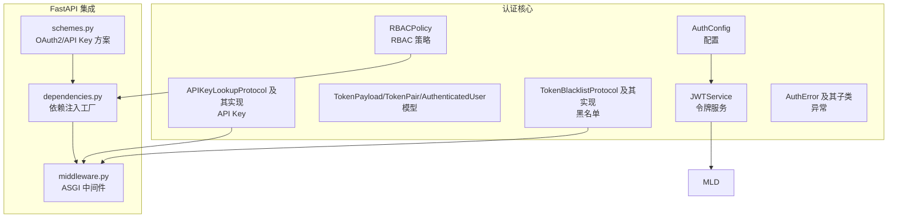
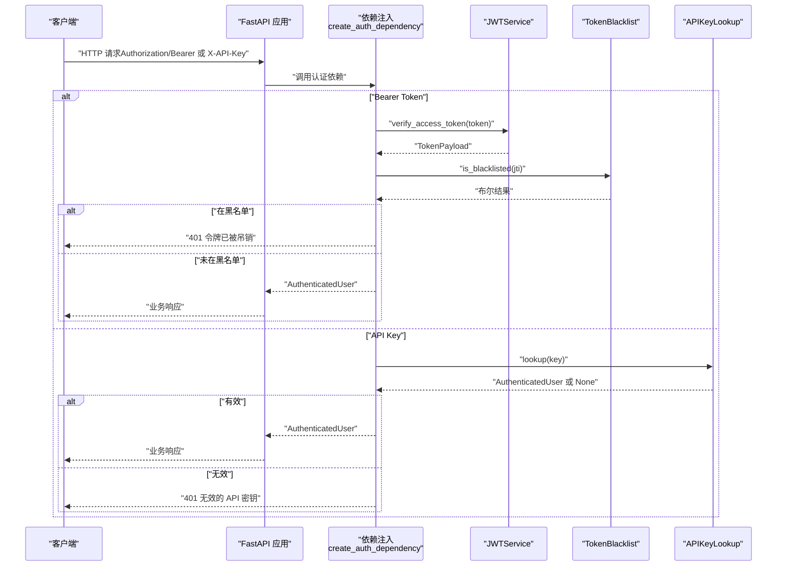
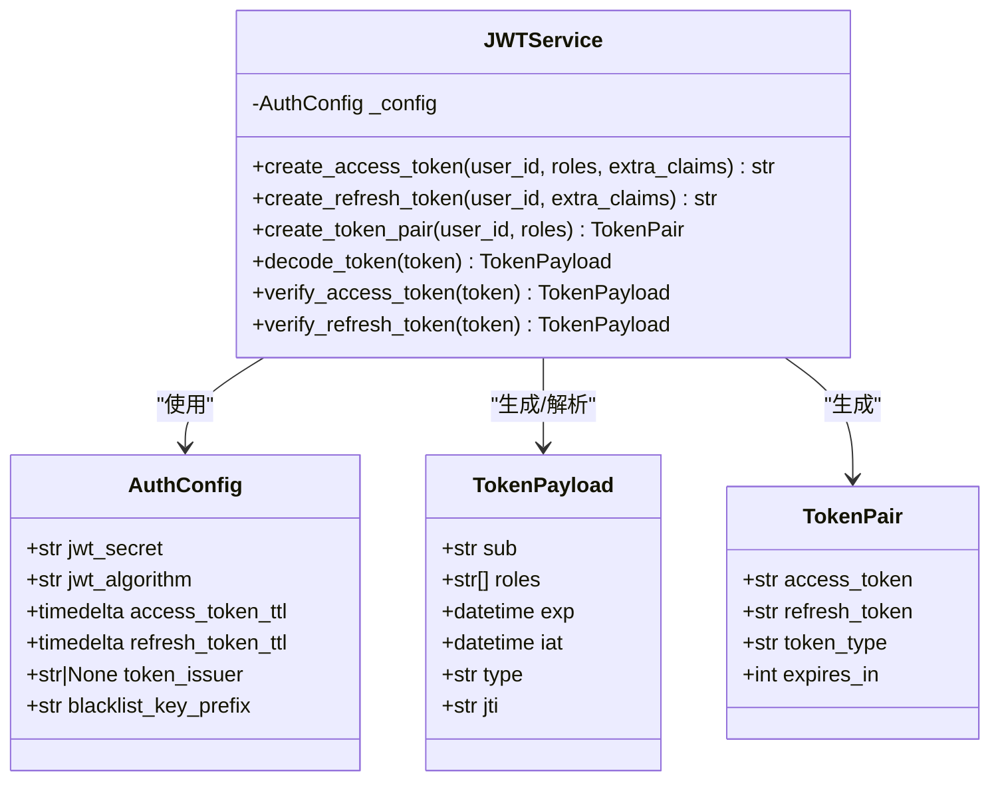
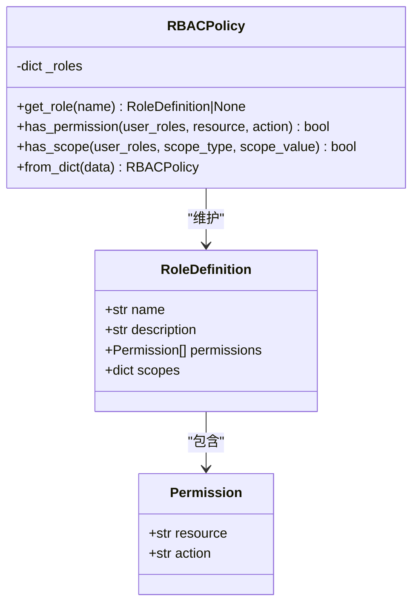
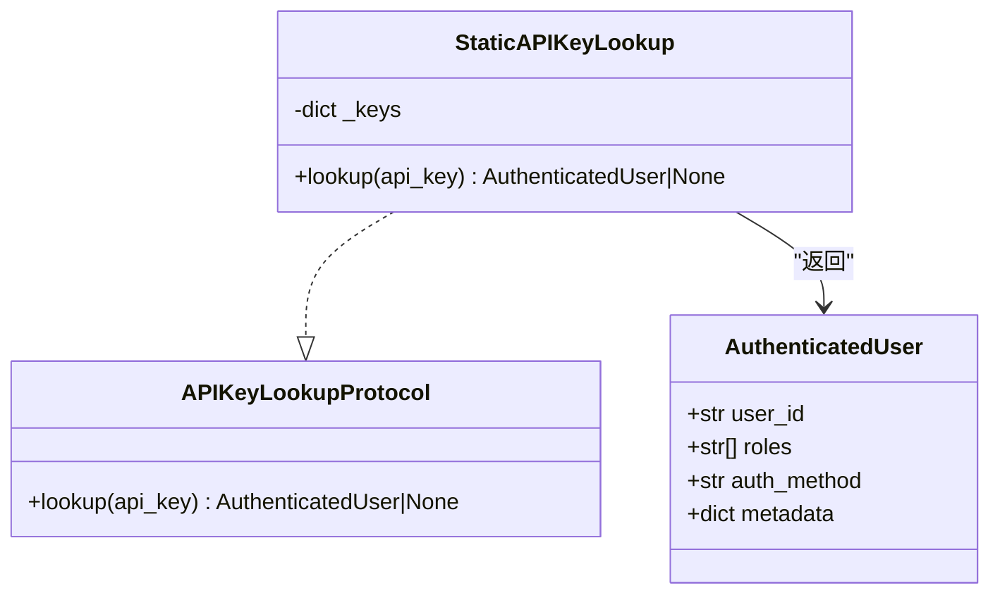
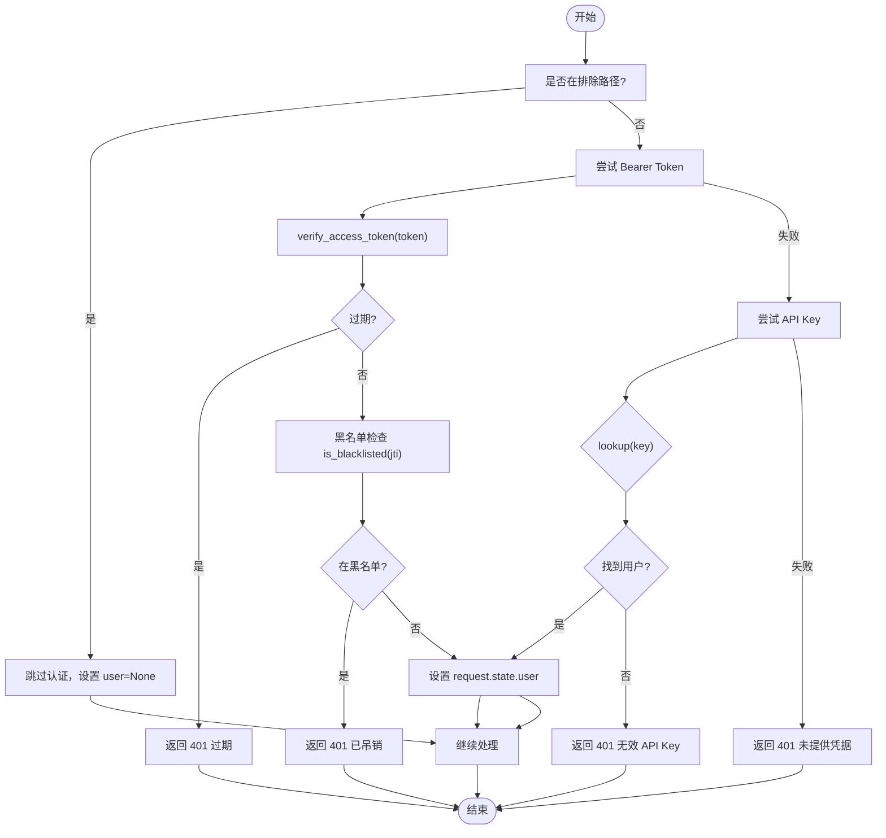
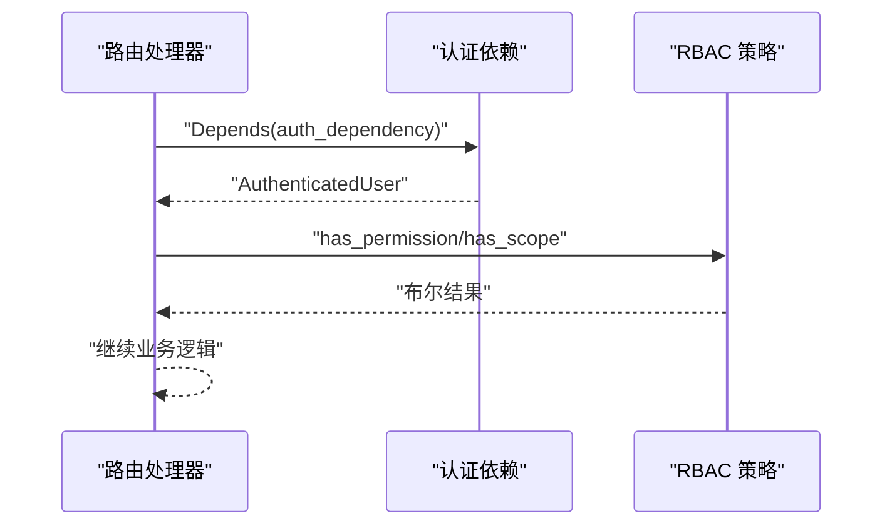
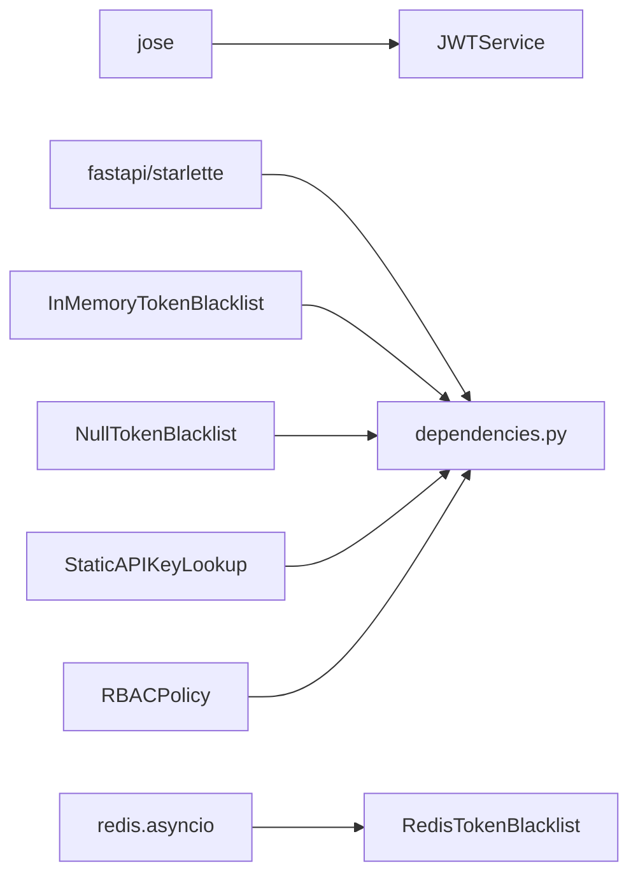

# 认证授权系统

<cite>
**本文档引用的文件**
- [__init__.py](file://src/taolib/testing/auth/__init__.py)
- [config.py](file://src/taolib/testing/auth/config.py)
- [models.py](file://src/taolib/testing/auth/models.py)
- [rbac.py](file://src/taolib/testing/auth/rbac.py)
- [tokens.py](file://src/taolib/testing/auth/tokens.py)
- [blacklist.py](file://src/taolib/testing/auth/blacklist.py)
- [api_key.py](file://src/taolib/testing/auth/api_key.py)
- [errors.py](file://src/taolib/testing/auth/errors.py)
- [middleware.py](file://src/taolib/testing/auth/fastapi/middleware.py)
- [dependencies.py](file://src/taolib/testing/auth/fastapi/dependencies.py)
- [schemes.py](file://src/taolib/testing/auth/fastapi/schemes.py)
- [test_tokens.py](file://tests/testing/test_auth/test_tokens.py)
- [test_rbac.py](file://tests/testing/test_auth/test_rbac.py)
- [test_blacklist.py](file://tests/testing/test_auth/test_blacklist.py)
- [test_api_key.py](file://tests/testing/test_auth/test_api_key.py)
</cite>

## 目录
1. [简介](#简介)
2. [项目结构](#项目结构)
3. [核心组件](#核心组件)
4. [架构总览](#架构总览)
5. [详细组件分析](#详细组件分析)
6. [依赖关系分析](#依赖关系分析)
7. [性能考量](#性能考量)
8. [故障排除指南](#故障排除指南)
9. [结论](#结论)
10. [附录](#附录)

## 简介
本文件为认证授权系统的全面技术文档，覆盖以下主题：
- JWT 令牌管理机制：令牌创建、解码、验证与吊销（黑名单）
- RBAC 权限控制系统：基于角色的权限与作用域校验
- API 密钥认证：双通道认证（Bearer + API Key）
- 黑名单机制：内存、Redis 与空实现三种策略
- FastAPI 集成：依赖注入、认证中间件与自定义认证方案
- 安全最佳实践、性能优化与故障排除

## 项目结构
认证授权子系统位于 src/taolib/testing/auth 及其 fastapi 集成层，采用“协议 + 多实现”的设计，便于替换存储后端与认证通道。

图表来源
- [config.py:12-33](file://src/taolib/testing/auth/config.py#L12-L33)
- [tokens.py:17-33](file://src/taolib/testing/auth/tokens.py#L17-L33)
- [models.py:11-66](file://src/taolib/testing/auth/models.py#L11-L66)
- [blacklist.py:10-36](file://src/taolib/testing/auth/blacklist.py#L10-L36)
- [api_key.py:11-28](file://src/taolib/testing/auth/api_key.py#L11-L28)
- [rbac.py:41-52](file://src/taolib/testing/auth/rbac.py#L41-L52)
- [errors.py:7-55](file://src/taolib/testing/auth/errors.py#L7-L55)
- [schemes.py:9-39](file://src/taolib/testing/auth/fastapi/schemes.py#L9-L39)
- [dependencies.py:27-142](file://src/taolib/testing/auth/fastapi/dependencies.py#L27-L142)
- [middleware.py:20-173](file://src/taolib/testing/auth/fastapi/middleware.py#L20-L173)

章节来源
- [__init__.py:1-86](file://src/taolib/testing/auth/__init__.py#L1-L86)
- [config.py:12-82](file://src/taolib/testing/auth/config.py#L12-L82)
- [models.py:11-68](file://src/taolib/testing/auth/models.py#L11-L68)
- [rbac.py:41-160](file://src/taolib/testing/auth/rbac.py#L41-L160)
- [tokens.py:17-237](file://src/taolib/testing/auth/tokens.py#L17-L237)
- [blacklist.py:10-113](file://src/taolib/testing/auth/blacklist.py#L10-L113)
- [api_key.py:11-48](file://src/taolib/testing/auth/api_key.py#L11-L48)
- [errors.py:7-55](file://src/taolib/testing/auth/errors.py#L7-L55)
- [schemes.py:9-41](file://src/taolib/testing/auth/fastapi/schemes.py#L9-L41)
- [dependencies.py:27-291](file://src/taolib/testing/auth/fastapi/dependencies.py#L27-L291)
- [middleware.py:20-173](file://src/taolib/testing/auth/fastapi/middleware.py#L20-L173)

## 核心组件
- 配置层：AuthConfig 提供不可变配置，支持从环境变量加载，强制最小密钥长度与可选签发者
- 令牌层：JWTService 提供 Access/Refresh 令牌创建、解码与类型验证，并兼容旧版令牌字段
- 黑名单层：TokenBlacklistProtocol 及其实现（Redis、内存、空实现），支持按 jti 进行吊销
- API Key 层：APIKeyLookupProtocol 及 StaticAPIKeyLookup，支持静态配置的 API Key 查找
- RBAC 层：RBACPolicy 提供权限与作用域校验，支持从字典构建策略
- FastAPI 集成：依赖注入工厂、安全方案与中间件，支持双通道认证与权限检查

章节来源
- [config.py:12-82](file://src/taolib/testing/auth/config.py#L12-L82)
- [tokens.py:17-237](file://src/taolib/testing/auth/tokens.py#L17-L237)
- [blacklist.py:10-113](file://src/taolib/testing/auth/blacklist.py#L10-L113)
- [api_key.py:11-48](file://src/taolib/testing/auth/api_key.py#L11-L48)
- [rbac.py:41-160](file://src/taolib/testing/auth/rbac.py#L41-L160)
- [dependencies.py:27-291](file://src/taolib/testing/auth/fastapi/dependencies.py#L27-L291)
- [middleware.py:20-173](file://src/taolib/testing/auth/fastapi/middleware.py#L20-L173)

## 架构总览
系统采用“无状态 JWT + 可插拔黑名单 + 多认证通道”的架构，支持在 FastAPI 中通过依赖注入与中间件无缝集成。

图表来源
- [dependencies.py:27-142](file://src/taolib/testing/auth/fastapi/dependencies.py#L27-L142)
- [tokens.py:129-199](file://src/taolib/testing/auth/tokens.py#L129-L199)
- [blacklist.py:26-36](file://src/taolib/testing/auth/blacklist.py#L26-L36)
- [api_key.py:18-27](file://src/taolib/testing/auth/api_key.py#L18-L27)

## 详细组件分析

### JWT 令牌管理机制
- 令牌类型与载荷
  - Access Token：包含 sub、roles、exp、iat、type="access"、jti；可选 iss
  - Refresh Token：包含 sub、exp、iat、type="refresh"、jti；roles 为空
- 令牌创建
  - create_access_token/create_refresh_token：基于 AuthConfig 生成签名
  - create_token_pair：一次性生成令牌对
- 令牌验证
  - decode_token：通用解码，区分过期与无效
  - verify_access_token/verify_refresh_token：类型校验
- 兼容性
  - _payload_from_dict：兼容旧版令牌（无 jti/iat）

图表来源
- [config.py:12-33](file://src/taolib/testing/auth/config.py#L12-L33)
- [tokens.py:17-237](file://src/taolib/testing/auth/tokens.py#L17-L237)
- [models.py:11-66](file://src/taolib/testing/auth/models.py#L11-L66)

章节来源
- [tokens.py:17-237](file://src/taolib/testing/auth/tokens.py#L17-L237)
- [models.py:11-66](file://src/taolib/testing/auth/models.py#L11-L66)
- [config.py:12-82](file://src/taolib/testing/auth/config.py#L12-L82)
- [test_tokens.py:14-225](file://tests/testing/test_auth/test_tokens.py#L14-L225)

### RBAC 权限控制系统
- 角色与权限
  - RoleDefinition：角色名、描述、权限集合、作用域映射
  - Permission：资源与动作
- 策略引擎
  - has_permission：用户任一角色具备资源+动作即通过
  - has_scope：用户任一角色在指定作用域内即通过（None 表示无限制）
  - from_dict：从字典构建策略，兼容枚举值与作用域键

图表来源
- [rbac.py:10-160](file://src/taolib/testing/auth/rbac.py#L10-L160)

章节来源
- [rbac.py:41-160](file://src/taolib/testing/auth/rbac.py#L41-L160)
- [test_rbac.py:8-195](file://tests/testing/test_auth/test_rbac.py#L8-L195)

### API 密钥管理与认证
- 协议
  - APIKeyLookupProtocol：lookup(api_key) -> AuthenticatedUser | None
- 实现
  - StaticAPIKeyLookup：基于静态字典的查找
- FastAPI 集成
  - create_api_key_header：创建 API Key Header 安全方案
  - create_auth_dependency：支持 Bearer 与 API Key 双通道

图表来源
- [api_key.py:11-48](file://src/taolib/testing/auth/api_key.py#L11-L48)
- [models.py:32-48](file://src/taolib/testing/auth/models.py#L32-L48)

章节来源
- [api_key.py:11-48](file://src/taolib/testing/auth/api_key.py#L11-L48)
- [test_api_key.py:9-70](file://tests/testing/test_auth/test_api_key.py#L9-L70)

### 黑名单机制与吊销
- 协议
  - TokenBlacklistProtocol：add(jti, ttl_seconds)、is_blacklisted(jti)
- 实现
  - RedisTokenBlacklist：使用 Redis SET + EX，键带前缀
  - InMemoryTokenBlacklist：内存字典 + 过期清理
  - NullTokenBlacklist：空操作，始终返回 False
- FastAPI 集成
  - create_auth_dependency：在 JWT 验证后检查黑名单
  - SimpleAuthMiddleware：中间件模式直接认证

图表来源
- [middleware.py:71-173](file://src/taolib/testing/auth/fastapi/middleware.py#L71-L173)
- [dependencies.py:27-142](file://src/taolib/testing/auth/fastapi/dependencies.py#L27-L142)
- [blacklist.py:10-113](file://src/taolib/testing/auth/blacklist.py#L10-L113)

章节来源
- [blacklist.py:10-113](file://src/taolib/testing/auth/blacklist.py#L10-L113)
- [test_blacklist.py:12-121](file://tests/testing/test_auth/test_blacklist.py#L12-L121)
- [middleware.py:71-173](file://src/taolib/testing/auth/fastapi/middleware.py#L71-L173)
- [dependencies.py:27-142](file://src/taolib/testing/auth/fastapi/dependencies.py#L27-L142)

### FastAPI 集成与依赖注入
- 安全方案
  - create_oauth2_scheme：Bearer 方案，auto_error=False 支持双通道
  - create_api_key_header：自定义头部 X-API-Key，auto_error=False
- 依赖注入
  - create_auth_dependency：统一认证入口，支持 JWT 与 API Key
  - require_roles/require_permissions/require_scope：权限与作用域检查
- 中间件
  - SimpleAuthMiddleware：在 ASGI 层直接认证，无需依赖注入

图表来源
- [dependencies.py:161-291](file://src/taolib/testing/auth/fastapi/dependencies.py#L161-L291)
- [schemes.py:9-41](file://src/taolib/testing/auth/fastapi/schemes.py#L9-L41)

章节来源
- [schemes.py:9-41](file://src/taolib/testing/auth/fastapi/schemes.py#L9-L41)
- [dependencies.py:27-291](file://src/taolib/testing/auth/fastapi/dependencies.py#L27-L291)
- [middleware.py:71-173](file://src/taolib/testing/auth/fastapi/middleware.py#L71-L173)

## 依赖关系分析
- 组件内聚与耦合
  - JWTService 仅依赖 AuthConfig 与 jose 库，低耦合
  - RBACPolicy 仅依赖 RoleDefinition/Permission，纯数据结构
  - 黑名单与 API Key 通过 Protocol 解耦具体实现
- 外部依赖
  - jose：JWT 编解码与校验
  - fastapi/starlette：依赖注入与中间件
  - redis.asyncio（可选）：Redis 黑名单后端

图表来源
- [tokens.py:10-14](file://src/taolib/testing/auth/tokens.py#L10-L14)
- [dependencies.py:9-22](file://src/taolib/testing/auth/fastapi/dependencies.py#L9-L22)
- [blacklist.py:38-68](file://src/taolib/testing/auth/blacklist.py#L38-L68)
- [api_key.py:30-46](file://src/taolib/testing/auth/api_key.py#L30-L46)
- [rbac.py:41-52](file://src/taolib/testing/auth/rbac.py#L41-L52)

章节来源
- [tokens.py:10-14](file://src/taolib/testing/auth/tokens.py#L10-L14)
- [dependencies.py:9-22](file://src/taolib/testing/auth/fastapi/dependencies.py#L9-L22)
- [blacklist.py:38-68](file://src/taolib/testing/auth/blacklist.py#L38-L68)
- [api_key.py:30-46](file://src/taolib/testing/auth/api_key.py#L30-L46)
- [rbac.py:41-52](file://src/taolib/testing/auth/rbac.py#L41-L52)

## 性能考量
- 令牌验证
  - 本地 HS256 解码，CPU 密集度低；避免频繁过期检查
- 黑名单
  - Redis 黑名单：网络延迟取决于 Redis 部署；TTL 自动过期避免膨胀
  - 内存黑名单：单机适用，自动清理过期条目
- RBAC
  - 策略查询为线性遍历角色与权限，建议角色与权限数量可控
- FastAPI
  - 依赖注入与中间件开销极小；建议在路由层复用认证依赖

## 故障排除指南
- 常见错误与定位
  - TokenExpiredError：检查令牌过期时间与服务器时间同步
  - TokenInvalidError：检查密钥、算法与签名一致性
  - TokenBlacklistedError：确认 jti 是否正确传递与黑名单写入
  - InsufficientPermissionError：核对用户角色与 RBAC 策略
  - APIKeyInvalidError：确认 API Key 是否存在于查找表
- 排查步骤
  - 启用调试日志，记录 request.state.user 与认证路径
  - 校验 AuthConfig 配置（密钥长度、算法、issuer）
  - 验证黑名单后端连接与键前缀
  - 使用测试用例对照行为（参考测试文件）

章节来源
- [errors.py:7-55](file://src/taolib/testing/auth/errors.py#L7-L55)
- [test_tokens.py:169-225](file://tests/testing/test_auth/test_tokens.py#L169-L225)
- [test_blacklist.py:12-121](file://tests/testing/test_auth/test_blacklist.py#L12-L121)
- [test_rbac.py:8-195](file://tests/testing/test_auth/test_rbac.py#L8-L195)
- [test_api_key.py:9-70](file://tests/testing/test_auth/test_api_key.py#L9-L70)

## 结论
本认证授权系统以“无状态 JWT + 可插拔黑名单 + 多认证通道”为核心，结合 RBAC 策略与 FastAPI 依赖注入，提供了高内聚、低耦合且易于扩展的安全框架。通过协议抽象与多种实现，可在不同部署环境下灵活选择存储与认证方式。

## 附录
- 快速集成要点
  - 初始化 AuthConfig（建议从环境变量加载）
  - 创建 JWTService
  - 选择黑名单实现（Redis/内存/空实现）
  - 通过 create_auth_dependency 注入认证依赖
  - 使用 require_roles/require_permissions/require_scope 进行权限控制
- 安全最佳实践
  - 使用足够长度的密钥（≥32 字符）
  - 合理设置令牌 TTL，启用刷新令牌
  - 使用黑名单机制快速吊销令牌
  - 严格控制 API Key 的分发与轮换
  - 对敏感路由启用 RBAC 作用域限制